# Ansible 教程：第9章：使用模板 🧩

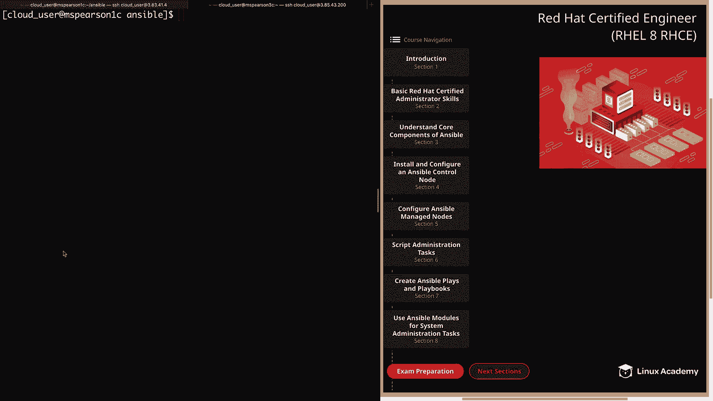

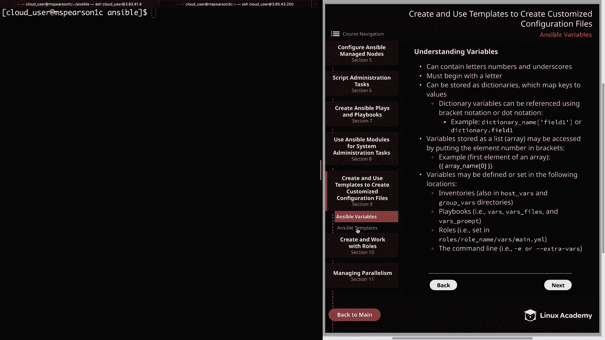

在本节课中，我们将学习如何使用 Ansible 模板来创建和管理自定义的配置文件。模板允许我们结合静态内容和动态变量，从而高效、一致地将配置推送到多台服务器。

---

## 什么是模板？

模板是包含静态值和动态变量的文件。其强大之处在于，你可以创建一个基础文件，然后利用变量根据目标主机的不同或自定义的变量来动态生成文件内容。Ansible 使用 **Jinja2** 模板引擎来处理这些文件。

核心概念可以表示为：
*   **模板文件** = **静态内容** + **{{ 动态变量 }}**

---

## 模板基础

上一节我们介绍了模板的概念，本节中我们来看看使用模板的一些具体细节。

模板文件通常使用 `.j2` 作为扩展名，这表示它是一个 Jinja2 模板。
模板常用于管理配置文件，因为它消除了手动更新配置的需要（手动操作容易出错），并且可以轻松地将配置推送到多个主机，具有良好的可扩展性。
模板可以访问调用它的 Playbook 中的所有变量，包括 Ansible 收集的远程服务器事实（facts）、为主机或组定义的变量，以及在 Playbook 中专门定义的变量。

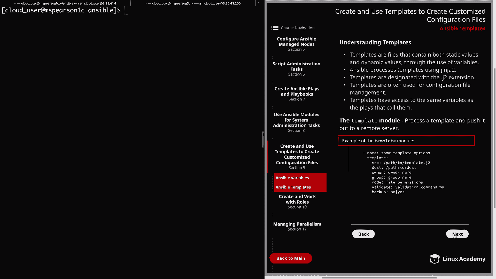

---

## 模板模块

要将创建好的模板推送到被管理服务器，我们需要使用 `template` 模块。这个模块负责处理模板文件并将其复制到远程服务器。

以下是 `template` 模块的一个示例，展示了其主要参数：

```yaml
- name: 推送配置文件模板
  template:
    src: /path/to/template.j2        # 模板源文件路径
    dest: /etc/someapp/config.conf   # 远程服务器目标路径
    owner: root                      # 文件所有者
    group: root                      # 文件所属组
    mode: '0644'                     # 文件权限
    validate: /usr/sbin/command -t %s # 语法验证命令
    backup: yes                      # 是否备份原文件
```

以下是各参数的简要说明：
*   **src**: 模板文件在控制节点上的路径。
*   **dest**: 文件在远程服务器上的目标路径。
*   **owner/group/mode**: 设置文件的所有者、所属组和权限。
*   **validate**: 一个可选的验证命令，用于在部署前检查生成文件的语法是否正确。`%s` 会被替换为临时文件路径。
*   **backup**: 设置为 `yes` 时，会在覆盖前备份原始文件，以防万一。

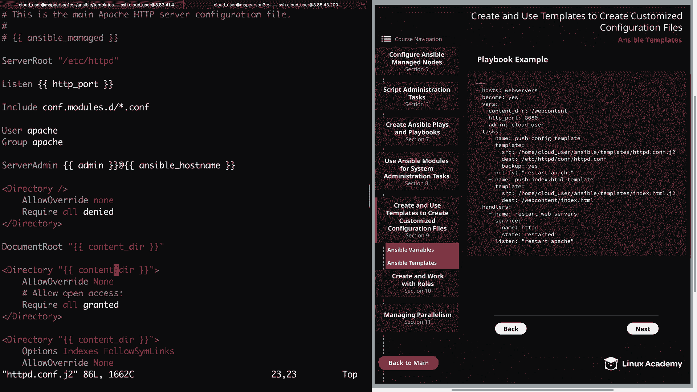

---

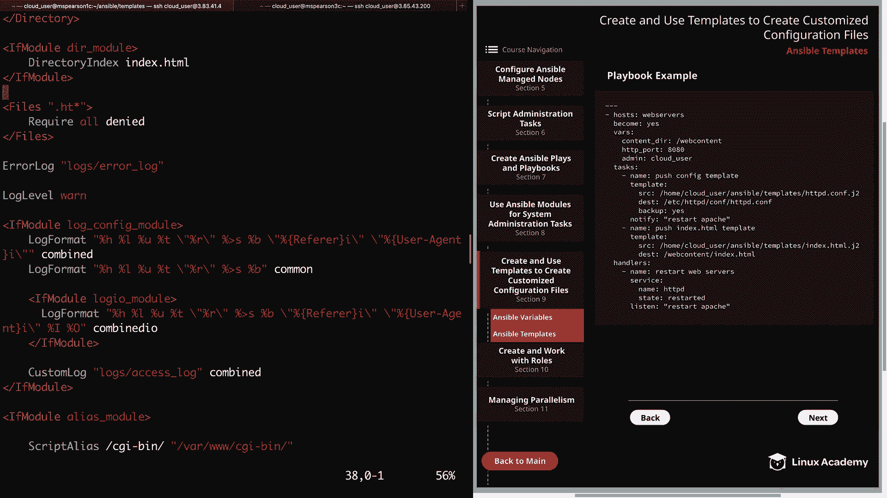

## 实践示例：Apache 配置

现在，让我们通过一个具体的例子来看看如何创建和使用模板。我们将为 Apache Web 服务器创建两个模板：主配置文件和一个 HTML 首页。

### 1. Apache 配置文件模板 (`httpd.conf.j2`)

这个模板基于标准的 Apache 配置文件，我们移除了注释并插入了变量。

```jinja2
# {{ ansible_managed }} - 主 HTTP 服务器配置文件
...
Listen {{ http_port }}
...
ServerAdmin {{ admin }}@{{ ansible_hostname }}
...
DocumentRoot "{{ content_dir }}"
<Directory "{{ content_dir }}">
...
```

在这个模板中：
*   `{{ ansible_managed }}` 是一个特殊变量，用于标记文件由 Ansible 管理。
*   `{{ http_port }}`、`{{ admin }}`、`{{ content_dir }}` 是我们将在 Playbook 中定义的变量。
*   `{{ ansible_hostname }}` 是由 Ansible 事实收集提供的变量。

### 2. HTML 首页模板 (`index.html.j2`)

这个模板用于生成一个显示系统信息的简单 HTML 页面。

```jinja2
<h1>Welcome to {{ ansible_hostname }}!</h1>
<p>The IPv4 address is set to: {{ ansible_default_ipv4.address }}</p>
<p>Current memory usage is {{ ansible_memtotal_mb - ansible_memfree_mb }} MB out of {{ ansible_memtotal_mb }} MB total.</p>
<p>The {{ ansible_devices.keys() | first }} block device has the following partitions:</p>
<ul>

  <li>- {{ part }}</li>

</ul>
```

此模板使用了：
*   变量：如 `{{ ansible_hostname }}`。
*   过滤器：如 `| first` 用于获取第一个键。
*   Jinja2 控制结构：如 `` 循环。

---

## 编写 Playbook

有了模板之后，我们需要一个 Playbook 来定义变量并执行部署任务。

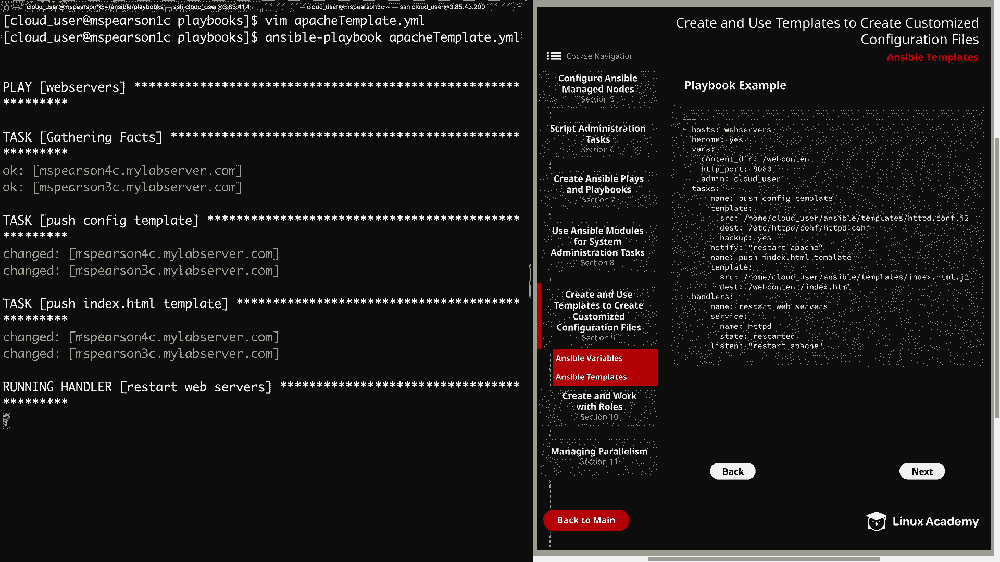

```yaml
---
- name: 部署 Apache 模板
  hosts: webservers
  become: yes
  vars:
    content_dir: /web_content
    http_port: 8080
    admin: cloud_user

  tasks:
    - name: 推送配置模板
      template:
        src: templates/httpd.conf.j2
        dest: /etc/httpd/conf/httpd.conf
        backup: yes
      notify: restart apache

    - name: 推送首页模板
      template:
        src: templates/index.html.j2
        dest: "{{ content_dir }}/index.html"

  handlers:
    - name: restart apache
      service:
        name: httpd
        state: restarted
```

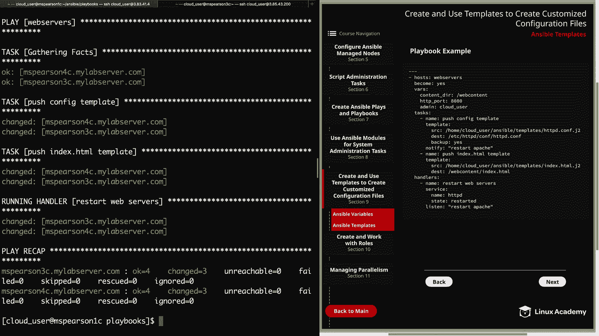

在这个 Playbook 中：
*   我们在 `vars` 部分定义了模板中使用的变量。
*   第一个任务使用 `template` 模块推送 Apache 配置，如果文件被更改，则通过 `notify` 触发处理器重启 Apache 服务。
*   第二个任务推送 HTML 首页文件。
*   `handlers` 部分定义了重启 Apache 服务的操作。

---

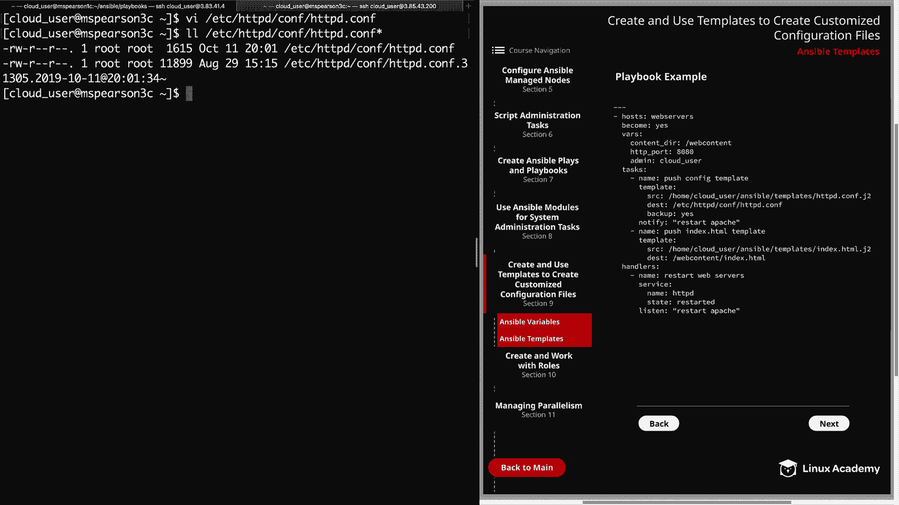

## 运行与验证

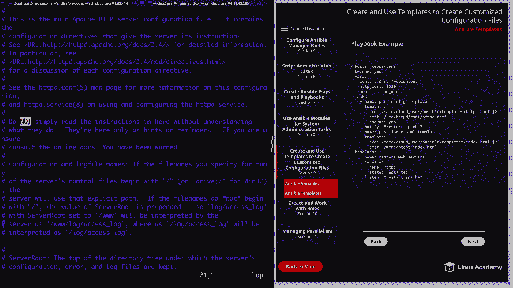

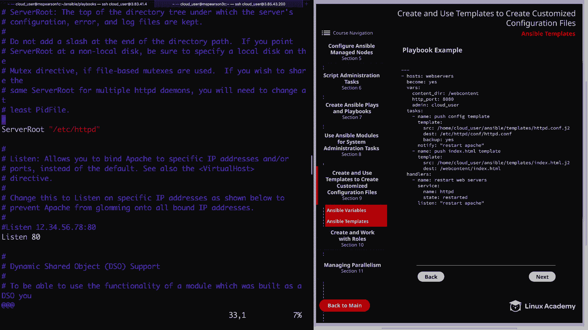

运行 Playbook 后，我们可以登录到目标服务器进行验证。

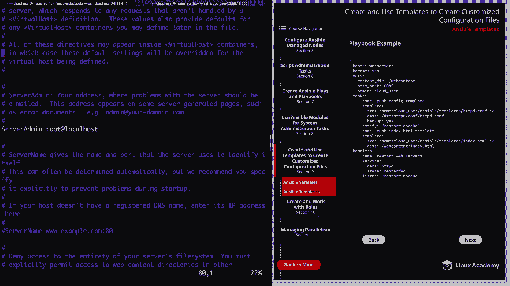

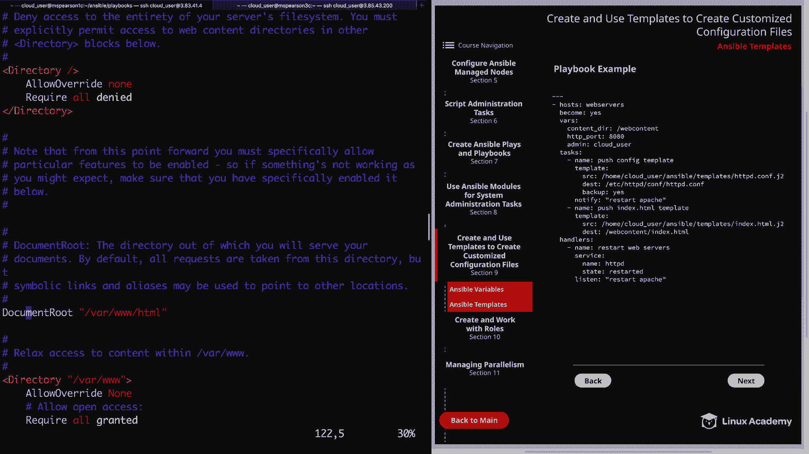

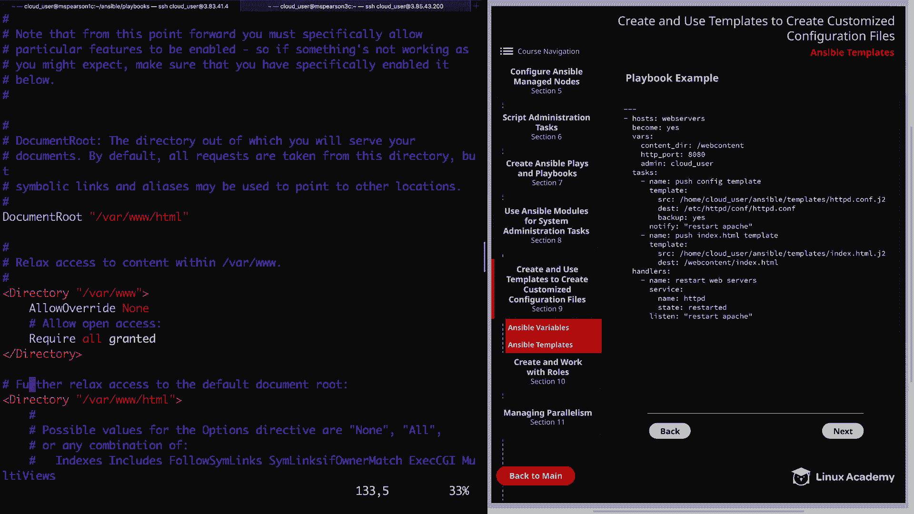

1.  检查生成的 `/etc/httpd/conf/httpd.conf`，确认所有变量（如 `Listen 8080`， `DocumentRoot "/web_content"`）都已正确替换。
2.  检查备份文件（如 `httpd.conf.12345.backup`）是否存在，其中应包含原始配置。
3.  检查生成的 `/web_content/index.html` 文件，确认系统信息已动态生成。
4.  最后，使用 `curl http://<服务器地址>:8080` 命令，验证 Apache 服务正在使用新配置和首页正常运行。

---

## 总结

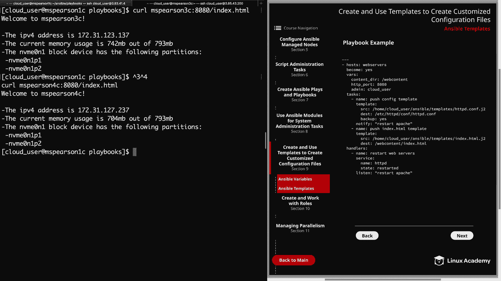

本节课中我们一起学习了 Ansible 模板的核心用法。我们了解到，模板（`.j2` 文件）通过结合静态文本和动态变量（使用 `{{ }}` 语法），能够灵活地生成配置文件。`template` 模块是推送模板的核心工具，它提供了丰富的参数来控制文件属性和进行安全备份。通过定义变量并在 Playbook 中调用模板，我们可以实现配置管理的自动化、标准化和规模化，大大提升了运维效率和可靠性。