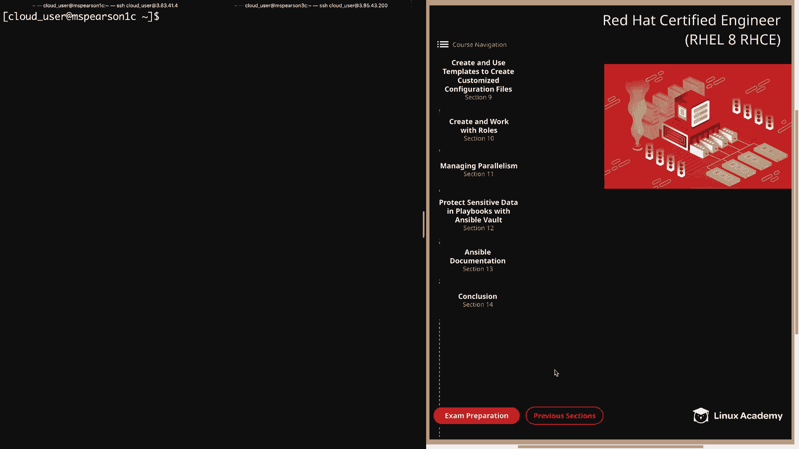
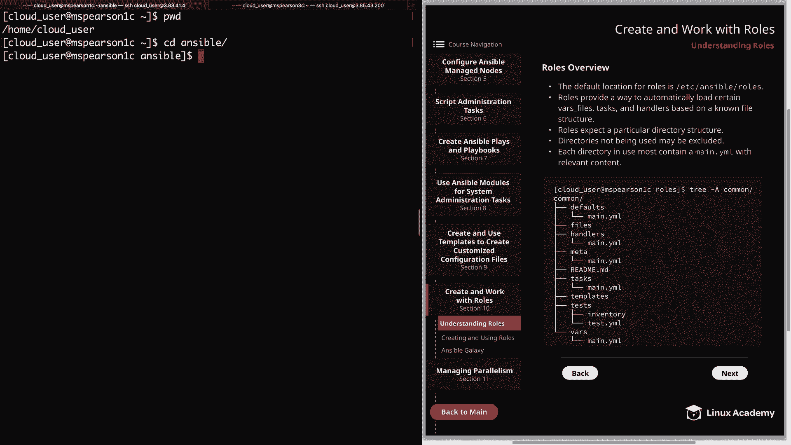
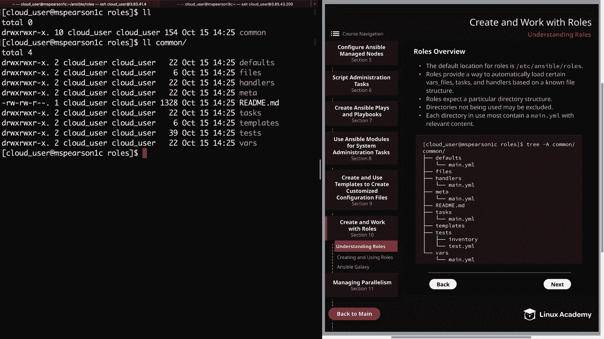
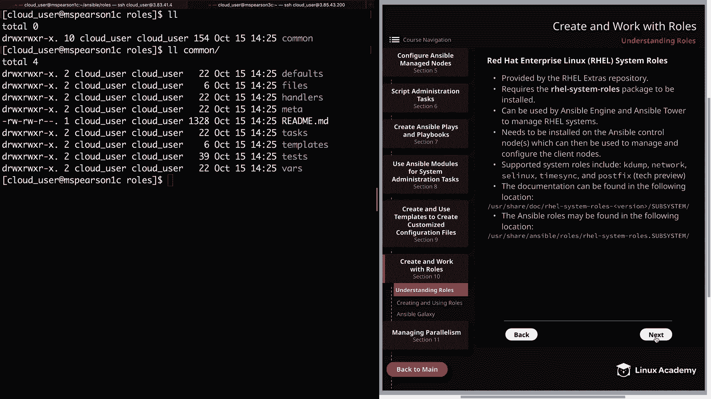
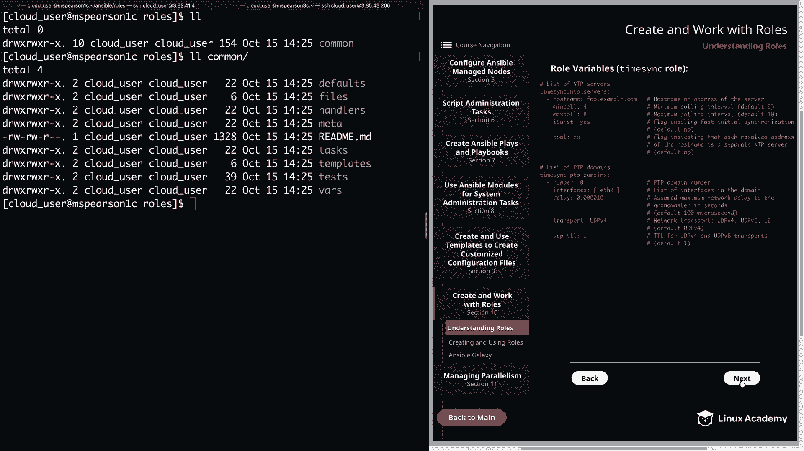
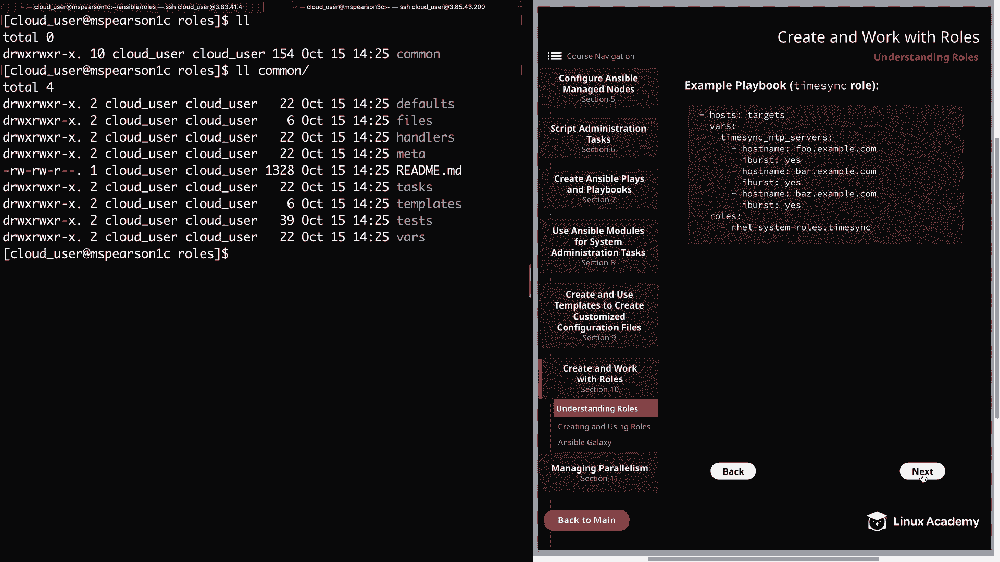

# Red Hat Certified Engineer (RHEL 8 RHCE) - P43：388-4875-1 - Understanding Roles - 11937999603_bili - BV12a4y1x7ND

Welcome back everyone。 this is Matt。 and in this lesson。

 we're going to kick off our section on creating and working with roles。

 So let's head over to section 10。

And the first topic is going to be understanding roles。

So the default location for roles is going to be in Etsy Ansible roles。

 but as it is with other default directories， we can always update these to the location of our choosing。

 so if we head over to the command line。You can see that I'm in my home directory。

 so let's go ahead and Cd into Ansible， which has kind of just been our main working directory for this course。

And then we'll do a listing here。And as you can see within my Ansible directory。

 I've created a roles directory， and I've also updated the default location for roles in my Ansible。

 CFfg。 So let's go ahead and open that up real quick so I can show you。

And I'm using the dot Ansible CFfG in my home directory。And as you can see。

 I have the rolls path parameter， and currently， it is set to Etsy Ansible rolls。

 And then I've added a colon， and then a path to my new roles directory。

 which is in home cloud user Ansible rolls。 So now， let's go ahead and quit out of this。

And since I've added the path to my roles directory in my main Ansible working directory。

 Ansil is also going to search here for any existing roles。Next。

 roles provide a way to automatically load certain varase files。

 tasks and handlers based on a known file structure， which actually leads into the next point。

 which is roles expect a particular directory structure。

 So let's go ahead and Cd into my roles directory。To clear that out， and now we can do a listing。

And as you can see， I've already created one。But for this video。

 I just wanted you to be able to see the directory structure as we talk about it。

 And I've also provided an example of this that you can reference back to in the diagram。 All right。

 so even though this is the directory structure that is expected。

 any directories that are not being used can be excluded。So let's just say that you have a role。

 but you're not actually using the files directory。

 so in that case you could just remove that and it's not going to harm you when it comes to actually executing your role。

And then lastly， each directory in use must contain a main dot YMl file with relevant content。

 So for any directory that you' are actually using for your role。

 it must contain a main dot Yal file， and that file must also have the proper content that's expected for that directory。

All right， let's go ahead and click next。And then we'll talk a little bit about each of the different roles directories and what their objective is。

 and first we have the task directory， and this directory contains the main list of tasks to be executed by the role。

So just like you can define multiple plays in a playbook。

 you can also specify multiple plays within the main dot Yamel of your task directory。

 and these tasks are going to be pulled in and executed whenever you call your role Also。

 it's important to。in the task directory， and this is done by using the import task keyword and then specifying the file to be included。

 along with a wind condition in which you'll specify the operating system。

 and this can be very helpful， especially when you have a mixed environment of different Linux distributions。

So within the task directory， you have your main dot yaml。

 and then you can also create a distribution specific Yaml file like we'll say redhat。

 yaml or a debion do yaml and then within those files。

 you can specify the module to be used for that particular distribution。

 So an example of this would be using the yam module for red hat and then the app module for Debian and then in your main dot yaml。

 you're just going to use the import task keyword to specify the distribution specific yaml and then the when condition for when it's supposed to be used。

Next we have handlers and this directory is going to contain your handlers。

 which may also be used by this roll or even anywhere outside the roll。

And just keep in mind that the same rules for handlers that we've already learned are also going to apply to handlers that are defined for ruless。

 so handlers can be flagged using the notify keyword。

 and this only happens if there is a change in that task and a handler that has been notified is only going to run once。

 even if it's been notified multiple times。Next， we have the defaults directory。

 and this is going to contain default variables for the role and is meant to provide a value to a variable if no other value is given。

 And this directory has the lowest level of precedence when it comes to assigning values to a variable。

 So if the variable is defined elsewhere， this value is not going to be used。

 So this allows you to have some base values for your variables。

 But depending on what you specified elsewhere in your role， these values will not be used。Next。

 we have the varrs directory， and this directory is going to contain variables used within the roll and is going to also have a higher precedence than the defaults directory。

 So this is another directory where you're going to be able to define variables for your role to use and anything defined here again is going to take precedence over anything defined in the defaults directory。

Another thing to be aware of is that the variables defined in one role are also available to other roles that you've created。

 So it's generally the best practice to namespace your variables。

 so that they are not accidentally used by one of the other roles that you've set up。 So。

 for example， let's just say we have a variable called log file。 That's a pretty generic name。

 And if you define the same variable in two different roles。

 So you have an Apache role and then a MysQL role。 And each of these has a log file variable。

 This can end up causing a conflict。 So it's a good idea to name space these variables。

 And that way you could have one of them called Apache log file， and then the other one。

 MysQL log file。 Next， we have the files directory。 and this directory contains files。

 which can be deployed via this role。 And one thing that's kind of nice about using roles is that any copy。

 script， template or include task in the role can actually reference files from the files。

 templates and task directories without having to use a relative or absolute path。

 So all you have to do is specify the name。The file keep in mind that the files directory is just for normal files and is not going to be for variable files or templates。

So the templates directory， as you might have guessed。

 is the directory that's going to contain the templates， which you can deploy via this role。

 So all the templates that you need for your role are going to be stored in this directory。

 and just like the ordinary files in the files directory。

 these templates can be referenced without using a relative or absolute path and just specifying the name。

And then lastly， we have the meta directory， and this is going to be used to define some of the metadata for the role。

And the metadata that is stored in this directory is going to include role dependencies and various role level configurations。

 such as the allowed duplicates parameter。 And this is going to allow you to pull in other roles as dependencies whenever you're using a particular role。

 And this can also include variables。Other roles that you're pulling in。

So let's say that you have a role that has two other roles defined as dependencies。

 Those two roles are going to be pulled in and executed before your main role。

 and Ansible will only allow to execute once， even if it's defined multiple times。

 The exception of this is going to be when you pass in different parameters or variables to each roll definition。

 or you can also add the allowed duplicates keyword to the main dot yal in the metadirecty and then set the value to true。

 And keep in mind that this is going to be set in the meta directory of the dependent role and not the parent role。

All right， so I realized that that was a lot of information that we just went over。

 but I will be walking through the creation of a role in the next video so you're actually get to see a demonstration of this。

But before we finish this video， I wanted to head over to the next page。

And talk just a little bit about Red Hat Enterse Linux system roles。

 which is just a collection of ansible roles and modules that's going to provide a stable and consistent configuration interface for Red Hat Enterse Linux systems。

So let's just go over a couple different points about these REL system roles because they can be very useful when it comes to managing your REL systems。

 So first， they're provided by the REL extras repository。And in order to use these roles。

 you need to install the REL system rolls package， and these can be used by Ansible Engine。

 as well as Ansible Tower in order to manage REL systems。 Next。

 it needs to be installed on the ansible control node or nodes。

 which can then be used to manage and configure the client nodes。Supported system roles include KW。

 network， SE Linux， Time syncync， and PostF， which is actually in tech preview currently。

And the next， the documentation can be found in the following location。

 which is usershare Doc REL systemem roles and then subsystem。

 and the subsystem is actually the system role that you're going to be using so that can be k up or network or timesnc。

 but within this documentation， each subsystem is going to include a readme。

 which is going to document how you can use the role and also the supporter parameter values。

 and I will be showing you an example of this on the next page。Lastly。

 the Ansible roles may be found in user sharere ansible roles and then REL systemstem。 subsystem。

 where subsystem is going to be the name of the role。All right， let's head to the next page。

And this is just a snippet of the read me file， which is going to show you a list of variables that are accepted。

 and this particular example is using the Time syncync role。

 and then on the next page we have an example of a playbook that's using the time syncync role。

 and here we're going to define some variables and then pull in the role itself。

So even though we have the ability to create custom roles。

 it's important to remember that we have access to some of these REL system roles and that we can use them to perform certain administrative tasks on our REL servers。

All right， well that's going to finish up this video。

 Let's go ahead and mark it complete and we can move on to the next section。

