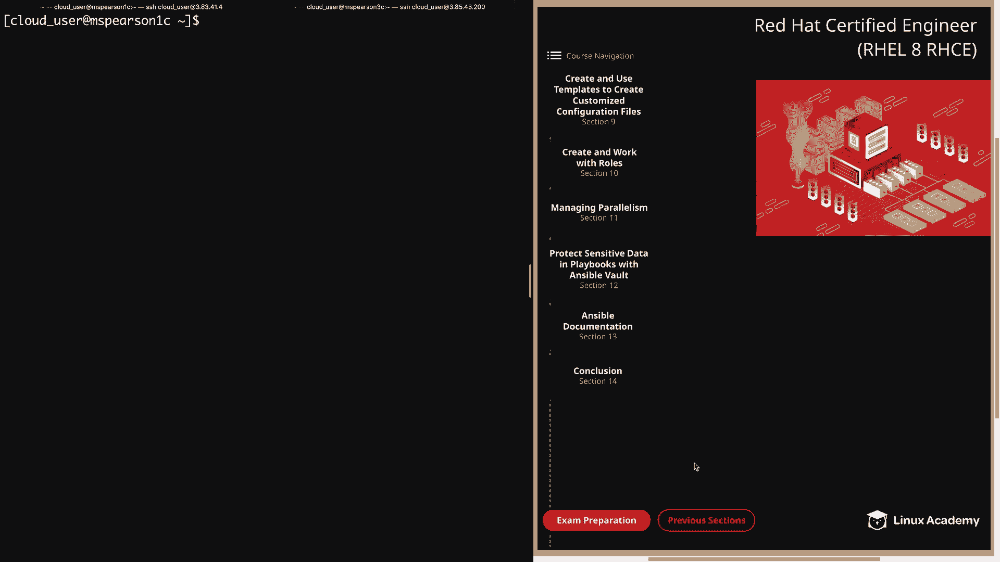
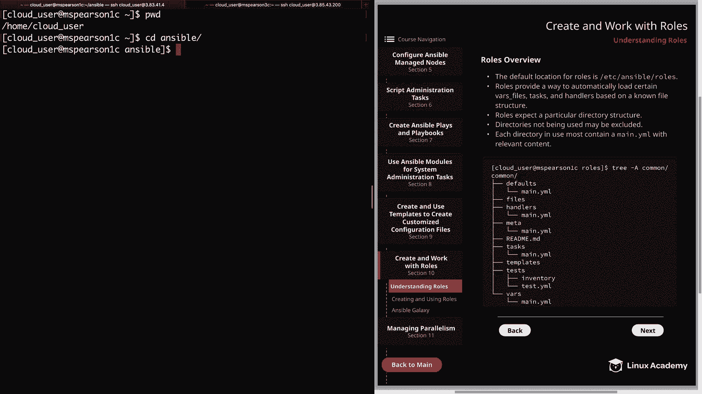
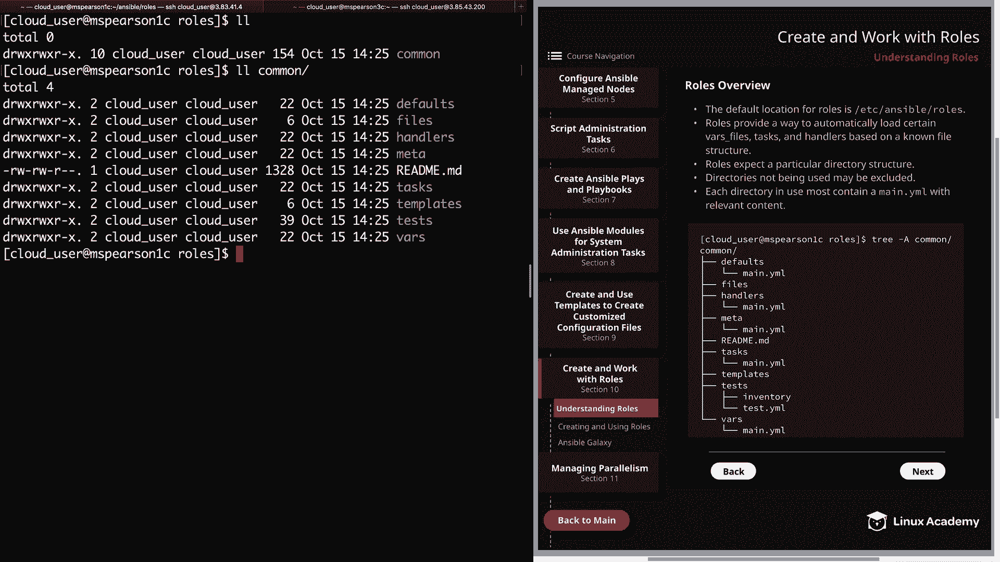
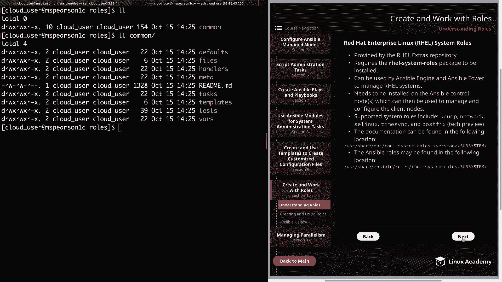
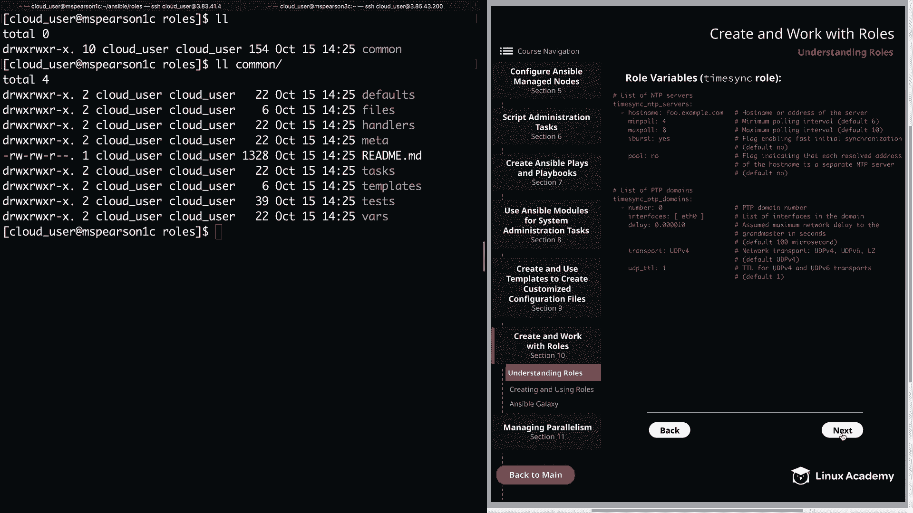
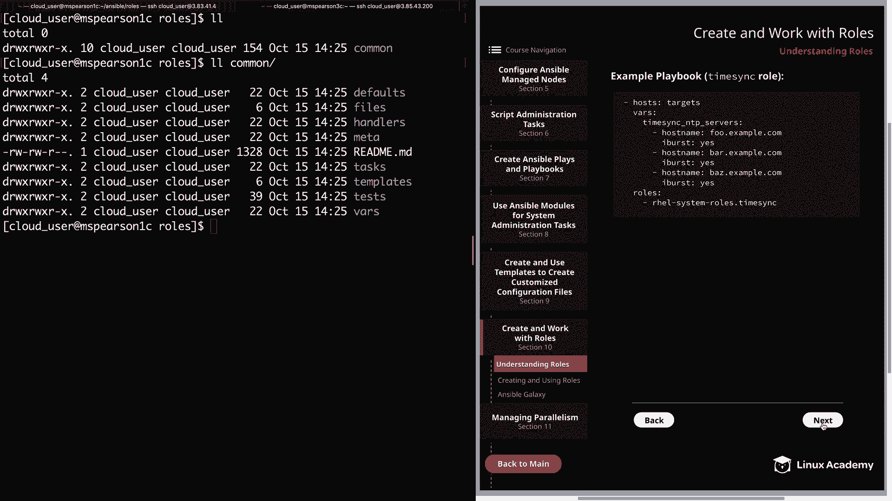

# Ansible角色管理：10.1：理解角色 👨‍💻





在本节课中，我们将开始学习Ansible角色的创建与使用。角色（Roles）是Ansible中用于组织Playbook、变量、文件、模板和任务的一种强大方式，它能让你的自动化代码更加模块化、可重用和易于管理。

## 概述

首先，我们来了解角色的基本概念和默认结构。角色的默认存储位置是 `/etc/ansible/roles`。然而，与其他Ansible默认目录一样，我们可以通过配置文件修改这个位置。



例如，在我的主工作目录 `~/ansible` 下，我创建了一个 `roles` 目录，并在我的Ansible配置文件（`~/.ansible.cfg`）中更新了 `roles_path` 参数，使其同时包含默认路径和我的自定义路径：

```ini
roles_path = /etc/ansible/roles:/home/cloud_user/ansible/roles
```

这样配置后，Ansible在执行时会同时在这两个路径下搜索角色。

## 角色的目录结构

角色遵循一个特定的目录结构。以下是角色所期望的核心目录及其作用。需要注意的是，任何未使用的目录都可以被省略，不会影响角色的执行。每个被使用的目录**必须**包含一个 `main.yml` 文件，其中存放该目录对应的核心内容。

以下是各个目录的详细说明：

*   **`tasks/`**：此目录包含角色要执行的主要任务列表。`main.yml` 文件定义了这些任务。你可以在其中定义多个“play”，就像在Playbook中一样。当调用角色时，这些任务会被拉取并执行。一个重要的技巧是，你可以使用 `import_tasks` 关键字来根据条件（例如操作系统类型）导入不同的任务文件，这对于管理混合的Linux发行版环境非常有用。
*   **`handlers/`**：此目录包含此角色（或角色外部）可能使用的处理器（Handlers）。之前学过的关于处理器的所有规则同样适用：处理器通过 `notify` 关键字触发，且仅在对应任务发生更改时被调用；即使被多次通知，一个处理器也只会运行一次。
*   **`defaults/`**：此目录包含角色的**默认变量**。它的目的是在未提供其他值时，为变量赋予一个默认值。在变量赋值的优先级顺序中，此目录的优先级**最低**。如果变量在其他地方（如 `vars/` 或Playbook中）被定义，这里的值将不会被使用。
*   **`vars/`**：此目录包含角色内部使用的**变量**。它的优先级**高于** `defaults/` 目录。这里定义的变量会覆盖 `defaults/` 中的同名变量。需要注意的是，一个角色中定义的变量对其他角色也是可见的。因此，最佳实践是为变量**添加命名空间**（例如使用 `apache_log_file` 而非 `log_file`），以避免不同角色间的变量名冲突。
*   **`files/`**：此目录包含可通过此角色部署的**静态文件**。使用角色的一个便利之处在于，角色中的 `copy`、`script` 等任务在引用此目录下的文件时，只需指定文件名，而无需使用相对或绝对路径。此目录仅用于普通文件，不用于变量文件或模板。
*   **`templates/``**：此目录包含可通过此角色部署的**Jinja2模板文件**。与 `files/` 目录类似，在任务中引用这些模板时，也只需指定模板文件名。
*   **`meta/`**：此目录用于定义角色的**元数据**。这包括角色依赖项（`dependencies`）和各种角色级别的配置，例如 `allow_duplicates` 参数。这允许你在使用一个角色时，自动引入并先执行它所依赖的其他角色。默认情况下，Ansible确保一个角色只执行一次，即使被多次定义。例外情况是：每次定义时传入了不同的参数/变量，或者在依赖角色的 `meta/main.yml` 中设置了 `allow_duplicates: true`。

## Red Hat Enterprise Linux 系统角色

除了创建自定义角色，Ansible还提供了由Red Hat维护的 **RHEL系统角色**。这是一个Ansible角色和模块的集合，为RHEL系统提供了稳定、一致的配置接口。

关于RHEL系统角色，有几点需要了解：
1.  它们由 `rhel-8-for-x86_64-appstream-rpms` 仓库中的 `rhel-system-roles` 软件包提供。
2.  需要安装在Ansible控制节点上，可用于管理客户端节点。
3.  支持的系统角色包括：`kernel_settings`、`network`、`selinux`、`timesync`，以及技术预览版的 `postfix`。
4.  每个角色的详细文档位于 `/usr/share/doc/rhel-system-roles/<subsystem>/`（如 `timesync`），其中的 `README.md` 文件说明了如何使用及支持的参数。
5.  角色本身安装在 `/usr/share/ansible/roles/rhel-system-roles.<subsystem>/` 目录下。

这些预制的系统角色能极大地简化对RHEL服务器进行通用管理任务（如时间同步、网络配置等）的自动化过程。

## 总结



本节课我们一起学习了Ansible角色的核心概念。我们了解了角色的默认位置和如何自定义，详细探讨了角色必须遵循的目录结构及其每个组成部分（`tasks`， `handlers`， `defaults`， `vars`， `files`， `templates`， `meta`）的职责。此外，我们还介绍了Red Hat提供的RHEL系统角色，这是一种开箱即用的、用于高效管理RHEL系统的资源。





在下一节中，我们将通过实际动手创建一个完整的角色，来巩固对这些概念的理解。