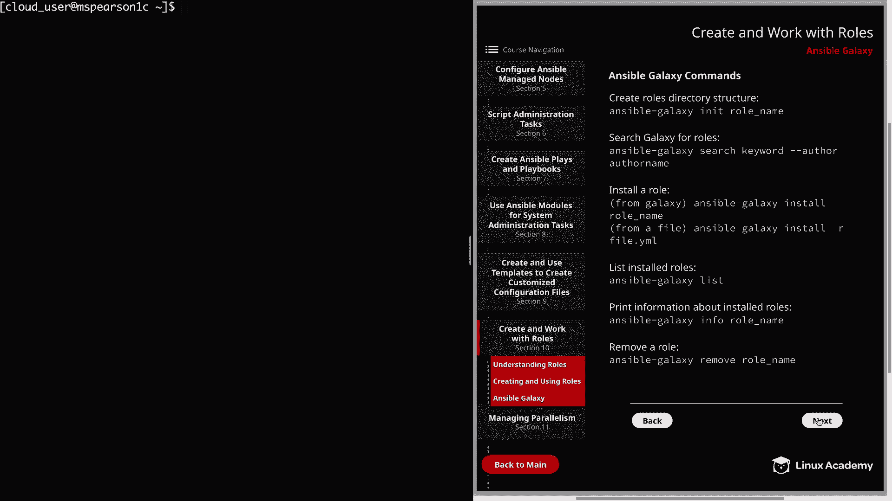
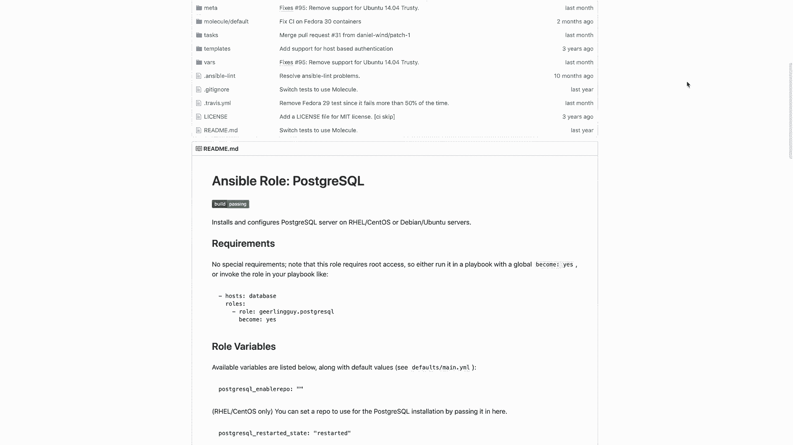
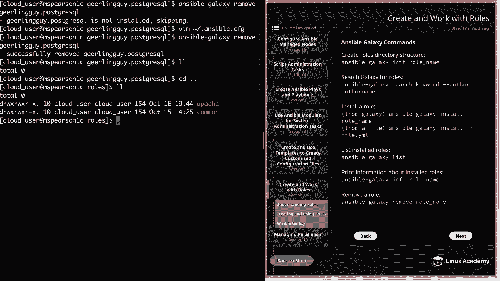

# Red Hat Certified Engineer (RHEL 8 RHCE) - P45：388-4875-3 - Ansible Galaxy - 11937999603_bili - BV12a4y1x7ND

Welcome back everyone， this is Matt， and in this video we're going to finish up our discussion on Antsible roles and talk a little bit about Antsible Galaxy。

So let's head over to next sections and then section 10。And then finally down to Anspo Galaxy。

So Ansible Galaxy is just a large public repository for downloading and sharing community developed roles。

 So rather than having to create a role from scratch。

 you can just check out Ansible galaxyax and then see if anyone else has already done the legwork for you。

 So basically don't reinvent the wheel。 And you can always install a roll from galaxy and then modify it to meet your specific needs。

 And then we have the ansible galaxyaxy command line utility。

 which is going to allow us to create and remove roles or to install roles from Ansible Galaxy or get based SCm。

 which is software configuration management。 And this is going to be our main means of interacting with ansible galaxy from the command line。

 It has several subcommands， you can see here in the syntax。

 And there are also going to be several additional options。 that subcommans are going to take。

 So if you take a look at the syntax， you're going to specify Ansible dash galaxy。

 And then one the subcomds from delete import all the way to set up。

 And then you're going to specify your additional options。

 And now let's set over to the next page and we're going to walk through some of these different subcommands and what they do。

😊，So first， we have the init subcomman， which we've already seen in the previous video。

 and this is going to build out the basic directory structure of the role。

 so you don't have to go through and create every file and directory。 You do， of course。

 have the option to do this manually， but using the init subcom is going to make this very easy for you。

 Next， we have the search subcomman， which is going to take a keyword and then optionally an author。

 and this is going to search through Ansible galaxy using the information that you've provided。

 And like I said， the author name is optional。 but depending on the keyword that you select。

 you can get a ton of different output。 So having the author name is very handy。Next。

 we have the install Subcom， which is very important because it's going to actually install the roles on the control node for us。

 The role provided can be a name which will then be downloaded via the Galax API and Gitthub。

 or it can also be a local TG Z file。 And when specifying a role from Gitthub。

 you will typically use the author name a period and then the name of the roll。

 And in addition to installing role from galaxy， you can also install a roll from a file。

 And to do this， you're going to， again specify Ansible Galaxy install。

 and then the dash R option and then the name of the file。 Next。

 you can list install roles using Ansible Galax list。

 and also print additional information about the installed roles using Ansible Gal info。

 And then finally remove a roll using ansible Galaxy remove。All right。

 so now that we talked about some of the subcommans for Ansible Galaxy。

 let's head over to our browser and we can walk through the Ansible Galaxy website。

So on the homeage， you'll see the navigation on the left right here。We're currently on the home page。

 but there is a search page。We're just going to provide a search bar in order for you to search for particular roles。

 and then we also have the community tab。And out of this。

 you're going to see a list of community authors， as well as the amount of roles that they have contributed。

 Of course， you can filter this and search through it。 And now let's head back to the home page。

 and you're going to see several different categories of the most popular content like systems and networking。

But let's go ahead and click on database。And this is going to show you some of the most popular roles that have the database tag。

 which you'll see right here。 And right here at the top。

 we see MimCched is the most popular currently followed by MySqL。 And just like the search tab。

 this page is also going to provide a search option as well。 But for this video。

 we're actually going to be using the Postgres SQL role that's provided by gearling guy。So you see。

 this is like the fifth down。So you're going to see the name of the role on the right and then the author on the left。

 let's go ahead and click on that。And that's going to take us to a page for the role and give us a little information about the role。

 such as when it was last committed some version information as well as supported operating system and here in the top right。

 there's even a link to the GitHub repo and if we click on that。

It takes us straight to the repository。We can also gain a little more information about what is going on with this particular role。

 All right， So now let's head back to our other screen。

And then we can try out some of these Ansible Gal commands and ultimately install this PostresqL role。

Alright， so the first thing Im want to do is just Cd into ansible roles。

And this is my main roles directory。So currently we just have the Apache rule that we created in the last video and then the common role。

 So now let's go ahead and search Ansible Galaxy using Ansible Galaxy。Search。

 and then we can provide our keyword， which is going to be Postgresql。And if you look at the top。

 it finds 559 roles that are matching our search keyword。

 and on the left we're going to have the name of the role。

 which is going to be the author and then a dot and then the actual name of the role。

 and then there's going to be a description here on the right so that's going to tell us a little more about each role。

And you may have also noticed that the name of the rule。

 which again starts with the author name first， is going to be listed in alphabetical order。

So let's go ahead and quit out of this with Q。And now let's search for the author that we're looking for。

 which is gear Ling Gu。And we see that we find two roles that are matching our search criteria。

And the first role provides PP Postgresql support for Linux。

 and the second is the Postgresql server for Linux。And let's go ahead and copy this role name。

And then we can install the roll using Ansible Galaxy。Install and then the name of our rule。

 which is gearlinggu。 post rescuecul。And we see that we get some information about the action that the Ansple Galaxy command is taking。

 so it downloads the role， tells you where it's getting it from。

 and then ultimately it's extracting it in Etsy Ansipible rolls gearing guy。

 and then it's also extracting it to home cloud user Ansipible roles。

 So let's go ahead and do a listing。And we see the directory for our roll， so let's CDd into that。

And then if we do a listing of this directory， we see the expected roll directory structure。

 which was extracted from the roll that we just installed。

 And one really important file when you're installing roles from Ansible Galaxy is going to be read me。

Let's go ahead and open that up。And this is going to give us additional information about the role as well as how to use it。

And then you see here at the bottom， it's going to give you an example of how to run it in a playbook。

So just make sure that you check out this readme file。

 especially for roles that you're installing from Ansipible galaxyaxy that you're not quite as familiar with。

 And that way you can see if there's any additional configuration that's required and ultimately just how to use the roll。

 All right， let's go ahead and quit out of this。Now let's try out the Ansipible Galaxy list subcommand。

And so this is going to show us our roles directory， which is currently set to Etsy Ansible roles。

 as well as home Cloud user Ansible roles， and then a list of the installed roles。

 so we're going to have common Apache in then our recent gearlinggu。 postreqL role。

And then we can also gain more information about a role by typing an Ansible galaxy and then info and then the name of the roll。

 So this is going to be。Gearinggu do postreql。And this will show us information like when the role was created。

 the download count， the GitHub repo， the GitHub user， and also when it was last modified。

 And then to quit out of this， we can just take Q。And then if we'd like to remove a roll。

 all we have to do is type in Ansible Galaxy。Remove and then the name of our role。

 which is gearingG dot postgsqL。And even though we've installed this role。

 it's telling us that the roll is not installed。 So it's skipping it。

 And the reason for this is the way that we have our roll path parameter and our ansible CFG configured。

 So let's go ahead and open that up real quick。 It's going to be at home and then dot ansible dot CG。

So even though we have two roles path specified for some reason。

 Ansible' is going to initiate look in Etsy Ansible roles。 And when it doesn't see the role。

 it's not going to move on to home cloud user ansible roles。 And， of course。

 this is a bit frustrating。 But one way that we can rectify this is by just copying this。

And just putting it on the other side。So rather than starting with Etsy Ansible roles。

 let's start with our home cloud user Ansible roles。And then we could add Ean rolls to the end。

All right， let's go ahead and save and quit， and then we can try our remove one more time。

And we see that we were able to successfully remove our role。Well。

 that's going to finish up this video in Ansible Galaxy。

 so go ahead and mark it Comp and we can move on to the next section。

