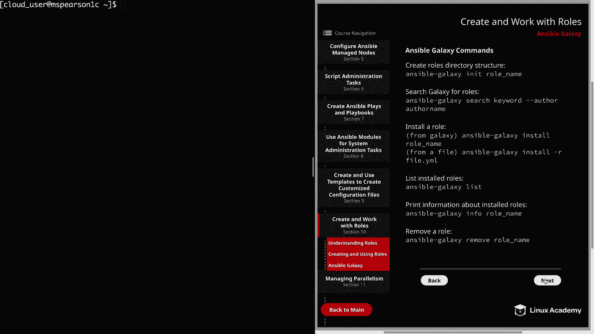
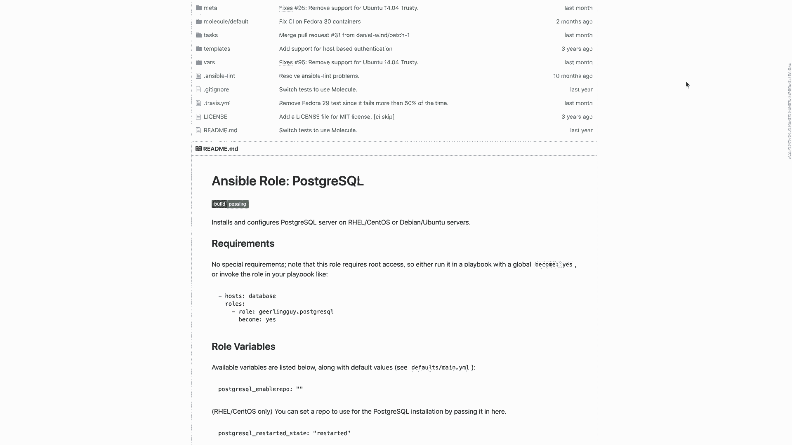
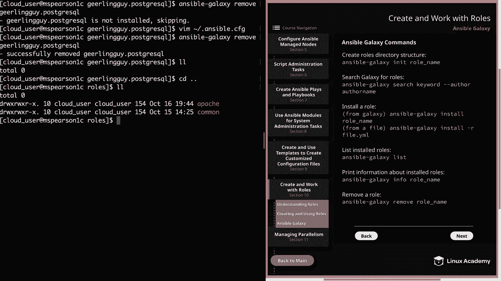

# Ansible 角色与 Galaxy：第 10 章：Ansible Galaxy 详解 🚀

在本节课中，我们将完成对 Ansible 角色的讨论，并重点介绍 Ansible Galaxy。我们将学习什么是 Ansible Galaxy，如何使用其命令行工具，以及如何从社区仓库中搜索、安装和管理角色。

---

## 概述

Ansible Galaxy 是一个大型的公共仓库，用于下载和分享社区开发的角色。这意味着你无需从零开始创建角色，可以查看是否已有他人完成了相关工作，从而避免重复造轮子。你可以安装 Galaxy 上的角色，并根据自己的具体需求进行修改。

我们将使用 `ansible-galaxy` 命令行工具来与 Galaxy 交互，该工具允许我们创建、删除角色，或从 Ansible Galaxy 或基于 Git 的软件配置管理（SCM）系统安装角色。

---

## `ansible-galaxy` 命令行工具

`ansible-galaxy` 工具是与 Ansible Galaxy 交互的主要方式。它包含多个子命令，每个子命令可以接受不同的选项。基本语法如下：

```bash
ansible-galaxy <subcommand> [options]
```

以下是 `ansible-galaxy` 支持的一些关键子命令及其功能。

### 主要子命令介绍

以下是 `ansible-galaxy` 工具中一些最常用的子命令及其用途。

*   **`init`**：此子命令用于初始化一个新角色，自动创建角色所需的标准目录结构。你当然可以手动创建这些文件和目录，但使用 `init` 命令会更加便捷。
*   **`search`**：此子命令用于在 Ansible Galaxy 中搜索角色。你需要提供一个关键词，并可以选择性地指定作者名。由于仅凭关键词可能返回大量结果，指定作者名可以更精确地定位目标角色。
*   **`install`**：此子命令用于将角色安装到控制节点上。提供的角色可以是一个名称（将通过 Galaxy API 从 GitHub 下载），也可以是一个本地的 `.tar.gz` 文件。从 GitHub 安装时，通常使用 `作者名.角色名` 的格式。
*   **`list`**：此子命令用于列出所有已安装的角色。
*   **`info`**：此子命令用于打印已安装角色的详细信息。
*   **`remove`**：此子命令用于从控制节点移除已安装的角色。

---



## 浏览 Ansible Galaxy 网站

上一节我们介绍了命令行工具，本节中我们来看看如何通过网页界面浏览 Ansible Galaxy。

访问 Ansible Galaxy 网站，你会在首页左侧看到导航栏。除了首页，还有以下主要页面：

*   **搜索页**：提供一个搜索栏，用于查找特定角色。
*   **社区页**：展示社区贡献者列表及其贡献的角色数量，你可以进行筛选和搜索。

首页会按类别（如系统、网络、数据库等）展示最受欢迎的内容。例如，点击“数据库”类别，你会看到所有带有“数据库”标签的热门角色，并可按流行度排序。

---

## 实践：搜索与安装角色

现在，让我们在命令行中实践搜索和安装一个具体的角色。我们将以 `geerlingguy.postgresql` 这个 PostgreSQL 角色为例。



首先，进入你的 Ansible 角色目录：

```bash
cd ansible/roles
```

使用 `search` 子命令查找与“postgresql”相关的角色：

```bash
ansible-galaxy search postgresql
```

命令会返回大量结果。为了精确查找，我们可以同时指定关键词和作者名：

```bash
ansible-galaxy search geerlingguy
```

找到目标角色后，使用 `install` 子命令进行安装：

```bash
ansible-galaxy install geerlingguy.postgresql
```

安装完成后，进入该角色的目录，查看其结构。特别重要的是 `README.md` 文件，它提供了角色的使用说明、配置要求和在 Playbook 中调用的示例。

---

## 管理已安装的角色

安装角色后，我们需要知道如何查看和管理它们。

使用 `list` 子命令可以查看所有已安装的角色及其安装路径：

```bash
ansible-galaxy list
```

使用 `info` 子命令可以获取某个角色的详细信息，如创建时间、下载次数、GitHub 仓库地址等：

```bash
ansible-galaxy info geerlingguy.postgresql
```

最后，如果需要移除一个角色，可以使用 `remove` 子命令：

```bash
ansible-galaxy remove geerlingguy.postgresql
```

> **注意**：如果遇到角色“未安装”的提示，可能是因为 `ansible.cfg` 文件中 `roles_path` 参数的配置顺序问题。Ansible 会按顺序在指定的路径中查找角色。确保你的主目录路径（如 `~/ansible/roles`）在系统路径（如 `/etc/ansible/roles`）之前，可以解决此问题。

---

## 总结



本节课中我们一起学习了 Ansible Galaxy 的核心概念和操作。我们了解到 Ansible Galaxy 是一个共享社区角色的中心仓库，能够极大地提升工作效率。我们重点掌握了 `ansible-galaxy` 命令行工具的使用，包括搜索、安装、查看信息和移除角色。同时，我们也熟悉了通过网页界面浏览 Galaxy 仓库的方法。记住，在安装社区角色后，仔细阅读 `README.md` 文件是正确使用角色的关键。