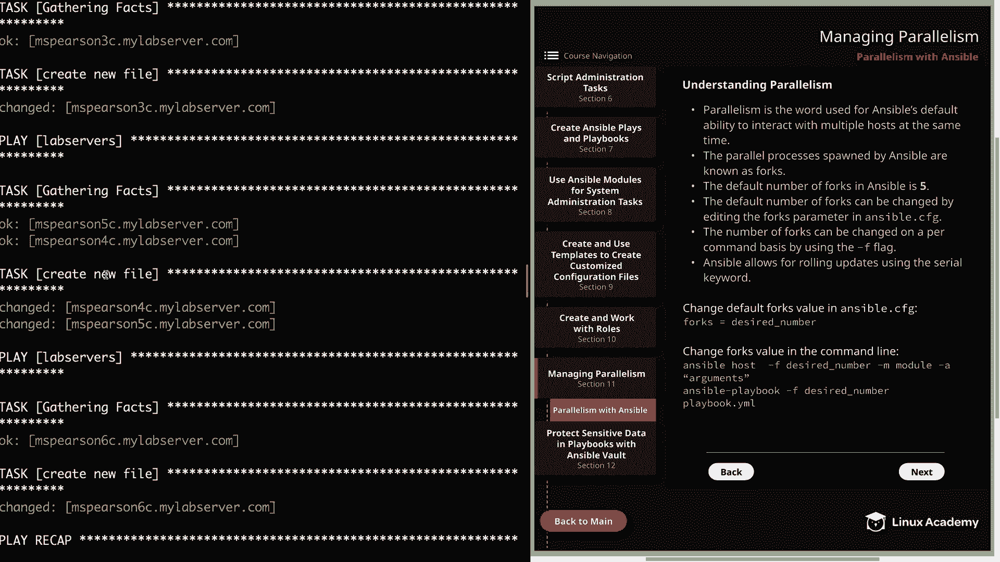

# Red Hat Certified Engineer (RHEL 8 RHCE) - P46：388-4876-1 - Parallelism with Ansible - 11937999603_bili - BV12a4y1x7ND

Welcome back， everyone。 This is Matt。 and in this video。

 we're going to talk about managing parallelism in Ansible。 So let's head over to our diagram。

 click on next sections and then section 11。 and that'll take us to our topic on parallelism with Ansible。

 So parallelism is the word used for Ansible's default ability to interact with multiple host at the same time。

And this is not just true of ansible， but of any type of software that is able to spawn multiple processes in order to execute tasks in tandem。

 So when we talk about parallelism and ansible， its ansible's ability to generate multiple processes when interacting with and managing hosts。

 And as you can imagine， this ability becomes more and more important。

 the larger the group of hosts that you're running against is。

 So rather than executing against a single host at a time。

 Ansible is going to spawn a process for each host that is executing against。 And of course。

 this is going to depend on the configuration that you've defined。

 but we'll talk more about that in just a minute。 So these parallel processes spawn by ansible are known as forks。

 and the default number of forks an ansible is going to be set to5。

This is a pretty conservative number to define for parallel executions。

 but the larger this number becomes， the more resources are used on the control node。

 So if you're executing against a large number of managed nodes and you have a fairly beefy control node with a lot of resources。

 you could up this to something like 50 or 100。 but again。

 that's going to depend on the amount of resources that you have on the control node。

This default number of forks can be changed by editing the forks parameter in the ansible do CG file。

 and this is going to affect every subsequent ansipible execution after that。 Also。

 you can change the number of forks on a per command basis using the dash F flag。

 which is one of the command line options that's available when running the ansipible command for ad hoc or the ansipible playbook command for executing playbooks。

 So this way you can have your default setting to a higher or lower value。

 but depending on the group that you're executing against， you can change this。

 And another thing to keep in mind is that even if you increase the forks to 50。

 but you're executing against， let's say 10 host。 Ansible is only going to spawn 10 processes。

 regardless of the default value that was passed。 Now。

 let's say that you had100 host and the forks value was set to 50。

 Ansible would then executing against 50 hosts at a time。

And in addition to increasing the forks value， ansible also allows for rolling updates using the serial keyword。

 So this gives you the ability on a per playbook basis to specify the amount of host you want to execute against at a time。

 And it's also going to give you the ability to slowly ramp up your deployment by providing an increasing list。

 and I will be showing you an example of this in just a moment。Next。

 I provided an example of how you can update the default forts value in the Ansible CFG。

 So let's head over to the command line and I'll show you that real quick。

 So we are currently in home cloud user Ansible。And we're going to edit the ansible CFG that's in my home directory。

 so dot ansible do cfg。We see that we currently have three parameters that we're defining。

 so let's go ahead and add another。All we' need to do is add forks。And then equals。

 and then the desired number that we'd like to set the default forts value to B。

 And so currently it's set to 5。 so let's go ahead and increase that to 10。

And so now whenever I execute a playbook， AnsA is going to attempt to run this against10 hostst at a time。

 and one thing to keep in mind is that you can always check on the forks value by using the ansible Config command。

Al right， so next I've provided an example of how you can change the forts value in the command line。

 and the first example is just the anciipple command for ad hoc commands and then the ansipible playbook command for running playbooks。

 And in these examples， you can override that default forts value in the same way that you can override any of the other default ansipible configuration。

 and for that， we're going to be using the dash F option。 Unfortunately。

 since our lab environment only has a handful of hosts associated with it。

 we can't really demonstrate this。 but I can show you an example of using the serial keyword。

 So let's head to our playbooks directory。So let's go ahead and open up a playbook I've created for this example called serial。

 Yal。And as you can see， we're executing this against the lab servers group。

 and then we're going to specify the serial keyword。

 and then we're going to specify a list so that we can slowly increase the number of parallel processes or the host that we're executing against。

 So we're going to start with one host and then move to2 and then I've added 50% just to show you that it's an option so that would be 50% of the host。

 So you don't just have to do numbers。 You can also do percentages。

And then I'm going to specify the task or task that I would like to run。 And for this example。

 I'm just going to be creating a new file on our host。

And if we just wanted to specify a number of hosts to execute against at a time， we could do that。

 but I did want to show you the example of the list just so you know that it's an option。

 So if you're executing against a bunch of different hosts。

 maybe you just want to try to roll it out to a few at first and then actually ramp up the speed of the deployment just in case there's errors。

 All right， let's go ahead and quit out of this。And then we can kick off our playbook。

And I'll go ahead and speed this up so you don't have to wait。

All right， now that that's completely， let's scroll to the top and we can walk through what's happening here。

So if you'll notice our play initially only executes against MS Pearson 3C。

 that's because we first specified for it to run against one of the hosts。

And then it's going to execute our task， which is create a new file。

And then it increases to run against two hosts， which is going to be MS Pearson P C and 4 C。

 and it's going to create our new file on both of those。

And then lastly， we specify for it to run against 50% of the host， but as you can see。

 we only had one host left， so it just executed against MS。 Beararson 60。

And if we want to validate this， we could always run Ansible。Lab servers。

And then we're just going to do an LS on temp。And then serial file。

And I'll go ahead and speed this up as well。And we see that all our files were successfully created。

Well， that's going to finish up this video on managing parallelism in Ansible。

 so let's go ahead and mark it Comp and we can move on to the next section。

