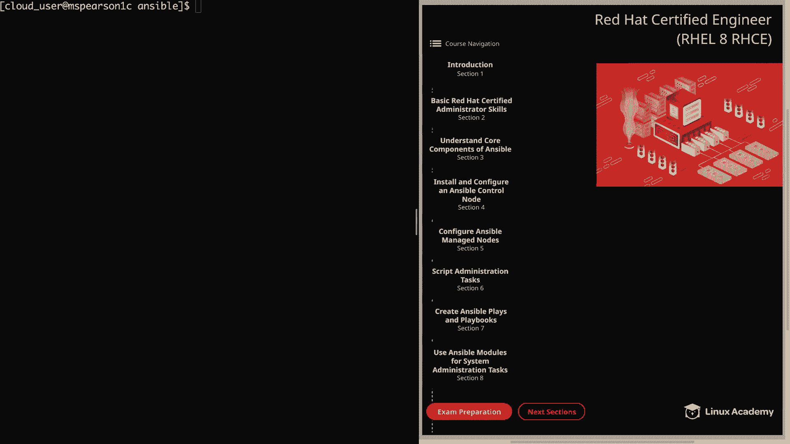
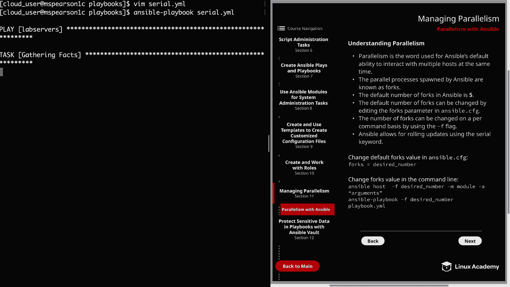
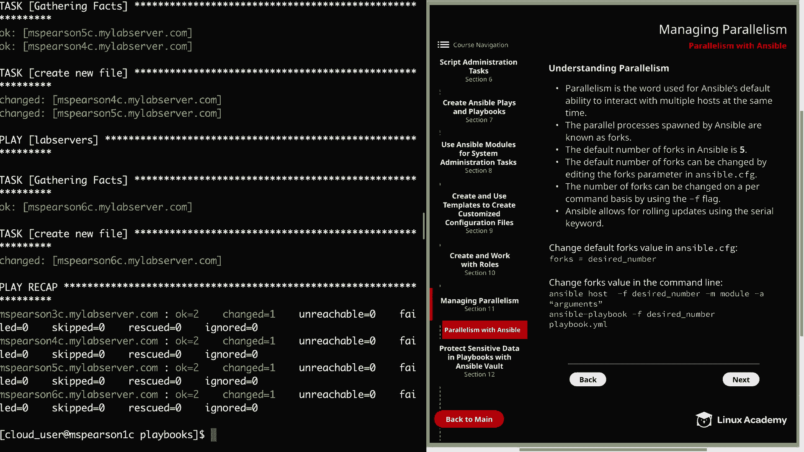
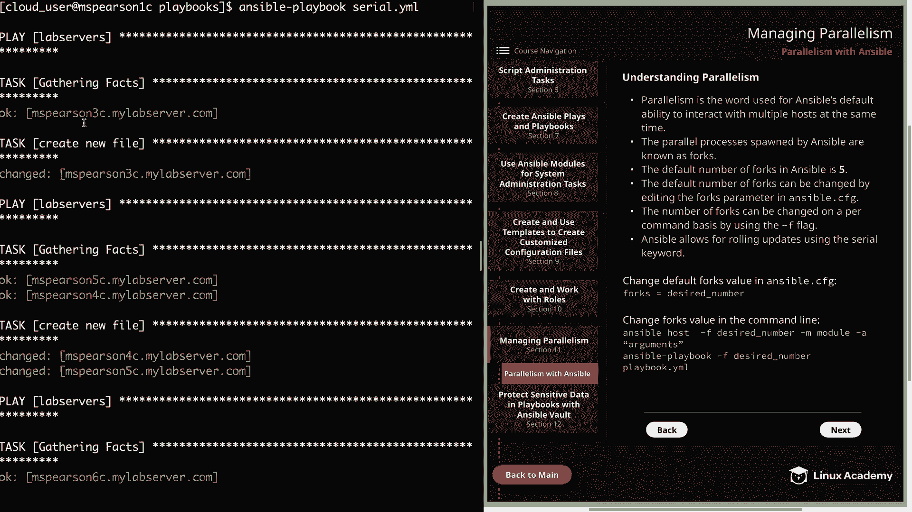
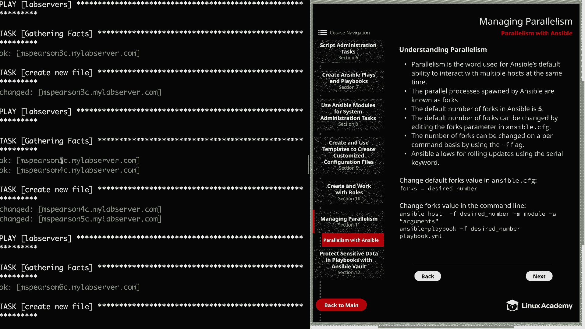
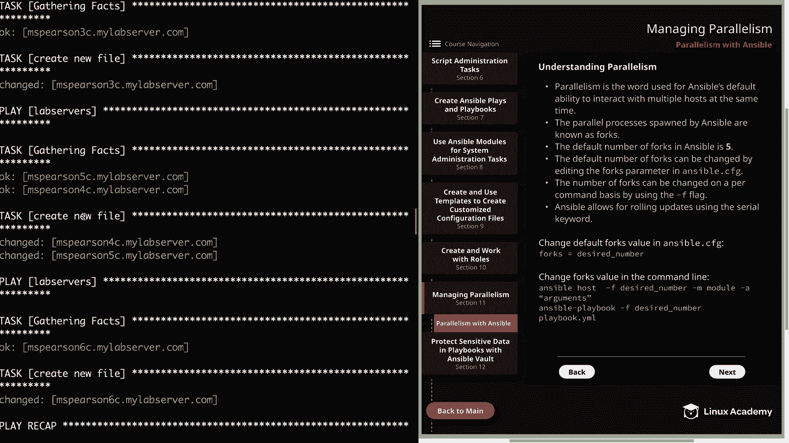
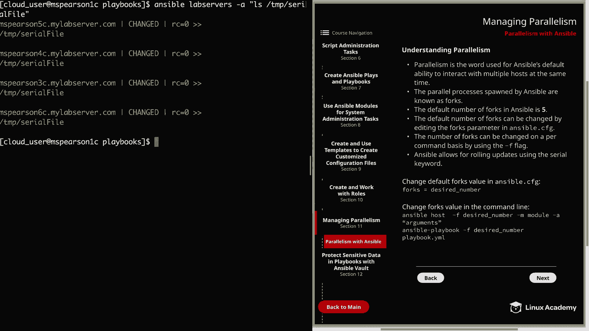

# Ansible 并行管理：P46：并行性管理

在本节课中，我们将要学习 Ansible 如何管理并行执行任务。我们将探讨 Ansible 默认的并行能力、如何调整并行进程的数量，以及如何使用滚动更新来分阶段部署任务。



## 概述

Ansible 具备与多个主机同时交互的默认能力，这种能力被称为并行性。这对于管理大规模主机群组尤为重要，因为它可以显著提高任务执行效率。本节将介绍并行性的核心概念、配置方法以及实际应用。

## 并行性与 Forks

上一节我们介绍了并行性的基本概念，本节中我们来看看 Ansible 实现并行的具体机制。

Ansible 通过生成多个进程来同时与多个主机交互，这些并行进程被称为 **forks**。默认情况下，Ansible 的 forks 数量设置为 **5**。这是一个相对保守的数值，用于平衡控制节点的资源消耗。

**核心概念**：forks 数量决定了 Ansible 可以同时管理的主机数量。其关系可以表示为：
```
同时执行的主机数 ≤ min(forks 数量, 目标主机总数)
```

forks 数量越大，控制节点消耗的资源（如 CPU 和内存）就越多。如果控制节点资源充足，可以将此值提高到 50 或 100。

## 配置 Forks 数量

了解了 forks 的概念后，接下来我们看看如何配置它。

你可以通过两种主要方式修改 forks 数量：全局配置文件或单次命令行覆盖。

### 1. 修改全局配置文件

编辑 Ansible 配置文件 (`ansible.cfg`) 中的 `forks` 参数，此更改将影响之后所有的 Ansible 执行。

以下是修改示例：
```ini
[defaults]
forks = 10
```

修改后，可以使用 `ansible-config` 命令验证配置：
```bash
ansible-config dump | grep forks
```

### 2. 命令行覆盖

在运行 `ansible` 或 `ansible-playbook` 命令时，使用 `-f` 或 `--forks` 选项可以临时覆盖默认值。

以下是命令行示例：
```bash
# 临时设置 forks 为 20 执行临时命令
ansible all -m ping -f 20

# 临时设置 forks 为 20 执行剧本
ansible-playbook myplaybook.yml -f 20
```

这种方式提供了灵活性，允许你根据不同的任务或主机组动态调整并行度。

## 滚动更新与 Serial 关键字

除了调整 forks 数量，Ansible 还提供了更精细的并行控制方式——滚动更新，通过 `serial` 关键字实现。

`serial` 关键字允许你在剧本级别指定每次执行任务的主机数量。这对于分阶段部署、降低风险非常有用。

以下是一个使用 `serial` 关键字的剧本示例 (`serial.yml`)：
```yaml
---
- name: Rolling Update Example
  hosts: lab_servers
  serial:
    - 1
    - 2
    - 50%
  tasks:
    - name: Create a new file
      file:
        path: /tmp/serial_file
        state: touch
```





在这个例子中：
1.  首先在 **1** 台主机上执行任务。
2.  然后在 **2** 台主机上执行任务。
3.  最后在剩余主机的 **50%** 上执行任务。

`serial` 的值可以是具体的数字，也可以是百分比，这为部署策略提供了极大的灵活性。





## 总结



本节课中我们一起学习了 Ansible 的并行管理。

我们首先了解了 Ansible 通过 **forks** 机制实现并行执行，其默认值为 5。接着，我们学习了两种配置 forks 数量的方法：通过修改 `ansible.cfg` 文件进行全局设置，以及使用 `-f` 选项在命令行进行临时覆盖。最后，我们探讨了更高级的并行控制技术——使用 `serial` 关键字实现滚动更新，这允许我们以可控的、分阶段的方式在主机组上执行任务。



掌握这些并行管理技巧，可以帮助你更高效、更安全地在不同规模的基础设施中运行 Ansible 自动化任务。