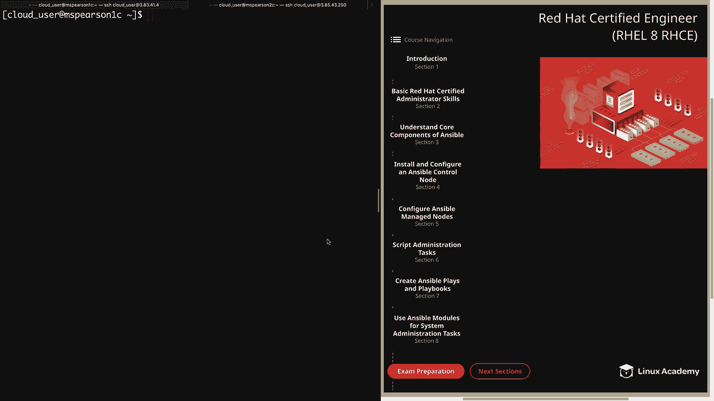
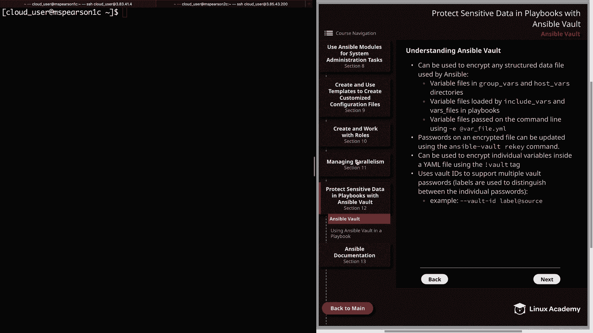
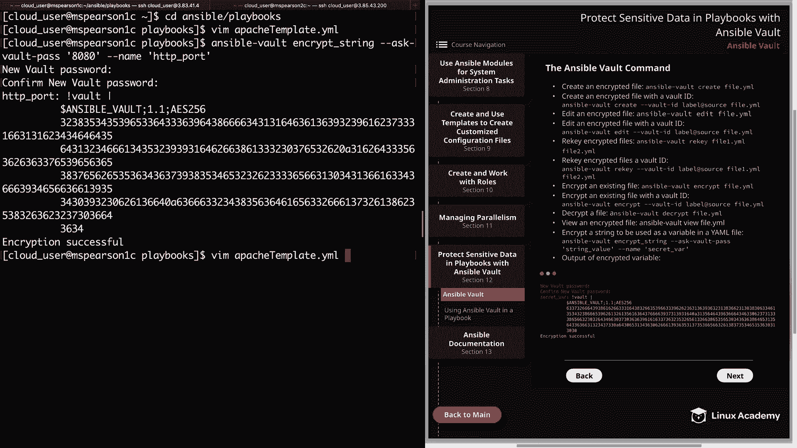
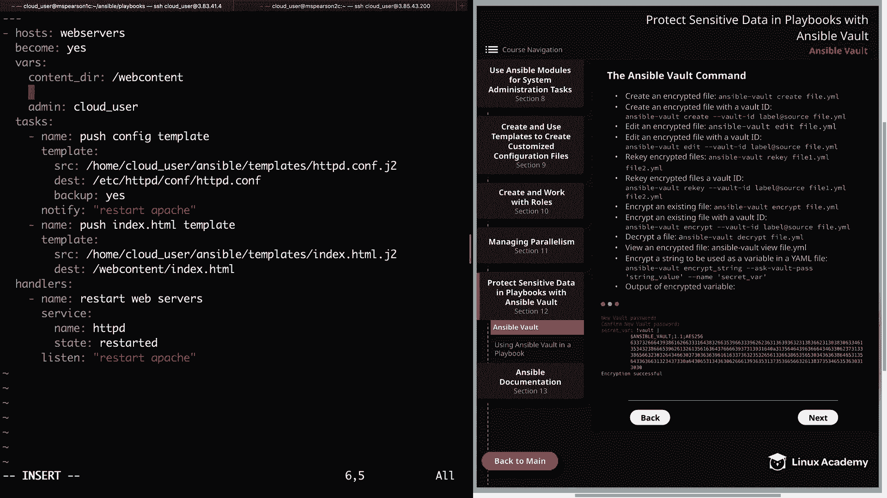
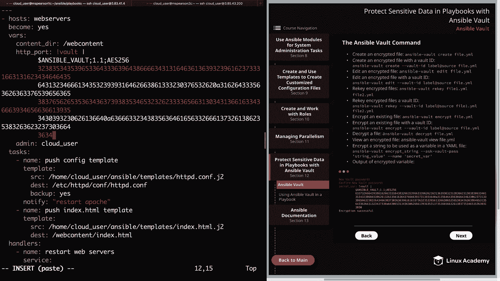
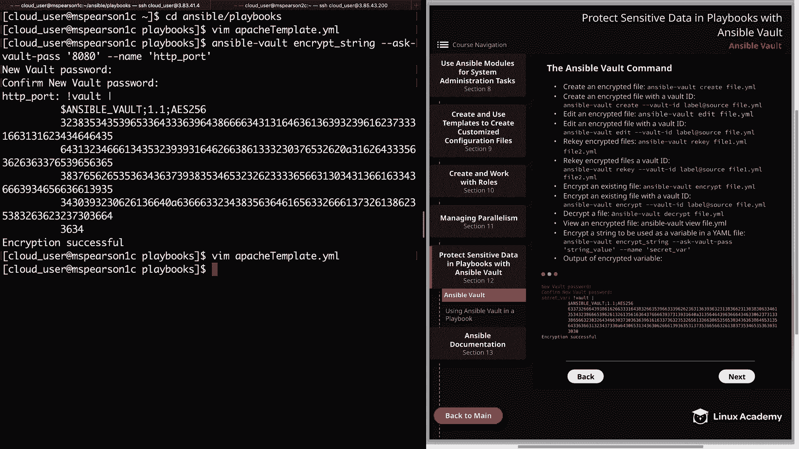
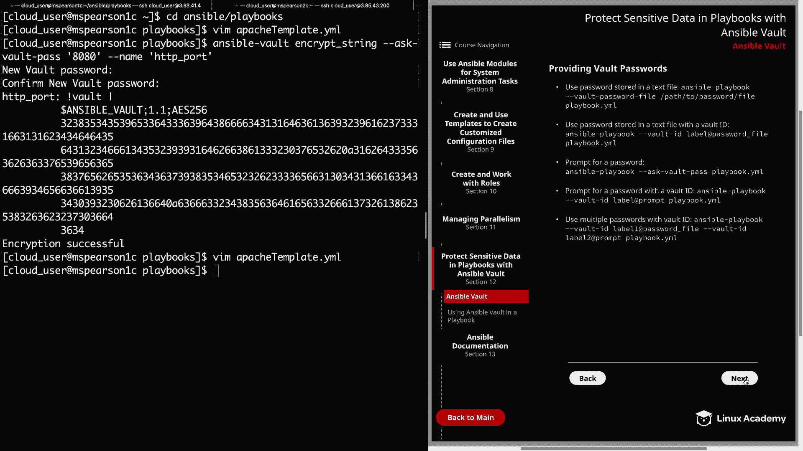

# Red Hat Certified Engineer (RHEL 8 RHCE) - P47：388-4877-1 - Ansible Vault - 11937999603_bili - BV12a4y1x7ND

Welcome back， everyone。 This is Matt。 And in this video。

 we're going to talk about how we can secure information within Ansible。 And for that。

 we're going to be using Ansible Vault。 So let's head over to our diagram and then on to the next page。

 and then to section 12。 So in this video， we're going to be talking a little bit about Ansible  Vault and more specifically the Ansible  Vault command。

 And then in the next video， we're going to go over how to use this in our playbook in order to secure information。

 So first， Ansible  Vault can be used to encrypt any structured data file used by Ansible。

 And some examples of this are going to be variable files located in the group vs and hostvas directories。

Variable files that are loaded by the include Vrs and varrs files。

 keywords within a playbook and also variable files that are passed on the command line using the dash E option and then the name of the variable file。

 And these are just a few examples of some of the types of files that you can encrypt。

 but it's good to keep in mind that with ansible vault， you can encrypt any arbitrary data file。

 and this can be very helpful when it comes to securing sensitive information within your ansible installation。

Next， passwords on an encrypted file can be updated using the ansible vault re key command。

 So if you need to update your passwords or you need to have a rotation updating your passwords。

 you can do this with Ansible vault re key。 Also in addition to encrypting entire files。

 you can also encrypt individual variables inside your YaAml files using the exclamation vault tag。

 but keep in mind that the re key command does not work when you're encrypting these individual level variables inside your Yaml file。

 So in order to update that password you would just have to redo the encryption on that variable。

 but this can be very useful if you have sensitive information that is defined in a variable and that way you don't have to encrypt the entire file。

 Then lastly， you can use vault idds to support multiple vault passwords。

 and this is done by using labels that are used to distinguish between individual passwords。

So an example of this would be using thevault ID flag and then specifying your label and this could be something like Pro or dev or test。

 and then the source， and this is either going to be the path to a password file or prompt in order to prompt you for a password。

All right， so let's head over to the next page。 We're going to talk a little bit about the ansible vault command。

And again， I will be providing a demonstration of this in the next video。

 but I wanted to go ahead and go over some of the different subcommans for the Ansiblevault command and also provide them here in the diagram so that you can reference them。

 So first， you can create an encrypted file by using ansiblevault create and then the name of the file。

 And this can also be done using Vault ID。 So in that situation。

 you would just pass thevault Id flag and then the label and the source of your password。

And then to edit an encrypted file， you're going to use the edit subcom and the name of your file。

 And again， this can also be done with Vault IDd。 And then if you'd like to re key your encrypted file to update that password。

 you can use Ansiblevault re key and then the name of your file or files。

 and I've also provided the example of re keying withvaultt IDd。

And then in addition to creating an encrypted file， you can also encrypt an existing file。

 and for that you're going to use Ansiblevault encryptry， and this can also be done with Vaultt IDd。

And then next， you can decrypt a file by using ansiblevault decrypt。

 So if you've encrypted a file that you feel like no longer needs to be encrypted。

 you can decrypt it， and then you can interact with it like you would any other normal Yamble file。

 Next， if you would like to view the contents of an encryptpted file。

 you can use the view sub command。And then lastly， if you'd like to encrypt a string to be used as a variable inAl file。

 and this is that individual variable level encryption。

All you need to do is specify the encrypt stringing subcomman。

 and then you need to specify ask Vault pass。 So it's going to prompt you for a vault password for that particular variable。

 And then you're going to enter in the value of the string。

 So that's going to be the actual value of the variable。

 And then dash dash name and then the name of your variable。 And then here at the bottom of the page。

 I've provided what the output of this command looks like。And rather than walking through that。

 let me show you an example of this in the command line。

So let's go ahead and head over to Ansible and then our playbooks directory。And I'm going to open up。

The Apache template playbook， which is one that we've used before。

And if you remember we defined three variables here under the VarRS keyword， we have content Dur。

 HTTP port and admin， and so let's just go ahead and encrypt the HTTP port variable。

 and that way a normal user who's looking at our playbook won't know what port we specified for our Apache server。

So I'm going to quit out of this。And in order to create this encrypted variable。

 we're going to use the Anible law command。And then we're going to pass our subcom。

 which is encrypt under squ string。Then again， we need to specify askvault pass。

So that way it'll prompt us for a password for this particular variable。

And then we're going to specify the value of our variable， which is going to be 80，80。

And then we need to give the name， and we're just going to keep it as HttP underscore port。All right。

 let's go ahead and hit enter。And then it's going to ask us for a new vault password so you can go ahead and enter whatever you'd like here。

Then we're going to confirm the password。And then it's going to print out exactly what we need to add to our playbook。

 So you see we have our HttP port variable and then our vault tag followed by the encryption string。

 So let's go ahead and just copy all of this。And then we can open up our Apache T playbook。

And I'm going to go ahead and delete this line。And add another and then just paste in our encrypted variable。

And now we've hidden the value of our variable， and every time we go to run our playbook。

 it's going to require us to enter in that password that we supplied when we were creating it。

All right， let's go ahead and save and quit。

And now we can head over to the next page。And then we're going to talk about the ways that you provide or supply Vault passwords。

First， you can use a password stored in a text file for this。

 you would just specify your command Anipible playbook and then the flagvault password file。

 and then you're going to provide the path to the password file。 And then of course。

 the name of your playbook。 So rather than you being prompted for a password。

 It's just going to use the password that you provided within that password file。

 and this can also be done usingvault ID。 So again。

 we're going to specify thevault ID flag and then the name of our label。

 And then we just need to specify the path to our password file。 Next。

 you can be prompted for a password。 and for this， you just use askvault pass。

And this can also be done using Vaultt ID， so rather than specifying a password file。

 we're just going to specify our label and then the keyword prompt。

 and that's going to prompt us to enter in a password。And then lastly。

 you can also use multiple passwords， and this is supported usingvaultt ID and to do this。

 you're actually going to specify multiple vault ID flags， and in this example。

 we're using the label 1 and then a password read from a file。

 and then we're using label 2 and specifying prompt in order to be prompted for a password。

So the label 1 password will be attempted first and then will be followed by the label2 prompt。Well。

 let's going to finish up this video on Ansible Vault now that we have a little bit of knowledge about the command and some of the concepts。

 we're going to move on to using Ansible Vault in our playbook in the next lesson。

 so let's go ahead and mark this one complete。

