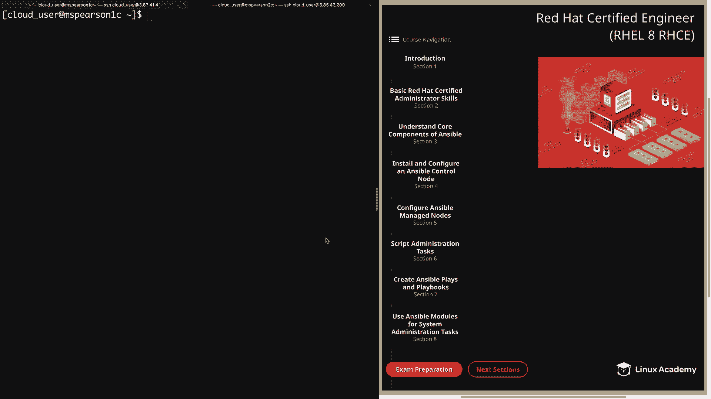
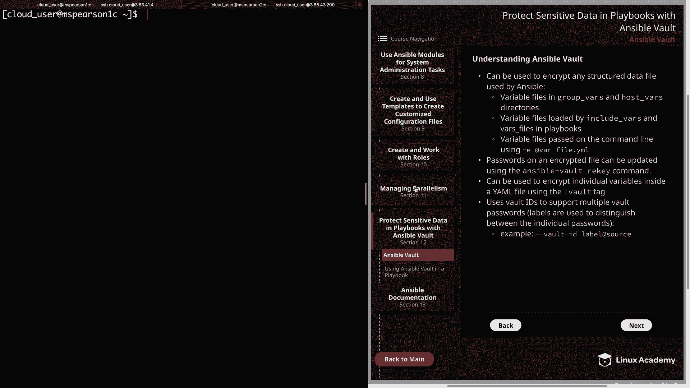
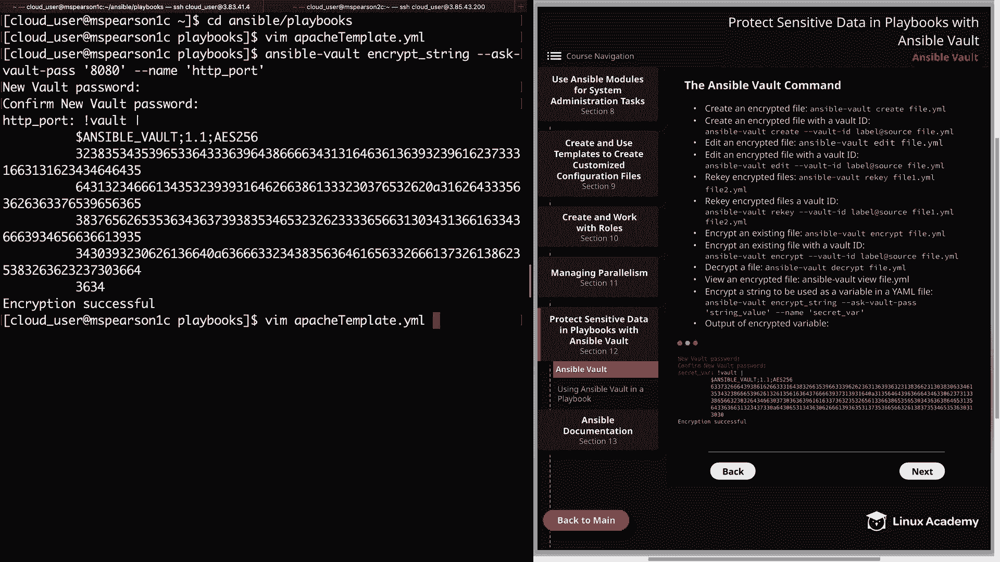
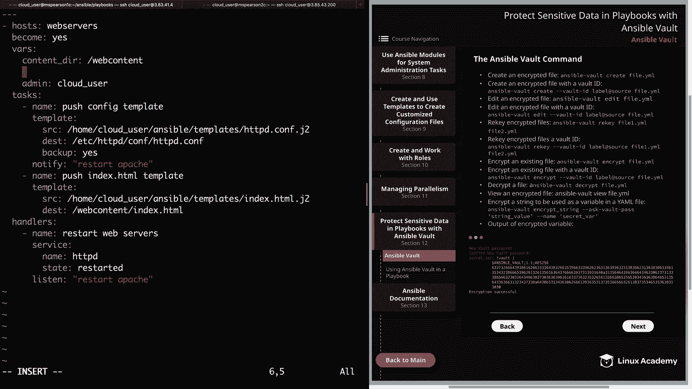
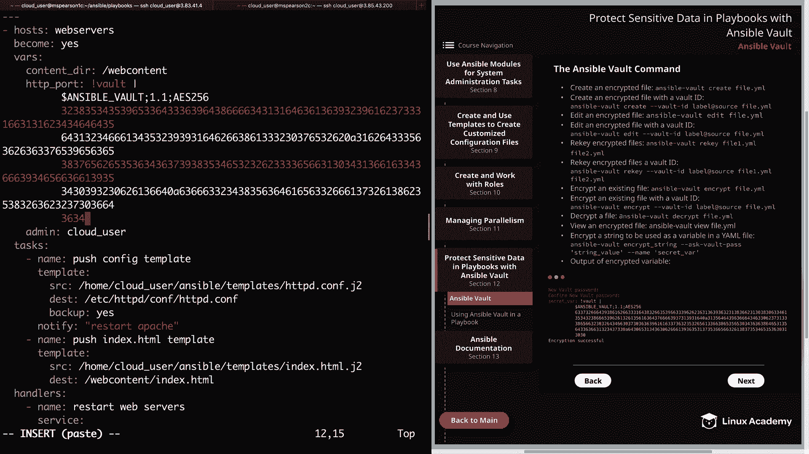
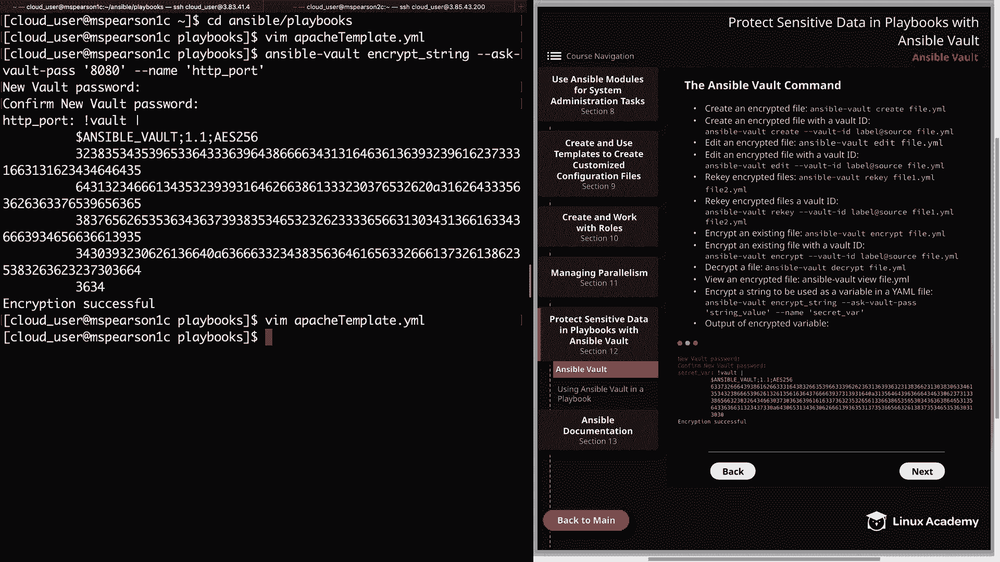
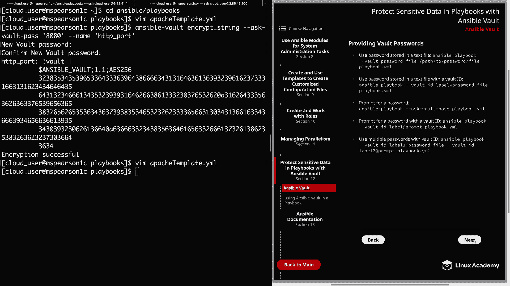

# Ansible 教程：第12章：Ansible Vault 🔐

在本节课中，我们将学习如何使用 Ansible Vault 来保护 Ansible 中的敏感信息。Ansible Vault 是一个用于加密任何 Ansible 使用的结构化数据文件的工具，这对于保护密码、密钥等机密数据至关重要。



上一节我们介绍了 Ansible 的基础概念，本节中我们来看看如何通过加密来确保数据安全。

## Ansible Vault 概述

Ansible Vault 可用于加密 Ansible 使用的任何结构化数据文件。以下是一些可以被加密的文件示例：
*   位于 `group_vars` 和 `host_vars` 目录中的变量文件。
*   在 Playbook 中通过 `include_vars` 和 `vars_files` 关键字加载的变量文件。
*   使用 `-e` 选项在命令行传递的变量文件。

除了加密整个文件，你还可以加密 YAML 文件中的单个变量。这在你只需要保护部分敏感数据时非常有用。

## Ansible Vault 命令详解



接下来，我们详细了解一下 `ansible-vault` 命令及其子命令。在下一节视频中，我们将进行实际操作演示。

以下是 `ansible-vault` 的主要子命令及其功能：

*   **创建加密文件**：使用 `ansible-vault create <文件名>`。此命令会创建一个新文件并立即进入编辑状态，保存时文件内容会被加密。
*   **编辑加密文件**：使用 `ansible-vault edit <文件名>`。此命令会解密文件、打开编辑器供你修改，保存后重新加密。
*   **重新设置密钥**：使用 `ansible-vault rekey <文件名>`。此命令用于更改已加密文件的密码。
*   **加密现有文件**：使用 `ansible-vault encrypt <文件名>`。此命令将普通的 YAML 文件转换为加密文件。
*   **解密文件**：使用 `ansible-vault decrypt <文件名>`。此命令将加密文件还原为普通文件。
*   **查看加密文件内容**：使用 `ansible-vault view <文件名>`。此命令允许你查看加密文件的内容，而无需编辑。
*   **加密字符串**：使用 `ansible-vault encrypt_string`。此命令用于加密单个字符串，以便将其作为加密变量嵌入到 YAML 文件中。

## 加密单个变量示例

现在，让我们通过一个具体例子来看看如何加密 Playbook 中的单个变量。假设我们有一个 Playbook，其中定义了一个变量 `http_port`，其值为 `80`。我们不希望这个端口号明文显示。

首先，我们使用 `ansible-vault encrypt_string` 命令来加密这个值：

```bash
ansible-vault encrypt_string --ask-vault-pass '80' --name 'http_port'
```

执行命令后，系统会提示你输入并确认用于加密该字符串的密码。之后，命令会输出加密后的结果，格式如下：

```yaml
http_port: !vault |
          $ANSIBLE_VAULT;1.1;AES256
          66386439653236336462626566653063336164663966303231363934653561363964363833313664
          3138646161356135323538316437656162666135383263360a626438316336353433326338353133
          34323166623630343337633931333361323534323533393064353830613666643861626366396362
          3133363533366363640a383432626665656363656462623837376365656162376365343561313331
          6564
```



然后，你可以将这段输出直接复制并替换 Playbook 中原来的 `http_port: 80` 这一行。这样，变量的值就被安全地加密了。





## 提供 Vault 密码的方式



运行使用 Vault 加密内容的 Playbook 时，你需要提供解密密码。有以下几种方式：

*   **密码文件**：使用 `--vault-password-file` 标志指定一个包含密码的文本文件路径。
*   **交互式提示**：使用 `--ask-vault-pass` 标志，运行 Playbook 时会提示你输入密码。
*   **多密码支持 (Vault IDs)**：使用 `--vault-id` 标志，可以指定多个带标签的密码来源（如文件或提示），用于解密不同部分的内容。例如：`--vault-id label1@password_file --vault-id label2@prompt`。

## 总结

本节课中我们一起学习了 Ansible Vault 的核心功能。我们了解到 Vault 可以加密整个文件或单个变量，并掌握了 `ansible-vault` 命令的基本用法，包括创建、编辑、加密和解密文件。我们还通过一个例子演示了如何加密 Playbook 中的字符串变量，并介绍了运行 Playbook 时提供解密密码的几种方法。掌握这些知识，你就能开始使用 Ansible Vault 来保护你的自动化项目中的敏感信息了。



在下一节课中，我们将把这些知识应用到实际的 Playbook 中，学习如何在剧本运行过程中集成和使用 Vault 加密的数据。