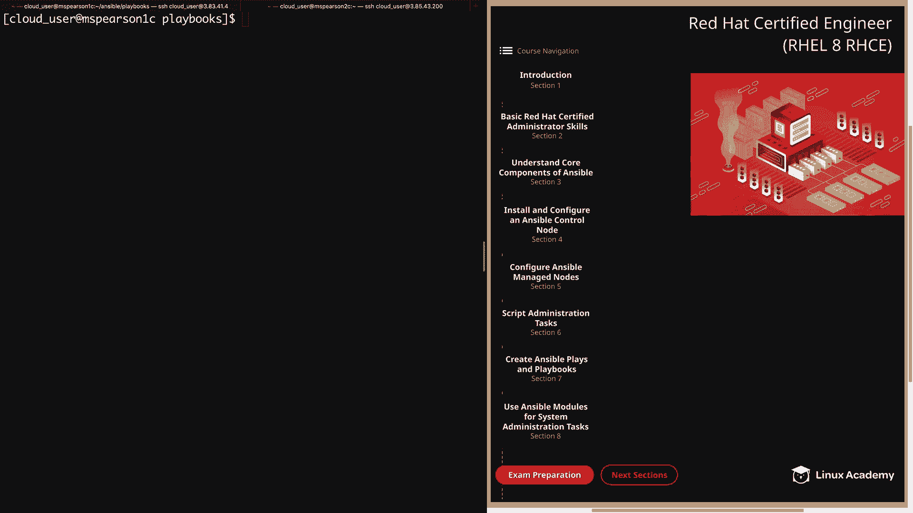
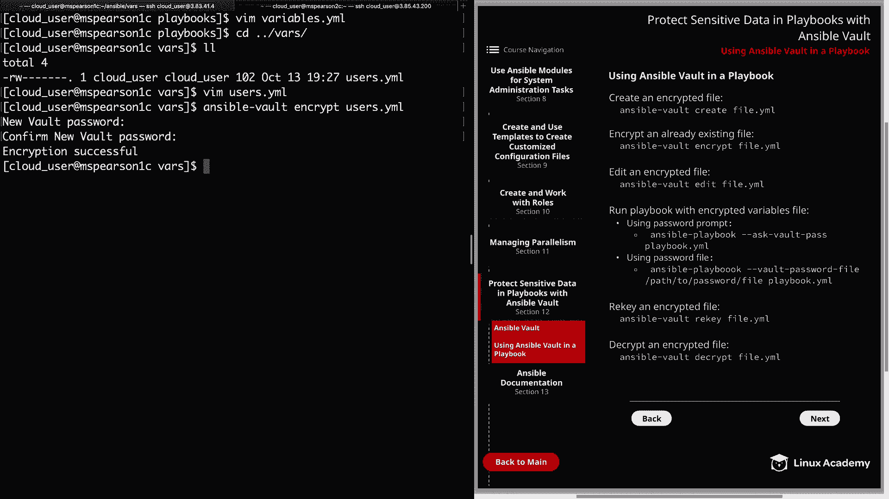
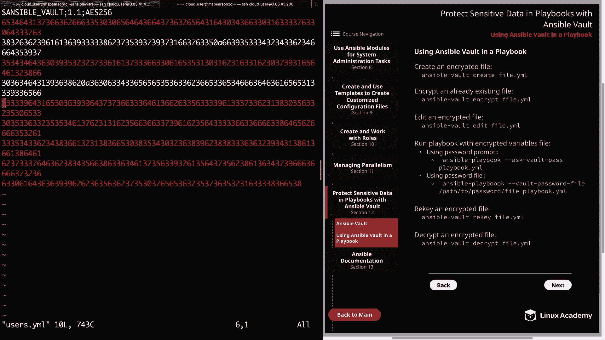
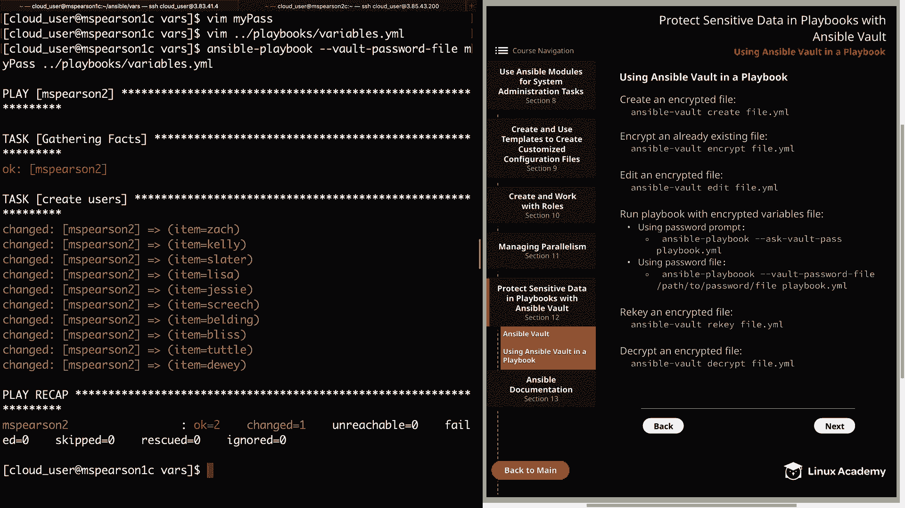
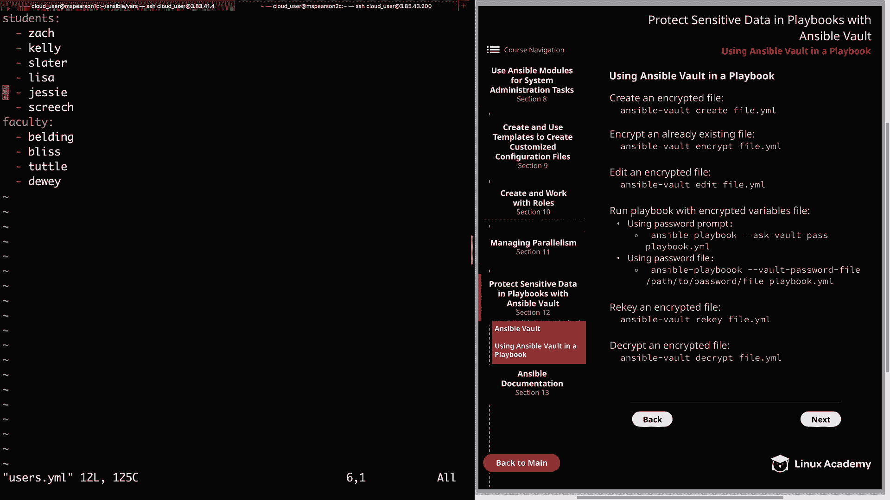

# Red Hat Certified Engineer (RHEL 8 RHCE) - P48：388-4877-2 - Using Ansible Vault in a Playbook - 11937999603_bili - BV12a4y1x7ND

Welcome back everyone， this is Matt， and in the previous video we talked about some of the different concepts of Ansible Vault and the Ansiblevaultt command。

 and in this video we're going to be walking through a demonstration of how we can use Ansible Vault in order to secure our playbooks。

So let's go ahead and click on next sections and then section 12 and finally down to using Ansible Vault in a playbook。

And on this page， I've just provided some of the commands that we're going to be walking through as we do our demonstration。

But the first thing I want to do is show you the playbook that we're going to be working with。

 It's going to be one that we've used before。And this is variables do Yaml。And in this playbook。

 we're going to be using a variable file called users。

yMl that were referencing using our VRS underscore files keyword。

 and then we're going to loop through that variable file in order to create some users。

Let's go ahead and quit out of this。All right， so now let's head over to our vris directory。

And we're going to see our variable file users。ymail， so let's go ahead and open that up real quick。

And we say that we're just defining two variables students， faculty。

 and then there's a list of users underneath that。And for this example。

 we could have created a new variable file using ansible Vault create。

 but since we already have this variable file created。

 let's go ahead and encrypt it using the antsible  Vault encrypt command。

 So it's going to be ansible Vault。And then encrypt and then the name of the file， which is user。yMl。

And now it's going to ask us to supply a new vault password， and I'm just going to use the password。

 good password。And with that， we have encrypted our file。

 so let's see what happens if we try to edit that now using them。

And as you can see， rather than being able to see our variables in our list of users。

 we're greeted with this encryption string。

So let's go ahead and quit out of this。And let's say that we need to update our variable file and add a couple of new users to it。

 Well we could have done this prior to encrypting the file， but now that it's encrypted。

 we need to use the ansible Vault editit command in order to edit our file。

 Let's go ahead and clear that。And we're going to use ansible Vault edit and then the name of our file。

It's going to ask us for a evolved password， which is good password。

And we see that we're thrown into the file using a text editor， it's actually going to default to VI。

So now let's go ahead and update our students variable and add a couple more students。So first。

 we're going to add Jesse。And then we can add screech。All right， so let's go ahead and save and quit。

And now that we've edited our file， let's go ahead and try to run our playbook。

It's going to be antsible playbook。This is in playbooks， it's called variables Dyaml。

And we see that we're greedy with an error that says attempting to decrypt。

 but no vault secrets were found， and that's because it's going to try to decrypt our variable file。

 but we didn't supply a password to our ansible Playbook command。

So now let's go ahead and run the playbook again， but this time we're going to use theAsValt Pass option。

 which is going to prompt us for a password。So Ansible playbook， and then we have dash dash， ask。

 vault pass。And then the path to our playbook。All right， let's go ahead and hit enter。

And then it's going to prompt us4 of all password， so we'll enter in good password again。

And you see that immediately it starts gathering facts and kicking off our playbo。

And since this playbook can take a little while to run。

 I'm going to go ahead and speed it up for you so you don't have to wait。All right。

 so now that that has completed， let's head over to MS Pearson 2。And then we can cat Etsy pass WD。

And we see that all the users have been added， including Jesse and Screech。

 which we updated in our variables file。So now let's head back to our control node。

And now I want to show you how you can store a password in a file so that way you can just give the location of your password file rather than having to be prompted。

So let's just go ahead and create it here in our virus directory。

And I'm just going to call this my pass。And now all we need to do is supply the text of our password。

Remember， it is good password。Which is actually not a good password， but that's okay。

 given that this is not a production environment。 So now let's go ahead and save and quit。

And before we run this， let's go ahead and update our playbook so that it will remove our users。

So again， it's in our playbooks directory。Variables。And now we're going to remove。

State present and add in absent。Then we're also going to add in remove。We'll set this equal to yes。

 so it removes all the directories associated with our users。Go ahead and save and quit。

And now we can run our playbook。 It's going to be ansible playbook。

And this time I'm going to specify thevault password file flag。So， it's vault。Password file。

And then just the path to our file， so since we're in the vars directory， I can just say my pass。

And then our playbook。Which is variables dot Yal。And we see that we weren't even prompted for a password。

 but they just read the password from our password file。

 so now I'll go ahead and speed this up so you don't have to wait。Allright。

 so now let's head over to MSParson 2。We can run another cat on past WD。

And we see that all the users have been removed。 So let's head back to our control node。

 And one final note about password files， Just keep in mind that you should really do your best in order to protect the password from other users on the system。

 But again， given that this is a lab environment， it's not really that big of a concern。All right。

 so let's go ahead and clear this out。

And now I want to show you how you can change the password on an encrypted file。

 and this is called re keying， so let's go ahead and re key ourus。yml。

 So for that we're just going to use ansiblevault。And then it's re key and then the name of our file。

So it's going to prompt us for our current password， which is just called good password。

And then it's going to prompt us for our new password。 I'm just going to say best password。

And as long as you type the password correctly， you're going to see Re key successful。

So anytime you need to interact with this particular file。

 it's going to ask you for that new password。Al right。

 so now the last thing I want to show you is how to decrypt an encrypted file。

 and this is done using ansible Vault to cryrypt。So let's go ahead and run that on our variable file。

 so antsiblevault decrypt， and then users。yMl。That will enter in our password。Best password。

We see decryption was successful。 So now let's see what happens when we try to edit this using them。

We see that we're no longer greeted with that encrypted text string。

And we're able to interact the file as if it's any other normal file。Well。

 that's going to finish up this video on using Ansible  Vault in Playbooks。

 so let's go ahead and mark it Comp and we can move on to the next section。

