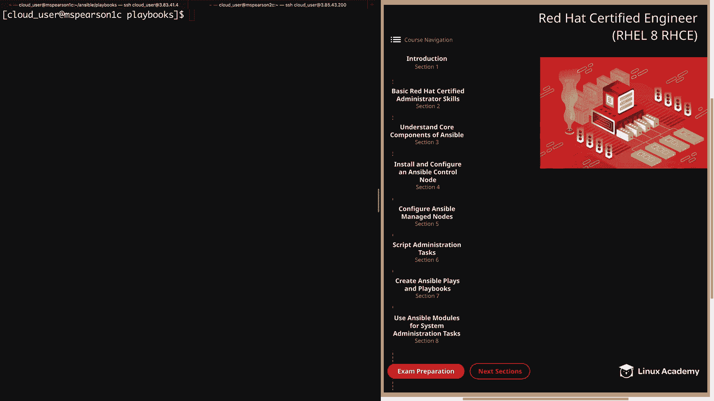
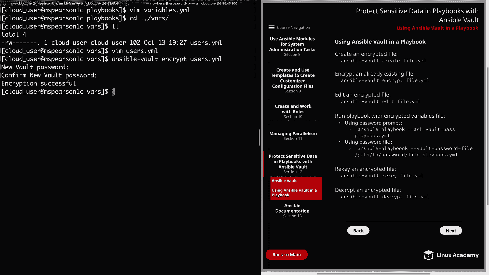
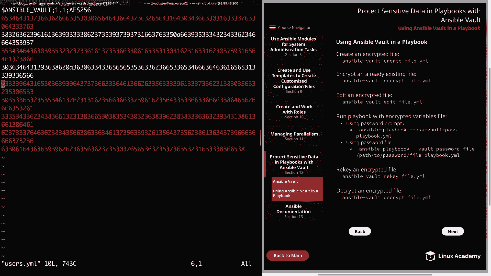
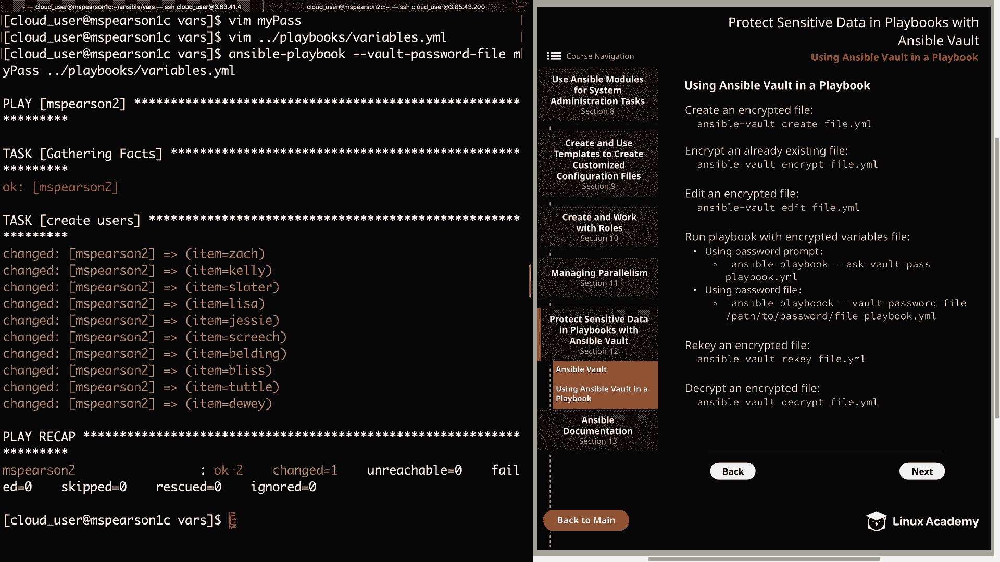
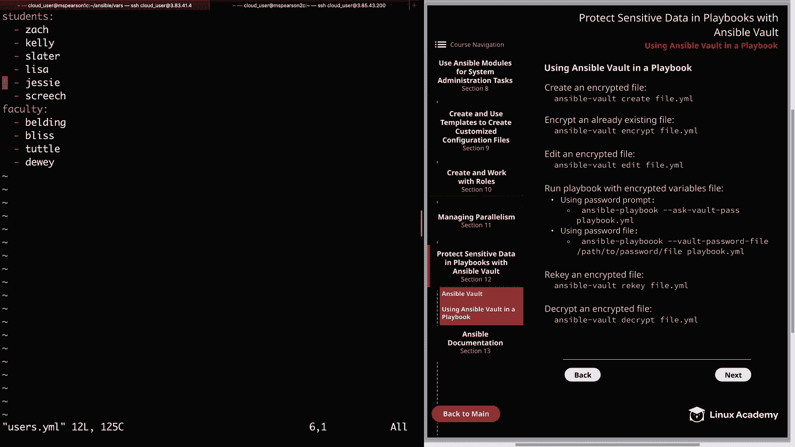

# Ansible 教程：P48：使用 Ansible Vault 保护 Playbook 🔐

在本节课中，我们将学习如何在 Ansible Playbook 中使用 Ansible Vault 来加密和保护敏感数据，例如变量文件中的密码。我们将通过实际操作演示加密、编辑、解密文件以及使用密码文件的完整流程。



上一节我们介绍了 Ansible Vault 的基本概念和 `ansible-vault` 命令。本节中，我们将通过一个具体的 Playbook 示例，来看看如何将这些概念应用到实际工作中。

## 准备工作

首先，我们来看一下将要使用的 Playbook。这是一个我们之前用过的名为 `variables.yml` 的 Playbook，它通过引用一个名为 `users.yml` 的变量文件来创建用户。

```yaml
# playbooks/variables.yml 示例结构
- hosts: all
  vars_files:
    - ../vars/users.yml
  tasks:
    - name: Create users
      user:
        name: "{{ item }}"
        state: present
      loop: "{{ students + faculty }}"
```

我们的变量文件 `vars/users.yml` 内容如下，它定义了两个列表变量：

```yaml
students:
  - zach
  - lisa
faculty:
  - slater
```



## 加密变量文件



由于 `users.yml` 文件已经存在，我们将使用 `ansible-vault encrypt` 命令对其进行加密，而不是在创建时加密。

运行以下命令：
```bash
ansible-vault encrypt vars/users.yml
```
系统会提示你输入一个新的保险库密码。输入密码后（例如 `goodpassword`），文件即被加密。

现在，如果你尝试用文本编辑器（如 `vim`）直接查看该文件，看到的将是加密的乱码字符串，而不是原始的变量内容。

## 编辑加密文件

如果需要更新加密文件中的内容（例如添加新用户），必须使用 `ansible-vault edit` 命令。

运行以下命令：
```bash
ansible-vault edit vars/users.yml
```
输入正确的保险库密码后，文件会在默认的 `vi` 编辑器中打开，此时你可以像编辑普通文件一样修改它。

例如，在 `students` 列表下添加两个新用户：
```yaml
students:
  - zach
  - lisa
  - jesse
  - screech
```
保存并退出编辑器后，修改即被保存到加密文件中。

## 运行使用加密文件的 Playbook

直接运行引用了加密变量文件的 Playbook 会失败，因为 Ansible 需要密码来解密文件。

如果尝试运行：
```bash
ansible-playbook playbooks/variables.yml
```
你会收到错误提示：`attempting to decrypt but no vault secrets found`。

为了在运行 Playbook 时提供密码，可以使用 `--ask-vault-pass` 选项：
```bash
ansible-playbook --ask-vault-pass playbooks/variables.yml
```
执行命令后，系统会提示你输入保险库密码。输入正确密码后，Playbook 便会开始执行，并成功在目标主机上创建所有用户（包括新添加的 `jesse` 和 `screech`）。

## 使用密码文件

为了避免每次运行 Playbook 都手动输入密码，可以将密码存储在一个文件中。首先，在 `vars` 目录下创建一个密码文件：

```bash
echo "goodpassword" > vars/my_pass.txt
```
**注意**：在生产环境中，必须妥善保护此密码文件，设置严格的文件权限（如 `600`），防止其他用户读取。

现在，运行 Playbook 时可以使用 `--vault-password-file` 选项指定密码文件路径：
```bash
ansible-playbook --vault-password-file vars/my_pass.txt playbooks/variables.yml
```
Ansible 会自动从该文件中读取密码，而无需再次提示。

为了演示清理操作，我们可以修改 Playbook 将用户状态改为 `absent` 并设置 `remove: yes` 来删除用户及其主目录，然后再次使用密码文件运行 Playbook 来清理环境。

## 更改加密文件的密码（Re-key）



如果需要更改已加密文件的密码，可以使用 `ansible-vault rekey` 命令。

运行以下命令：
```bash
ansible-vault rekey vars/users.yml
```
系统会先提示输入当前密码（`goodpassword`），然后提示输入并确认新密码（例如 `bestpassword`）。成功后，以后操作此文件就需要使用新密码了。

## 解密文件

如果后续不再需要加密，可以使用 `ansible-vault decrypt` 命令将文件解密。

运行以下命令：
```bash
ansible-vault decrypt vars/users.yml
```
输入当前有效的保险库密码（`bestpassword`）后，文件会被解密为普通的明文文件，之后便可以直接编辑和查看。

---



本节课中我们一起学习了如何在 Playbook 中集成 Ansible Vault。主要内容包括：加密现有的变量文件、安全地编辑加密文件、在运行 Playbook 时通过交互或文件方式提供密码、更改加密文件的密码以及最终解密文件。掌握这些技能能帮助你安全地管理 Ansible 中的敏感信息。