# Red Hat Certified Engineer (RHEL 8 RHCE) - P49：388-4878-1 - Local Documentation - 11937999603_bili - BV12a4y1x7ND

Welcome back， everyone。 This is Matt。 And in this video。

 we're going to kick off a very important section， and that is the section on Ansible documentation。

 First， we're going to talk about the local documentation。 And then in the next lesson。

 we will cover the online documentation。 and it's important to remember that this course can only prepare you for so much。

 especially since we don't know the exact task that will be required during the exam。

 Cose Red Hat does provide a list of objectives。 And we've done our best to attempt to cover those throughout this course。

 But even with that， you could be asked to do something that you're not as familiar with。

 So with that in mind， being able to use the documentation in order to find the particular module or parameter that you need is very important。

So according to Red Hat's website， for most of their exams。

 the documentation that ships with the product is going to be available for the exam as well。

 and in addition to that， one of their stated objectives for this exam is using the provided documentation in order to look up specific information about ansible modules and commands。

So that closes end to the fact that we'll need to be able to quickly utilize the documentation in order to perform tasks given by the exam。

 especially for those of us who do not have photographic memories。So with that being said。

 let's head over to our diagram and we can click on next sections and then section 13 for Ansible documentation。

 and we're going to start off with local documentation。

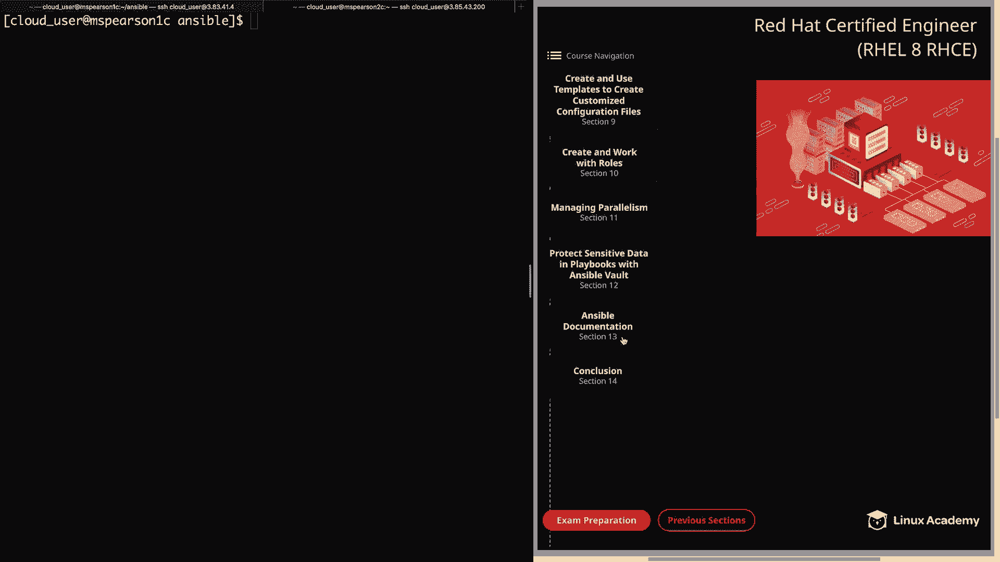

And one last thing that I did want to mention before we dive into this lesson is that in a general rail installation when you're using ym or DNF to install Ansible。

 you're going to have access to the man pages for the individual ansible commands。

But since we've installed Ansible from source， we're not able to just type in Man Ansible or Man Ansible playbook。

 but we're still able to gain information about those command using the dash H flag。

 which is just for help。 So let's head over to the command line and we can test that out and since we're going to primarily be talking about the ansible。

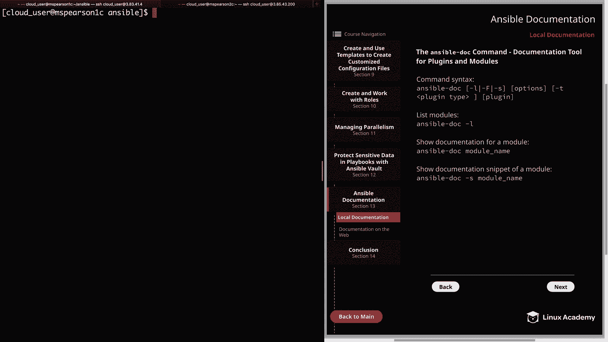

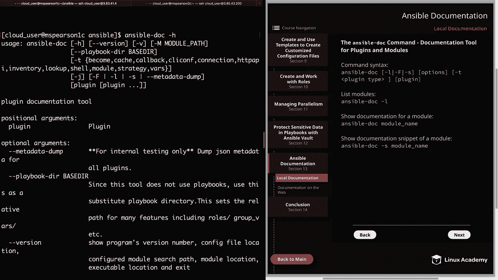

And this is going to show us the different options for the command and at the top you're going to notice usage。

 and that's basically just the syntax for the command in this case it's going to be Ansible doc。

 and then we see a description that says plug in documentation tool。

And please don't get confused by saying plug in here rather than module。

 it's been my experience the term plugin and module。

 at least seem to be used somewhat interchangeably。

But they are actually two different things and according to the Ansible documentation。

 modules are the reusable standalone scripts that we've seen throughout the course。

 and these are used by the Ansible API， the Ansipible command as well as the Ansipible playbook command and are going to execute against the target host which is typically going to be a remote system and plugins。

 on the other hand are going to be used to augment the core functionality of Ansible and execute on the control node rather than a remote system。

For this video， as well as for the course， we're going to be focusing mainly on the modules。

 and we're going to be using the Ansible dot command in order to see what options are offered by the default modules that ship with Ansible。

 And now back to the Ansible dot command， I realize that this screen does have a little bit of text wrap that makes it a little bit more difficult to see。

 but we're going to walk through it a little bit together here。

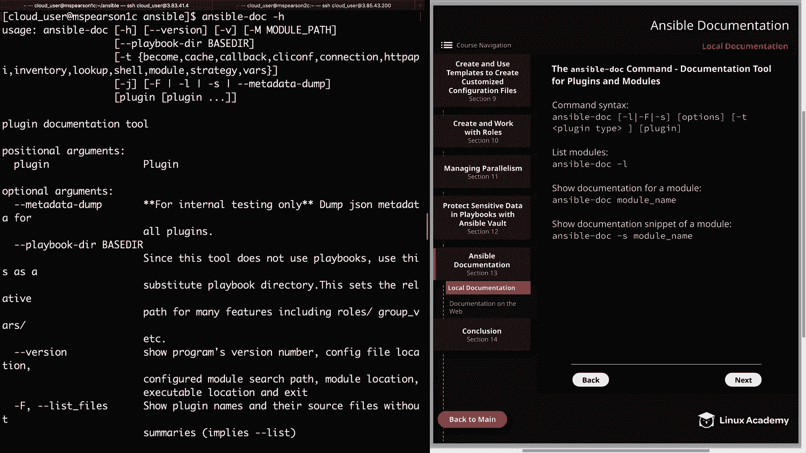

Let's go ahead and scroll down just a little bit。

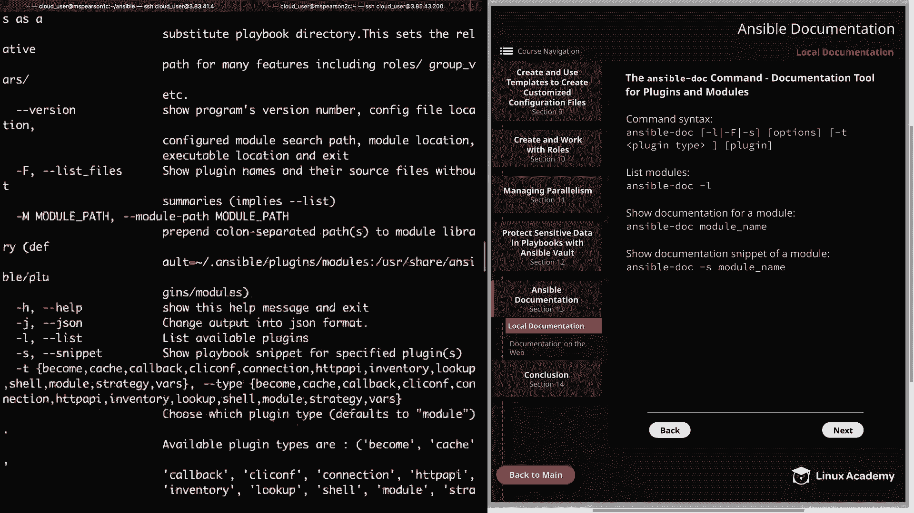

And then we see the dash H option and again this stands for help that's how we got this output that's showing us all the different options as well as descriptions。

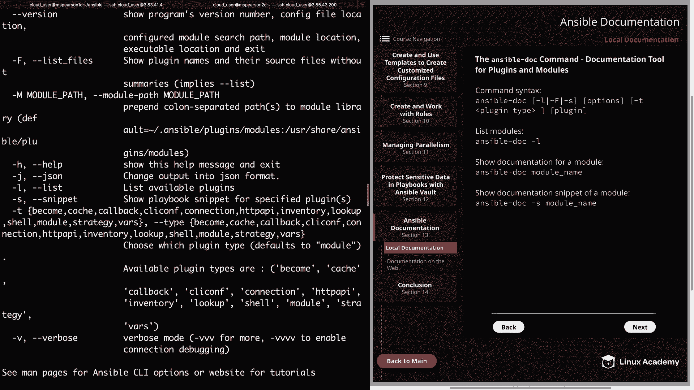

And then the dash L option is going to list the available plugins。 and by default。

 this is going to be modules。 And that's even without specifying the dash T option。

 which lets you specify the plugin type。 as you can see here， it says default to module。

 And then another handy flag is the dash S option， which stands for snippet。

 And this is going to show a playbook snippet for the specified plugin。

The snippet option is not going to provide as much information as just running the Ansible doc command and then the name of the module。

 but it's going to list out the parameters that are available and the descriptions of what each of them do。

And then lastly， we have the dash V option， which， as it is with other Linux commands。

 just stands for over verboose。

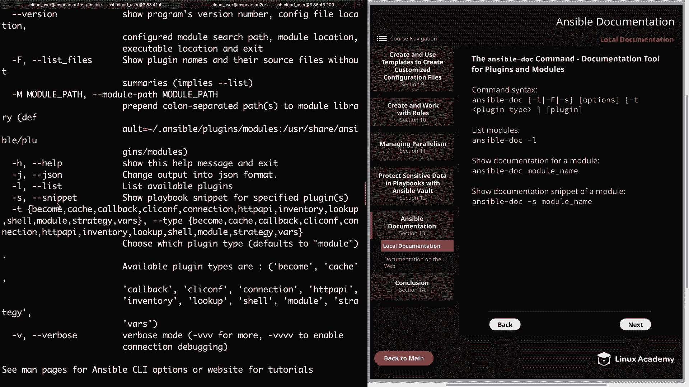

All right， let's go ahead and clear this out。And now let's use the DL option to list out the available Ansible plugins。

So ansable doc L。

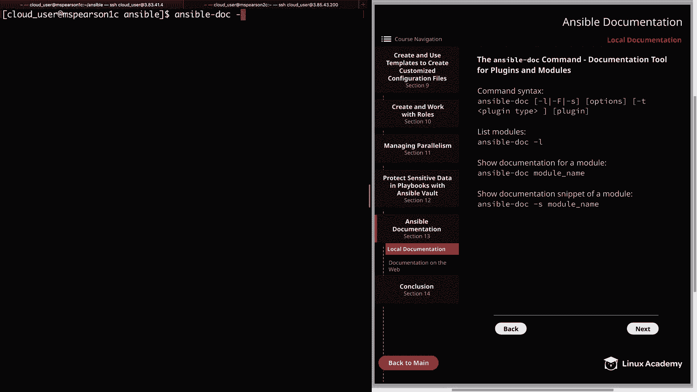

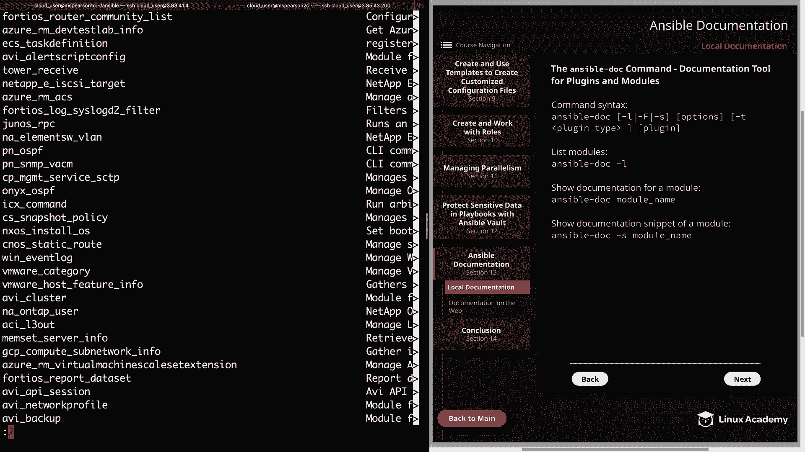

Now this is going to throw you into a text view so that way you can scroll through the different modules。

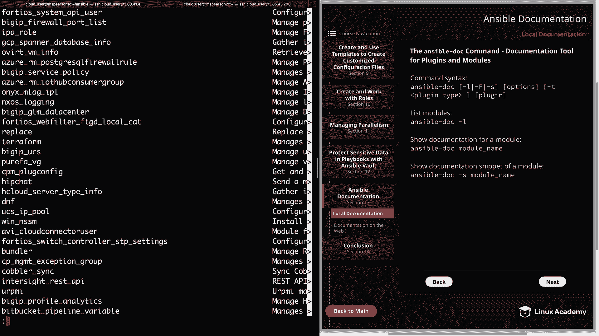

And then if you wanted to， you can also search for particular modules。So here at the top。

 we see the line and file module， and if I page over to the right。

 we see just a brief description of what that module does。

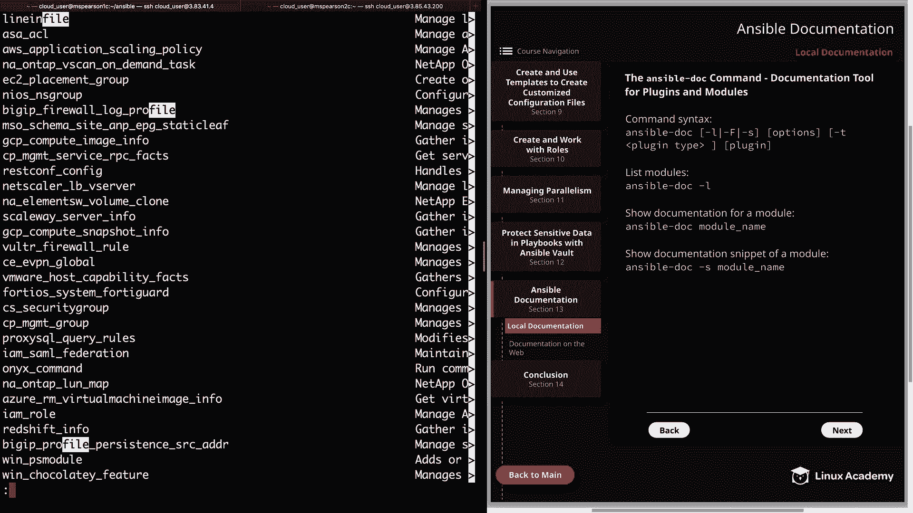

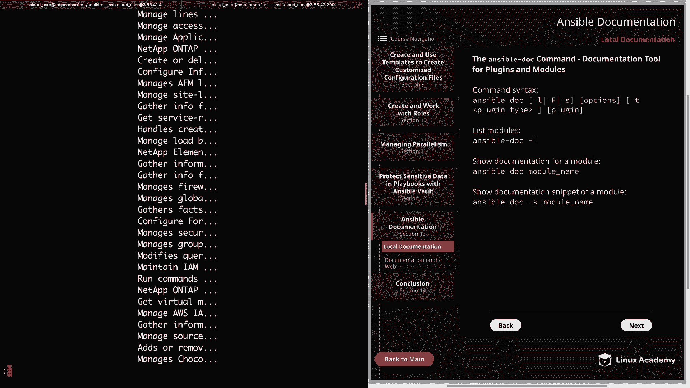

So let's go ahead and quit out of this。

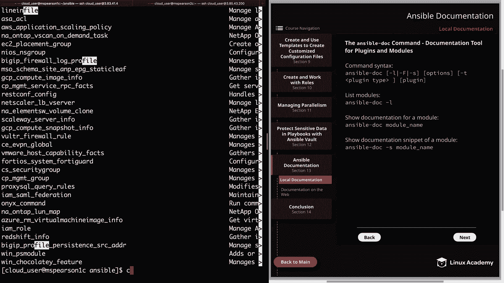

So at the top， we're going to see a description of the module and then any additional information is going to be provided in asterisks we。

Sees there， it's going to be expressed using an equal sign。

 and then the other optional parameters are going to be expressed using a dash。

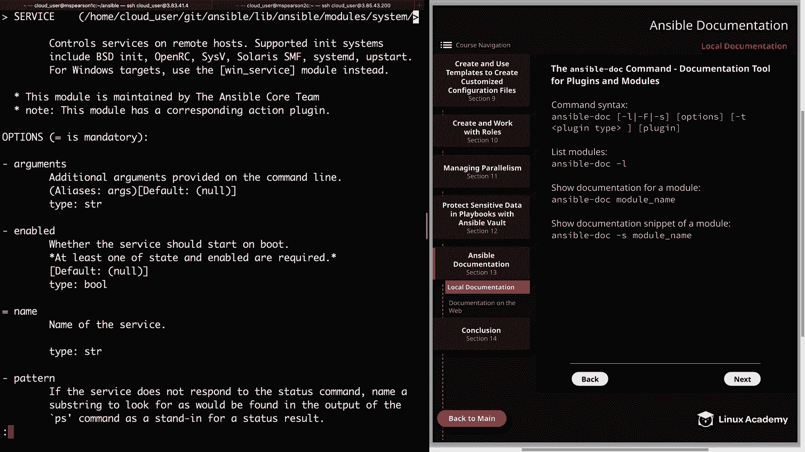

Let's go ahead and page down， you're going to see some additional options。

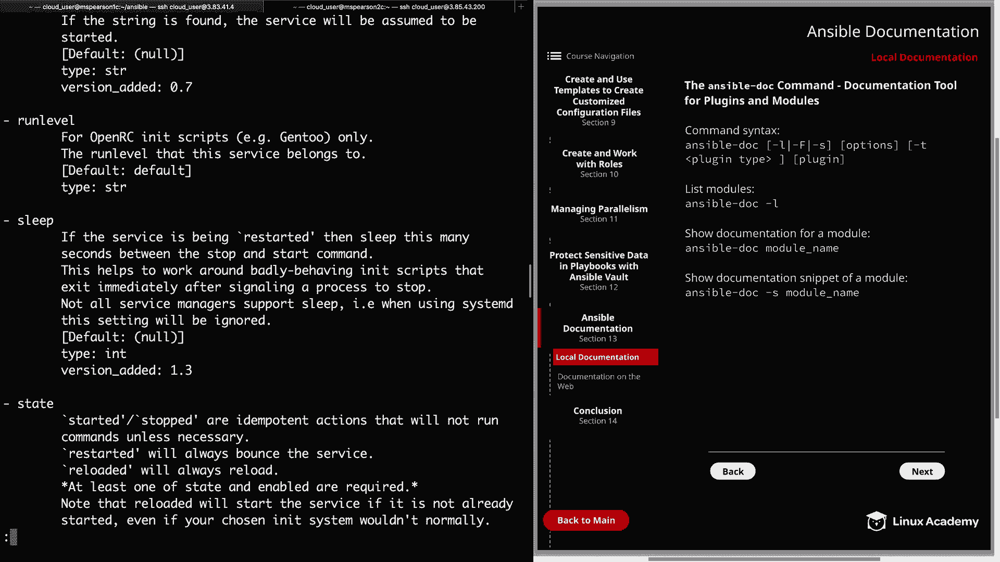

And then we have a notes section which gives us any additional notes and then see also。

 and this is going to show us other similar or relevant plugins。 and then we see the author。

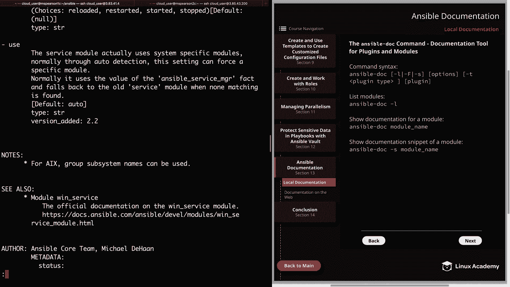

If we go down just a little bit more， we're going to see the example section。

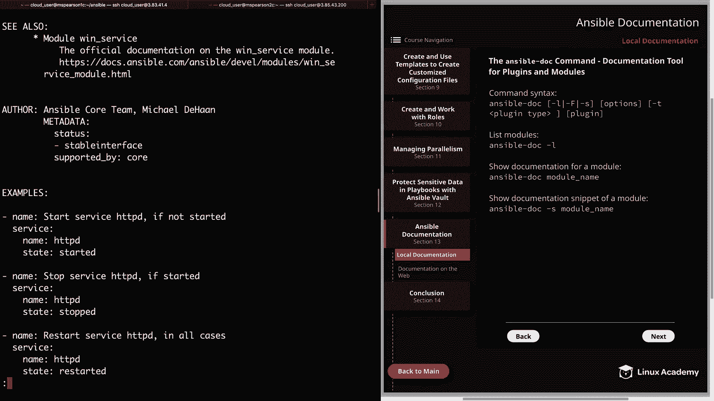

And this is another really， really important section because it's going to give you real examples of the module using different parameters。

So this is going to be really handy when you're working with modules you're not as familiar with and you can see they're going to provide the name and under the name it's going to tell you what that particular example is trying to achieve。

 So we have start service， stop service， restart， reload。

 and I found that the examples are going to cover the majority of things that you can use the module for。

 but even if it doesn't， you still have all the descriptions for all the different parameters within the module。

 All right， so let's go ahead and back out of this。Now I want to show you the dash S flag。

 which of course， is going to show us a snippet of the module。

 So let's go ahead and run that on the service module so you can see the difference between the snippet and the regular documentation。

 So anipible doc。Then dash S， and then service。And you'll notice immediately that the snippet documentation is different from the normal documentation。

 and it's going to be formatted in the same exact way that you would put it as a task in a playbook。

 So under name it gives us a little short description which is managed services。 and then， of course。

 the service module。 and then under the name of the module。

 we're going to have all our different parameters。And if you look at the name parameter。

Examples section So if you just needed to quickly look up the different parameters and a description for those。

 then you could use the snippet command， but if you need to see some examples of how this can be used in a playbook。

 I would recommend using the Ansible dot command without the dash S flag。Well。

 that's going to finish up this video on local documentation。 But before we end。

 I did want to show you that I added just a quick example of the Ansible dot command output for your reference。

 let's go ahead and mark the video complete。 and we can move on to the next lesson。

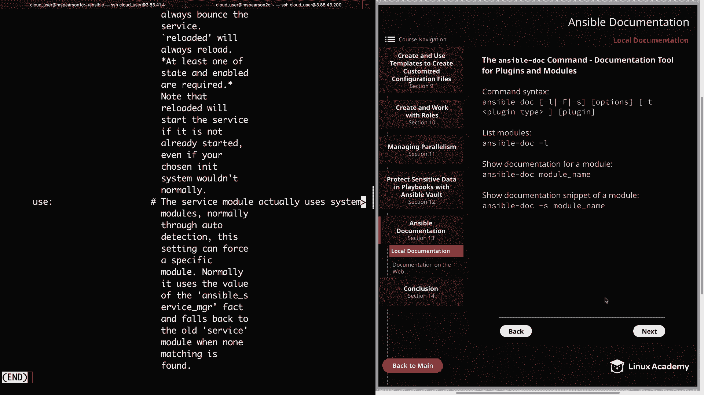

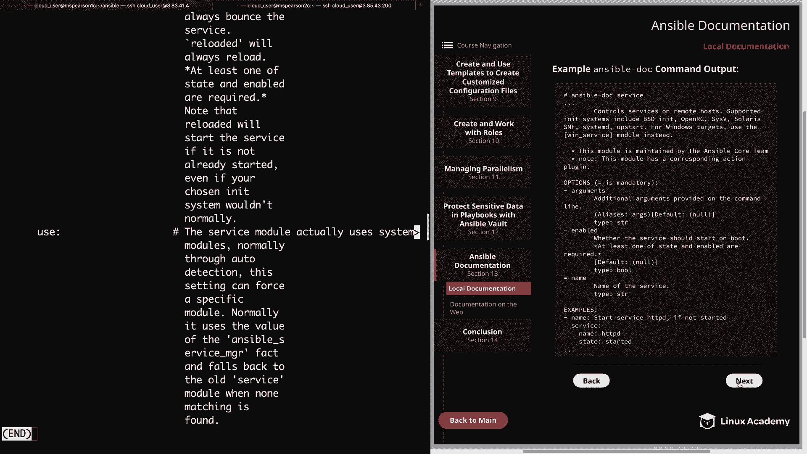