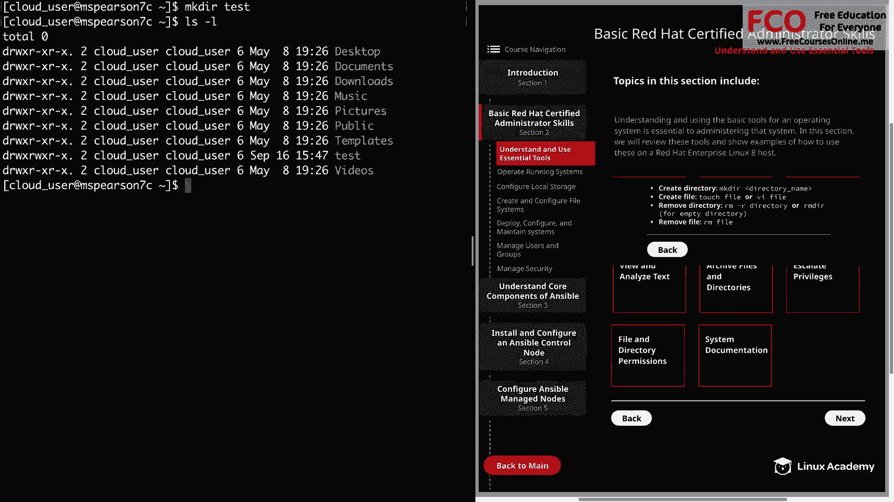
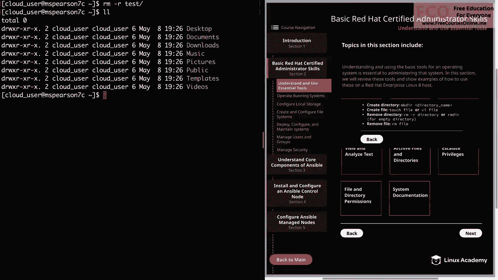

# Red Hat Certified Engineer (RHEL 8 RHCE) - P4：388-4867-1 - Understand and Use Essential Tools (Part 1) - 11937999603_bili - BV12a4y1x7ND

Welcome back everyone， this is Matt and in this video I'm going to be going over section 2。1。

 which is understanding essential tools， and this video is going to kick off section 2。

 which is basic Red Hat certifiedt administrator skillsll。

And this is just going to be a brief recap of some of the tasks and responsibilities that are expected of a Red Hat certified system administrator。

 and just keep in mind that every RHCE is expected to have the skills and knowledge of an RHCSA。

 Now you are allowed to sit and take the RHCE exam， but even if you pass。

 it will not be conferred until you have obtained the RHCSA and this is in large part because all of the material in the RHCE is going to build upon the material from the RHCSA。

A large portion of the objectives are associated with Ansible。

 which is going to allow you to automate a lot of the common administrative tasks。

 but in order to automate， you need to understand the manual process。

 So let's go ahead and jump in and we can head over to our diagram and click on section 2 and that's going to bring us to section 2。

1， which is understand and use essential tools。

So to expand on what I said in the intro， understanding and using the basic tools for an operating system is essential to administering that system。

 So in the section we're going to review these tools and show examples of how to use them on Red Hat Enprise Linux 8 So the first thing that you need to be able to do is log into a remote server using SSH because you can administer a host that you can't log into and just as a quick note。

 each of these red boxes are going to have a topic and then commands that are associated with them So all we need to do is click on the topic and that's going to reveal the additional information。

 So in order to log into the remote server， all we need to do is use SSH and then our username and then at the host that we want to log into for the purposes of this video I have created a red Hat Enterse Linux 8 host and our cloud playground which is only using one unit So if you'd like to fall along and test out these commands go ahead and pause the video and you can spin that up Just remember for distribution to choose Red Hat Enterprise Linux 8。

I'm going to head over to the command line and then all we need to do is run SSH and then the name of our user。

 which is going to be cloud_ user at， and I'm just going to paste in my IP address。

 and then we can hit enter。

Go ahead and supply a password。

And as you can see， we're logged into the host。Now there are some additional flags that you can use with SSH。

 but I'm not going to go into those for this video example。

 but feel free to run Man SSH for more information。Al right， so now that we're logged in。

 let's go ahead and move on to the next topic， which is creating files and directories。

 So we'll just hit back here on the diagram。

It's my user's home directory。

So let's just go ahead and create a new directory using MKDr， and we're just going to call it test。

So if I do a listing here， you can see my test directory。

So we're going to change directory into test。

And then we're going to create a file， and the first way I'm going to show you how to do that is just by simply typing touch。

 and then we're going to go test one。So if we do another listing。

 we see that we have a single file called test 1。You can also create a file by simply using your text editor and then specifying the name of a new file。

 So I'm going to use VI。

And we're going to call this one test2。

So as you can see， it opens us up into a new file and then you can add text。

This is a new file。VI is cool， whatever you want to do。

And then you can save that using WQ。 if we do another listing。

 we see that we have our two files in order to remove the file。

 we can simply type RM and then the name of our file。

You test1。

And as you can see， the file no longer exists。

And then to remove the directory， let's just go back one。So we're back in home Cloud user。

And we see our test directory。 so in order to remove that there's a couple options that we have。

 we can use RMD， but as you see， it's not an empty directory。

 so we're going to end up getting an error when we try to run that。

So what we need to do is run RM with the dash R recursive flag。And then specify our directory。

We do a listing again， we see that our test directory is no longer there。

 So let's go ahead and clear out our directory， and we can move on to the next topic。

 which is input and output redirection。

So first we have standard out and this is going to be the output that you are going to see on your screen。

 So when you run a listing like we just did， it's printing the results of that listing to standard out。

 and then we can use redirection to redirect that output into a file if we want or even another command by using the greater than sign。

Let's go ahead and try that out real quick。So I'm just going to do a quick。L S dash A L on var log。

And we see that this directory has a ton of different files in it。

 so let's go ahead and redirect that output into a file， So we're going to call that log file。

All right， so now we see that we have our log file file， let's go ahead and open that up。

And you see that the output of our LSL command was put into the file。

And then very similar to standard out， we have standard error。

 The only difference is that it's going to print an error。

 So let's say I try to do a listing on a directory that doesn't exist。

 So we'll just call it non exist。

And we see that we get an error message that says no such file or directory。

 and that we have standard in， which rather than outputting data is going to allow us to input data。

So as an example for this， we can use the sort command。

And that's going to put us into this sort prompt。 and then we can input data。

 and then sort is going to sort our data。 So let's just do John。We do Sally。Adam。咩。

And then I'll just hit Cl D to close。And you see that it sorts by name in alphabetical order。

And then we can use redirection with standard in in order to feed data into sort， so we'll type sort。

 and then let's just go ahead and feed it our log file。

And you see that the data is no longer in alphabetical order by the name of the file。

But sort is actually going to go to the first thing that it sees on the line。

 which in this case is going to be permissions and it's going to sort it that way。

And then we can even use input and output in the same line， so let's go ahead and run our sort again。

 and we're going to input the data from our log file。

 and then we're going to output that into a new file， which we'll just call log sorted。

And then we can do a cat on the file。Now we see that it saveds the output from the sort command。

And then I wanted to show you how you can redirect standard error。

 so let's go ahead and run our LS L on our non existent directory here。

And then we're going to redirect that。Using two， and then our greater than to a file。

 and we'll just call it directory error。Alright， so we didn't get any output on the screen。

 so let's go ahead and cat our Dur error file and we see that it captured our error。 All right。

 the last thing that I wanted to show you about input output redirection is pipes and this is where you can take the output from one command and then feed it into another。

So let's go ahead and cat our log sorted file。And then we're going to pipe the output from that into GP。

 which is going to allow us to search for a string， and I'm just going to look for cronny。

And we see that we only have one entry that has to do with cronny。

 and we can also use this to search for other things。 So let's see。Anything that is， readwrite。

 execute。

And we see that we have several entries that have RWX。

So this has just been a simple example of how you can use pipes in order to take the output from one command and put it into another command。

 But this is incredibly useful as you're administering a Linux system。 All right。

 so now we're going to close out of this， and then we're going to move on to view and analyze text。

So again， back to the command line and some of this is going to end up seeing me a little redundant because I did it in some of the examples already。

 but in order to be thorough， let's go ahead and touch on this real quick。

So in order to view an analyze text， you can always use something like a text editor。

 which would be VI or nano or Vim if you have it installed。

 I currently don't own this system otherwise I'll be using Vim， which is enhanced VI。 anyways。

 you can always open up your file with the text editor。

And this is going to allow us to view text and then we can also search for things in our file by using slash and there's a ton of different things you can do with VI。

 but this is just more about showing you how you can view the files you could also use a program like less。

Which isn't going to allow you to edit the file， but just view it。And then as we've already seen。

 you can use CA in order to print file contents to standard out。So we've seen that。嗯。

And then you can use Gr in order to print lines that are matching a particular pattern that you provide。

 So we'll say Gr， and then samba。And we'll look in log file。

And GP is going to return any line that matches the string that we provide。

And just keep in mind that you can also use regular expressions with GrP in order to search for particular things in a file。

So just to illustrate that， I can do Gr。And I'll do my single quotes。And then we'll say samba。

And then add my dollar sign。 So I'm going to look for any line that ends with saba and then specify our file name。

 which is a block file。 And we see that the line is returned。

 and it's the only line that ends in samba。 Then on the same token。

 we could also search for any line that begins with。Let's just use DRWX。

Search in the same file。And we see that every line beginning with D RW X is returned。 Well。

 it's going to finish up part one of understanding and using essential tools。

 Let's go ahead and market complete， and we can move on to part 2。

