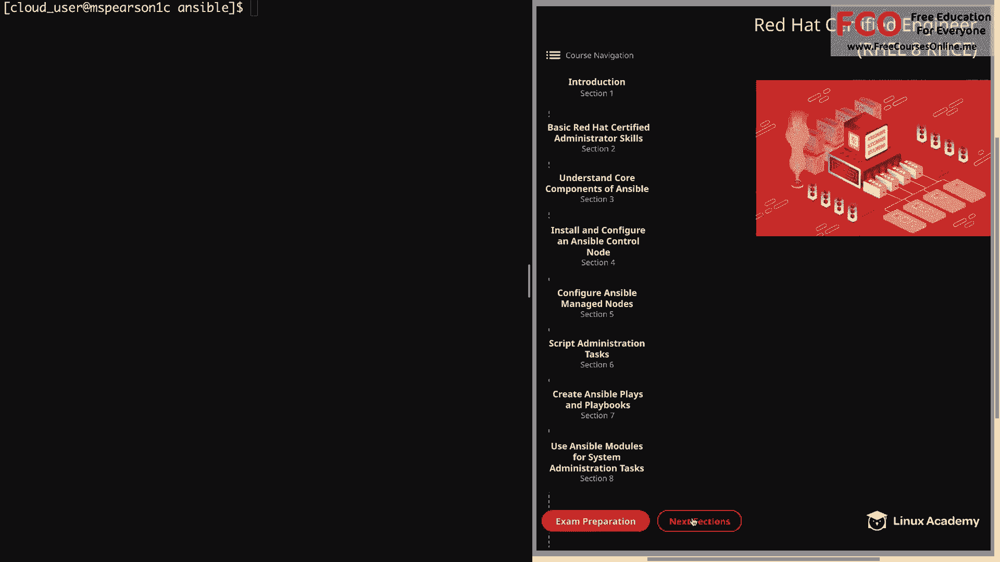
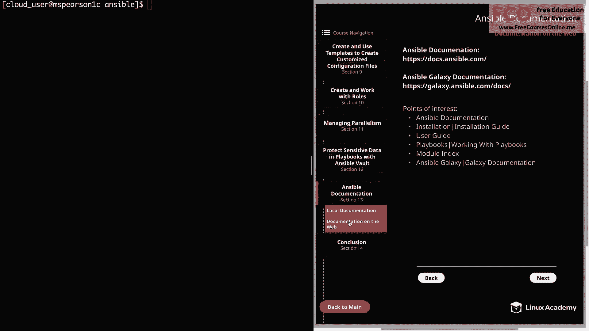
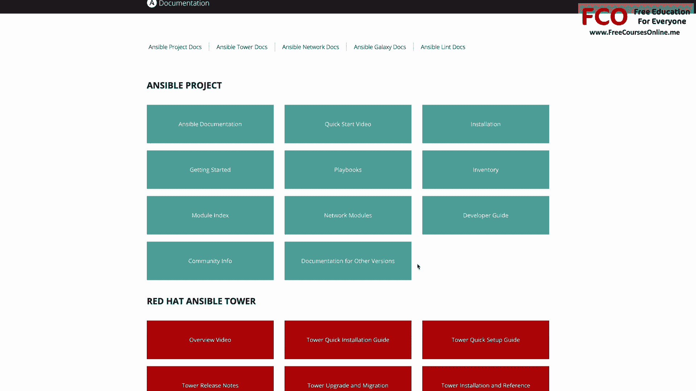
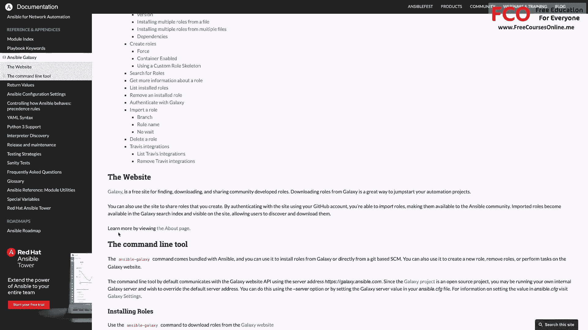

# Red Hat Certified Engineer (RHEL 8 RHCE) - P50：388-4878-2 - Documentation on the Web - 11937999603_bili - BV12a4y1x7ND

Welcome back everyone。 This is Matt。 and in this video。

 we're going to finish up our section on Ansible documentation by talking about the online documentation。

 So let's head over to next sections and then to section 13， which is ansible documentation。

And documentation on the Web。 So here I've just provided a link to the online documentation。

 which also includes the website for Ansible Galaxy， which of course。

 can be accessed through the main Ansible Doc website。

And even though we have the local documentation， the online docs are going to lay out the information in a nice visual format for us。

 And I have found， and I think you will， too， that it is incredibly useful On the rest of this page。

 I just went ahead and list out a few sections that you should take note of and ones that I thought would be beneficial for us to go over。

All right， so now let's just head over to a browser and we can walk through the documentation together。

So the first thing you'll notice is that you're greeted with kind of a block based format for each of the various sections。

 so we have the Ansible project， and then we have Red Hat Ansible Tower and then Ansible network。

Ansible Galaxy。 and then finally， Ansible Lint。 Let's go ahead and scroll back up。

And if we click on any of these sections under Ansible project。

 we're going to be taken directly to the page for that topic。

 so for installation we be taking installation， playbooks， module index， so on and so forth。

 but let's just go ahead and click on the main Ansible documentation。

So this is going to bring us to the main landing page for the docs。

 but I wanted to point out the navigation on the left。

 which is what you're primarily going to use to move around the documentation。

 And they also have a search bar in case you want to search for a particular topic or command。

 So now I just want to click through a few of the sections to show you some of the more important documentation to keep in mind。

 So first， we have the installation guide。 So let's go ahead and click on that。

And one thing you'll notice is that the navigation on the left is actually going to expand out。

 so we have installation guide and then configure Ansible。

 and you're going to see this type of behavior for any topic that has any subsections。

 So let's go ahead and click on installation guide。

And this is going to give us information on what's going to be installed。

 also what kind of version we should pick， and then the requirements for the control node and the manage node。

 And then if we click on installing the control node。

It's going to show us what we need to do to install ansible on various distributions。

 So we have fedora， and then we have Re andcent。And this is going to tell us a little more about the Ansible configuration file。

 as well as some environmental settings and some command line options。And then next。

 let's go ahead and click on the user guide。And as you can see。

 the section has a ton of information and it's really going to be your bread and butter as far as getting information about the various facets of ansible。

 And I'm not going to go into each one of these different topics。

 but I just wanted to show you the kind of things that are covered in the user guide。

 So it's going to start with an ansible Quick start and then a getting started section is going to help you get up and running and then we have various command line tools。

 So it's going to show you the different options for the command line utilities。

So let's go ahead and click on Ansible Playbook。And as you can see。

 it has a description as well as a list of common options。

 as well as some additional information about the command。

Now let's head back to the main user guide overview。

And next we have an introduction to ad hoc commands and several areas that we're going to be using those ad hoc commands for。

Then of course， we have working with inventory。And this is information all the way from the basics to working with host and group variables and also using multiple inventory sources and then working with dynamic inventory。

 which is something that was not a required area for this course。Next。

 we have working with playbooks， and this is a place that you're probably going to end up spending a decent amount of time on because it's going to show you the different things that you can do with and in your playbooks。

 It's going to go over variables and templating conditionals loops and even show you some of the best practices for creating playbooks。

And going down a bit further， it's going to talk about privilege escalation， which， of course。

 is very important in Ansible。 And then we have Ansible vault。

 which is going to go into all the different things you can do with Ansible vault and also the ansible  Vault command。

And I'm not going to go over each and everything， especially since there is a lot of material to cover here in the documentation。

 But I just wanted you to see what is available to you。

 So another really huge piece of this documentation and possibly the most important to you。

 is the module index。 So just like we were able to do in the command line。

 the online documentation is also going to provide you with a list of all the modules that are available to you。

 as well as the options for each module。 So let's go ahead and click on the module index。

And you see that you have a couple of different options for viewing various modules。

You can click on all modules。So let's go ahead and click on that。

And this is just a huge master list of all the ansible modules in alphabetical order。

 so you can always scroll down to find what you're looking for。

Or you can hit your control F to search for a particular module。

Let's go ahead and look for yum and we see both the yum module and the ym repository module。

 and it's going to give us just a short description。

 so for yum it's going to say manages packages with the yum package manager and then for yM repository。

 it's add or remove yum repositories， and then if we click on it。

It's going to take us to the documentation page for that module。

 and it's going to give us a description and a synopsis as well as a list of any requirements。

 and then of course， show us the parameters here， so it's going to show us the name of the parameter and then give us description about that as well as show us the defaults。

And then if we keep scrolling down， we're going to see a list of notes。 And then finally。

 a list of examples。 And just like I said， when we were talking about the local documentation。

 this list of examples is incredibly handy when you're working with a module you're not as familiar with so that way you can see the proper syntax and also what's available to do with the module。

 Allright， so let's click back on module index。 And in addition to just showing all of the available modules。

 it's also going to provide some groupings based on the type of module。

So let's go ahead and click on system modules。And this is going to attempt to group the models that have to do with managing and configuring the system。

So you're going to see file system Firewall D， we have group here。

 which'm just going to add to remove groups。And then further down。

 we're going to have LVG and Lva for configuring logical volumes。

 And then if we scroll down just a little bit further， we're going to see all our Se Linux modules。

And then also the service module， which we've used quite a bit in this course。And really。

 all these different modules that I'm mentioning are ones that we have used already throughout the course。

 and for those of you watching these documentation videos earlier on， good for you。

 and thanks for taking my recommendation in the about the course video。

 but these are going to be modules that you'll see as you work your way through the course。And again。

 we can just click on the module to see the documentation for that particular module。

Just like we did on the All modules page。So I would like to stress again。

 just the importance of being familiar with this module index because modules is what you're going to use in order to manage your systems。

 So having a good familiarity with this is going to let you know what's possible as far as configurations in Ansible。

 But before we finish out this video， let's go ahead and check out the documentation on Ansible Galaxy。

 So let's click on Ansible Galax under references and appendices。

And this is just going to show us an overview of the topics for Ansible Galaxy。

 so it'll show you how to install roles and also how to create roles。

 and if you look down just a little bit， it's going to give you the link to the Ansible Galaxy website as well as the Ansible Galaxy command line tool。

 which will end over in the section on Cate and work with roles and if you head back to the main landing page which have the block based topics。

 you can also access the Ansible Galaxy docs。Well， that's going to finish up this video on the online documentation。

 Again， there is a lot of information here， and it's really helpful to just familiarize yourself with the documentation so that way if you come across something that you don't know how to do。

 you can always search up the topic or the parameter that you need。

 So let's go ahead and mark this complete and we can move on to the next lesson。

