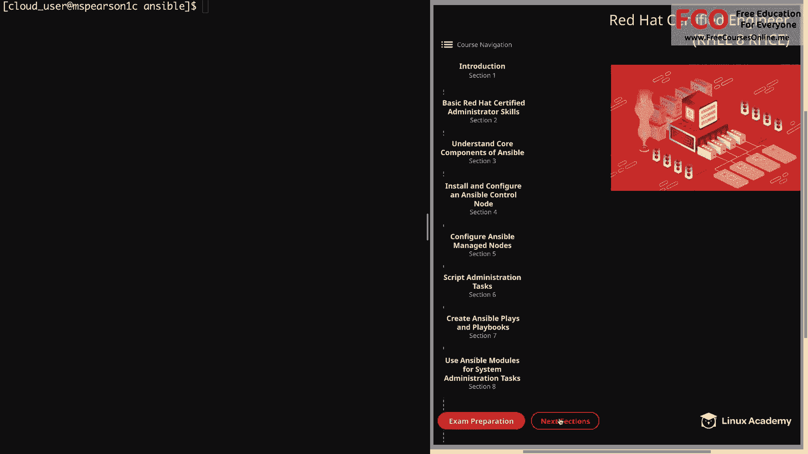
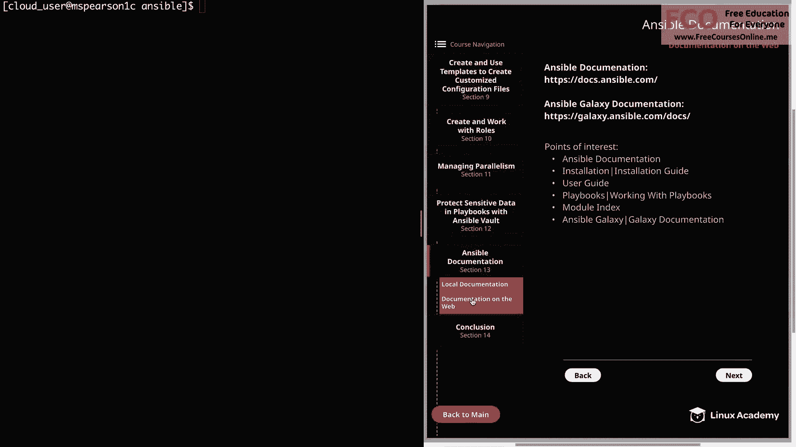
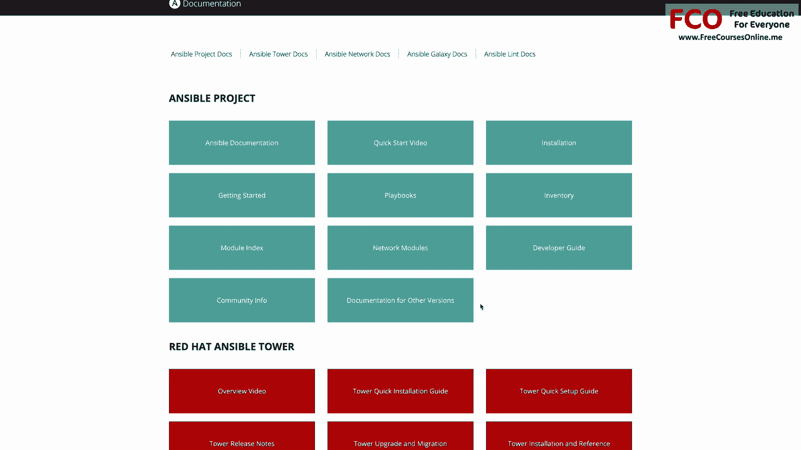
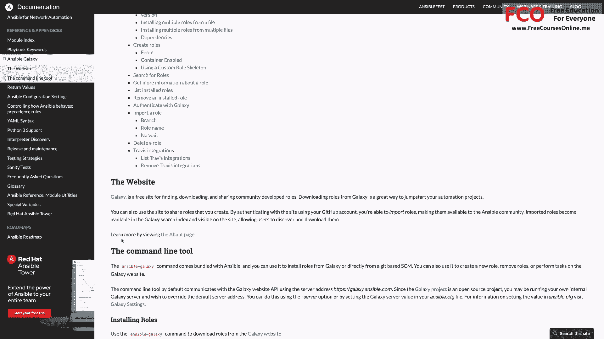

# Red Hat 认证工程师 (RHEL 8 RHCE)：P50：在线文档教程

在本节课中，我们将学习如何利用 Ansible 的在线文档资源。我们将探索官方文档网站的结构，了解如何查找安装指南、用户手册以及最重要的模块索引，帮助你高效地获取所需信息。

上一节我们介绍了本地的 Ansible 文档工具，本节中我们来看看如何利用其在线文档。

## 访问在线文档

Ansible 的在线文档提供了结构清晰、视觉友好的信息呈现方式。其网址也包含了 Ansible Galaxy 的入口。

尽管我们拥有本地文档，但在线文档以更佳的视觉格式组织信息，非常实用。

以下是文档网站的几个关键部分，值得你特别关注：

*   **Ansible 项目**：包含核心 Ansible 的文档。
*   **Red Hat Ansible Tower**：企业级自动化平台的文档。
*   **Ansible 网络**：针对网络设备自动化的文档。
*   **Ansible Galaxy**：角色共享和获取平台。
*   **Ansible Lint**：Playbook 语法检查工具。

## 导航文档结构

打开文档网站后，首先会看到一个基于区块的布局，展示了上述各个主要部分。

点击“Ansible 项目”下的任何子部分，例如“安装指南”或“Playbooks”，将直接跳转到对应主题的页面。

点击“Ansible 文档”主链接，会进入文档的概览页。左侧的导航栏是你浏览文档的主要工具，同时顶部还有一个搜索栏，方便你查找特定主题或命令。

## 核心文档部分详解

现在，我们点击浏览几个重要的文档部分，以了解其内容。

**1. 安装指南**

点击“安装指南”，左侧导航栏会展开显示子章节。

这部分内容提供了安装概述、版本选择建议、控制节点和管理节点的要求。

例如，点击“安装控制节点”，会展示在不同 Linux 发行版（如 Fedora、RHEL/CentOS）上安装 Ansible 的步骤。

**2. 用户指南**

用户指南包含了 Ansible 各方面的详细信息，是你学习和使用 Ansible 的核心资源。

它包含以下主要内容：

*   **Ansible 快速入门**和**入门指南**：帮助你快速上手。
*   **命令行工具**：详细介绍各种命令行工具的选项。
    *   例如，`ansible-playbook` 命令的页面会描述其用途、列出常用选项并提供额外信息。
*   **临时命令介绍**：介绍 `ansible` 临时命令及其应用场景。
*   **管理清单**：涵盖从基础概念到主机变量、组变量，以及使用多清单源和动态清单（本课程不要求）的所有内容。
*   **使用 Playbooks**：这部分你可能需要花费大量时间学习，它介绍了 Playbook 的各种功能，包括：
    *   变量与模板
    *   条件判断
    *   循环
    *   Playbook 编写的最佳实践
*   **权限升级**：讲解如何在 Ansible 中提权执行任务，这非常重要。
*   **Ansible Vault**：详细介绍如何使用 Ansible Vault 加密敏感数据以及 `ansible-vault` 命令。

**3. 模块索引**

模块索引可能是文档中对你而言最重要的一部分。与命令行工具类似，在线文档也提供了所有可用模块的列表及其选项。

你可以通过以下方式查看模块：

*   **所有模块**：按字母顺序排列的完整模块列表。你可以滚动查找，或使用 `Ctrl+F` 搜索特定模块。
    *   例如，搜索“yum”，会找到 `yum` 模块（管理软件包）和 `yum_repository` 模块（管理 YUM 仓库）。
    *   点击任一模块（如 `yum`），会进入该模块的详细页面，包含：
        *   描述与概要
        *   任何前置要求
        *   **参数列表**：展示每个参数的名称、描述和默认值。
        *   注意事项
        *   **示例列表**：这些示例对于学习不熟悉的模块极其有用，可以展示正确的语法和模块功能。
*   **按类别分组**：模块也按功能分组，例如“系统模块”。
    *   该组包含管理系统和配置的模块，如 `filesystem`、`firewalld`、`group`（管理用户组）、`lvg`/`lvol`（配置逻辑卷）、`selinux` 相关模块以及 `service` 模块（管理服务）。

熟悉模块索引至关重要，因为模块是你用来管理系统的工具。了解可用的模块能让你清楚 Ansible 能实现哪些配置。

## Ansible Galaxy 文档

最后，让我们查看一下 Ansible Galaxy 的文档。你可以在“参考和附录”部分找到“Ansible Galaxy”的链接。

这部分提供了 Ansible Galaxy 的概述，包括如何安装角色、如何创建角色，并提供了 Ansible Galaxy 网站和命令行工具的链接。

你也可以在文档主页的区块布局中直接访问 Ansible Galaxy 文档。

本节课中我们一起学习了如何有效利用 Ansible 的在线文档。我们了解了网站的整体结构，探索了安装指南、用户手册等核心部分，并重点掌握了查找和使用模块索引的方法。文档中包含大量信息，熟悉其布局将帮助你在遇到问题时，能快速搜索到所需的主题或参数。现在，我们可以标记本节完成，并继续下一课的学习。