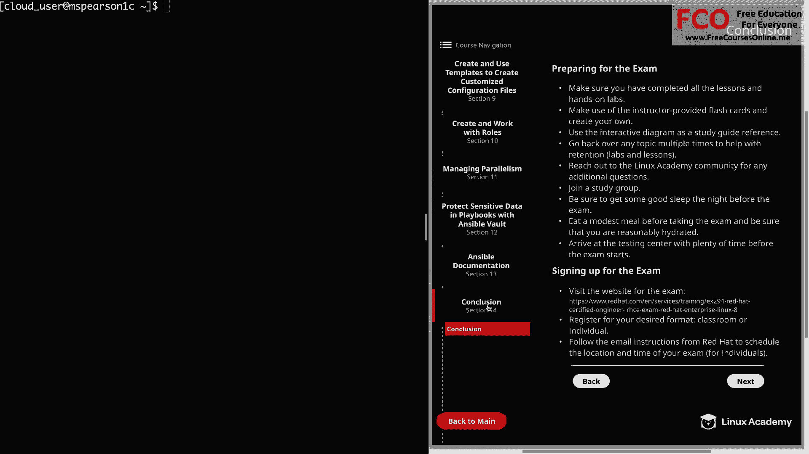
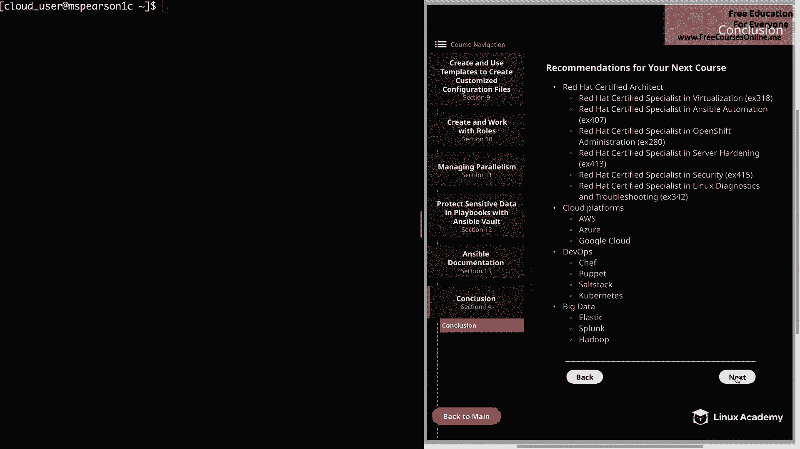

# Red Hat Certified Engineer (RHEL 8 RHCE) - P51：388-4880-1 - Conclusion - 11937999603_bili - BV12a4y1x7ND

Welcome back everyone， this is Matt， and let me be the first to congratulate you on completing the Red Hat Ctified Engineer course for Red Hat Enterprise Linux 8 In this conclusion video I'm just going to go over some suggestions on further preparing for the exam and also show you how to sign up for it and then recommend some courses that might be of interest to you in your next area of study。

So once again， let's head back to the diagram and click on next sections。

And then on conclusion， so when it comes to preparing for the exam， first。

 make sure that you have completed all the lessons and hands on labs for the course。

 and not only will that help prepare you for the exam。

 but it also will get you to 100% complete in Linux Academy。Next。

 make use of the instructor provided flashcards and also create your own。

 so one neat feature of Linux Academy is the ability to create your own flashcard deck。

 but you can also fork for mine so if you want to borrow some that I have and then add to it。

 you can always do that。And using flashcards is a great way to help remember commands and parameters and help you be less reliant on the documentation when you're taking the exam because you do have a limited timeframe。

Next， use the interactive diagram as a study guide reference。

And be sure to go back over any topic multiple times to help with retention。

 and this goes for both labs and lessons。 Also， feel free to reach out to the Linux Academy community for any additional questions you have or for just any help that you need。

 we have a great community here at Linux Academy and several training architects that are very willing to help answer your questions。

And Linux Academy also provides the ability to join and create study groups。

 so please take advantage of that as you're preparing for the exam。And then on a more practical note。

 be sure to get some good sleep the night before the exam because you want to have your mind in the best place possible and be able to focus。

 and then also make sure that you eat a modest meal before taking the exam and be sure that you're reasonably hydrated。

You really don't want to take the exam on an empty stomach or even come in overly full。 Again。

 this is all about taking away all the distractions。

 whether that be physical or mental in order for you to perform as best you can on the exam。

And then lastly， make sure you arrive at the testing center with plenty of time before the exam starts。

 You're already going to be a little bit stress going into the exam。

 but don't add to that by being late and then having to rush to get to the testing center。

 and now let's talk a little bit about signing up for the exam。

 So whenever you're ready to take the exam， you can sign up for it at the website that I provided here in the diagram。

 and this is going to give you two options for registering for the exam。

 and that is classroom or individual。 The classroom exam will include several other people who are also taking the exam。

 and then with individual， you will take it alone at a red Ha testing center。

Once you have purchased the exam voucher， you can follow the email instructions from Red Hat to schedule the location and time of your exam。

 And that's going to be for the individual format。 And for the classroom format。

 you're going to see a list of different locations and times for those。

 And one last thing before we head to the next page is that the information on this page can also be found on the exam preparation page that can be accessed on the main landing page of the diagram。

 I just want to make that a little more accessible rather than you having to click through and go to the conclusion。

So feel free to reference back to this using the exam preparation tab。

 and now let's head over to the next page。

And the last thing I want to talk about is just some recommendations for your next course。

And once you've obtained your RHCE， you may want to consider going for your Red Hat certified architect。

 which is going to require five additional certifications from Red Hat's approved list here in the diagram。

 I've provided a list of the courses that Linux Academy provides to help you on your way to get your RHCA。

 but beyond just going for your Red Hat certified architect。

 these are also going to be good courses just for increasing your skill set in these various areas。

All right， next we have several courses in various cloud platforms like AWS， Azure and Google Cloud。

 and cloud technologies are becoming more and more popular so that may be something you'd like to dive into。

 and we also have various courses on Devops topics like Chef， puppet， Saltt and Kubernetes。

And then under big data， we have the wildly popular elasticastic stack， as well as Splunk and Hadoop。

 And honestly， Linux Academy has way too many course offerings for me to go over in this video。

 But I did just want to cover a few so that you are aware of what's available。

 And when it comes down to it， it's really just going to depend on what you're interested in or what topic you need to learn more about。

 So please feel free to take a look at the Linux Academy website and see the various courses that are offered。

Well， congratulations again on completing this course and good luck on the exam。

 as well as any additional areas that you choose to study。

So let's close out this course by marking this video complete。

