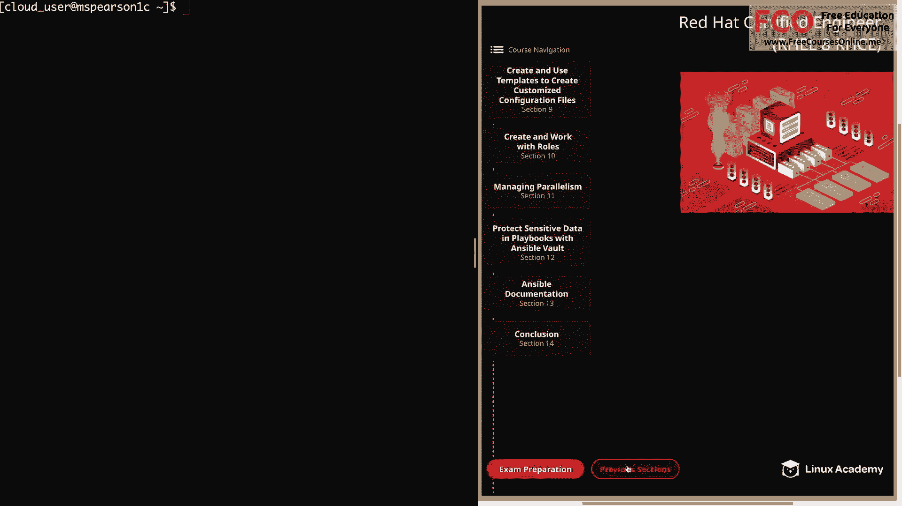
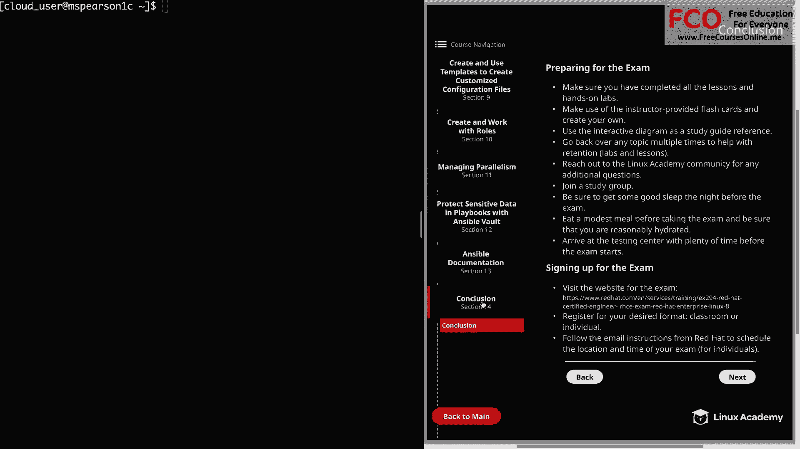
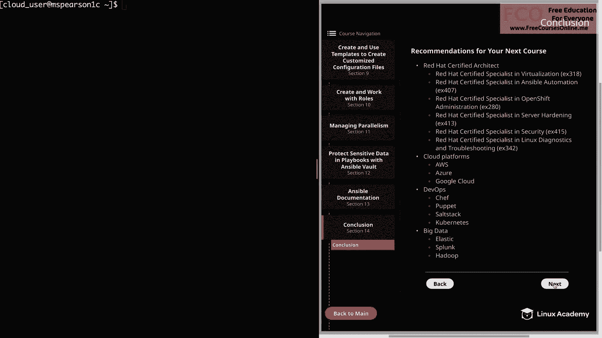

# Red Hat认证工程师课程：P51：结论与后续步骤 🎓

在本节课中，我们将回顾完成RHCE课程后的后续步骤，包括考试准备建议、报名流程以及未来学习方向的推荐。

---

## 考试准备建议 📝

上一节我们完成了所有课程内容的学习，本节中我们来看看如何为RHCE考试做最佳准备。以下是一些关键建议：

1.  **完成所有课程与实验**：确保您已完成本课程的所有课程和动手实验。这不仅能帮助您备考，也能使您在Linux Academy平台上的课程完成度达到100%。

2.  **利用记忆卡片**：请充分利用讲师提供的记忆卡片，并创建您自己的卡片。Linux Academy的一个实用功能是允许您创建自己的记忆卡组，您也可以“复刻”我的卡片组进行修改和补充。使用记忆卡是帮助记忆命令和参数的好方法，能减少您在考试期间对文档的依赖，因为考试时间有限。

3.  **使用交互式图表**：将课程中的交互式图表作为学习指南和参考工具。

4.  **反复复习**：请务必对任何主题进行多次复习，以帮助巩固记忆。这适用于实验和课程内容。

5.  **寻求社区帮助**：欢迎随时向Linux Academy社区提问或寻求任何帮助。我们拥有一个优秀的社区，多位培训架构师非常乐意解答您的问题。

6.  **加入学习小组**：Linux Academy还提供了加入和创建学习小组的功能，请在备考时充分利用这一点。

7.  **保持良好状态**：在考试前一晚保证充足睡眠，让大脑处于最佳状态以保持专注。考试前请适量进食并确保水分充足。避免空腹或过饱参加考试。这一切都是为了消除身体或精神上的干扰，让您在考试中发挥最佳水平。

8.  **提前到达考场**：确保在考试开始前有充足时间到达考试中心。参加考试本身就会带来一些压力，不要因为迟到和匆忙赶路而增加额外的压力。

---

## 报名参加考试 📅

现在我们来谈谈如何报名参加考试。

当您准备好参加考试时，可以通过课程图表中提供的网站进行报名。报名时您将有两种选择：**课堂考试**或**个人考试**。课堂考试将与其他考生一同进行；而个人考试则是在红帽认证的考试中心单独进行。

购买考试凭证后，您可以按照红帽发送的电子邮件说明，预约个人考试的地点和时间。对于课堂考试格式，您将看到不同地点和时间的列表可供选择。

在进入下一页之前，最后一点说明：本页信息也可以在课程主页面通过“考试准备”标签页找到。我在此提及是为了让您更容易获取这些信息，而不必点击进入结论部分。因此，您可以随时通过“考试准备”标签页回看这些内容。

---

## 后续课程推荐 🚀

最后，我想为您推荐一些可能的后续学习课程。

在获得RHCE认证后，您可能会考虑继续考取**红帽认证架构师**认证。这需要您额外获得五项红帽认可列表中的认证。在课程图表中，我列出了Linux Academy提供的一些课程，可以帮助您迈向RHCA的目标。

除了追求RHCA认证，这些课程对于提升您在各个领域的技能也很有价值。

接下来，我们提供了多个关于主流云平台的课程，例如**AWS、Azure和Google Cloud**。云技术正变得越来越普及，这可能是您希望深入学习的领域。

我们还提供了各种关于**DevOps主题**的课程，例如**Chef、Puppet、Salt和Kubernetes**。

在大数据领域，我们提供了非常流行的**Elastic Stack**，以及**Splunk**和**Hadoop**的相关课程。

坦率地说，Linux Academy提供的课程太多，无法在此视频中一一详述。但我希望提及一些，让您了解现有的选择。最终，这完全取决于您的兴趣所在或您需要进一步学习的主题。

因此，请随时浏览Linux Academy网站，查看我们提供的各类课程。

---

## 总结 🎉

本节课中我们一起学习了RHCE考试的准备策略、报名流程以及未来的学习路径建议。

再次祝贺您完成本课程！祝您在考试中一切顺利，并在您选择深入研究的任何其他领域取得成功。

现在，让我们通过标记本视频为“已完成”来结束这门课程。