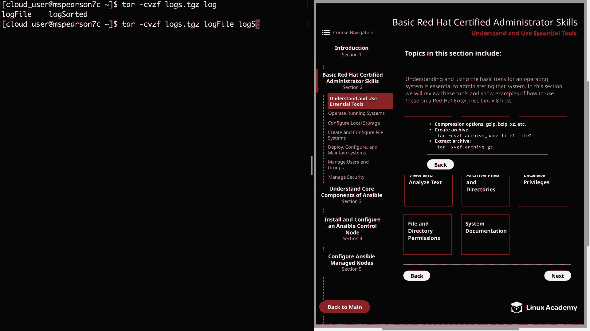
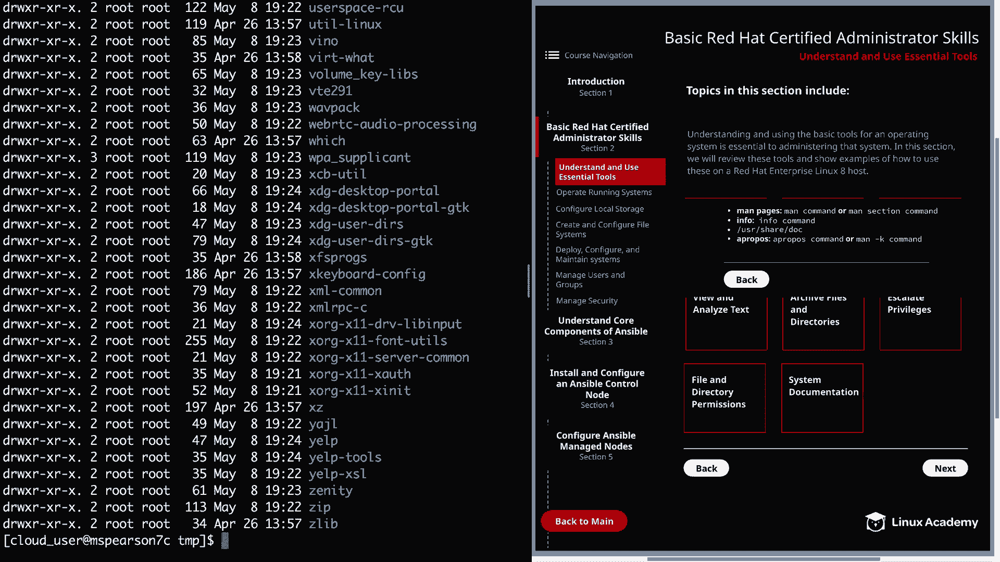

# Red Hat Certified Engineer (RHEL 8 RHCE) - P5：388-4867-2 - Understand and Use Essential Tools (Part 2) - 11937999603_bili - BV12a4y1x7ND

Welcome back everyone， this is Matt， and in this video we're going to cover the rest of the topics in understand and use essential tools。

 and we're going to kick that off with archive files and directories。

So for this topic we're going to be using the tar command in order to archive and compress files and directories。

 and there are several different compression options such as Gzip and B wherexz as well as others。

 so in order to create the archive we're going to run the tar command followed by the dash Cvzf and then the name of our archive and then the files that we'd like to put in that archive So dash C lets tar know that we're going to create the archive and then dashv is going to say use the verbose option and which is going to give us a little more information and then the dash Z option is where we're telling tar to actually use Gzip for our compression。

 but we could also use dashj for Bz zip for example。

 and then dash F is going to allow us to specify the name of our archive and feel free to look at the man page for all the options with tarR because there are several。

So let's say that we wanted to create a compressed archive of our log files。 So in order to do that。

 we'd use the tar command followed by CV Z F。And then our archive name。

 which is we're just going to call logs that tgZ。And then we can specify the log files that we created。

So we see we have log file。And then we also have a log sorted。

Let's go ahead and do a listing。And we see that we have our logs。tgZ archive。

And then if we wanted to extract our archive。Just Cd into temp， and then run tarR dash XwezF。

 and then the path to our tar file。It can be home cloud user and then logs。

And we see our two files here in the temp directoryAlternatively。

 you can also specify dash uppercase C and that lets you put in a path to a directory you want to unarive your archive to。

 so that's something good to keep in mind。

All right。 So next， we're going to talk about escalating privileges。

And in order to execute a privileged task， you either need to log in as the root user or to run the command on behalf of the root user。

 so to become the root user， we can simply use pseudoi or pseudosash and keep in mind that it's generally not recommended to assume the root user but rather to run commands as the root user through pseudo and when it comes to pseudo。

 you're going to hear people saysdo or pseudo honestly it doesn't matter it's really whatever you prefer。

 I just prefer to say pseudo but using pseudo rather than just becoming the root user to run a command will serve as an extra safety measure and prevent you from accidentally running a commands as root。

 and also allows you the opportunity to lock down the root user so that an outside actor can't gain access to that account。

And to illustrate this， I'm just going to create a file in the Etsy directory。

So I'm going to touch Etsy， and then we'll just call this test file。And as you see， as a cloud user。

 I'm getting a permission denied。So let's go ahead and list the permissions on Etsy。

And we see that the only user who has right privileges to that directory is the root user。

 so if we'd like to create the file using our cloud user。

 we just need to go back to our original command and then we can run pseudo touch Etsy test file。

And then it's going to ask us for a password for a cloud user。

And you have to enter that password correctly。And there you go。

Then then let's just do a quick listing to make sure our file is there。

And we see that we were able to create our file using pseudo。

 Please keep in mind that this is a permission that you need to set up for a particular user in the pseudoers file。

 and I will be showing you how to do this in a later video。

So let's go ahead and close this and we can move to our next last topic。

 which is file and directory permissions。 First you see is change ownership and this is done with the Chaone command or CO and when using this command。

 you can change only the user or you can also change the user in the group as seen here with the use of the colon and you can also just change the group using the C group or the group command and then we come to the C mod command or as like say sometimes Chamod which is going to allow us to change the permissions on the file or directory and when changing permissions with this command。

 you can either use the numeric mode or the symbolic mode and in numeric mode。

 the pers are represented by a three digit octal number which is going to use 0 through7 and this can also be fourdit if you're specifying the special permissions we'll talk about in just a minute and then if you're using symbolic mode。

 the permissions are going to be represented by characters So the first command 764 is going to be readwrite execute for the user and then readrite for the group。

And then read for all other users。 And then the second example。

 I'm using the symbolic mode in order to add read write permissions just to the user。

 And then lastly， we have special permissions。 And just like your standard regular permissions。

 This can also be used doing numeric mode or symbolic。 And when using numeric。

 the number is going to come before the user group other permissions。 So we have this C H modd 76。

4 will right before the 7 is where you're going to specify the special permissions。So first。

 we have set UI， and this permission is going to allow the file being executed to be executed with the privileges of the owner。

 So an example of this would be a command that you want to be executed by the root user。

 but you want to allow all users on the host to be able to run it。

 So if you used the set UI permission。As long as the user has execute on the file。

 it's still going to run as the root user。 Next， we have the set G Id。

 And when this bit is set on a directory， all the files created when that directory are going to inherit the group ownership of that directory。

 And then lastly， we have these sticky bit。And when this is set only the root user。

 the owner of the directory and the owner of a file can remove files within a directory。

 So even if you have right permission on a file， if you are not the root user and you're not the owner of the file or the directory。

 you cannot remove that file。All right， so now our last topic is going to be system documentation。

So one of the greatest tools at your disposal as a system administrator is the system documentation So one of the greatest tools that you have at your disposal as a system administrator is the ability to view system documentation and the reason for this is that it's really difficult to remember all the different commands that are available to you as well as all their options and to just recall that from memory So it's really important to get familiar with this documentation。

 especially things like the pages you're going to be using those a lot。

 I'll just show you an example of that real quick。It can to be man CHmad or Chama。

And as you see here， it's going to give you the name。

 a little synopsis of how the command syntax is going to look as well as a description。

And then if you scroll down a little bit further， you're going to have an options section。

And this is going to show you all the different flags and parameters that you can use for a command。

 so as you can imagine， this is going to be incredibly helpful not just for an exam。

 but also for just day to day administration。

So in addition to the man pages， you also have the info command。

And this is going to give you some additional information a lot of times with just using the man page。

 it's going to meet most of your needs， but this is also available to you if you need some more information。

And then we also have Usesha dot。

And this directory is going to contain documentation for a number of different system level programs。

So feel free to peruse that and check that out for anything that you particularly need to know about。

 It's also just good to know that it's there just in case you need it。

And then the last thing I want to mention is the Apropo command or man D K。

Because sometimes you know what a command has to deal with but you can't remember the exact name of the command so then you can just use Apropo or Man DK in order to search for that command so in order to use that you actually need to make sure you have the man pages package installed so I'm going to do that real quick just so I can show this to you real quick because I think it's a really handy tool so pseudoym install and then we'll do Manned dash pages so even though we have our Man pages we can look at those there are some utilities like Apropo that are provided by the Man dash pages package and so we need to install that in order to use it。

All right， so now that that's installed， let's go ahead and clear this out。

 So say we want to find a command， and we know it has to do with permissions。

 but we can't think of what it is。So in this situation， we can just run apropos and then perm。

And this is going to pull up anything that has perm or permission in it。 And so as you can see。

 we have our C H modd command， as well as other commands that have perm in the title or the command。

Well， this last topic finished， that's going to wrap up our lesson on essential tools。

 so let's go ahead and mark this video complete and we can move on to the next section。

