# RHCE 认证课程：P5：理解并使用核心工具（第二部分）📚

在本节课中，我们将继续学习“理解并使用核心工具”这一章节的剩余主题。我们将涵盖归档文件、权限提升、文件权限管理以及系统文档查阅等关键技能。这些是Linux系统管理员日常工作中不可或缺的基础工具。

## 归档文件与目录 📦

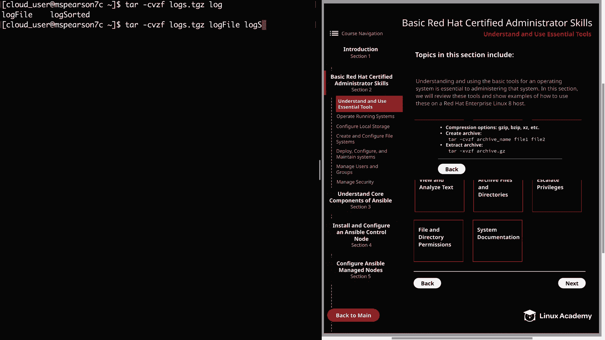

上一节我们介绍了基本的文件操作，本节中我们来看看如何将多个文件或目录打包并压缩成一个归档文件。这主要通过 `tar` 命令实现，它支持多种压缩格式，如 Gzip 和 Bzip2。

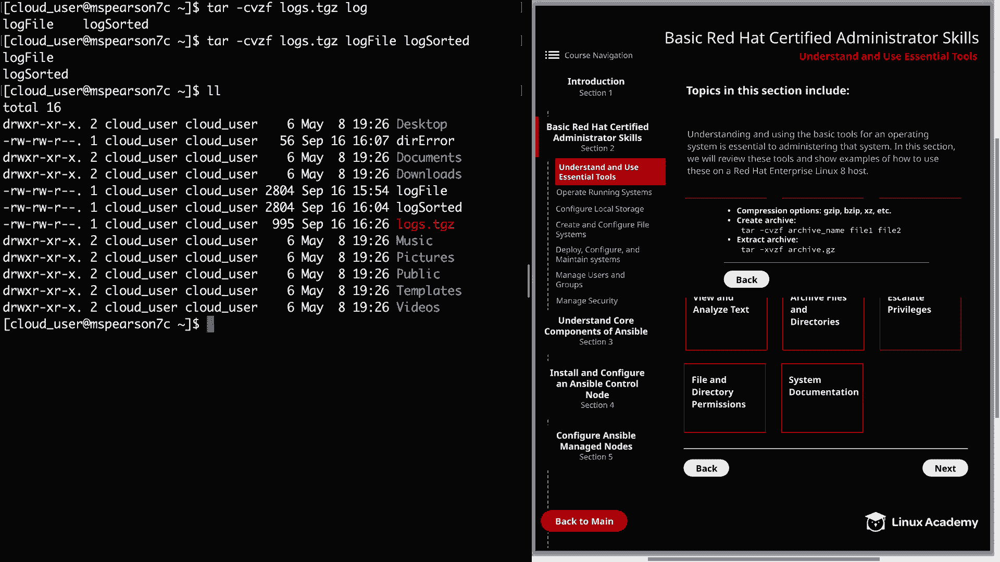

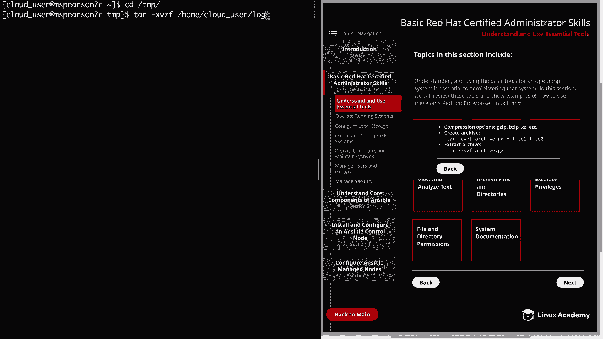

创建归档文件的基本命令格式如下：
```bash
tar -cvzf 归档文件名.tar.gz 要归档的文件或目录
```
其中，`-c` 表示创建归档，`-v` 表示显示详细信息（verbose），`-z` 表示使用 Gzip 压缩，`-f` 用于指定归档文件名。你也可以使用 `-j` 选项来调用 Bzip2 压缩。

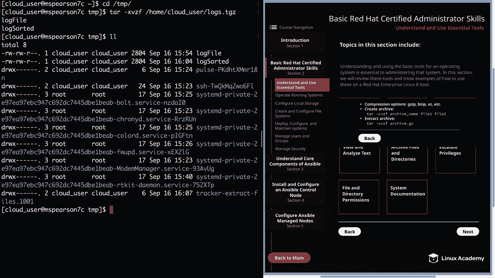

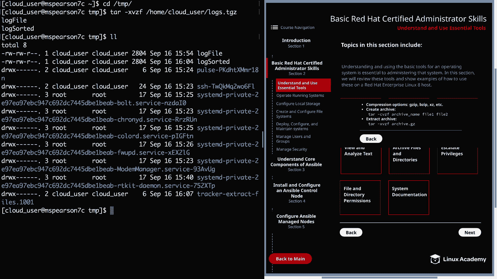

以下是具体操作步骤：
1.  **创建压缩归档**：例如，将当前目录下的 `logfile` 和 `log_sorted` 文件打包并压缩为 `logs.tar.gz`。
    ```bash
    tar -cvzf logs.tar.gz logfile log_sorted
    ```
    执行后，会生成 `logs.tar.gz` 文件。

2.  **提取归档文件**：要解压归档文件，可以使用 `-x` 选项。
    ```bash
    tar -xvzf logs.tar.gz
    ```
    这会将文件解压到当前目录。如果你想指定解压路径，可以使用 `-C` 选项：
    ```bash
    tar -xvzf logs.tar.gz -C /目标/路径
    ```

## 权限提升 🔐

在Linux系统中，许多系统级操作需要管理员（root）权限。直接以 root 用户登录进行操作存在风险，因此更推荐使用 `sudo` 命令来临时提升权限执行特定命令。

`sudo` 允许授权用户以 root 或其他用户的身份运行命令。使用 `sudo` 时，系统会要求输入当前用户的密码进行验证。

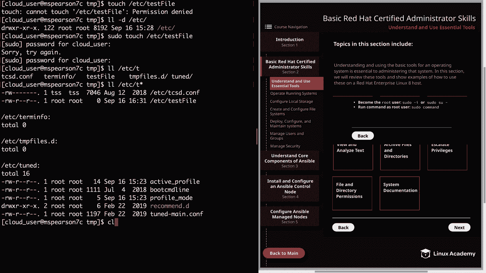

例如，普通用户尝试在受保护的 `/etc` 目录创建文件会失败：
```bash
touch /etc/testfile
# 输出：touch: cannot touch ‘/etc/testfile’: Permission denied
```
使用 `sudo` 即可成功：
```bash
sudo touch /etc/testfile
```
系统会提示输入用户密码，验证通过后文件即被创建。

请注意，用户必须被配置在 `/etc/sudoers` 文件中才能使用 `sudo` 命令。

## 文件与目录权限 🔧

文件权限控制着谁可以读取、写入或执行文件。我们主要使用 `chown` 和 `chmod` 命令来管理权限。

1.  **更改所有权**：使用 `chown` 命令。
    *   更改文件所有者：`chown 新所有者 文件名`
    *   同时更改所有者和所属组：`chown 新所有者:新组 文件名`
    *   仅更改所属组：`chgrp 新组 文件名` 或 `chown :新组 文件名`

2.  **更改权限**：使用 `chmod` 命令。有两种模式：
    *   **数字模式**：用三位八进制数表示权限（用户、组、其他人）。例如，`chmod 764 filename`。
        *   `7` (用户)：读(4) + 写(2) + 执行(1) = 7
        *   `6` (组)：读(4) + 写(2) = 6
        *   `4` (其他人)：读(4) = 4
    *   **符号模式**：用 `u`（用户）、`g`（组）、`o`（其他人）、`a`（所有人）配合 `+`（添加）、`-`（移除）、`=`（设置）来操作。例如，`chmod u+rw filename` 为用户添加读写权限。

3.  **特殊权限**：除了基本的读、写、执行，还有三种特殊权限位，同样可以用数字（放在三位权限数字前）或符号模式设置。
    *   **SetUID**：当设置在可执行文件上时，无论谁执行该文件，它都将以文件所有者的权限运行。例如，`chmod u+s filename` 或 `chmod 4755 filename`。
    *   **SetGID**：当设置在目录上时，在该目录下创建的任何新文件都将继承目录的所属组。例如，`chmod g+s directoryname`。
    *   **粘滞位**：通常设置在目录（如 `/tmp`）上。在此目录中，用户只能删除自己拥有的文件，即使他们对该目录有写权限。例如，`chmod +t directoryname` 或 `chmod 1777 directoryname`。

## 系统文档 📖

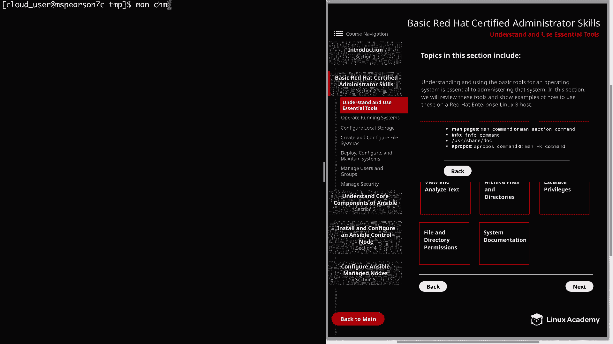

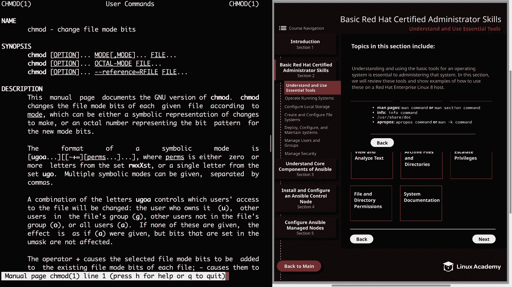

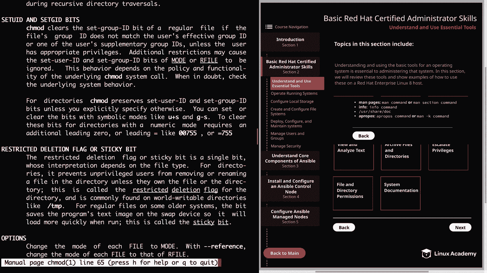

对于系统管理员而言，善于查阅系统文档是至关重要的技能，因为没有人能记住所有命令和选项。

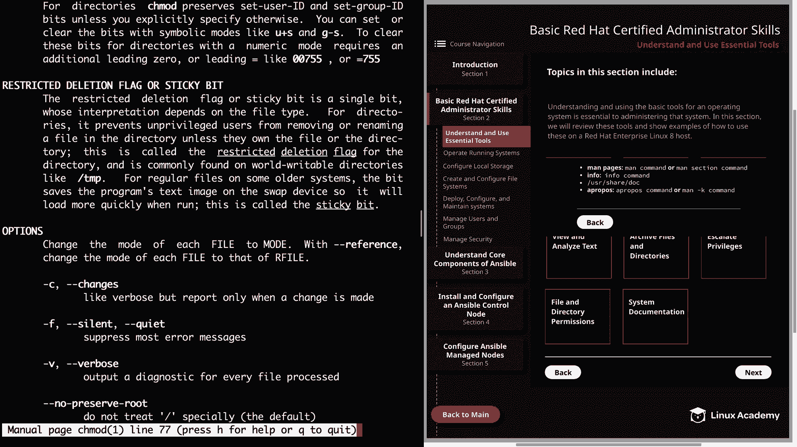

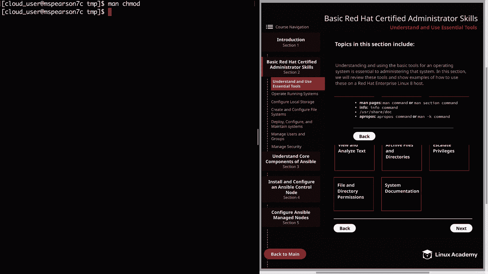

以下是几种主要的文档资源：

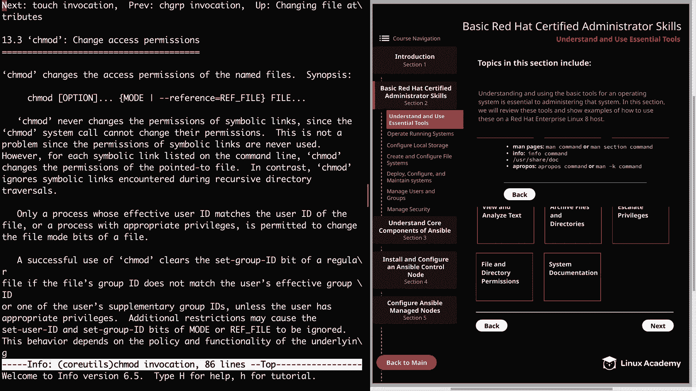

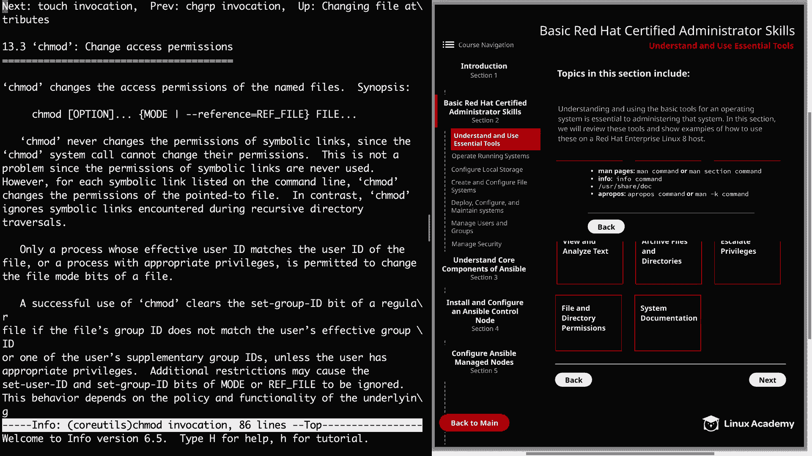

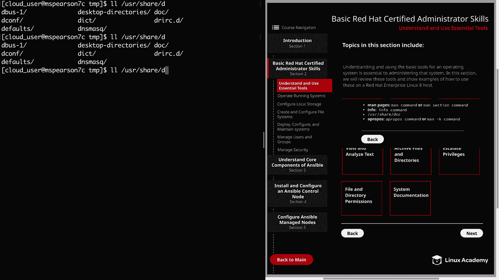

1.  **man 手册页**：最常用的文档。使用 `man` 命令后接命令名即可查看。例如：
    ```bash
    man chmod
    ```
    手册页会提供命令名称、语法、描述、选项列表和示例等详细信息。

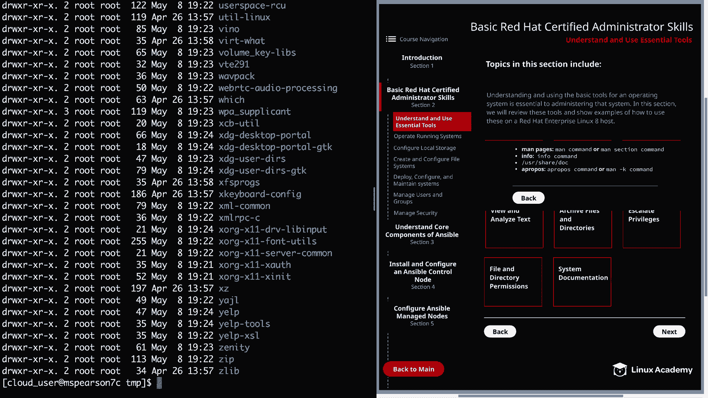

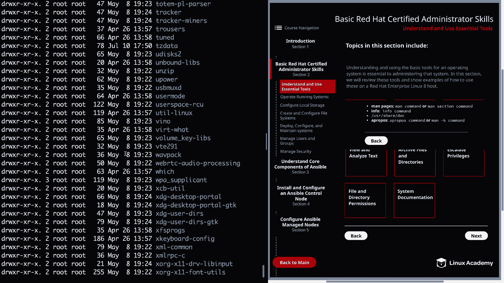

2.  **info 文档**：某些GNU工具提供了比 `man` 页更详细、结构更复杂的 `info` 文档。使用 `info` 命令查看：
    ```bash
    info tar
    ```

3.  **/usr/share/doc 目录**：该目录包含了许多已安装软件包的详细文档、示例配置文件、README文件等。你可以直接浏览此目录来查找特定软件的信息。

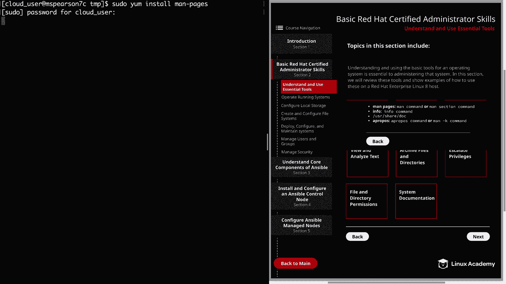

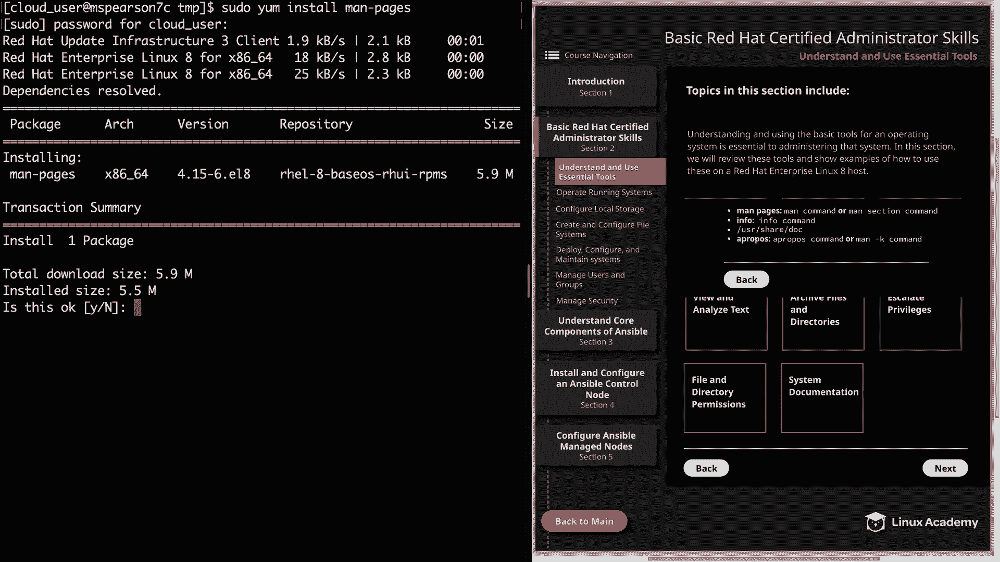

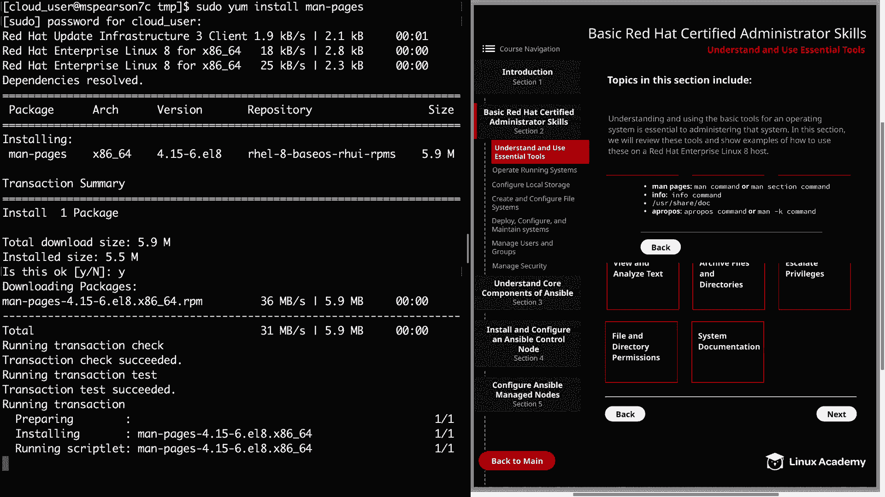

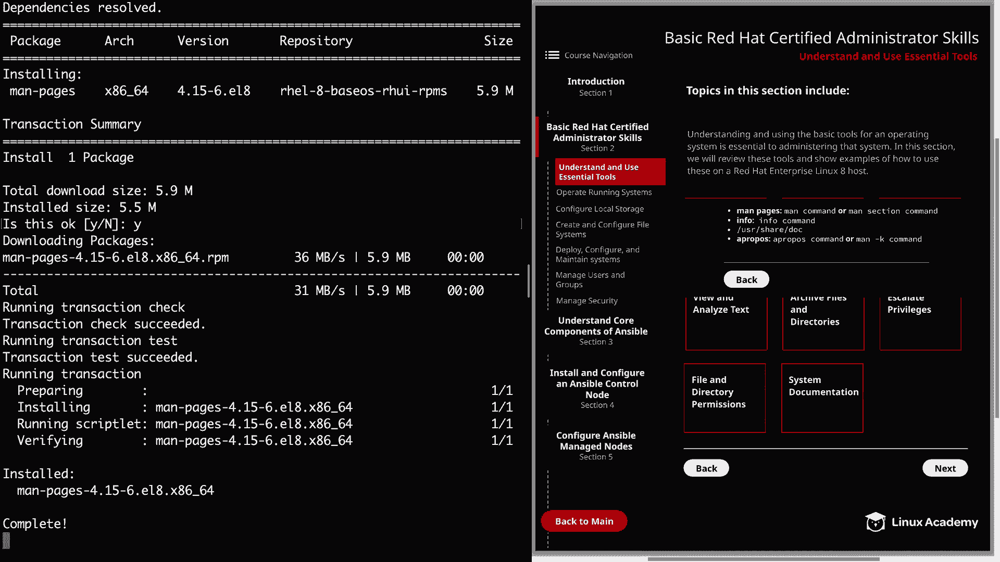

4.  **apropos 命令**：当你知道某个功能，但记不清具体命令名时，`apropos` 或 `man -k` 命令非常有用。它会在手册页描述中搜索关键词。
    ```bash
    apropos permission
    ```
    这将列出所有描述中包含“permission”的命令。注意，使用此功能可能需要先安装 `man-pages` 软件包：`sudo yum install man-pages`。

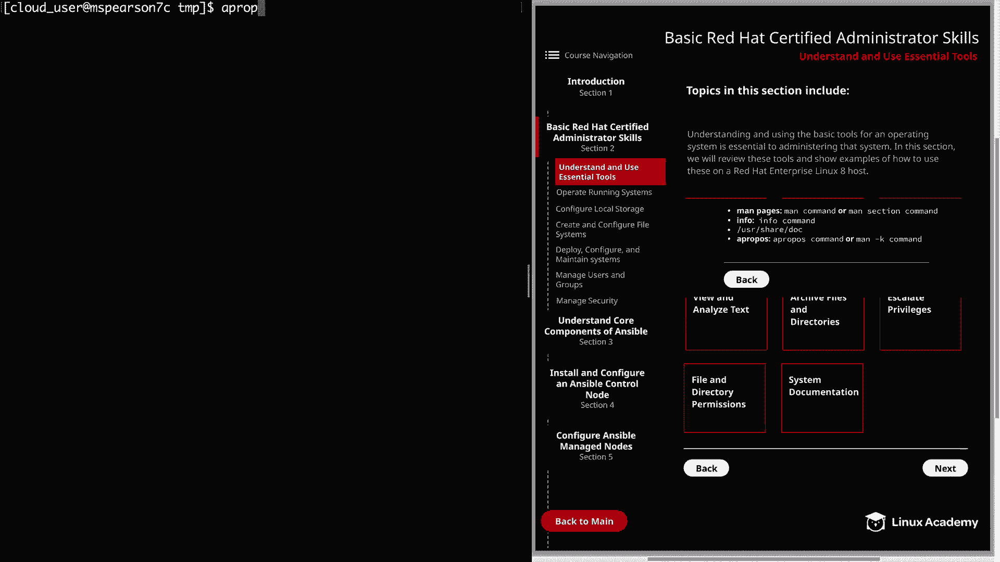

---

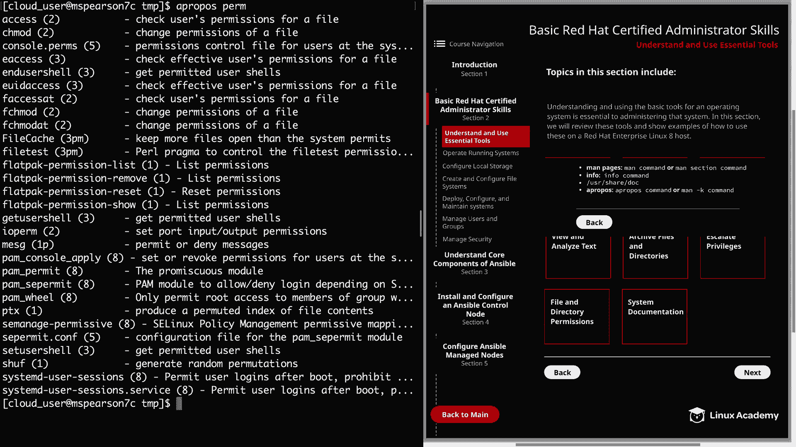

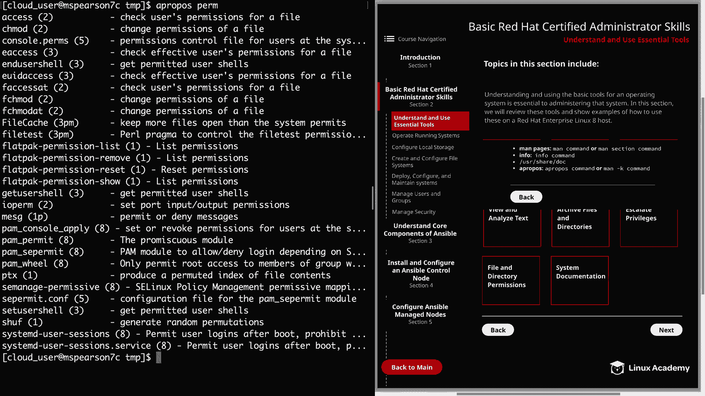

本节课中我们一起学习了Linux系统管理的几个核心工具：使用 `tar` 进行文件归档与压缩，通过 `sudo` 安全地提升命令执行权限，运用 `chown` 和 `chmod` 精细控制文件与目录的访问权，以及如何利用 `man`、`info`、`/usr/share/doc` 和 `apropos` 来高效地查阅系统文档。掌握这些工具是成为一名合格Linux系统管理员的基础。