# Red Hat Certified Engineer (RHEL 8 RHCE) - P6：388-4867-3 - Operate Running Systems - 11937999603_bili - BV12a4y1x7ND

Welcome back everyone， this is Matt， and in this video we're going to talk about operating running systems。

 and this is going to continue the section on basic Red Ha certified administrator skills。

So let's go ahead and click on section 2 and then operate running systems。

So the first thing that we need to talk about is shutting down and rebooting systems。

 and if you've worked in IT at all or even just own your own personal computer。

 it's pretty common knowledge that it's important to shut down or reboot your system normally rather than just pulling out the plug or flipping a switch off because that can cause issues with certain running processes。

So to turn a system off， you can just type in system CTtl power off or if you'd like to reboot it。

 you can do system CTtl reboot for more info， you can always type system CTtlhelp or manned system CTl just to see what your different options are。

 but that is pretty much the basics when it comes down to shutting down or rebooting a server。

 Keep in mind that you will need to use pseudo or assume root before you can run these commands。

 And I wanted to make a quick note about previous versions of Red Ha。

 so in times past you would just run power off or reboot so you wouldn't add that system CTl prefix。

 but now that we have system CTl， it should be added before running the command。

The next topic is to interrupt the boot process in order to change the root password to gain access to a system。

This is very important because there are times that you will need to gain access to a system that you're shut out of。

 And as we said when we were talking about S S H， you can't administer a system that you don't have access to。

 So first， you need to edit the kernel boot parameters by pressing E。

 So when the screen first loads up， you'll see the list of。Ctrol E， so that'll move you to the n。

 and then you can remove RO crash and then add R D dot break and then enforcing equals 0。

 and then you can start up the system by pressing control X。Once you're on the command line。

 you need to remount the root of the system， and this is done by typing in mount dash O and then provide the options of remount and readWrite。

And that's going to be on the Cissro directory。Once the directory has been remounted。

 you can switch to that directory using C H root or troot。

 which will then allow you to interact with it as a special route directory。

 So once you're in that directory， you can reset the root password by simply doing pass WD。

 Once that's completed， you have reset the password， which was your goal。

 So now you just need to enable Se X relabeling by creating the dot auto relabel file。 Finally。

 you can exit out of the shell。 All right， So now let's head to the next page。😊。

And then we can head over the command line in order to work with these services。

So prior to this video， I already installed the HTTPD server。

 so let's go ahead and check on the status of that。 I'm going to run pseudo system CTL。Status。HttPD。

But type an incorrect。Now you can add the dot service here， but if you leave it blank。

 then the command is going to assume the dot service， so I'll go ahead and leave it blank。

It'll enter in our password。And we see that the service is loaded， but it's currently inactive。

 so let's go ahead and clear our screen here， and then we can start up the service。

Now before we do that， I'm just going to go ahead and switch to the root user since we're going to be doing some privilege commands。

So we'll do that with Cash I。And I'll clear that out。So let's go ahead and start up HttPD。

 We'll type in system CTL， start HttPD。All right， and now we can run our status again。

And we see that our service is now active and running with cu to quit。

And then if we want to shut down the service or stop it。We can do system CTL， stop。

 and then again the name of the service。And then if we run our status again。

We can see that the service has stopped。So now let's go ahead and gain a little bit more information。

And we're going to do that using journal CTL， and we're also going to add the dash X and dash E flags。

So adding dash X is going to add explanatory text from the message catalog and then E is going to take you directly to the end of the catalog。

 So if you're working on something currently and you're having issues with it。

 that information is most likely going to be at the end of the catalog。

 So let's go ahead and type in journal CTl and then dash X E。

 So as you can see it puts us into a text viewer。And if we scroll up here， we see。

When we issued the command for our HTTPD service to shut down。

gives us a little information about that。If you continue to scroll up。

 you're going to see more information we'll probably see when we start up there it is。

 but this is a really good place to go if you're troubleshooting issues with a service or you just need to gain a little bit more information。

So let's go ahead and hit Q to quit， and then we'll clear our screen。And before we move on。

 let's go ahead and start up this service again。 and then we're going to enable it。

 So in order to start it， it's going to be system CTtL start as we know。

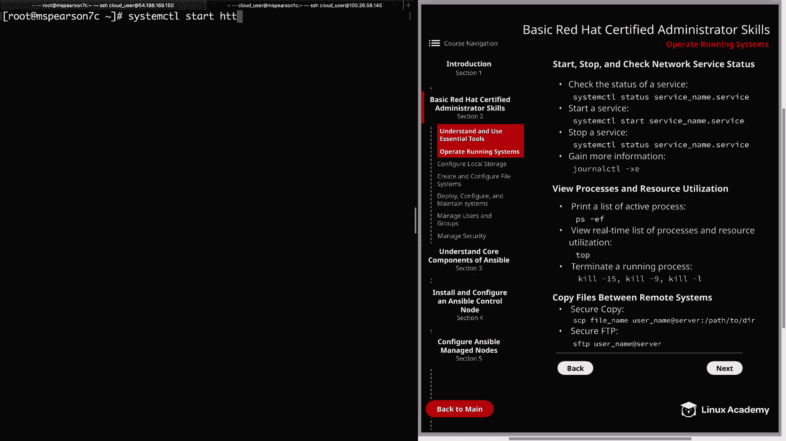

So let's go ahead and do the status on that so it's started。

 and then we can go ahead and run our enable。And you see that when we enable this service。

 it's going to create a sim link here in Etsy system D system multi user target wants。

It's going to point to this userlib system D system HTTBD service。

And you can always just copy this right here。

I'll just do a listing。And you can see all the similarlinks that have been created by system D。

We want to， we can list out our one for HtTBD。And we see that it's there。And then， if we。

Run a disable。We see that the simlink has been removed。 so if we try to list that out again。

Says no such file or directory。Alright， so let's go ahead and reenable that and then we can clear our screen All right so the next thing we want to talk about is viewing processes and resource utilization and I feel like I keep saying that everything's important and you need to know it and in a lot of ways that's true。

 but this is a very important thing for for at least troubleshooting issues on your host if you're having problems with resource utilization and tracking down what process is causing that this is a very fundamental skill that you need to have So let's go ahead and just print out a list of the active processes and we can do this with PS dash EF。

You can also use PSOX。And as you can see， this is just going to print out a ton of different running processes。

 And so when we use dash E， that's just basically saying list all the processes。

 and then dash F is going to do a full format list So it's going to give us some extra columns of information。

 So let's go ahead and clear this。So knowing how to print all the processes is good。

 but it's also important to be able to pipe that information into something like GrP so you can actually make use of it。

And so we're just going to go ahead and do PS dashf。

 and then we're going to grab for the user Apache。And it's going to show us all the processes that are running as that user。

 which is going to be running our HtTBD server， But keep in mind that this is just kind of a quick snapshot of what's running at that moment。

 But if you want a real time or at least a more real time， I think top is updated every two seconds。

 we can use the top command。 So let's go ahead and run that。

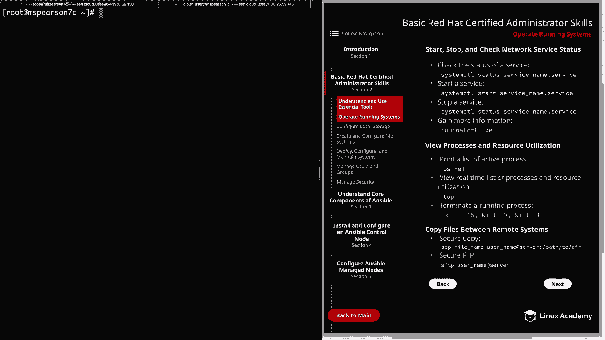

And so every couple of seconds， this process listing is going to update so it's going to show you which processes are running。

 what's consuming the most CPU in memory。It's also going to let you know about your load average and the total number of processes that are running。

 So there's just a lot of good information here that gets dynamically updated。

 There's also some different ways you can filter using top so for instance。

 I could just type in you and search for a particular user。 So I want to look for the Apache user。

 So it's just going to show nothing but the Apache user。

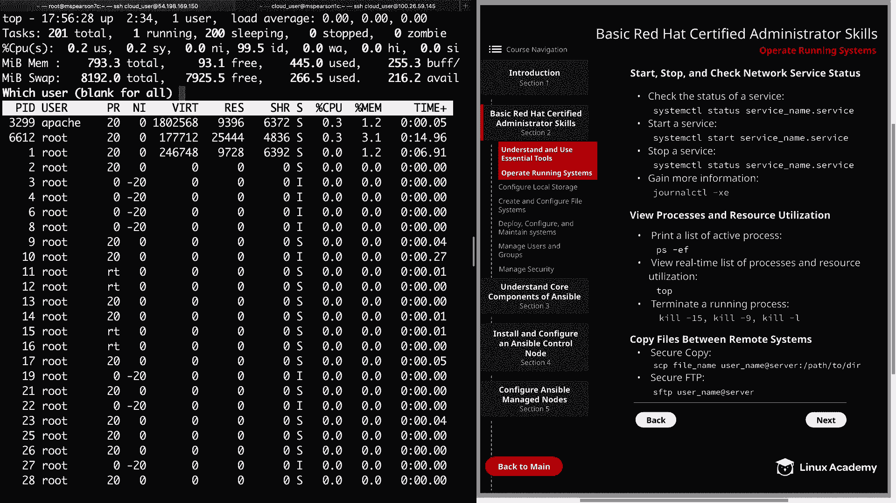

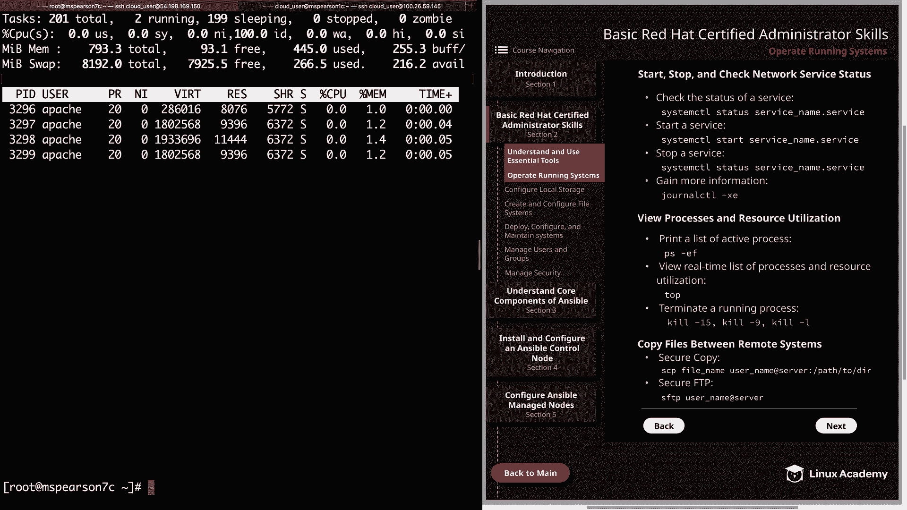

Then I'll go ahead and quit out of that and just very quickly。

 I just wanted to show you top one more time we can also type in H for help and so this is going to show you some of the things you can do to filter or view top in a way that is most fitting to you and what you need。

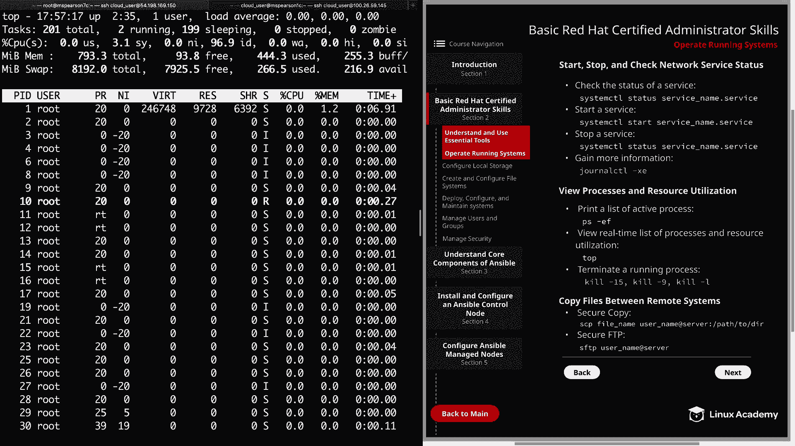

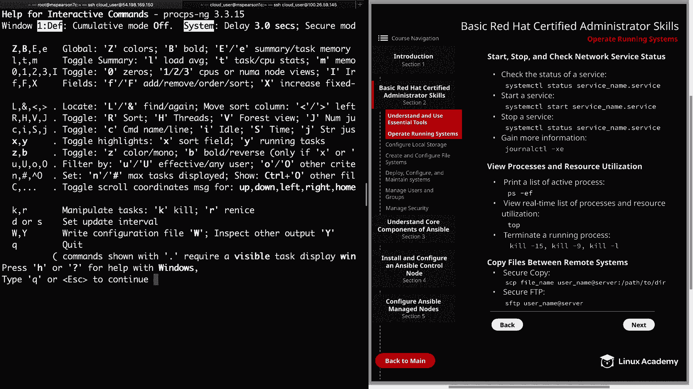

So I'm going to go ahead and quit out of this and on a control C。And then we can clear our screen。

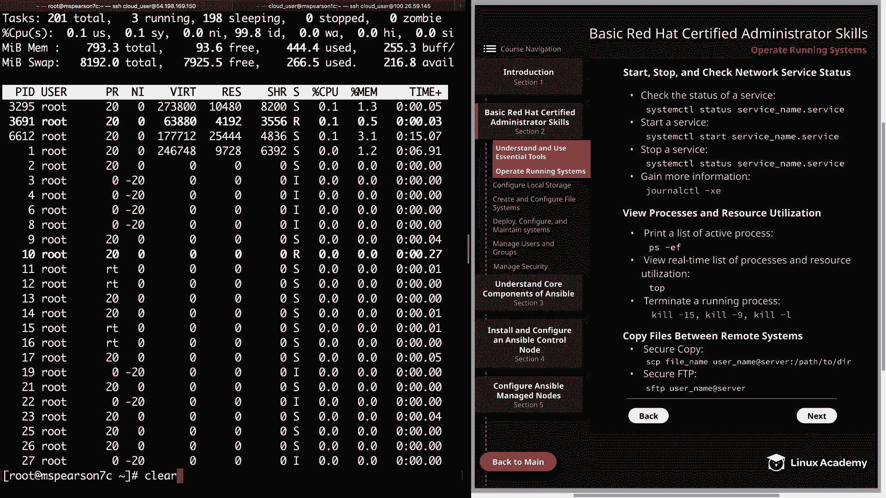

And so next we want to talk about terminating a running process。 So again。

 this is really important if you need to kill a process that's not shutting down normally。

 or if you just have a certain road Pi， you need to kill we're going to do that with as you guessed it。

 the kill command。 So if you want to get a listing of the different signals that you can use。

 you can just type in kill L。

And it's going to show you a list of all the different signals you can do。Typically speaking。

 there's two that most people are going to end up usingsing。 And that is kill D 15 or kill 9。

 And that's going to be sick term and then sick kill。

 So sick term is going to try to let the process terminate normally of its own accord。

But if for some reason that's not working that's typically what you want to use just to prevent any problems from happening。

 but if that does not work， then you can use the kill 9 or kill dashash9。

 and that's going to send the sick kill， which is just going to terminate the process immediately。

 no questions asked。

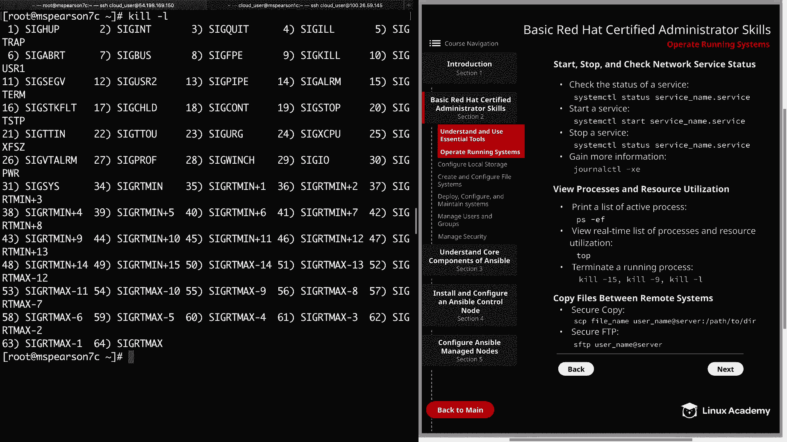

So if we do another listing real quick。Just gripep for Apache。And as you can see。

 the first column is going to be the username and keep in mind there is a little bit of a wrap here。

 so don't get confused by that。 Each one of these is a new line。

 and that's going to be followed by the process ID as well as the parent process ID。

So let's go ahead and just kill the process ID of this 3299 real quick。

And I'm just going to use the kill Dash 15。 Actually， let's go ahead and do 9。

 Let's just get aggressive on it。And then we're going to specify the PId， which is 3299。Boom。

 all right， so now let's go ahead and run our listing again。

And we see that the process ID of 3299 its no longer running。But in fact。

 another process was started up， and that is because this parent process，3295 is running。

 So if we want to kill the child processes， we need to kill the parent process。

 So let's go ahead and kill that P P。This time we're going to use the dash 15 because we want it to shut down a little more normally this time。

 so it's going to be 32 95。Alright， let's see if it's shut down yet。

And we see that it shut down successfully。

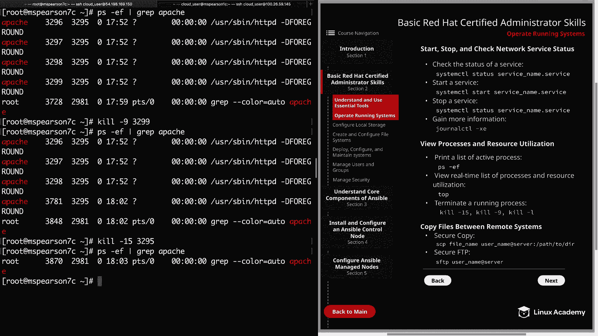

Okay， so let's go ahead and clear our screen out， and then we can move on to the last topic。

 which is going to be copying files between remote systems。

And the first thing that we want to talk about is secure copy or SCP。

 And this is going to be kind of your bread and butter for copying remote files。

 It's super quick and easy， uses the SSH protocol， So it's secure。

 and you can also use the dash R option in order to recursively copy files and directories。

 So right now I'm in roots home directory。PW。And we have a couple files here。

 but I'm going to go ahead and touch just SCP test file， so what we're going to call it。

And we we have it in here， and I'm going to copy that to my MS Pearson 1 C server here。

 Let's go ahead and get the I address。

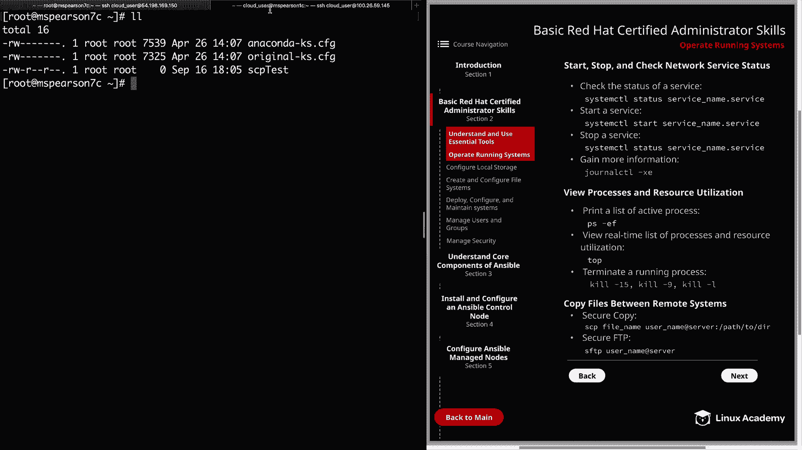

All right。Let go ahead and do the private address。

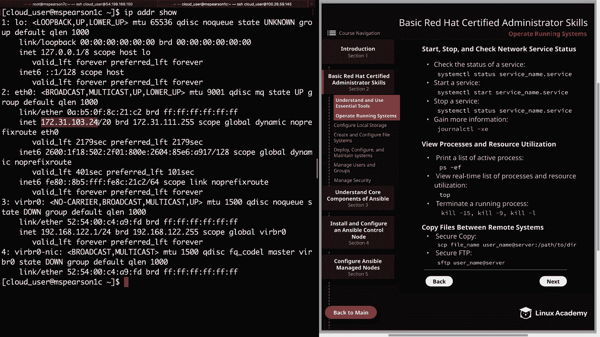

And then clear this out。 and then we can SCP， and it's going to be SCP test as the file。

 And I'm going to do this as the cloud user。And it's going to go to MSParson 1c。We copypy it。

 and let's just go ahead and put it in the temp directory。 So I'll go ahead and hit enter here。

I'll accept this， then I need to give my password for the cloud user。 And as you can see。

 the file copied。But just to validate that， let's go ahead and head back over to our second host。

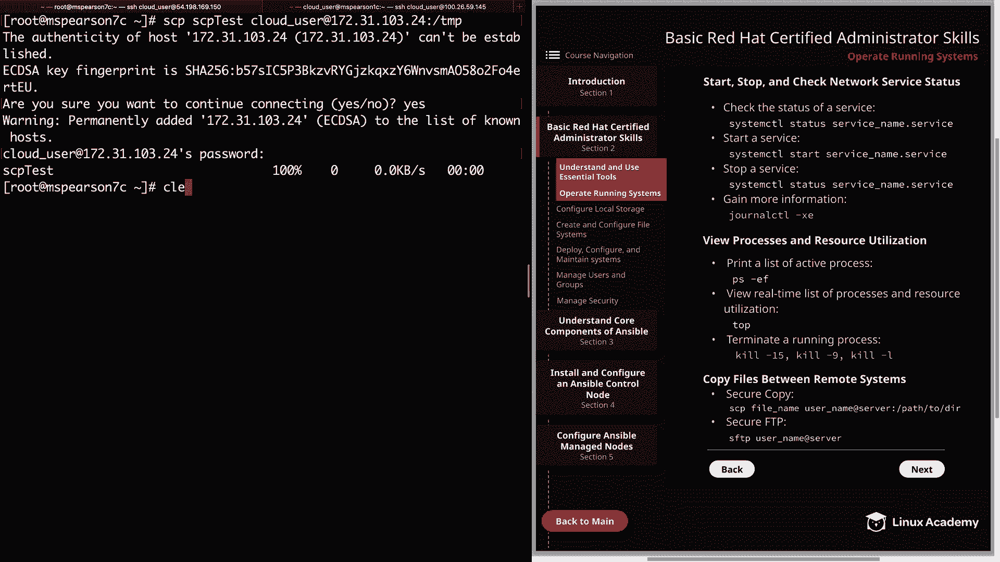

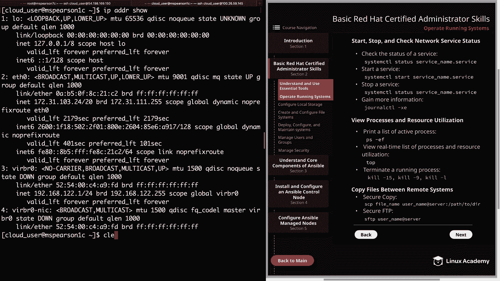

Clear this out， and then I'll just do a listing on our temp directory。

And we see right there at the top， we have SCP test。

So the next thing I want to talk about is FTP and secure FTP。

 I would definitely recommend using secure FTP over FTP because FTP does not encrypt your data by default。

 but in order to use SFTP， you just type in SFTP and then the username and then the server that you would like to copy to let's go ahead and clear this。

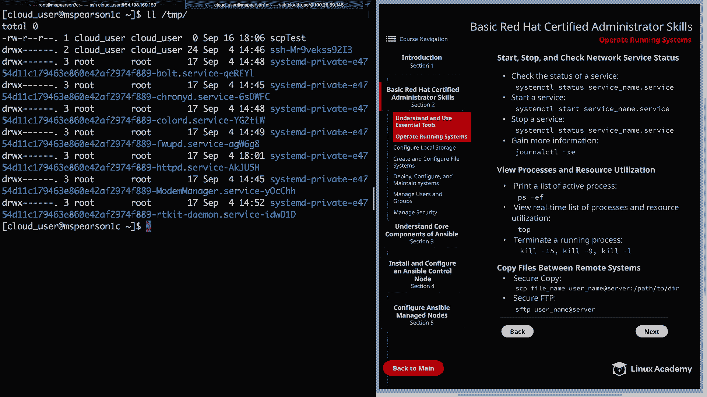

We'll go back to our original server， and I'm just going to type in SFTP and then cloud user at。

Our IP address need to give the password。And as you can see， it's put me into this SFTP prompt。

And you'll notice this desktops， documents， downloads， all these directories that are under。

 this is actually under the cloud user's home directory。

And so the difference between LS and LLS is LS is just going to do a listing on the server that you've connected to and then LLS is going to do a local listing。

 So as you can see it's got my I'm in my root directory with the Anaconda Ks。

 CFfg in ourP test file so you can see that I'm able to view files on both。

 So let's go ahead and run a put。And then SCP test。As you can see， it's uploading SCP test。

m not sure how said that before， but SCP test to home cloud user and then of course the name of the file。

 and then we can do our remote listing by doing LS and we see our file and that pretty much sums up SFTP。

 of course there are many other options you can use but feel free to look at the man pages on that to gain a little bit more information but that's going to finish up this lesson on operate running systems。

 so let's go ahead and market Comp and we can move on to the next section。

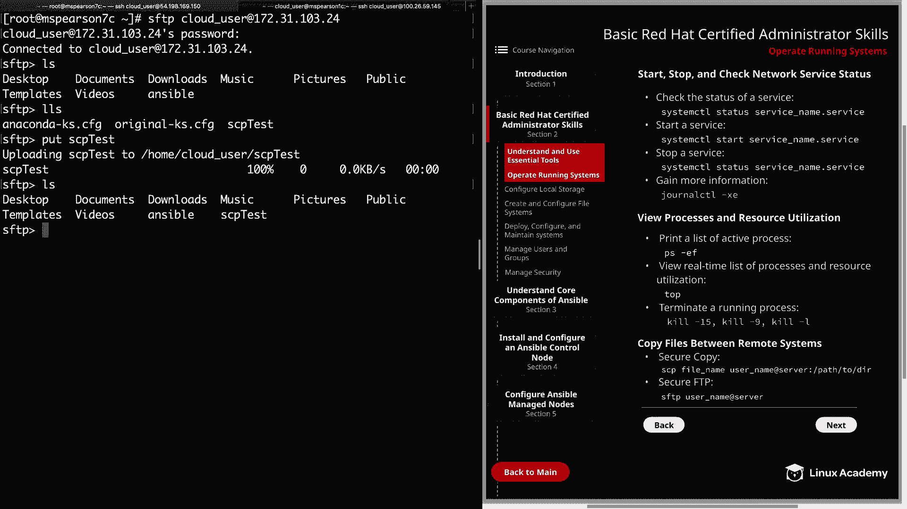