# RHCE 认证课程：第6部分：操作运行中的系统 🖥️

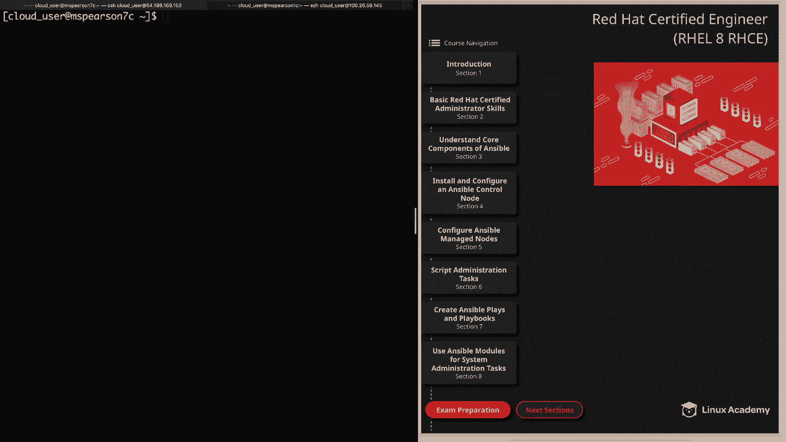

在本节课中，我们将学习如何操作正在运行的 Red Hat Enterprise Linux 系统。主要内容包括：如何正常地关机与重启、在紧急情况下重置 root 密码、管理系统服务、监控进程与资源使用情况、终止进程，以及如何在远程系统之间安全地复制文件。这些是系统管理员日常工作中必须掌握的核心技能。

## 关机与重启系统 🔌

上一节我们介绍了课程概述，本节中我们来看看如何安全地关闭或重启系统。直接断电或强制关机可能导致运行中的进程数据丢失或损坏，因此使用正确的命令非常重要。

以下是关机与重启的命令：
*   **关机**：`systemctl poweroff`
*   **重启**：`systemctl reboot`

要获取更多信息，可以运行 `systemctl --help` 或 `man systemctl`。请注意，执行这些命令需要 root 权限。在旧版 Red Hat 中，命令是 `poweroff` 或 `reboot`，但在使用 `systemd` 的系统（如 RHEL 8）中，需要在命令前加上 `systemctl`。

## 通过中断启动过程来重置 Root 密码 🔑

有时你可能需要访问一个被锁定的系统。如果无法访问系统，就无法进行管理。这时，可以通过中断启动过程来重置 root 密码。

以下是重置 root 密码的步骤：
1.  在系统启动时，在 GRUB 菜单按 `e` 键编辑内核启动参数。
2.  找到以 `linux` 开头的行，删除 `ro crashkernel` 参数。
3.  在同一行末尾添加 `rd.break enforcing=0`。
4.  按 `Ctrl+X` 使用修改后的参数启动系统。
5.  系统会进入紧急模式。重新挂载根文件系统为可写：`mount -o remount,rw /sysroot`
6.  切换到 `chroot` 环境：`chroot /sysroot`
7.  现在可以重置 root 密码：`passwd`
8.  创建 `.autorelabel` 文件以在下次启动时重新标记 SELinux 上下文：`touch /.autorelabel`
9.  退出 `chroot` 环境并重启系统：`exit`，然后 `reboot`

## 管理系统服务 ⚙️

上一节我们学习了如何访问系统，本节中我们来看看如何管理系统服务。我们将以 HTTPD（Apache Web 服务器）服务为例。

首先，检查服务的状态。命令格式为 `systemctl status <服务名>`，`.service` 后缀可以省略。

```bash
systemctl status httpd
```

如果服务未运行（inactive），可以启动它。

```bash
systemctl start httpd
```

再次检查状态，确认服务已变为 `active (running)`。要停止服务，使用 `stop` 命令。

```bash
systemctl stop httpd
```

要查看服务的详细日志以进行故障排除，可以使用 `journalctl` 命令。`-xe` 选项会显示带解释性文字的日志并跳转到日志末尾。

```bash
journalctl -xe
```

按 `q` 键退出日志查看器。为了让服务在系统启动时自动运行，需要启用它。

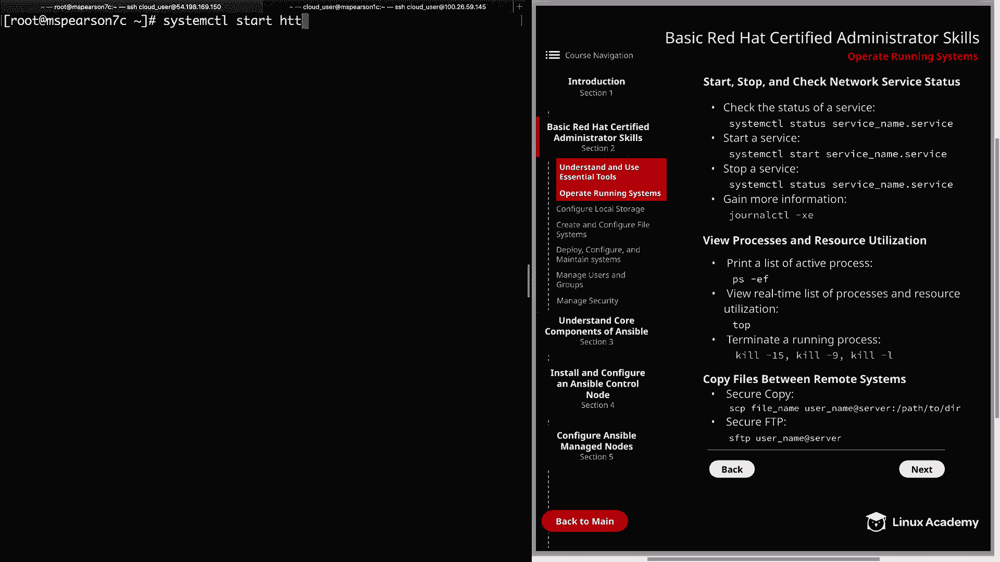

```bash
systemctl enable httpd
```

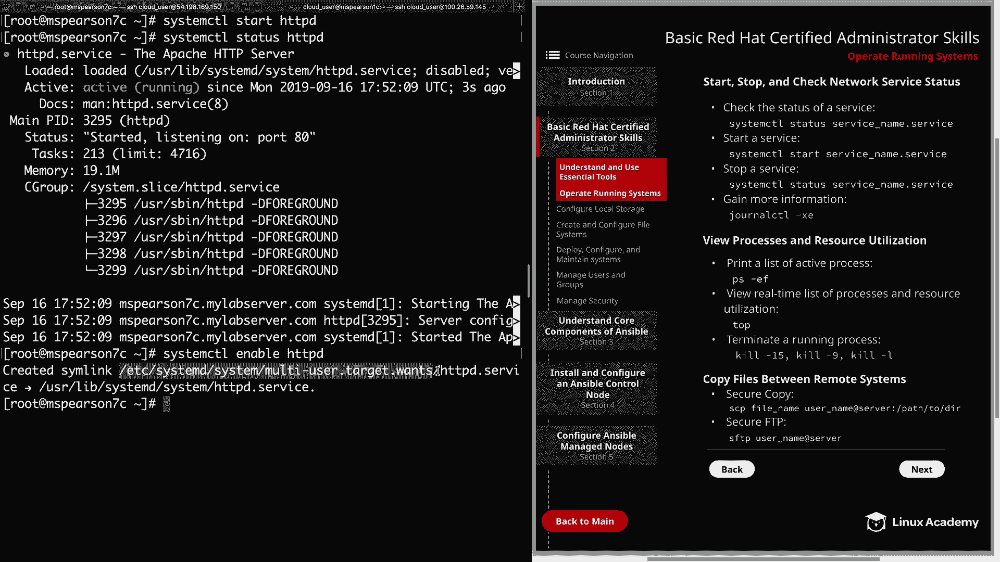

启用操作会创建一个符号链接。要禁用开机自启，使用 `disable` 命令。

```bash
systemctl disable httpd
```

## 查看进程与资源利用率 📊

监控系统进程和资源使用情况是诊断性能问题的关键技能。

要列出所有正在运行的进程，可以使用 `ps -ef` 命令。`-e` 列出所有进程，`-f` 提供完整格式信息。

```bash
ps -ef
```

为了快速查找特定进程（例如属于 `apache` 用户的进程），可以将输出通过管道传递给 `grep`。

```bash
ps -ef | grep apache
```

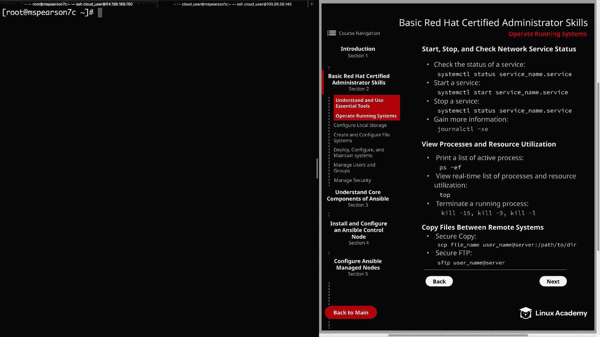

`ps` 命令提供的是瞬时快照。要动态查看实时更新的进程和资源信息（默认每2秒更新一次），可以使用 `top` 命令。

```bash
top
```

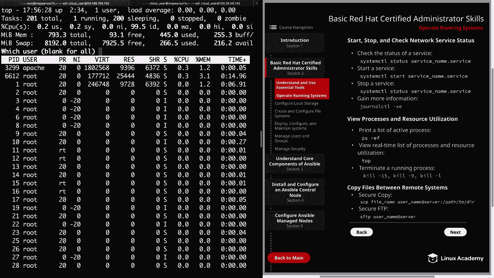

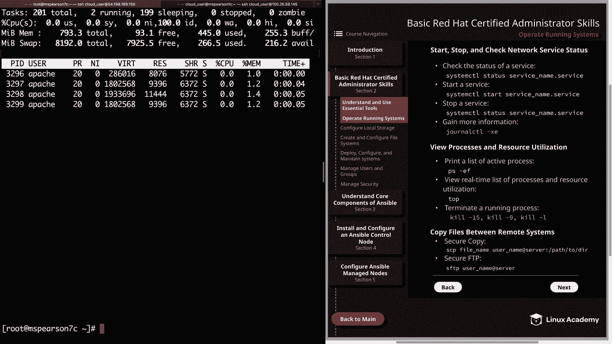

在 `top` 界面中，可以按 `u` 键然后输入用户名（如 `apache`）来过滤显示特定用户的进程。按 `h` 键可以查看帮助信息，了解其他过滤和排序选项。按 `q` 或 `Ctrl+C` 退出 `top`。

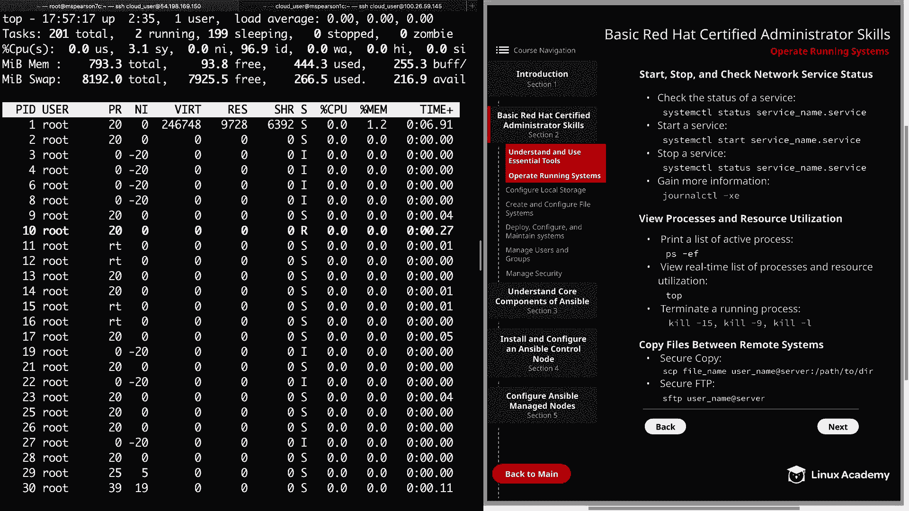

## 终止运行中的进程 🚫

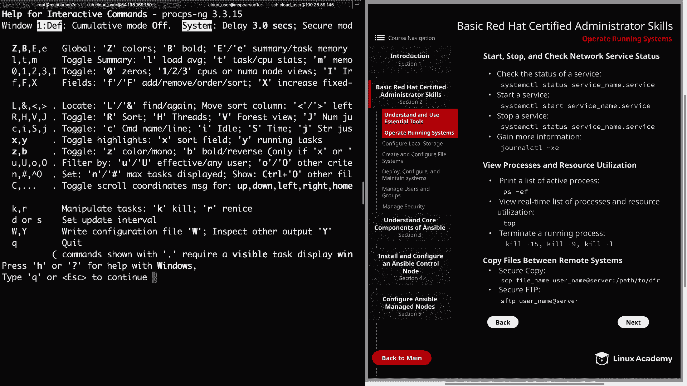

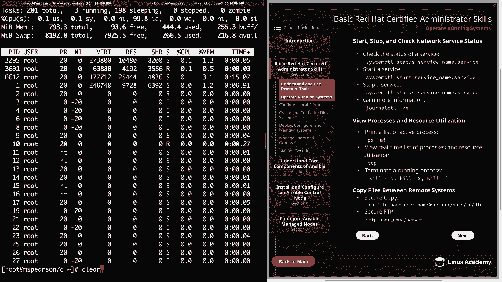

当进程无响应或需要强制结束时，需要使用 `kill` 命令。

首先，使用 `ps` 命令找到目标进程的 PID（进程ID）。

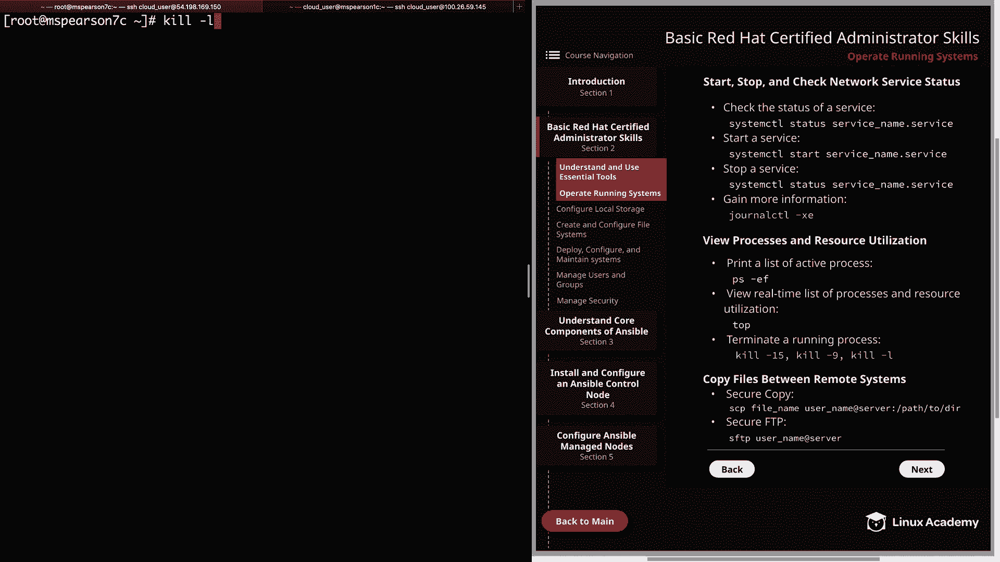

```bash
ps -ef | grep apache
```

`kill` 命令可以向进程发送不同的信号。使用 `kill -l` 可以查看所有可用信号列表。

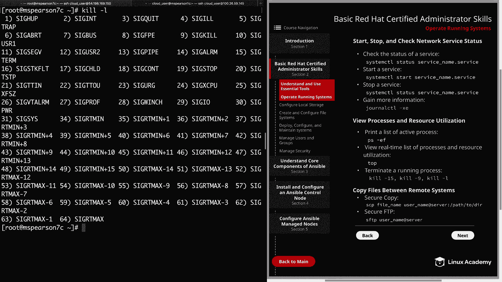

```bash
kill -l
```

最常用的两个信号是：
*   **SIGTERM (15)**：`kill -15 <PID>` 或 `kill <PID>`。这是默认信号，请求进程正常终止。
*   **SIGKILL (9)**：`kill -9 <PID>`。这个信号会强制立即终止进程，不给进程清理的机会，应作为最后手段使用。

例如，要强制终止 PID 为 3299 的进程：

```bash
kill -9 3299
```

有时需要终止父进程才能停止其所有子进程。找到父进程 ID（PPID）后，对其使用 `kill` 命令。

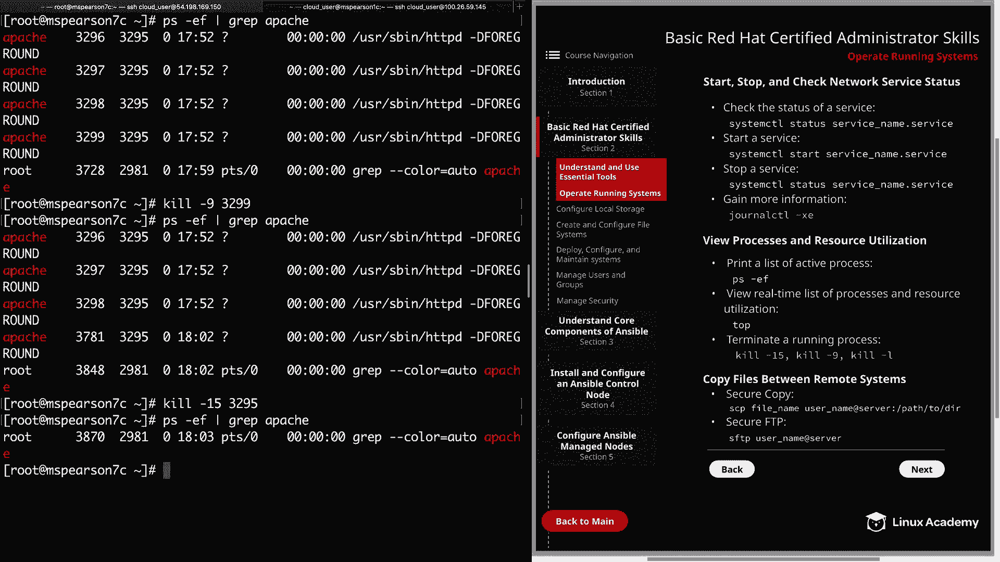

## 在远程系统间复制文件 📁

在管理多台服务器时，经常需要在它们之间传输文件。

**1. 使用安全复制 (SCP)**
SCP 基于 SSH 协议，是加密的，适合快速复制文件。`-r` 选项可以递归复制整个目录。

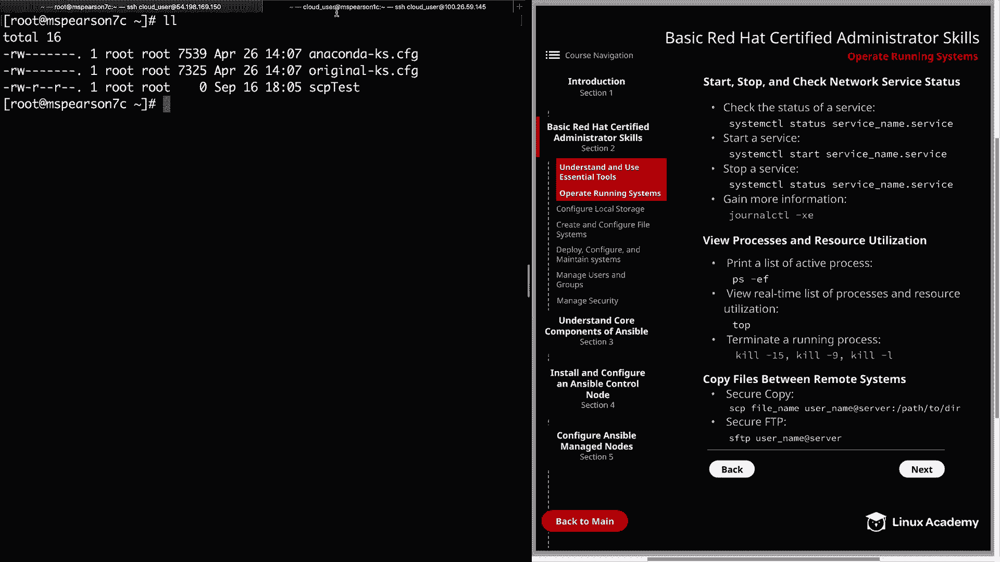

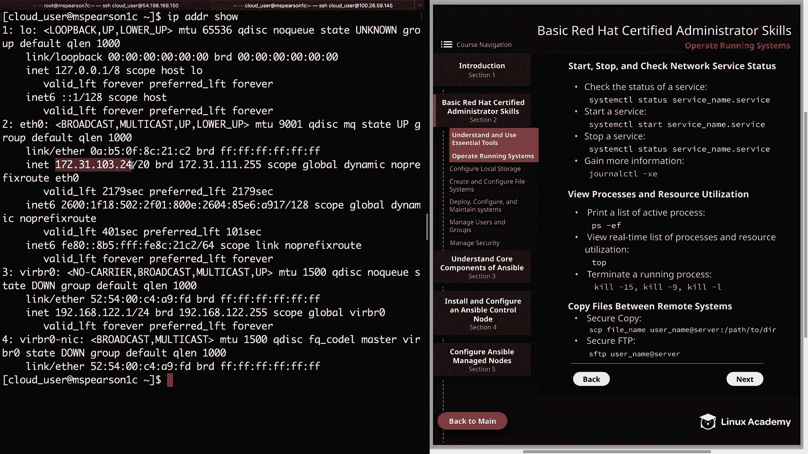

假设要从当前主机复制文件 `scp_test` 到远程主机 `192.168.1.100` 的 `/tmp` 目录，用户是 `clouduser`：

```bash
scp scp_test clouduser@192.168.1.100:/tmp/
```

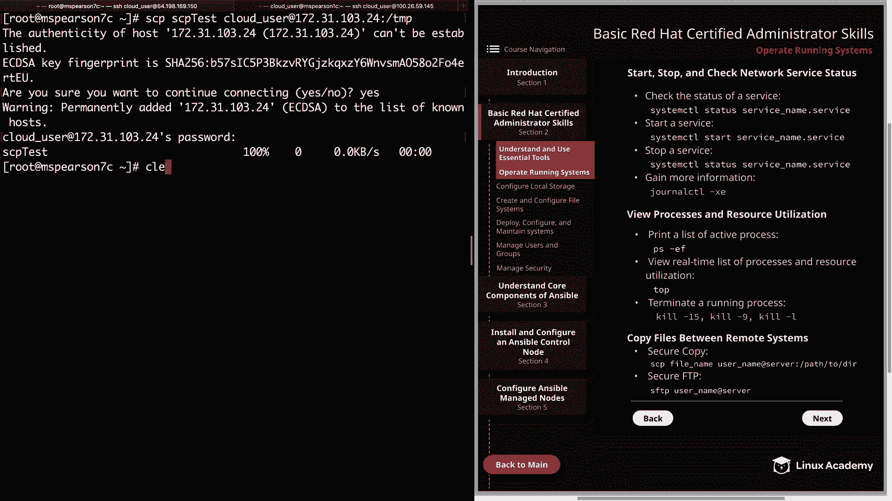

**2. 使用安全文件传输协议 (SFTP)**
SFTP 也基于 SSH，提供了一个交互式的文件传输会话。它比 FTP 更安全，因为 FTP 默认不加密数据。

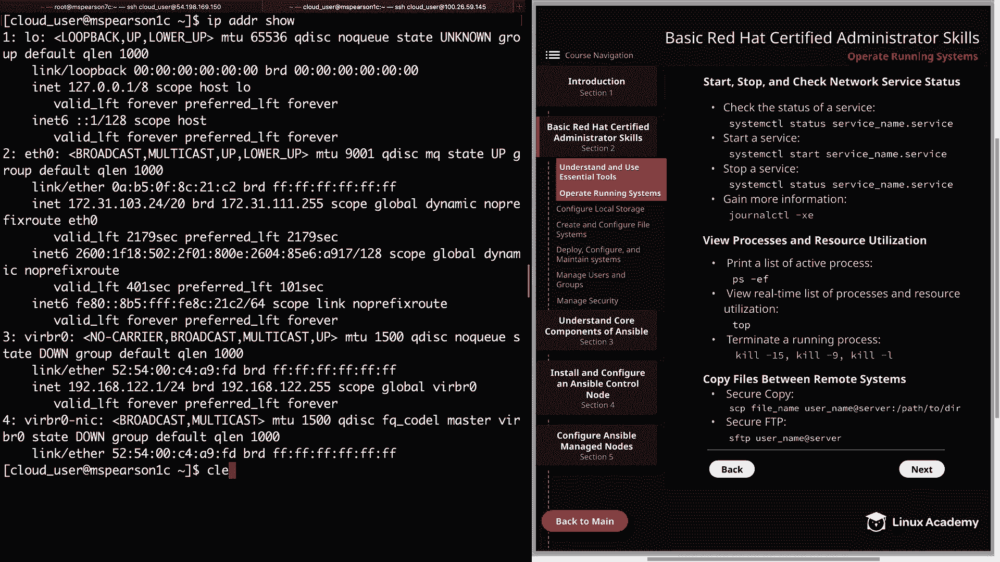

连接到远程服务器：

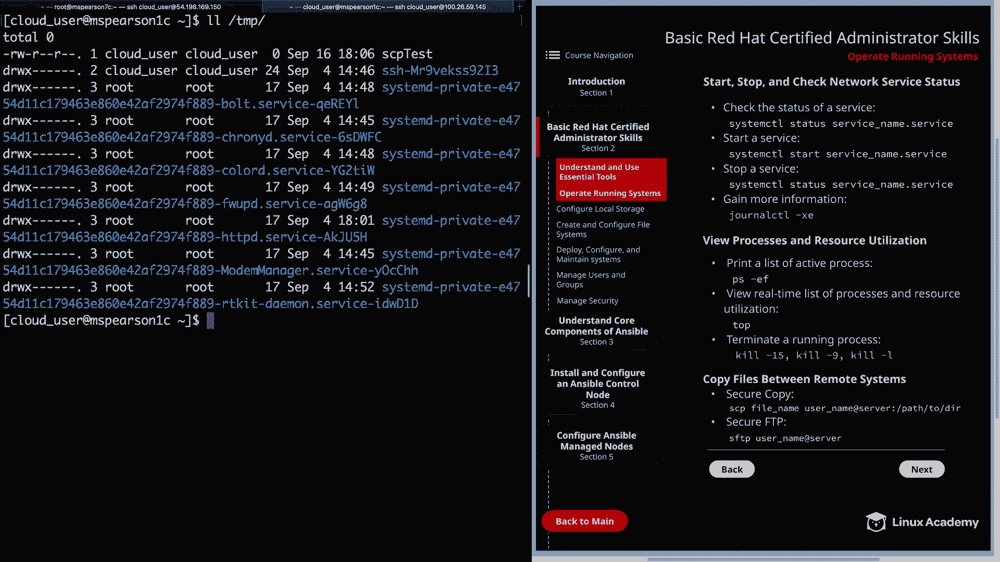

```bash
sftp clouduser@192.168.1.100
```

进入 SFTP 会话后，可以使用以下命令：
*   `ls`：列出**远程**服务器上的文件。
*   `lls`：列出**本地**当前目录的文件。
*   `put <本地文件>`：将本地文件上传到远程服务器。
*   `get <远程文件>`：从远程服务器下载文件到本地。
*   `exit`：退出 SFTP 会话。

例如，上传文件：

```bash
sftp> put scp_test
```

---

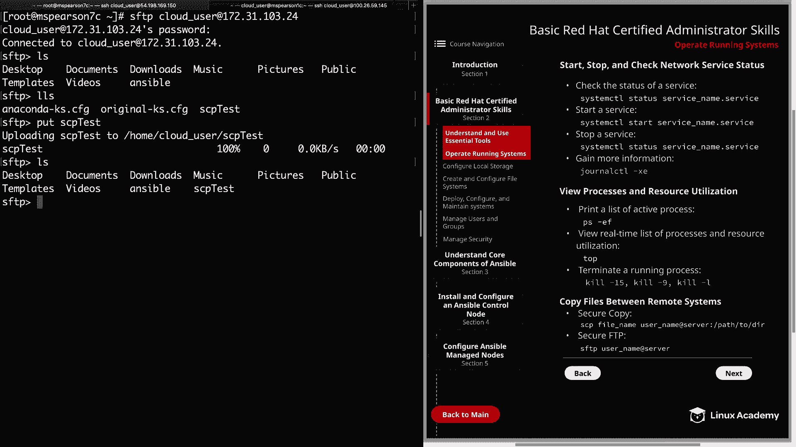

本节课中我们一起学习了操作运行中 RHEL 系统的核心技能。我们掌握了如何安全地关机重启、在紧急情况下重置 root 密码、使用 `systemctl` 管理服务的生命周期、利用 `ps` 和 `top` 监控进程与资源、使用 `kill` 命令终止进程，以及通过 `scp` 和 `sftp` 在远程系统间安全地传输文件。这些是成为一名合格系统管理员的坚实基础。