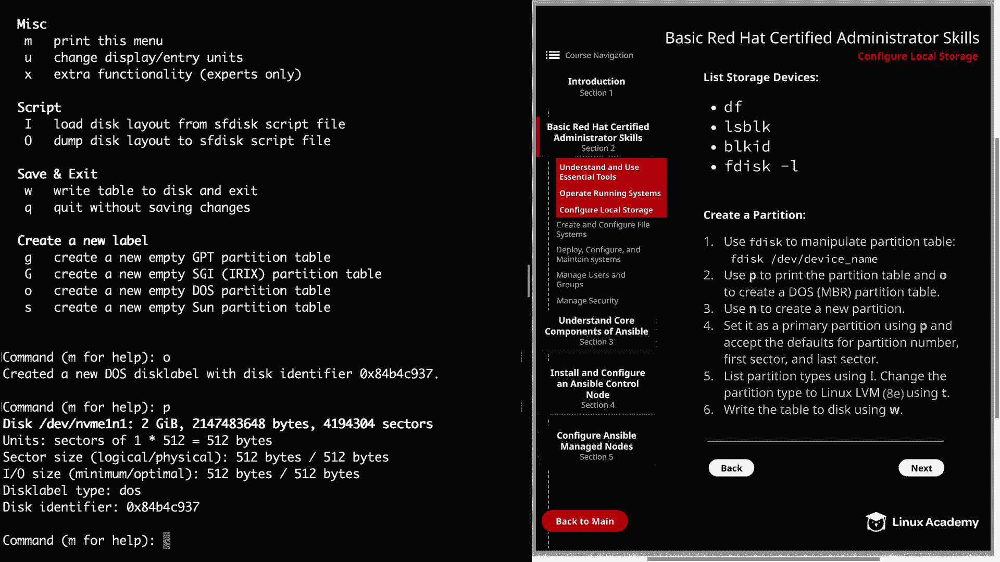
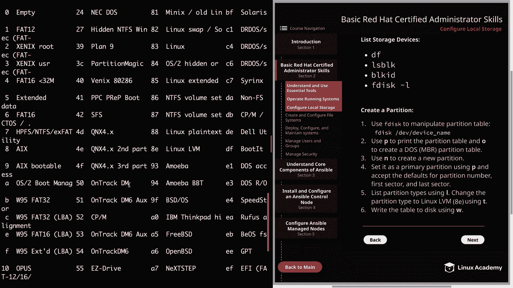

# Red Hat Certified Engineer (RHEL 8 RHCE) - P7：388-4867-4 - Configure Local Storage - 11937999603_bili - BV12a4y1x7ND

Welcome back everyone， this is Matt， and in this video we are going to continue our recap of our RHCSA basic skills and talk about configuring storage on your local host。

So let's go ahead and click on section 2。And then we're going to go to 2。3。

 which is configured local storage， and then I'm going to head over to the command line and we're going to walk through a few different commands that we can gain information about the storage on our host as well as the different devices。

 So the first command I want to show you is Df and we're going to use the dash H flag for human readable and this is actually just going to show us the amount of disk space that's available on our currently mounted file systems。

 and we see that this device in Vme0 and1 P2 is mounted on our route directory And as we move forward in mount file systems。

 we're going to see these show up with the Df command。And the next command is LS BLK。

And this is going to show us a listing of our block devices as well as our partitions and also their size。

 So you see under type you're going to have disk and then if it's a partition。

 you're going to have part and it'll also give you some information about the mount point。

So the next， we're going to talk about block ID or BL K ID。

And this is going to give us the UUI of our block devices as well as some additional information so you can see that there's a file system on the first with XFS。

 and then it's going to show us our partitions and notice that PT type is DoOSOS。

 so that's letting us know that this is a NBR partition table。

 which is important because you can really mess things up if you think you're working with an NBR table which you're actually using a GPT table。

 So with NBR you're able to use FD， but with GPT， you're going to want to either use G disk or parted。

And then the last thing I'll show you is just the F disk dash L command。

 So we're going to do F disk if I can type it。And then we're going to go into the dev directory。

 which is a listing。 we're not going to list all those out of all our devices。

 and we're going to be using an NVME device。And this is actually a good point to pause and tell you that if you are following along。

 I have added an additional disc through Cloud Playground。

 so all you need to do is head over cloud Playground and then click on your server and then you can click on the actions button there at the bottom left and then you can add dev NVme1 in one So if you have not done that yet go ahead and just pause the video and then go add that。

 it doesn't take long you't have to restart the server or anything or restart the server or anything and then we can move forward。

 So anyways I have several devices here and I'm going to be using the NVme1 in one。

So we'll go ahead and tap complete that out。 And this is just going to give us some information。

 It's going to tell us our device name， of course， and how much space is there。

 you see there's two gigabytes， but it's also going to tell us that in bytes as well as how many sectors we have And another thing for me to point out is that I am logged in as the root user So you may want to do that as we're just quickly running through some of these commands to show it。

 you can also use pseudo when you're using these commands， but it's of course up to you。

 I'm just doing this more for convenience sake as we move through the material。 But anyways。

 let's go ahead and move on and we can create a partition on our Nvme1 and1 device。

 So I'm going to clear this out。And so we're just going to type an F disk and then the path to our device。

 Our device name is NvM1 and1。It's going to give us our welcome message and let us know that our device does not contain a recognized partition table。

 So that's something we're going to have to add。And before we do that。

 I'm just going to show you real quick that you can type an M for help。

 and that's going to show you all the various options that you can do。So here at the bottom。

 you see create a new label， and the O option is going to create a new empty doss partition table。

 which is going to give us that NBR partition table。 So let's go ahead and type that in。

It says as we created a new dos disk label with our disk identifier。

So then we can hit P to print that。It's going to give us information about our disk and how much space there is。

 as well as our disk label type and our disk identifier。So now we need to create our partition。

 which we'll use in for that。

And the partition type needs to be primary。 So we're just going to accept the default by hitting enter。

And we'll do the default again， which is one。

And for first sector， we're going to take the beginning。

And then we're going to use the rest of the disk。 So we're going to hit the default all the way to the end。

 You could parel this out if you wanted to do half the disk and then another half of the disk if you're wanting to practice multiple different physical volumes。

 But for the the purpose of this video， we're just going to use the entire disk。

And then we need to change the partition type to Linux LVM， which is Df。

Using T， but you can also list out the different types of partition by just typing an L。

 And this is going to show you the different types you can use as well as their code。

 And as you can see， there are a bunch of different options here。

And we're going to be using Linux LVM， which is A E。

And we change the type of partition from the default of Linux to Linux LvM。

 So now we can go ahead and write our changes with W。

And we see that our part table has been altered。 So now let's go ahead and clear out this screen。

 and we can move on to the next page。

And we can create an LVM logical volume。 And just remember， if you want to see that partition。

 you can use L S B K。And it's going to show our partition under N VME1 and1。

 So let's go ahead and create our physical volume using PV create。

And then the path to our partition in the ME。1 and1， P1。And if you want to list our physical volumes。

 you can use PVS。And then we need to create our volume group for that we're going to use VG create。

And then the name of our volume group， and I'm just going to call this test underscore Va。

And then the path to our physical volume， of course， is going to be dev N VME1 and1， P1。

And then we can list those out using VGS very similar to PVS。

And now let's go ahead and create our logical volume using LV C。

And then we're going to pass the dash L flag， which allows us to specify the size of the logical volume。

 So we're going to do 1 g for 1 gigabte and then dash in。

 and we can specify the name of our logical volume。 So I'm just going to call it test Lv。

And then we need to specify the volume group， which is testval。

And then to list out our logical volumes， we can simply do LVS。Now。

 let's go ahead and clear the screen， and I'll show you how you can delete a logical volume。

 as well as the volume group and physical volume。 So first。

 we'll just delete the logical volume using LV remove。

And then we just need to specify the volume group and the logical volume。

 So remember it's test ball and then test LV。Ask us if we really want to remove it and we're going to go ahead and do that。

And then we can delete our volume group with VG remove。

And this time we just have to specify the volume group name， which is test wall。

And then as you might have guessed， we can remove the physical I using PV remove。

And then the path to our physical volume。Piwan。Well。

 that's going to finish up this lesson on configuring local storage。

 There is one thing I wanted to note before we end， and that's just that there are， of course。

 a bunch of different flags you can use with these commands。

 especially when you're creating your logical volume。

And this was just meant to serve as kind of an overview of the general way that you're going to create logical volumes。

 And remember that you can always use the system documentation like demand pages to look up these flags and gain a little more information about each command。

 Well， let's go ahead and mark the video complete。 and we can move on to the next lesson。

