# RHCE 课程：P7：配置本地存储 💾

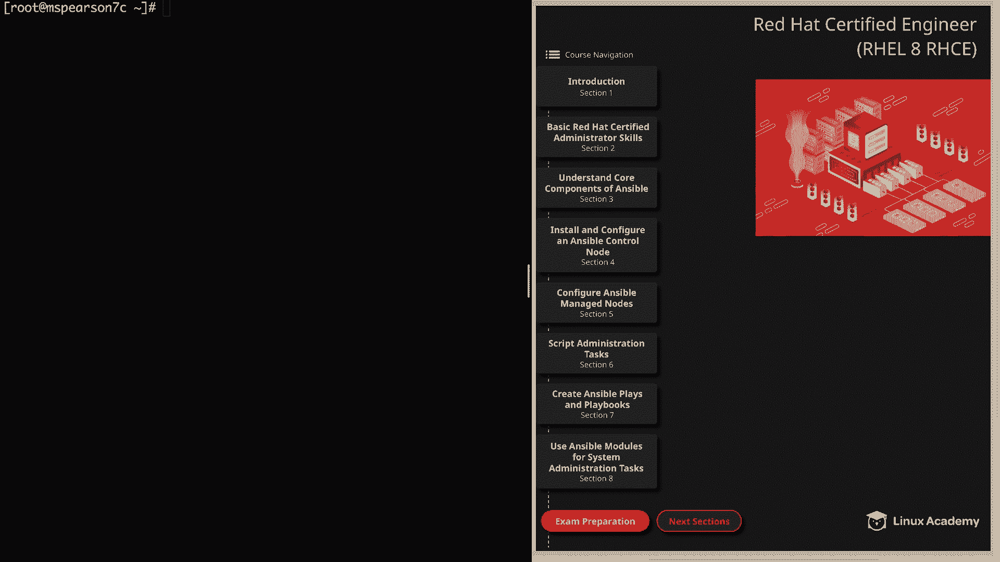

在本节课中，我们将学习如何在本地主机上配置存储。我们将了解如何查看存储信息、创建分区以及使用 LVM 管理逻辑卷。

---

## 查看存储信息

首先，我们介绍几个用于查看系统存储信息的命令。

以下是几个关键命令及其用途：

*   **`df -h`**：以人类可读的格式显示已挂载文件系统的磁盘空间使用情况。
*   **`lsblk`**：列出所有块设备、分区及其大小和挂载点信息。
*   **`blkid`**：显示块设备的 UUID 和文件系统类型等信息。
*   **`fdisk -l /dev/<device_name>`**：显示指定磁盘的详细信息，包括分区表类型（如 DOS/MBR）。

上一节我们介绍了如何查看存储信息，本节中我们来看看如何创建和管理分区。

---

## 创建磁盘分区

我们将使用 `fdisk` 工具在 `/dev/nvme1n1` 设备上创建一个分区。

以下是使用 `fdisk` 创建分区的步骤：

1.  以 root 用户身份运行 `fdisk /dev/nvme1n1` 命令。
2.  输入 `o` 创建一个新的 DOS（MBR）分区表。
3.  输入 `n` 创建一个新分区，选择默认的“主分区”类型。
4.  接受默认的分区号（1）和起始扇区。
5.  对于结束扇区，接受默认值以使用整个磁盘空间。
6.  输入 `t` 更改分区类型，然后输入 `8e` 将其设置为 **Linux LVM** 类型。
7.  输入 `p` 预览分区表。
8.  最后，输入 `w` 将更改写入磁盘。

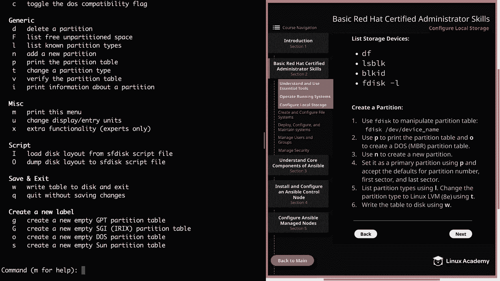

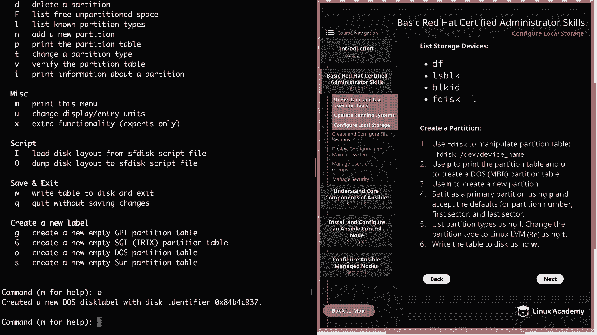

现在我们已经创建了一个用于 LVM 的分区，接下来可以开始配置逻辑卷管理器。

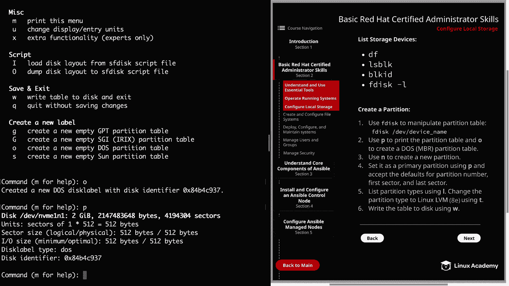

---

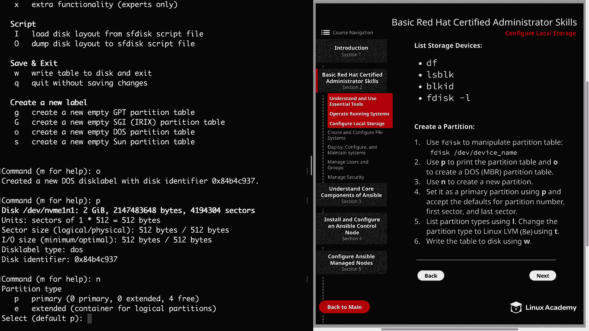

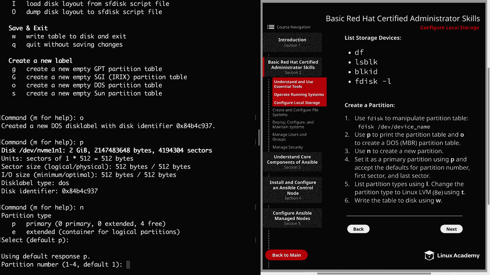

## 配置 LVM 逻辑卷

LVM 允许我们灵活地管理磁盘空间。配置过程分为三步：创建物理卷、创建卷组、创建逻辑卷。

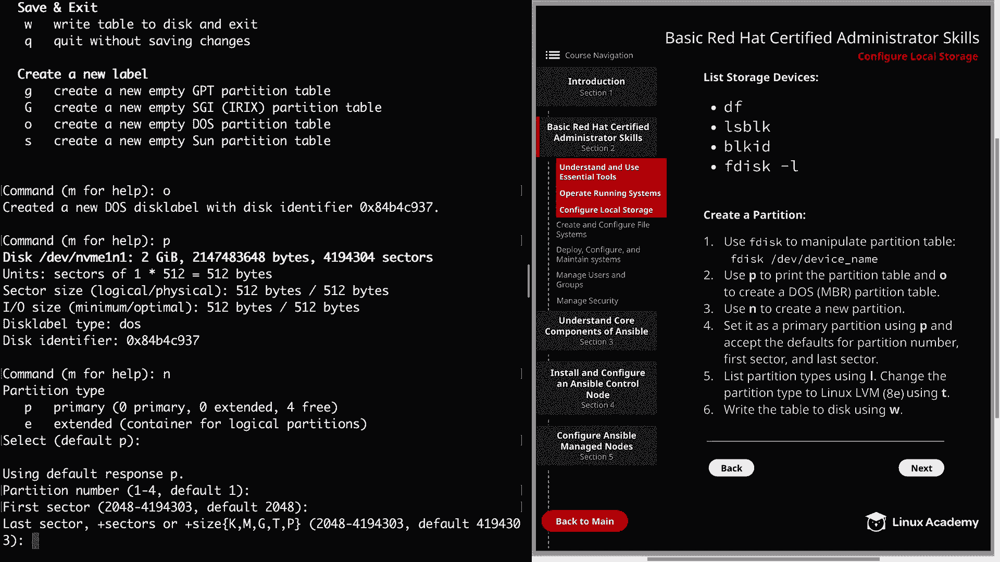

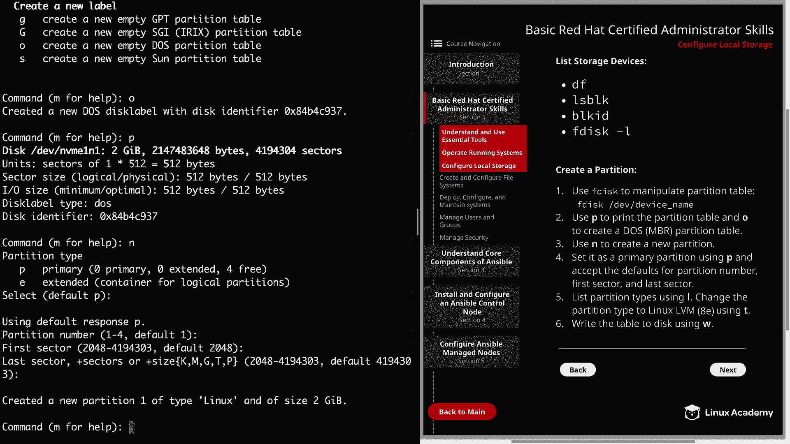

以下是配置 LVM 逻辑卷的步骤：

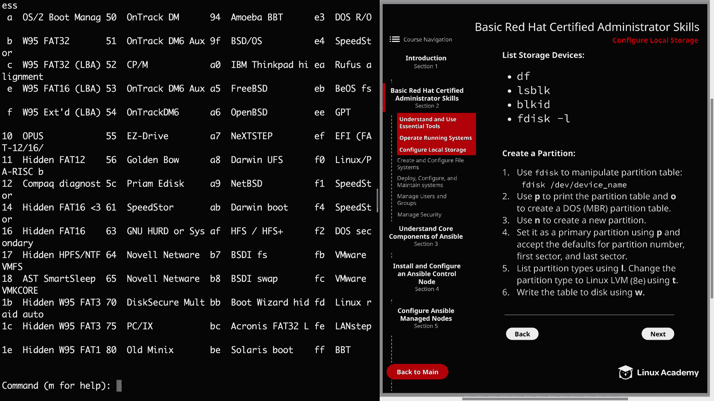

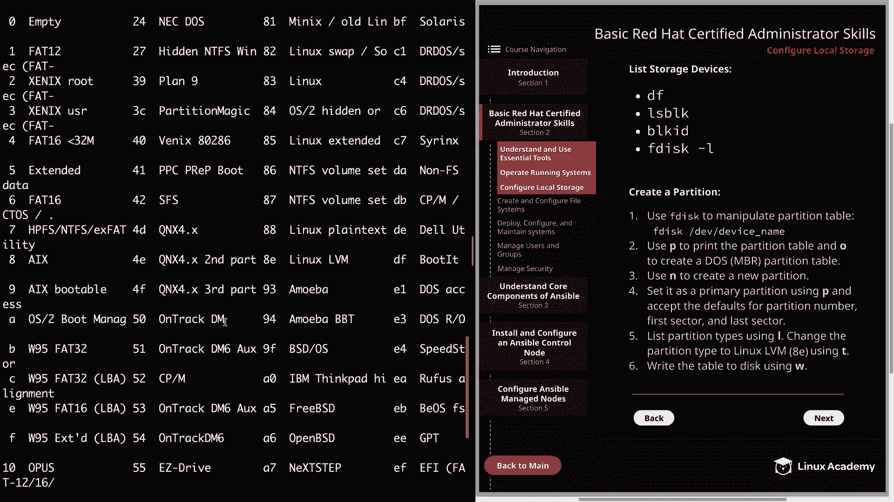

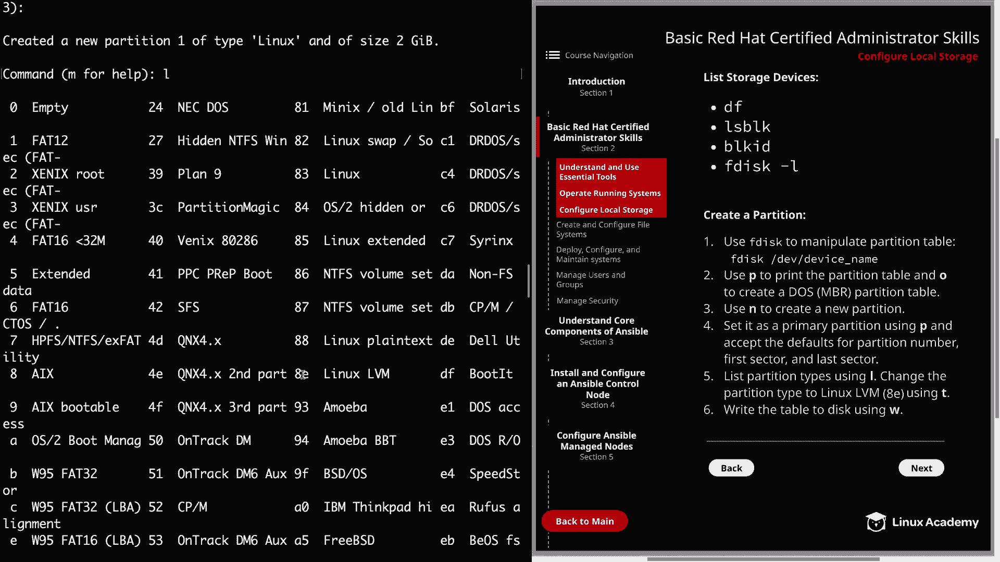

1.  **创建物理卷**：使用 `pvcreate /dev/nvme1n1p1` 命令。使用 `pvs` 命令查看物理卷列表。
2.  **创建卷组**：使用 `vgcreate test_vg /dev/nvme1n1p1` 命令。`test_vg` 是卷组名称。使用 `vgs` 命令查看卷组列表。
3.  **创建逻辑卷**：使用 `lvcreate -L 1G -n test_lv test_vg` 命令。这将创建一个名为 `test_lv`、大小为 1GB 的逻辑卷。使用 `lvs` 命令查看逻辑卷列表。

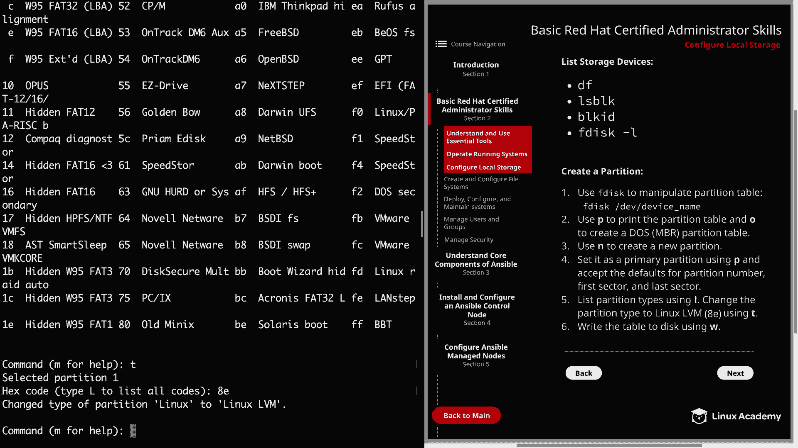

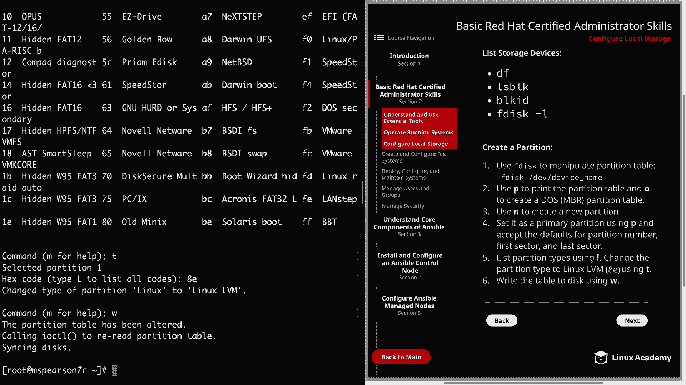

我们已经学会了如何创建 LVM 组件，接下来了解如何清理和删除它们。

---

## 删除 LVM 组件

删除 LVM 组件的顺序与创建时相反：先删逻辑卷，再删卷组，最后删物理卷。

以下是删除 LVM 组件的步骤：

1.  **删除逻辑卷**：使用 `lvremove test_vg/test_lv` 命令。
2.  **删除卷组**：使用 `vgremove test_vg` 命令。
3.  **删除物理卷**：使用 `pvremove /dev/nvme1n1p1` 命令。

---

## 总结

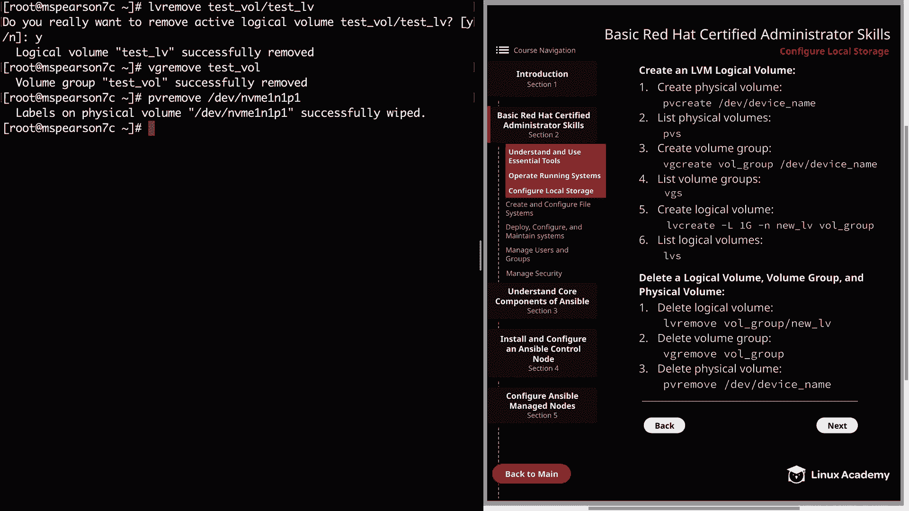

本节课中我们一起学习了配置本地存储的基础知识。我们掌握了使用 `df`、`lsblk` 等命令查看存储信息，使用 `fdisk` 工具创建和修改磁盘分区，以及使用 LVM 命令（`pvcreate`、`vgcreate`、`lvcreate`）创建和管理逻辑卷的完整流程。请记住，每个命令都有更多选项和标志，可以通过 `man` 命令查看详细文档以进行更复杂的操作。