# Red Hat Certified Engineer (RHEL 8 RHCE) - P8：388-4867-5 - Create and Configure File Systems - 11937999603_bili - BV12a4y1x7ND

Welcome back everyone， this is Matt， and in this video we're going to be going over creating and configuring file systems。

before we dive into it， I just want to let you know that I did go back and recreate our logical volume from the previous video。

 so if you'd like to follow along， go ahead and pause the video and recreate that logical volume。

 I apologies for the fake out and extra work， but once you've done that we can go ahead and get started。

 so let's click on basic Red Hat certified administrator skills and then we're going to go down to the section for Create and configure file systems。

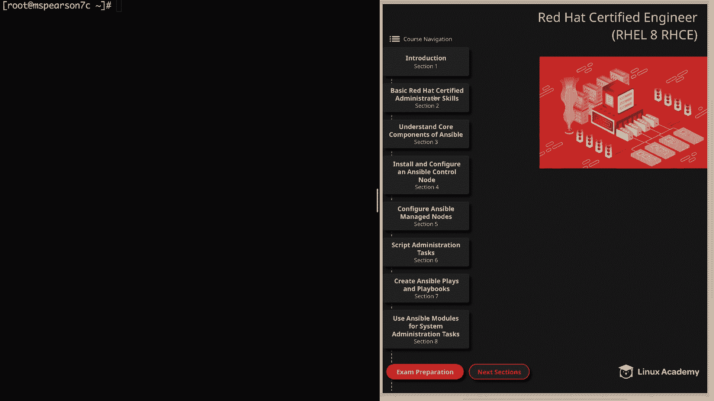

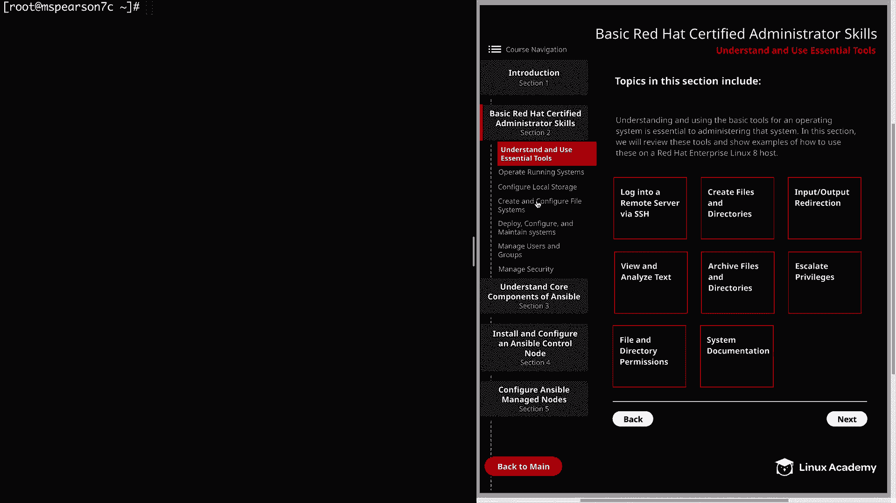

So let's go ahead and jump into the command line here。

So the first thing that we need to do is create a file system on our logical volume。To do that。

 we're going to use MKFS。And then our dot and then we're going to specify the actual file system that we want to use and so for us we're going to be using EXT 4。

 but as you can see there are several other options that you have to choose from so we'll specify EXT4。

And then the path to our logical volume， I'm going to use dev Mapper。

And then there's our logical volume。 It's test underscore all dash test L V。

 So let's go ahead and hit enter。And as you can see that created very quickly。

 So now all we need to do is mount our file system。

 so let's go ahead and clear this and I'm going to CDd to our mount directory。Currently， it's empty。

 so let's go ahead and create a directory。 So I'm just going to use M KD。

 and then I'm going to call this just test FS。And then if we want to mount our file system。

 all we have to do is type mount。 and then the path to our logical volume， which again， is dev Maper。

Test fall， test Lv。And then the path to our mount point。Which is going to be mount test of S。

And then we can list our mounted file system just using D F dash H。

 and we see that our test LV logical volume is mounted to test FS。

 So currently the file system is mounted and we could touch a new file in there if we wanted to。

 we got test test Fs， and we could just do test1。And we see that our。

File exists in our newly mounted directory。But if we rebooted our system right now。

 then the mount would go away。 So if we wanted to add persistence to that。

 so it would persist through a reboot， we need to add it to etFS tab。

 So let's go ahead and clear this， and I'm going to hit block I。

 and I'm going to go ahead and copy this Eu I。

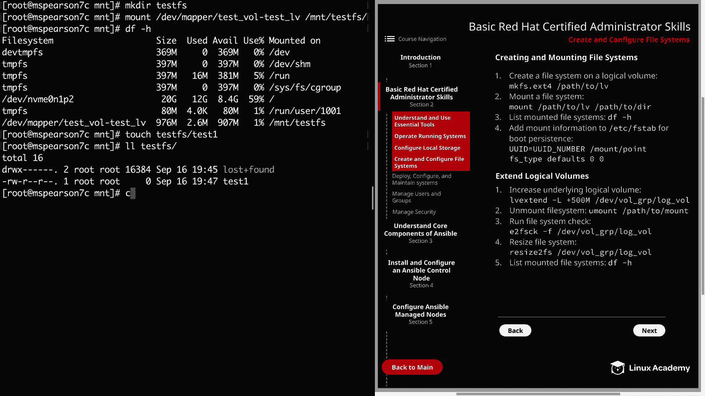

Then we can open up etFS tab。We'll go down to the bottom here。

And then I'm going to hit O to add this new line， and then I'm going to paste in our UUI。

And then we need to add the mount point， which is going to be mount test Fs。

And then we can add our spaces here， and we're going to specify the type of file system。

 which is EXT4。And then we'll come down and just do the defaults and then also the default checks。

And notice again that this this line is just wrapping around like we've seen before just because of the size of the terminal。

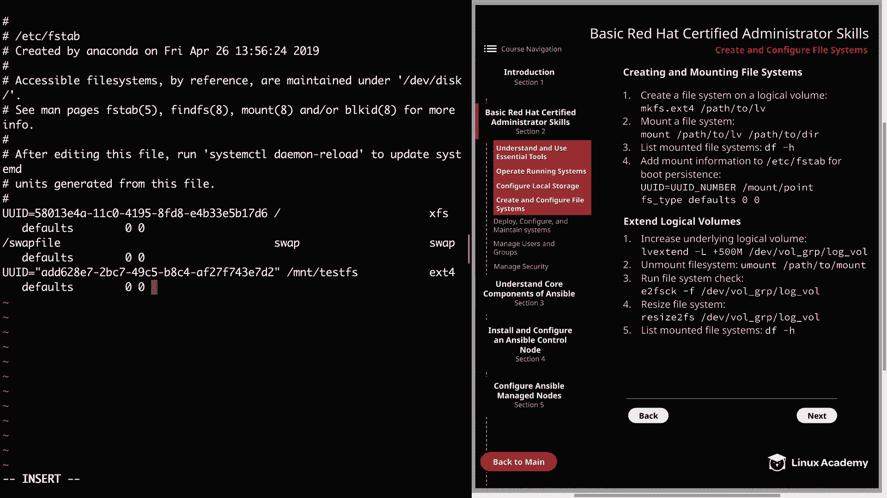

Let's go ahead and save that。And then we can unmount our file system。Mount test us。

Let's go ahead and check that again。And we see that we've removed them out。

Now let's go ahead and just type Mount dash A， and that's going to mount all those file systems in at CFFS tab。

SoNow let's run another Df dash H。And we see that our file system was mounted。

 So now if we reboot the machine， it's going to go ahead and read Efs tab。

 and it's going to mount our file system。 Well， now let's say that we would like to increase the size of this logical volume。

 So we need to extend it。 So in order to do that， the first thing we're going to do is run the LV extend command。

 So that's going to be LV extend。And then we need to specify the size that we'd like to extend it by。

And the dash L option is going to allow us to specify that storage。

 And you could also use the lowercase L for extents。 But let's go ahead and use the uppercase L。

 And then we're going to do plus 500 m。And that plus says that we'd like to increase the currently allocated amount by the size that follows the plus sign。

 So if we just put 500 m here， then it would change the size of our logical volume to 500 MBby。

 But what we're saying is we have a currently allocated 1 gig。

 And so now we're just going to extend that by 500 MBby。 So it'll be 1。5 gigs。 And then conversely。

 we can use the minus sign here if we would like to reduce the current size by a specific amount。

 So then we need to specify the logical volume that we'd like to increase。

I'm going to use dev Mapper and then test all， test LV。And we see that it was successfully resized。

And if we do a little listing of our logical volumes， we see that it's now 1。49 rather than one。

 let's go ahead and run a DF dash H。So when we run our DF。

 we see that we only have about a gig available。 So even though we've resized the logical volume。

 it hasn't translated to the actual file system yet。

 So we see that even though we've extended logical volume。

 it has not been applied to the amount of file system yet。 So in order to do that。

 we're going to unmount。Our Mount Tests file system。We see that we successfully unmounted it。

 and now we need to run our file system check。

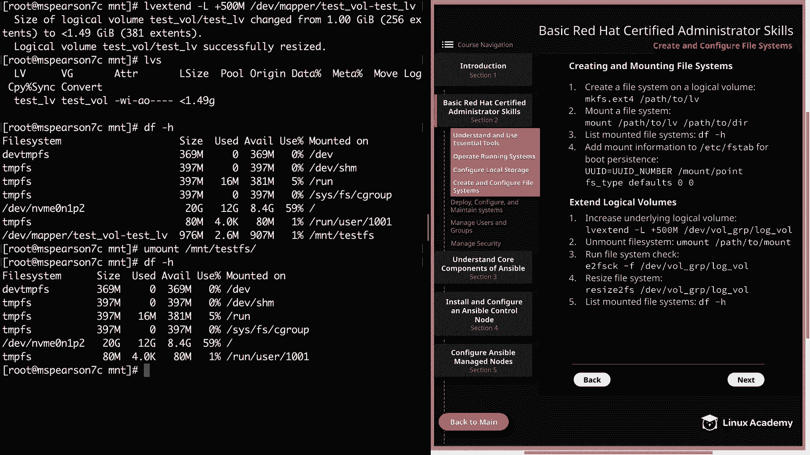

I'm going to go ahead and clear the screen here。And that's E2 FS check。Or going to do dash F。

And then the path to our logical volume。And notice here in the diagram。

 I use the device then the volume group name and then the logical volume name。

 you can also do it that way if you'd like， I'm just using dev Mapper All right。

 so let's go ahead and run that and our check finish so now we can resize the file system。

 so we'll use resize to FS and then again the path to our logical volume。

So let's go ahead and run this。And it lets us know that it has resized the file system。So as you see。

 we still have not mounted our file system， so let's go ahead and clear that。

And now we can just run our Mount dash since we have our entry and FS tab。And then R D F dash H。

 And as you can see， our Mount Testest directory now has 1。4 gigs available。 All right。

 let's go ahead and clear this out。

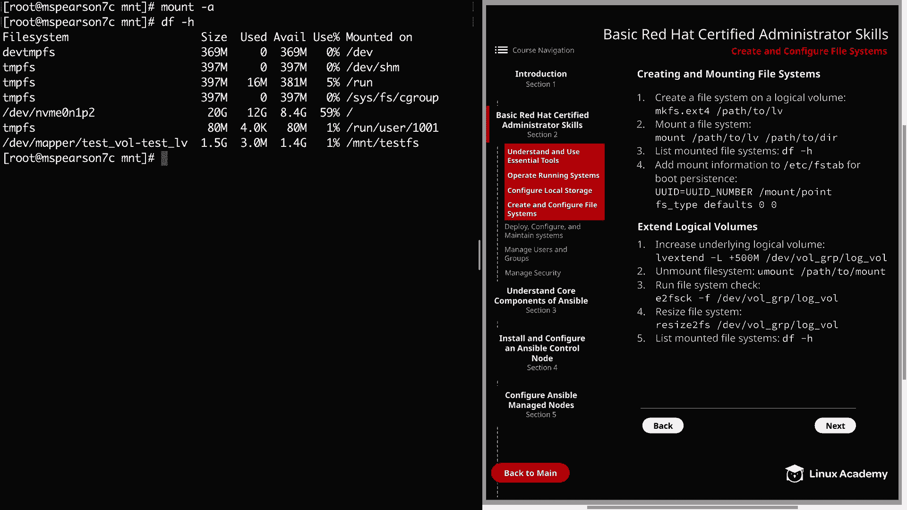

And now we can move on to our next page。So now we're going to walk through mounting a network file system and setting up the actual NFS server that's doing the export was outside of the scope of this video。

 but I've already gone ahead and set that up so that I can show you how you can mount it on a client machine So the first thing we need to do is install the required packages and that is NFS dash Us So we'll use yum install NFS dash Us。

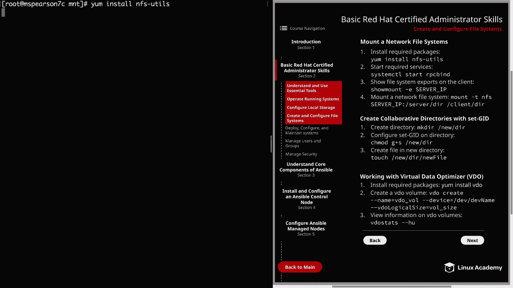

And this might take a second， so I may just go ahead and fast forward through so you don't have to wait。

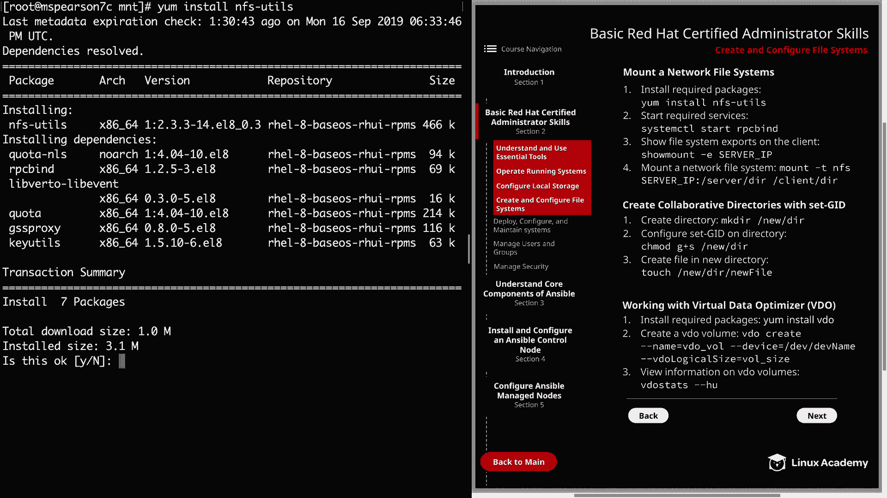

We'll go ahead and hit hit Y。

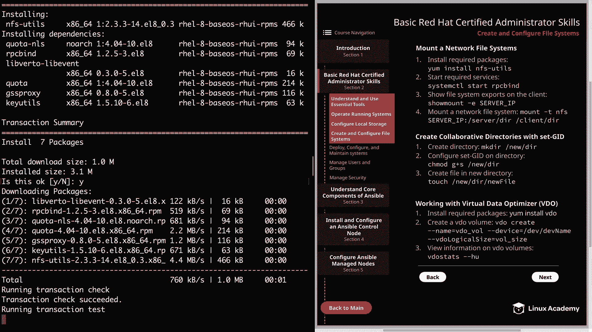

Well，That was actually a little faster than I thought。

So now we need to go ahead and run system CTL start and then RPC bind。

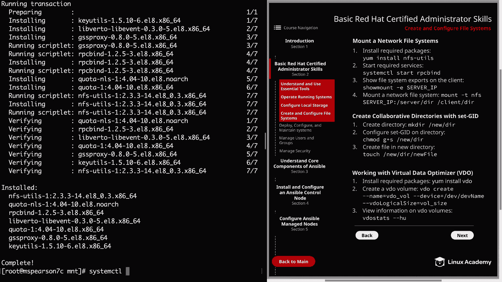

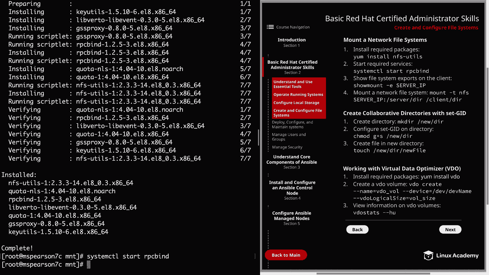

Go ahead and clear this out so we're not sitting at the bottom and now we can show the file system exports that are on the client machine。

 So for that， we're going to use show mount。Dash E。

 and then I'm going to go ahead and copy the IP address over here。

And this is the IP address of the NFS server。And then we see the export list。

 which shows us an export that is mount and FS。 So since we're already in the MT directory。

I'm going to go ahead and create another directory， and I'm just going to call it NFS。All right。

 now we'll clear。All， so now we're clear that。And then we can mount the network file system by typing in mount dash T。

 and we're going to specify NFS。And then our server IP。

Should luckily I already have copy to my clipboard here。And then the directory on the server。

 which is。Mount Nfs。That's actually the same only client because that's where I'm mounting it to。

 And that's going to be mount and F。All right， let's go ahead and do a Df。

And we see that we have mounted our network file system onto our client machine。And if we want to。

 we can go ahead and test out touching a file to that directory。

We'll go ahead and do touch mount NFS， and then we'll just do test。And as you can see。

 I was able to write to the directory。And just like our local file system that was mounted on our logical volume。

 if we want this file system to persist， then we need to add it into our EFS tab。

Again we can use E CFS tab。Head to the bottom， do a new line。 and we're going。

 we're going to do it the same way we mounted it here。

 We're going to put the IP address and then the path to the export。Just mount NFs。And then。

 of course， the mount point。I'm just going to put it up here so it kind of runs in line here。

Mount NFS， and then we'd specify。NFS is the type。Then again， we can use the defaults。

And then we can use just 0，0 for the checks。All right。

 so now that we've mounted up our local file system and our network file system。

 now we're going to create a collaborative directory using set GID。

 So the first thing we need to do is create a directory。 And since we're already in mount。

 let's go ahead and create a directory called Collab。And then we need to configure set GID。

 We're going to do that with CH mod。And it's going to be G plus S。Remember。

 this is a special permission and that's going to be on our collabab directory。

So we can do another listing。Collab。And we see the S right there and the group permission。

 indicating that the bit is set。And then I'm going to clear that。 And so just to。

 just to demonstrate this， I'm actually going to change the group of the directory。To the will group。

So we see that the user is root and the group is wheel on the Collab directory。

So now let's go ahead and touch a file。 So we're just going to call it test。

And then we can do a listing of the directory。And we see that the file has inherited the group ownership of the directory。

And so now any user that has right access to this directory， regardless of their particular group。

 it's all going to inherit that wheel group that we set using set GID。Allright。

 so the last thing we're going to talk about is the virtual data optimizer。

 and before I go over this short section， I just wanted to give a disclaimer that the two gig disks that are provided in playground。

 which we did the MVmeE1 in one。 and there's also another MVmeE， I think2 in one。

Are actually too small to create a video volume， so I'm not able to show that to you in a demonstration。

 However， there is a video that shows a demonstration on how to set this up in the RHCSA course。

 and there's also a lab that you can use to practice again within that course。So for this video。

 I just wanted to touch on the highlights。 So first。

 you can install video using yum installs video just like you would with any other normal package。

 and video also requires the Kmod dash K video package to be installed as well。

 but it's going to be pulled in as a dependency。 So all you have to do is yum install video to create the volume。

 All you have to do is video create then dash dash name and the name of the video volume。

And then dash dash device and specify the device name that you're gonna to use。

 and then video logical size and then the logical size of the volume。

 And this is the size that you actually want to present to the operating system。

 So say you're using a 50 gig disk。 you can actually make this present to the operating system as a 150 or 200 gig disk。

 And that's due to the fact that video is going to be performing deduupplication。

 which is going to take chunks of data that are similar and just store one copy of it。

 So the data is stored and then marked as duplicated and the original data is reference rather than just storing two copies。

 And this is why that even with a 50 gig disk， you're able actually to get up to 150 or 200。

 And the size that you're able to present is going to change depending on what type of data you're working with。

 But that's the general idea behind the virtual data optimizer。 Well。

 let's going finish up our lesson on create and configure file systems。

 So let's go ahead and mark it complete。 and we can move on to the next lesson。

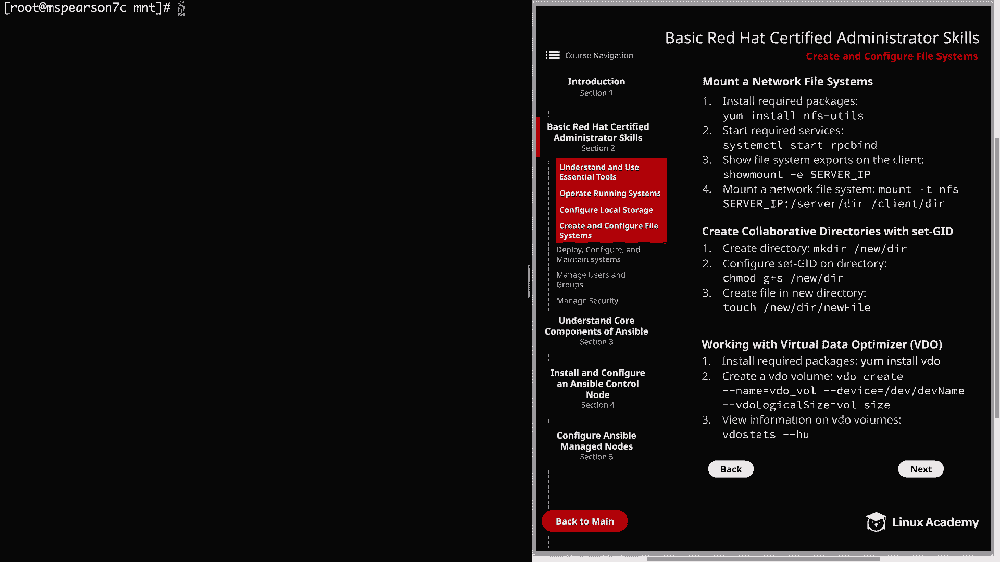