# RHCE 认证课程：P8：创建与配置文件系统 🗂️

在本节课中，我们将学习如何在 RHEL 8 系统上创建和配置文件系统。主要内容包括：在逻辑卷上创建文件系统、挂载文件系统、实现挂载持久化、调整文件系统大小、挂载网络文件系统（NFS）、使用 set GID 创建协作目录，以及简要了解虚拟数据优化器（VDO）。

---

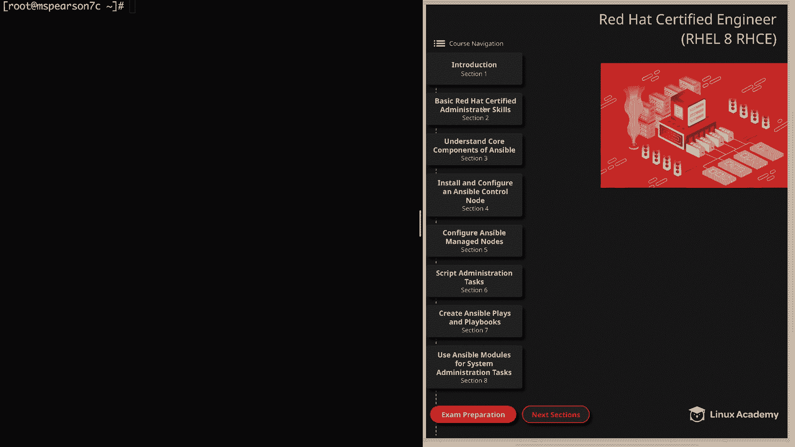

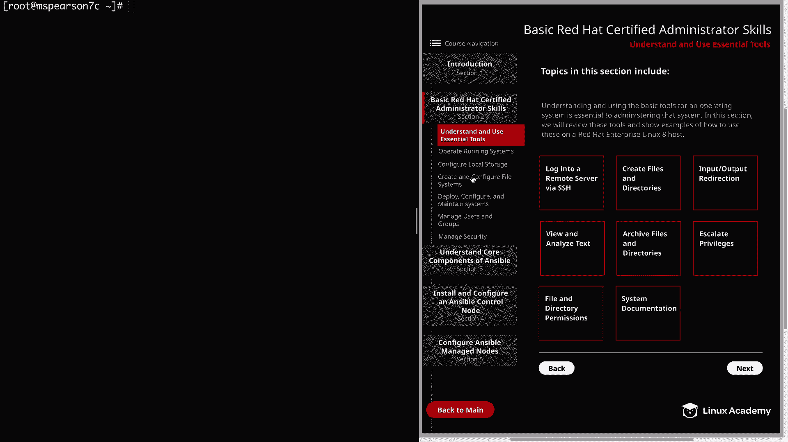

## 创建文件系统

上一节我们回顾了逻辑卷的创建，本节中我们来看看如何在逻辑卷上创建文件系统。

首先，我们需要使用 `mkfs` 命令在逻辑卷上创建文件系统。我们将使用 **ext4** 文件系统。

```bash
mkfs.ext4 /dev/mapper/test_all-testLV
```

命令执行后，ext4 文件系统即创建完成。

---

## 挂载文件系统

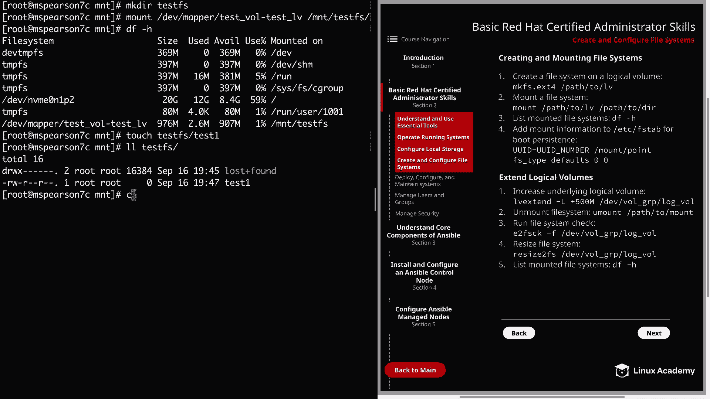

文件系统创建后，需要将其挂载到目录才能使用。

以下是挂载文件系统的步骤：
1.  创建一个挂载点目录。
2.  使用 `mount` 命令将逻辑卷挂载到该目录。
3.  使用 `df -h` 命令验证挂载。

```bash
cd /mnt
mkdir test_fs
mount /dev/mapper/test_all-testLV /mnt/test_fs
df -h
```

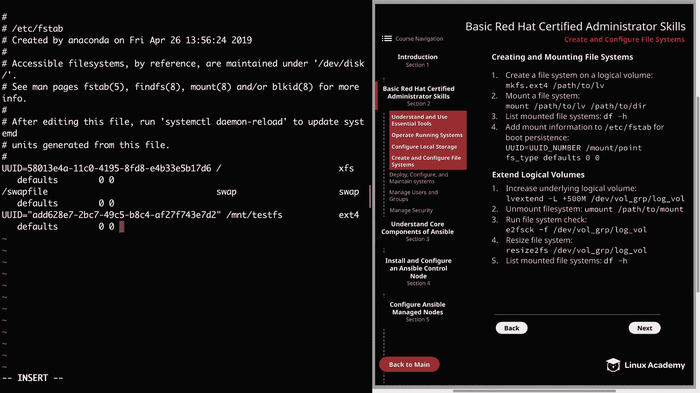

此时，文件系统已成功挂载。我们可以在 `/mnt/test_fs` 目录中创建文件。

```bash
touch /mnt/test_fs/test1
```

---

## 实现挂载持久化

目前，挂载仅在当前会话有效。系统重启后，挂载会消失。为了实现持久化，需要将挂载信息添加到 `/etc/fstab` 文件中。

首先，获取逻辑卷的 UUID：
```bash
blkid
```

然后，编辑 `/etc/fstab` 文件，在文件末尾添加一行：
```
UUID=<你的UUID> /mnt/test_fs ext4 defaults 0 0
```

保存文件后，可以测试配置。先卸载文件系统，然后使用 `mount -a` 命令挂载 `/etc/fstab` 中所有条目，最后用 `df -h` 验证。

```bash
umount /mnt/test_fs
mount -a
df -h
```

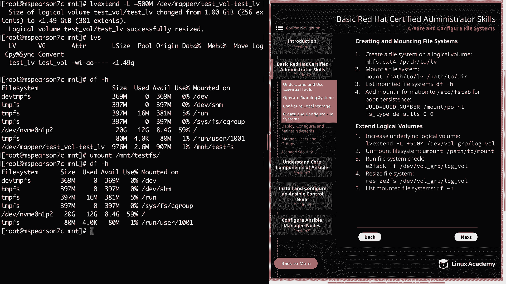

现在，即使系统重启，文件系统也会自动挂载。

---

## 扩展文件系统

当逻辑卷的存储空间不足时，可以对其进行扩展。这个过程分为两步：扩展逻辑卷，然后扩展其上的文件系统。

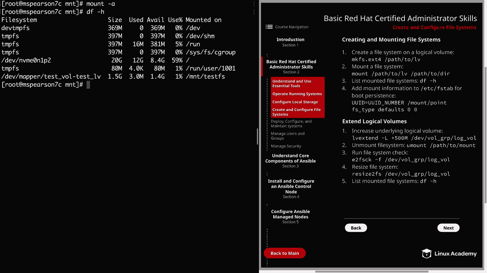

首先，使用 `lvextend` 命令扩展逻辑卷。例如，为逻辑卷增加 500MB 空间：
```bash
lvextend -L +500M /dev/mapper/test_all-testLV
```

此时，逻辑卷的物理空间已增加，但文件系统尚未感知到新空间。运行 `df -h` 会发现可用空间没有变化。

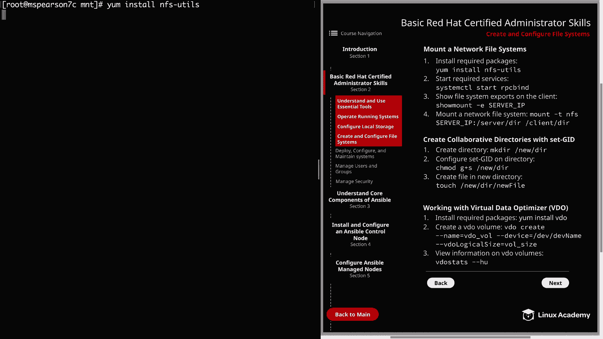

接下来，需要扩展文件系统本身。操作步骤如下：
1.  卸载文件系统。
2.  运行文件系统检查命令 `e2fsck`。
3.  使用 `resize2fs` 命令调整文件系统大小。
4.  重新挂载文件系统。

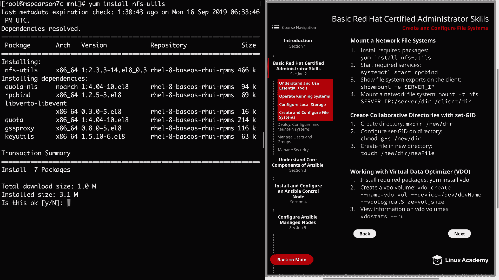

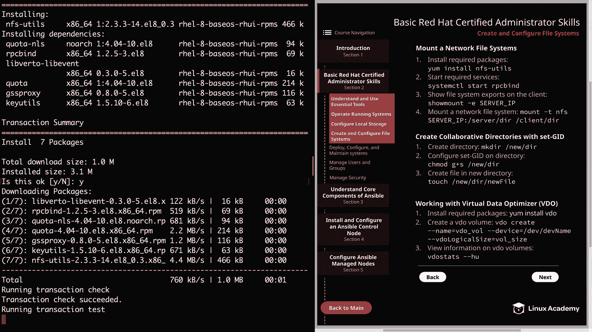

```bash
umount /mnt/test_fs
e2fsck -f /dev/mapper/test_all-testLV
resize2fs /dev/mapper/test_all-testLV
mount -a
df -h
```

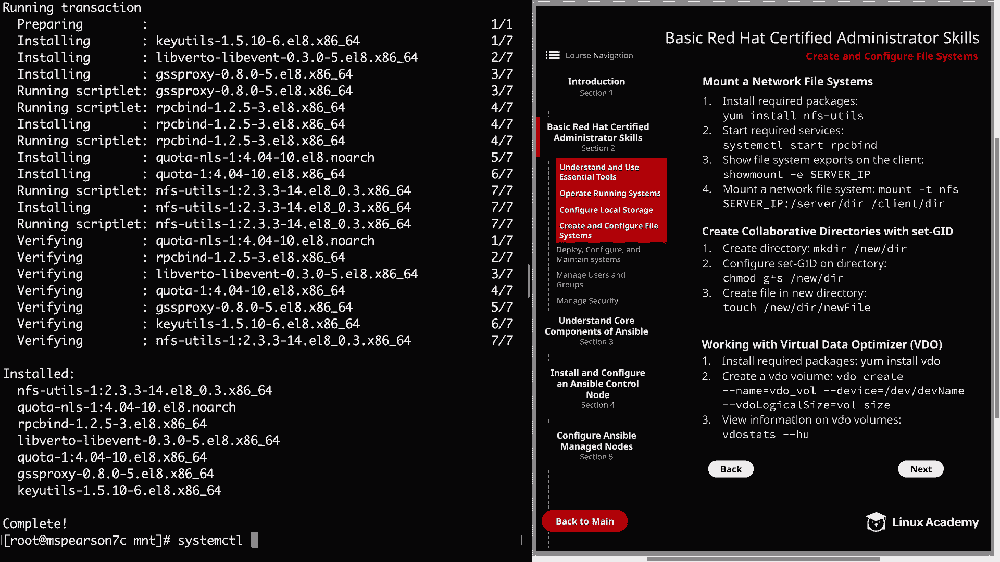

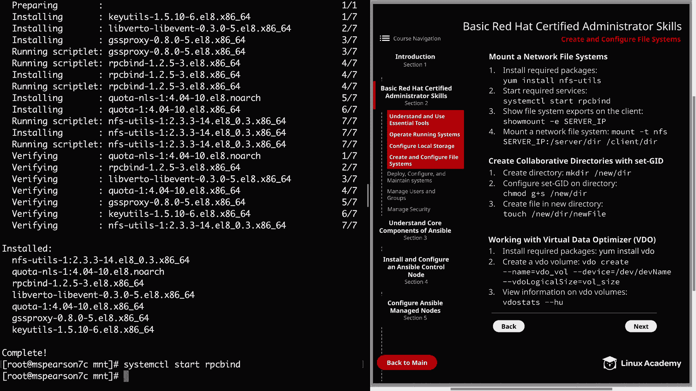

现在，文件系统的可用空间已经增加。

---

## 挂载网络文件系统（NFS）

除了本地文件系统，我们还可以挂载网络文件系统（NFS）。这允许客户端访问远程服务器共享的目录。

以下是挂载 NFS 的步骤：
1.  在客户端安装 NFS 工具包：`yum install nfs-utils`
2.  启动并启用 `rpcbind` 服务：`systemctl start rpcbind && systemctl enable rpcbind`
3.  查看 NFS 服务器上的共享目录：`showmount -e <NFS服务器IP>`
4.  在客户端创建本地挂载点目录。
5.  使用 `mount` 命令挂载 NFS 共享。

```bash
mkdir /mnt/nfs
mount -t nfs <NFS服务器IP>:/mnt/nfs /mnt/nfs
df -h
```

同样，若需持久化，需将 NFS 挂载信息添加到 `/etc/fstab`：
```
<NFS服务器IP>:/mnt/nfs /mnt/nfs nfs defaults 0 0
```

---

## 使用 Set GID 创建协作目录

Set GID 是一种特殊的目录权限。当对目录设置 Set GID 后，在该目录下创建的任何新文件或子目录，都会自动继承目录的所属组，而不是创建者的主要组。这便于团队协作。

创建和配置协作目录的步骤如下：
1.  创建目录。
2.  使用 `chmod` 命令设置 Set GID 位：`chmod g+s <目录名>`
3.  更改目录的所属组到一个公共组（如 `wheel`）。
4.  测试文件创建，验证其是否继承了目录的组所有权。

```bash
mkdir /mnt/collab
chmod g+s /mnt/collab
chgrp wheel /mnt/collab
touch /mnt/collab/testfile
ls -l /mnt/collab
```

此时，`testfile` 文件的所属组应为 `wheel`。

---

## 虚拟数据优化器（VDO）简介

虚拟数据优化器（VDO）通过**去重**和**压缩**技术，优化存储空间利用率。它能让一个物理磁盘呈现出比实际容量更大的逻辑空间。

VDO 的核心概念是：将相似的数据块只存储一份，并通过引用指向原始数据，从而节省空间。

由于实验环境的磁盘容量限制，此处无法进行演示。但了解其基本操作很重要：
1.  安装 VDO：`yum install vdo`
2.  创建 VDO 卷：
    ```bash
    vdo create --name myVDO --device /dev/sdX --vdoLogicalSize 200G
    ```
    其中，`--vdoLogicalSize` 指定呈现给操作系统的逻辑大小，可以远超物理磁盘容量。

VDO 的实际节省效果取决于存储的数据类型。

---

## 总结

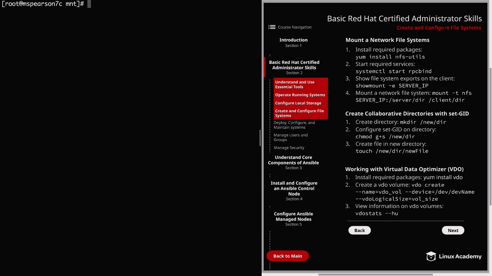

本节课中我们一起学习了 RHEL 8 中文件系统的核心管理操作。我们掌握了在逻辑卷上创建 **ext4** 文件系统、挂载文件系统并实现持久化、扩展逻辑卷和文件系统、挂载网络 NFS 共享、利用 **Set GID** 权限创建协作目录，并了解了 **VDO** 节省存储空间的基本原理。这些技能是系统管理员进行日常存储管理和配置的基础。