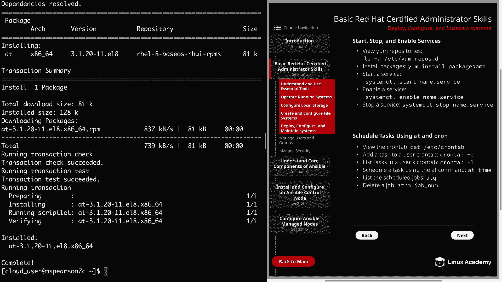
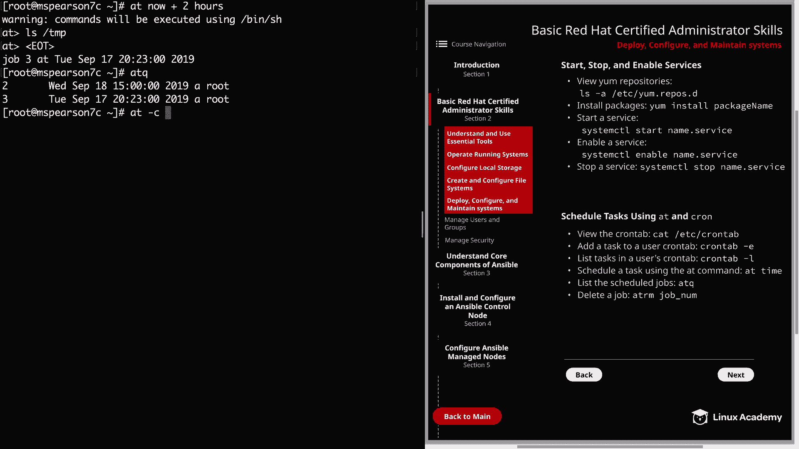

# Red Hat Certified Engineer (RHEL 8 RHCE) - P9：388-4867-6 - Deploy, Configure, and Maintain systems - 11937999603_bili - BV12a4y1x7ND

Welcome back everyone， This is Matt， and in this video we're going to be going over deploying。

 configuring and maintaining systems， and this is continuing our recap over the basic red Ha certified administrator skills。

 so let's click on Section 2。

And then we can head down to deploy， configurefi and maintain systems。

And the first thing I want to talk about is YM repositories。

 so in order to install packages to your system， you need to have a YM repository configured。

So let's go ahead and change our directory and go to Etsyyum。reos。d。

do a listing and all these reos are going to get pulled in by yum so you can put any new repositories in this directory。

 and then that will automatically be picked up。 So let's go ahead and look at Red Hat RHui do repo and we'll just walk through that a little bit together。

And I also wanted to note that it is really important that you are able to understand this file and are also able to reproduce it if given the required information。

 So let's go ahead and walk through this and we'll talk about the different directives。

 As you can see， initially， there's a title with a bracket。 and there's also another one right here。

And that's specifying a name of a repository。 So there's actually several in this particular repo file。

And iss important to note that this is the actual name under the repo。

 And then under this title name， we have a name directive。

 And this section is where we provide a description for the actual repository。Next。

 we have mirrorlist。And typically you're going to see base URL。

 and this is the URL to the actual repository。But mirror list is going to be used in the case that it can't connect to the base URL。

 So as you can see here， we don't even have a base URL They're just using mirror list and that also works as well。

Next， we have enabled。And it's very important to ensure that the repository using is enabled。

 and one， of course， means that it's going to be enabled and 0 means that it is not。

 And as you can see， we're looking at the Appstream RHUI Dbug R PMS。

 And for this particular repository， it's not necessary that it's enabled， but just as an example。

 that is how you would enable a repository one being enabled0 being not enabled。

And in the same way that enabled works， it's going to be the same for GPG check。

 So 0 means that it's disabled， and one means that it will be enabled。 And when GPG check is enabled。

 it's going to cause yum to do a GPG signature check。

 And then you can also specify the location of the GPG key。 And， of course。

 there are some other options that you can use when specifying your repository。

 But those are the main ones And I just want to hit on those real quick。

 So let's go ahead and back out of this。

And then I'll clear the screen。Now let's go ahead and actually install a package using yum。

 and it's actually one that we're going to need for this particular lesson and that is at。

 And that's because this image of Red Hat Enterprise Linux 8 does not have it installed by default。

 So we need to add it before we do that just going Cd to my home directory。

Then we can clear that out。 and let's go ahead and install the package using pseudo， yum。

 dash Y install app。

And this package is going to provide the add D service that we need to start and also enable。

Let's go ahead and clear this and to start that， we're just going to use pseudo， system CTtL。

Start and then add D。And we can check that as well， by doing a status。

And we see that it's active and running。So now， let's go ahead and do a。Enable。

So it's going to be system CTL enable at D。We can do another status and looking at the other status。

 I can see that it actually was already enabled， but that's okay because it's a good example to just show how you enable a service。

Let's quit out of that and then we can clear our screen。And if we need to stop the service。

 we can always perform a system CTL stop and then the name of the service。

 but we're going to leave that running as we'll be using it for the next topic。

And the next topic is scheduling tasks using at and Chron。

So sometimes it's helpful and necessary to schedule tasks to run on regular intervals。

 and in the same way， it may be important to schedule a task to run a single time in the future。

So in order to do that， we're going to be using Chron as well as at。

 So if you want to view the Chron tab。We can just do cat Etsyron tabab。

And you can see that it provides the format of the way that a Crron entry looks First。

 it's going to be minute， then hour， then day of month， then month， and then day of week。

 So after the date and time is specified， it's going to be followed by the username。

 And so that's going to be the user that you want to run the command。

 and then finally followed by the command that you want to be executed So we could just add an extra entry directly into the Crron tab and that command would run at the time that we specified。

And in addition to the Crron tab， we can also look in Etsy Ch。

I'll just tab that out so you can see the different directories。We have a Crron do D。

 which is very similar to the yum reos do D， so that's going to get pulled in and runs based on how you've configured it。

 but then we also have Crron monthly， weekly， daily and hourly。

 and so you can just add a script into those directories。

 and it's going to run based on that preconfigured time and in addition to those directories。

A user's contact can also be edited。By just typing Chron tabab dash E。

 And so that's going to put you into the user's Chon tab so you can add single entries。

 multiple entries。Any user has their own individual Chron tabab。

And then we can just go ahead and insert an entry in our Chron tab， and I'm just going to say。10。

 and then star， star， star， star。And then we'll say the cloud user。And then LS。 and this is just。

 I'm just doing this more for an example than actually for anything else。

 So we'll go ahead and save that out。And so it says installing the new Chron tab。

 and then if we want to list the user's Chron tab， we can just do Chontab L。

And that's going to show us all the entries that we've added into our Chron tab。

And if we want to delete that， we can just come in here。And just do a E。And then， save the file。

And before we move on to the ad command， I did want to mention that these user defined Chron tabs are going to be stored in varpopool Ch。

By their username。 And I get permission denied because the cloud users does not have the ability to view that。

 Let me go ahead and just run pseudo。And my profile that has L L alias does not get pulled in on a run Seto。

 So let's go back and try that one more time。We'll just do an LS dash L。

And we see that we have a single user to find Chtap for the cloud user。

 So let's go ahead and clear the screen。 I think I'm going to go ahead and switch to root。

Just to avoid the issues I've already had。So in addition to using the Chron tab to schedule tasks。

 we can also use the at command。And the syntax for this is pretty simple。

 you just specify at and then a space and then the time that you would like the command or commands to run。

 So let's go ahead and try that out now。 So if we type at and then let's just say 3 PM。

And then hit enter。It's going to put us into the app prompt， and then we can specify command。

 So let's just specify M Kder and we can make a directory in temp。 we'll just call test。

 Then we'll hit enter。And then I'll just exit the prompt using control D。

And then you can list the jobs by just running at Q。

And we see that we have a single job specified by the number two。

 and that's because I've already created a job prior to this video。All right。

 let's clear this out and then we're going to go ahead and add another job。For this time。

 we're going to use at and then now。And then plus two hours。And for this。

 let's just go ahead and do a listing on the temp directory。Then we hit control D。

And we see that this one is job  three from our@ Q。We see that we now have two jobs。

 and then if we run at dash C and then just specify one of the job numbers。

We get some information about the job as well as the command that's being run within the job。

So let's clear the screen， and then the last thing I'm going to show you is how to delete a job。

 and we do this with the at remove command or A RM。

So let's go ahead and run that now。 It's going to be。At R M， and then we're going to specify our job。

To add Q， you see that the job number two has been removed。 and if we'd like to remove the third。

You read it again。And we see that we no longer have any jobs in the IQ。Alright。

 so let's go ahead and clear the screen。 We're going to head over to the next page。

And now we can go over how to configure systems to boot into specific targets automatically。

 and this is very similar to what was the run level back in RE 6 and before， but starting in RE 7。

 they've moved to the specific target， so let's head over to the command line and in order to get the current configuration。

 we can just do system CTtoO， get default。And we see that our current default target is the multi user target。

 and this is a pretty standard target for just a server。

And if you want to list all the currently loaded target units。

 you can just type the command system CTL and then list dash units。

And then dash dash type is going to be target。And you can see that we have the multi user target loaded and active and the network target。

 as well as all these other targets that are in the list。 and down here at the bottom。

 it shows us that we have 23 loaded units， so it's just going to number all of those up。

 but you can also pass dash dash all in order to see the loaded but inactive units。

That was something I just want to show you real briefly。

 So we'll go ahead and clear that in order to change the current target。

 you need to run system CTtl isolate and then the name dot target。

 And keep in mind that this will change the current target。

 but it's not going to change the default target。 So if you reboot the host。

 it's still going to boot into the default target。 And you can always update the default configuration by running system CTL set default and then the name of the target。

The last thing I wanted to mention on this is the ability to boot into rescue mode。

 which can be important if there's issues on your system， and in order to do that。

 you just need to type in system CTtL rescue and one other notable target is the graphical target。

 So like I said， we're on a backend server command line here so multius is good。

 but if you're in a desktop environment you most likely are going to want the graphical target。

All right， so now let's move over to configure the time service client。

And this can be really important when you're needing to keep several servers in sync according to a specific time and a specific time server。

 So in order to do that， we need to install croning。

And it looks like we already have cronny installed。 So that's good。

Older versions of red hat used N TP， but cronny has now kind of become the de facto standard。

 So in order to start up that service and enable it， we can just run a system CTtL start cronny D。

And then if you want to run it in line， you can just add the and and and then system CTL enable Chony D。

And then we can check that with our system CTL status。

And our service up and running and enabled。

Go ahead and clear out of this。And then we need to add the NTP server address to the Ch configuration file。

 and that can be found in Etsy。

Cronny。t com。There are， of course， a bunch of different configurations and parameters。

 and we're not going to go through those in this lesson。

 I just mainly wanted to make you aware of this file and what would need to be done in a basic setup of cronny。

And then of course， if you want to restart the Cronny service after adding some configuration。

 you can just do system CTL， restart Cony D。Well， it's going to finish up this lesson on deploy。

 configure and maintain systems， so let's go ahead and market Comp and we can move on to the next section。

