# RHCE 认证课程：P9：部署、配置与维护系统

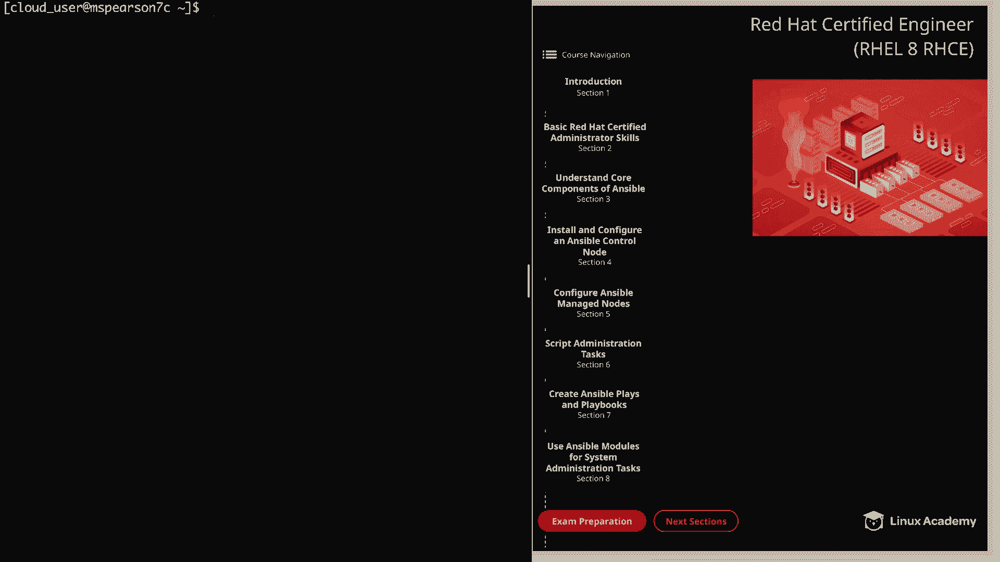

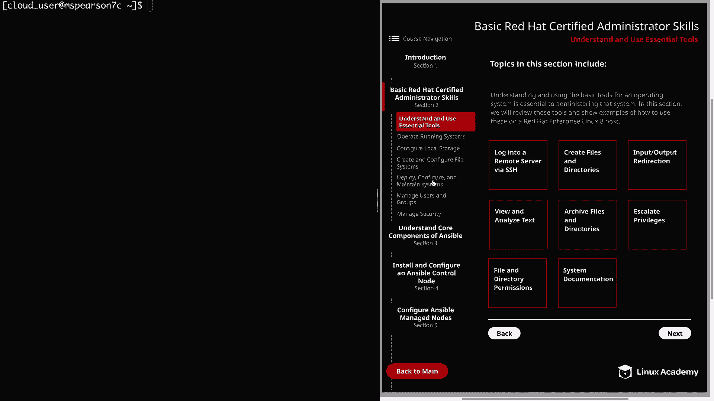

在本节课中，我们将学习如何部署、配置和维护 Red Hat Enterprise Linux 8 系统。主要内容包括配置软件仓库、使用 `yum` 安装软件包、管理服务、使用 `at` 和 `cron` 调度任务、管理系统启动目标以及配置时间同步服务。

---

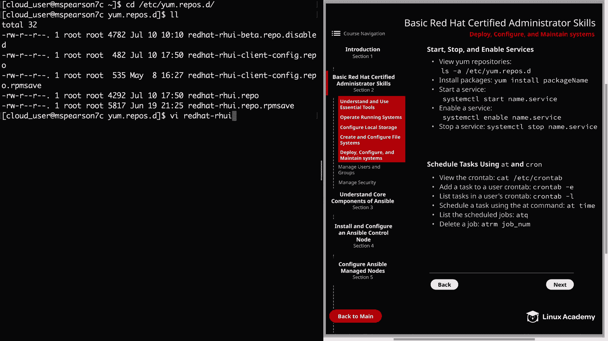

## 配置 YUM 软件仓库 🗂️

为了在系统上安装软件包，需要配置 YUM 软件仓库。所有仓库配置文件都位于 `/etc/yum.repos.d/` 目录中，YUM 会自动读取此目录下的所有 `.repo` 文件。

以下是查看和分析仓库配置文件的步骤。

1.  切换到仓库配置目录：
    ```bash
    cd /etc/yum.repos.d/
    ```
2.  列出所有仓库文件：
    ```bash
    ls
    ```
3.  查看一个具体的仓库文件内容，例如 `redhat.repo`：
    ```bash
    cat redhat.repo
    ```

理解仓库配置文件的结构至关重要。一个典型的仓库配置包含以下主要指令：

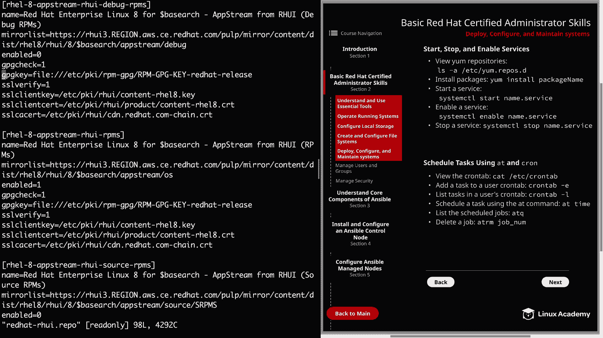

*   **`[repository-id]`**： 仓库的唯一标识符，用方括号括起。
*   **`name=`**： 仓库的描述性名称。
*   **`baseurl=`** 或 **`mirrorlist=`**： 指定软件包的实际下载地址。`baseurl` 是直接地址，`mirrorlist` 是镜像列表地址。
*   **`enabled=`**： 控制仓库是否启用。`1` 表示启用，`0` 表示禁用。
*   **`gpgcheck=`**： 控制是否进行 GPG 签名校验以验证软件包完整性。`1` 表示启用，`0` 表示禁用。
*   **`gpgkey=`**： 指定用于校验的 GPG 密钥文件位置。

---

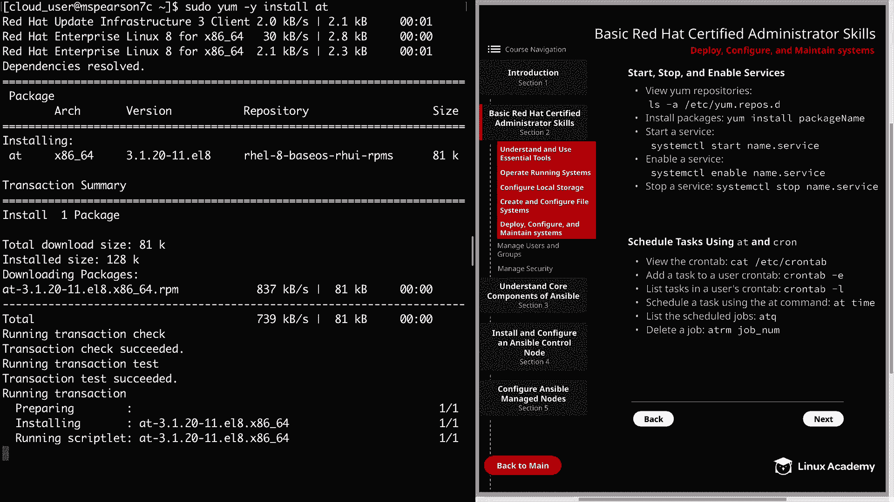

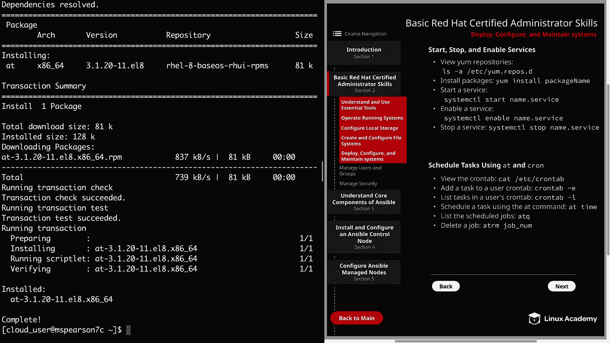

## 使用 YUM 安装软件包与管理服务 ⚙️

上一节我们介绍了软件仓库的配置，本节中我们来看看如何使用 `yum` 安装软件包并管理系统服务。

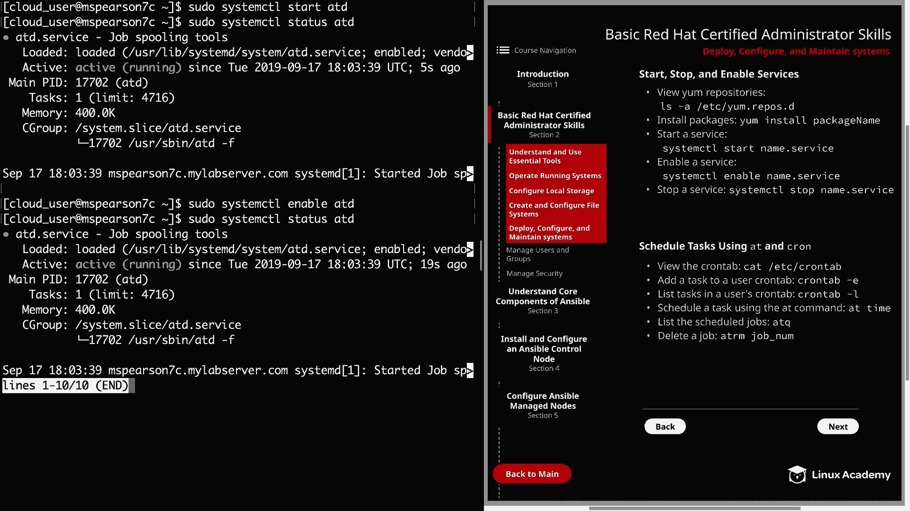

首先，我们安装一个名为 `at` 的软件包，它将为我们提供 `atd` 服务。

使用以下命令安装 `at` 软件包（`-y` 参数表示自动确认）：
```bash
sudo yum -y install at
```

安装完成后，我们需要启动并启用 `atd` 服务。

以下是管理服务的基本命令：
1.  **启动服务**：
    ```bash
    sudo systemctl start atd
    ```
2.  **检查服务状态**：
    ```bash
    sudo systemctl status atd
    ```
3.  **启用服务（开机自启）**：
    ```bash
    sudo systemctl enable atd
    ```
4.  **停止服务**：
    ```bash
    sudo systemctl stop atd
    ```

---

## 使用 at 和 cron 调度任务 ⏰

有时需要安排任务在特定时间或定期运行。Linux 提供了 `at` 和 `cron` 工具来实现任务调度。

### 使用 cron 调度周期性任务

`cron` 用于调度周期性执行的任务。系统级的 `cron` 配置位于 `/etc/crontab` 文件，其条目格式如下：
```
分钟 小时 日 月 星期 用户名 要执行的命令
```
此外，还有预定义的目录（如 `/etc/cron.hourly/`, `/etc/cron.daily/`）可以放置脚本。

每个用户也可以拥有自己的 `cron` 任务表。

以下是管理用户 `cron` 任务的方法：
1.  **编辑当前用户的 cron 任务**：
    ```bash
    crontab -e
    ```
2.  **列出当前用户的 cron 任务**：
    ```bash
    crontab -l
    ```
3.  **删除当前用户的所有 cron 任务**：
    ```bash
    crontab -r
    ```

用户定义的 `cron` 任务文件存储在 `/var/spool/cron/` 目录下，以用户名命名。

### 使用 at 调度一次性任务

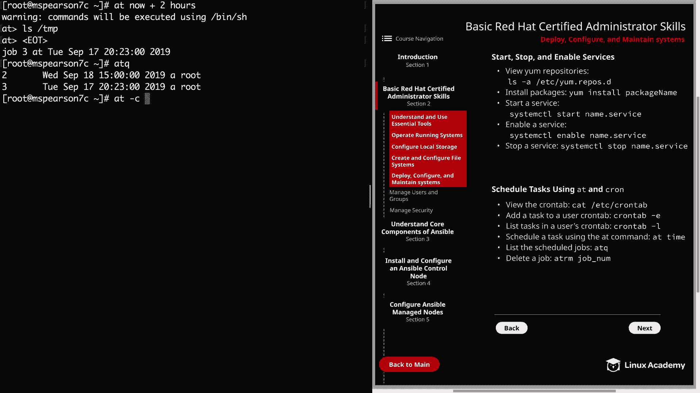

`at` 命令用于安排任务在未来的某个特定时间点**仅运行一次**。

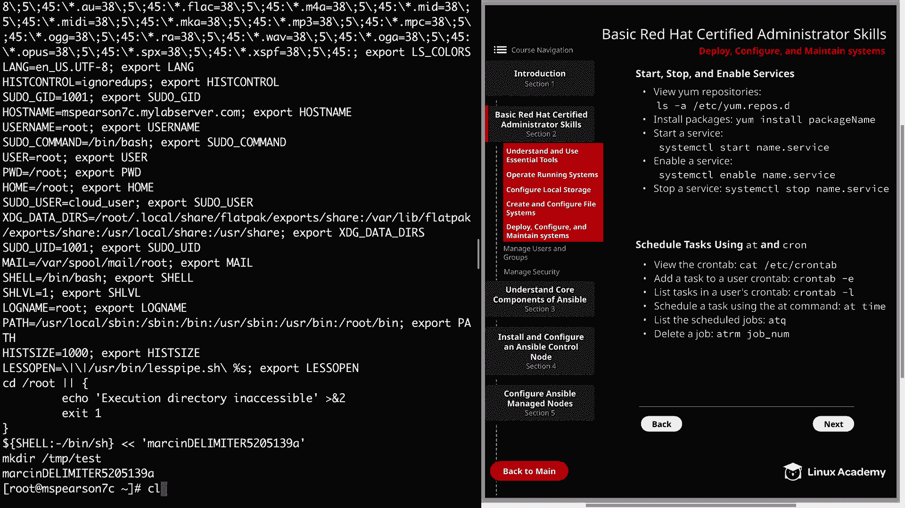

其基本语法是 `at [时间]`，然后输入要执行的命令。

以下是 `at` 命令的常用操作：
1.  **安排一个任务**（例如在下午3点）：
    ```bash
    at 3pm
    # 进入 at> 提示符后，输入命令，如：
    at> mkdir /tmp/test
    # 按 Ctrl+D 结束输入
    ```
2.  **安排一个任务**（例如2小时后）：
    ```bash
    at now + 2 hours
    ```
3.  **列出等待执行的 at 作业**：
    ```bash
    atq
    ```
4.  **查看特定作业的详细信息**（例如作业号2）：
    ```bash
    at -c 2
    ```
5.  **删除一个作业**（例如删除作业号2）：
    ```bash
    atrm 2
    # 或
    at -r 2
    ```

---

## 配置系统启动目标 🎯

在 RHEL 7 及更高版本中，系统使用“目标”来替代旧版本的运行级别。目标定义了系统启动后应进入的状态。

以下是管理系统启动目标的相关命令：
1.  **查看当前默认启动目标**：
    ```bash
    systemctl get-default
    ```
2.  **列出所有已加载的目标单元**：
    ```bash
    systemctl list-units --type=target
    ```
3.  **临时切换到另一个目标**（例如切换到图形界面目标，但这不会改变默认设置）：
    ```bash
    sudo systemctl isolate graphical.target
    ```
4.  **设置默认启动目标**（例如设置为多用户文本模式）：
    ```bash
    sudo systemctl set-default multi-user.target
    ```
5.  **进入救援模式**（用于系统故障修复）：
    ```bash
    sudo systemctl rescue
    ```

---

## 配置时间同步服务 🕐

保持服务器时间同步对于日志记录、认证和分布式应用至关重要。在 RHEL 8 中，使用 `chrony` 作为时间同步服务。

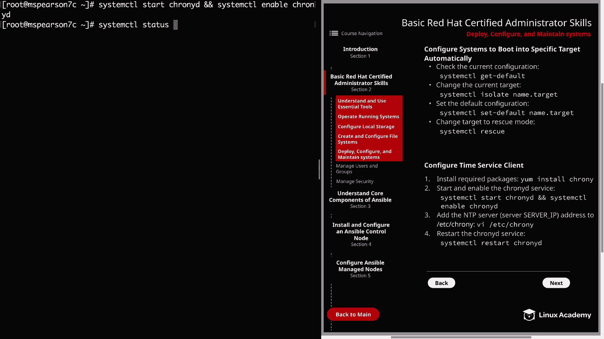

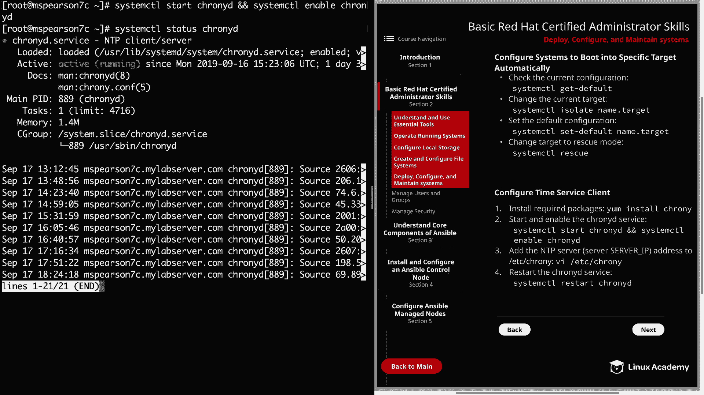

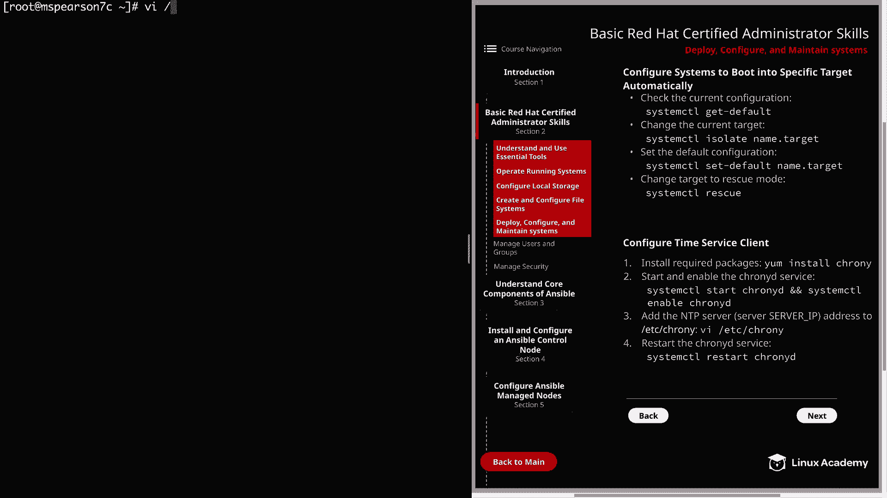

以下是配置 `chrony` 客户端的基本步骤：
1.  **安装 chrony 软件包**（通常已预装）：
    ```bash
    sudo yum -y install chrony
    ```
2.  **启动并启用 chronyd 服务**：
    ```bash
    sudo systemctl start chronyd
    sudo systemctl enable chronyd
    ```
3.  **检查服务状态**：
    ```bash
    sudo systemctl status chronyd
    ```
4.  **配置 NTP 服务器**： 编辑配置文件 `/etc/chrony.conf`，添加或修改 `server` 指令指向可用的 NTP 服务器。
    ```bash
    sudo vi /etc/chrony.conf
    # 例如添加：server pool.ntp.org iburst
    ```
5.  **修改配置后重启服务**：
    ```bash
    sudo systemctl restart chronyd
    ```

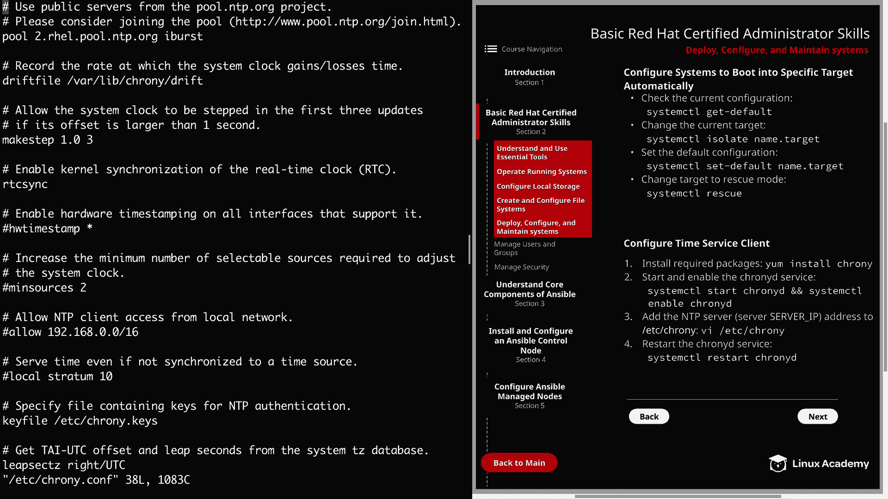

---

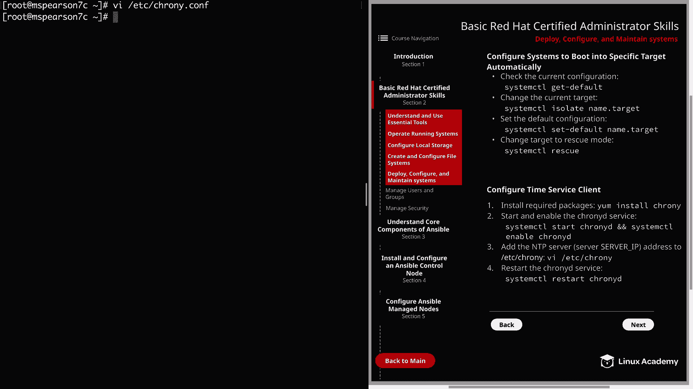

本节课中我们一起学习了 RHEL 8 系统部署、配置与维护的核心技能。我们掌握了如何配置 YUM 仓库以获取软件、使用 `systemctl` 管理服务、利用 `at` 和 `cron` 灵活调度任务、通过“目标”控制系统启动状态，以及使用 `chrony` 确保时间同步。这些是系统管理员日常工作的基础，对于通过 RHCE 认证和进行有效的系统管理至关重要。