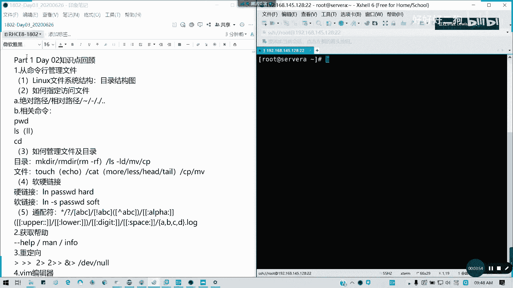

# Redhat红帽 RHCE8.0认证体系课程 - P12：12_Video_Day03_Day02课程回顾 - 好好好二狗 - BV1M3411k77W

在录屏啊，呃欢迎大家到我们第三天的课程，我是小陆师兄啊，然后呢刚才说了，如果前两天没有kg没有就缺课，刚加进来啊，就是说前两天的课没有补到，同学麻烦看一下我的公告啊，群里面的公告有网盘链接，有视频对吧。

视频我已经前两天已经全部传上去了，这两天传上去，然后讲的比较完整啊，呃就把我们先不用那个练习，那官方文件，甚至我ensable的话，我也可以不用官方网镜，我告诉大家，因为我现在我会。

我可以搭一套玩具给大家都没问题，只不过不是虚拟机里面而已，就是我们几台物理机，然后通过对吧，从一开始就说独立的，然后做成一个受苦的主机，这样子都可以对，到时候我们第十天，第九天，第十天我会告诉大家。

我们课程呢现在发生了新的调整啊，就是考前辅导员从原来一天变为两天，其他的没有变啊，下面有变课程的体系的话，按照我讲课的实际做了调整，对还加了两块，我们在书本里面没有，但是七里面有的内容，而且非常实用。

比如说你我们的链路聚合，也就是双网卡绑定，这个的话企业是非常用非常多，但是我们现在八里面压根没讲这回这门课啊，没讲这个在七里面的h c是有的，然后还有一个就是我们经常用到的阿帕奇，我们的web服务对吧。

虽然现在用engines用的多对吧，用的多，但是阿帕奇还是基本的，因为我们在ensable里面，我们很多的案例都会用到它啊，都用到它这一块，在八里面你们书里面应该看不到的，对不对，考试也有一道题。

在cc里面也是考的web对c一是五道题，在cc缩成一道题，但是如果不讲的话，大家我怕会生疏，所以的话我在d在第五天啊，第四就是说可能下周日还有那个第九天的时候，我会讲增加这两块内容真的快。

内容这个这个我觉得是有必要的，也是这是我就是我这我自己啊，作为讲师上课的时候，我作为一个特色的部分啊，然后然后这shell呢就是在下下周讲shell的话，我要讲一天啊，差不多3/4到一天excel的话。

虽然考试就好像我看到很奇怪，八的题目没考脚本，但是我们现实中用的太多了对吧，所以这个还是有必要讲，有必要讲，然后给大家做一定的练习，练习，我一大堆啊，然后呢我们说这么多废话。

待会我们在课间代理一个投票的事情啊，到时到二维码我可以肯定放出来啊，希望大家多支持啊，毕竟现在你知道在腾哥做讲师的话，真的只会讲课是不行的，还会聊天，还会练会聊天，还会调气氛，还会唱歌。

我还演过舞台剧啊，在8000人的舞台上我都演过啊，真的对啊，这大镁光灯打下来，真的你下面说看不见，就看听到一大片的荒芜生掌声，对不对，主年会主持有做过，你看现场我们也有多才多艺的人能秀啊。

到时希望明年真的好声音就能够一起来好吧，然后呢技术的摆摊还是有技术，对你没两门课，你摆个摊也是跟人家讲讲红帽是吧，讲讲系统的话，根本人家不会听你的，对不对，然后我们摆摊的时候还要录另一个手机在这里。

对不对，来来来是吧，来给我刷个飞机，火箭大炮来哈，但是你没有才艺的话，谁去理你，对不对，好，所以的话我们言归正传啊。

待会然后大家稍微休息，先复习啊，对给他15到十分钟消化消化，然后我们今天讲七到11章啊，我们先回顾一下我们第二天讲什么内容。

第二天我们第三章，对不对，我们第二天讲3~6。

大家希望跟上来哈，第三章从命令行管理文件，首先我们是不是在开篇的时候，讲了一个文件系统结构对吧，linux的文件系统能力怎么排列的，它是一个倒数倒插倒置的一个塑形，然后从根目录开始一级级目往下分。

对不对，然后我们还讲了一些重点目录里面到底是什么，用，像我们的unit软件资源u s r是吧。

然后我们的设备目录d e v对不对。

我们的配置文件目录etc，还有我们的日志，或者是一些啊像数据库等等这些存放目录vr。

对不对。

还有第三方软件o t对不对，还有我们的引导内核引导的不对吧，mt挂载对不对，as being跟being呢是指可执行文件存放的目录，就是内置的啊，就我们常见的可执行文件存放的目录，对不对。

还有一个是什么呢，嗯我想想还有一个是呃像bot刚才讲了啊。

还有哦加目录对不对，root加目录就是groot，对不对，root加目录就groot，然后那个我们现在p w d加root项目是这个啊，对吧，那我们如果是普通用户的家目录的话，是不是这些啊对吧。

大家把机器打开了啊，就是说我们上周装的机器打开来啊，像这我们的家目录对吧，就一直加木，然后它里面是有什么呢，环境变量，还有特殊的一些命令的别名，等等啊，所以这个大家知道目录怎么用。

我们才才知道后面后面才知道怎么放。

对不对，有些人管理就乱七八糟，还有两个就是内存映射到磁盘里面。

它本身不占硬盘空间的两个目录，一个是pro进程process，对不对，还有一个就是cs，它是一个相当于process这个目录的一个整理，对吧整理，所以我们平常如何我们查看我们的内存跟硬盘，cpu啊。

不是cpu跟内存的信息，是不是通过通过那个proc目录去获取，像cpu info啊，m for，对不对，你要自己得了啊，这是第一个，我们就讲到这第一第一第一小点啊，明白了六点，如何指定房屋文件。

我们讲了好几个东西，第一个绝对路径也就是完整的从根目录一开始，一级一级往下，就类似于我们从我们在windows里面c盘，我的电脑就c盘，然后是吧，windows mod等等等等下去，这些就绝对路径。

相对路径的就是你当前的路径，开始一级一级往下升对吧，波浪线压目录对吧，一横杠上一级目录点，当前目录点点上上一集，他应该是不清上一次访问的目录才是正确的哈，上一次访问目录才是正确的，这个有没有问题。

相关入境有问题及时在群里面提啊。

及时在我们的qq群里面提啊，然后呢相关的查看路径命令。

像我们p w d刚才说的啊，p w d查看当前路径，然后l l是吧，ios杠l啊，如果我们在s5 里面不能打s两个l，因为它是一个别名啊，还有cd切换目录，这个都懂，然后呢如何管理文件目录。

像目录的创建，删除查属性，移动或者改名复制文件的话就也是如此啊，文件也是如此，同样的操作，但是不要再给我犯这个错误哈，很多人还是念念不忘，从入门到入狱啊对吧，这个错误千万不要弄啊。

因为这三个命令上次我问过你们区别的，而且有什么安全措施，你们自己在企业里面都有啊，包括像日志审计是吧，运运维审计也就堡垒机这些，还有包括安全系统的最小权限等等，这些都会跟你们弄得。

帮你们安排的明明白白的啊，所以的话这一块的话，真的如果一个新人进去把一台机搞垮，就像最近get up对不对，就那个是离职删的数据被判1年六个月，对不对啊，上次那个微盟不是直接搞垮了吗，所以这种事情的话。

千万不要干，我们是一个守法合格的好公民啊，如果大家在座，可能有些不像我这样，就是有些人可能没有入党或这样的话，至少也是个公民对吧，也是一个合格称职守法的公民，所以的话真的不要乱搞这些事情。

有时候真的一手残成千古恨啊，你倒是名名声啊，名誉啊，什么你的技术全部毁于旦啊，所以特别包括像考试啊，我特别怕那些是前面没学习，然后看了别人的，然后乱乱搞瞎搞，我之前有一个学，就是这样，现在我都想。

我们都想劝他说，你赶紧回炉重造吧，他又为的是他就为了快对吧又快，然后就直接报考前辅导，然后之前什么基础都没有，然后问问题一堆，然后有时候要乱操作，对不对，有时所以特别啊在我讲的课里面。

不希望看见这种事情，因为我相信我讲，我的学里面的通过率还是有保证的，没有80%，有60%，所以的话先看操作之前，现在想想我为什么这么做，我这么做的目的是什么吗，有什么风险对吧。

多次审核至少两次才把回车键按下去，对包括企业是一样，我们企业是不是写配置变更啊对吧，写配置变更写人那些对吧，一开始你要打方案，打预案，应急预案，对不对，任何的一个差不多的写预案，然后你有你有那个目的。

你的够你的操作方法你要怎么验证，然后发现错误的怎么回滚对吧，还有一些相关的备注信息，还好还有一些你至少不会，你旁边还有个老司机，对不对，但千万不要一个人就这样直接搞啊，特别是我很怕那种转的，我的天。

我之前我也犯过错，曾经就直接把把那个存储的链接给解了都有，然后做业务做到五个小时，或者是说或者是说那个装虚拟机，那个学区不稳定，结果杀毒软件发射时候，整个集群挂掉了都有对吧。

有时候真的一个一个点击的操作，真是你，你影响就一大片，人家分分钟特别是那些做贸易，做外贸的是吧，都是做金融，这些分分钟正数以万计的，数以万，几10万几百万的一个是吧，半分钟给亚马，给宝马车走了吧。

所以所以就非常的危险啊，特别是现在你们的练习环境，你们可以乱搞，但是其实麻烦你们三思好吧，顺便说这一点哈，就刚才刚才说的i m gf特别要注意哈，我们增加你没问题，所以只要删的话特别注意对吧。

通常删除的话。

你要特别是你要做个东西的话，通常像我们的话是要上一级上上级的领导审批。

因为他也是要懂技术的，他要知道这个风险，如果真的有问题的话，他可以帮你背书，对不对，所谓的背书就是知道什么意思吧，帮你分担分担责任啊，就他至少会知道怎么跟我们客户对吧，我们内部也有誉。

为我们内部也有客户端，我们内部相当于是乙方，对不对，然后我们对吧，所以的话有问题，他可以帮你去单分担一部分，而不是如果你真的搞错什么了，而且你在做做错之前呢对吧，如果说不不明白。

及时节就在企业里面及时打八个对吧，跟领导请教，打及时打报告，我要说发生错误的时候才打，已经晚了，发生错误没马上不要说，到时候你自己爱惨了自己，怎么我敲出的命令是要把所有都删了，怎么办，我要救救救晚了。

因为客因为客户已经发现问题了，已经差已经没得救了好吗，像我已经，我之前我在2年前我就被困户绩效的对吧，1年绩效人家拿奖金拿100%，我拿50%，就是这样对吧，每个月少拿人家几百块钱，就是这样的。

所以的话特别小心，同意的话，在群里面打个y哈，这个我特别提醒啊，特别是你们刚初学的，不要贸贸然去生产环境做任何操作对吧，学懂再说，至少持证上岗嘛，对不对，其实镇上岗这个有很有必要啊。

如果如果真的我怕很多人很危险的。

无论男生女生，就是我这里班，这个班好像加入了。

好像昨天才加入一个女女学员哈，就234个学员，就特别是女生的心思应该比男生会缜密一点，男生有时候真的很大条，对不对，真的非常危险，又不是你，你也就类似于我举个例子，你在机房你敢直接趴总闸吗对吧。

那直接拔网线吗，你在你你师傅要不要再加试一下，绝对很多电器的话肯定会烧的，对不对，就类似于这样是吧，安全现在叫安全生产，对不对，包括信息安全，网络安全，什么什么安全对不对，用电安全及防安全。

什么都有都有一都有规章制度，然后有些人就像进机房一样，直接斜就踩进去都有的，没登记鞋都踩进去，然后你操作也不带那些绝防静电手套，或者是那个套房间的手环，直接就上阵这么操作，然后也然后如果像服务器是吧。

你们应该有个习惯，就你们进机房上服务器的时候，应该如果服务器通的电，你要打ud灯，对不对，前后标识或贴，如果没有ud，贴张纸，贴个纸条，前后贴个纸条证明，或者是把它稍微拉出来，但不要弄到线对吧。

证明你是操作待机没有问题，而且你需要确定你的业务是停止的对吧，或者是已经迁移出去了，你才能做操作，不然的话风险非常大对吧。

说了这么多废话，但希望大家都能明白，能清楚啊，真的怕出问题啊，不过到到此出去之后，哎不小心按gf少个点是吧，然后就就问谁招了腾科的肖老师或者小陆师兄，那我不是死了吗对吧，我们从来没有单把握教过这个了哈。

这个我不知道是谁，就有些人确实我看过是什么，差不多的对吧，然后恢复恢复对吧，我干了差不多将近九，我9年多的运维经验，这些东西都不是盖的，就我跟那些纯在学校教书的老师不一样，讲师不一样。

我是有体验约经验的人，所以我也吃过很多的苦头，对不对，所以的话把希望大家不要走我以前的路啊，你前路，而且而是要做每件事的话认真思考，对不对，这只是我在运维方面，因为你问开发，他开发他不会打你的。

因为开发就是他在他就是管杀cl代码，实现功能就行了，他不管里面有个bug对吧，有没有说漏洞或者怎么样，会造成什么后果，他不管的对不对，通常来说开放的思维是这样，运维的话真的是吧，在所有里面我们叫什么叫。

因为运维工程师有个名字叫做背锅，工程师有什么问题，运维背锅的对不对，从机房设基础设施，一直到你的应用层，对吧，一口黑锅在背着呢对吧，无论产品自己什么都怼你，对不对，但是其实对啊，背锅侠没有错啊。

但你做键盘侠你又做不了，因为你说不过别人对吧，有项目经理产品竞争，你是对吧，有问题就是运维的事对吧，然后那有然后最辛苦的是运维，对不对，说的问题你在这里不用睡觉了，对吧对啊，因为啥问题。

重点我从技术知识做过来，我就知道了对吧，有什么问题，客户就直接怼你了，然后半夜叫你重装一个云主机，我都试过的，我在我工作早期，我上夜班的时候，真的你知道那时候我是心里他他他他妹的不爽，对不对对吧。

很正常，这里开发你不能做长久啊，开发你不能做长久，因为做了之后真的白头发了，入门可以做长久，项目经理管理类可以做长久，但是如果你要管理的技术要过硬，对不对，很多人都想当老板，都能当主管，都能当经理。

但是你的首先你的技术要过硬啊，你一个什么都不懂的，就像一开始这样，一开始那个我们疫情肺炎疫情刚开始的时候，你看那个湖北那个武汉的一个卫健委主任是吧，啥都不懂，对不对，这样阵容就是你的经验的缺失了。

懂我意思吗，我希望我带着经验来给大家讲课，但是大家请听，好好记好，这些的话我不会在笔记里面呈现，因为也不是笔记里面我该说的那种，但这些的话我觉得我作为一个音乐工程师，作为一个it人。

我必须得把这个给大家说，因为很多人真的是刚毕业，还不知道外面叫天高地厚，有个学习学校是吧，你随便你这个电脑是吧，随便就一拉闸就啪的一下，我上次我我之前在学校实训，我都看到了对吧，很乱七八糟的一些东西。

所以包括你们刚毕业的人，或者是已经有工作好几年，特别是老我们这种老司机对吧，老师特别应该清楚对吧，哪怕你平衡老油条，但这些千万不能马虎懂我意思吧，好说多了哈，这文件的话还有这些操作啊，touch对吧。

我们的新我们的监控文件，但catch跟echo它有个区别，就是touch它是完全零字节的，echo的话有一字节对吧，一字节，这就是一个区别，其实他没什么，然后还有如何查看文件，我们cat。

然后还有包括后面四种，对不对，看我们cp mv mv对不对，然后软硬链接懂了吗，软链接快捷方式，如果你的源头删了，你的链接就失效了，因为它它是一个新的文件，然后呢硬链接它是一个i know。

i know的指向相同的，i know，因为我们文件是存在一个i o区块，按就i know的，它是指向一个区块是吧，指向一个文件区块，只要但是你文件不是你文件，只要在的话。

它的硬链接就像他的一个多余的指向而已，所以你删除任何一个东西，他都不会删除区块的内容，所以这个是软硬链接，知道吧，通配符懂吗，通配符星我们从常用多了型号问号对吧，还有范围，对不对。

大括号这些都用的比较多哈，好这是第三章的内容，没有问题，请打一张一张给大家过，而且有些人啊跟我说，你不连续就重新考试的人，连虚拟机都不会，都不知道怎么导入都有，也不知道怎么配网络。

我我我昨天我心里就有一个咨询老师问我，他是原来七还是六过期了，然后准备考七，然后它它那个虚拟机还不会装，不会导入，那我说那我说你是不是新人啊，全忘了，对不对，你说现在我上次第一节课。

是不是教了大家怎么装对吧，怎么导，我都说过了，对不对，不要告诉我说不要到10年，你们听完之后告诉我说不会弄对吧，这是最基本的东西啊，vegetabs尽量就是他的心，他的内线虚拟化技术不好。

所以的话我们还是用vivo，或者这样都可以对吧，都差不多，两个都是比较成熟的一个解析，但visual boss一般般，获取方式我们简单带过是吧，有问有是男人就要man一下，是女人同样有man哈。

就是menu我们的手册啊，手册里面和两个章节啊，一跟五对不对，一跟五章节，然后呢还有help杠杠help，简要帮助对吧，考试包括我们实际的生产生活里面，帮助这个功能绝对有的对吧。

没收到是不像我们的华为思科，oracle这些背题库，对不对，就是那些理论考试里面，你们根本没办法查帮助的，对不对，但是你在linux可以那个例子，全程机是全程机制啊，因for少用哈。

像现在的话我知道最近像就我的话我有ca认证，我是其实是有的，但是主要是我在那个就现在c的话不止五门嘛，对不对，不要误解啊，上次有人有人有资源老师说我在学c啊，这就有可能你们有误解对吧。

就c的话其实不止五门课的，比如还有其他的，最近像新的，像幺五要是吧，还有那些像436这些就拿了，你哪怕你拿了云认证之后，你还是不够的，你其他领域你还要去学，对不对，我们数据中心我们的安全对吧。

还有一些运维开发，像j boss这些都有相应的红帽认证，所以这些我也是在学习的途中，只不过我c我平时讲的多一点，因为我跟基础的学员接触比较多，所以的话就无论你们将来你们要往什么方向走，比如说往云是吧。

往心里话往数据库方向走都好，红帽linux绝对是一个基础，因为学好linux你基本上你外面通外面都通过，对华为的云也是用它是不是开源，是用linux红帽的，ca里面有三次门，云就云方向有三次门对吧。

open stopen ship se as a sable，原来是红帽子是407啊，现在还有的考，还有那个像集群等等，这些都是跟我们传统linux命令有关，还有我们的oracle数据库，更加不用说。

对不对，只不过它它的系统是用了oracle linux而已，其实命令一样对吧，vrr你的high pervisor，你的你的那个底层，你要读命令，命令行收银员会对不对，就除了那个文那个啊。

半窗口就是用我们的图形界面也好，文本界面好，但是你的命令行你还是要会对不对，有些命令有些你真的起不来的时候，你穿过的在哪，对不对，所以这些都linux是万能不变基础，所以希望大家真的能够学好啊。

因为我虽然我们只有13+2的时间，废话有点多，我们接下来重定向重定向，记得这是什么意思啊，谁能回答我什么意思啊，这些分别是什么意思啊，就是现场有人举手能说吗，我们是不是说了这几个东西重定向。

那那想问一下什么东西，群里面啊，我们的远程的，各位如果知道的话，请在群里面告诉我这几个是什么东西，当然还有一个啊，第一个是覆盖啊，没有错啊，第一个是覆盖，后面是追加，然后错误信息覆盖错误新追加。

还有一个就是合并输出对吧，合并输出你们有没有说到，就是将错误跟正确的合并输出输出啊，什么叫黑洞路由啊，黑洞路由是dv now，也是我们相当于垃圾桶对吧，还有一种就是标准输入输入，就是这个，我签的英文啊。

还有这个是标准说通常干什么用呢，导入数据库的时候对吧，还有一个就是合并之后再输出也有对吧，201，应该是这样哈，应该是这样才对的啊，这就是我们少用，但是这里我也会说，懂吧。

然后vn编辑器大家要掌握三个模式对吧，一开始是在命令行模式，命令模式呢可以做什么操作是吧，面向图是做什么操作，比如说d d y y p对吧，查找这些都可以，对不对，让我们切换到命令模式。

行模式可以切换到末行模式，末行模式就是一个问号，那么冒号对吧，然后后面跟指定操作用的是什么呢，设高量保存退出，不保存替换是吧，重点写的替换替换的话，其实用s e d也可以做啊。

c d也可以从后面后面会讲，就在编程，我们在shell sd s e d我们讲插入模式，记住ai o对吧，a i o，然后大小写分别是有区别的，懂吗，然后还有快捷一些快捷键对吧。

这个我们上上节课有讲过都明白哈，v v i m如果你在最小化安装的时候，它是不包含这个组件的，它是一个v i的简化版，v i简化版的话是什么区别呢，首先你没有高亮对吧，没有高点显示，这是最直观的。

其他好像区别并不多对吧，然后用户跟主管理我们讲了四个文件，e d c pass，我对不对，shadow e d c shadow，存密码的b d e d c pass。

或存用户信息的e t c group，存储信息的a t c g shadow是存储密码的，对不对，然后呢，还有就是如何创建修改删除用户和组用户，如何查看切换密码设置，以及我们最后讲的一个题，全对吧。

should do，对不对，还记得吗，十do经常在院里面非常多，一般我们只允许root它，root大佬吧是吧，超级管理员啥操作都可以，包括杀人犯，我删东西，对不对，抢抢银行没有哈。

这个然后那个然后我们通常说，因为我们普通用户权限实在太小，所以的话有些我们操作，我们因为需要的话，会放一些相对安全的一些命令，然后给普通用户的话，那我们就要用到should do了，对不对。

是do编辑的文件就可以记得是v i should do啊，而不是直接去编辑到文件，因为编辑到文件是没有权限的，懂吗，那这个就是我们上周我们今天第一部分，我们上周回归内容，如果并不明白。

看回上周笔记以及看视频，明白的话，请打一现场的请举手，都有啊，待会第七章讲完之后，我会有练习给大家，我们考试的模拟题对现场做啊，先休息十分钟，我们这招后开始下文件权限好吧。

