# Redhat红帽 RHCE8.0认证体系课程：P12：Day03课程回顾与Day02内容复习 📚

在本节课中，我们将回顾第二天（Day02）课程的核心知识点，并对课程安排进行说明。我们将重点复习Linux文件系统、路径、文件管理、用户权限等基础概念，为后续学习打下坚实基础。

## 课程安排调整说明

课程体系根据实际教学情况进行了调整。考前辅导从原来的一天增加为两天。此外，在原有课程基础上增加了两项实用内容，这两项内容在RHCE7中有涉及，但在RHCE8的教材中未包含。

以下是新增的两项内容：
*   **链路聚合（双网卡绑定）**：该技术在企业中应用非常广泛。
*   **Apache Web服务**：虽然Nginx使用较多，但Apache仍是基础服务，在Ansible等工具的案例中会经常用到。

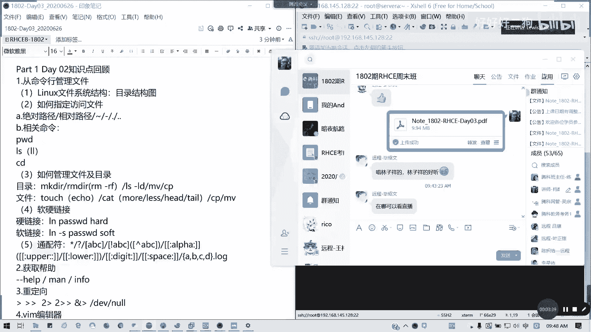

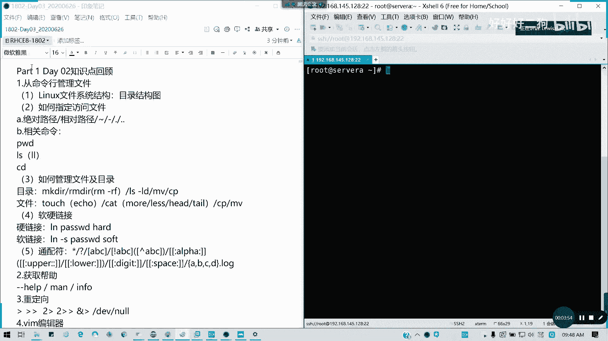

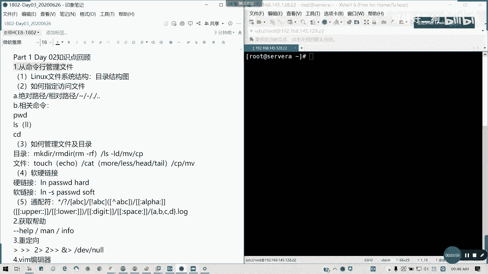

Shell脚本课程将安排一整天进行讲解。虽然RHCE8考试可能不直接考察脚本，但在实际工作中应用极广，因此有必要进行学习和练习。

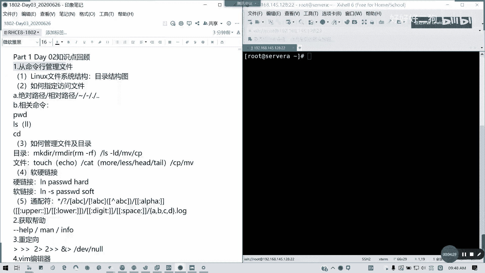

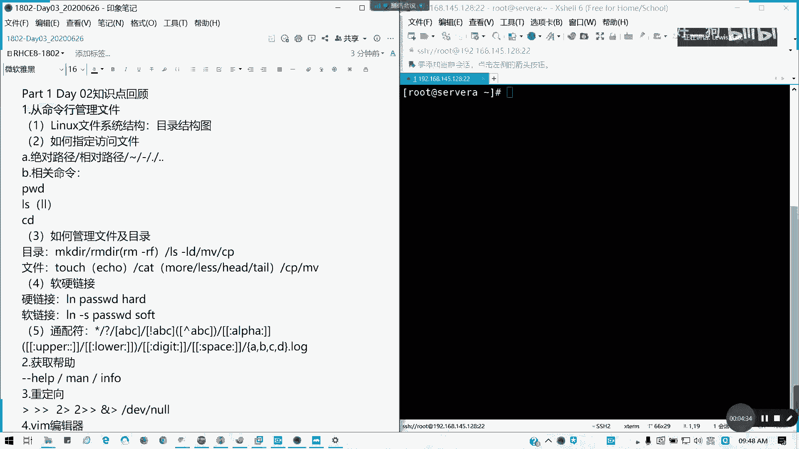

## Day02 课程核心内容回顾

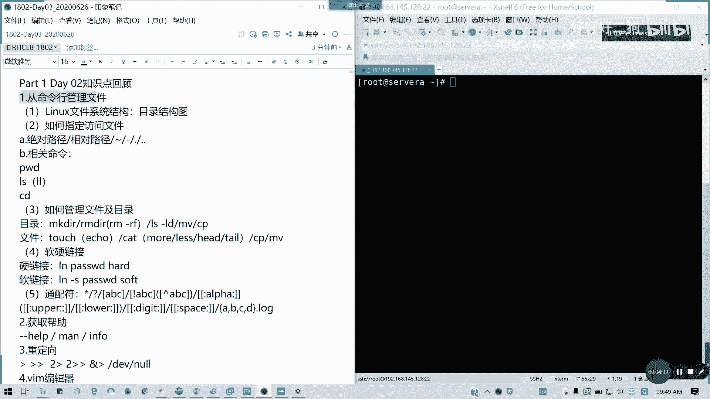

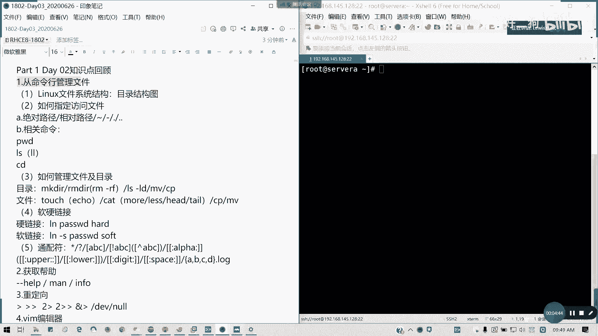

上一节我们介绍了课程的整体安排，本节中我们来详细回顾第二天课程所学的关键知识。

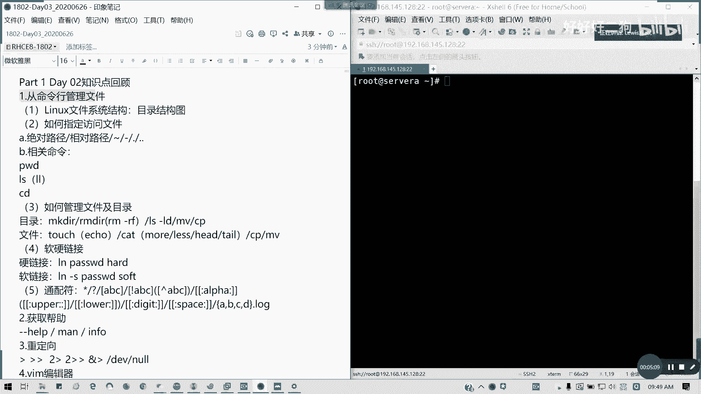

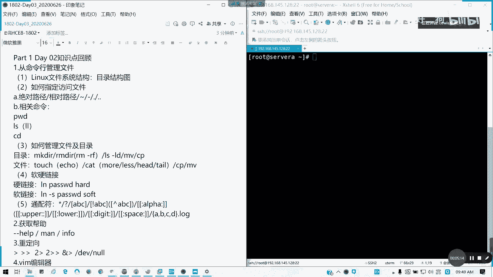

### Linux文件系统结构

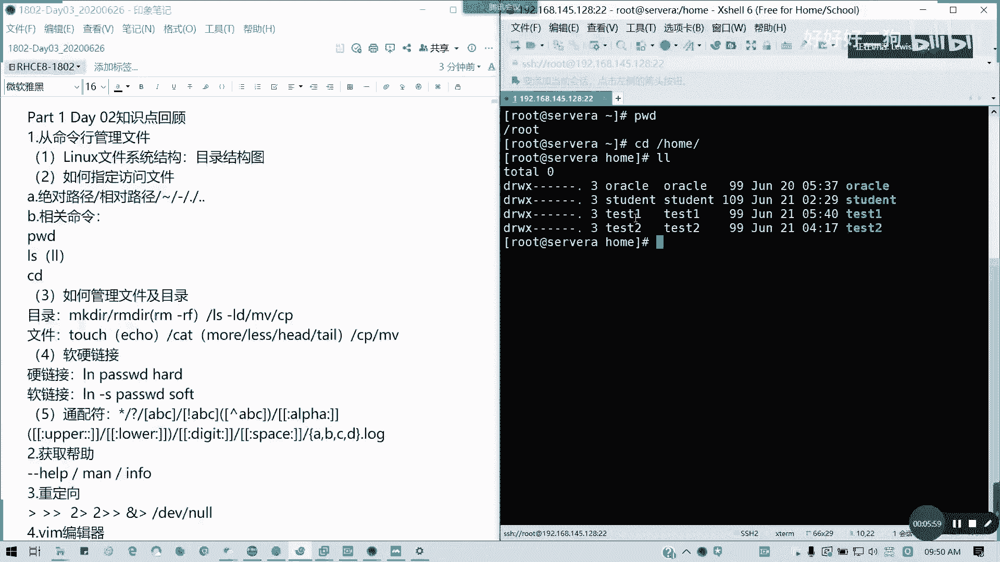

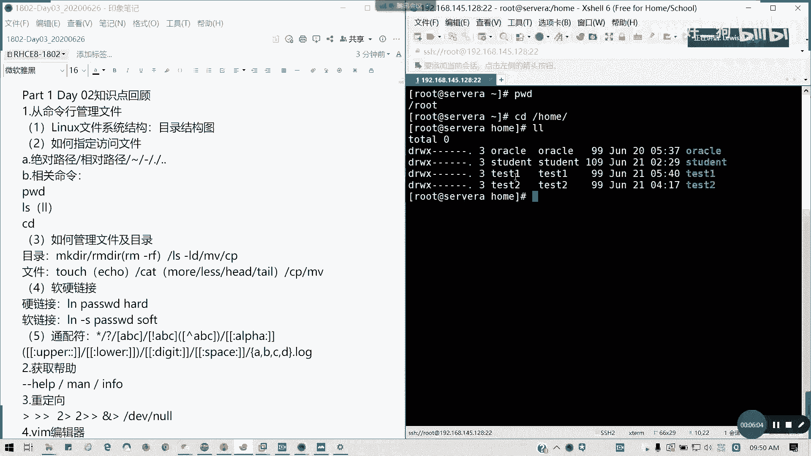

Linux文件系统是一个倒置的树形结构，从根目录（`/`）开始一级级向下划分。

以下是几个重要目录及其用途：
*   `/usr`：存放系统软件资源。
*   `/dev`：存放设备文件。
*   `/etc`：存放系统配置文件。
*   `/var`：存放日志、数据库等经常变化的文件。
*   `/opt`：存放第三方软件。
*   `/boot`：存放系统引导文件和内核。
*   `/mnt`：临时挂载目录。
*   `/bin` 和 `/sbin`：存放系统内置的可执行命令，`/sbin`多为管理员命令。
*   `/root`：root用户的家目录。
*   `/home`：普通用户的家目录，存放用户环境变量、命令别名等个性化配置。

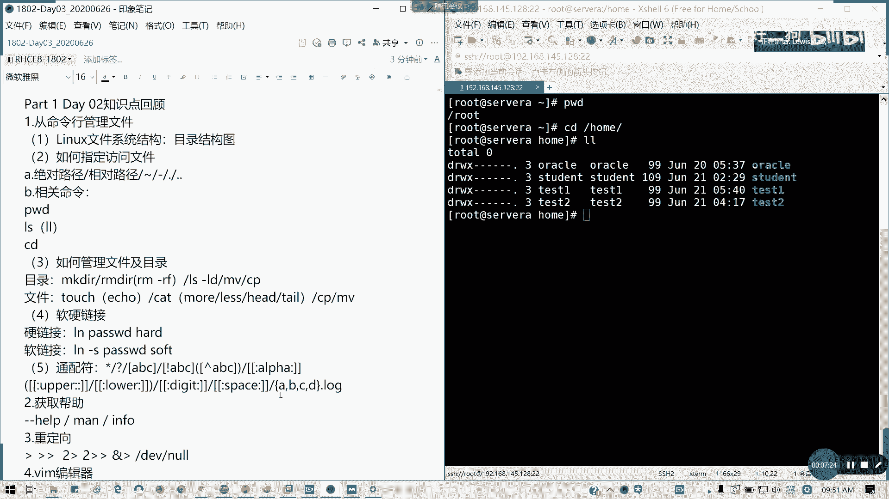

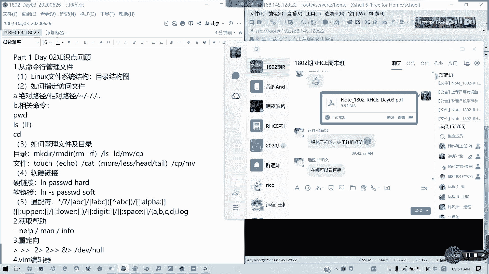

还有两个特殊目录，它们将内存信息映射到磁盘，本身不占用硬盘空间：
*   `/proc`：进程信息目录，可查看CPU、内存等信息（如 `cat /proc/cpuinfo`）。
*   `/sys`：`/proc`的整理和升级版，提供更规范的内核信息访问接口。

### 指定文件路径

指定文件路径有两种方式：
*   **绝对路径**：从根目录 `/` 开始的完整路径，例如 `/home/user/file.txt`。
*   **相对路径**：从当前目录开始的路径，使用以下符号：
    *   `~`：用户家目录。
    *   `-`：上一次访问的目录。
    *   `.`：当前目录。
    *   `..`：上一级目录。

以下是常用的路径查看和切换命令：
*   `pwd`：打印当前工作目录。
*   `ls -l`：以长格式列出目录内容（在RHEL中，`ll` 是 `ls -l` 的别名）。
*   `cd`：切换目录。

### 文件与目录管理

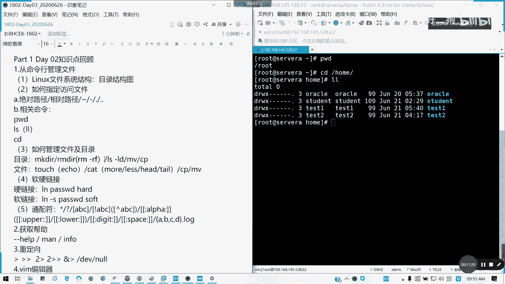

以下是文件与目录的基本操作命令，操作时需格外谨慎，尤其是在生产环境中：
*   **创建**：`mkdir`
*   **删除**：`rm`、`rmdir`
*   **查看属性**：`ls -l`
*   **移动/重命名**：`mv`
*   **复制**：`cp`

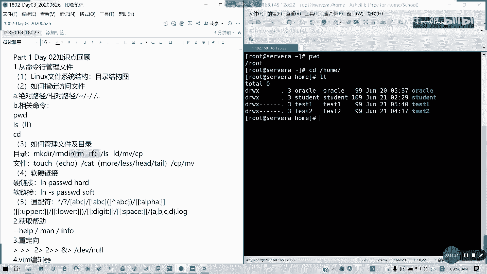

**重要警告**：使用 `rm -rf /` 等危险命令可能导致灾难性后果。在企业中，删除操作通常需要审批流程和备份。操作前务必明确目的、评估风险，并考虑回滚方案。

创建空文件可以使用 `touch` 命令，它与 `echo` 的区别在于 `touch` 创建零字节文件，而 `echo` 创建的文件至少包含一个字节（如换行符）。

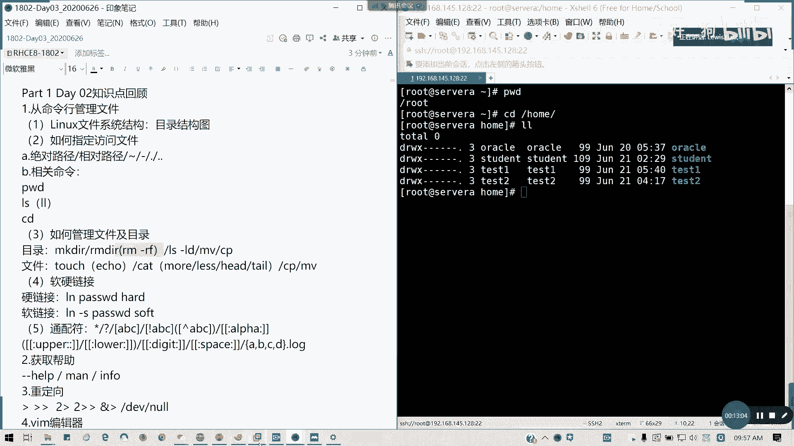

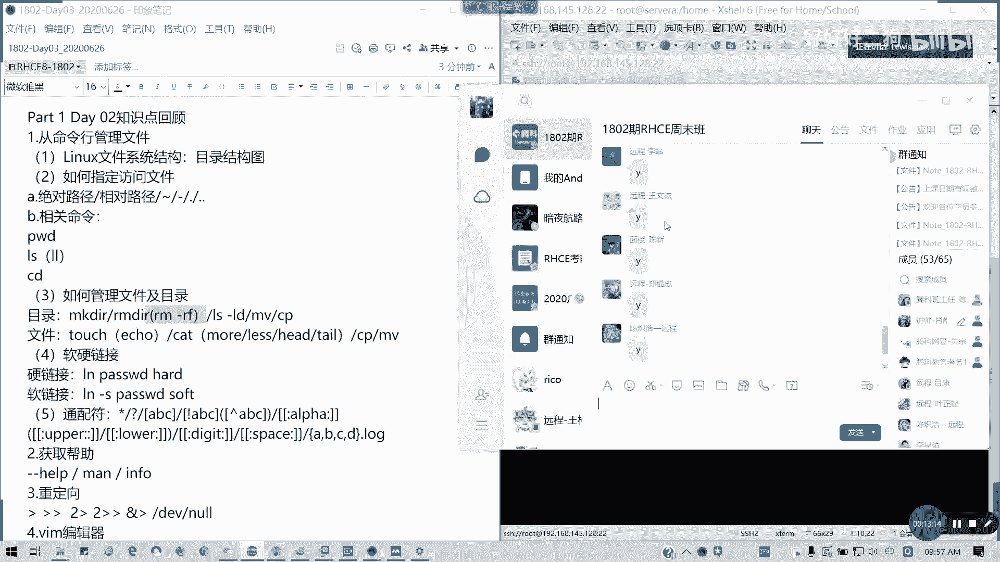

查看文件内容常用 `cat` 命令。

### 软链接与硬链接

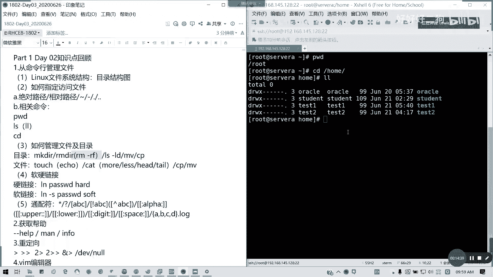

*   **软链接**：类似于快捷方式，是一个独立的文件，指向源文件。如果源文件被删除，软链接将失效。创建命令：`ln -s`。
*   **硬链接**：与源文件共享相同的inode号，指向磁盘上相同的数据块。删除其中一个，数据块不会被释放，直到所有硬链接都被删除。创建命令：`ln`。

### 通配符

通配符用于模式匹配，常用的有：
*   `*`：匹配任意数量字符。
*   `?`：匹配单个字符。
*   `[a-z]`：匹配指定范围内的一个字符。
*   `{a,b,c}`：匹配括号内任意一个模式。

### 获取命令帮助

在Linux中，可以通过以下方式获取命令帮助：
*   `man`：查看命令手册，常用章节为1（用户命令）和5（文件格式）。
*   `command --help`：查看命令的简要帮助信息。
*   `info`：另一种格式的帮助文档，但较少使用。

### 输入输出重定向

重定向用于改变命令输入和输出的默认位置：
*   `>`：标准输出覆盖重定向。
*   `>>`：标准输出追加重定向。
*   `2>`：标准错误覆盖重定向。
*   `2>>`：标准错误追加重定向。
*   `&>` 或 `2>&1`：将标准输出和标准错误合并后重定向。
*   `/dev/null`：黑洞设备，丢弃所有写入的数据。
*   `<`：标准输入重定向，常用于从文件导入数据（如数据库）。

### Vim 文本编辑器

Vim编辑器有三种主要模式：
*   **命令模式**：启动后的默认模式，可执行复制(`yy`)、删除(`dd`)、粘贴(`p`)、查找(`/`)等操作。
*   **插入模式**：按 `a`（光标后插入）、`i`（光标前插入）、`o`（下一行插入）等键进入，可输入文本。
*   **末行模式**：在命令模式下按 `:` 进入，可执行保存(`:w`)、退出(`:q`)、强制退出(`:q!`)、替换(`:s/old/new/g`)等操作。

最小化安装的系统可能只包含 `vi`，它是 `vim` 的简化版，功能较少（如无语法高亮）。

### 用户与组管理

用户和组信息存储在以下四个主要文件中：
*   `/etc/passwd`：存储用户账户信息。
*   `/etc/shadow`：存储用户加密密码。
*   `/etc/group`：存储组信息。
*   `/etc/gshadow`：存储组密码。

相关操作命令：
*   **创建/修改/删除用户**：`useradd`、`usermod`、`userdel`
*   **创建/修改/删除组**：`groupadd`、`groupmod`、`groupdel`
*   **查看/切换用户**：`id`、`su`
*   **设置密码**：`passwd`

### sudo 权限提升

`sudo` 命令允许授权用户以超级用户或其他用户的身份执行命令。其配置文件为 `/etc/sudoers`，**严禁直接使用 `vi` 编辑**，必须使用 `visudo` 命令，该命令会进行语法检查，防止配置错误导致无法使用 `sudo`。

---

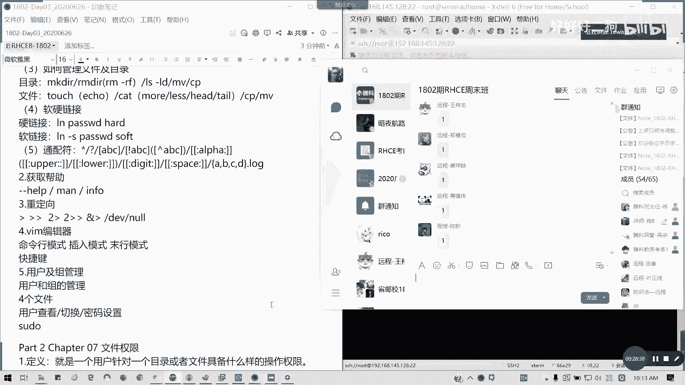

本节课中我们一起回顾了RHCE8第二天课程的核心内容，包括Linux文件系统、路径操作、文件管理、Vim编辑器、用户权限和sudo配置。这些是Linux系统管理的基础，务必熟练掌握。接下来我们将进入新章节的学习。