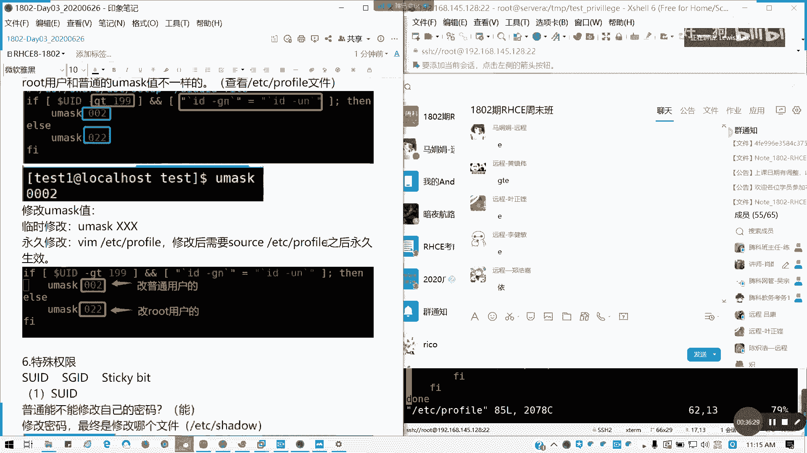

# Redhat红帽 RHCE8.0认证体系课程 - P13：13_Video_Day03_Ch07a_文件及目录权限 - 好好好二狗 - BV1M3411k77W

好，北京时间10点39分啊，我是小路师兄。呃，如果大家回来的话，请打一个三好吗？在群里面。

刚才嗨一就狙击对，有特别配置啊，有特别配置。所以的话。这个。也是有一点技术功夫了哈。

欢迎来到我们1802班的HC的直播间哈直播间。然后那个小在那里面礼物是刷不了的，最多只有鲜花啊，火箭大炮什么是刷不了的啊，所以希望大家认真听课，好吧。我们看第七张文件权限啊，文件权限。什么叫文件权限呢？

就是我们一个用户针对一个目录或文件具备他什么样一个操作功能啊，对吧？比如说你对一个文件，你最起码你要会你要能看它，对不对？你要能查阅，那我们就相当读，对不对？然后如果是一个可执行文件，我们要能执行。

然后你要修改它就不要写。对吧。那几那我们要搞清楚啊，权限有几个身几个概念，第一个是身份。身份呢什么意思？一个用户对一个文件或者目录而言，具备一个什么样的一个身份，身份的分类啊，在我们在第。

我们当时讲LL，我们在D。第二天是吧，我们上周讲LL的时候，我们是不是讲了RWSRWSRWS代表是哪三个身份，对不对？还记得吗？看到吗？身份的就是他的第一个他是文件的一个所有者前三位，对啊？

最前面是一个文件类型，还记得啊，然后我们后面的RWX呢代表什么？第一个是我们的所有者，就文件你是谁创建的，但这个是可以改的哈，文件的拥有者是谁，然后还有他同组的，对吧？所属的组，因为它同组人。

我们后面的又说到权限的时候，你同组人，你用什么权限，对吧？第二个，第三个除此之外的其他人。懂吧？他有三个身份，一个是所有者，一个是所有者所在的同一个组。然后第三个呢是除此之外的其他人，明白我意思吗？

但这里要注意的是，root用户他是一个超级管理员，但是root组呢却是一个普通组啊。root组是没有任何特殊权限，但是will组有WHEL它是一个系统组的一个权限，对吧？

所以在里面root只是一个普通组，但是所以这个不要混淆啊，很多人如果我说root他的组是不是也是超级管理员那是不是我要做这个操作，加入root组就行了，不行的，懂吗？

加入will组是可以的但root组是一个普通组以，所以这一点要我在7。0讲课的时候也有跟他强调这个这回事。好吧。

就像我们讲权限对不啊？刚才说的身份对不对？所有者所属主跟其他人，对不对？像我们1个FS tab，对不对？对吧他他其实它是一个文件，不是D哈，对吧？我们对于我们的那个。FSt这个文件。

它是不是所有者它仅有。独权限对不对？只有读只就对于我们的那个所有者没有执行权限，只有读写。然后对于同组的人以及其他人只有读权限对不对？如果其他人我们就可以当成是叫普通用户，对吧？普通户只有读权限。

这能理解吗？像我们这里用test一是吧？我们t一这个用户去访问他的话，他就只能读取，而没有执行。懂我意思吗？这可以知道吧？RWX知道啊读写执行读的话就是读取文件或目录内容啊，目录内容只是列出来它目录。

懂吧？然后写呢就是能够修改里面的内容。执行的对文件来说就可执行。但目录来说就是能否成为一个用户的工作目录，也就是我们能否CD进去。对吧你执行的话，你CD是不是要一个执行权限啊，你要切换，对不对？

如果你的CD都你的执行权限都没有的话，你根本就没法切换目录了。切换到这个目录，懂我意思吗？所以我们执行对于我们的用文件跟目录两方面来看是有区别的。所以这个大家请要记好，好吧。

目录的X。跟我们文件夹的X是不一样的啊。

你看。主我我们如何看啊。目录权限，比如说我们这里建一个testpri则目录。然后如果对于其他用户来讲，他是不是只有一个读跟执行啊，对吧？这是一个例子哈，懂我意思吗？笔记里面写的。😊。

然后当我们是这样啊。当一个用户针对一个目录具备我们读权限的时候呢，我们是只能看到目录下面所有内容，对不对？

我简单来说。我切到tud用户，对不对？骆驼为什么不行啊？懂我意思吗？为什么root不行啊？youroot你对其他人就一点权限都没有啦。对吧所以为什么刚才为什么这独论执行权限是有关系的，你看？

我刚才为什么我在那个普我的普通用户，我切到root这公家目都是没有权限啊，对吧？因为你连执行都没有吗？懂我意思吗？所以我们针一个用户呢针对一个目录具有读权限的时候呢，是能够看到该目录像内容。

但问问题就是目录中的内内容是什么？问目目录中内容什么呢？也就是一系列的文件名以及目录名称，懂我意思吗？列出来的。我们LL列出来的就是我们直就是我们的读权限。目录的读权限就列出这种东西。

对吧他的东西里面东西它执行的就是我们切换是吧？懂吗？这这个的话就需要我们对我们的目录要要有执行权限。如果没有的话，抱歉，你切换不了目录。我重新连一下啊。好，重新进来新调平。那我们看看啊。

我们现在创建一个文件夹好不好？带杠P递归是吧，TNP。DNP是一个临时目，所以我们再里动不怕了哈t。priviage就测试权限啊。他在默认权限什么？对吧默认就是所有者是所有全全部读写执行都有。

然后对于其同组跟其他人，就只有读跟执行两个权限，对吗？那我们现在试试我们通过啊我们把那个。执行权限去掉。啊，看看什么结果啊。我们这里的话O减R。把其他人去掉可以了。我们用普通用户来测试。

我要更大让他明理解我们这个到底它是什么用的。我们把这里chan mode是修改文件ho默的权限的一个命令啊，O减R代表的就是其他人里面，我去减掉一个R权限。好，对于我们的路，我们没减是吧？

就现在其他人只有个独没有执行，对不对？对吧。好，那我切换带个普通用户。然后我能我看CD哈t privilege。我CD是能进的，对不对？知道吗？没法列出里面的文件和目录啊，那读权目录读权性就是这样子了。

好吧？

可以明白我意思吗？可以不？这样就能理解了啊。

我们回来我们把权限加回去。然后呢，如果没有X权限。我我们把X全是去掉。然后我们再切到普通用户。是吧。我连目录都进不去啊，那那说明执行权限对于目录来说就是这个作用。对于文件来说。

就是你能不能执行里面的程序。对吧那对目来说，这是有区别的。所以这个不要跟文件混为一谈，好吗？通过这个例子能明白吗？可以吗？群里面呃，我们远程的各位啊。呃，刚才说到的一个模拟环境应该是7台啊。

7台加一个否dation啊，7台不是6台。这个例子应该都能明白说我们到底我们目录的权限是用来干嘛的了。懂我意思吗？写的话就是修改里面的内容，对吧？这个没有变。

但是读跟执行跟我们的跟我们的一个呃就是文件的一个权限是有很大的区别的，懂我意思吗？有时候你真的就是不让人访问这个目录，不让人切换这个目录，对吧？就相当于我给文件夹加了把锁，对吧？就可以这么做。

因为呃有些人说我有些人小白啊，像我们的呃是李磊还是张磊同学，是李磊同学，对不对？他跟不上，我可以理解。但是我已经尽量照顾到大家了，对吧？把这些东西尽量我可以讲慢点，讲细讲透，但如果你跟不上的话。

麻烦后课后视频笔记走起来，对吧？不要说只看我就只靠我操作，那没用的，大家可以去试一下，跟我的一起的跟我笔记里面或者是跟我现现场的一个视频操作，去试一下，那就知道自己是不是是不是转换自己东西了。

然后如果你电脑上电脑上的话，你用记事本印象笔记有道于把笔记记录一下，自己做一下笔记印象会更深。你们不要一个个不要做的，也不要说只拿着鼠标键盘敲起来，好不好？真的好记忆不如烂笔头，我们现在没有笔没关系。

用笔记自己敲起来，关键点记起来，对吧？笔记可能砸，但是你。提炼出来其实是就是那么十几行二十几行，对不对？一天我们的内容就这么多，对不对？所以说希望大家能够养成一个好习惯，在我的课上课下都好。

把笔记做起来。然后有时候可以通过练习，我们可以整理出错题本，对不对？就有些东西啊，自己很容易弄错的记录标记起来。对吧包括远程各位一样，不要只看我的讲解，只看的话没用啊。对吧可以试一试，好吧。

这些我是敲过的，我验证过的，但大家第一次对吧？可能很多人第一次大家试一下就知道了。像刚才改改是吧？然后呢，如果没有S权限的话，我们就是吧？我们test的话，像我们啊没有那个执行权限，然后只有读权限呢。

对吧只有独权线，那怎么样呢？我们可以看一下啊。我现在还是拆C，我们千万不想目录，但是我们能不能读里面内容呢？里面没有东西啊，那我回去我创建几个东西出来好不好？🎼我touch几个文件，F1F2跟F3。

然后我回我回到一个普通用户，然后我LS杠L是不是？全部deline没有精确限吧，你解析不了，你只显示的文件名。所以呢我只能看到他的名字，但是他的属性属组权限全部看不到，对吧？就没有执行权限情况下。

你不但进不了目录，你要看里面内容，你就除了知道里面有哪几个文件跟目录，对吧？哪几个文件名啥都看不了，懂我意思吗？全部是问号。懂吗？小所以我们一个小节哈，如果一个用户想一个用户针对个部访问。

那就具备读跟执行权限是必要的。单纯读或者是单纯的写。单纯的执行其实意义不大。对吧如果单纯读甚是没有意义的，你这连部都切不了，你是吧？你只能看这些东西对吧，是不是没有用？而且针对目录的写里面很简单。

如果没没有写目录啊，没有写权限，是不是不能里面创建跟删除文件，对不对？这好容易理解哈，懂我意思吗？所以呢我们针对文件。跟目录啊权限设置存在以下三种情况，一种就是读跟执行读且执行，要不就所有都没有。

对不对？以下的情况基本不存在。不要说我们三种的话，我们只有9种组合，对不对？但其实你真正使用的只有三种，我们是可行的。你看这些。对对目录哈仅仅看到我目录，然后这个的话都没有办法成为公众目录没意义了。

对不对？然后还有只能执行，就是你读的不到里面内容。然后RW跟WS没有用。懂吗？能明白我意思吗？😡，那针对文件就不一样了。针对文件的话，我们读权限啊，我们我们先把我们的权限我们切换的ro啊。

先不管其他用户啊，我们把权限加回来。切到root我们我们对文件的话，我们比如说我们的那个我们复制一个。ETC你 passWD是吧？TMP里面test目录的pasWDTMP test目录。

对吧那我们可以看一下。PMP test目录 passW开是什么权限啊？他对于我们的所有者只有独跟执行嗯，都对同组或者是其他人只有独权限。对不对？那我们如果。只给读权限是吧，我们读权只给读权限应该知道吧。

你就能看到里面文件，对不对？比如说我们切换到修udden，然后。我们我们看一下。因为我们是对关键文件进操作，所以的话我们就把它复制出来，使它不是成为一个主要配置，懂吗？我是能读啊，对不对？

这文件没问题啊。然后呢，如果我只给写权限，我就以其他用户来操作。那那那我们看看啊。CHMODO等于W就是绝对值，只赋于某一个赋予指定权限O等于W。

同样我附这个文件tests里面的pasWD我们看一下什么结果，笔记里面已经说了啊，那我们这里还是要实地演示一下，大家可以跟着我的节奏一起来。然后呢，我们看一下，同样是这条命令。顶赖对不对？

我VIM也不行。就有只给血钱线。这才我们是可以写，对不对？都没什么意义呀，我都读不出来文件内容，对不对？列列不出来，然后我可以是吧？VIMV不到，但是我可以这样。这个是成功的。对不对？

但是我始终看不到啊，所以只给W没有意义啊，懂我意思吗？

就相当于我们盲人摸象，懂我意思吧？都看不到，你只能靠感觉。没有靠意念意YY是不是？然后像我我们现在正常的是不是我们看一下我们的文件是吧，我们文件是不是也改过，刚才我们是写了一下123，对不对？

因为没有没有读权限，所以的话他这个文件还是没有变的，对吧？我们刚刚才开口123进去没用，懂吧？然后X权限呢。因为你读不了，你写没意义，对不对？刚才说的，然后呢。

执行权限呢就是比类似于我们的windows下的像EXE是吧？像BAT像com对吧？我们后缀是执行权限。但我但是在linux我们是wind是看扩展名的，对不对？linux呢是看有没有执行权限，对吧？

🎼像如果我们要我们那个没执行权限的话，我们在普通用户是吧，我们直接执行是吧？TMPt目录。papaWD。是不是permissionion抵赖啊？啊不。🎼等一下啊，student。

然后我直接TMPt里面的passWD。是旁密森顶娜呀。懂吧？没有执行权限呢，对吧？但是呢你有你想要执行文件的，必须你必须看得到，对吧？那为文件必须读取出来才能执行，所以的话必有R权限，你要文件能执行。

你不给他写没问题，你只要能读，能列出里面内容，然后执行它就够了。所以不可能只有W，也不可能只有X。懂我意思吧？可以可以不？755啊，反正你至少你要执行的话，你你至少有个有3个5，对不对？55。

你不给编辑没问题，但是在USSro者的话，对文件来说是755的，对目录644就足够了，懂我意思吗？那对于目录是75啊，对文件有时候644就足够了。好吧。对于目录啊。75对于文件644。

所以我们。对吧。对于我们文件的权限有这么5种，对吧？有这么5种，明白我意思吗？读读写读写执行，读跟执行，啥都没有。其他的情况不存在。可明白吗？明白了。呃，群群里面明白打个B哈。请你明白打个B哈。

我希望大家能够理解这个就文件目录只有三种，文件是5种啊。然后接下来我们讲实际操作部分。实际操作呢就是我们现在知道我们文件跟目录有哪些权限的情况下，我们要改来改权限设置权限了。那我们要怎么操作呢？

怎么操作，我们看一看啊。CHMODchan mode MODE啊书写是简写叫CHMOD。然后它有两种办，两种方式，一个叫数值法，一个叫符号法，对吧？我们的记号法也叫符号法，也就是RWX懂吗？

我这个图能不能看清楚。可以看得清楚吗？它是分为三个组，对不对？三个组就是我们的owner，我们简称为U，对不对？group同组简称为G。哦。are的其他人简称为O啊，所以三个权限你可以如同时设三个权限。

你要逗号。如果你要全部设权限，可以用前面改为A。好吗哦。ALL懂吧？可以单独设，可以一起设，没有问题。然后呢，这里等于是直接赋予权限，等于直接赋予权限加原基础上增加减是去掉。好吧。

我这里次我就不演示了哈，因为这里都要写的很清楚，好吧。然后对于记号法，就是三位啊，我们通常用那个用我们的数值法会比较多，对不对？读是四符号啊，显示二运行是一。然后我们比如说这里753对不对？

就知道是什么东西了吧。啊。懂吗？这个我就不再演示，如果明白，请打C。这个我就简单过哈，因为时间关系我不不可能做在演示，但是我们笔记里面已经有了，对吧？就不再演示了。

好。接下我们讲身份修改是吧，身份修改，我现在回到root用户，然后我把那个papasWD，我CP1份。TMP。🎼明白吧？呃，ETC里面passWD，然后复制到。TMP里面的ts privilege里面。

🎼好，我们来讲一下如何修改啊。我现在这个用户test C在不在在哈。好，那我们比如说我们修改这刚才修改权限，我再示范一遍啊，示范一遍。

比如说我这里的MO我就修改这个CMPTMP里面的呃test privilege里面passWD好不好？比如修改一下CHMOD我。用户是吧，我的所有者是所有权限都要。然后呢我的组。只加一个独建线。

然后我们的那个。O是吧，我们的所有权限都不一要，就这么设啊。对吧。对吧。然后数值法的话，比如说我设置75753。通常75啊753这个还是很少见的。很少见的，这样这种是不合规的啊。我先说。

因为因为其他用户你这样的话，你这权限没什么意义。所以说通常我们是7U5。或是644都可以。对吧OK那身份修改身份修改来，我们改成tests一的用户跟tex一的组che on。Tsh honor啊。

t一是吧，TMP我直接就改classWD的用户好了。对不对？我们的用探索者就改成t一了。那么改他组呢就是用全职ro。对吧。可以理解吗？但我们通常我们是两像我们的下面的。下面我们改完之后是吧？

我们现在踏一下。我现在还有F1F23，是不是还是。还是他，对不对？对吧还是默认的这个root，对不对？然后如何递归修改呢？那就加个R呗。对吧reclsive递归。

然后通常我们写法呢就是用户跟就用户跟组一起来写。这样子。地归懂吗？对吧我看这目录啊，杠D。对吧所有的下面的全部修改成test2了。能明白我意思吗？可以的话，请打D。ABCD的D哈。第4个。这是修改组了。

对于我们的那个所有者跟组能明白哈。有问题可以问啊。不懂的马上问啊不懂马上问。我不知道马娟娟啊，像马娟娟新来的各位能不能跟得上啊？

然后呢，接下来我们讲默认权限。我们现在我们创建一个目录跟创一个文件，我们看一下它的权限是什么，好不好？MKDR。task， you must问学校我们叫you must啊，undfined mask。

然我们踏取一个。testyou must file，这些名字可以自己定义啊，只是我们要看它效果，它的目录的默认权限是不是Q5啊，对吧？他的那个。文件的默认权限是不是644啊？那他的这为什么创建时候呢。

会给到这样的权限？因为有一个默认属性起作用，我们叫反言嘛，懂吗？我们打U mask给看一看。0022啊002，因为我们权限为什么有4位数？因为我们待会要讲一个叫做超级属性，对吧？

SUIDSGID粘智位我们都要讲得到。所以它这里的话是有4位的啊。然后呢，其实我们的目录权限是吧，如果看到反言码。也就是我们的权限呢，就是我们的满权限对吧？满权限减掉U must值。

我们的的目录满权限是777文件的满权限是666，对吧？文件你不一定需要执行，对不对？所以它的满权限是666，懂我意思吗？文件它的满权限是不需要执行的，不需要执行权限加持的然后它的那个目录呢，你要切换。

你的目录要能切换，对吧？所以必须有执行权限，所以目录权限是777。好吧，满权限，所以为什么是755跟644就是这么来的？懂吧？这可以理解。我看一下有没有问题啊。然后呢。

普我们root用户跟普通用户的mask值是不一样的。我们看一下啊。我们可以看一下一个文件叫ETC profile。他这里声明了一个叫做我这里用VIM嘛，VM的话有颜色可以看。这里啊。

它是一个系统的宽环境啊，宽环境还有启动的启就是我们的。如果要写拆机启动的，可以写在这里面都没有问题啊。我们看你这里有一个叫做。这里我们的一个U must配置部分。对不对？它是有个文文章啊。

就set up杠新，然后有个UIDGID这个文章，它可以找到1个UIDGID的一个反言码，懂我意思吗？然后这里的话，我们普通用户的maUma跟那个是不一样的。如果特别是我们的那个1。

就是我们它这里有定义啊。就是那个199是吧，UID小于199，它的那个路包括root，所以他的那杠GT知道什么意思吗？就g greater就是这个。应该说啊他的这个grter。对是吧他如果是比他大。

然后还有他的GID等于他的那个UIUID的话，那他的U码是002。然后如果否则呢02它的反页码，懂我意思吗？也就是说它的UID度大于2大于199，它只有200以后的，它的默认权限是像文件775。

像文件夹775对不对？然后像文件是664，如果是小于。199的话。那就是75跟644，懂我意思吗？杠GTgrade there啊。

像我们的普通用户，我们看一下是吧，我们root的U mask是不是00020022。这我们切换到普通用户。T一。test一哈，然后呢，我们的U mask值是不是0002？懂我意思吗？它在哪里定义？

就是我们的ETC profile里面预定义了。可以明白不？

前面的第一是什么意思？

哪里截个图，梁志成。那咱看一下啊，哪哪个D。哪里的迪呀？截个图啊，前面的第是什么意思？问问题，你你要问清楚一点啊。你是说哦，我们在那个第二天我们讲的东西就是你的文件类型啊。第一是目录，对不对？

L代表连接一横代表普通文件。是吧然后B代表快设备，C代表日符串设备S代表套接字，对吧？都讲过了。说明你第二节课在开小差，是不是？我们是不是第二节课讲了，就我们第二天都有深刻印象哈，呵没复习被我抓到了。

然后如何设置you must值，对不对？you must值。

怎么设置呢？比如说我们U mask。只要直接打后临时修改，就打后面的值值就行了，对吧？比如说我022，然后我修改一下是吧？他生效对不对？临时生效，但是我们永久生效，那要改他这个文件。

🎼我们要改他这个文件是吧？ETC。profi，然后记得s一下，让他刷新到系统内核里面，就改这两个值就可以了。改普通户者在这里，改lookot在这里我就不示范了，一般保持默认值就可以了。

对吧这个东西我们只要知道他的默认权限怎么来就行了。但修改的话。我们一般很少用。不不一般不用，对吧？遵照系统约定俗成的规则来可以了。这快明白，请打字母一。

不是数字一呀。没打数之一就是走神的那种。

好，明白的话，我们讲特殊权限。

这个一什么鬼是吧？我们讲特殊权限，第七章准备结束啊，特殊权限一个叫SUID超级UID一个是超级GID一个叫做年智位是吧？

我们以一个修改密码作为例子。这一个的话我们后面会讲到主播修改密码。但是这里的话我们看一下啊。我们退出来这个文件，我们看一下这个ETCsha这个目录，我们是不是这里存放密码的呀？我们之前是不有说对吧？

他家权限是不是全都没有？那全都没有，那我们普通户能不能是吧？普通用能不能修改密码呢？但是可以的。然后呢，修改密码最终修改是哪个文件呢？是不是ETC噱斗啊。

它是写到里面去的那我们看的这个ETC噱斗没有权限哎。对不对？一丢丢权限都没有。那既然没有权限，他我们普通用户，比如说我们task一，我们如何把密码写进去的呢？

那我们看看修改密码是不是执行哪一个二进制文件，也就是我们具有执行权限，写文件的一个东西，对吧？在哪我们看一下。我们修改密码是不是我们接下要讲到修改密码，我们是是用一个叫passWD的一个工具。

对吧那pass WD我们看一下它的权限是怎么样的呢。对吧他在这里有一个S啊。对啊，他的一个执行权限位置到了一个S。代表什么意思呢？就说明它带有一个叫做超级UID什么超级UID呢？超级UID其实我们的。

如果我们看到我们的一个S的权限super啊S权限出现在我们拥有者，我们所有者的一个执行位上面，那证明它具有我们超级UID权限。那作用是什么呢？是吧？我们看一下啊，看我这里的描述。

当一个普通用户test一去执行一个带有UID的二进制文件的时候，比如说我们的pass wD对不对？懂吧，我们修改这个密码的时候，他要去执行这二进制文件。如果那么我们这个用户呢在执行的过程中。

他会临时调用啊，获取到我们的这个二进制文件的所有者的一个权限，也就是临时获取到一个root的。权限对对，他所有者是不是root啊？然后后续操作，它比如我们修改passWD。我们修改文件啊。

就是我们通过pas w修改密码的时候呢，他就会拿着这个所有者的身份去执行。当然这个操作仅针对二进制的文文件，也就是我们的可执行文件生效啊。原理呢是这样子啊。我们看一下我们的pasWD是吧？现在没执行啊。

现在还没执行。我们看一下。我这里就。假如我就放我我又切换一个普通用户吧。好吧，我假定我要修改自己密码，我这里放着个pas，我就停在这儿。那我新建一个绘画，我们来看一看。或是我把它拉下来，对吧？

我们对比一下。

我们用PS杠EF是吧？我们用PS可以查看进程啊，可以查看进程文件它里面的一些信息啊，看一下passWD，它的只行显示root啊。懂我意思吗？我们也有一个普通用户去执行，但他的所他的执行的是root啊。

因为他是超级GID，对不对？他拿着root用户去执行，所以他我们用一个进程数PS treee。对吧然后显示所有加上用户加上一个进程AUP对不对？gra里面passwD，我们看一下它的执行过程是吧？

它一开始。拿着1个SSHD是吧？然后去运行bech切换用户，对吧？从bech先用到student，然后执行pass WD，对不对？懂我意思吗？它是切换成切换到从studentsSU到一个root。

然后执行pass WD懂我意思吗？相当于这个过程能明白吗？可以吗？有SUID的话，他是会拿临时拿着root权限去做他的事情。然后执行完之后，他会把root权限收回来。然后呢，我们的操如果是RW大S。

那证你的文件如果本身没执行权限，那它这个所有者的执行会就变成大S。也就是你只有SUID，但你没有执行权限，这是有区别的啊。小S代表是你两你有既有执行又有SUID。懂吗？然后怎么修改呢？

就是trenage mode。然后后面U加Ssuper的意思啊，U加S，然后后面跟上我们文件名就可以了，这能明白吗？对文件。的SID是这样，但是目录没有啊。对目录没有这身东西的。

接下来我们讲SGID超级GID当我们1个S权限在一个属组的。执行未上。它的它有两种作用啊，第一个，针对二进制文件，就文件执行过程中，它会获得一个当前组的权限，不是所有者啊，是当前用户组的权限。

就你的所在用户组的权限了，懂吧？但针对目录呢就不一样了。针对目录我们经常会考试的啊，就考经常会考到这一个的。那我们现在把这个技能停掉，我们现在呢。我们在t里面我们踏取1个F4跟F5。

我们看一下是不是我们当前的所有的都lookot，对不对？都lookot，那行。我们对默认一默认我们新建一个文件或目录之后，它的属组就这个用户的初始组，对不对？🎼但是我们如果加了SGID之后。

它就会继承这个木的辅组。那我们可以试一下啊，MODCHMOD圈mo居加S。然后这里TMP test privilege。🎼对不对？我们现在我们看一下t privilege。是不是猜4啊？我们当前猜42。

当当前还是路ot，对不对？但我们创建1个F6跟F7。再看一遍。看到没有？然后我这这个目录是不是带有一个超级GID在？所以对于目录来说，它就是你以后日后你创建的所有文件跟目录。

它的属组都会追遵循着你目录里面你设的是哪个组就是哪个组。这是超级GID的作用，懂我明懂我意思吗？对文件就是获取它组合权限。对目录就就这样啊，操作方法劝取GID啊。因为刚才劝阻UI超级UID的话。

其实对目录是没有这种作用的。懂意思吧？没有这个作用，对于文件就是临时拿他的所有的权限，使用其他用户执行的时候。一个叫粘置位，粘置位仅对目录生效，对文件没有没有意义的啊。仅对目录生效。

粘制位如果在其他人里面出现了一个T。那就那么里面的文件跟目录请所有者及路ot可以删除。这是年之位，就是我们在这里出一个T啊，我这里先设这个权限chan modeO加T。Sty啊。O加T，然后呢。

我看一下L杠D，我们看一下这个目录是不是加了一个T呀？这所有的这样个T，那我们试一下我们删几个文件好不好？它是相当于一个写法货。然后他能能读能修改是吧？我VIF6，我们现在的话是root的。

文们字可以可以随便改是吧？123124123对吧？

然后开F6有吧，是吧？对吧。F6它的主组type2，那我们介换到type一。NowCD到TMP的 test privilege。我们尝试RM杠RFF6。旁边声点内大大的两个单词在这里。懂吗？

它的属主是哪一个呢？它是test2啊，它的属主是就它属主是root啊，懂吗？所以你加了这个sticy name之位之后，你除了lookot开它本身文件本身的手指之外，你是不能删除的。你能读能改。

我就删不了，能明白吗？然后我们对应的我们的那个我们的链超级权限UIDSUIDSGID跟ticky我们的权限对应在我们权限的第四位，就是最前面一位SUID权限代码4SGID权限代码2。

sticy权限代码一懂我意思吗？就我们的那个数值法。就相当于是SUID。4叉叉叉对不对？我们前面后面是文件权限，普通权限SGID。2叉叉叉。St here。CKベツ。一叉叉叉懂我意思吗？第四位啊。

就我们从右王左数的第四位就是超级权限。超级权限3个。能理解吗？能理解举手。12345OK。啊，全上理解的话，远程的请学理解的话，请打个F。这笔记如我修改的地方，我会加上去的，然后直接发一个新的版本出来。

有疑问可以提啊。那我们还有一个最张好一个最后一个点，就是写保护，但这个比较少用啊比较少用，一个是I，一个是A啊。

这里我简单讲一讲啊，我这里有例子。操作方法就种我们不是用chan mode了，这种change attributeATATTR，然后加杠I或者杠A，对不对？

我们通常用LSATTR我们给列出来它的属性就这么长，对不对？但我这里为什么这么长？我们先不管我们就掌握两个基本功能。其其实我们用的很少，对不对？加了杠加I之后呢，就是硬写保护，只能读不能写，也不能删除。

就是相当于我们软盘，是不以前软盘是不是写保护的一个开关呢，就相当于把它打开或者U盘有写保护的对吧？你打开之后，你就只能读，对不对？像这里我们比如说我们的FS tab是吧，我们ca我们pass WD是吧？

我们一直用FS tab的，我们还是写我们还是那个修改个paWD。🎼我们当前的什么权限呢？LFATTR。WD是吧，我们当时是没有设置我们的特殊权限的那我们用圈子ATTR。杠加I。paWD对不对？

我们看一下，这是刘东有个I的对？那我们现在编辑一下。看到下面有个reonly没有？最下面哈。那我随便修改一下是吧， warningning是吧？他是只能他是在改一个是吧，那我们现在保存怎么办呢？

re only这个这个特殊权限已经设置了，对吧？🎼那我强制保存可不可以呢？也不行。懂我意思吗？这个特殊权利就是应邪保护门教。所以这这时候你的人只能灰溜溜的退出了。

对吧这是硬邪保护加I。然后还有一个软鞋保护呢。我们变成加A了。啊，把我们把这I去掉。我们剪掉就可以了。这样的话什么意思呢？它是只能读不能写，不能删除原有内容，也就是原有内容已经被加写保护。

但是我们可以追加。啊。同样 vIM。passWD。他也是那个cannot open fire writing，对不对？对吧。那我们现在我们后面我们大区切到末尾，然后我们再加一个是吧，我们用O123。

可不可以呢？也不行，对不对？那我们可以通过A口来追加，但不能覆盖啊。比如说覆盖的话会怎么样呢？oppererational committed，但是我追加呢。可以哦，对吧？原有的内容写保护。

但是呢新追加它是允许的。懂我意思吗？这是杠A跟杠A的区别。能明白吗？OK啦啊O的话，请打个句。😊，然后讲到这里，我想给大家两道题目。跟用户权限有关的两道题目，我们先不着急讲进程啊，不着急讲进程。

我们来给大家两道题目。我看一下啊，有没有试题，我拿出来。我拿七的题目直接给大家吧哈我拿七的题目直接给大家。因为我们这个题目其实差不多的哈。他这个跟漆的要点没有变。

懂吧？他这个跟企业要求是没有变的。我们来看一下两道题目发到群里面，然后开始做啊，就是那一个一就几个权限题目，还有包用户主段关系。但权限的话，有些你们可以可以做哈，有些可以做来三道题目给大家。

刷题目给大家，现在我们花时休息时间，我们做一下练习。

这一个用户你要自己创建哈。就是我们哎怎么少了一局，我问呢。点小咗학교게等等。每道题我发出来吧。总共三道题目给大家练练熟。这是其第我们练练习题里面第五题，然后还有就是这个第六题。

但有些内容可能会就说我们还没讲到，但是希望大家能会做哈。这三道题给大家时间，在实际环境上练一遍，好吧。

