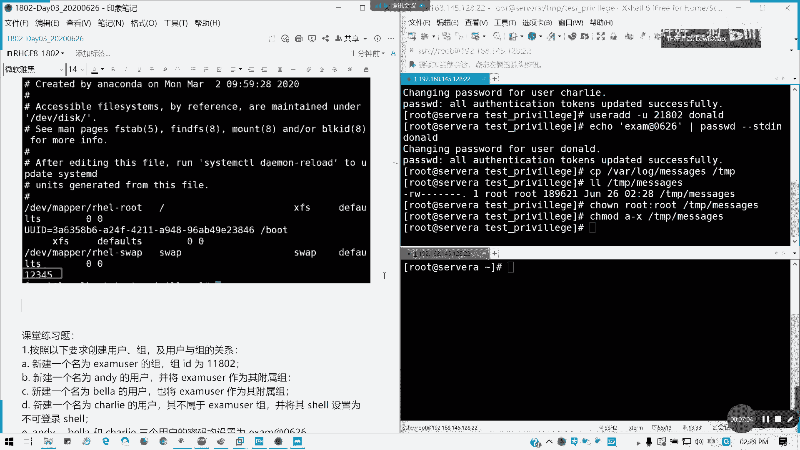
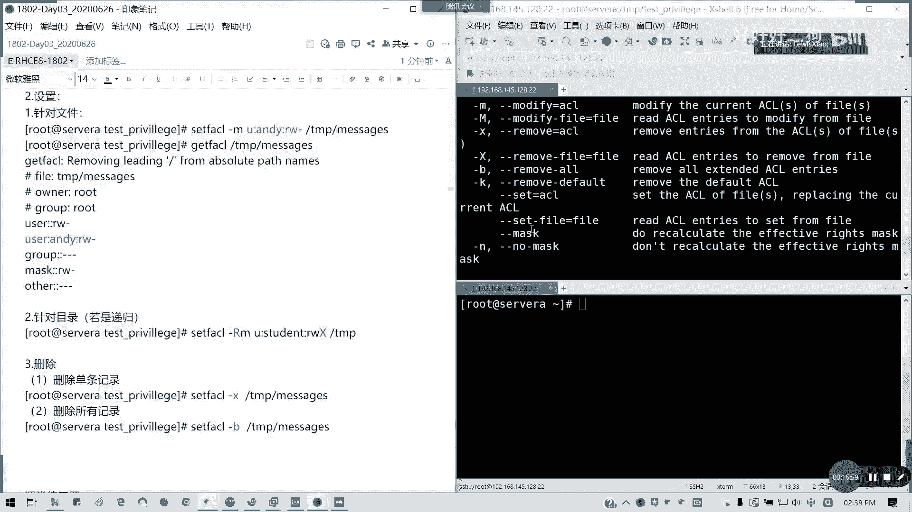

# Redhat红帽 RHCE8.0认证体系课程 - P14：14_Video_Day03_Ch07b_文件及目录权限练习 - 好好好二狗 - BV1M3411k77W

北京时间14：22，我们进入下午的课程，像我们上午的留了四道练习题给大家，给我留了四道练习题给大家，那我们现在的话，我们先来把上午的问题先解决了，然后我们再讲新课好吗，我们先把在座的都有啊。

如果说啊如果做完了，请打个一，然后再做，做完的请举手一个，没有啊，其他的，只有一个人全做完吗。

像我的题目做完就打个一，这边还是好多的，12345678，现场只有一个人做完九个六的e f没做，是不是十个11个。

然后我们再看看题目啊，我们来看题目啊，来看看题目，我们这里5678。

我们这里重新调1234啊，1234，我们看题目，首先我们看一下啊，创建用户主机，用组织关系啊，这里有一第一题有分五个要求，我先把题目给大家讲了，这样的话大家就相当于我们复习的上网内容，跟我们这些内容。

首先我们要创建一个叫examuser组组id，1802，然后n dj用户呢将它作为附属组，然后然后呢bl这用户也是将它作为复数组，cherry用户的不属于它，然后它shell是不可登录。

三密码均为这个啊，那我们来解压命令，打发掉user add，我们复数组是不是更大，我们我们是group at，对不对，先创建一个组，然后杠我杠g对不对，左d1802 对不对，对吧，然后呢。

我们创建这个用户作为复出组，那uzi这杠大车是负数组，小车是主要组啊，杠大车啊，然后后面改一下ba，然后不可登录这个shell呢，我不属于它其他组，那我们就不用设置其他组了，那我们就直接是吧，对吧。

然后修改这三个密码，我们用a口命令，还记得我写的吗。

这道题搞定了，步骤就是这样。

这道题就搞定了对吧，主要是一个附属组对吧，我的主要建立起来，然后我复数组前两个，第三个是shell类型。

然后呢接下来就是设置密码，懂了吗，这题我贴在这里。

这些题目就是两分钟内的事情吧，如果熟的话，懂我意思吗。

这道题如果懂的话，请打一个1号，先请打一个，请打我们的不是是我们的汉字音啊，因为上面的话都先不不不不不不，我先把这个隔开来来，这道题会的，请打一啊，数字一，那我们看看第四题，第四题很简单对吧。

创建一个用户，我们跟着再来做就行了，user add杠u指定ui d，它的ui d号是21802，然后。

mona是吧，然后同样设置密码给他。

搞定对吧，搞定第四题搞定了，那接下来我们看二三题，第二题先跟上一题有关哈。

复制这vr local message到tp目录里面，b格要求配置这个tp message的权限对吧，那我们按照看着要求看所属组所属人啊，所属社所有者为root哦，这答案所有者会更合适一点。

然后所属组也为root，然后对任何人没有执行权限是吧，然后这这两个d1 ，第一呢，第一呢主要是那个就特定用户的权限问题，我会讲一下什么叫就如何设定特定用户权限，这个一句话带过就可以了，就一句话带过。

这是知识点来的，然后呢它是对有毒有毒的权限，然后对对那个beta的话既不能读也不能写，然后其他用户呢，包括未来用户对这个文件有读跟写的，去做多权限，那我们做题边做。

我们边讲这个知识点，首先我们要复制一个var log message。

对不对，到填平目录下对吧，然后呢我们接下来我要看一下我们的。

tm p message，对不对，它的所有者和所有所有者是为root的，但是如果我们要做的话，其实就不提修考试的话，你不要看它是就是这样状态就不要做了，就补一条命令给它，全是all是吧。

直博一条命令给他就可以了，一条命令相当于我们完成两个东西，然后呢对任何人没执行权限，a减x对不对，o砍掉x对不对。

无论你的文件是什么权限，反正你做回给他就是了，前三个是不是已经完成了。

对不对，然后第四个我们讲一个知识点。

我们叫做那个对特定用户执行权限啊，补充知识点我写在上面。

补充一点啊。

这原来是在c c的第七的话里面，是第二本书的内容，我们这里提到，这里讲普通支持一个对特定用户设置文件，文件a4 l。

就他的访问控制列表。

那怎么办，然然我先首先先看一下查看啊。

查看怎么查呢，这里我补充一下这个编号进了。

稍等一下。

好我回了啊，get f cl。

get c f a c l，然后get文件的a soul列表。

然后后面是跟着你的。

我们的文件名或文件夹名懂吗。

比如说我要看看一下这个文件的一个，就如何查看了。

来。

懂吗，这个是我们默认权限，是不是我们的user grouba的。

对不对，但是没有对特定用户设置权限对吧。

那我们现在题目有要求，是对那个ending和bella设置tp message读跟写的曲线。

让我们看怎么做啊，设置权限是这样子的。

如果要递归的话，我没有递归的方法啊，设置的话是这样，sd f a c l对吧，设置文件的a4 l权限，然后呢格式是这样的，如果你有递归的话，如果是没有没有递归，我们的修改就干m modify，对不对。

还要带一个选项叫modify修改，如果是有那个递归，就是你属下你要设置整个目录，或者是所有的整个文件夹，你就带杠大r的代表递归，懂我意思吧，我们这里的话就是如果没有的话。

我们就就这三个文件是带m然后后面跟什么呢，哪一个用户，我们我们设用户的就u是吧，如果是组的话，就g懂吗，来哪个用户andy是吧。

他要有什么权限的读写。

r w对不对，但是他没有执行，我们就可以加个杠给他，或者是不写也可以对吧，然后呢后面跟文件名，哦不对，打错了，cfa cl哈，我们再看一遍，是不是有啊对吧。

就针对于这个文件来说，这个用户来说，他对这个文件有哪些权限。

这针对用户了，懂我意思吧。

这里可以复制过来啊，复制过来，我在这里，这是针对文件，懂了吧，针对文件，我们这里的话是不是已经有做一个设置，对不对，我这里标一下红色就知道了对吧。

针对文件，我们那个如果是没有执行权限，就没有权限啊，他这个对这个文件没有任何权限是吧。

我们第二题既不能读，也不能写，那这个文件本身没有执行，那我们这样子，背了，然后这里记得不要留空啊，这里不能留空，不要以为他没有读写，实行就省略了，打回三个人干给他代表就没有任何权限，懂我意思吗。

那我们再看一看，那么我还有一个默认权限的那默认权限，这个后面我们后面再讲，就讲到这个题的话，我们先讲这个，对吧，我这里我这里标一下红色，就知道知道我们是对哪一个用户，对不对，能看得懂吗，这能看得懂吗。

他这里还有个默认页码，我们这里就补充一个知识点啊，这个这这里。

然后呢，接下来我们一道题就是那个这个，然后如果如，然后待会我再补充一个知识点，我们先把这道题讲完，这道题，然后对其他人有多少权限，那就对其他用户，就是包括当前和未来创建用户，那我们怎么办呢。

用简单的命令用chao jr就可以了，其他人嘛对吧，要读的权限，那这道题就结束了，我们看一下get file的详细结果，那就是这就是我们需要做的懂我意思吗。

这是第二题，我们完成就行了，没必要说追着他有过头啊，我先到这里啊，这道题有一个地方打错了，我先把它删掉啊，好吧，步骤就是这么多，看起来很长，但其实都没那么两行啊，其实那么两行，我把gfl直接删掉。

然后给大家注意看最后结果就行了，不然的话这这也太长了，对吧，我们解题的过程就这样，然后我们继续补这个知识点啊，去补这个知识点这个设置，然后如果是若是递归啊，递归的话，我们这里的话。

我们就我留一条就可以了，这可以吧，我留一条就可以了，针对目录如果是递归的话，我们就把这里改一改，这里就加杠rm rm就是代表是递归啊，但r l然后这里没有变，不过这里如果是执行权限，如果有的话。

如果有啊，如果有执行权限之后是递归，有的话，我们这里啊要这个差是变成大写的对吧，如果是有的话，然后它是针对整个目录的好吧，整个目录的就这么写，针对目录就是针对目录，然后如果要我看一下，如果要删除。

删除的话就是改一下删除，我们是用杠b，然后这前面都什么都不用啊，删除用杠b就可以了。

我们可以看一下sfo的help就知道了。

对吧，杠b是屡move all，删除所有啊，杠x是删除一一条记录，这我们会不会看帮助，现在会不会看帮助，那这里已经有写了，杠m是modify，对不对，删除单条记录是哪个cfo gu x x。

或者是杠remove fire也可以对吧，或者是你杠杠，remove，fire对啊，你可以写，一般是干小差啊，杠小差直接直接移就行了，看小叉就可以了，我写写常用法，然后如果是删除所有记录，删除所有记录。

那就是杠b对吧，杠b删除所有的关于这个规则记录。

然后杠k呢我们还有一个叫做默认cl，默认cl的话。

这里的话我们不多，就杠低哈，设置默认n sl，也就是他默认权限，也就是它默认是什么意思呢，它就是不能，它就是定义我们最大的一个权限，最大懂我意思吧，你删除它的单调的a4 l记录。

就是真比如说你针对于一个用户的访问权限，就要删除这个条目对吧。

照这条算这条目就杠x嘛，就删除一条。

删除删除删除，那就移除那入口，那如果要删除所有的所有的，就是说你所有设置的你就杠b就可以了，对清不要清空这个权限，就所有的呈现，然后还有一个默认的，还有一个默认cl。

model s l呢就是它是它是定义啊，定义啊，我们当前用户对于文件的a4 l，就访问控制列表的最大值，最大权限，比如说比如说我们那个默认a sl，就定了个读写，但是你如果你写执行的话，它并不会生效。

懂我意思吧，他只剩下一部分，因为他就把我们这个权限给框住了对吧，比如默认你读第二个读写，然后你文件再定个执行的话，它是不会生效这个执行的，他后面会写一个effective对吧，是以生效的是哪一些。

它会这么定义的，所以的话我们怎么设置呢，杠低哈。

他应该要的啊，比如说比如说顶多比如说指定这个，比如说指定这个应该是要的，你可以去试一试，当s对不对，然后杠d呢是指定默认的啊，默认的，然后后面是那个去后面是权限啊，就默认的这个权限是多多大啊。

但是但是基本上我们默认a4 l会比较少用啊，比较少用，然后如果移除呢，设置是这样子，移除是杠k，设置默认，好我们这里就作为一个扩展知识就可以了，懂我意思吧，这个就是我们针对于一个特定用户设置。

文件的一个访问权限，就刚才我们第二题的第第一点跟第一点啊，如果这道题没有问题。

请打二，有问题我看看怎么提问啊，单条是指定的啊，删除删除记记录啊，这个问题如果没问题，请打二，因为这个知识点是会考的，这设计默认权限我们后面会讲，但是但是我这里我就提前先弄了，可以吗，题目答案在这里。

对于第三题组的权限啊。

那我们继续做第三题。

我们在创建一个examuse啊，子目录啊，我这里应该我题目写错，应该是then吧，或者自己在user没事都一样，我就创建一个tm p里面已在目录，然后呢我们的那个所属主谓z user。

那我们change group，will change on都可以是吧，我这里就直接冒号，前面不写就是不改他的那个用他的所所有者，可以的，可以前面不写啊，change on，然后我们的examuser。

我们刚才之前创建那个组，对不对，exam user，然后呢tp我们的excel目录，这是可以的，车子过敏一样，虽说我用的更多好吧。

杠滴哈对吧，我也是可以的，就前面留空证明不修改，后面跟冒号，我也我穿梭用的更多，然后呢可读可写可访问examina组全成员是不是，弱者不受该限制啊，这要怎么做才记得吗，啊change mode是吧。

然后对于这个组呢，对啊，可读可写方法分访问的居家w x就可以了对吧，或者等于吧，因为它只有这三个权限，那我就等于就行了是吧。

然后最后一个，这里啊这里还是一战吗，这里是不是一个sj d。

我们看一下它权限。

这有s就对了对吧。

以上就是第三题。

明白了请打三，我这里我这么写是对的啊，这么写是ok的，或者说change group也是可以，但是change group一般真的少用，这三道题要不给它稍微低点时间消化一下，然后我们准备讲第八章可以吗。

稍微给大家十分钟消化一下，然后我们讲第八章讲进程啊，就我们用户权限这四道题，就是给大家一个典型的例子，然后给大家消化一下好吧，消化一下，然后我们待会讲第八章讲进程。

change your group也对也对啊，这种写法也是正确的，如果我用transon更多对吧，经常改用户，这样改组的应该都知道。

好这四道题我就这么给大家了啊，这就给大家了，然后这里主要是杠u u啊。

然后前面的这个我不用再说了啊。

前面不用再说了，主要是get file。

