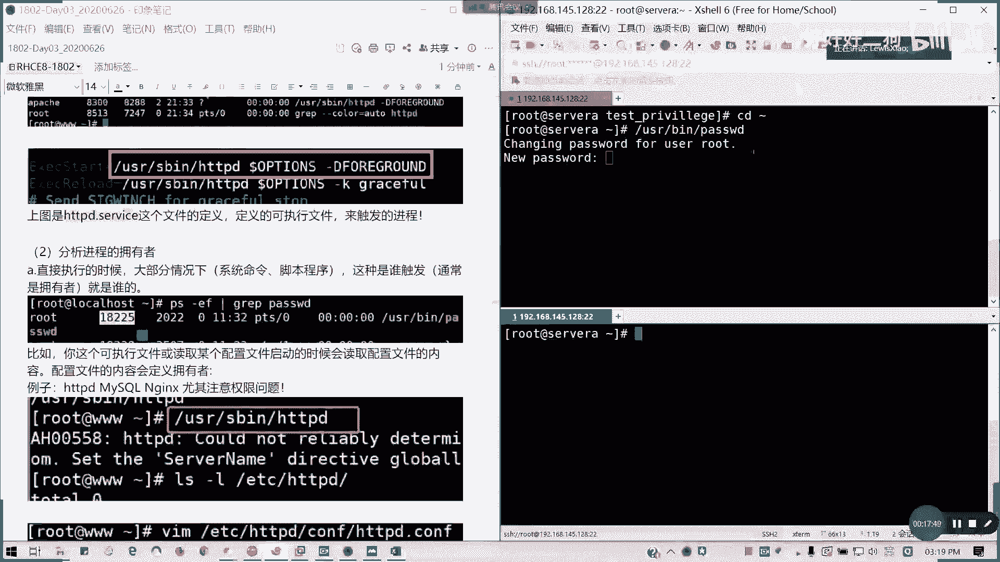
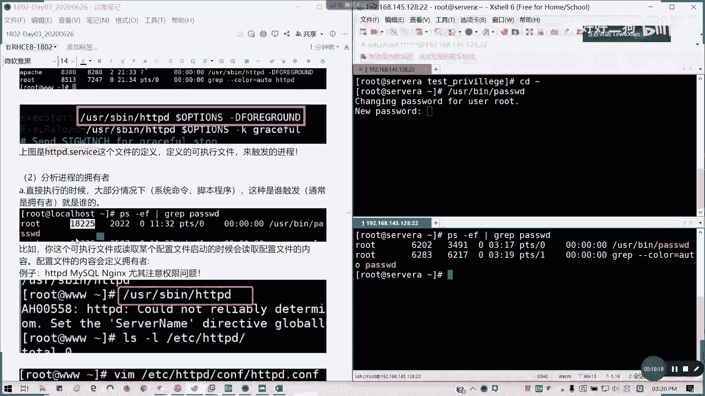
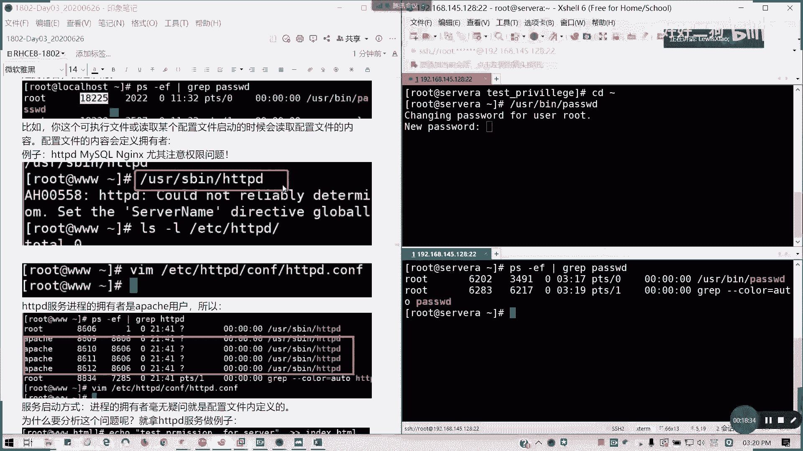
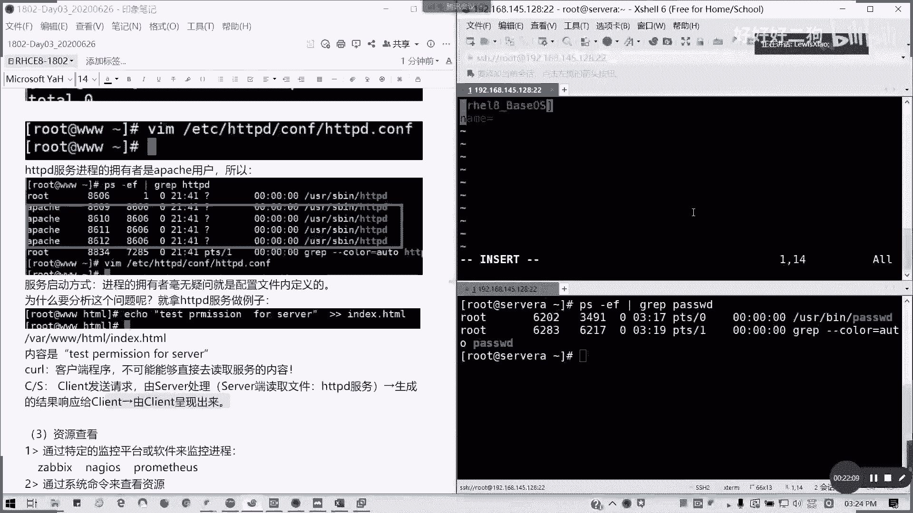
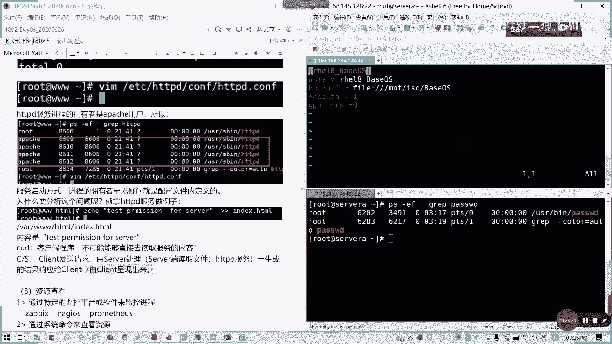
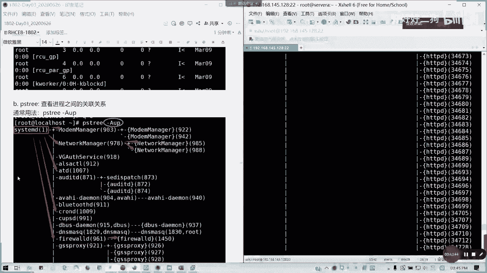

# Redhat红帽 RHCE8.0认证体系课程 - P15：15_Video_Day03_Ch08a_进程管理 - 好好好二狗 - BV1M3411k77W

北京时间03：03啊，下午的03：01啊，北京时间下午03：01，我们来讲那一个服务管啊，进程管理管理，监控和管理进行进程，什么是进程呢，我们从windows的系统看待。

是不是我们这里啊打开任务管理器对吧，任务管理器这里的话是不是在进程里一个个，对不对，包括应用，包括我们的后台，对吧，那进程呢就是相当于它是通过一个执行一个静，静态的程序，然后触发的，对不对。

我们我们运行一个程序是相当于多一个进程，对不对对吧，可以理解成静态程序，触发了一个动态的一个进程，它的进程是相当于是动态的程序，是一个文件，它是一个摆在那里的，对不对，这个能理解吗，进程怎么来的。

比如说像我们的我们的web web x是吧，我们的那个比如说我们的一个，就是说我们思科的一个网络会议的一个程序，当然像我们腾讯会议也是一样的，对不对，它是由具体的一个文件来触发的，对不对，像我们的这个。

我们这里的一个叫做腾讯会议是吧，打开文件所在位置，是不是他就通过这个文件，why we meet，点app是吧，通过这个文件来触发它的一个进程，它里面是不它下面是有运行的，那就三个对吧。

一个进程里面三个线程文件对不对，进程呢它是一个动态进程，然后他占用多少资源呢对吧，比如说像我们程序会议是吧，3%几，然后占用200多兆内存，对不对，那他网速它的它的磁盘，它网络等等对不对。

然后系统里面有多少进程呢，我们看这里啊，像我现在这台电脑，我现在这台机器，你看241个对吧，241个进程，3000多个县城啊，进程里面会产生线程的，懂吗，也就是它的紫禁城嗯。

然后我们还要知道哪个进程占资源多跟少，对不对，我们通常从cpu对吧，我们通常从cpu从内存，从硬盘的读写去考虑啊，从cpu内存硬盘读写的的这个情况去考虑懂吗，也就是说比如说到这个程序占了10%几。

比如说我们把它列出来，像这里换cpu占用比较大的这个录屏，对不对对吧，我图图这次录屏，然后像我们内存占比较大的，就是我的印象笔记跟腾讯会议，对不对，那硬盘通常因为我这里是s s d，所以占用免费太多少。

像我的带宽占用到大就是我们腾讯会议对吧，然后我们要考虑这个进程是不是运行是正常的，也就是我也就是我们的正常情况下，我这进程应该占用这么多资源吗，这也是要考虑的，对不对。

然后还有一些有没有不正常的精神存在，对不对，比如说木马病毒，还有什么挖矿的，僵尸的，这些会不会存在，也要想想，对不对，然后还有就是我们的现在的操作系统，占用多少资源，然后剩下资源有多少。

就重点是cpu内存硬盘，像我这台的话，我这台是我以前，就是说我现在之前一直在用的，一台二合一的平板，就是i7 的850内存16g，对不对，就可能内存16g呢，在我们教跑教学跟跑那个i h4 。

就是跑虚拟机的情况下，确实占用会比较大，对不对，但是在64g内存情况下，你看现在10%几对吧，但相信大家都基本上如果是16g内存，机器基本都跑到六七十的，有吗，有吧，至少有五六十吧，有吧。

只有g32 g的内存，应该就20%几十几，20应该有的，有吧，30多和45，你跑这么大，三三十的话4g45 g算成小的了，对不对，像我这台我又开开一台虚拟机，开的情况下，我就占用十个g，也差不多16%。

然后硬盘的话你让基本上对吧，因为是ssd的关系对吧，很小对吧，这网络带宽稍微稍微大一点，然后cpu呢因为是在录屏，包括我们在好虚拟性关系的时候，一直在30%左右波动，像其他什么显卡啊。

现在你看基本上我都读显是用不着的，对不对，读写用不着写，写的话用那么1。1丢丢是吧，所以有时候真的干预文的话，读写是用来浪费的，可以这么说，就我做纯粹的不做设计对吧，不做设计，不做影视。

就纯粹做运维的情况下，你是不是cpu，你这个g p u基本上又要浪费了对吧，因为现在的核显的性能也非常强，对不对，然后像像像那个以太网，我的网卡其实还好，现在只是用到了一个usb的网卡。

我没有用到它本身的，然后我的wifi也没用wifi，我这还是wifi 6的网卡，是英特尔的x201 ，所以的话其实呢现在磁盘的话，现在基本上都是很低的，你如果是用那个机械硬盘，你才知道什么叫延时大对吧。

像固态化，基本上我这个2年前的pm 961，还是跑的很顺的哈，然后然后然后然后这个是，就是计算机新配的这一个e t对不对，所以这这个配置呢，其实我觉得这个cpu稍微弱一点，其他都还好啊，都还好。

就主要我们这些资源是吧，资源像我们cpu利用率是35%，以前是80%的啊，然后他的那个进程线程数，然后还有内存是吧，我使用中是吧，9。5可以用这么多是吧，以前的话你看有点是吧，有点闷水，对不对。

那么硬盘硬盘的话，这个正常值通过1% 2%，3%，4%，差不多，正常的对，像我们的wifi或者是我们的那个有线网卡，都是一样的懂吗，我这是从windows上面，windows上面看这种情况。

其实做同样作为操作系统，我们的linux系统啊，linux系统也是要注意啊，也要注意这些东西，比如说我们进程的来源啊，继承来源，同样的啊，同样是分析在理中的懂吗，然后我们的进程拥有者啊。

就我们之前不是提到吗，我们在聊那个s u i d的时候，是不是聊到进程拥有者的问题，对不对，sd记得吗，早上我们聊的就说我们一个普通用户，我们加了s y d之后，他是不是用它的所有者来进行的。

那我们就聊到这个东西了对吧，进程在读取或者写入文件的时候呢，是采用这个拥有者的身份，就是他的所有者的身份来读取和写入的，所以呢我们针对需要读取跟写入的，这个拥有者呢，必须要有权限对吧。

你这个进程你你既然你是他跑的，那这个权限你基本的权限你应该有对吧，不管你的人这进程怎么处理，程序怎么处理东西，对不对，你没读个没写，那你进程是不是这样运行下运行不起来，对不对，比如说我们尽情的拥有者啊。

不一定是你执行这个文件的用户，比如说，我们root用户，去执行anges这个进程，那angels的进程应用者是不是root啊，不是啊，对不对，我们安装我们装angels这个中间件的时候。

通常它的用户是engines的用户懂吗，他会帮你创建一个engines用户，像阿帕奇对吧，我们的web服务也是用阿帕奇去运行的，它不会占用root这些用户的，他有一个专门的用户来跑这个进程。

明白我意思吗，像mysql也是一样的，它有个mysql用户，对不对，还有就是通常啊会在服务的配置文件，定义它的拥有者，比如说我们的h t t p d，像我们在那个h t t p d。conf。

它就会定义说你的拥有者是谁，对不对，就我们看到http d。cos这个这个配置文件啊，你们如果有印象的话，我们当我们词典会在讲啊，词典会在那个额外内容会讲，我们这个内容呢就是说我通常的定义的话。

比如说paw d是吧，谁执行就是谁的，对不对，这是讲到进程的一个拥有者问题，能明白吗，能明白吗，线上的我看一下啊，能明白吗，可以吗，可以打个打个一啊，就从linux我们ab已经说了，然后第c个dc点啊。

查看和验证这个进程会占多少资源对吧，这个在linux上我们通过top，通过ps这些命令都可以查，这么后面会再讲对吧，照样我们在不同的操作系统，也我们也要查这些东西，这是第三点。

第四点分析这个进程是否符合预期，什么意思呢，也就是说我这个进程我运行了，是不是按照我这个设想去走的，就是我看我实际上比如说我用1g内存对吧，我的这个占1g b，但是他偏偏就跑到了三gb对吧。

他一进程它降低可能这么大，那有时候你这个预期，你这个就说超出预期的一个，它的进程的一个执行操作，有时候会往往会伴随着大量消耗，你的一个系统资源，所以这时候我们要分析它为什么要占用这么大，对吧。

所以这个也是一个预判，我们对进程管理的一个中一个其中一点哈，就是运行，我明明就就我这我就一块大饼就好，你要看就好像我们人吃饭一样，我明明吃一碗饭就行，平常的饭量一碗饭，你为什么现在吃两碗三碗，对不对。

同样的道理，你要去预判，你要去分析到底这个进程是否是在自己，在我们理想的范围内，就我们市场范围内，如果超出号，我要看为什么，第五点，我们要看一下整个系统里面的技能数量状态，以及它占用的一个资源排序。

资源排序呢比如说像cpu按cpu排哪个降多是吧，内存哪个占多，硬盘哪个是最好，i o的对吧，网络也是哪一个是在网络比较多的，然后呢通常我们就是这些进程啊，有单吃cpu的，就是那个计算型，对不对，计算的。

然后吃内存的对吧，比如说他一开始要占有很大的空间是吧，然后然后其实就其他的都没有，然后硬盘的经常读写，对不对，经常读写数据的，那就是还有网络型，就是吃带宽的懂吗，然后还有就是你既然你这些进程你执行过。

你要看看你剩下的资源有多少，懂吗，你这个你系统肯定是有预留的，对不对，你不可能说诶我机器我就配一个这个8g内存，我这个进程偏偏跑到了78g，那你这个系统没用的话，你系统是不是其他你不用跑了，对不对。

你的你的你的环境，你的程序，你的环境，你的这些对吧，你的守护进程，你后台这些东西你还要占内存了，那你不可能说八区全部给他跑满，那跑满我七七都跑不动了，就像人我们超负荷工作一样，你是不是就抽不开身。

明白我意思吧，所以我们系统资源啊，当前是否足够，如果以及未来收入是否会增加，或者是我能爆发，我的那个就是我们这种并发啊，不是爆发啊，我们并发能不能支撑到哪一个服务，对不对，有时候像有一些情况。

我们的进程会产生并发，也就是说我们可能流量大了对啊，或者是我们突然间多人访问，那会不会产生一个高峰，那这高峰你能不能撑得过去，所以有时候你这真的就是说，我们有些配置不好的一些环境呢。

就我们进程爆一爆的话，你系统我们马上会死掉，对不对，特别是windows，很明显linux的话就会产生，比如说你的cpu读取延迟大，然后i o硬盘i o出现卡顿，对不对。

或者是你的内存已经开始吃你的交换分区了，那这种种种情况呢，就证明你的资源已经不够了，明白我意思吗，就像我们的电脑配置一样是吧，你你的电脑配置，你的内存，包括你的硬盘，就决定了你的资源有多少。

你的运行效率可以到哪哪里去，可以理解吗，所以为什么。

一开始我我说这个环境我要强调环境啊，强不强调环境的话，你们就拿一台4g内存拿给我跑，四给我给我跑，这个好一个虚拟机，你是想死呢还是想死呢，还是想指呢对吧，现在你看笔记本电脑都是8g起步了。

以前四局起步还大有大有的在在更早以前，因为之前的系统是系统还没那么是吧，其界面还那么没那么丰富，功能没那么强大，之后你像以前的windows 95，你看像这样一开始的3。1。

你们可能现在很少人去接触那些老系统，像我的话，我是从dos开始玩起的，我从95年开始接触电脑，然后玩到现在20几年啊，就接触现在20几年，然后小时候电脑课是真的是有时候太调皮了，然后一开始就是电脑用。

把自己电脑做转向病毒啊，或者这些的，我我是从3。2，windows是从3。2开始玩起的，然后9598这个玩过，像以前，你看有时候真的像dos，640k内存能跑起来对吧，像现win 98的话。

你16兆内存都能跑，但现在你看看一个win 10，你至少每次距离跑得起来吗对吧，这linux现在是一样的，好我们讲完我们要分析我们要看待的一些资源，过后呢，我们看如何触发进程啊，如何触发进程。

进程的方式有两种，比如说我们可以执行一个二进制文件，比如说我们pass w d，对不对，我自己清一下屏。

然后切换到加目录，比如说我user，我们执行一个绝对路径paw d，对不对，对吧。

直接一个进程之后，我们打开一个新的窗口啊，我们打开一个新的窗口，我们再复制一遍。

然后复制一个绘画，那么看一下啊。

我上下对比会更明显啊，左右的话有点小，然后我p s杠e f。

我们看一下p s命令，可以查看它对应的进程的grape，grape是截取的意思，也就是获取它的所需的字段。

我们就获取它的pass w d，这个程序的字段，是不是我们这里是不是已经在执行了，然后它的进程id是6202，对不对，像我这里的18225。

对不对懂吗，然后以root用户来执行。

看到没有，p s是查看进程的一个叫做process state进程状态啊。

还有我们启动一个服务，比如说我们这里的http d，我看一下这里亚美元，好像这里不知道装装不装得了的，这服啊，没有配的话，估计装不行啊，这里因为我们没有配啊，没有配没有注册，所以的话默认样本是不能用的。

所以我们要自己挂一个样本啊，比如说我们这里啊，我这里我就不演示了，就这里的话，比如说我安装了一个h t h t t p d啊，你装了一个web服务，然后同启动后同样触发进程，对不对对吧。

我们这里题目the system star之后，我们这里图，然后我们看到是不是，它会产生一系列的一个进程啊，懂吧，同样在http第一点service这个文件里面也有定义，它启动是怎么启动的，懂吧也有啊。

这个我们大概知道一下就清楚了，好像大家没有什么问题，那我们继续讲，然后呢接下来我们分析进程的一个拥有者。

我们回到这个图来啊，飞机的拥有者大部分呢直接直线的时候，大部分情况下随处发，就谁的懂我意思吗。

然后呢还有啊，就是你这个执行文件。

如果某读取某个配置去启动的情况下，它会读取配置文件内容，然后配置文件内容就会定义它拥有者，比如说我们刚才讲的h t t p d。

像angels。

对不对，像angels，然后还有那个mysql。

对不对，但我们这里图不用看了吧，他这里的话你直接执行是执行不了的。

然后我们看这个阿帕奇，我们看这个http地点cf这个文件对吧，看这个文件之后，我们会看到它的进程拥有者是阿帕奇用户。

但我这里没有装哦，所以没有装，我回头我待会在下课的时候。

我我挂个镜像装就装起来，大家一看就知道了。

好吧，所以我们的h t p d进程是阿帕奇。

对不对，然后服务启动机器啊，我们所以呢我们的服务启动方式呢，进程的运用作者对于我们服务来说，它是配置文件里面定义的，而不是我们谁就谁执行，就是谁的。

这不不是啊，为什么要分析这个问题呢，是不是，比如说我们就拿我的web服务做例子，我们啊比如说我就检查。

我就检查，我就简单写一个首页文件，那访问呢它是这样子的，我们通常我们的网页呢是访问，它是通过服务来访问，对不对，通过服务的访问，不是我们通通常的访问网页，我们通常是通过服务去访问它的内容。

而不是说你直接去获取它的文件对吧，像我们的web我们去访问一个网页，这里的例子啊，就是相当于一个客户端和服务器是吧，我们客户端我们访问一个网页，由服务器来处理它。

读取文件，然后通过http服务去读，然后生成的结果响应给客户端。

然后客户端展现出来，我这里要不我先挂一个镜像吧，挂一个镜像，然后我把那个样原配起来。

这样的话我演示会清楚一点，好不好，就刚才这么说的话，好像大家还是有点雾水啊。

我先把镜像挂起来，这里挂了啊。

挂了个镜像，然后我们这里的话，我们临时冒一下好了，我把镜子这个停掉，然后mt我们创建一个mit，创建一个so吧。

就先先教大家怎么挂载啊，我们挂载光驱是挂载sr啊，不是m t，我们先创建挂载点，比如说mit等里面so是吧，然后。

mt对吧，dvf 20，这是光驱的一个设备，我们临时挂载就可以了，mt s o是吧。

它是一个读就写保护，然后只是只读的。

然后我们配置一个样圆，在那个linux 8里面的配置，两配置两个，一个是有bao s，一个是trap，因为它是分开的对吧，它分开的两个，那我们看一下哈，etc，要点rap选d。

然后我就写写成一个就可以了，教大家如何配置样圆哈，i选l8 ，这个我们在后面第14章。

安装跟管理软件包的时候，我们会讲到，但这里我先配啊，然后呢我们主要是一个name是吧，我们要配置两个，一个在807跟八是不一样的，八是分为两个，一个叫基本系统，一个叫应用流。

也就baos跟af dream，如果七的话，就总统称就一个就够了。

我们这里是配置本地样源啊，nb等于h18 ，贝斯o s，然后我们的地址我这就有不要高亮可以吗，no h l不要让它高亮，然后我诶我测我又撤回来了，等一下啊，name等于h18 base os。

然后我我们的记忆本url就这我们这里用fire，为什么本地对不对，我们用本地文件的样子。

费尔协议两小斜杠，但是因为我们这个挂载点是吧，我们从根开始，所以这里要三个斜杠，我们直接挂一个挂载点，就是m t s o，然后里面有个叫bao s光盘的目录结构。

里面有啊，v sos，然后呢是否启用是吧，很像之前有人在群里面问的是吧。

enabled，然后所说的少数低，对不对，不自行完整性检查，等于零，然后同样我们把这几行我们用5y y，还记得v i n是吧，1234。

我们5y y，然后在下面p一下对吧，你复制了吗。

然后这里我们改成叫f dream，就是我们的应用流，它是把这系统组件跟我们的应用组件是分开的，然后这里呢这里留个空格给他啊。

然后这里的话我们就叫f dream，保存退出。

然后我们我们这边，我们就我们在八里面是用dnf的或者样都可以，但是现在通常改名f dnf，dnf这个在此事上会讲。

当然这个也不是地下城与勇士，dnf也不是毒奶粉啊，说不过我们俗称这叫毒奶粉好吧，然后呢那个dnf是吧，呃我们先清掉原有的缓存，然后呢dnf my catch，我们新我们我们新建一个缓，新一个源数据缓存。

那我们就可以我们看一下dnf rap list，对吧，我们获取到6000多个包，被soo s1658 ，然后进入流4672，那我们就可以装一个，我们这里例子的h t t p d服务的好吧。

只要我们让员或取得到就可以了，这个内容呢我们在14章会讲，这里我再强调14章会讲这个详细的配置，但现在给大家有一个留一个印象哈的印象，那我们这里怎么装服务呢。

直接d n f install杠y就是他问询问的时候，我们直接全部都是y过过，然后h t t p d，可以了，然后我们现在我们看一下啊，现在我们还没有看到那个h t t p d服，对不对，现在没有啊。

那我现在把服务起来，服务怎么写，我们下一章会讲的就是system control是吧，star h t p d，如果这样以able的话，你就又启动型的话。

在八里面是可以system control enable，然后杠杠n是可以这么做的，但是在七这条命令是行不通的啊，我们回车，然后我们看一下进程是不是开始来了，还没起来啊。

是不是h t p h t t p d的竞争起来了对吧，但这里好像还没启动，还没起完呢，来我看一下对吧，它产产生了一系列的一个子一系列进程，对不对，懂我意思吗，就在这里，然后如果你直接执行的话是吧。

直接执行不带参数，他会报错的，我这里要注意一下权限问题，他这里的话我们已经在执行了啊，我们不能直接说这么这么启动服务的懂吗，这里现在已经在执行，所以的话我们我们可以stop掉，我们再看一看。

在启动的话肯定会报错的，现在是不是一个镜头没有了，除了他grape之外，我这样直接服务启动的话，肯定会有问题的，他是找不到，他会找不到，你这个看一下啊，这样启动器没有问题。

如果是我们我们没有指定的话对吧，它其实也是调用这个文件，这样启动问题也不大，然后我看他进程起来没啊，同样建立起来，但是他没带任何参数啊，通常我们还是不要这么做啊，对吧，他会那个hdb。

service是对它不能，他那个就是得他服务控制不了这个进程的，所以我们还是用system control来，我们此此刻就q2 算了，然后我们重新启动这个进程，从启动这个服务。

从记得大家不要从直接可执行文件去启动，因为它这个参数会调用，会有问题的，我看有人是不是要想睡觉了，对不对，然后呢像我们如何去定义进程的所有者，我们直接看一下这个文件。

v i m e t c http d是吧，cf我们看这个是我们阿帕奇，我们的h t t p d服务的，h t t p d的那个配置文件，对不对，在这里它定义的端口，定义的配置文件目录。

然后还他还定义了我们的看到没有看到没，它的用户跟左是用阿帕奇来进行的，所以我们看到这里，那就知道了吧，懂我意思吗，然后呢，比如说我们就写一个配置文件，来让我们怎么调用，对不对，我们那个就echo。

test page，然后直接追加到vr默认目录vr 3 w html，它默认这个页面是空的，就是这里的话默认主页是空的，没有文件的，我把它追加过来，然后我们看一下我们在别的机器能不能访问啊。

我们在本地试一下能不能访问就行了，q q y l，然后这样server a我们社会并没开哈，对吧，如果我们写入一个默认主页之后，它是通过读，用h t t p d服务来读取这个网页文件，解析出来返回结果。

然后给了客户端，我们才能访问这个页面，对不对，而不是说我去直接去读取这个文件，懂我意思吗，它是通过进程来解析这个页面的对吧，这就是一个我们的一个过程啊，就进程用着我们的一个例子分析的一个过程，能明白吧。

然后接下来资源如何查看资源，查看我们查看资源，我们有特定的一个监控平台，像大家接触过，像我们单位里面用过的，像javis对吧，javis，然后那ngls是吧，普罗米修斯。

就这些这些这监开源监控平台都很多，还有像我们购买的项目，比如说像贝塔啊等等对吧，都有这些监控工具，然后还有呢就是系统命令p s p s区，还有top，还有一个就是我们用脚本也可以来写对吧。

在这里我们先不谈脚本跟不谈监控平台，我们来谈命令啊，我们讲三个命令，p s p s p跟top，p s呢我们如果不带参数，我们这里关掉哈，p s如果不带参数的话，我们是显示当前终端的所有进程。

对不对，我当前终端这个p t s杠铃虚拟终端零，我们是运行了四个进程对啊，包括我们切换用户啊和best对吧，我们切换用四个，因为刚才我没注销嘛，所以说就就总共四个进程，我们英语线的p s命令对不对。

p p p s命令，然后有两个batch在，然后有一个切换用户在他这里呢，pi我们要解释一下它是什么意思，p i d就是我们进程的唯一的一个i d值对吧，linux通过进程id来识别每一个进程啊。

而不是通过名字，因为你通过名字。

一个进程你可以运行多次了，懂吗，然后t t y呢就是一个动态终端，也就是在哪个终端上面触发的一个进程，如果进程它是依赖某一个虚拟终端。

那如果这个虚拟终端一结束，那那我是不是所有精神精神都是结束了对吧，然后如果是一个问号。

如果是一个问号，如果这里啊是问号，那代表他是跟中端无关的进程。

也就后台服务，懂我意思吗，后台服务不依赖于任何终端，你关掉它照常执行，对不对，然后time进程触发开始执行时间，cmd它证它证明它写明了进程的起源。

也就是说它是通过执执行哪一个文件得到的，我们可以用位置去查看，对不对。

对吧。

对吧，对吧，我们都可以查，对不对，他的命令就是它的来源。

然后如果我们要查看比较详细的信息，我们可以用列表啊。

ps杠l f对吧，这里呢，我们要看一看什么东西呢，像这里p i d和p p i t都知道吧对吧，它的进程id以及它的负进程的id，也就是它上面那一层进程的，跟它有关的负进程的i d，然后他ui d是吧。

u i d，然后我们就还有这这些，我们的那个我们的优先级，我们的nice值是吧，这些话我们待会解释t t y对吧，都有，那我们先看一下我们linux进程的一个状态，这个可能比较枯燥。

但是大家要要要知道啊，要知道我们进程之内有哪些状态，包括我们p s要怎么看的，对不对，进程哪些状态我们看一看，首先是运行态r time，如果在这里啊是运行状态的话，他就说进程正在cpu上执行。

或者是等待运行，处于运行中对吧，精神可能正在执行用户进程历程或是内核历程，也就是我们系统的一个调用，然后呢或者泰语排队进去了，就是一个r状态，懂吧，running，那我们还看到这里有几个s的。

就是睡眠状态，睡眠状态就是你的任务是在rtable的啊，rutable table，也就是他在等待某一个条件，比如说我们的信号，我们的硬件需求，或者是我们的系统资源访问。

那等就是比如说我们在镜头上等我们，那是不是等我们，比如说等我们输入这个命令呢对吧，或者是想一个请求呢都可以，然后如果当这个事件或信号满足这个条件的时，候，他就回到运行状态，回到r状态，懂我意思吗。

此类不是睡眠，它是在等待对吧，然后呢如果是d他也在睡眠，但是他就不会响应任何信号，这种事可能就是说那个仅在进程中断，可能会导致意外设备状态情况下使用，就是它已经异常，它不会响应你的东西了。

那我们这种就叫做第一状态，k状态就不可中断，但它有所修改，就是说它在允许等待要退出的信号对吧，要被中断，他这种呢可将中断的进程，切换为我们的不可响应的状态啊，睡眠的话有s dk，那我们还有一个t啊。

t的话有两个t，一个叫tan pass stop，也就是进程被停止，通常是通过其他进程发出的信号，如果要如果它也可以通过啊，进程这个如果是我们进程处于一个他stop，也就是任务停止的状态呢。

它是可以通过另外一个信号，返回运行中状态对吧，也就恢复执行，这是可以的，然后还有一个就是临时停止的，就是tx trace，也就是我们调试我们被中断了对吧，这种比较少见，通常我们就是第一个为主。

然后还有就是一个江停，江停的话，就是你，家庭的话就是那个退出的时候，我们紫禁城退出的时候，给附近城发的信号，就除了他p i d之外的所有资源都被释放掉了，就是他准备这个我已经执行完了，我要释放释放了。

那我这时候我要发个信号说诶说说老爸，我这个执行弯道，我经我要把资源已经放放出来，对不对，这s zombie，然后还有一个叫做已经将死状态，也就是附近的清理获取子进程结构的时候，那我下面无论值不值完。

它就会被释放掉，那是不是相当于一个死进程，对不对，那死进程的话他不会再认列出来啊，不会再被人列出来，懂我意思吗，江停有分两种，一种是要释放主动的，一种是有附近存在，清理的时候，我就把它清掉了对吧。

可以理解吗，然后我们来看一看啊，看看这里这个什么意思啊，p i d尾标是否这样说了，p p i d附近城就是他上一级的，通常我们附近城会触发对应的紫禁城，就是说它比如说我们是一个操作系统。

它就有多个是吧，像我们system d，然后它们就会出一层层触发下来，懂我意思吧，然后p r i是进程优先级，进程的真的优先级就是调优，它调控物的优先级呢是等于内核分配的优先级，加上一个手动可调节。

跟那叫做nice值，后面我们后面会再讲一个叫nice值的东西，所以我们手动调形成啊默认值为零啊，它是调它这个是可调的，默认值为零的，然后他的那个一开始的一个内核分配的优先级，默认为808 十。

然后它的nice值呢可控范围是-20~19，负数代表它的优先级越高，懂吗，数字越大，优先级越低，然后通常来说我们仅仅仅我们要调整它的进程，优先级段，只能调整nice值。

对普通进程它的那个优先级周期为八零，所以的话我们还要加一个，我们后面其实我们如果在七里面，我在七讲到精神的时候，其实我们的值是叫做40~139，4139这么大的一个区间，就我们调用过的进程池。

通常问的都是八零啊，不用去管它，不过现在呢，其实优先级对系统调度的影响，已经没有以前那么大了，因为现在的硬件都是过剩的，对不对，以前我们还要说哎我为了错峰是吧，错峰执行命令。

那我们把进程稍微有一些紧要的优先级高，我们调低一点，怎么把把数值调低，然后把那个进进我们就没那么重要的，我们调高一下进程，但现在其实已经没那么重要了，因为现在的那个其实那个cp已经发展很快的。

对不对，所以就我们的那个cpu调度能力，已经是非常大的一个提高，所以的话就没必要去动这个东西，s time就是我们触发的时间，刚才讲过，我们平时会多用我们的au x对吧，杠aos在不在干中没问题对吧。

我们列出所有的au差啊，我们列出详细的一个信息，这里好多对不对，这里好多对不对，我们从这里开始au差au差，包括列出我们的用户了，然后还有他的状态啦对吧等等这些，然后他比如说我们这个进程执行用户。

他的p i d，我们第一个进程是永远p i d为e的进程是system，第二我们内核调用的一个系统手后台守护进程，原来是要it，对不对，就系统初始化我们整个大环境的一个进程。

现在叫system d对不对，然后我们cpu占用多少，我们内存对吧，我们预分配的空间，我们资源占用的量，我们的终端是吧，问号是不是后台进程啊，你只要哪怕关着终端，你没怕，你说没事，然后我们状态是吧。

开始时间，然后它运行时间，还有它的命令对不对，这个就大概讲一下，我们通常啊ps的用法懂了，那接下来我们讲进程数，进程数的话就是看我们的进程之间的关联，杠a u p对吧，就像一棵树一样。

这个数数图的话就看得非常清楚，对不对懂吗，它所有的进程都是从system第一我们用杠杠a是吧，然后带一带我们的那个用户跟进程的，紫禁城的一个参数，那我们其实呢就是显示出我们的进程之间的关，系。

就相当于一个数是吧，我们的一个思维导图，对不对，像我们一开始，我们系统都是由一个system d进程id为一。

可以不用加杠a u差，杠不杠a u差都没事啊对吧。

可以加可以不加，在这里我们是一棵树是吧，system一开始，然后它有几好好多的模块，像我们的network manager，model manager，是不是像我们接下来一个叫做http d。

也是他属下的一个紫禁城，对不对，然后紫禁城里面有多个服务，对不对，它有括号，它会我们加了a u p之后。

它会显示我们p i p p i d p i d对不对，他会写写出pad型用户是不是u跟p知道吗，它会显示我们的用户。

用用户跟我们的进程号，所以这个会列的非常清楚。

懂我意思吗。

然后它下面还有哪些紫禁城，就这样画下来，懂我意思吗。

然后我们还有一个top，top是我们动态查看系统资源，怎么动态看呢，像这里我们当前系统时间是吧，然后一开机开了多长时间，有多登录多少个用户，他cpu的平均负载率，这里平均负载率呢是一分钟，五分钟。

15分钟，它的延迟懂吗，它一个负载率，我们现在没什么进程，所以都是零啊，就没什么，就基本上没什么进程跑，所以的话他的那个负载，它的那个单位是零，然后还有多少个任务在运行，对不对，然后有几个在运行中。

几个睡眠，几个停止，几个暂停，对不对，后面解释不完啊，我们cpu占用多少是吧，就同步的多少，然后多少个and i也就nice就是优先级的啊，然后还有就是空闲的有多少对吧。

有几个在等待的等等这些还有一些是睡眠的，那么我们的内存是吧，我们内存一共多少，然后呢多少是多少，空闲多少释放多少，用多少再用，然后多少是一个缓存把我们sy分区，对不对，然后下面呢。

下面就是我们的p i d，我们的我们的进程id用户，然后我们的优先级是吧，编辑nice值，它的用的虚拟虚拟内存都多少，它的资源占用资源数，它的一个共享空间数，以及它的状态cpu内存，对不对。

我们通常还有后面还有一个time跟command，放大来看就清楚啊，放大来看就很清楚了，对不对，这才是完全的一个界面，好吧，我看这刚才那里测一边了。

懂我意思吧，通常用法呢是top是吧，杠低指定时刷新的时间间隔，比如说我一秒钟刷新一次，然后刷新次数为一对吧，它是这种退出的对吧，然后如果是top杠c的话，就显示详细命令，然后一直在刷新。

就一秒钟刷新一次，对不对懂吗，我们通常是不是有这样的看动态进程的一个，看看进程动态值的一个用法，对不对，无论从66。0708点都是一样好吧，那我们先我们上半部分，第八章上半部分先到这儿。

我们稍微休息十分钟，四点钟我们开始讲作业控制啊，作业控制这个的话就是一个我们座椅的一个优，先，就是我们前后台啊等等这些。

