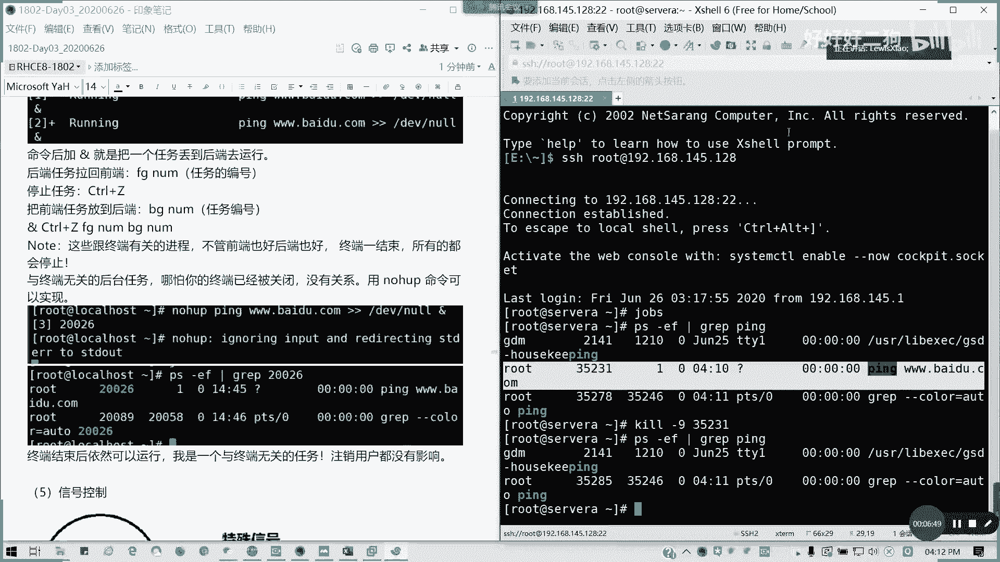

# Redhat红帽 RHCE8.0认证体系课程 - P16：16_Video_Day03_Ch08b_作业控制及信号控制 - 好好好二狗 - BV1M3411k77W

北京时间4点02分，下午的4点02分，我们还有一个小时时间，我们看一下作业控制以及我们的信号控制内容。作个共词我们首先来看在一个中终端的前端呢，我们前端是不是通常我们只能运行一个进程啊？

对吧只能跑一个命令，对不对？然后呢，如果要同时多个任务，我们lindux呢是一个多任务的系统，那如果要同时做怎么办呢？我们现在进程里面，我们在一个系统里面，我们分前后端是吧？

前端呢就是一个交互式进程任务，但是我们只能跑一个一个窗口只能跑一个啊，我是应该是这么理解，然后呢，后端呢就是不需要交互的任务就扔到后面去。对吧那怎么样才把一个肉丢到后端？

看一下啊。哦，等一下，我桌面公享暂停了啊，稍等一下。稍等啊，我这边看一下共享，你等一等啊。

好，能看到啊能看到桌面共享了啊。我们看一看我们看到这里啊，我们通常啊一个终端的前端只能存在一个进程，对不对？但是多个任务怎么办，对吧？那我们现在如何把任务丢到丢到后端去？

比如说我们现在拼一个百度点com。我现在就把他听的结果全丢弃掉，因为我们不需要在屏幕上显示啊。然后我们加后面加个N的话，是不是可以放到后台运行了？我们所有任务是吧？如果有有基础的人应该知道。

我们加个N的话，就是把我们的任务放在后台运行，然后它只会提示一个。它只会提示一个就是当前任务的一个序号，然后加上你的一个进程的ID。对吧35181。电话啊。好，我们现在啊我们继着讲课。然后呢。

刚才临是有点1一点点急事啊，刚刚快一跌到了，我得付一下运费。那我那现在是这样子，我们现在丢到那后面进程之后呢，我们看一下ds是吧？我们现在一直是进程这边后台运行，我们前端是并没有任何显示，对不对？对吧？

并没有这样显示的那我们比如说我再执行同一条任务，然后我可以看ds是不是接下来对吧？继续有一个新的进程号，新的进程号是3520135206，对不对？然后一直在进行。我们任务我们命令的加一个N呢。

就是把一个任务丢到后端去，懂我意思吧？比如说我有一些就是说前端我还要执行别的任务，对吧？那我就把它丢到后端去，然后他如果会自动结束还好，如果不会自动结束呢。

怎么办？对吧？有两种办法，一种呢就是把任务拉回前端来，对吧？我们通过FG。然后后面加我们的任务进程号，不是他的ID哈，不是他ID啊，懂我意思吗？比如说FG1是吧？他只把第一个任务拉到进程来。

然后我只怎么停止任务呢？cttrol加桌面在我们键盘的ctrol加Z对吧？它就提示你这个任务已经stop掉了。那我们现在ds是吧？第第一个已经stop掉了，对吧？🎼然后我们把我们把它拉到前端来FG2。

然后我们再ctrl到这就我们就完全把它停掉了，对不对？

两个任务已经停掉了。然后我们还有一个就是如果要把它放到后端去，就这种B区懂吗？把前端任务放到后端，就B区，后面加一个。数数字就我们jos前面的这段数字，不是它的这个进程号的，懂吗？这注意啊。

这些我们跟终端有关的进程，无论是前端后端都好，只要终端一结束，它所有的都会停止，对不对？刚才我们说了跟终端有关的。就是这样，但是如果跟终端无关的后台任务，哪怕关闭没有关系啊。

我们用no hub就可以实实现一个后端的任务啊。

上次有人问我了啊，no hub来，同样我们执行任务之前。我们拼一个百度点com，然后丢丢到no now是吧？那我用no hub变成一个后端任务。对吧no in growing input就是忽略输入。

然后重进向。从定向错误到那个标准输出，对吧？然后他就一直在那里进行执行的。然后jos它是一个它这里没有没有加减的对吧？要加减，它是丢掉一个后端的一个东西了。那我们现要把这个终端关掉。

那我们重启一个终端出来。超市在哪里？阿来。

我们把这个终端关掉，然后呢我们再重启起一个终端。

我们来看一下啊。现在看不到啊现在看不到，但是我们可以查我们的进程，对吧？我们刚才这里我们不知道它的一个进程ID号，对不对？我们刚才拼的话，我们没有去看它的进程ID号，我们也可以通过我们截取它的一个名字。

PS。杠EF我们可以看它进程剧信息grape拼。有没有看到我们这个百度控这个还在运行啊，上5231对吧？就是我终端，我刚才关掉之后，它是不是一一直A行，所以它的那个TT它的那个终端所在的终端的那个编号。

它是显示出了一个问号，对吧？那这样的话就跟终端无关了。那我们现在我们要怎么结束它，对不对？我们这现在结束的话，我们就通过信号控制就结束了。通常我们是Q-9，就当它立即结束，然后后面是是加上我们进程号。

就可以了，这个就我们就已经结束掉。这里我们会就就讲到下面的一个叫做信号控制。

C号控制呢，比如说我们进程A在执行执行的后，我们要进行对它进行一个干预。我们用Q命令或Q2命令Q2就是它批量，跟它有关的，全部结束，Q只结束一个啊。然后它是然后我们有两个特殊信号，一个是9，一个15。

它默认定义呢。基本进程管理下，它默认定义呢就是0到20。然后通常我们有用的就那么几个啊，又用这么几个。大家看一看。首先一是挂起啊，一是挂起，然后呢，就是相当于是一个暂停，对吧？暂停，二是键盘中断。

三是键盘退出，我们这样不常用，我们常用是9跟15，九是中断无法拦截，也就是我们强制对吧？强制终止Q-9对吧？Q2-9都是一样，无法被拦截忽略的，就直接相当于我们。进着作者，我们打个比喻。

就是把电脑强制关机。把电源。懂吧，马上你给我停下来，对不对？然后15呢是正常终止，就友好方式，它允许自我清理，对不对？如果你干15的话，它就会。哎，我就先做好善后是吧？我就得把东西保存起来什么鬼的。

然后再然后然后再把进程给停掉。对吧。明白我意思吗？然后十八就是继续就是把进程恢复，就是恢复。然后呢，19就停止，二十是键盘停止。但这这个这个通常啊通常我们很少用，我们用的最多就是9跟15。

然后零是用于测试的，就是证明这个进程在不在，对吧？一是重启，相当于我们重新读取一个配置文件，懂我意思吗？可以吧。这个就简单讲讲带过啊，简单带过我们考试当然不考这些了。考试不考这些。

但是你要了解我们进程是怎么跑的。然后如果去如要去切换我们进程，对不对？那我们这一张的。进程管理对不对？我们刚才讲到了这些东西。都有啊，对吧？我这里就不再进行小结了，对不对？通常竞争出发方式怎么样？

然后拥有者是谁？然后还有就是我们的权限问题，进程如何查看，如何进行任务控制。能明白吗？这张如果明白，请打个8。

现场同学明白的，请举手。不明白的可以提问。12345OK全都OK。有疑问可以提。像我们之前的考前辅导，也有人在那个啊。

