# Redhat红帽 RHCE8.0认证体系课程：P16：作业控制及信号控制

在本节课中，我们将要学习Linux系统中的作业控制与信号控制。通过管理进程的前后台运行，以及使用信号来干预进程，我们可以更高效地利用多任务系统。

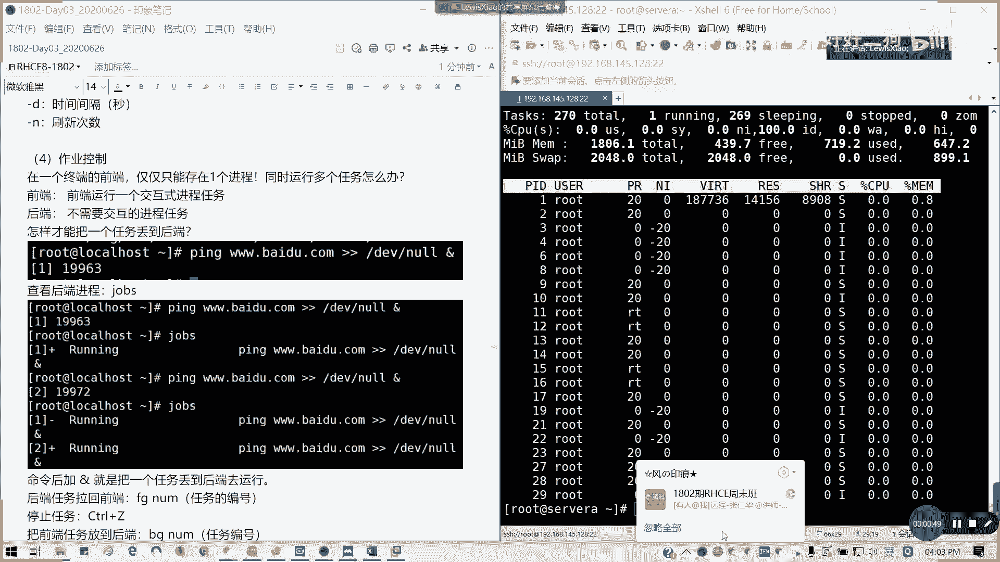

## 终端的前端与后端

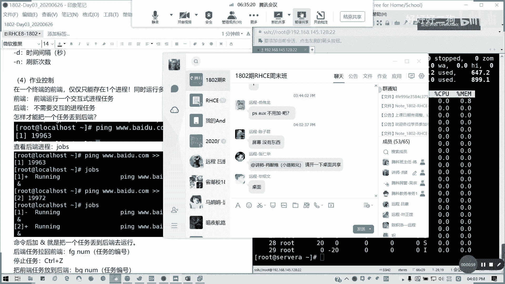

上一节我们介绍了进程的基本概念，本节中我们来看看如何管理进程的运行位置。在一个终端的前端，通常我们只能运行一个交互式进程。Linux是一个多任务系统，如果需要同时执行多个任务，就需要将部分任务放到后端运行。

前端运行的是需要交互的进程任务，而后端运行的是不需要交互的任务。

## 将任务放入后台运行

以下是实现后台运行的方法。

*   **使用 `&` 符号**：在命令末尾添加 `&` 符号，可以将任务放入后台运行。系统会返回一个作业号（job number）和进程ID（PID）。
    ```bash
    ping baidu.com > /dev/null &
    ```
    执行后，任务在后台持续运行，前端可以继续执行其他命令。

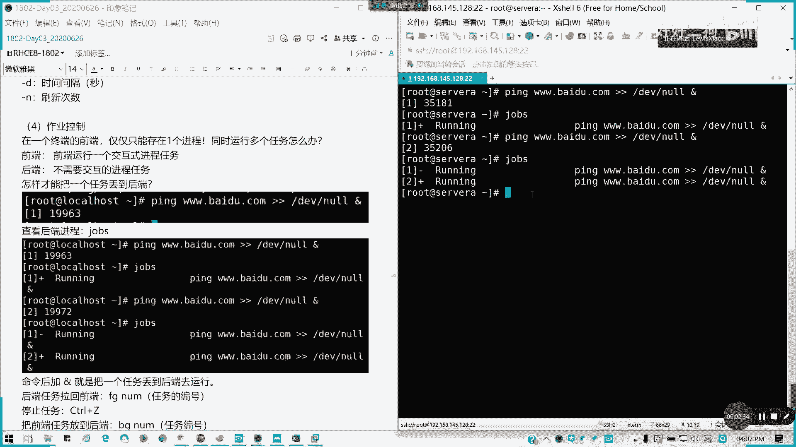

## 管理后台任务

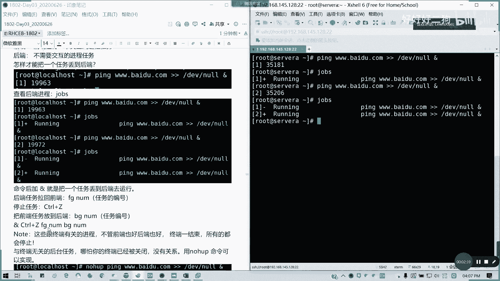

将任务放入后台后，我们需要知道如何查看和管理它们。

以下是管理后台任务的常用命令。

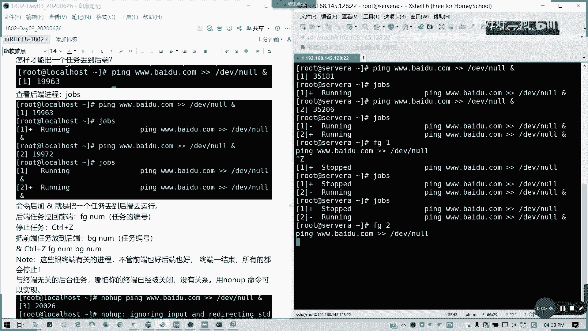

*   **`jobs` 命令**：查看当前终端会话中的后台任务列表及其状态（运行中或已停止）。
*   **`fg` 命令**：将指定的后台任务拉回前端运行。命令格式为 `fg %作业号`。
    ```bash
    fg %1  # 将作业号为1的任务拉回前端
    ```
*   **`Ctrl+Z` 快捷键**：暂停当前在前端运行的任务，并将其置于后台（状态为“已停止”）。
*   **`bg` 命令**：将一个在后台处于“停止”状态的任务，转变为“运行”状态。命令格式为 `bg %作业号`。
    ```bash
    bg %1  # 让后台停止的作业1继续运行
    ```

**注意**：使用 `jobs`, `fg`, `bg` 管理的任务与当前终端绑定。如果关闭终端，这些任务会被终止。

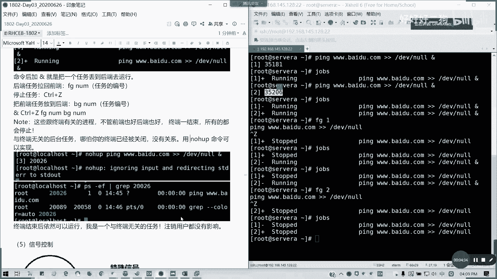

## 创建与终端无关的后台任务

上一节我们提到了与终端绑定的任务限制，本节中我们来看看如何创建独立的后台任务。如果希望任务在关闭终端后依然运行，可以使用 `nohup` 命令。


`nohup` 命令会忽略挂断信号（SIGHUP），使任务不会随终端关闭而结束。
```bash
nohup ping baidu.com > /dev/null 2>&1 &
```
此时，即使关闭终端，该 `ping` 进程也会继续运行。其终端信息（TTY）会显示为 `?`，表示与任何终端无关。

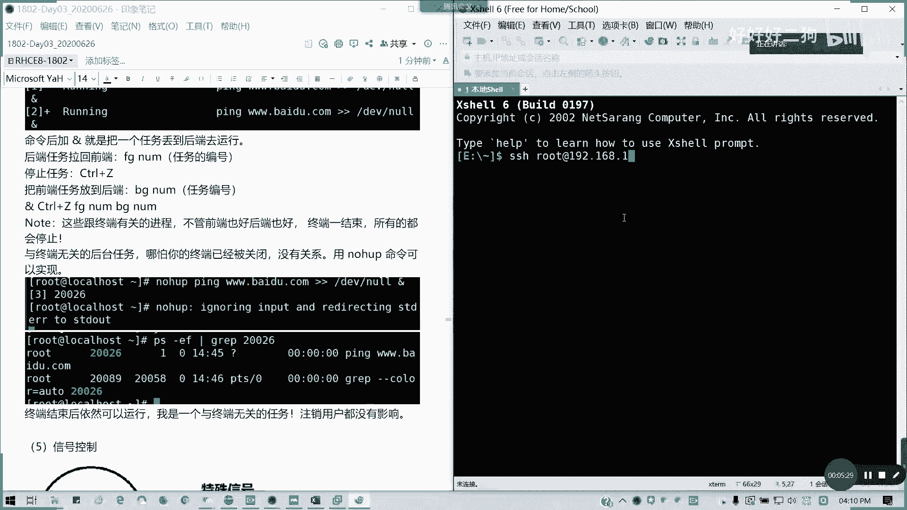

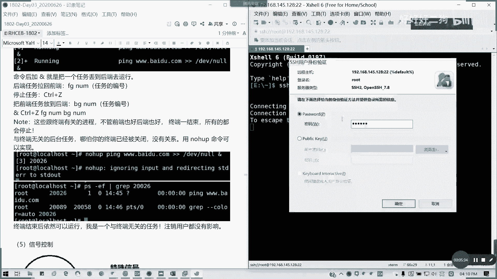

要结束这类进程，需要使用信号控制。

## 信号控制

信号（Signal）是Linux系统中用于通知进程发生某种事件的方式。我们可以通过发送信号来干预进程的行为。

以下是常用的信号及其含义。

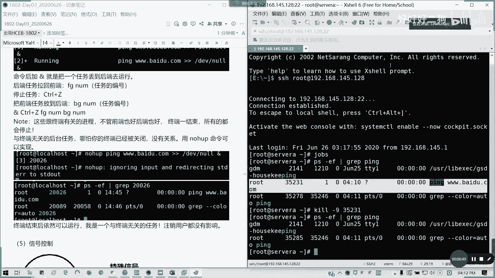

*   **`SIGHUP (1)`**：挂起。通常用于让进程重新读取配置文件。
*   **`SIGINT (2)`**：键盘中断。由 `Ctrl+C` 触发，请求中断进程。
*   **`SIGQUIT (3)`**：键盘退出。由 `Ctrl+\` 触发。
*   **`SIGKILL (9)`**：强制终止。该信号无法被进程捕获或忽略，会立即结束进程，相当于“强制关机”。
*   **`SIGTERM (15)`**：正常终止。这是 `kill` 命令默认发送的信号。进程可以捕获它，并执行清理工作后再退出，属于友好结束方式。
*   **`SIGCONT (18)`**：继续运行。让一个停止的进程恢复运行。
*   **`SIGSTOP (19)`**：停止进程。该信号无法被捕获或忽略，会暂停进程的执行。
*   **`SIGTSTP (20)`**：键盘停止。由 `Ctrl+Z` 触发，请求停止进程。

最常用的信号是 `9` (强制终止) 和 `15` (正常终止)。

## 使用 kill 命令发送信号

`kill` 命令用于向进程发送信号。其基本语法是 `kill [-信号] 进程ID`。

以下是 `kill` 命令的常见用法。

*   **`kill -9 PID`**：强制终止指定PID的进程。
    ```bash
    kill -9 35231
    ```
*   **`kill -15 PID`**：友好地请求终止进程（默认行为）。
    ```bash
    kill 35231  # 等同于 kill -15 35231
    ```
*   **`killall -9 进程名`**：终止所有指定名称的进程。
    ```bash
    killall -9 ping
    ```
*   **`pkill -9 进程名`**：根据进程名或其他属性终止进程，功能比 `killall` 更强大。

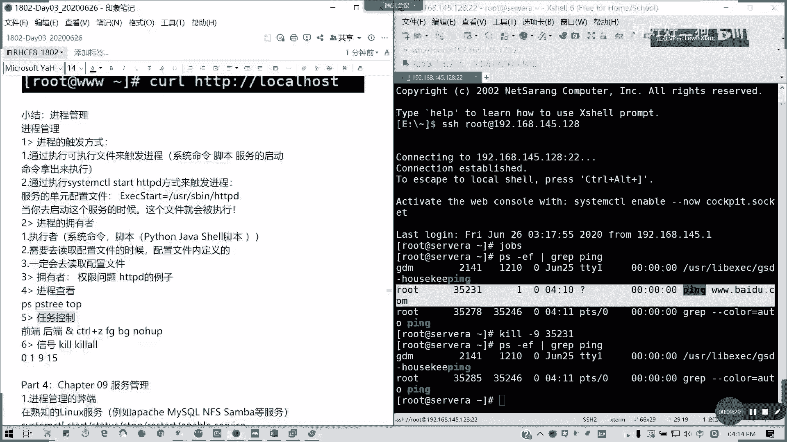

## 总结

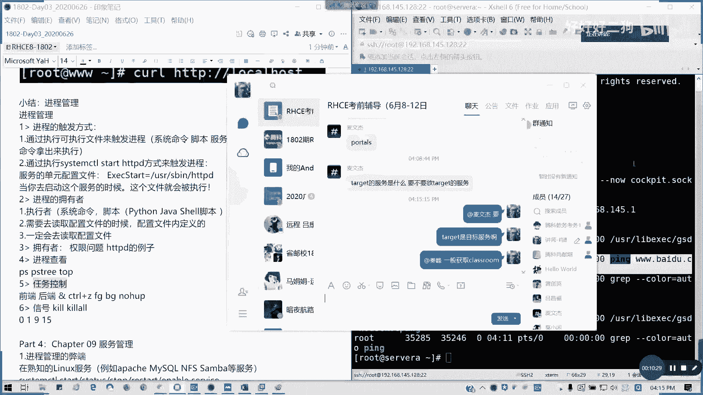

本节课中我们一起学习了Linux的作业控制与信号控制。我们掌握了如何将任务放入后台运行（`&`），以及使用 `jobs`、`fg`、`bg` 命令管理后台任务。我们还学习了如何创建与终端无关的后台任务（`nohup`），并最终通过 `kill`、`killall`、`pkill` 命令发送不同的信号（特别是 `SIGKILL(9)` 和 `SIGTERM(15)`）来终止或控制进程。这些技能是进行有效进程管理的基础。