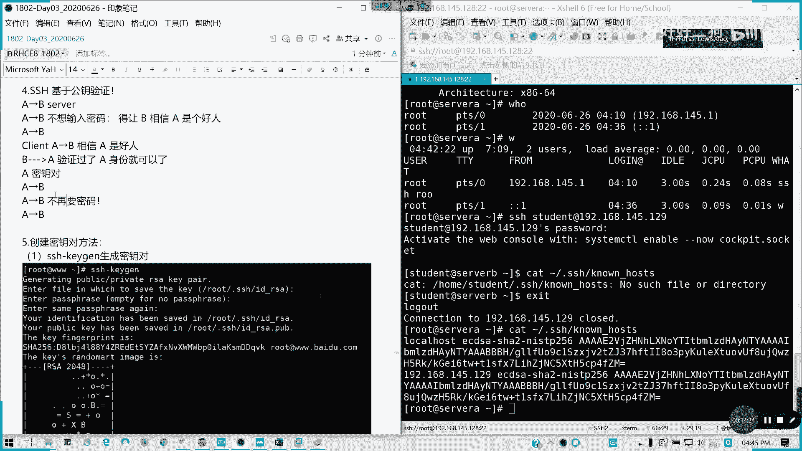
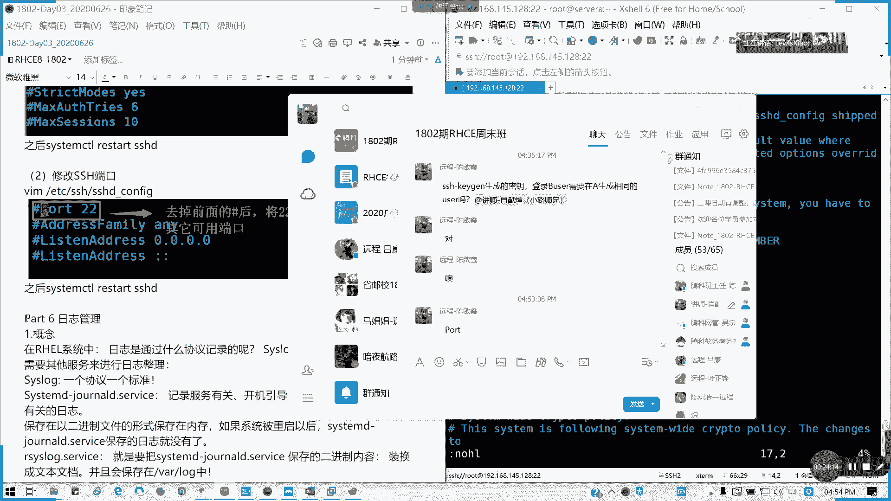
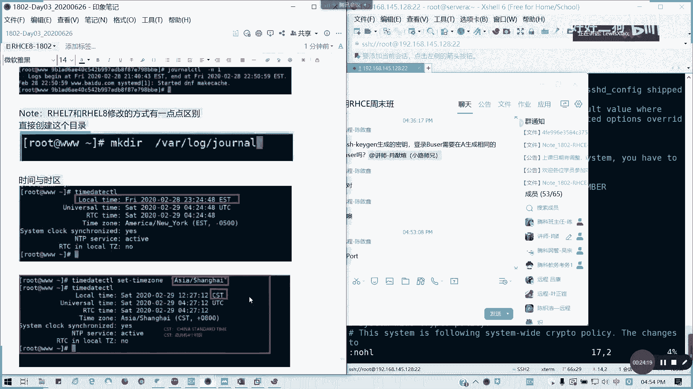

# Redhat红帽 RHCE8.0认证体系课程 - P18：18_Video_Day03_Ch10_配置和管理SSH服务 - 好好好二狗 - BV1M3411k77W

好，接下来我们讲第十章是进度比较快的哈。进度比较快。第十0章配置跟保护SSH这里这里要讲的就是这个登录应该都知道了，我就不讲了吧，就如何去远程登录桌面，这个不讲了它的那个命令它的提示符结构我也不讲了。

讲什么呢？讲那个加密啊，如何去生成一个密钥，也做一个免密认证，这这是这章的一个重点啊。像我们像我们那个SSH secure shell对吧？安全的sha它是比tnet啊更加安全的一个登远程登录服务。

像我们SSH它是一个加密过的，像tnet是不是明文传说啊，我们之前有没有用过tnet？还有呢就是相当于我们之前访问交换机啊，或者这些的话经常会用到，对不对？或是访问那些串口设备。

就要用到它是个明文传输的。像SHH它是要有密钥加密的才可以像加密的方式有几种，一种是对称加密，一种是非对称。对称加密呢它的特点呢是什么呢？第一个，加密跟解密的密码是同一个。

对吧还有呢就是安全度会稍微低一点，这是对称加密。我们的DESAES呢非对称加密就是用公私钥，对吧？什么叫公私钥呢？公钥是发布在我们的我们的那个就用于认证的，就可以对方可以看到公共的一个密钥。

私钥呢是自己保留的，对吧？这自己保留。然后公司要用干嘛？就用来解密，所以我们这个看一个过程哈，A跟B进行通信，它会怎么样去通信呢。通过公司要怎么去通信呢？通过A跟B通信呢，我们A会拿着B的。

我们A登录到B，我们A会拿着B的公钥去加密，对不对？然后B拿到密文之后，他自己是不是有个C钥？对吧有一个个人密个人密钥，那我拿着这公钥之后，我私钥就用来干嘛？用来解密的啊，公钥是用来用来认证的，对不对？

公钥用来加密跟认证的，懂吗？所以B拿到密文之后呢，它会拿着自己的私钥来解开。然后解开之后呢。B拿着A的工作加密，然后A会拿着自己的私钥去解，对不对？就是AB你A跟BB到A的一个过程。

他是这样子就会解密出来，然后你皮进行配对是吧？就是私私密解密，然后你这个解密出来一致的话，那就相相当于我之间我可以建立链接，对不对？

如果你们学过密码，学过学过传这个数据通信的话，应该会知道。这简单讲一讲特点呢安全的速度慢。因为你要经历过一个公司要认证。像我们这里的话，ASSH到BB是server，对不对？我们A是个客户端A他把那个。

你叫B，然后B把自己的公钥发给了A，对不对？因为你要一个建立一个握手过程，你发几个链接，他会把公钥给你。然后给你之后呢，你介绍公钥之后，你是不是要输入一个密码呀，对不对？他会输成一个他有公司要啊。

就是说说一个随机值，然后他能也要输入他的，你先收到B的功作之后，那是不是建立连接了。那建立连接之后是不是要输入B的验证啊，你要怎么登录，对不对？然后建立成功之后，它才会生成一个连接。

而且会将我们的已知主机，也就是哦，我这次我A是吧？我A我连加B，那我B。自己知道了，对不对？我知道A要连他，那我是不是把A。放在我们的一个自己的一个叫做no host的文件里面。

那下次是不是不用再收自己收机这台机的一个，就我就不用再去接收那个B的公钥了，对不对？懂我意思吗？就就就这个公钥，我就不用再去传送了，相当于我已经建立了一个哦，我已经知道你了，那我就直接登录密码就可以了。

知道我意思明白我意思吗？他这这个过程，如果你是在已知主机里面呢，我就可以省略了。通常比如说root目录的话，是在root里面SHH然后no host里面啊。他现在是没这个文件的，没这个文件。

因为我们还没有建立链接啊，没有建立链接。比如说我们这里的话，比如说我们这里。自己建立一下。能远胜自己。对吧他一开始没有找到，就我们的那个就就这个没没法连接。因为他的那个C要没找到，这没有。

然后他发过来了，我自己建立自己是不是发了一个自己的一个公钥过来。那我们此时要不要建继续建立连接，然后输入我们自己的密码，对不对？对吧然后看一下这个明令还在不在，那个命令还有没有啊root。

点SHH有的是吧？有这个命令有这个命令在我们它里面。有这个文件了。看一下是不是跟本地建立的一个电接啦，然后他要通过它有1个ECDFA。

登陆什么8士？什么意思？生成密钥它是不需要啊，不需要登，但是我不知道你这个什么意思啊。得个B的user是吧？得个B的user在A需要生成相同 userer，不需要。不需要。因为已经这个我们待会讲。

就是说如何建立免密认认证一个信任关系，不需要。

懂我意思吗？现在我是在本地示范之后，它就会生成一个本地链接。那下次我再建立，比如说我这里是一个servB是吧？我我我现在把servB开起来，因为待会我们做一个免密认证啊，我们把servB开起来。

上次我们是不是我们克隆做来SB对吧？然后我们也开我们也那个建配的IP地址，那我们要试一下怎么做免密认证啊。

那我们是通过一个叫做SHH的服务啊，SHHHD的服务来来进行啊。哎，ETC我挡多了一个斜杠是吧？它是通过SSSDconfi这个配置服务来弄。然后它这里有一个公钥是不是？还有一个私钥，pop是公钥。

然后呢一个没带pop是私钥，私钥是用来解密的，公钥是用来传输的，懂吗？像ICK这里也有啊，每台机器的公司要是不一样的。然后通常我们是通过SSHD的服务来。然后如果修改过我们的公钥的话。

它就会说你的远程主机已经被改变了，对吧？🎼这个密钥是可以修改的，但是我这里我就省着去懒得去搞吧。这个密钥是可以修改的，就是一开它就open SSHH的私钥啊，私钥跟过上是可以改的。

如果你改了一串字符串的话，你就相当于去改过了，懂吧？如果改过的话，他可能会认为说哦，你这远程处境因被篡改过，你可能是不是被攻击了，或者是说会做一些。不可告人的行为，对不对？他就以为这很就有个风风险操作。

然后他就会那个。他就会拒绝连接，对不对？如果你也相当于说我原来我拿一把钥匙，然后你的钥匙我突然就是加了一点东西，然后你开不了，对不对？就。能懂我意思吗？就我的钥匙，我的门锁，比如说我门锁已经被换掉了。

懂吗？我们所换掉的那是不是你钥匙也已经匹配不上，那我就不能开门，类似的这样意思，那怎么办呢？如果遇到这种情况呢，我们通常就是把那个no host里面把这个条目去掉。这里我们简单明白就是删掉。

但是通常说呢，我们就把有疑问的那条线去掉就可以了。对吧密钥发生改变，他就会出现这个东西，对不对？就是你们的指纹，对不对？SA2048就保跟本定保存不一致，然后我们再输入密码，对不对？然后像我们这插税。

我们是会保存到。

我们的document目录里面的一个公钥就是保存在这里，对不对？公钥它保存之后，它会建立连接会去校验它的一个密钥。在windows是这在这里保存的，懂我意思吗？如果通过叉税的话，它是保存在这里的。

默认位知啊。所以这个的话就是我们的被改变之后啊，我的百度网盘又又给了给了钱了哈。这个因为开了那个会员，现在会员还是蛮贵的哈，一个月18块啊，就是为了给你们传的快，不然的话真的是太慢了。好。

然后我们呢接下来讲完了公司要讲完认证，简单讲完认证之后呢，有没有问题啊，我看看。待会我们会讲如何建立一个免密啊，接下来我们看一下，就利用公司要去认证，也就是不用输入密码了，懂我意思吗？

那这个我们接下来看一下如何用SSH去远程执行命令。比如说我现在我设B已经通了啊，色B已经通了，我拼一下啊。

我拼一下色逼。拼一下搜B，我们搜B的地址是192。168。145。129，对吧？现在都在进行通了，对不对？好，那么现在SSH我这里杠叉是调图形界面，但是我们这里不需要啊，我需要。运行啊。

我们搜B的一条临时命令。root。我们就通过录取用户192。168。145。129，然后我只就执行一个hose name controll。或是我们对吧？指定一个临时命令回车是吧？

我要建立一个建立一个链接，然后输入。设B的root密码。是吧这个就是通过SSH来运行一条临时命令。然后运行完之后，他马上退出这个交互环境。如果你不带的话，他就输入密码之后，他就进入了色B的远程。

懂我意思吧？然后我们也可以看谁连接过来，对不对？我们也可以出看谁谁连接过来。我们现在是一个终端是吧？像我们现在是不是14。1，也就是我这个物理机的一个虚拟网卡的网关，连接到了这台服务器，懂我意思吗？

可以知道吗？我们能通过超税去将将当于我们物理机通过网关，通过我们的这台机的IP地址进行远程连接。能懂吗？那这个就是我们然后公钥设施保存在我们家目录下面的。加目录下面，比如说我远程一个student啊。

就我远程一个student用户，然后他的公要保存在加目录下面的一个点SSH的hoss。当连在哪一个用户，它就保存哪一个。对吧我连到student上面，然后我看一下啊。波浪线加目录，然后。

点SSH这个是隐藏的。🎼我们看看一下好了。Now， no host。远程好像没有远程上面怎没有，因为因为他是保存的本金。LL啊，我们ca好了。我们连多一台主机是不是在本地会生保存一份啊，对吧？

本地会保存一份连接，它不会在对方那里保存，懂我意思吗？你连接谁，你建立一个认证之后，它会在本地的noho里面保存啊，这个能理解吗？就保存这个通ECECDSA，也就我们认证密钥，通过下二。

然后NISDPL这有加密方式，然后后面是一大串我的连接密钥啊，这这这是加密过的，就不方便就破解它了啊。然后呢我们接下来讲这张的一个。东西啊，基这一个东西就是一个基于公钥的免密码认证是吧？A连接到B。

然后A跟B的话，我不需要输密码对吧？我们现在是用密码验证的那无密码验证呢，那你得得让B去相信A是个好人啊，对吧？相信他是一个合法的机器，对不对？那那得相信A那如果是。B要相信A是个好人的话。

那如果验证过了A的身份，那是不是证明哦我已经OK了，对吧？我们两个可以互相建立一个信任关系。那那我们在那我们通过A的密对就是说相当于匹配上了。那我们A连接到B是不是不是不再不不不会再要密码了，对不对？

不再需要密码，那通过密钥建立连连接啊，那我们现在讲一下如何去实现。首先我们假设我们serverer A要连接servererB单向的啊，然后们返回来你们可以做来。

我要连接设为B，我不需要密码验证。那我们只要把调车设尾，我们设成一个公钥跟一个私钥，对不对？然后把它发送到serv尾B的对应的用户，对吧？那设B保存之后呢，我们这里再联系。

就相相当于我们获得了servB的一个信任。就当前的这台机器获得serv尾B的信任之后呢，我们从设尾A再连接servB是不是不用密码了，我们试一下SSH这样证。

然后这里呢他会创建公司要的一个密钥队。然后我们接下来就是他的。工业它的私钥它保存哪里？我们就保持在默认的root点SSH然后ID下角线ISA就可以了。然后是不是要输入密码，我们不需要吧，回车。

对吧他会帮你。保保存你的公钥跟私钥，还有你的指纹对吧？还有一个指纹图像这些指纹图像。然后呢，我们接下来怎么做呢？我们要复制我们的公钥，注注是复制公钥。私钥是用来解密的，不是用来验证的啊。

来SSH杠copy杠IDroot。192。168。145。129，是不是我们设备B回车。

对吧他他告诉你说那个source of key to be installstore就是我们的公钥将会安装。然后将长是一个新 key，对吧？有一个新 key将会被安装。然后呢。

我们要输入是servB的入程密码。

O。你看这个K已经被添加到了社会B上面了，就是它的设会A的功要已经到设会B上面了。那么现在尝试。再研究搜币。你看看。是不是免密了？我是通过公司要配对来进行验证了，就这种更加安全的方式。对吧来登录。

其实这种的话，我们堡垒机经常用，还有我们的anserible。exible我们简单讲一下sible是什么东西，它是一个控制端。然后以下我们要管理我们的售款主机，就相当于我们指挥我们的一个指挥官。然后你。

点我们现手下的那些将士去打仗，去做。我们现在我们是指点我们控制控制主机，我们授管主机去完成我们的任务。那那你先要信任吧，你的指挥官，你将士之间要建立一个信任关系，对不对？你要信任他，不然的话。

你怎么指得动啊？他说各自为政，你怎么指得动，对不对？所以其实这里。创建面要对这个东西呢用在运维审计，对我们堡垒机里面。或就是一些常常见的操作，就免密码的这些对不对？还有就是我们的ensible非常多。

所这个能懂吗？

然后他的话，如果是我们。SSH链接它会留在我们的root是吧？我们这里的话，我看一下root里面的点SHH然后对不对？里面就是我们的已经认证过的一个密钥，它会存在这，对不对？

就把就这是一个serv a的serv里面是不是有有全有servA的他的已经验证过的一个密钥，对吧？IC非证加密了，懂吧？他把那个他的公钥传过来验证过了。那有这条记录的话。

他我们每次在serv的root用户登录到serv的ot用户的时候，他就直接验证这条这条那个这条密钥，如果没有变正常，他就登录了，不需要再输入密码，明白我意思吗？也就是这种是更安全的一个方式啊。

就不用说你关于密码被破解没有关系，你只要这条命钥在。就行了，反，但是你反向你也要做啊，你现在登录思维。所以依然有密码，因为我还没做互互相的，我只做了单向的，对不对？我们只做了单向的。

所以的话如果我们要就完全信任关系的话。两个方向都要做，还有不同用户都要做一遍。对吧，因为你现在做的只是说你指定用户的认证。但是如果你要登录不同用户的话，你这个验证还是无效的。

因为他的authize kiss只是在特定的用户的目录下啊，懂我意思吗？它的公钥只在特定用户目录下，所以的话他只对特定的远程用户去生效，明白我意思吗？刚才那个陈启清。能明白吗？然后如果自定义的话是吧？

自定义的链接的话，我们可以用杠N是吧？我们加上一个密密码，对不对？

杠N加上个密码，比如说我这里用空格。

去验证对不对？然后还有就是我指定一个公钥路径，用杠I啊杠I去指定我们公钥路径，还有指定我们的。

私钥文件是吧，指定私要文件也是可以的用杠I。

我们不用默认的也是可以，但是这里的话我就不再详说了，笔记都有啊。就可以就就我可以指定他的密钥，杠N，指定他的密钥都可以。我们刚才是免密药，对不对？免密直接过，对吧？

然后这最后我们讲一下如何禁止root登录啊。

求何禁止说修改它端口来修改端口。这里这里的话我们直接VIMEDCSSH。🎼啊地。confi个。这里是写禁止登录啊，就是我们的应该叫做这里我要补充一下。第七点是关于。SSH配置SSHD的配置啊。

首先我们配置如何禁止录ot用户登录是吧？禁止录ot用户登录的话，编辑这个文件。然后我们找到这个这一行。

Permit。对吧。等一下perm它自动对焦了啊，permme go go in是吧？我们通常说，一般我们在生产环境里面一般是禁止如何用直接登录的。普通用户先登录，然后我们再切换过去，懂我意思吗？

所以的话这里如果禁止的话，就改成no，然后重启服务就能生效，这是第一种啊。然后第二个我们要写一个就是。大家经常关心的修改SSH端口，这里笔记原没有啊，对吧？同样。编辑这个文件。然后找哪里了？这里。

将它的注释取消。等一下或者22，我们找这里。noknowHL，我把这个把这个注释取消是吧？我这里写一下啊。

去掉井号。啊，黑的根本看不见啊，把白的。黄的吧。去掉前面的注释。将。22、改成其他可用端口，记得是可用端口啊，这个端口不是随便改的，不要改。不要改成我们系统的其他端口就可以了。不会说吧。

这个就是我们的port22啊，就是我们把我们通常我们在企业里面。

一般很少人去用22端口，对不对？很少，因为22端口基本上每台都册22那随便撞随便进，对不对？所以除了做这些知识审，我们的运维审计之外呢，我们还要把这个端口也给改掉啊，对啊，改掉之后。

因为我们修改配置文件，记得重启生效，懂我意思吗？这个就是我们常见的两个用法。我看看大家有没有问题。这一章我们就简单讲到这里啊，简单讲到这里知识管理有名，我们下周六再讲，所以我把后面我把这个先删掉。

然后保存着新的笔记，好吧。

这个就是我们补充的一个东补充的所有东西。然后我们今天呢7到10章我们任务也完成了。重点我们讲什么文件权限，对吧？还有就是我文件权限这一块我们讲了，然后还有呢就是我们的一个呃。

进程管理我们进程怎么怎么看topPSPS区，还有呢就是我们的。任务sstem controll怎么用？然后还有就是我们SSH就是我们如何去创一个免密认证。然后它的那个性政上它性任上的密钥。

它的主题是保存在哪里的，还有就是说免密认证，我们怎么做，这个是后来的话有用的啊，不要做，到时候再讲的时候，我在我直接操作的话，你们都看不懂啊？懂我意思吗？

然后基本上我们的还有我们今天留的就是说中午我们做的四道练习是吧？四道练习这个比较重要考试的原题啊，考试原题是修改版。所以的话就希望大家能够好好复习。然后接下来几分钟的话，看有大家有什有没有什么问题。

没有问题，请打歪，现场有没有问题，没有问题请举手。

今天讲7到10章放假，7到10章我们的任务已经完成。现在我把笔记传过传到的给大家录屏晚一点哈，待会儿。

下一周讲是下周六讲什么呢？明天没有课啊，明天没有课。所以所以所以大家不用不用先上线啊，但是给大家这么长时间，我们要复习什么呢？11。

我们看一下课程表，接下来111213章，下一周我们周六的内容，然后1415章11就14516章是周日的内容。也就是我们下周我们会把。第一本书结束。5天时间其实说快不快，说慢不慢啊。第一。

下周我们把第一本书完全结束，然后后面下下周。

讲大家喜很喜欢的笑啊。脚本。我先把那个我先把我们的。课件我们把新的课件发给大家。实验作业啊实验作业，比如说你的SHH的免密认证，你都可以做，对吧？对吧？你们设为A跟设B如何所有用户做免密认证，对吧？

比如说我的思维A。咳嗽未毕。之间如何做免密认证？还有我们的如何修改。SSH端口。及。禁用root登录。然后还我们还有就是进城跟县城的，自己试一下啊。和县城。啊，进程和服务相关的。问题。

还有就是我们上午布置的文件是吧，给大练过的文件，就用户和组用户组以及。文件目录权限的问题。对吧这几个已经够的，还有我们上我们之前讲的常用命令，这些都可以复习，对不对？我们今天主要讲这么多啊讲这么多。

当操实际操作还不是太多啊。但是接下来我们讲那个日志网络以及归纳我还有那个软件包嗯操作东西都多了，还有一个就是文件的查找定位，这些我们讲的就多了，操作实操的地方很多啊。所以的话不要急，我们现在才刚刚开始。

刚开始没多久，现在才第三天，对吧？我们还有实天的课程，当然我们第五天会将所有的HCSA这块结束掉啊。如果你们确实想要找练习，你们去看一下电子书，每一章后面都有练习的，好吧，不会的话，在线上问，好吧。

北京时间4点59分啊，还有30秒。那我们今天呢就先到这里，我们就不拖大家时间了。然后希望大家好好复习，然后也希望大家啊反正周日我就比赛了。然后我希望给大家大家可以为我为我加油助力，好吧。

这个链接后面再更新了，这个是题外话啊，题外话，我们还是把知识学好，然后呢集一个双赢，好吧，那我们今天就到这里下课。

有问题可以留下来问哈。

