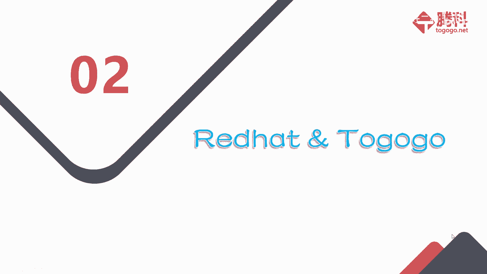
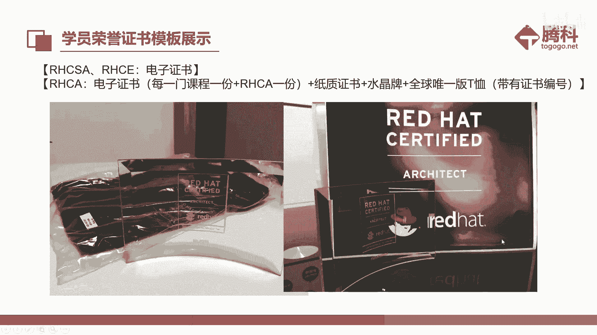
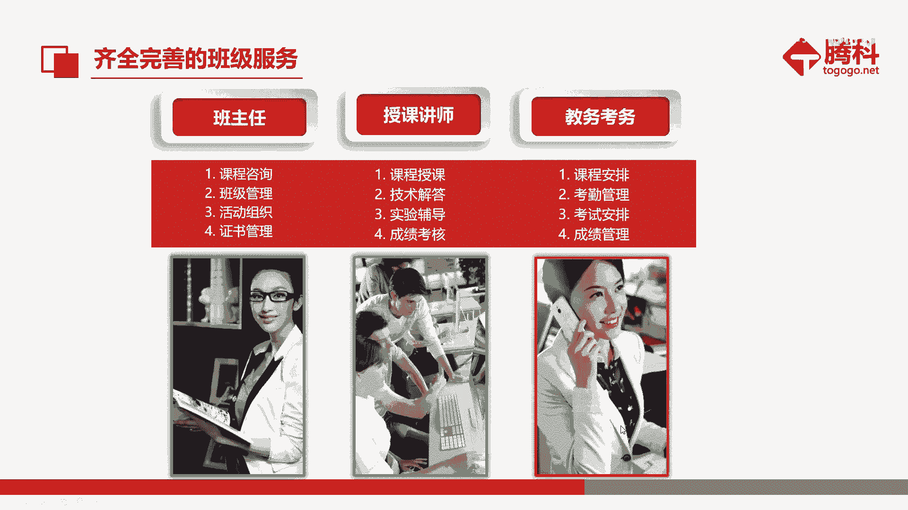
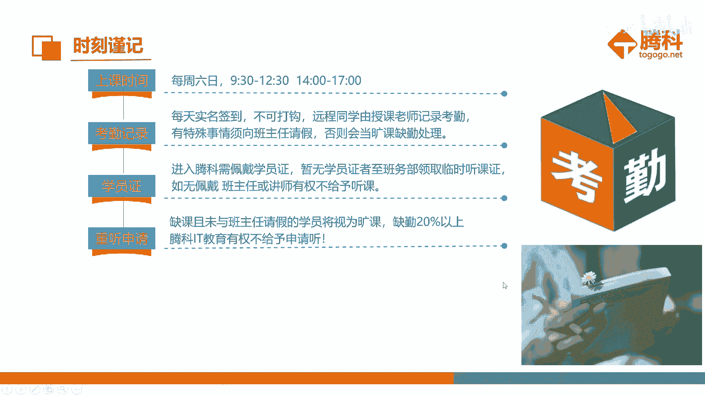
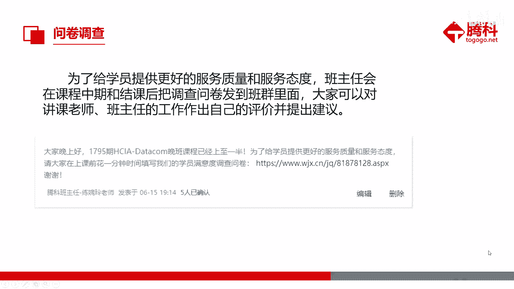

# Redhat红帽 RHCE8.0认证体系课程 - P1：1_RHCE8RH124RH134RH294认证课程 - 好好好二狗 - BV1M3411k77W

嗯，都听得到是吧？嗯，那我们开始今天的开班典礼。嗯。是啊。嗯，就是我们今天的开班典礼呢，就是分成三个部分。嗯，我们先来看一下第一部分会员I。

嗯，我呢是来自梅州的一个客家妹子，然后性格快乐开朗，坚韧温暖，对人真诚。然后一直坚信梦想要有及时邀远。嗯，我是你们的班主任廖婉玲老师，然后就是。谢谢谢谢。😊，然后这下边是我的手机号跟邮箱。

有需要的话可以记一下。百度微信吧。第大队是吧。最好最好自平时有事的话，QQ找我，我QQ比较在线。😊，没有微信的话，现在有个。猜一猜来。双击头像拍一拍。换个姿势再来一遍。嗯，然后我们看一下下一章。

我们的肖老师。

嗯，肖老师是通过了IHCA呃认证。然后他现在讲的就是我们的8。0的IC课程。然后这下边呢是他的一些简介，就是中山大学的工程硕士毕业。然后。哦，这个简历还没有更新，呃，已经有10年的工作经验了。

然后这下边呢是他的一些之前担任过的岗位。嗯，还有一些项目经验，香港机房的基础设施搬迁项目，还有一些支付业务机房的维运项目运维项目，不好意思。呃，大家可以看一下，了解一下。没东西是看不到PPT吗？

哦。嗯，那我们看一下下一张PPT就是嗯我们大家各位同学可以来个自我介绍，就是在班群上远程的同学，在班群上分享一下。就是来自哪里啊，有什么兴趣爱好啊，还有目前就职啊或者就读的学校啊，学习初中啊等等。

面授的同学可以直接在线分享。😊，系。有吗？谁给我定一个来吗？我们今天好多面试的同学。还有我右手边的这位同学。😊，呃，就自我介绍一下，大家好，我叫卢家健。😊，改下就是。还有吗？可以自己考养。

不要一个个冷吧。😊，こ奮。在线的啊远程的同学还没有呢。可以直接发到群里。这是我们面授跟远程可以同时进行一下。就只有郑永江同学介绍一下吗？进趣吃喝玩。好。我们这个班没有小姐姐。😊，暂时没有吧。

我好像没有看到。开黑是王者荣耀吗？我们这个班都是喜欢打游戏的嘛，大家可以分享到群里一起开黑。😊，户外。还有吗？还有同学还没自我介绍的吗？😊，这个HC是奇怪的知识吗？嗯，那还要自我介绍的同学。

就自己发在群里，我们接着下一张PPT。😊。

嗯，第二个是红帽跟我们朋克的一些联系。

这是这是腾科的一个简介吧。就是腾科IT教育集团呢，就是一家聚焦IT教育和IT人才。然后主要就是提供一些面授啊跟远程教育。的一些。呃，专业公司。呃，我们的联合厂商呢主要是有4科vi软、华为、鸿帽、甲骨文。

还有一些亚马逊、微软。肯瑞这些。知名的IT厂商，还有跟很多的高等院校都有合作。然后呢，我们现在是有培生集团跟普尔文两个全球的国际考试中心，就是你们所以你们考试的话，可以直接在我们腾克考场。然后呢。

腾克我们的总部就是在广州，然后下边是有嗯一些广州啊，武汉、深圳的一些分公司。可以看一下。以后会有的上海。嗯，那我们再看一下这个红帽的架构。就是他是有初级的HCSA。然后我们现在上的话是8。0的HC课程。

就是红包认证工程师。然后他还有一个高级课程，就是HCA红包认证架构式。嗯，有兴趣的同学可以。😊，继续学一下。

嗯，HCA呢它主要是有5个。五个方向。

哎呀。我们来讲一下考试服务流程吧。就是我们到时候嗯上完了课程结束之后，我们学校考试的话，就是要按照这个流程走。就是我们学员要先缴费。然后就是我们通过你们的那个凭证帮你们约考。就是考场的话。

我们是红帽是只有集体考试的，就是没有。没有那种个人的卡。嗯，我们需要提前两个月，就是提前两个月，我们会发邮件给你们，问你们是否要考试啊。然后确定的话，我们再去申请跟厂商申请人数，然后确定考场嗯。

考试时间是厂商他们那边确定的，所以就是要提前一点预约。嗯，然后后面的话就是你们过来嗯参加考试就行了。可以看一下这个流程。看他就在这里。对。😔，我们当时会开一个教师班考场。

那个呢是我们的一个红帽证书。可以提前看一下。通过率啊。看。个人吧。还是蛮高的，好像不过也有挂的。认着刷题的话好像还是蛮简单的对，有题库的。看你自己医愿，你觉得你准备好了，你就。他会给一个。

就是我们想月底考，但是他们就会具体确定一天。不是每个人是我们会两个月申请一次。这个火帽的证书呢，通过ICA的时候，它有一个全球唯一版的T恤，是带证书编号的那种，就是跟其他IT认证好像是不一样的地方。

嗯，然后红包证书的有效期呢是3年。就是我们HCA不是有5门5个方向嘛？五门课程，到时候我们就是证书快到期的时候，我们只要通过一门然后就可以续起。

那我们看一下，第三个就是我们的服务。

嗯，我们一个班呢是分成讲课老师，还有班主任，还有一个教务。不过我们这个班现在是呃我既是班主任，也是教务。我们的讲课老师呢就是我们的肖老师。就是给大家课程的授课技术解答、实验辅导跟成绩考核。

所以有什么嗯上课啊，技术之类的问题，就直接在群里问肖老师就好了。然后其他上课啊，嗯，还有什么之后的考试啊，课程安排之类的，可以跟我说。

然后这个是我们的上课时间，就是周六日的9点半到12点半，下午是2点到5点。今天早上还有一个同学好像记错时间了。然后的话就是我们群里有一个课程表了是吧？大家就按照课程表上的时间上课就好了。嗯。

现在暂时还没有办好那个学员证。嗯，办好了的话，我会面授的同学会。拿给你们，所以没有的话，就先不用带。考勤的话，到时候会由肖老师负责。就是最好就是不要缺课太多，或者或者没有请假这种旷课，不然的话。

到时候你们申请重听的话，可能会不通过。

虽然大部分都会通过。就是不要直接旷课。就是这个是学守则，就是上课手机调一下静音或者震动。然后有电话的话，最好是到教室外面接。嗯，提前预习啊，课后复习，还有完成一下老师布置的作业。就是认真对待嘛。

也是对自己负责。那么我们到时候会有一个问卷调查，就是课中还有课程结束之后都会有一份。到时候我会发到班群里，就是希望每个同学都要写一下，就是即使你没什么意见，也是对老师的一个工作的肯定，就是要评价一下。

就是类似这种形式发到群公告里面。大家如果有什么建议的话，对课程进度啊什么笔记之类的。嗯，有什么建议的话，也可以直接写在上面。

好，下一张是我们腾科的一个公众号，大家可以拿出手机扫码关注一下，就是里面有一些开班查询了，证书查询，还有就业资询技术文章样的分享。就是可以在里面看一下。下面这个是呃面授的同学，呃，可以看一下。

这是我们的wifi。这是密码嗯，有需要的话，可以先连一下，或者拍一下记一下。如果连网线的话。主果是那个没有电话。暂时不说。手机手机如果没网的话，可以连一下wifi。都拍了吧。

这个是我们的班群，还有同学没进的吗？今天早上有同学让我拉他进群了，现在可以扫码一下。进群之后，记得改一下实名备注，就是肖老师说的，前面是如果是远程的，加。喂。不ら写てこ。因为我们这里都是。我贸安。

那可能大家都一样。那没必要。别束了。然就是呢后续有什么问题呢？我们都在翻我们这个。工作，因为那个腾讯会呢，我是很少，我是我基本上我要点。所以的话我们在有个班。而且关者有的好处呢就是有聊天记录。

对吧所以这块的话，以后如果能你们想维护或者等找这样的话，安全随时找不到。就是实名，是实名或者面授加姓名。Oh。远程或者面授加上10名。然后的话有什么问题就直接在群里聊就行了。腾讯会议的话。

老师可能没看到，或者没注意到。对，跟我聊天记录里面。

那我们进行下一张，这边是右边是我的微信，都加了吗？没加的，可以现在扫码过加一下。哦，我记得拍照后。没有拍没有拍。😊，我当时说了，快递干。然后左边这个是我们一个涂狗狗的红帽总群。

就是以里面有一些嗯以前别的区的学员在里面，也有一些技术大佬啊，有什么问题可以在里面问一下。然后大家相互交流一下。嗯，工作时间可以在微信找我，如果是不是工作时间的话，最好是QQ找一下我。

那我们下一章。这是我们的一个户外拓展活动，这是我们每年会举办一些。户外的一些活动，然后这些是一些照片，大家可以看一下。这还没有值班。对。疫情过后可能会有。

下面这个呢是一个就业增值服务，就是。嗯，我们公司呢是有一个人力资源服务公司，就是给大家推荐一下就业的。就是如果有需要的话，也可以了解一下。

这是一个人才推荐。这个是一个公众号。可以扫码关注一下，有需要的话。嗯，主要是针对一些学生啊，或者暂时正在找工作的人群。

然后这些下面的这些主要是对我们面授的学人，可以看一下，就是怎么点外卖啊，或者外出就餐啊。就是我们28号跟29号教室中间呢，是餐厅。然后吃饭可以在那边吃，里面有冰箱跟微波炉，如果要自带餐的话。嗯。

这是饮水机，还有自助货物柜是在餐厅里面。就是有一些零食饮料，然后厕所的话是在餐厅那边再往后走。这是一个停车的下面的停车场。你有啥啥。他是有那个叫做涨停宝的涨停。有一个就是说。本次诉讼费。我们的地方。

封顶20块。一天。然后呢，最后一张就是希望大家在腾课能有一个愉快而收获满满的学习之旅，谢谢大家。啊，那我们把。谢谢谢谢。然后呢，我们。😊，嗯，可能你你先上课吧，现在现在还。呃呃。あ。2020。那这样吧。

大家。在1点0号我们10点15分我们开始讲会个好，大家好。好吧，这开始。这这设备没准备好的，包括远程学员演示里面一样啊。如果设备没准备好的，大家给大时间准备。环境先朋友们关注我会下，好吗？好。

那10点15分的时候，肖老师再来跟大家讲课。

