# Redhat红帽 RHCE8.0认证体系课程：P1：开班典礼与课程介绍 📚

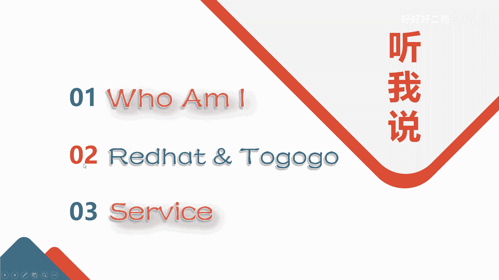

在本节课中，我们将进行RHCE8.0课程的开班典礼，介绍课程体系、讲师团队、学习服务以及相关注意事项，为后续的学习做好准备。

## 第一部分：讲师与学员介绍 👥

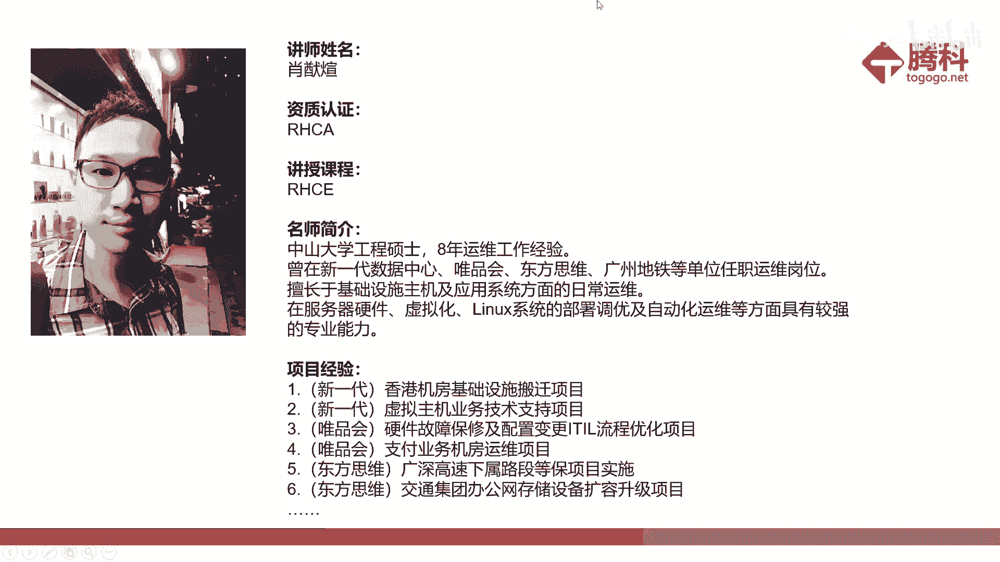

我是你们的班主任廖婉玲老师，性格开朗，对人真诚。我的联系方式如下，有需要可以记录。

*   **手机/邮箱**：已提供在课件中。
*   **QQ**：平时有事可通过QQ联系，我QQ在线时间较长。
*   **微信**：也可以通过微信联系，但非工作时间建议优先使用QQ。

接下来介绍我们的授课老师肖老师。肖老师已通过RHCA认证，将负责讲授RHCE 8.0课程。他拥有中山大学工程硕士学位和十年的行业工作经验，曾参与香港机房基础设施搬迁、支付业务运维等多个项目。

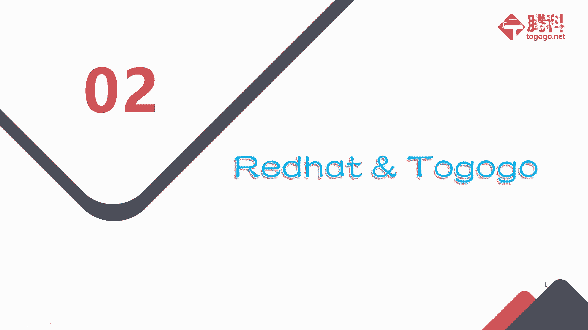

在课程开始前，请各位同学进行简短的自我介绍，包括来自哪里、兴趣爱好、目前就职或就读情况以及学习初衷等。这有助于大家相互熟悉。

## 第二部分：红帽认证与腾科教育 🏢

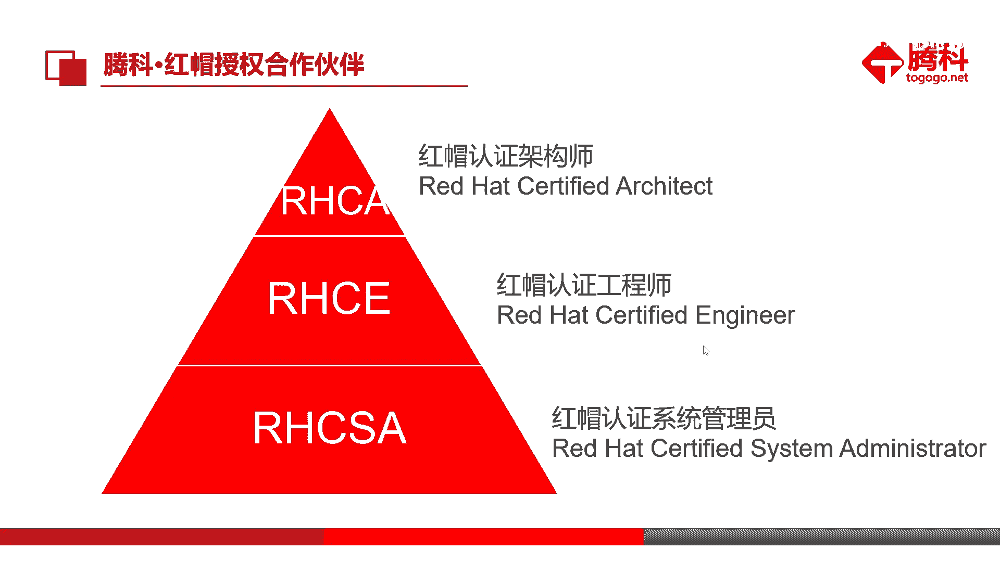

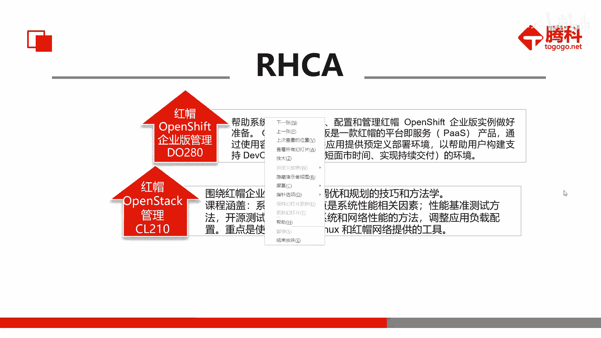

上一节我们介绍了讲师团队，本节中我们来看看红帽认证体系以及腾科教育的相关服务。

腾科IT教育集团是一家专注于IT技能培训与人才服务的专业机构，提供面授和远程教育。我们与红帽、华为、甲骨文、亚马逊、微软等多家知名IT厂商合作，同时也是培生集团和普尔文的国际考试中心，学员可直接在腾科考场参加认证考试。

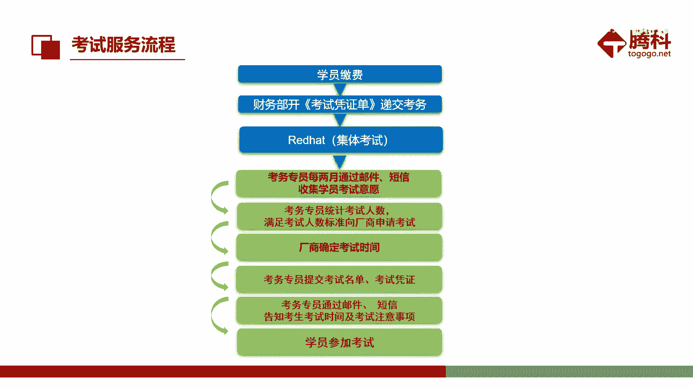

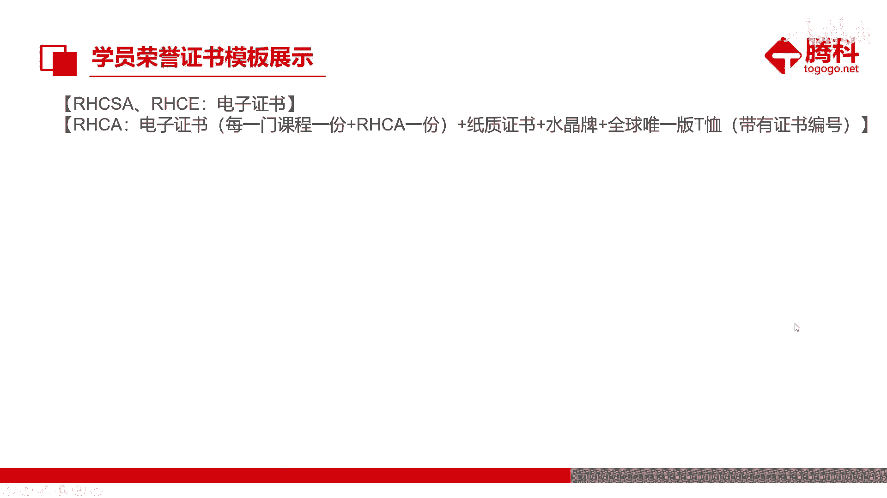

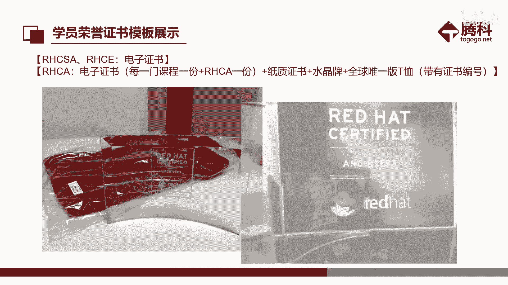

红帽认证体系主要分为三个级别：
1.  **RHCSA**：红帽认证系统管理员，属于初级认证。
2.  **RHCE**：红帽认证工程师，属于中级认证，也是本课程的目标。
3.  **RHCA**：红帽认证架构师，属于高级认证，包含**5个**专业方向。

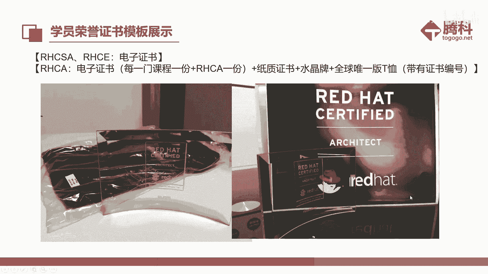

关于红帽认证考试，流程如下：
*   学员完成课程学习后决定考试。
*   需提前约两个月向班主任报名，由学校统一向红帽申请考试名额。
*   考试时间由红帽官方确定，学校会协助安排考场。
*   学员按时参加考试即可。

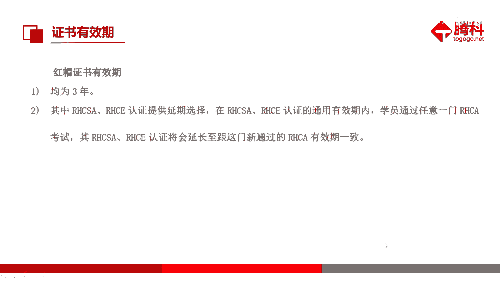

红帽证书的有效期为**3年**。证书到期前，只需通过任意一门RHCA方向的考试，即可续期。

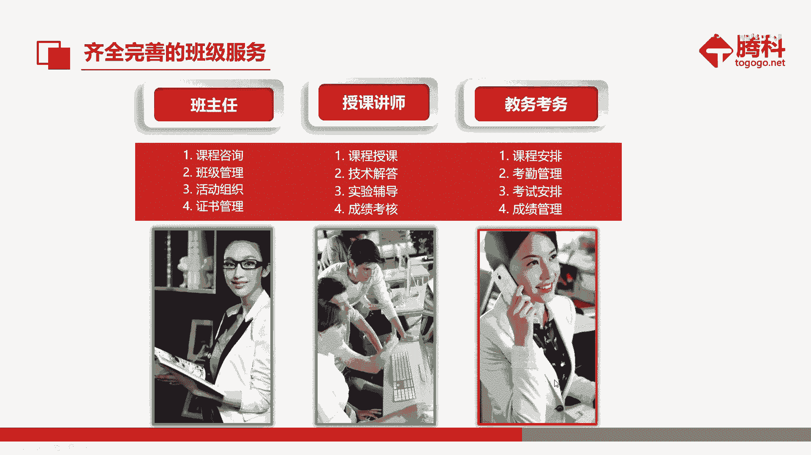

## 第三部分：课程服务与学习规范 📋

了解了认证体系后，本节我们将明确课程期间的服务支持和需要遵守的学习规范。

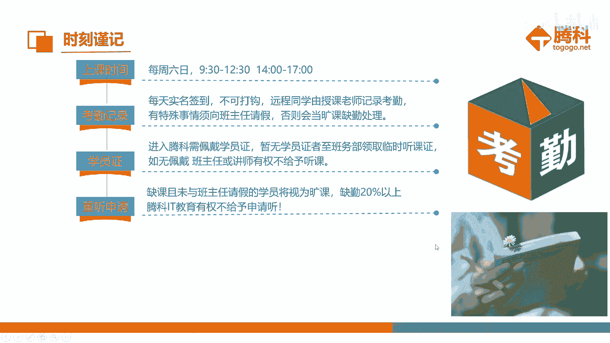

我们的班级服务团队由三部分组成：
*   **讲课老师（肖老师）**：负责课程授课、技术解答、实验辅导和成绩考核。
*   **班主任/教务（廖老师）**：负责课程安排、考勤、考试预约及其他教务事宜。

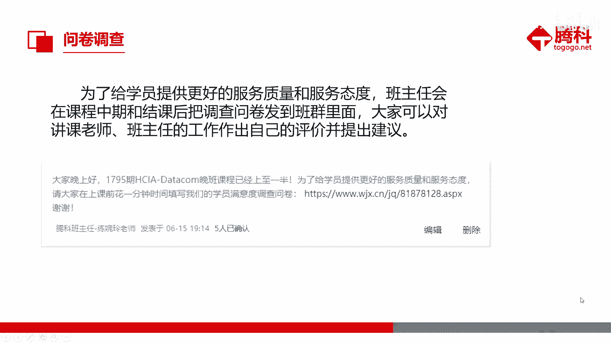

课程上课时间为周六日的**9:30-12:30**和**14:00-17:00**，请严格按照课程表时间出席。考勤由授课老师负责，请尽量避免无故旷课，以免影响后续的重听申请。

以下是需要大家共同遵守的学员守则：
*   上课时请将手机调至静音或震动模式，如需接听电话请到教室外。
*   做到课前预习、课后复习，并认真完成老师布置的作业。
*   课程中期和结束后，请务必完成学校发放的问卷调查，这是对教学工作的反馈与肯定。

此外，请大家关注“腾科IT教育集团”微信公众号，以便查询开班信息、证书及获取技术文章。面授学员可连接教室Wi-Fi，网络信息已提供。

请所有学员务必加入班群，进群后请修改群昵称为“**远程/面授 + 姓名**”的格式。日常学习和事务沟通请在班群中进行，以便留存记录和及时回复。

## 第四部分：增值服务与设施指引 🏫

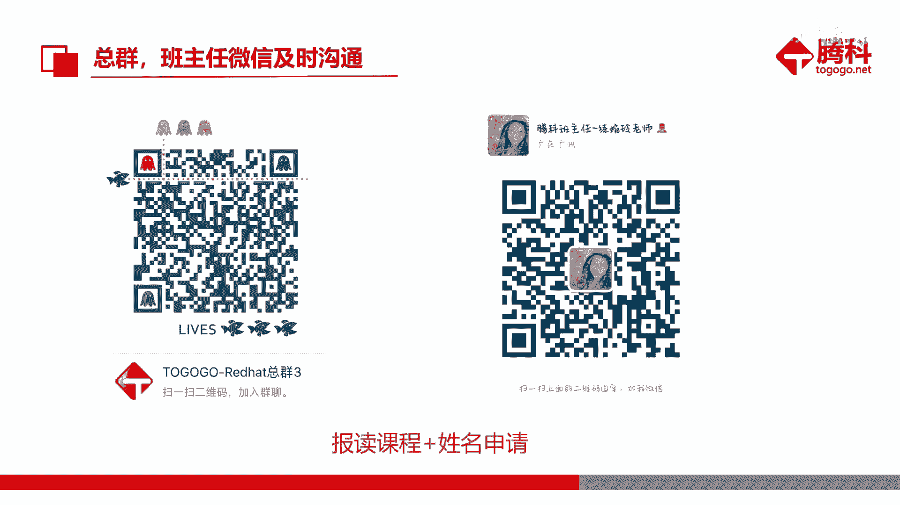

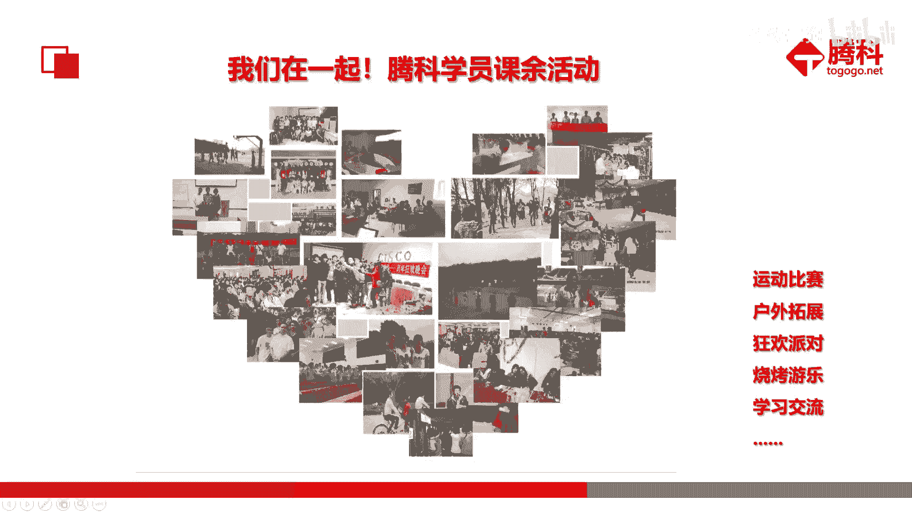

最后，我们来了解一下腾科提供的额外增值服务以及面授校区的相关设施。

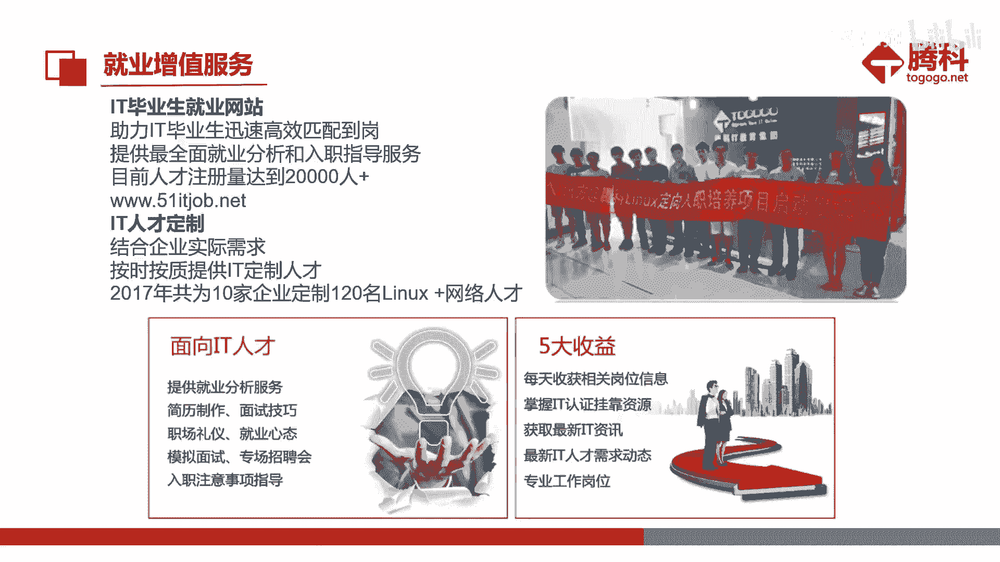

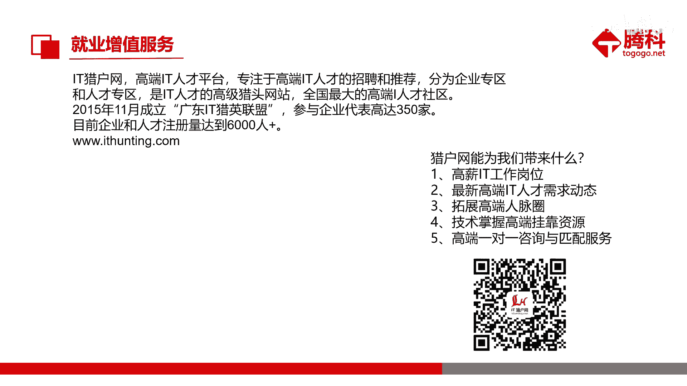

腾科每年会组织户外拓展活动，促进学员交流（视疫情情况而定）。同时，我们旗下设有人力资源服务公司，可为有需要的学员提供就业推荐服务，相关公众号可扫码关注。

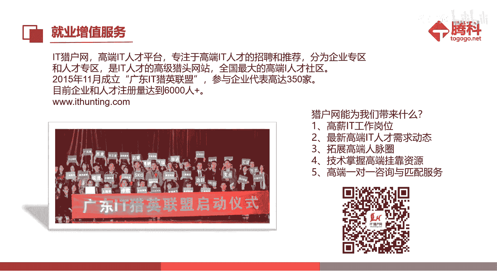

对于面授学员，以下校区设施信息可供参考：
*   **餐饮**：28与29号教室中间设有餐厅，可在此就餐。餐厅内配备冰箱和微波炉，方便自带餐食的学员使用。
*   **便利设施**：餐厅内设有饮水机和自助售货柜。
*   **洗手间**：位于餐厅后方。
*   **停车**：楼下设有停车场，每日停车费用封顶为**20元**。

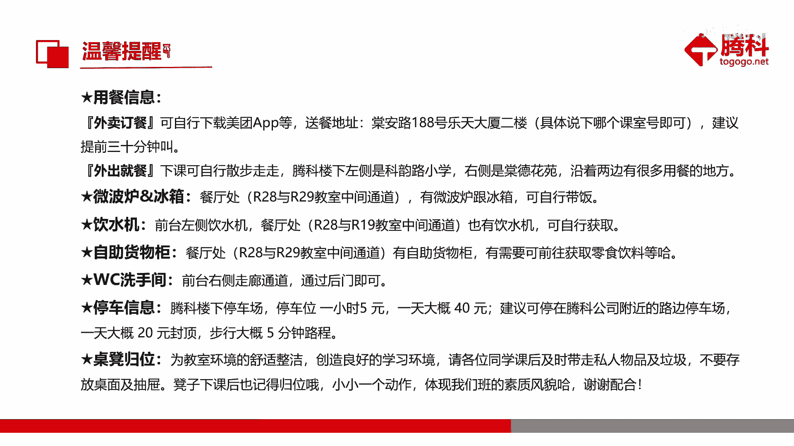

---

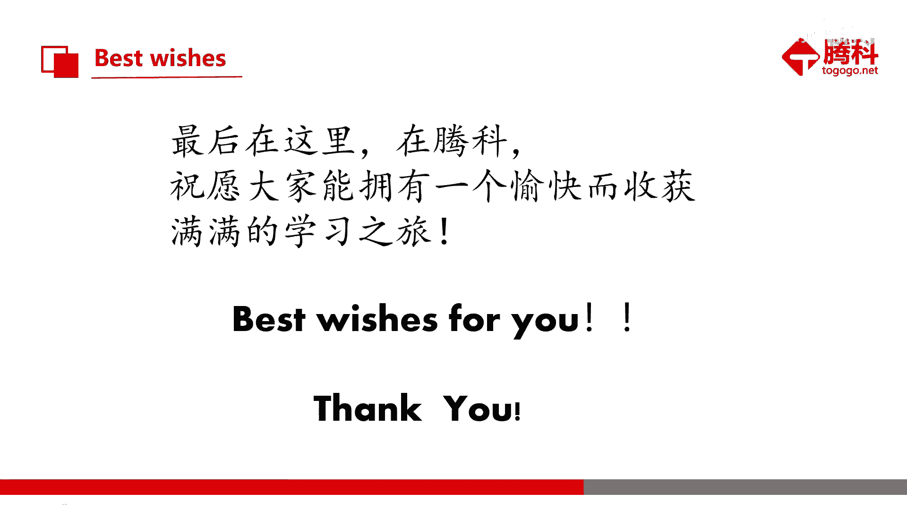

本节课中我们一起学习了RHCE8.0课程的开班安排，包括讲师介绍、红帽认证体系、课程服务规范以及相关的学习支持。希望大家在腾科能够度过一段愉快而充实的学习时光，学有所成，顺利通过认证！