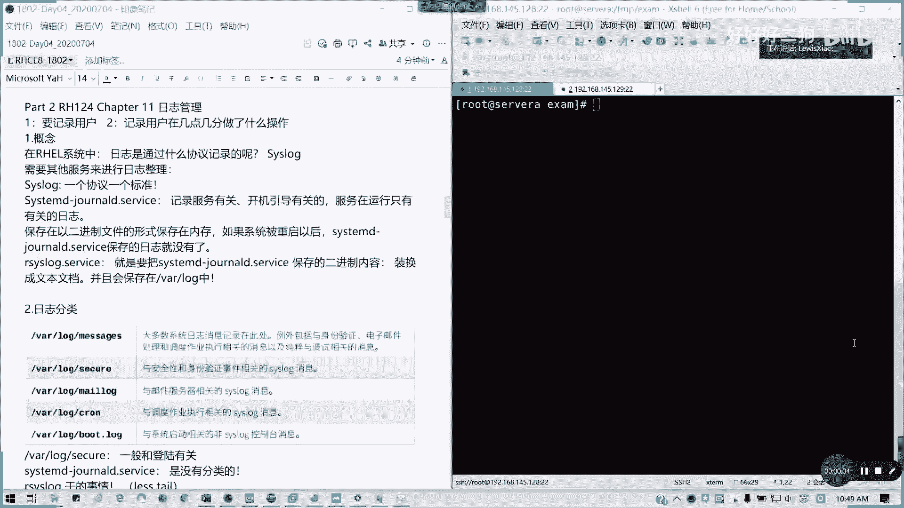
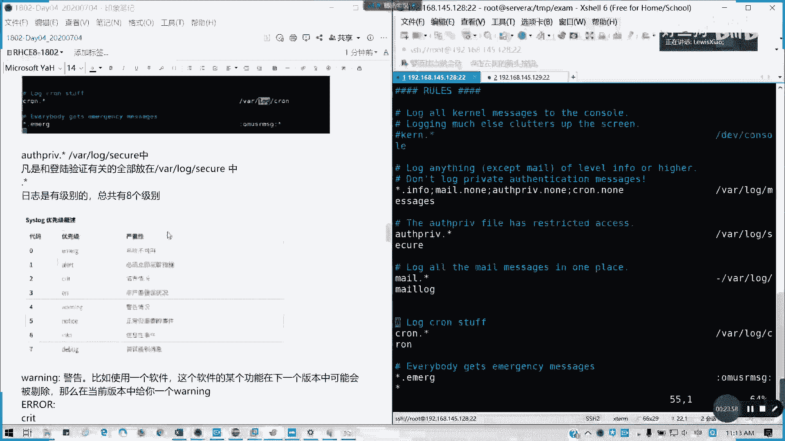
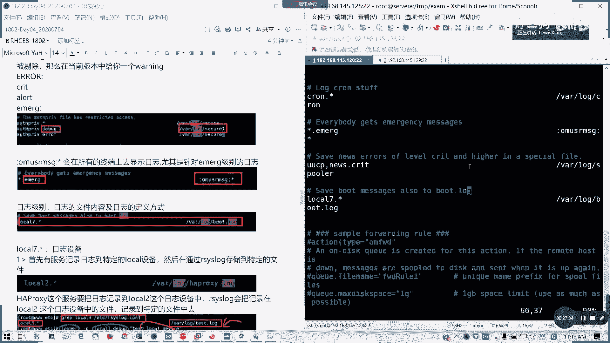
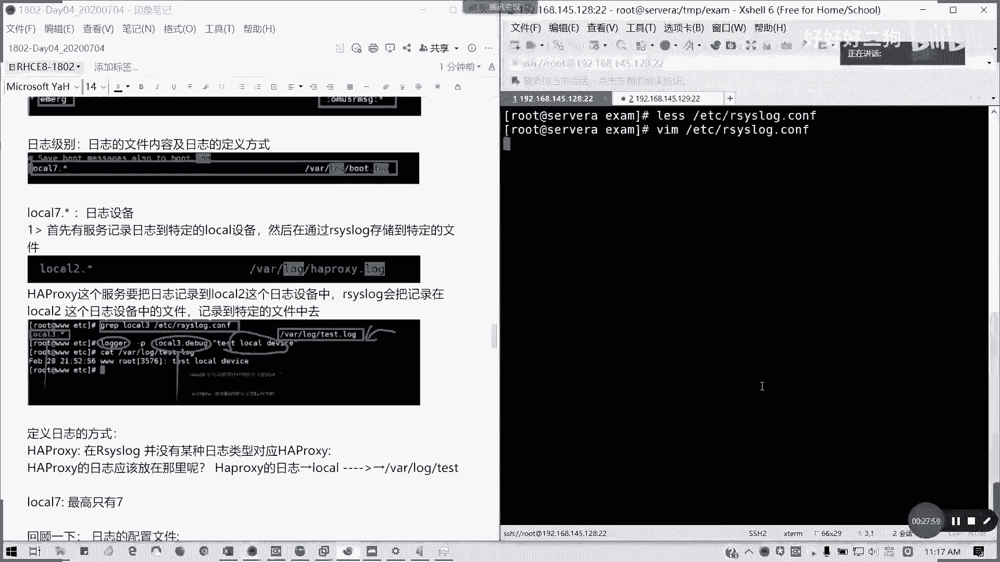
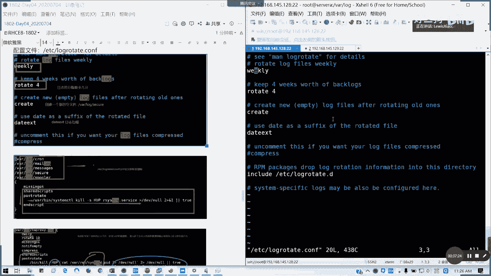
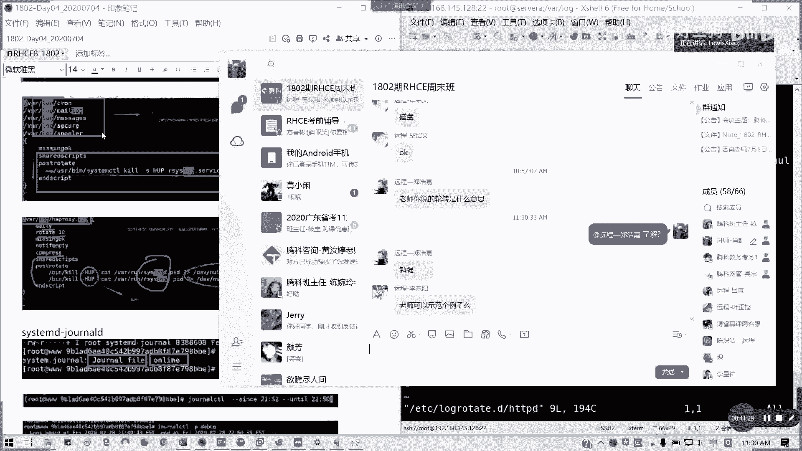
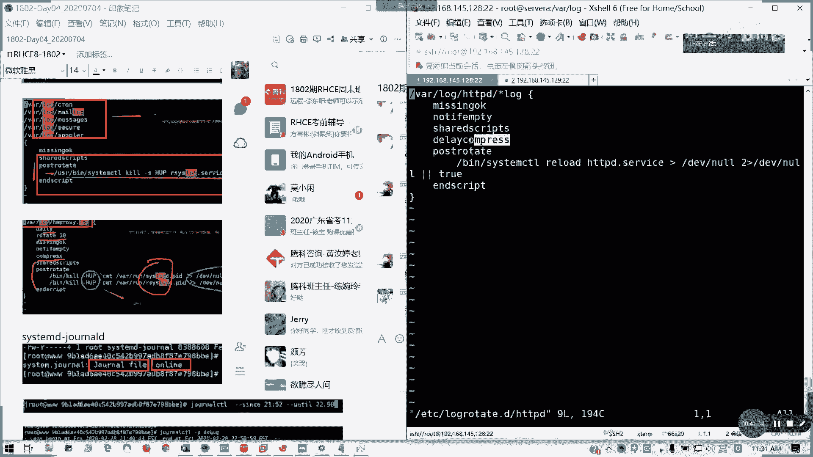
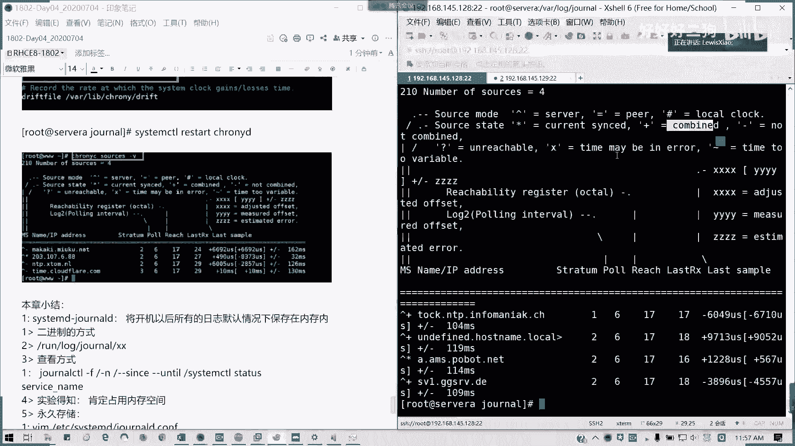

# Redhat红帽 RHCE8.0认证体系课程 - P20：20_Video_Day04_Ch11_日志管理 - 好好好二狗 - BV1M3411k77W

好10：49，我们来开始日志管理。

日志管理我们简单来说就是两句话，一个是要记录啊，我要记录用哪个用户在几点几分，做什么操作是吧，通常我们做一件事啊，人在做天在看，那所谓的日志系统就是那个天的作用，对不对，你做什么事情就像摄像头一样。

是不是非常清楚啊，你做的事情大家都知道了懂吗，所以的话我们就有一个日志系统啊，所以每一个完备的操作系统，都有一个日志系统记录，当然我们现在还有日志审计功能，因为信息系统等保的一个要求都会有这条。

那我们来看一下概念啊，在我们的我们的那个红帽系统里面，我们的rh l real系统里面，日志是通过一个叫six log的协议来记录的，叫系统日志协议cs log，那其实呢它只能记录，但是我整理出来。

它记录的是相当于一个原始的信息，那我怎么去将日式变为文可读的内容，那就需要我们的其他服务来做知识整理啊，在这里的话我们来看一下一个叫sister six lock。

还是一个叫sisystem d杠journal d两者的一个关系。

像cslog呢，它是一个日志记录的一个协议，相当于是一个标准，但我们的system d杠真有d呢。

它是记录跟服务有关，开机引导有关的日志服务啊，只有在运行的时候才有相关的日志啊，在运行时，才有相关日志啊，就是服务如果不运行的话，他不会帮你记录的啊，没人帮你这么好心的，对不对，所以的话我们一般来说。

我们的系统在默认的情况下，他这个服务已经在运行的，所以大家放心啊，就是说所有的操作啊，我的news，我们的system d杠之后的，你会帮你看着呢啊，他呢，如何保存呢。

如何保存，它是以二进制的形式啊。

保存在内存啊，保存在我们内存里面，就我们的运行内存里面，如果被重启以后，你会发现这个system d杠作用d的字是会被清空，没有了，对不对，那如何，那我们平常如何读呢，我们有看过一个叫做r c log。

service这个服务。

r c4 l这个服务呢就是把我们的system d杠，general d。service，它所保存的一个二进制内容转换成文本文档，也就是刚刚可见的一些知识文件对吧，而且会保存在我们的vr里面的log。

文件夹里面对吧，就像我刚才在客厅跟大家交流的，各式各样的logo知识，它是通过r c stock这个服务获取我们的system d当，journal d。service这个服务的信息宝。

就是他通过异地同步方式实施。

也就是说那个所以在加载内存之后呢，隔断就隔段时间或者是实时啊，看日是怎么设定保存到我们的文件违背，能理解我意思吗，所以我们看到的这次呢都是rc lock。service，这个服务帮我们去整理出来了。

那我们知道这个概念之后呢。

我们要我们要看日式的分类，通常来说在vlog里面。

一堆哈一堆一堆日式内容，通常我们看这几个，第一个最全最杂的message对吧，messages记住有个s的，大多数的系统知识消息都会记录到这地方，例外啊，他是例外包，就是它有一个例外。

就是比如说我的身份验证上面，运算不是保存在这里，电子邮件处理也不是保存在这，还有调度作业，它也不是保存在这啊，还有跟调试相关的也不会保存在这，这是大多数的一个情况，我们接下来就说这几个例外。

第一个安全与身份验证相关的一个c dog，它会保存为一个叫做我message，你看一下，是吧，这些都是我们服务啊，或者进程，我们调我们的一些大多数，我们可以看到一些信息，对不对，但身份验证不会在这里。

我们身份验证在哪里呢，there are log里面的secure，对吧，比如说在这里我已经接受了root的命令，然后从哪里啊，哪个端口通过哪个协议是吧，远程进来的，对不对，所以像这些的话。

就是一个身份验证服务，可以理解吗，vlog secure，它是保存的信息，就像我们的一个windows，我的日志管理里面是不是有个审核，登录成功失败，对不对，这个相当于windows这个功能。

就是我们的secure，相当于我们windows里面用户认证的一个功能，然后mail log是跟邮件服务器相关，当前因为我们没有啊，没有针对用户的一些邮件，也没有对应的post fix服务。

所以的话我们当前这个大的系统里面，mail lock是空的，但是我看看他有没有，他应该也有，之前那些文件也没有，因为他这个轮转过了也不存在，所以说这个呢主要是跟邮件服务器相关的，它都会保存在这里。

然后还有调度作业，对吧，我们系统原本啊这个在我们第二本书会讲到，就是关于调度作业的这一块，它其实不是说我们一装个新的系统里面，是没有任何调度，所有的其实系统本身有内置的一些调度作业。

然后所有的一些调度作业的运行的结果，它都会存在这个日志里面，空知道吗，我们接下来会在第二第二本书讲到，一个叫crown ca，然后还有一个非cs go控制台的消息，就刚才你讲的什么k啊对吧。

就系统相关的非cs go控制台消息，就直接显示终端上的，就这些对吧，那么就kernel这里开始就一大，就什么启动啊，引起玩啊等等这些这些服务的话，它会它会列出来给你，通常来说呢像我们的那个对吧。

刚才说的secure，他那个system d杠journal d，它的这是没有分类的，所以所有分类都是arc lo干的事情，懂我意思，像这次格式我没有看到，就类似于这样子，刚才我们通过secure。

我们看一看对吧，它通常的日志日志的格式会是什么样呢，我们来看类似于我们的这一条，或者是我们的这一条也可以，这里吗，这里是我们原端口，原端口诀就是我们那个发起这个链接的，我们的客户端，然后你要你端口。

是不是你不可能说这边没有端口去连接它，对不对，我要指定端口通信的，但是我们这里的话默认的话是用随机的端口，对随机，你要去连对方的22，懂我意思吗，所以我可以固定，一般来说也没有，你可以限定范围。

一般不固定，你固定的话，你一个待会被占了，是不是我不能打开第二个绘画对吗，能理解吧，所以他这个的话位置它端口，你一个端口只能打开一个绘画，所以通常我们按照默认来说，它它它的那个x shell。

它会按照他的牌子是5万端口以后，因为这些端口都逼着看你没什么服务再用，对不对，然后连对方的22吧，懂吧，通过s s取得那个通道，这个在上面一个后面这个36698，这个进程编号。

这进程就是我们的那个s h d，这个守护进程的一个编号，对啊，我们每个进程是不是有一个独立的pad，我是我可以拿这个p主要是可以看的对啊，p i d啊对啊，这里不要搞错啊，这p i d。

然后你可以一台机器是不是可以多个s h d，对能明白吗，像我们以这条知识来看，前面是时间，对不对，记录日志的时间，或者是我们叫做日志产生的时间，什么时候，那这里是7月3号晚上的09：13啊。

然后呢这个是缩短的简写的主机名，是谁产生的日志，当然我们arc log除了进入本地的机器日之外，我还可以进入远程机器的懂吗，所有才有这个主机名，比如说你连别人或者是怎么样。

或者是我们两台服务器做做负载均衡，它是会把记录日志都记录下来啊对吧，所以这个它就有一个主机名，就是谁产生了这条日志对吧，然后呢具体是哪个服务，哪个进程号产生的，懂我意思吧，后面就是具体的日志事件啊。

具体它产生什么视线，我们当然这些都是人类可读的，然后还有就是我们的啊，我们的那个服务类型日志，比如说像我们的http d，我们类似这个类型日式呢，它对对应的特定的一个服务服务日志格式呢。

它会在服务的配置文件里面定义好保存日志，我们看一下，在我们h t t p d它不是记得系统日志里面，它是通过配置文件定义了这个叫做assets，assets下划线log，对不对。

我们h t p d我们的web服务，他的日志是这样子的对吧，第一个，第一个它是一个我这个字，这是最端的一个地址，对不对，然后面就是状态码等等，这些不就后面就是一个日期对吧，他的动作状态码。

然后哪个客户端出来，其实呢我们这些的话，我们在那个http地点cf是有定义的，我们看一下我们搜索一个叫做log for much，诶，对吧，我们搜索http d里面log format。

这里的话就是我们的具体的定义，跟我们这里的图相对应，这是软件自己定义的一个格式啊，不是跟新跟系统没有关系的啊，你能懂我意思吗，像log跑跑跑马特，他有一个combine，就是然后它有它有一个加载。

这个它有一个common，就是一个通常的一个格式，然后还有就是一个详细的格式对吧，它加载一个叫做log io下划线model这个模块，然后这么长，这是软件定义的啊，跟系统无关。

比如说像我们的andres啊，我们安卓x像我们也是要定义的，对不对，然后就定义自己的文件目录跟格式。

当然我们也可以参它的默认的设置，但通常说我们他的字体格式，因为它可读性比较好，所以的话我们就通常不改它的格式的，我们只改哪里呢，只改它的存储的一个路径就可以了，因为存储路径呢涉及到一个。

我们如何去运维的问题对吧，然后有日志会报的嘛，对不对，这会报的，所以通常我们会专门安排柜空间来记录日内容。

好我们看一看，在我们日后日后使用linux的时候。

如果要查看知识，我们需要知道一些什么东西呢，第一个我们查看的是什么样的日子对吧。

查看怎么样，这是第二个所长，看日志的话。

我们要知道一个问题，就是第一个我们的服务到底是哪一个。

具体是哪个服务的日日志，我们需要去回顾，去排查，像我们的http d是吧。

像我hd d b d。

的配置文件里面啊，它是关于日式的定义以及以及日志格式都有了，对吧，刚才我们给大家可以看过它的格式。

跟它的保存位置了，第二个，如果是跟系统有关的日志或服务的简介日志呢，我们通常就是看两个地方。

一个是vr log下面的一些，对吧，vlog下面一大堆这些文件你可以去够你看的了，这是第一个，第二个我们可以是不是我们可以采用。

system control status，对不对，查状态。

然后后面加服务名，对吧，它会列出1234，我们列出后十条，它的那个日志出来，懂我意思吧，比如说我查一下这个信用服务，我知道他的他的那个有没有被加载，有没有被激活，从奶昔啊说开始的。

然后他的那个对应的一个文档对吧，然后呢它的主要的一个进程号的id，它使用它有多少个任务，它的内存多少，然后他的一个group，它的一个它的一个符，它的一个是它的一个控制一个组啊。

这组还有下面就是最新的十条日志内容，也是可以看到啊，也可以，但是它的这个定义呢就不像系统那么定义了，它定义了它自己有个配置文件的andres点康复，对不对，然后呢里面定义的自制格式，还有它存放的地方。

通常也，那我这里面我没抓安全啊，我就看hd p d有没有在这里，这种就是用那个七的话就没有这个有啊，都有六，就不是这样子弄，六是不是用system control的，七开始有这个。

然后还有呢就是如有更多的场景啊，更多的场景，比如说我们要记录像各种设备的访问啊，整整这些，那我们就通过专门的记录日志方式，比如说我们的e k我们开源的日志系统对吧，这样抓这样抓贝斯啊。

nul等等的这些像普罗米修斯，对不对，是各式各样的监控平台，无论是开源或是收费的，都可以，能明白吗，我们这里不讲ek，我们只讲系统日志，然后我们看一下接下来问题，我们刚才讲了system d杠jnd。

它是直接保存的内存，而且没有分明别类，那arc lock就负责干这个活，整理它是分门别类存放，然后它是通过那个r c slog去配配置定义的，来我们看一下这样一个定义，配置文件叫做r c log的cf。

etc项目目录下面的r c log，点c n f，唉我还是用那个用用vim。

因为有颜色，这样我会看的比较清楚一点，像这里的话，前面我们不需要看，我们看一看看后面的lo rose，这一块呢就是它的一个日志整理的一个规则啊，日程整理规则，诶我按了站姿练字键了啊。

看到这里的话，我们有一个lose一个规则啊，lose规则它就是说所有内核的日志啊，他按照指定的一个级别存放到哪里对吧。

我要筛选哪些日志对吧，筛选哪些日志，然后达到什么样的一个级别，我存放到哪个文件夹，所以我们所看到的这些日式里面的内容。

他都是经过r c log筛选之后才存放到这里的，比如说能看到这个surprief是吧。

all preef brief是不是登录验证有关的对吧。

所有日志点心啊，然后全全部放到这个文件里面。

像这里的话，有一些是通知级别啊，然后像那个mail，然后是那个飞机丙，紧要的，还有认证的非紧要级别。

让任任务的非紧要级别全部放在这里，懂我意思吧，这样提到一个级别。

那我们就要看一下到底有几个八个级别。

代号从0~7，零代表系统已经崩了，不能用了，所以通常你这个日式你这个看不到的，因为你看到的时候，你你看你来不及的，系统已经崩掉了，对不对，产生0号就是1号是必须alert警告报警，必须立即采取措施。

然后还有临界情况。

对不对，critical致命的error，非严重错误情况，然后通常是三以上级别才是严重的，我们要特别注意的。

四以下的都是一个轻微的一些告警，比如说像warning只是个警告对吧，像警告的话，比如说我们使用一个软件，然后这个功能呢我在我这个功能已经过时了。

但是我现在这个版本还保留，我下个版本呢，我这个功能即将会被删掉，会被剔除了，所以这个版本就会给你一个警告了。

就说我这个用法一定不用啊，我建议你用另外的用法。

就像我们enerable里面就有这类，然后我们就要注意，然后notice只是正常，但重要的事情就是给你一个通知是吧，info呢就是一般的信息性事件，还有一个debug就是调试好吧。

所以我们通常我们在运维，我们在做运维的工作里面，我们注意的是error以上的级别，我们不可能把所有日全输出，那这个你的知识得多大呀，对不对，无关紧要的很多，所以的话我们就要定义好我们的级别。

像我们这里的话，主要是那个它通常emojc眼睛是看不到的。

你的系统已经崩掉了对吧，通常我们注意的像alert and alert，critical cri t嘛，致命的那个那个简写前面的部分l error，我们要注意。

我们这里也可以自定我们日志，比如说我把那个安全这一块我来做一个定义，然后像我这里的话。

担心是secure，那我可以生成另外两个文件，可以吗，叫做osprey，就跟认证有关的debug级别，调试级别日志，然后呢来生成到我们的是我们的，我们生存到哪里呢。

vr log里面的secure一这个文件里面，然后all brief里面就是它的跟登陆有关的，aa级别的日志，我们当前是不是全部都说出了vr log secure里面，那我分明别类再弄一遍。

这其实就是定义它的日志整理的一个规则。

懂我意思吗，那你们是啥，就自己定义的那里定自己可以定义的话，那我可以更明晰一点，对不对，懂我意思吗，像我这样的话。

我像比如说像那个所有终端级别的日式，就是在这o m u s msg里面可以定义啊。

就everybody get emergency message，这里。

对吧，像这一行，像这一行呢就是锁就紧急级别，无论是哪个日式消息的。

只要是emergency的，就是你的系统已经快不可用的情况下，它所有终端都会报警，这是系统默认设置，懂我意思吧，然后他这个后面的o m3 m s j什么意思呢。

就会在屏幕上面直接显示所有终端都生效。

明白吗，然后下面还有一个logo啊。

1234567的这logo 7，这也叫日式设备啊。

就这个设备它原它将原有的服务日志呢，这个特定的一个local的本地的一个设备，然后通过arc去转储。

比如说像我们bot。logo，就是这样是吧，我特定终端我起我起引导启动的信息，是不是通过它转组过来的。

不过这个的话不常见哈，不常见啊，像我们保存这类的话，我们需要保存之后呢。

我们那个重启一下r c lock服务。

arc log，没有d哈，没有d啊。

然后因为现在还没有日志出来，所以的话他还不会有一个我会touch一个secure 1，还有诶我自己贴自己贴错了，他是探索一个q a一个q a2 ，然后待会如果有一些调试级别说这样的话，他会写在这里面。

但我们当前没有啊，通常我们也不需要去做这一步操作，就是我们定义的文件之后，它会自动帮你写的啊，所以我们这个local的话，它是有七个集，它是有路路口，12345676，就这也就相当于。

我们可以理解为纯自制的一个容器，我有八个临时容器，本地的临时容器，然后只要从那个特定的是吧，特定容器输出，后来消息，我们可以保存到我们的特定的文件里面，像我们这里的话，我可以有logo。

一六口二logo 3，对不对，logo 2没有哈，note 3好像貌似也没有啊，像比如说我看一下这些例子啊，在这里的话主要是路口七啊。

路七。

那这个用法我们通常会比较少啊，比较少接触，所以我们主要是一个logo器，就boot连log这个。

像比如说我们定义的一个日子的话，他会把那个相应日子存在一个容器里面。

就是这样的一个我们本地容器里面，然后再通过容器再转储到这个，然后最高的话是零，最高只有七哈，最高只有70~7。

所以的话这个我就不详细讲，这个如果大家需要用到的话，比如说我们http d你可以尝试一下。

在logo容器什么意思啊。

它是可以理解成一个日志的设备，只是一个暂存的设备，然后呢我们定义我们接下来回回顾一下。

就是我们这几个东西，对不对，我们定义的这个日志的话。

就是像我们的日志级别怎么定，然后还有就存存到哪些文件，然后还有的就是logo容器设备，还有一个就是那个所有终端显示的。

就叫做o m u sm g冒号星啊。

这个就是我们前面第一节给大家讲的内容轮转，日志轮转啊，刚才有提到日轮转，我们接下来来讲，其实也就是我们的日志轮替。

这好像讲的这个问题，我接下来刚好讲日志轮替。

日志轮替，我想让大家知道，如果你的日志只存放在一个文件。

那这个文件是不是会被异常的肿大，不断的往上涨吧，涨到什么爆为止对吧。

所以我们为了系统为也为了方减轻自己的压力，也为了说我们可以按阶段在每一个时间内。

我们可以查看到对应的日志。

所以他会触发一个任务，然后定义一种规则对啊，定个规则来实现日志的一个不断的一个更新。

对吧，比就比如说我每到哪一个时间点，我就把日志重新讲旧日志命名。

然后把现有的这个文件清空，因为他针对的只写一个目标。

那是不是我可以把旧日志我copy出来改名，然后把新的清空啊对吧，把现有清空，然后再保存再写新的，对不对，像我们默认的话。

我们是那个vr sq啊，log secure，它是有这样一个规则的，我们也可以自定义，也可以采用系统默认定义的一个方式，像系统默认定义的话是一周啊。

一周轮一次，像我的message，像我的像我们secure也是一样是吧。

对吧，我们是不是之前就后面加上杠日期的，就是一个旧的一个文件，懂我意思吗，他这种的话就是有两种定义方式，就是两种轮替规则，一种是你到日期了，我就给你更新，我我我就把旧的我我就改名保存。

然后新的话我继续写，就新的新功继续写下去，懂吧，然后还有一种就是你到达一定的大小，比如说我一个日志，我就设定我十兆是我日志的最大值，那我一个日志文件我到了十兆之后，是不是我要写新的了。

我就写不下去了对吧，我就把这个迟早满的日式我换一下名字对吧，我改一下名字，然后我寄生了新的对吧，然后还有一个就是我积累了多久，我的日志我要删掉，因为有些太久的话，你不可能一直保留在磁盘的越词。

保留磁盘也是遇到一个问题，你的磁盘空间不足怎么办对吧，所以的话会产生这种轮替的一个规则啊，那这里啊重点关注第一个日式人气歌手，我们刚才讲了第一个周期，比如说我们每周周五换一次，它通系统通常是按周21号。

按照周日来轮啊，每周日生成一个新的啊，然后还有就是日志大小对吧，还有一种就是混用多种组合，对不对，这个图能看得懂吗，比如说像我的secure，我可以就是说我当前达到四兆的时候是吧，然后4号之后我就改名。

这个文件改改成后面我加个日日记后缀，然后这个文件我就相当清空，我继续写，或者是说我到一天了，我改了对吧，就这里我到四兆，我改了，我到一天都行，对不对，怎么在哪里找呢，我们在一个配置文件叫做，这里有讲义。

原来没写在我这里补上去啊，配置文件叫etc lock rotate旋转，对不对，轮转这个单英文单词rotate对不，lock rotate cp，当然我可以在lock rotate。d里面去定义。

我们自定义规则，但我们这里先看一下我们的默认规则，对吧。

这里我们可以看看我们的默认规则是怎么样的。

互换规则，它是会第一个。

我每周轮转一次。

他这里定义的对吧，rotate lock fes weekly对吧，它是用weekly参数，所以的话每周轮转一次。

而且是在周日第二个我我后面的备份日志，我要保留多长时间，它默认是四周对吧。

wwicked rotate for，然后呢，他就是说我轮转完旧的文件之后，我是怎么操作新的，新建，他就直接把旧的改名。

然后新建一个新的，所以这个规则呢是在这里定义的，懂我意思吗。

然后呢他如何进定一个后缀，就已经轮转个文件，怎么去定义名字呢，就是采用一个延展日期，叫做data e x t，这个格式，也就是相当于我们文件名后面加一个横杠。

然后写一个y y y y m d d啊，然后它还包含了我们在rog rotate的d里面。

像有些程序或者用户自定义的一些文件文件，它会包含在里面，那就没了对吧。

这是主配置文件，你看rot。d啊，写写的什么东西，写什么东西，对不对，我们每个服务是不是都有轮转，轮轮转的一个配置啊对吧，就具体的服务它都有写的。

比如说我们看一下我们的web。

我们cslog对吧，它的具体的一个这一规则。

它会写在这五个上面，对对吧。

他会写这五个上面，然后呢就差你一个的轮替规则。

它就没有定义了啊，轮替规则写在这五个上面，在rotate in cot里面，然后这些是规则来的。

missing ok啊，然后共享脚本后面轮转前我要执行的什么命令。

就是把把这个进程杀掉是吧，能在前。

是不是把它会把r c log这个服务三个进程，然后重解压对吧，他这样的，然后他丢到那个空设备里面，然后或者是处嘛，就两者主要只要那个起义的话，它会会执行命令的，对不对，然后把脚本结束。

它这是一个编写的一个轮替的规则。

然后这个hub是什么意思呢，他给一个信号对不对，就就那个q的一个信号对不对，可以给一个相关的一个信号。

那这里如果针对某个具体的一个日志文件呢，也可以自定义文化人替规则，那么这个日志呢，它的轮替规则就采用自己的第一个定义。

轮体分析，而不是系统默认的懂我意思吧，像我们的cslog。

像我们h g p d，我们可以看一看。

对吧，他这里像h t p d，它是会定义它它的日志轮替在这里的，对不对。

新log吧，像sex rog error rock，对不对，然后他的那个轮替规则全部写在上面，然后有什么延迟压缩啊，然后还有在在轮转之前是不会重启这个服务啊。

对不对，重启我们的htp服务，所以这些呢都是特定服务的。

而不是财务默认的，所以这个懂吗，如果懂的话，我们日志轮替就讲到这，我看一下b少文啊。

我看一下正号加，明白吗，你不能赚的话，你这就是报的，勉强哈，也就是说你可以理解说我达到一定的大小，或者是我空间，我的时间到了之后，我就相当于把旧文件对吧，把旧文件改名。

他这里用的延迟啊。

说delay，例子啊。

我想想啊啊，这个其实我没有去细究啊，我们可以看一下那个裸配置里面的写法，我这也没去细究啊，那通常我们通常采用的默认服。

示范例子嘛，其实你们可以就定义嘛，你们可以把我这里可能没时间示范了，但是示范我可以告诉大家一个方法，比如说我把日志给我改成每天用每小时能赚，然后你就不断的去生成对吧，如果你不断登录。

你就secure是吧，不断的登录用户对吧，然后等到它过一个小时看看会不会刷新一个，这也是一个方法，但我这里因为时间关系，我没有办法不让大家示范，不是说我不会，但是这个号的时间有点长。

所以我们课后可以去大家试一试，把文件规则改了，然后是不是看看它每小时会不会生成一个，就行了。

我们接下来讲我们运行在内存里面的一个journal d，system d jnd这个服务。

我看一下这个文件在哪哈。

我看一下啊，他这个是应该是一个组来的，the system journal文件呢它是可以啊，system d这点真system。journal哈，对吧，他在run里面也就是它是一个加载在内存里面的。

懂我意思吗，这样在内存里面的日志，就刚才说的system d杠中有d它生成的所有日子，它是没有经过任何排序，然后直接在内存里面的对吧，r c s o x才是会归纳到里面去。

那好我们看看我这个文件怎么来的啊，我就我就看一下列一下这个文件属性给大家看，很长啊，对吧他这个文件它已经到了八兆了，然后它而且它只能跟那个主要是owner，是指读跟写，然后呢对于其对重组是只读。

然后对其他任务没有权限，然后呢它是一个什么样的文件类型呢，我切换到这个目录下给大家看一看，然后我用fire fire是可以显示文件的相关的一个属，性，本身的一个属性的。

它是一个journal fire啊，它是一个在线的日志文件，不是存储在磁盘的，在线的对吧，内存的run里面的信息，我上次讲了，文件系统是不是它是存放在内存里面的，包括我们的帕克跟cs都是一样。

那我们怎么样去查查日志呢，我们可以通过一条名叫journal control啊，journal c t r，查看内存日志啊，后面好像麦就是在断线，他这个服务是在线的，而且他这个文件也是在线的。

也就是它不是存在硬盘里面的一个文件，他就是相当于存在内存里面，然后我们怎么去读，我们不可能直接去cat吧，什么鬼对吧，所以我们要抓住control，把它转化为止，可读的。

我说我把我把这缩主要缩到旁边去啊，那让大家看到啊，我们不能直接cat，我们可以比如说我们查看一下，我们指定时间是吧，可以加参数是吧，就从哪里开始，从哪里结束，对不对，可不是不是可以查。

在这里我们看不到日志啊，他这里说话就会locks begin到end多少，然后它默认会列出一周的日志，或者是当天的，我看一下啊，看能不能写出内容出来，有了是吧，它显示出固定条目的，在这里的话。

它显示出那个21 6月15号到7月几号，我看一下啊，这因为我们显示了一半到7月3号，对不对，因为这里实际是减八，这是是那个不是标准时间，它是后面减八的，所以的话他的时间不太对。

所以他们用journal是不是可以看出这些对吧，我们筛选一个时间范围，since嘛，然后到until就从哪个时间段，哪个时间段，他帮你筛选出条目对吧，他的这次他会跟你说从记录从哪里开始，从哪里结束。

就是你开他这记录的范围呢是什么，怎么定义的，是从你开机啊，开机开始记录，然后一直到你当前的情况，然后再从里面筛选，你要你需要获取日志的那个内存日记，一个时间点，懂我意思吗。

那这行只是告诉你说我这个字是从哪里看，从什么时候开始记录，然后到现在的时间，对不对，然后下面就是我们筛选的一个，指定时间段的日志了，懂我意思吗，然后我们也可以加杠n是吧，我们如果串全体。

我们可以这样子又可以杠p啊，debug，我们可以唱这调试级别日志，杠p d e b u g是吧，我们可以看出所有的内核的调试自治权在这里，对不对，它会显示更加全面的。

就是调试级别开始日志都会在这里面会非常多，这里也许就是可以解答你现场一个问题，我在bot我引导的时候，我怎么根据时间来排列，这时间排列下日志，到底我从一机器，我一按开机键开始。

我整个系统里面到底发生什么事情，可以通过journal pl来看，因为你还没关机，他日志已经从那就开启时间点开始记录，就系统开始引导接手grab的时候开始记录，然后一直到你到现在的这个时候。

所以的话我觉得你是这个方法就查看这个日式，可以解决你这个问题，然后还有呢我要查后面多少就是杠n吗，对吧，这是最后一行的，你可以重定向啊，重定向教过吧，我可以重定向为一个文件吗，是不是可以啊。

有时候呢我们人都去作为一个r c4 ，懂吧，然后有个x1 x一就是显示车，服务里面有错误的，有错误，就是通常来说就是它会比如说你复报错的话，它会让你用这种杠x1 c t l杠x一对吧。

可以前说执行里面有错误的一些日志，可以直接显示出来，能懂我意思吧，像我们的话，比如说这里的话，我们还讲到一个就是修改方式，就是那个我们创建的话，这个专属c t l的话，我们通常它有一个叫做vr log。

看下vlog，jo啊，他不如我们要保存的话，它是通常来说就是我们可以创建这个目录，然后把那个journal啊，我们把这个journal写过去，但这里的话我如果不再说啊，你可以永久存储啊。

这里我要补充一下，你可以永久存储这个日志，通过我们创建之后来编辑那个journal c t l，降低是吧，如果永久存储的journal日是怎么办呢，m k d r我先创。

我先创建一个叫做七跟八是有点区别的，这是我讲话的方法，我们创建一个叫做journal目录，j o u r n a l是吧，然后呢我们编辑一下etc system d，jo d。cf，他这是一些默认配置。

像我们这里把storage是吧，我们改成它是自动的啊，我们这里改成一个persistent，持续存存储稍等啊，好我们回来继续讲，我们会马上回来继续讲，这里的我要存储日志呢。

我们将那个etc里面的system d里面journal d。c t f，我们把那个journal这里我们把storage改为持续存储啊，永久持续永久的持续存储，那么这样的话。

我们就可以把那个日志，存储到我们的本地里面了啊，就持续存储在本地里面，现在我们没看到效果哈，把服务重启一下，你看我重启一下，是不是有了，记得我们把服务重启一下啊，改完还是那句话，对吧。

他就会把那个日志我就存储在这里面了，它有一个随机文件名是吧，27b7 ，no system journal，对不对对吧，它就存存硬盘上，但是但是我依然不能用cat去去看，还是用遵守cctl，懂我意思吗。

可以理解吗，就我可以把内存里面我实时存储到这里，但这里会占很多空间，这懂了吗，可以理解啊，可以理解的话啊，我这里截个图啊，刚才我这个，我这里有截个图，大家都应该就明白了哈，可以理解吗对吧。

内核里面的日子我保存到这里，然后接下来跟日志有关的，我们要讲一下一个叫时间跟时区的问题，这里会涉及到一个叫做chronny的服务，也就是我们以前叫的nt p时间同步，网络时间同步。

我们通常怎么去设定时间呢，time date city是吧，通过这个，所以当前时间是吧，我e d t时间，uzc时间，还有我们的时真实时钟时间，然后现在的时间是mea new用，对不对。

然后如何去修改我们的时区，我录屏，我现在继续了，然后再set time dc t l，set time zone，然后我是这里，比如说我要设置我们东八区的对吧，asia asia有伤害，对不对。

广州是没有的，它只有几个，一个是乌鲁木齐吧，一个是上海，一个北京，一个是就台北香港，对不对，所以当我们默认我们用上海的这个就行了，然后呢我们再看一下它的时区是不是改过来了，logo time就改了。

对不对，就不是3号晚上了对吧，就变成我们现在的真实时间，北京时间，对不对，这里所谓的cs t是叫做中国的标准时间，而不是中时区哈，他这里的c s t中时区也是叫cs t。

但这里我们linux下local time的csd，代表的是中国的标准时间，它总共是有跨四个时区的啊，跨四个时区的，所以的话这里的话啊，我们把铁，我们现在把图替换一下。

我们这里的cd不一定是中国的标准时间，它是可视为像美国是吧，像美国啊，古巴这样的标准时间，所以csd啊，我看一下哎，这个图怎么不见了，我重新贴一下，这样就应该就明白了啊，像我们这里为什么说是上海呢。

就就那个我们是中国标准时间呢，对吧，这里的话这里的c c中国的标准时间哈，美国是中部时间哈，澳大利亚是中国时间啊，所以这里我们是中国的一个标准时间啊，这里的csd我表我写一下备注。

这里的cd china standard type，然后呢如何去我们这里，现在要配置我们的ntp服务是吧，所以如果我们手动设置时间呢，set time肯定会报错的啊，我们按照他的格式来输入。

2020070 42点点零零对吧，他会报告告诉我说n t p单元已经被激活，也就是我现在是采用自动同步的时间，我不能修改，对不对，所以的话如果我们要修改这个时间的话。

我们需要把n t p如果我们手动修改时间啊，sn t p，false对不对，我们把n t p设为false之后呢，我们才可以设定我们的时间，那这样我们才能才能成功，对不对，明白我意思吧，ntp关了。

这现在我就把mp v ntp临时关了吧，但是通常我们n t p还是要开的啊，n d p开的话就做什么呢，我们有其中，通常我们在我们在世界各地，是不是有时钟同步服务器，那这样的话我们就不用去调时间了。

懂我意思吧，就自动校正嘛，如果你n t p关的话，你如果说你的你的机器开或关对吧，你的机器开或关注是你系统，特别是你的那个我们pc机是不是有时候电池啊，没电了会老化啊，或者这样的时间会越走越快。

越走越慢，对不对，像这种话，你对业务会有一定影响的，所以的话通常的话我们是用统一的一个这样，如果在内网的话，它是有一个统一的一个时间校准服务器，就对外网就叫北京时间的，然后全部都同同步它就可以了对吧。

我们企业是不是这样，不可能你全部放外网是同步的，那这样很危险，那我们还是设为true吧，我们再看一下什么时间，我们把那个时区再设回来，立马同步，对不对，立马同步，那我们如何去配置我们的n t p同步呢。

主要pc n t p同步，那我们就看一看我们的那个一个文件叫做etc，cory，我们有个叫cory服务，在红帽七里面开始都叫这个服务，像以前的红帽六，以及叫n t p。com，对以前啊。

以前是那个ntp。com，现在叫做chy，他交给cory服务去做，然后这服务默认是启动的，它有一个叫chy d的一个包，但是通常我们都都有啊，我们看一下这个文件，看到这个词没有。

它这个是同帽的nt p的服务器，红帽mvp的一个重复实验时，懂我意思吗，如果我这里比如说我到我们的考试环境，比如说我们的练习什么，练习环境里面有个叫classroom。example com。

我要设置它为一个n t p的，一个同步的主服务器，那我们就直接就在这里加开头，就是一个时间时，然后classroom for example等于call，然后后面加ipad什么意思呢。

这是一个他会每八秒钟去发发发一次指令，时钟脉冲，让他去同步你的时间，每八秒钟懂吗，这里的话我就加个注释啊，我加一个注释，因为我们cos这台机器，因为我们现在用的制度逻机的环境，我们这个这个并不存在的。

所以的话我就打个注释啊，考试如果需要你去同步时间服务器的话，你就打对应的，他那台提供资料的一个讲示器的，服务器的名字就可以了，然后弄完之后，是不是要重启服务啊，对不对，我们配置完每一个文件之后。

记得都要重启服务，reload也可以，我这里直接restart，问题也不大，很快的，然后呢，我如何查看我的时间同步源，就同步是否成功，就是chonic，sources杠v是吧。

他这里的话它获取了几个是吧，几个同步时间源，然后你的那个，你的那个跟他的一个延时有多大对吧，它的听它的连接时间。

还有你的跟他的标准时的时间多大，他这里的话它有它就有一个同步模式，它有一个蓝模式是吧，比如说我的是server啊，还是对等的，还是我们的本地时钟，对不对。

然后还有它的类型是混合的呢，还是说直接同步呢，或者是不或或者是不比较是吧，就比较过还是没比较的，然后还有一些问号，就是不可达或者是有错误，或者是时间可用，对不对，我这里用默认的红帽那个池。

他同步到了四个实验实验资源，然后以此来校正我们的时间，懂吧，结合它本地的时间，加上我们时区来换算，所以这个明白我意思吧，时间同步nt p考试在nfs里面。

大家建议做，因为nfs如果你不做n t p的话，会可能导致你的服务器挂载硬盘挂不上的问题，就你时间异步了吧，不会特别是有时间出的一个情况下。

会可能会这样，在这个在之前红帽期的话是会出现的，就是你两台服务器时间不一致，你挂不了牌，所以这个n t p的话，你就考试在考试正式考试里面，你就配一下就行了，很简单的一句话，在rh cs a7 的版本。

它是有一道题目，就是配置你的时钟服，你的本地时间跟某某台服务器同步，我们就做这么多的步骤就可以了，直接编辑完重启服务，加这个词嘛，重启服务，然后掉帧看看就可以了。

所以我们本章讲这么多是吧，主要是一个system d专属d啊，就是说它是保存内存内的，我刚才也说明了为什么会保存内存里面，那我怎么把它存储是吧，然后呢它是二进制的方式，然后可以保存在run log。

它是保存run log journal，然后里面一个id里面啊医生很长串的id，然后是一个叫做system，我这里补充完整叫system。journal，查看方式呢遵守ctrl不能用cat。

不能直接用cat，用journal c t l它才能翻译成我们人类可读的格式，对不对，然后还有一种就是system status，也是查他的对吧，它是肯定占内存空间的，我们在主要增大化。

我们我们刚才也有做过，所以的话就它是可依照内存空间的，然后永久存储，就刚才我们这一步，然后直接创建目录，然后重启服务，对吧，然后我们的ac log做什么用是吧，我们的那个将我们将我们内存知识。

分门别类转出转转文文本文档，然后呢我们可以在r c4 l里面，e t c r s l里面定义，比如说它的日子设备logo，日式设备，它的格式，它的日志级别，然后logo发送日志对吧。

它的格式我们讲的格式还有轮替日志，轮转啊，都讲到了，然后就是一个最后讲了一个时间管理是吧，时间时区，本地时间远程服务器，也就是我们的chronic d，也就是或者是叫做ntp，不更更容易理解到ntp。

本章第11章的内容，我看一下讲了多久啊，讲了一个小时078分钟啊。

有问题请提问啊，有问题请提问，我看这是什么东西啊，看起来明白了是吧，修改对修改时间，你要配置好这些文件没有错啊，然后呢，这章内容如果明白请打11，请扣11哈，这一章内容明白请扣11。

重点是我们要掌握好日式的一个运作运行方式，它是怎么样去记录什么人t，然后n t p的一个时间，有问题可以直接提问，现在12点，我待会把网络开个头啊，待会在12：15模网络开个头。

然后12点半我们准时下课，你现在可以休息十到15分钟，如果大家现场的叫麦，可以不可以笑了啊，你先休息一下。

