# Redhat红帽 RHCE8.0认证体系课程 - P21：21_Video_Day04_Ch12a_网络管理1 - 好好好二狗 - BV1M3411k77W

好各位师弟师妹们啊，我们现在呢先讲12章。

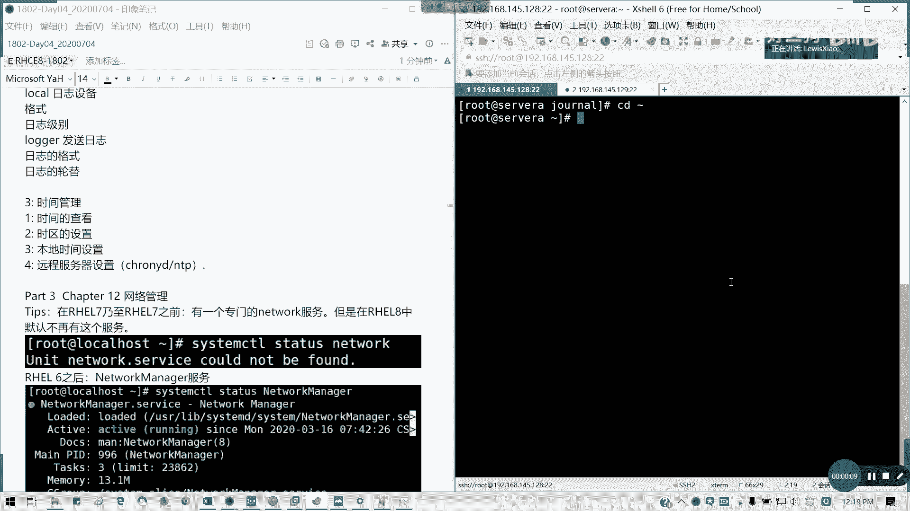

我们先开个头啊，网络管理，网络管理呢，我一开始是不是讲了一个在同貌八跟七的区别，我是不是讲了一个东西啊，就是说在红帽期跟重茂期以前呢，有一个专门的network服务，但是在八里面默认是没有了。

因为这个这个组件已经被淘汰了啊，c我们的system，感受啊，在内存word服务，它们word已经没有了对吧，全他吧，里面全权给了network manager，就是我们的网络管理服务。

而且这个服务是不能被关闭的啊，懂我意思吗，这是八跟六七以前最大的区别。

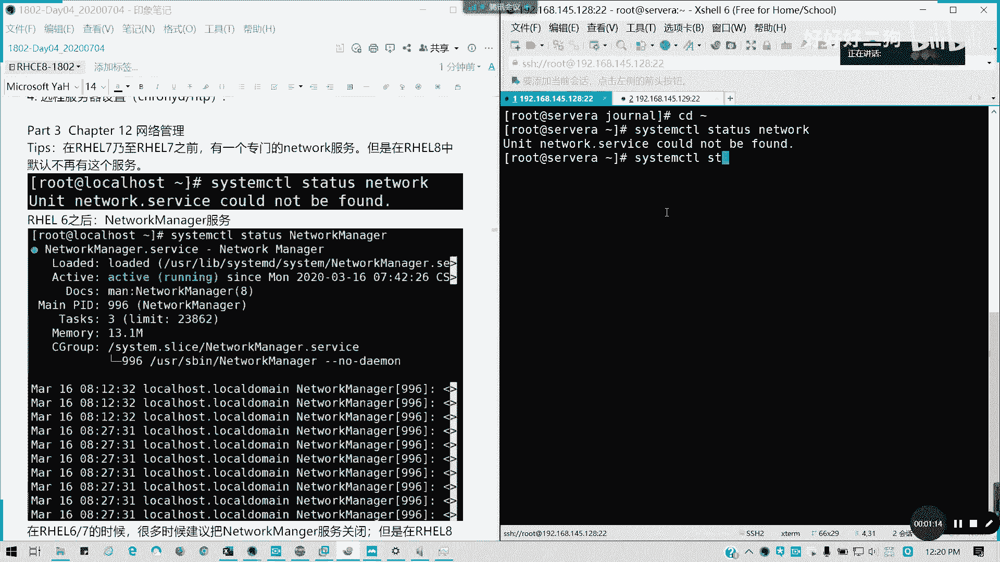

对吧，这个服务在八里面不再允许被关闭，在以前的话，是不是我随便我，我如果说网卡我要自己配置，我不受他的管理，那我可以关，但这里的话，八点以后的版本是不再允许被关闭，这个服务啊，所以这个要注意。

我们重启完看怎么办，待会会说，但你如果你想装这个在红帽八里面还有这个包，但我不讲，我不建议大家继续用了，因为在九大版本之后呢，下一个大版本，比如说九他就不再支持这个完全剔除好，那我们讲一下网络管理。

网络管理呢，首先我们要知道网络设备是怎么样命名的，放心我讲到12点半，我下课啊，先开个头，在我们红帽六以前呢，是不是我们的ruby only，然后e t h0 ，e t h e，对不对，像我们现在。

是不是采用了一个叫bios设备的命名规则，我们在接触期的人该知道啊，我们民命名方式发生了很大的改变，像我们这里什么es 160了是吧，我们这里的e n s160 ，是不是我的v i v r v r0 。

是不是这一块的话都是我们的叫做bios dev name，boos device name，采用bios的一个设备的命名规则，所以我们在我们红帽期以后，我们命名网卡的方式跟网卡类型有关。

首先我们把e s160 啊，相信大家刚装那个红包八的时候都是e10 ，它默认的一个名字，那我们把e160 代表什么意思呢，首先e n代表色net以太网卡，有线网卡，知道吧。

e n a e internet s代表是那个是pcs 2，也就是我们pci总线的一个插槽，可能有些我们像我们笔记本的内置的，但是他就默他就默认定义为一个，你走pci总线的一个插槽。

然后后面是一个port number，它的一个端口号，比如说这里的160，事实上呢网卡的device也对，我们设备的名字是可以被更改的，比如说我们按照功能可以去改它，对不对，可以自定义，没有问题啊。

只只不过我们刚装的时候，我们是按照系统默认分配的一个叫bios dev device，name的一个规则来命名，我们这里看到网络接口，名称呢是以网络接口的类型，以该开头，比如说以太网沿我们的w l。

我们的无线网是吧，无线以太网wl开头，我们的万维网就接着为外网的设备，是以两个w开头，然后呢在接类型之后呢，接口名称，其余部分呢将基于我们服务器，或者是我们的电脑设备固件提供的信息。

或者是由我们的pci总线拓扑里面的位置，设备的位置来确定，所以我为什么它采用一个叫做bios device，name的一个原因，在这里欧文呢n是编号啊，onn它是表示这个板载设备。

且服务器的固件编号的索引编号为n，所以咱们e n o一啊是代表板载的以太网设备，就是我们简单来说就是服务器的一个内置网卡，就固化在主板上的，通常呢很多服务器不提供，因为很多人都是走pc总线的，对吧。

很多服务器都是第三方，我外接一些网卡，对不对，像sn e n s n呢，它是表示设备位于我们的pci插槽的，热插拔里面的，所以es 3呢是代表pci插槽三中的以太网卡，懂吧，是那种插卡的外置。

我们俗称的叫做我插在机箱里面，我们另外买的啊，然后呢p n sn呢代表是一个插槽n里面，总线m上的pci设备，通常说是比如说我们无线模块是吧，我们的到底有l p4 s0 。

代表是位于插槽零里面pci总线四的，我们的无线网卡，如果该卡是一个多功能设备，比如说我多个端口的以太网卡呢，或者是具有以太网之外的，其他一些功能的一些设备呢，他设备我可会添加一个叫fn是吧。

方损f代表function功能，懂我意思吗，他同一设备不同功能的话，就就后面加f0 f一等等，以此类推，能明白我意思吗，然后如何查看我们的网络信息，像刚才我们执行的一个i p a d d r show。

它的完整名称就是ip空格，address空格show，它是可以显示我们的网卡的ip信息，我们的mac信息，我们的状态信息等等，像这里的话，像这里的话，我可以换一个截图一样的啊，这里是100。128。

我这里是1145。28，差不多了，在我们是他的那个n t u，它的一个网络传输单元默认是1500，它的网卡名称是e660 ，他的那个网卡的mac地址就是这串，冒号隔五个，冒号隔开了六个段。

这个是网卡的物理地址，也就是网卡相当于网卡自己一个身份证，懂我意思吗，网卡身份证，然后呢，它这里i net它这里会显示你的ip v4 地址，还有它的桥接到哪个网关是吧。

然后i i net 6代表的是ipv 6的地址，能明白我意思吗，然后如果要查看具体的设备，后面就跟具体的网络网卡的一个名字就可以了，对吧，路由信息怎么查看呢，ip空格root对吧，路由信息呢。

通常说我们只需要知道两个东西就可以了，第一个我的默认路由怎么走，就是除了我特殊设定的路走向，也就是我会指引说哦，我哪个ip段往往哪边走，通往哪个出口，对不对，像比如说默认默认路由的作用呢。

就是没有明细路由的情况下，吓一跳去哪里，也就是我们default关键字内行，他怎么出去，对不对，像我们145。2g这个默认的除了一二点，我走12。1这条线是down的啊，这条线是down的。

然后幺四点是走145这个128，这个出去啊，然后其他路由全部走这个e s10 出，他这个是这么描述的，懂我意思吗，然后我们要看具体的路由对不会换具体路由，我们通过root杠我们可以打印出我们的路由表。

这涉及到一些网络联系知识了对吧，像默认路由就通过要45。2这个网关出去，然后要二点的，就是通过我们b20 对吧，网卡出一四点，通过e410 出，这能看得看得清楚吗，可以吧。

然后dns信息我们通常要不就写在网卡里面，要不就写在一个文件，叫做etc resolve。cf里面对吧，通常会写在这里面，但这个文件是我们的内外面女主帮我们生成的，我们也可以把dns写到里面。

但最多允许两个主辅，你不能超过三个，超过三个的话，前两个为生效，后面全部是不生效的，查看主机名，我们第一节课已经讲了，whole name或者是whole name control是吧，走吧。

对吧都可以。

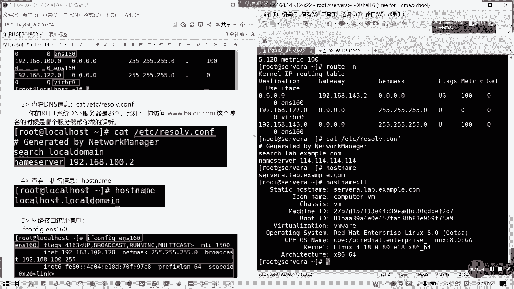

然后查看网口的统计信息，i f config淹死160对吧，他这里就是它包括啊，我们当前的ip i v4 v6 地址以及mac地址，还有它的接收包字节图多少，发送的包有没有错误是吧。

这期日信息都统计出来了，还有一个一个命令叫ip杠s是吧，杠status，然后link so我们查看哪一条链接，比如说我查看我们的es 60也是显示啊，就是他这个是经过网卡的所有的包是吧。

跟这个信息跟这个是一致的啊懂吧，不过现在因为我们就过了十秒的话，他流量又发生了变化，这高数也增长了，所以的话它会有一些一点点出一丢丢的出入啊，明白我意思吗，网络连通性测试就是拼了对吧，我讲讲完这个啊。

拼的话，比如说百度点call是吧，跟我跟域名或跟ip地址都知道啊对吧，通常说在linux下，它就如果你要拼具体的那个次数的话，就后面不跟不跟啊，这跟windows不太一样。

windows默认他会拼四个包，然后就结束，那这里的话如果不指定的话，它就会默认一直拼下去，所以说比如说我c3 是吧，我就拼三次停对吧，然后我我可以指定我的拼包大小，默认的话它是包是那个56个字节。

比如说你的拼包过大的话，它就会有丢包啦对吧，我2048，然后加上了18个字节的一个豹纹头，那就2076，是不是不通了，对不对，懂吗，包括大发不过来呀，它默认i c m p是不是56个字节啊。

然后加上包头是84啊对吧，应该都知道啊，n对吧，所以你包太大的话，你都丢包了，通常超过1000的话，已经是搜不到，对不对，超过签收不到，因为它的加上28个字节的表，一个包头。

然后就我对于i t v6 地址器的拼六，比如说我们拼自己，拼六，对吧，不是拼四了，拼是拼i p v4 的拼六啊，然后呢我们可以跟踪路由叫做trace pass，也就是相当于我们的微。

我们的那个windows transfort，懂吗，我们可以进行一个路由的跟踪对吧，就从本机，然后一直到我们的目标会经过哪些路由，像no require代表没有应答，对不对，好像比如说我我到通道。

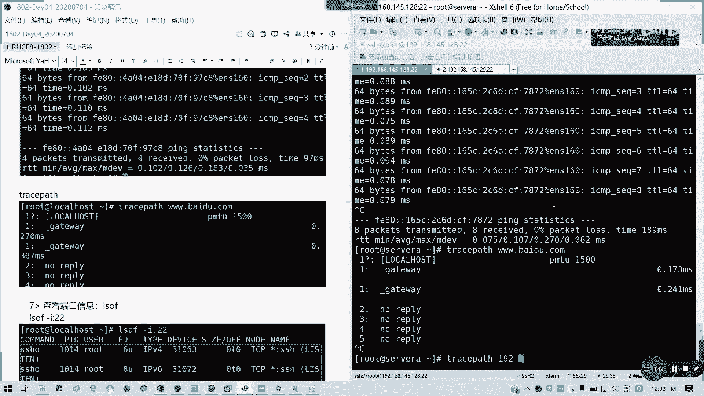

我的隔壁的cvb 145。129对吧，logo后死，那下跳应该就到了。

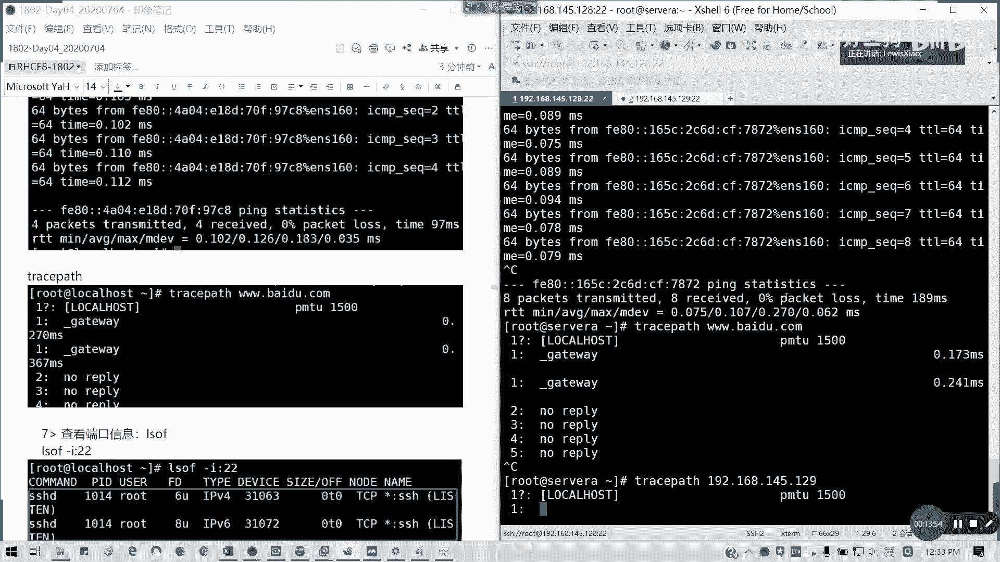

对吧。

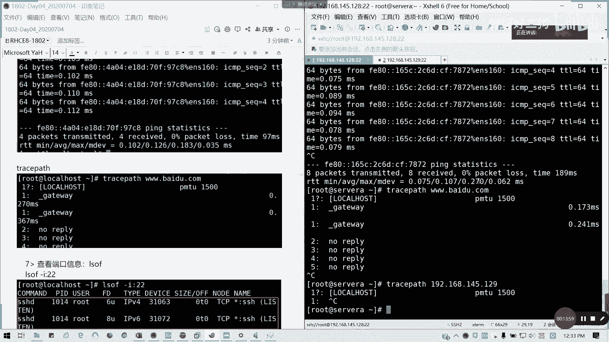

我要chest路口能不能用啊，以前是可以的，但现在没有这个命令了。

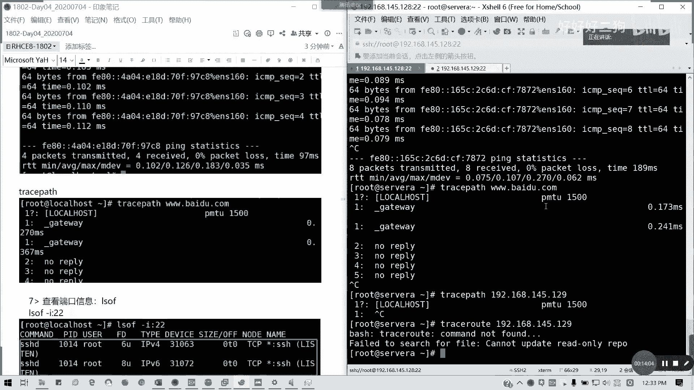

这个七还有吧，八没有的叫trace pass。

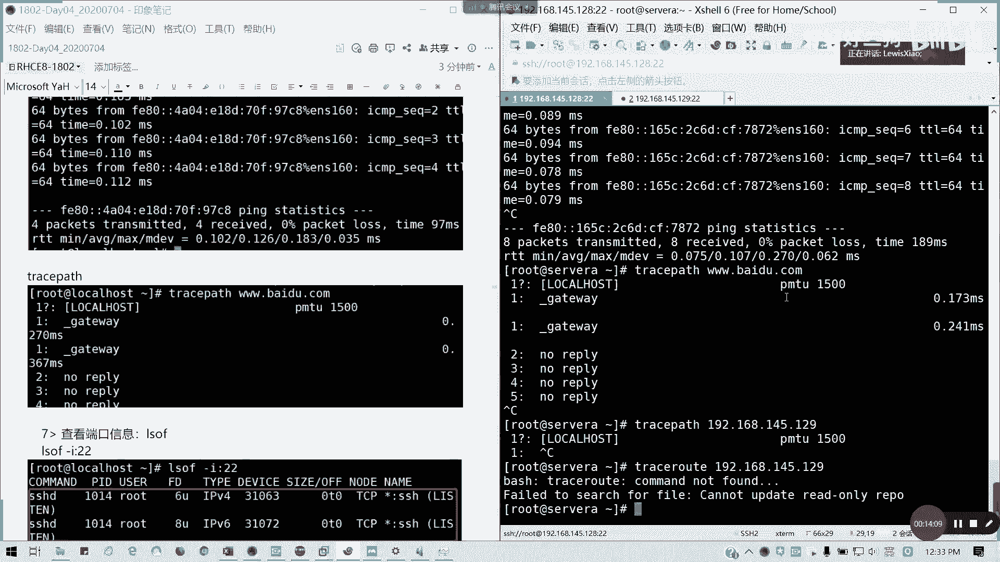

然后我们查看端口信息，用ls off，比如查看22端口的信息对吧。

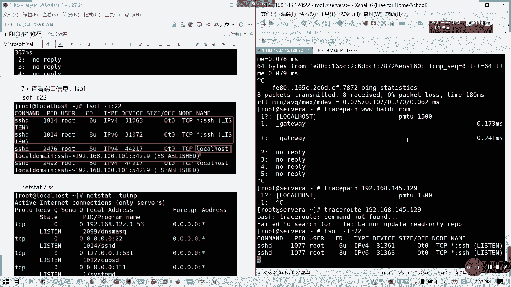

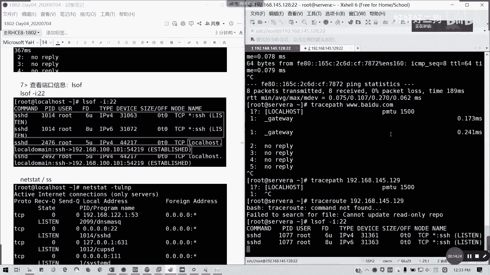

懂吗，查看端口信息，后面杠i冒号跟端口号，然后我们可以用next data，查看我们的整个网络连接状态，包括我们监听的状态，next d，透明该参数t o l p是吧。

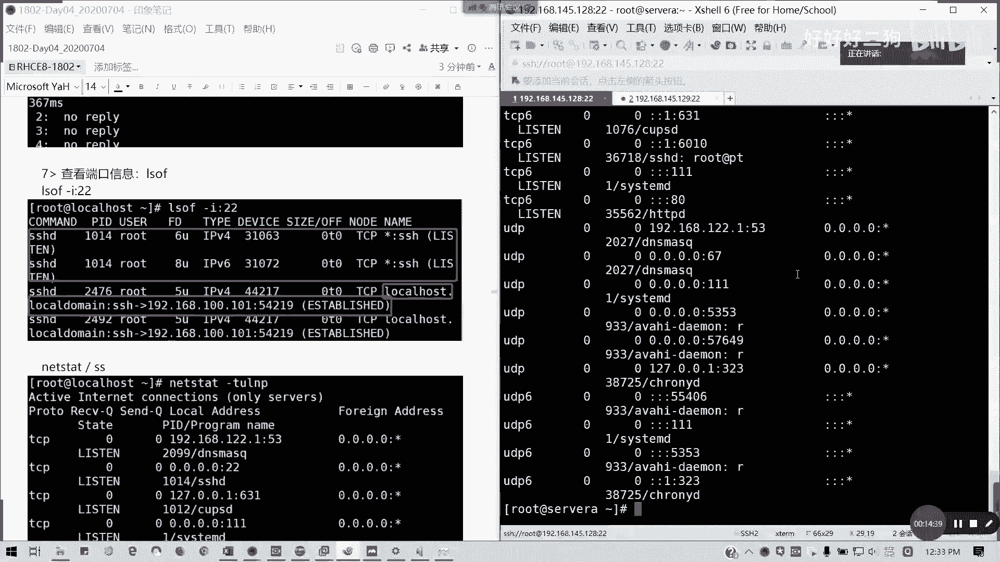

就用户哪个用户，然后根据什么协议，然后他的p i d还有他的一个名字是吧。

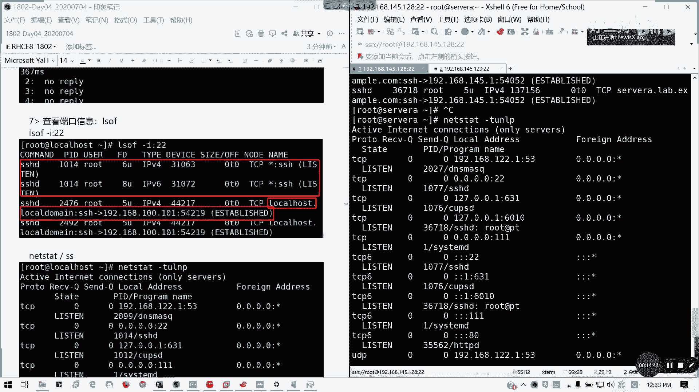

或者进程名字，然后根据哪个从从外部哪个端口连过来。

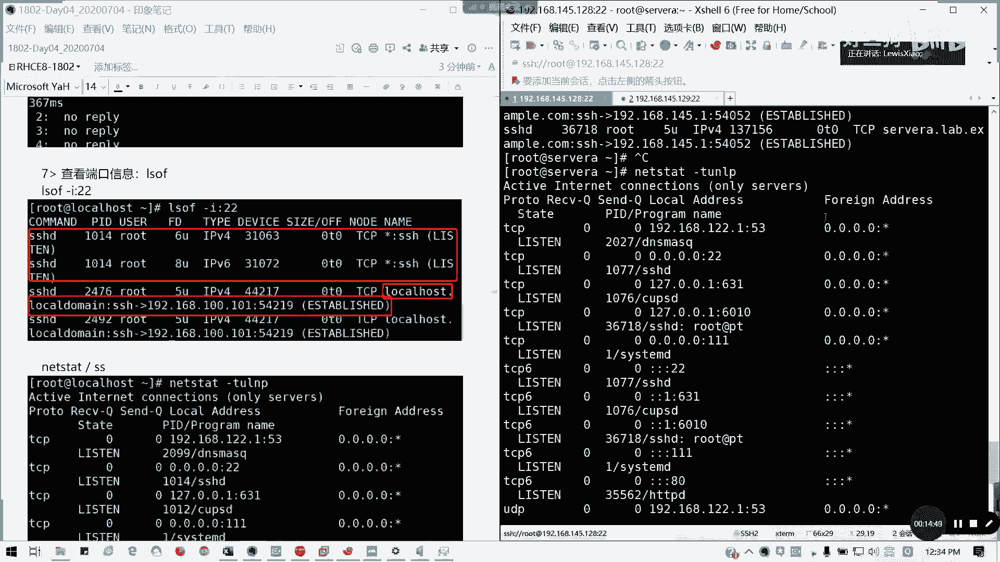

对不对，它还有一个代替名字叫做s s js。

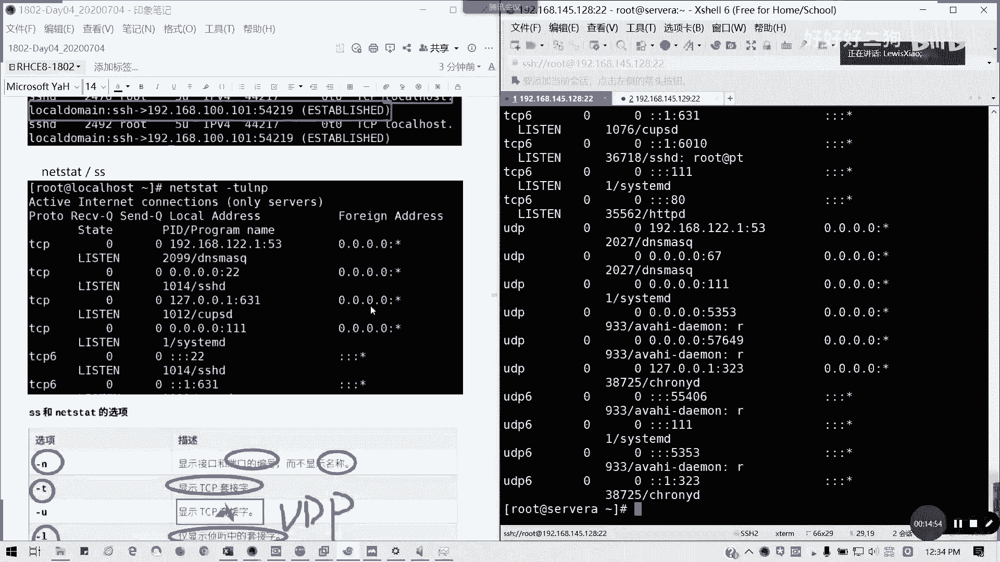

是现在现在新的一些命令，next date已经是被开始逐渐被放弃的了。

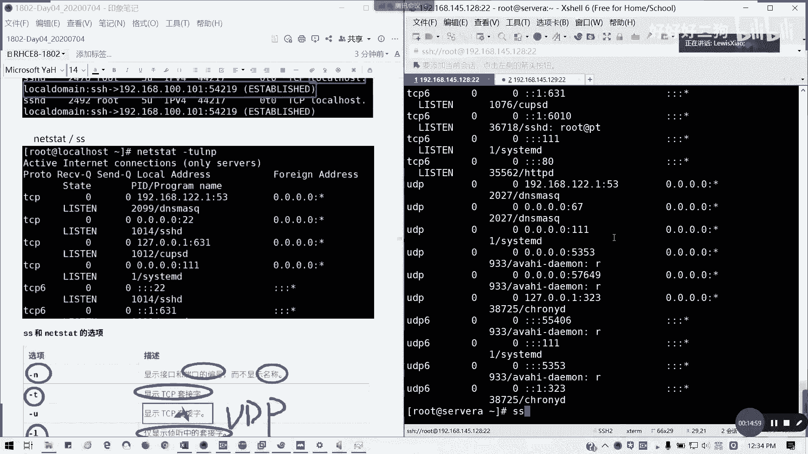

ss的功能跟next date一样。

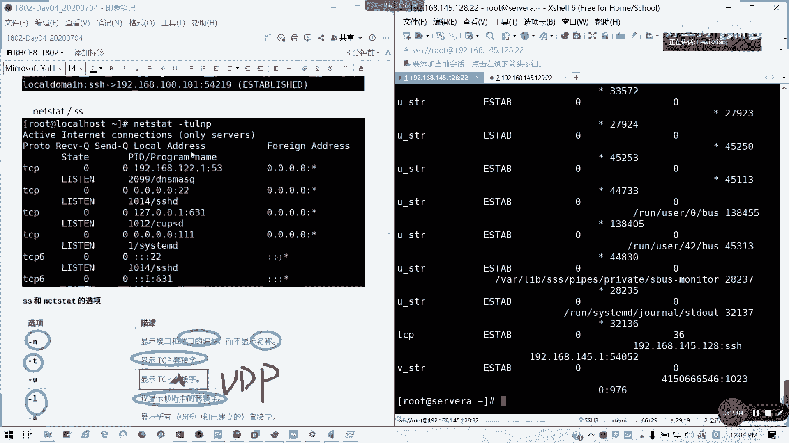

像这里的话它有一个选项的一个差异懂吗，选项其实是通用的，只不过现在可能更多的这种s懂吧，所以这些就是我们书上这里的话，我们就把tcp改成ud p的套接字，其他没有错。

杠u哈n n n t u p a nt l p啊，我们通常用这个选项，通常这里那我们先开了个头，我们下午来讲网络信息的配置与管理，我们大概现在拖了五分钟，我们下午2。10分开始讲课好吧。

现在接下来中午我们先这样啊，这个视频我会先结束，然后下午2。10分，我们这几十分钟或15分最多不超过02：15。

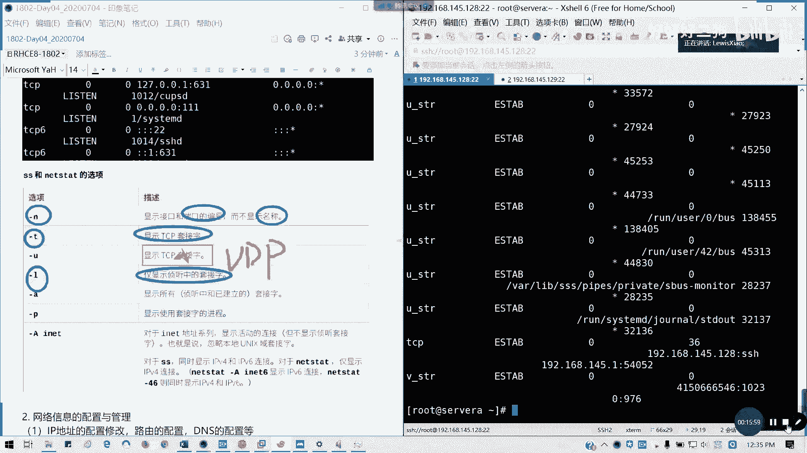