# Redhat红帽 RHCE8.0认证体系课程：P21：网络管理基础 🔌

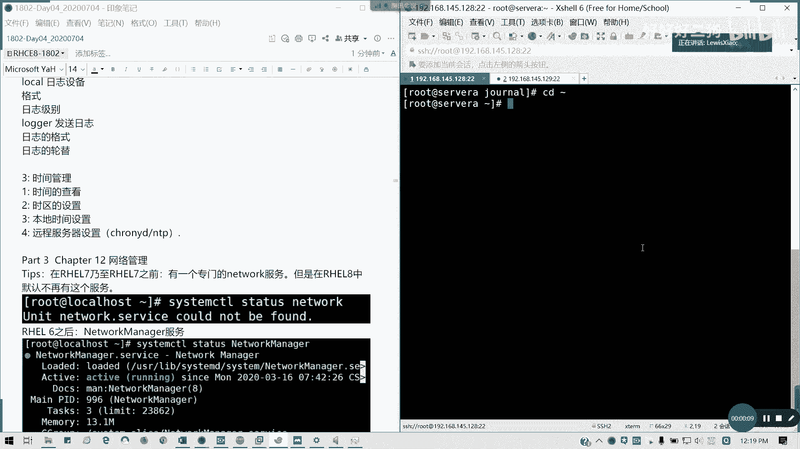

在本节课中，我们将要学习红帽企业版Linux 8中的网络管理基础知识。我们将了解网络设备命名规则、查看网络信息的常用命令，以及进行基本的网络连通性测试。这些是后续进行网络配置和管理的重要前提。

## 网络管理服务的变化

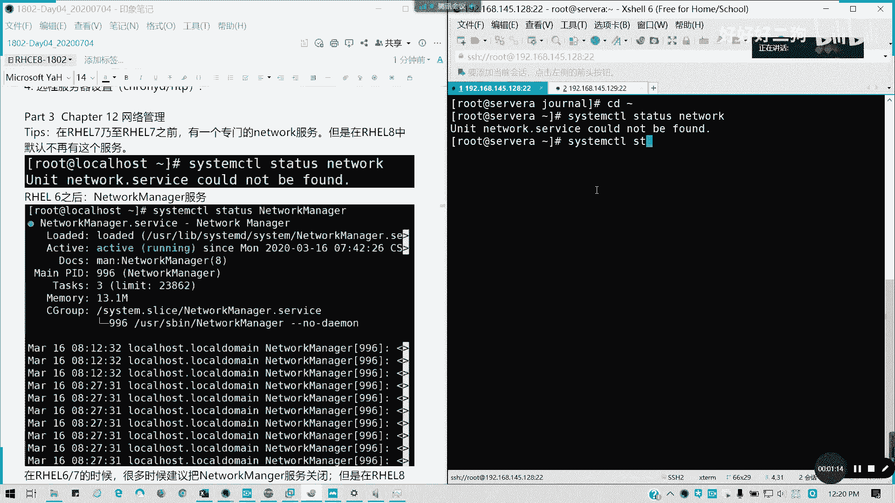

上一节我们介绍了课程概述，本节中我们来看看红帽8与之前版本在网络管理上的核心区别。

在红帽7及更早版本中，系统使用一个专门的 `network` 服务来管理网络。然而，在红帽8中，这个服务默认已不存在，因为其相关组件已被淘汰。

```bash
systemctl status network
```
执行上述命令，你会发现 `network` 服务已不存在。

网络管理的全部职责现在交给了 **NetworkManager** 服务。这是红帽8与6、7版本最大的区别之一。更重要的是，在红帽8及以后的版本中，**NetworkManager 服务不允许被关闭**。在早期版本中，如果你想手动配置网卡，可以关闭此服务，但在红帽8中这是不被允许的。虽然红帽8中可能仍存在 `network-scripts` 软件包，但不建议继续使用，因为在下一个大版本（如RHEL 9）中它将完全被移除。

## 网络接口命名规则

了解了服务变化后，我们来看看系统是如何为网络接口命名的。

在红帽6以前，网卡通常被命名为 `eth0`、`eth1` 等形式。从红帽7开始，系统采用了基于固件、拓扑和位置信息的 **一致性网络设备命名** 规则，这通常被称为 `biosdevname`。

例如，常见的网卡名称 `ens160` 含义如下：
*   **`en`**: 代表以太网（Ethernet），即有线网卡。
*   **`s`**: 代表该设备连接在PCI总线（PCIe）的插槽上。
*   **`160`**: 代表端口或索引编号。

网络接口名称的其余部分由服务器固件信息或PCI总线拓扑中的设备位置决定。以下是常见的命名前缀：

*   **`eno1`**: `o` 代表板载（onboard），`1`是固件索引。这通常指服务器主板集成的网卡。
*   **`ens3`**: `s` 代表热插拔插槽（hot-plug slot）。`ens3` 表示位于PCI插槽3中的以太网卡。
*   **`enp4s0`**: `p4` 代表PCI总线4，`s0` 代表插槽0。这表示位于总线4、插槽0的以太网卡。
*   **`wl`**: 无线局域网（WLAN）设备的前缀。
*   **`ww`**: 广域网（WAN）设备的前缀。

如果设备是多功能设备（如多端口网卡），名称后可能会添加 `f0`、`f1` 等来表示不同功能。

## 查看网络信息

掌握了命名规则后，我们就可以使用命令来查看系统的网络状态了。以下是几个最常用的命令。

### 查看IP地址与接口信息

使用 `ip addr show` 命令可以查看所有网络接口的详细信息，包括IPv4/IPv6地址、MAC地址和状态。

```bash
ip addr show
```
若要查看特定网卡（如 `ens160`）的信息，可以执行：
```bash
ip addr show ens160
```
命令输出会显示MTU（最大传输单元，默认为1500）、网卡的MAC地址（物理地址，如 `00:0c:29:xx:xx:xx`）以及 `inet`（IPv4地址）、`inet6`（IPv6地址）等信息。

### 查看路由信息

路由决定了数据包从哪个网络接口发送出去。使用 `ip route` 命令可以查看系统的路由表。

```bash
ip route
```
输出中，`default via 192.168.1.1 dev ens160` 这样的行表示**默认路由**，即所有未明确指定路径的网络流量都通过 `192.168.1.1` 这个网关，从 `ens160` 网卡发出。其他行则是通往特定网段的明细路由。

### 查看DNS信息

域名解析通常由 `/etc/resolv.conf` 文件配置。该文件通常由NetworkManager管理生成，但你也可以手动编辑。需要注意的是，最多只能配置三个DNS服务器，且只有前两个会生效。

```bash
cat /etc/resolv.conf
```

### 查看主机名

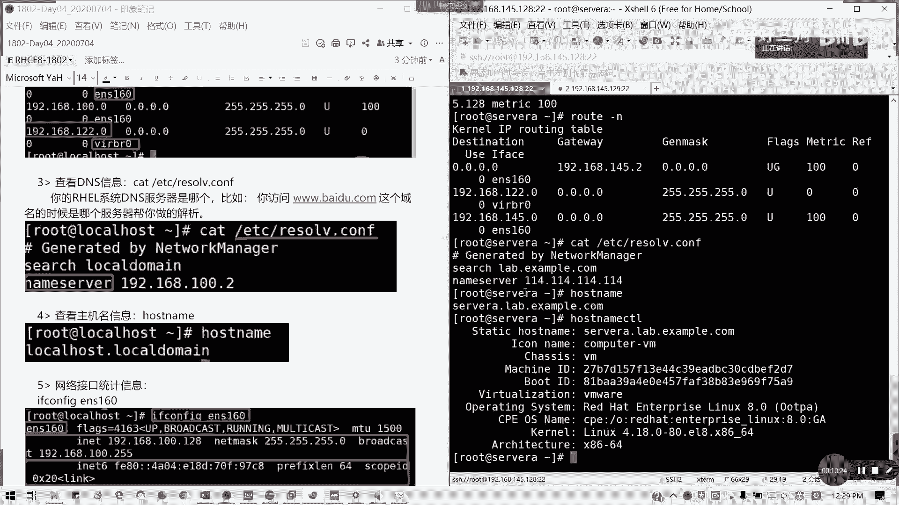

查看或设置系统主机名可以使用 `hostname` 命令。

```bash
hostname
```

### 查看网络接口统计信息

要查看网卡收发数据包的统计信息（如字节数、包数、错误数），可以使用传统的 `ifconfig` 命令或更现代的 `ip -s` 命令。

使用 `ifconfig`:
```bash
ifconfig ens160
```

使用 `ip` 命令:
```bash
ip -s link show ens160
```
这两个命令显示的信息基本一致，`ip -s` 提供的信息更实时。

## 网络连通性测试

配置好网络后，我们需要测试其连通性。以下是常用的测试工具。

### 使用 `ping` 测试连通性

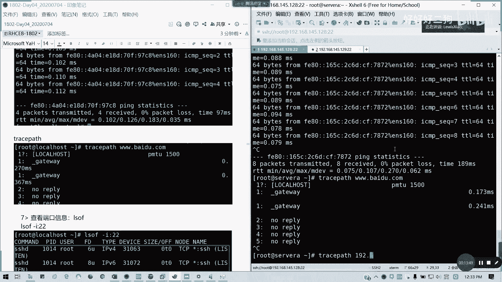

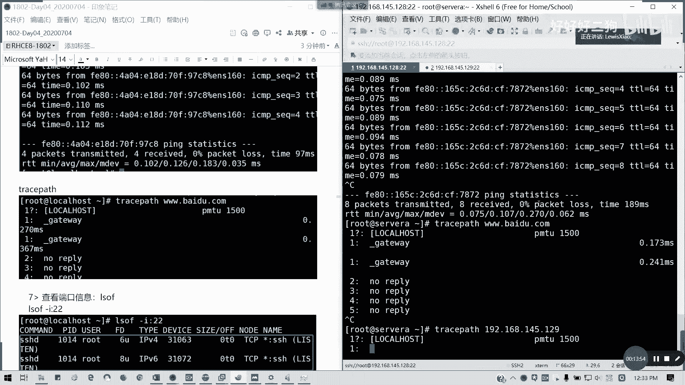

`ping` 命令通过发送ICMP回显请求包来测试与目标主机的连通性。

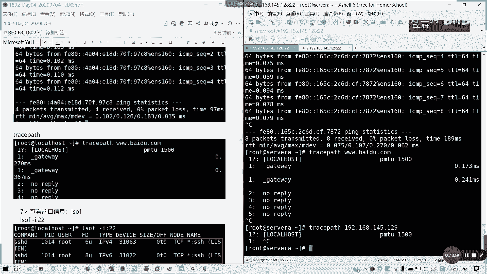

```bash
ping www.baidu.com
```
在Linux下，`ping` 会持续发送数据包直到你手动中断（按 `Ctrl+C`）。你可以使用 `-c` 选项指定发送次数。
```bash
ping -c 4 192.168.1.1
```
默认的ICMP数据包大小为56字节，加上8字节ICMP头和20字节IP头，总共84字节。你可以使用 `-s` 选项指定更大的包来测试网络状况（包太大会导致丢包）。
```bash
ping -s 1024 192.168.1.1
```
对于IPv6地址，需要使用 `ping6` 命令。
```bash
ping6 ::1
```

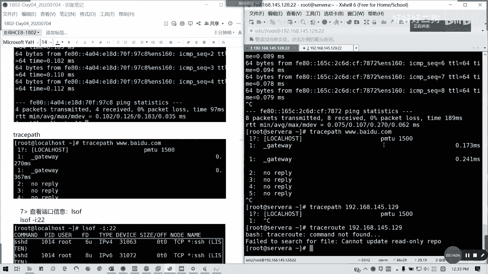

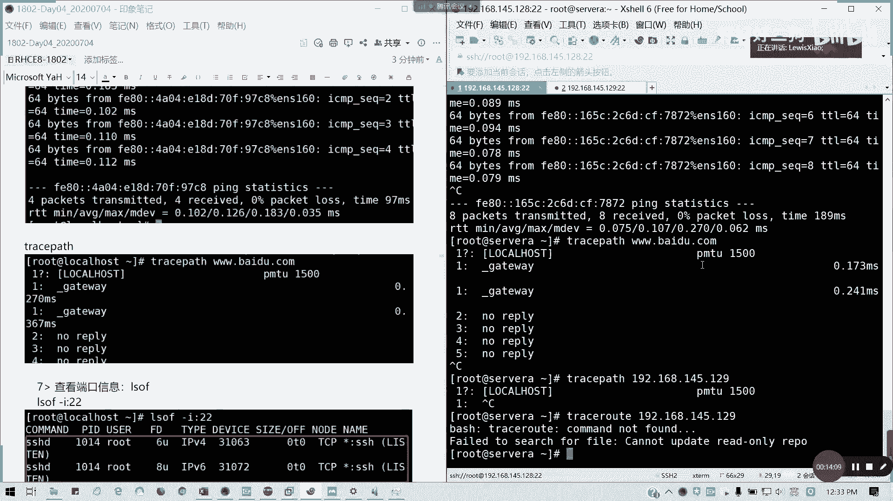

### 使用 `traceroute` 跟踪路径

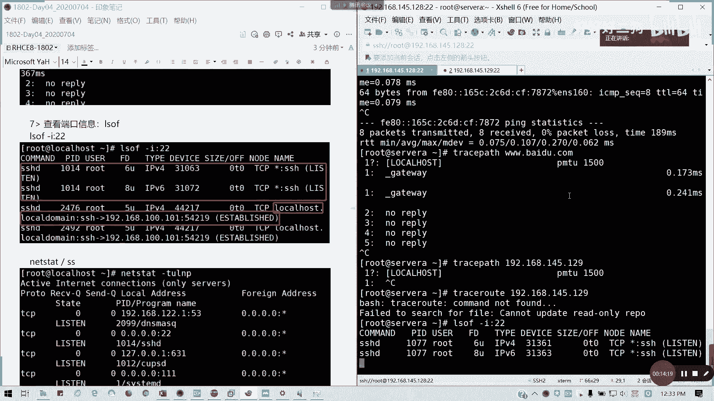

`traceroute` 命令用于跟踪数据包到达目标主机所经过的每一跳路由，帮助诊断网络路径问题。在红帽8中，`traceroute` 命令需要单独安装 `traceroute` 软件包。

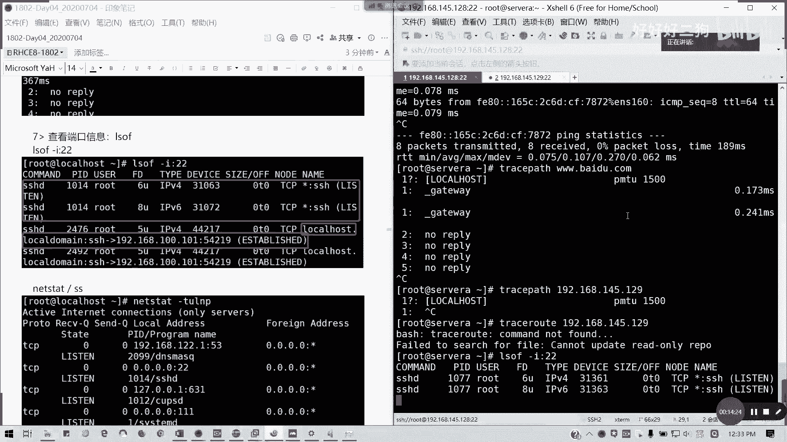

```bash
traceroute www.baidu.com
```

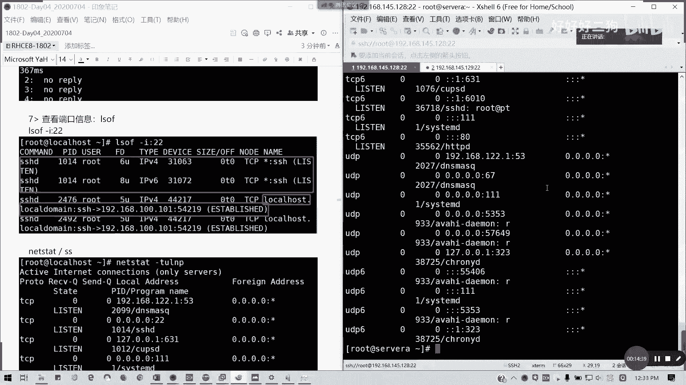

### 查看端口与网络连接

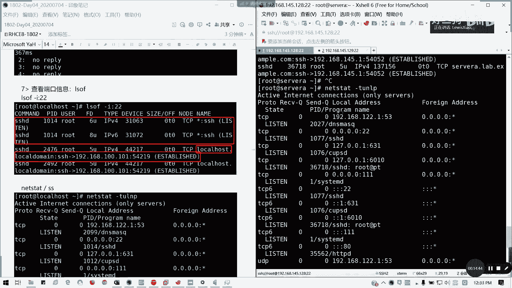

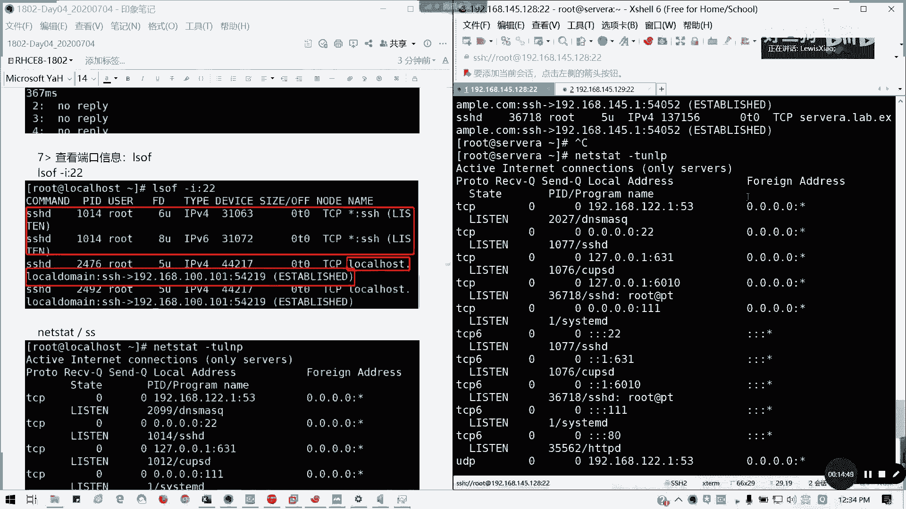

了解哪些端口正在被监听或有哪些网络连接非常重要。

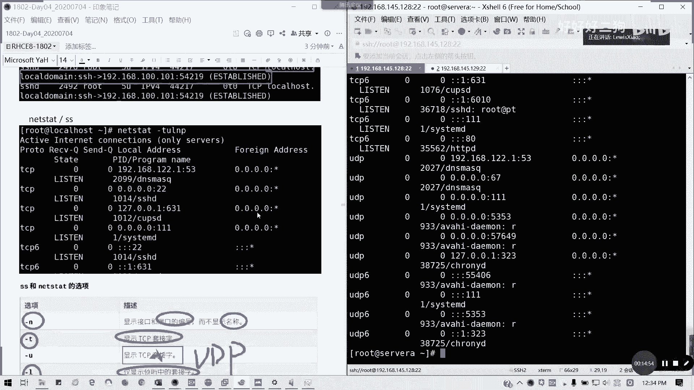

使用 `lsof` 查看特定端口（如22）被哪个进程使用：
```bash
lsof -i :22
```

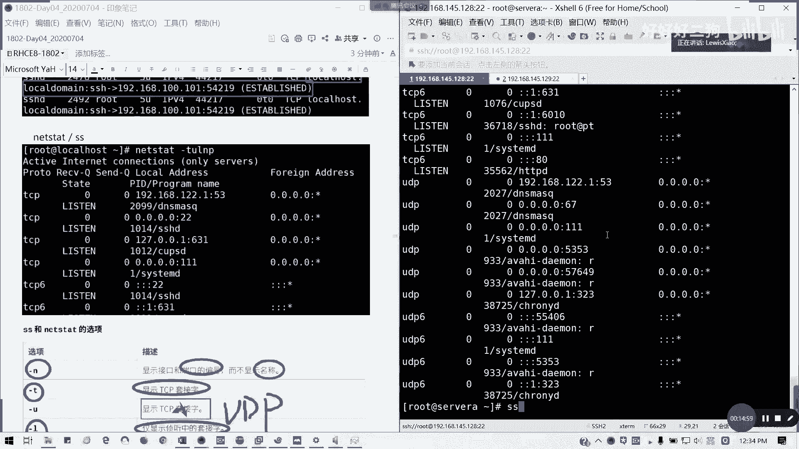

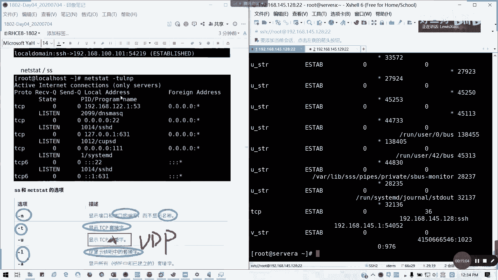

使用 `netstat` 或 `ss` 查看所有网络连接状态。`netstat` 是传统命令，而 `ss` 是其更快速、更现代的替代品。

查看所有TCP和UDP监听端口及对应进程：
```bash
ss -tulnp
```
常用选项说明：
*   `-t`: TCP协议
*   `-u`: UDP协议
*   `-l`: 仅显示监听状态的套接字
*   `-n`: 以数字形式显示地址和端口
*   `-p`: 显示使用套接字的进程

---

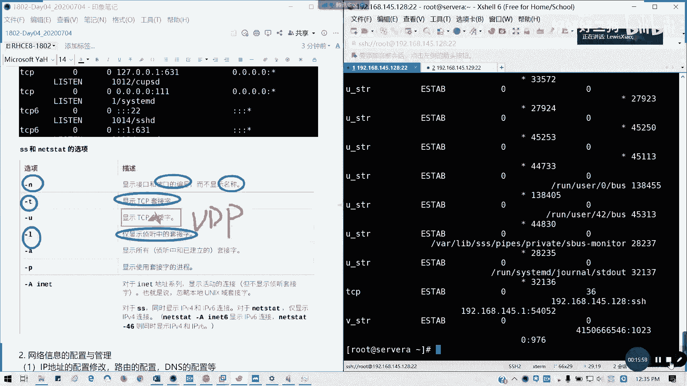

本节课中我们一起学习了红帽8网络管理的基础。我们首先了解了NetworkManager成为唯一网络管理服务的重要变化，然后学习了基于biosdevname的网络接口命名规则。接着，我们掌握了使用 `ip`、`hostname`、`cat /etc/resolv.conf` 等命令查看网络配置信息。最后，我们学会了使用 `ping`、`traceroute`、`ss` 等工具进行网络连通性测试和连接状态检查。这些基础知识是后续手动配置和管理网络的前提。在下一节中，我们将深入讲解如何使用NetworkManager和`nmcli`工具来配置网络信息。