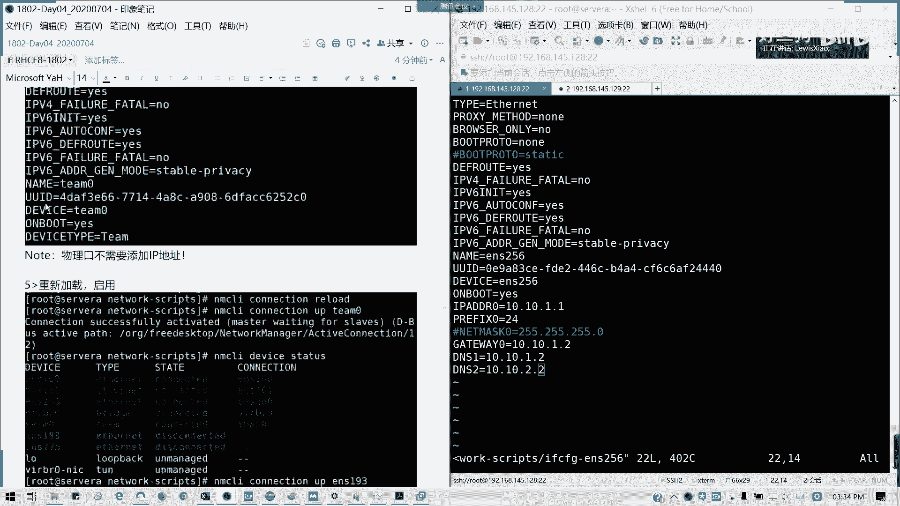
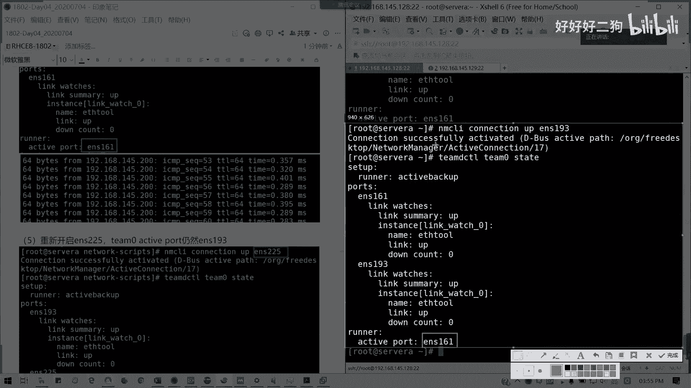

# Redhat红帽 RHCE8.0认证体系课程 - P23：23_Video_Day04_Ch12c_网络管理3_链路聚合 - 好好好二狗 - BV1M3411k77W

我们来看网络最后一个部分叫做链路聚合IPP6的话，其实也就是我们在这里就是那个。我补充一下IPV6啊。

IPV6的一个东西，我看看我这里有没有讲。

这里没有啊，我补充一下APP6个东西。

IP6啊补充内容一，这是2啊补充内容一IPV6。因为现在很多的都是IPP6东西了，其实就是配置文件里面我改一下就行了。IPP怎么配？

这里我们配置文件IPV6Oto下划线otto confi这里改成no就不采取IPV6自动配置。对吧然后我们在下面。直接添加IPV6ADDR。直配这个地址。就可以了。比如说这里叫202020。是吧。

这里已经连网连连那野码都已经写好了，对吧？IPP6最大的那个网络卫视64。懂我意思吗？网后位主机位是64嘛，最大的除了那个冒本地的那个双冒号一斜杠128之之外。前面全部是0。对啊，就省略的嘛。

它IPV6总共是128位啊。128位，所以这里的话就2020，中间全是0，然后后面最后是0001。他是八结。八节七个分号，7个冒号隔开成八节，每每一节十6位嘛。是16位。从零到F。

对吧全0到全F是不是16位？然后总共8起总128位吧。128位，然后这里我是简写的。

IPV6主要注注意注意的这点就行了。在红帽漆里面有专门一张专专门一个内容讲APPV6。

然我后面怎么拼呢？

这是IPV6的是吧？第一个配置。

然后第二个拼的话就就拼6嘛，知道吧？前提是两台机器，你要那个都是配IPP6啊配置啊。

然后呢。测试。拼6啊，后面就要跟个6啊。

就行了。前提你要被别的服务器拼啊，你你两边都配了IPV6之后就这么搞就可以了。

明白吗？这是IPV6，我就简单补充这么多内容。因为什么时间关系我们讲不了太多了，这是IPV6的部分知识。然后呢，接下来我们讲链路聚合。讲链路聚合啊，链路聚合的概念呢，它是一个计算机术术语啊。

它将多个物理端口汇聚在一起，形成一个逻辑端口。也就是我多个物理口我就相当于是同于一个。然后以实现我们的吞吐量或者是各成员端口的一个复合分担啊。也就是说，它交换机呢会根据我们用户的一个端口负核分担。

来决定网络风暴从哪一个成员端口发作对端的交换机啊。如果检测到了故障的话，它会就停止发送，然后剩下链路里面又重新计算带宽啊，计算，然后故障恢复之后再担刃，这是一个链路聚合的在交用机上的方式。

然后对于我们物理端的话，我们的服务器端的话，其实我们可以简单理解为链路冗余。对吧常见的几种方式呢就是team，还有bond两种。我们现在通常都是以team，我们以一个组成员的一个网络组成员的一个来做。

几种方式，一种是low balance，一种是round robin，一种是叫active backup啊。

一个主备嘛，负载均衡一个轮群嘛，对吧？负载均衡就是两个网卡同时运行，然后带宽是两倍。主备呢就只使用一个，另外一个是等待状态。如果你一个断了的话，它马上会切换。对吧。来，我们team的实间方式。

我们看一下啊，我们这里要求是要。2块及2块以上的网卡，我们这里以2块网卡为试点。所以的话我们在serverserv a上面我们。再添加了会网卡。专门来做这一块内陆聚合。

来，首先我们添加2块网卡。点确定。

好的，我们看到2块网卡已经添加完毕，我们看一下我们的连接情况。

就多了1个ES161跟193呢。

对吧那么们现在我们来创建一个绑定口，先创建一个team0。就我们我默认我们的一个TD这个服务我们应该安装了哈，我看一下。每个人可能不一样啊。这个tMD呢在我们默认安装re8的时候。

我们RPM我们下节我们下面又讲的就是一个安装包的一个管理工具。它里面可以查询我们到底装了哪些插件和服务没有。这里的话，我们TMD已经是安装过了啊。前提我们TMD我要安装过。好。

接下来我们要我们这个网卡是不是两个discon，对不对？我首先。我们来添加一个逻辑绑定口。添理。MM C I connection， add， type。type它的类型是一个组网卡组teim是吧？

team，然后我的端口名is name叫做team0。那这里可以直接修改配置文件啊。然后。我们的连接名字也叫tam0。然后。它的配置怎么样的呢？因为我这里我一行写不下。我就写一个斜杠是吧？

反斜杠是不是命令命令我会分行写。对不对？好，他确一个监况，我们就怎么写呢？我们写配置结。引号先扩起来，大括号括起来。然后它的运行模式啊，runner。它运行者是运行在哪里呢？这里再一个大括号。

然后它的name，我这里以主备为例子啊，name。冒号，然后再一个引号activeive backup up。这里我的主备什么意思呢？就是有一个网卡断了之后，我可以自动切到另外一个网卡上面。这样的话。

网络中间是不中断的，懂我意思吗？网络间不会中断，它会自动切换。也就是保是不是我们做了一层冗余啊？🎼对啊，这个有点难记，但是大家请看好啊。然后他会建一个team0。然后现在我们IPAADDRso。

tim零。是吧他现在是一个道德状态。为什么？我只创建一个链接，我们创建了一个连一个绑定口，但是里面并没有成员。所谓成为什么呢？那我是不是要指定哪几个网卡做绑定啊，我们这只是一个建立的一个框架。

但里面没有东西啊，对不对？所以我我截个图。这是重点啊。然后呢，我现在的是闹的状态，那我怎么起呢？我们添加我们网卡绑定成，我们叫161跟193，怎么加？来看着我的他家的一个成员叫做team的一个附属成员。

附属啊，他的类型是team的附属成员也叫做叫team slave。team杠 slave啊。好，我们来添加一下MMCLI。Connection and。Type。

然后这里我写的一个类型叫做team杠 slaveve。Now， is name。ENS。161是吧，我161跟193。16我们先加。161。我们去顺便把链接建了，然后master它是以哪个为主要的？

因为它是一个附属的，对不对？那我们是要一个逻辑绑定口作为它的主要的一个一个team。那主要一个链接，所以的话它masterteam0。然后同样193，我们也把它加进去。我自己就，因为我换了行。

所以我就直接扩111193就可以了。然后接下来我们来修改它的一个网卡配置文件啊，就要它网卡配置文件，我们修改一个team0了。修改这个tam0的配置文件。为什么这里要要加反斜杠，它自动会加反斜杠。

又会因为它引号是有特殊含义的，所以的话加了一个反斜杠转页。懂我意思吗？转移变成他原本的。原本的符号。是不是这里是加了转移的，为什么这里有一大堆斜杠？懂我意思吗？转译啊。取消它的转移，应该是取消它转移。

然后用回它原本的一个符号的功能，懂了吧？它这是自动帮我们这样的，我们不用管。🎼然后这里我们改一下是吧，这里波proto我等于n。然后呢，我这里把IPV4加上。加在后面。192。168。比如说145。

200。Perfect。ling。S4。我这里不加网关，因为我就剩上的一个局网内。啊，这个网段内我就不加网关了。

它的device type，它这里是写的是team啊。devvis type已经写的是team了，然后这个team confi刚才我们加了，对不对？我们刚才这里我们已经加过了。

所以的话这里我就不再去不再考虑了。他这里已经是帮我们加过了，只要只只不过我们这里要注意啊。

物理口啊注意啊，物理口不需要再添加IP地址了。

因为我们是他是相当于一个team的一个成员。那我们直接在team上面我加IP地址就可以了，对不对？是吧。物理口不要再动了，没必要动。

然后现在我们重载。因为一开始是到的那我们就直接reload。然后把名 up起来。他在waiting for slave，对不对？然后呢，我们device。tus我们看这下有没有启动。

是不是他的天名也起来了。我们刚才加了链接，所以他的听名也起来了。如果遇到没起来，你就把1把19388161跟193起来就可以了。对吧我这里已经起来了。1931161193已经起来了。

那么们测试一下我们的联通性。对吧。拼个对我可我可以在那个servB。对吧我在别的机上是不是能测测一下？

通是吧，侧通OK。我这里我在搜索币上验证会更直接。然后我现在要做一下测试。我做一下测试A好吗？teamDC天我们测计它的一个LG backup up是不是有作用？那TDCTL。

Tam d control。然后后面将我们的那个master的名字，team0。看他状态。它是艾 backup up的，它后它的启用的端口是不是ENS。161啊。啊。什么意思？你两个端口你要加起来啊。

然后它这里pos的成员是不是有161跟193呢？对不对？你没加进去是吧？没加进去，你那你就空壳啊。是吧我的161193，他的那个。

team是启动的啊启动的。那我们现在我们把161断掉，看看会不会切到193。我现在把它断掉啊。

再看一看。对不对？我把它荡掉之后呢。我们的161已经断了，那它是不是还剩193在存活啊？对吧。

然后他的那个网卡切到193了。

那我们再看一下我们的。一个拼会不会断掉啊？에？正常说的ITport应该是不会断的。我看一下我通了通了。

笑死我。他切换可能需要一一丢丢过程。但是在正常说，你这个网卡是通的啊。不要吓死，正常来说这种情况是不会断的啊。我们的设尾B上面还是通的，对不对？我现在断掉一个接口，然后我把它起来。从新开始161。

那依然它还是193的。

对吧我们两个网卡起来做后还是193。

你这往我这边一直拼着吧，它这里的话，它会有一开始会有丢包，然后就接起来。他是第10个吧才才才起的，我就一直拼着吧，我不管了。拼正常是不会断的啊。嗯。然后接下来我切回去啊，我将那个断掉，我把193断掉。

然后看看是不是会切到161。

到千千万之间，它有一个一个一个小小中断，然后他会把那个。他会把端口切切过来啊，现在切入到161，然后你看就掉了9个包之后，它会它会连通的。就是它中端它这种中断呢会一小会儿啊，不会说那么长。

依然是通的。然后重新我们开启一下。

通重开启一下。

就是161了。还是1615没有变。

我奇怪的是，为什么中间会断一丢丢呢？161。这是193重新开启之后，然后网络的话是这样子的。

这一块能明白了吗？就做一个主备是这样子的。如果你可以试一下做我们的那个可以做尝试做我们的一个负载均衡或者是环伪口啊，环伪口。但这里还有一个方法，就是我的一个配置文件怎么做呢？如果你要懒得写。

看这里就有例子了。你看到没有？他这个文档里面的。examp example，IF confi，然后里面我编辑一下看什么东西啊。可以看一下。这是一个活生生的一个例子啊。所以考试如果你真的如果你不会的话。

就把字改一下不就行了吗？对吧不用手动敲命令，直接改配置文件，这种方法实在之高啊。这种是一个相对说你确实。不记得啊。也可以通过。team低的。事例配置文件直直接复制修改。懂吗？

它的配置文件其实已经帮我们写，已经帮我们有例子写好了，那我们就直接改就行了，对不对？我们在这个。user share啊，我们自如果大家有空去看我们的那个一开始我们留意的我们的帮助文档的话。

其实在这里的话，已经有1233种啊有1233种。这种是不是更方便了？对不对？视例文件已经帮我们写好，我们只需要把它改里里外改个名字。改成考我如果考试真有的话。那是不是我们直接改就行了？

那这样你连记都不用记了。对啊。我一般是不想在我这里稍微断了一下啊，天跟豹其实区别并不大，主要一个是及个是绑定，一个是就相当于一个群主的方式啊，我这里的话。这里的话我刚刚才掉了5个包啊。

掉了掉了掉掉了9个包，但是正常说是不会断的，可能会有一点延迟。但是我这里的话这个方法呢适合懒人使用啊，适合懒人使用，直接抄它里面配置文件改一改就行了。考试我当时也是建议大家这么做的啊。

天光棒的区别，你们可以找一找啊。

我记得bod还有更多的team的话，它常常见是三种啊。看七里面的一个区别。他的一个特性对比是不一样的。我复制的文章给大家啊。其实我们可以理解，我们常用的方式可以为等同啊。有些像LACP啊。

这些不一定有啊。一个团队还有一个链接嘛，链接就是相当于一个bonnd，对不对？团队就是一个team，所以这个区别可以大家可以看一下。

你就Y可能选一了，你的那个224，你没你你那个名称你没有指指定好。然后这里的话。能明白吗？可以吗？但现在我们十我们这个网络这一块，我们补充的两个知识点就讲到这儿啊，现在时间给大家做大概15分钟练习。

然后我们待会讲文件归档啊，有问题可以在群里面提啊，这张听得懂的，请打12。

这个其实这个补充的知识点其实很好用啊，对不对？做链路聚合很好用，超级好用啊。剩下时间大家可以做链路聚合的练习。APP6的练习。然后呢，接下来我们讲第十三章关于我们的文件归档。

