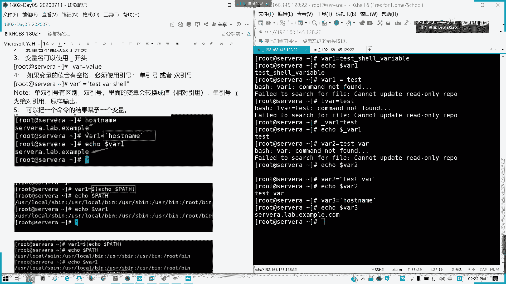
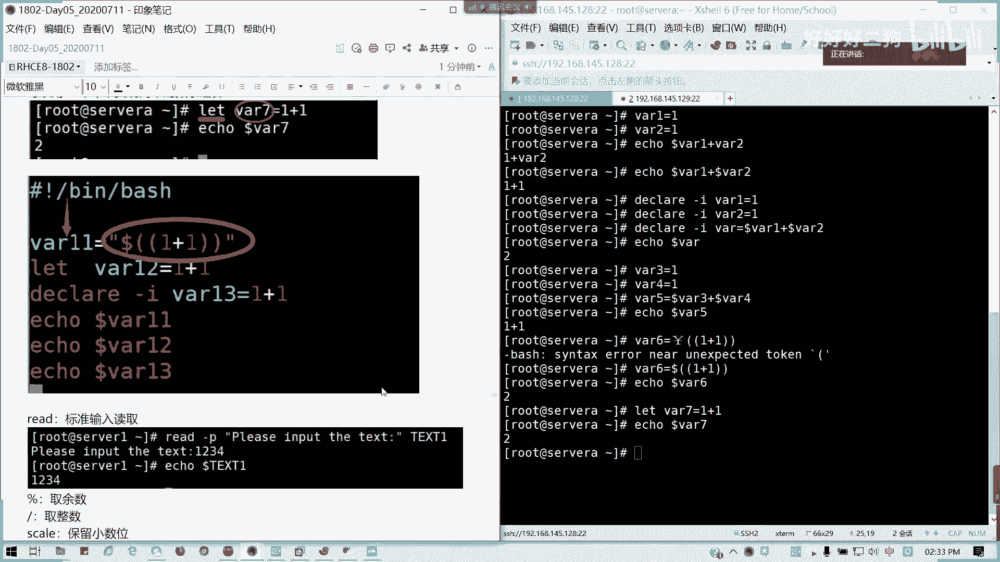

# Redhat红帽 RHCE8.0认证体系课程 - P25：29_Video_Day05_RH134_Ch01_Shell基础01 - 好好好二狗 - BV1M3411k77W

北京时间02：15，我们开始第二本书内容，首先恭喜大家完成第一本书的学习啊，接下来澜在大家面前的就是一个脚本啊，我们的best shell脚本，原本呢这个是c一七点下午的内容啊，下午的第一门课内容。

但是这里的话我们在八点的规划里面，就把它提前上来上了，先上来唱，原本的安排只有一张，但是我想就是说这边的基础啊，大家可能对最快其实了解不是很多，但是它又在我们的实际运维里面相比较的重要。

所以的话这块我们打算花一天到一天半的时间，给大家讲完整个best shell的基础，今天我们来看第一部分，首先我们要知道shell脚本，我们的shell脚本是什么作用啊，所有脚本做什么作用。

shell脚本呢是利用我们shell的功能结合与控制语句，写的一种程序，用于主要用于帮我们维护系统，当然你想写什么九九乘法表啊，或者是画一个书圣诞树啊，这个问题都不大，但通常说我们学习系统里面的功能。

都是为我们系统维护进行服务的，对不对，然后我们之前讲的shell的功能，是不是我们在那个124的第一章访问命令行，第二章访问命令行的时候已经讲过了，对不对，所以这些命令的话。

我们接下来会结合结合在脚本里面去应用啊，去应用去那个帮助我们进行系统的运维，那我们接下来需要的功能有哪些啊，需要有个功能，第一个是学我们学过的几乎所有的命令，我只能说几乎所有。

因为有些命令的话我们不常用就没讲，但是这里是修常用所有的常用命令啊，我记得这常用两个字，然后呢第二个我们要讲每在编程里面，包括我们学c也好，学python的好，学其他的语言都好，java都好，变量对吧。

每一门语言里面，shell其实我们也可以理解成一个编程语言，然后他的一个比较重要的东西就是变量，如何去定义变量以及变量，就是说这变异变量就是我们变量如何去赋值，它的名称，它是如何赋值，然后如何去取值。

对不对，比如说我们定义变量可以定义成直接，我们直接打的话，在命令行打的话，它是一个临时变量，对啊，就是局部变量不能说临时啊，是局部变量只在当前范围内生效，比如说y一等于。

这后面的变量值是我随便自己取的啊，我们这种格式呢就是我echo一下是吧，我怎么引用的话，顺便先给大家说，就是echo，然后后面是吧，多了加上变量名，我们就可以取出变量的值，然后呢变量前面是变量名。

后面是变量值，中间又等号是赋予的意思对吧，变量赋予这个值给它，然后呢注意事项，首先我们不能是这样啊，对吧，变量跟值还要等，就等号的两边不能存在空格，如果存在空格的话，会变成什么意思呢，存在空格呢。

它就认为你是一个命令的分隔，命令和参数的分隔符，然后把会把v r一识别成命令，懂我意思吗，那这样的话那就不是变量负责，就是执行命令了好吗，这是第一个点中等号左右两边不能存在空格，这是变量赋值的第一个点。

第二个点变量不能与这样的数字开头，以数字开头，它也会被识别成命令啊，我们可以挖一但不能1万啊，第三个变量可以，下划线开头没有问题，你看变量我们刚才用的下划线开头，它也能够读出它的值，对不成功复制并取值。

所以这个第三个变量可以用下划线啊开头，然后如果像这类的，我取一个y2 ，这样可不可以呢，明显报错，对不对，明显报错，那我的方案是不是没取到值啊，因为我们这个值呢，如果变量的值，我这里是包含空格的情况。

但是包含空格不能这么写，如果是变量名要包围和空格的话，我们必须要把引号引起来，单引号双引号的功能我会在后面说啊，单引号双引号的区别不在后面说，像我们这样子是可以的对吧，用引号引起来，也就是我们整个值。

如果里面含空格，请用引号懂我意思吗，第五个，我们可以把一个命令的结果赋予一个变量，命令结果怎么引嗯，我没有反应哈，比如说我host name，我输出我们的主机名，对不对，回车，然后我用a口八三，对不对。

所以这个呢是五点啊。

我们所说的五点的注意事项，然后呢这里注意啊，我们刚才说的单双引号是有区别的，双引号呢就会是相对引用啊，里面的变量，比如说像我们美元符号等等，会转换成值，但单引号就绝对引用原样输出，懂我意思吧。

这是单双引号的一个区别，简单讲后面我们会详细说。

然后像我们的这个我们可以可以用括号来也，我们除命令啊，命令我们也可以用括号来取值，084，我们以后我们里面可以包含一层命令对吧，我们a口一个pass变量，然后把这个值赋给了v4 。

那我们a口1+84对吗，所以他的一个结果就跟我这里写一个八五。

它两个作用是一模一样的对吧。

反引号等于多的括号啊，然后对于单双引号的话，就是，这样子啊对于单双引号，刚才的补充，如果还有特殊字符，就相当于他就用我们的多的括号去括起来，那如果用单引号，其实我们刚才用反引号，我们双引号试一下啊。

用如果这个多了的话，用双引号看一看，我对比一下，也是可以的，对不对，他双引号它会把里面的那个变量转转换为值，付给了新的变量，这这这这叫做那个迭代替换啊迭代，然后呢如果用单引号是什么结果呢。

啧啧原样输出懂了吧。

这个可以理解吗，都可以啊，好那我们接下来如何取值。

显示值应该都知道了哈，如何取值，如何显示值啊。

如果取值的话，通常说通常是那个，直接用多了啊，这些多了去取它的值，用前面加do的符号，但是我们不能知门直接运行，我们要结合命令来做啊，比如说我们显示用echo，对不对，或是直接赋值都可以，但不要用这样。

这样子不要这样直接用这个命令出来啊，这个只是一个例子，这只是说一个说明，而不是说那个你用这个方法是对的啊，好前六点没有太大问题了。

那接下来我们讲变量类型，变量类型的话有一个叫局部变量，一个全局变量，局部变量呢是不能被紫禁层调用的，我们可以试一下啊，我这里写一个，201我这里跟我的讲义不可能不太一样，但是我们的用法这个是差不多的啊。

201等于就我就简单取一个o4 面跑吧。

我们在这里echo一下y01 。

是不是我们可以出结果，对不对，那我现在我切我就部分切换到用户，我就将它调一个子形成出来懂吧，至于为什么用部分切换呢，就是我的环境变量保持当前不变，但是我用户变了对吧，如果你完全你用那个su杠的话。

它会就是把变量给切换了，那可能做不出我们的效果来看看啊。

那我现在切换过来，我echo一下801空的，对不对，我们这个叫局部变量，局部变量也就是不能被我现在我切到我部分切，切换用户的话，是不是掉出一个紫金船，相当于啊掉一个紫禁城。

我不能被他引用，懂我意思吗，那如果我要全军引用怎么办呢，我前面加个export对吧，通常这句这波操作是在哪里用的多呢，像oracle定义我们的那个对吧，定义我们的数据库oracle是吧。

我们的oracle的那个叫做s i d，数据库的那个实例id，对不对，通常你用实例id之后，我们切oracle就可以用了，对不对，可以打开正确，这这个是，一个比较多的用法啊，v201 等于同样。

我看一下我用su杠看能不能调用还是不行，我这边的话，我看一下现在801，对吧，我在root是801是可以用的，那我调出一个紫禁城，相当于我部分切换，对吧，你如果完全切换成三连环境变量全换了。

那你这个变量就更没法生效。

懂了吧，这个完全我们的局部变量跟我们的全局变量区，别，就是你能不能被子进程调用，如果是局部变量的话，只是在当前的范围内生效，我们回来。

然后接下来我们讲变量的值的类型，变量值类型分一般两种啊，一种是字符串钱，一种是我们叫整形或者数数字啊，我们叫数字或者是应该也不能说整形，因为它有浮点型啊，就我们分两种，就是字符串或者数字，对不对。

我们这里来定一下，像vr一等于1v2 ，我们定义两个变量是吧，然后我们a口一下多了v r一加v r2 ，还不不对啊，什么结果变成1+1，对不对，我们如果要算术运算，它这个默认的输出的那个类型是字符串形。

那是不是相当于两个字符这样子拼起来啊，那我们如果要进行一个数学运算，有什么办法呢，数学运算的话，我们可以这样子，就是把它声明为整形，这是第一种方法啊，是第一种方法，我们把它声明为整形。

用declare命令声明啊，杠i证明它为整形变量，我们的我们的整数型变量懂吗，vr一等于一，然后我们vr 2等于一，然后我再声明一个vr等于，刀的v r一加v r2 ，我也声明我的求和结果。

那个变量y也是整形对吧，那回车我们现在a口一下多了，我们把v2 的值取掉，是不是是不是我们想要的1+1=2了对吧，那如绕其实对比对比，下面就是vr 3跟vr 4，我又不普通的这种对吧。

然后到vr 5等于v23 加v r4 ，echo dollar vr 5是吧，两种区别就出来了，明白我意思吗，两种区别就出来了，就是声明为整形跟普通字符串型，它的那个结果。

就是说我们所所想要的结果是不太一样的，我这边已经应该ok了。

然后简单的数学运算除了用decay来做，我们也可以用。

我们也可以用那个来做啊，呼呼呼，这张我们是可以用两个括号来做的，诶，我这里又切了那个，这里的例子应该是这样子才对啊，写成数学一项，我用那个如果我们不加任何的，不加任何括号啊。

是会输出一个整形结果，但如果我加了一个多了，那就对了啊，整数学运算，这是第二种方法，两个括号括起来里面进行时进行，我们简单的加减法或乘除法，对不对，加个多了就对了。

所以这个图把它去掉，这个才是正确的好吧，然后呢还有一种就是let命令，let mini也是可以实现简单的数学运算，那我这样我我let vt等于1+1，然后echo一下多了八七，对吧。

用let命令也可以实现简单的一个数学运算。

所以这里的话我们会很明显的一个是吧，这三个类型我们可以写一个脚本，其实脚本的话大家应该都是大家知道怎么写吗，比如说我就一个那个方顺点s h我写一个脚本，我们脚本解析器呢要是第一行先声明了。

脚本解析器就是bbs啊，或是bs h就采用shell的脚本解释器，解析器懂吗，就讲脚本解释器，然后呢，我一般空一行在我们这里的三种结果列一下，给大家看看是不是一样啊，多了两个括号，我就选1+1好了。

va 11是这样子的，va 12用let命令，第三个就是我们直接声明，我们分别输出这三个值，我看诶哦我这里少了一个啊，我看一下出来。

对吧，三种结果是一模一样的。

就是我们常用的三种数学运算的方法，懂我意思吧，三种啊。

然后呢我们这里的话，我来教大家一个像标准读输入读取，但是后面这些的话，我们待会会会讲到啊，那后面会讲到就是数学运算这块，这其实先给他提一个概念，然后呢像read的话，标准读取，也就是说可以显示提示符。

然后后面用键盘输入数字，对不对，我们写一个脚本，我知道他这里是直接用那个，其实我这里的例子直接用那个，直接用在命令提示符下进行，那我这里的话我写个脚本，脚本基本要多写啊，v的，杠p是吧，像这样的话。

就对着杠p打印我们的提示提示语，然后把提示语输完之后，我们要把它复制到一个变量里面，对吧，变量里面，然后我们再把它输出出来，保存退出，我们把那个脚本给他输出，看一下，那我们现在来执行。

我加了s h或者batch之后呢，我们不需要加执行权限，都可以运行了，懂吗，直接调用解释器，如果我们平时的话，建议加上一个x权限，加上一个执行啊，因为它是一个脚本，是一个可执行文件。

但是我这里的话为什么没加呢，我直接调用我前面加了个s h，也就或者是bh就让bash，我们运行bash命令，调用这个文件去执行懂吗，内置的s h对吧，我输入这一字符串，它就会把它写出来。

这个我们先把它去掉，因为后面我有一多一节是把跟他重复的啊，所以的话我把它去掉，就把我们的脚本的一些像数学运算，包括标准读取的一些功能，先给大家做简单介绍，就有一个大概的了解啊，如果明白的话。

如果明白理解的话，请打a啊，听到小a，然后接下来我们要讲文本处理，文本处理四大工具啊，其中有一个三剑客啊。

现场的如果听明白的可以举手，一个两个三个四个五个六个七都懂啊，八个人全都懂好，ok我看远程的有多少人啊，我刚才为什么把数学运算那个求余的删掉，因为后面有一个重复的内容，有一个内容会讲到。

那接下来我们讲文本处理，文本处理呢有四个工具，然后其中除了cut之外，break a w k跟c d俗称三剑客啊，文本除以三节课，为什么要把放在这里讲了，因为这经常我们用脚本来获取一些东西的获取。

获取一些指数值，所以的话我们放在这里啊，放在脚本这里讲，首先啊文本处理的一些内容呢。

它主要内容就是针对普通的文本文档，进行处理操作，比如说搜索查找替换，然后我们先讲一下rap。

grape的话，我们在这里啊，在菜鸟网啊，我们截截的菜鸟教程里面的rap，这里有详细的解释，但我这里就截取了一部分来讲啊，大家可以看一下grape它的很详细的用法，在这里包括它的实例啊。

我们要直接讲简单的一些用法，像grape task，可以从一个文件里面截取我们需要的一些内容，以它为关键字截取需要的内容，比如说我们，我们在那个之前，在tmp test里面是不是有个pass w d啊。

诶没有啊，这样吧，我复制我复制一个pass up的d过来，因为确实不要对我们的那个，系统文件做任何修改啊，我们所说的复制例子都是虽然都是系统文件，但是我们建议复制到安全区域，然后我们进行实验是更好的啊。

这里填要提醒，我们就切换到tmp test mode，我们的pad应该在了。

对吧，我们就以这个刚复制过来的paw店名，这个文件就存储我们用户信息目录，我们来做做演示，那我们会和我们截取里面，路跟路组关键字有关的这个文件对吧，语法是语法呢，语法是怎么样的，grape，关键字。

文件啊，grape关，关键是文件好，我们看一看这里grape root pass w d，它就截取跟就root关系有关的，输出，而且把关键字它会标成红色，懂我意思吧，然后如果我们要不区分大小写。

比如说我这里输入大写对吧，然后后面我们可以加杠i，加杠i的意思是，不区分大小写，我这里补一下，补一下一些用法，因为我的表达笔记没有，其其啊我的关键字杠i，其实杠i的话。

我们这些参数的话不在前不在后都没问题啊，也是一样的，我把甚至把杠i提到前面来，都一样对吧，我们这里写在这里啊，杠i关键词，这字又小了，我调一下，为loop password passd，然后这里杠i呢。

不区分大小写，对吧，我们的root是大写，但是我们这里用的杠i参数，那我们是不是那个，把它替换掉啊，这里的话我们是常规用法，然后还有就是杠b的话，就显示后一行，这显示前面一行，杠a是显示后一行。

一行一行我往下写啊，我这把注释补全，grape杠a，后面跟数字，显示，就只显示它会包含啊，不显示关关结果及其，前前前后一行如果是杠a的话，是后一行，我们来看一下啊，这样a1 ，对不对。

它会显示关键字节带，关键字结果及其后一行的内容，对吧，我们关键词是这一个，杠杠a1 ，然后这里是不是是不是显示显示多，这一行出来了，然后后面，对吧，这个是我们这个是我们要的结果，对吧能理解。

然后杠b呢比before啊，杠a是after的意思，这是显示跟前面相反，它是显示前一行的内容，懂吧，然后还有呢就是，杠v，除了，除了关键字行不输出，其他都显示就是反向就反，就像那反向输出，对吧。

反向输出，我们看一下结果，它显示所有，但是root这一行就没了，对吧，我们root这个opera operator这一行不见了，对不对，像root这一行原本在这里的，原本在这里的，都没有了。

就输出其他的内容，对吗，然后还有就是我可以多重使用啊，多重使用grape，我可以获取到更精细的内容，我看有些人有点困了，来我们看一下啊，使用grape进行精细截取，也就是说它可以通过不断的迭代引用。

对不对，迭代，然后我这里的话可以这样，那我要截取一个bh这一行，那是指现实输出这一个了，可以多重进行grape，然后还有一种就是用e grape啊，我可以截取多个关键词，对吧，grape杠一。

我们一grape的话，我们可以截取多多关键字，对吧，这个e grape它是grape杠一的一个，别名，对吧，我比如说grape，上一，root杠一它是一个相当于它是一个货的结果啊。

货的话就是只要它满足其中一个条件，都会输出，对吧，我就简单，我替换掉原来的服务，所以他这里的话，你看像root啊，像student都已经输出了，对不对，然后像我们的可以比如说我可以多个。

对我们就很多个了，我这里的话我精细一点，我到test一吧，也是一样的一样一样的用法，note是吧，我note student by test 1，这对应的话就是我们三前面我们三个啊。

然后还有就是我们用e grape那更简单的方法，直接引号，然后用用竖线，用我们管我们all是吧，all的管管道student，然后呢tt，这是简便的写法，懂我意思吗，用e grape等于grape杠一。

这grape基本上我们grape这个截取的，先讲到这，有没问题，没问题，可以举手啊，grape常见用法，一个两个三个四个五个都没问题啊，如果线上没有问题。

请打个字母小b啊，小b怪普。

我们就讲讲这么多。

然后接下来讲一下cut啊，讲完cut我们先休息一下，cut的话它主要是一个什么功能呢，现在用的比较少啊，car的功能主要是以某个字符作为分隔，指定模字符作为分隔，然后输出里面对应的值啊。

对应位置的一个值，比如说像我们那个pass w d是吧，常见常用用法啊，它是以一个啊，应该是这么理解啊，按格式输出，比如说我们pad，我们来看一看杠d，我们可以指定一个用引号括起来都可以啊。

只是一个冒号，然后我的pasta是什么漫画风格的，那比如说我要输出137这三个位置，然后指定pastd的文件，对吧，他这里的话就是以冒号作为一个分隔符，也就是我们以冒号对吧所分隔符，然后我输出的是。

第一个就是冒号的分隔符的第一个，第三个，第七个值，因为这样pass w d的话，它是以冒号作为作为分隔符的，那我就用这一例与自由的用为例子啊，这里的话我们输出了之后呢，就是这里就是像我们root这行。

这是第一个，然后这是第三个，我们的零是不是我的uid，然后这里是第七个，我们对比原来文件就比较清楚了，懂吗，这个普通用法，这里中间写分隔符，那比如说我们自己就自己来编辑，编辑我们的一个文件哈。

比如说我们这里123，好对吧，我们的文档是如果是这样的话，如果是六，我们p post w d，那就是标准格式文档，那么如果非标准格式，我们会怎么样呢，我们同样执行这个命令。

我们要把123这三个数我看能不能输出来，这里以空格为分隔符啊，是不是他就以第一个作为分隔符，然后后面的话就除了第一个，我们省是正常之外，对不对，但后面的话你就觉得觉得怪怪的，对不对，三哪去了，对不对。

然后这里只输了个一，所以他这种方法呢。

他为什么会这样啊，他主要是把空调把空格，它只能容纳一个分隔符，从一个分隔符，然后他只对于标准格式的文档有效。

你看这个这个是正常的，这个是ok的啊，我们其实我们希望的是，我们希望是这个结果，对不对，它的结果这个呢我的三哪去了，这个123到哪去，对不对，我们对于这种文档的话，我们就在用cut，好像有点无能为力啊。

那我们再写一个，用冒号，我们这样空格不行，我冒号试一试呗，这不是空格啊，我用冒号对吧。

懂吗，像这种也不是标准的，我们的我们前面的话以冒号输入到一，输出123，以冒号分隔123，正常对不对，但这里下面的话两个冒号它就不行了，懂我意思吗，两个冒号的话，它只输出了，前面这一部分没了。

就这风格他把漫画二作为一个元素了，懂我意思吗，到这里就相当于一分隔出来，然后漫画二它只能识别一个字符啊，这种是第一种，这是我们要的效果，对不对，123这种出来它是标准格式的。

所以但是这种的话就很奇怪了。

所以cut是有它的一个局限性啊。

仅能识别一个分隔符，且对标准格式，文档能够精确处理，但对于不管啊，非标准的，它的一个cut局限性啊，是在这里的，只能以一个字符作为分隔，然后后面它是识别为另外一个字符了对吧，另外一个位置的字符。

所以的话这个是有问题的，那这个问题怎么解决呢，我们就交给a w k，但现在03：05，我们稍微休息15分钟啊。

