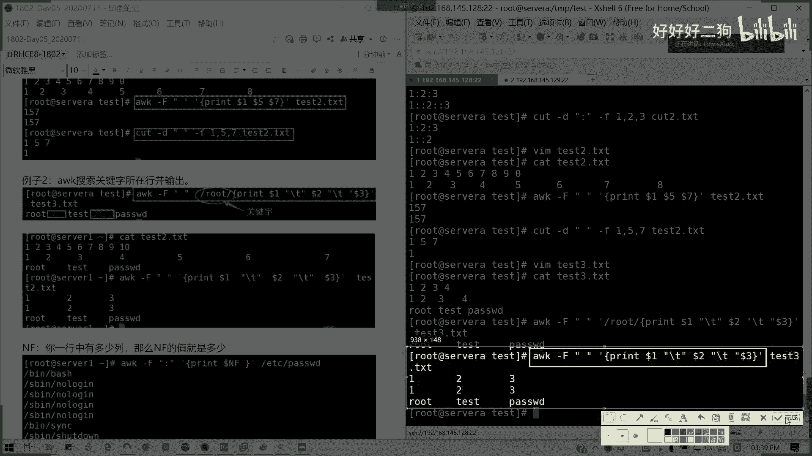
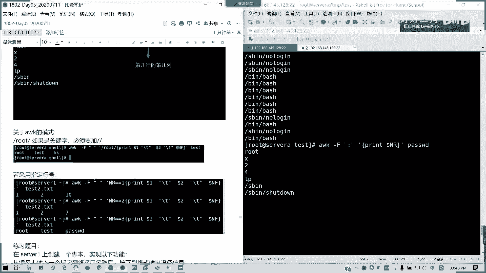
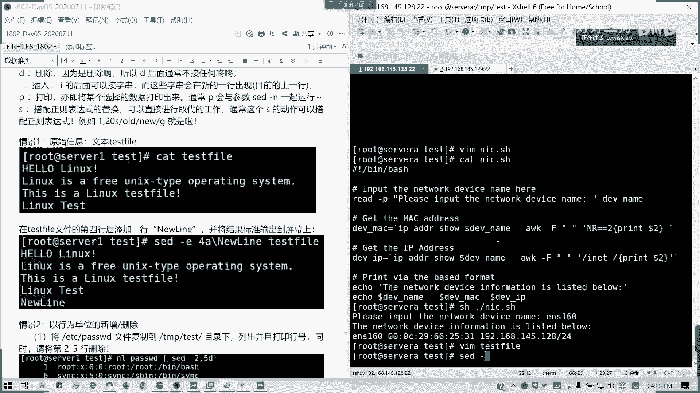

# Redhat红帽 RHCE8.0认证体系课程 - P26：30_Video_Day05_RH134_Ch01_Shell基础02 - 好好好二狗 - BV1M3411k77W

好我们回来03：30啊，我们继续啊，刚才说cut我们有局限性，那我们a w k的话就刚好解决了这个问题，它是可以进行标准进行截取，然后并标准化输出啊，标准化输出，我们来它的指令啊。

它的指令就是a w k啊，杠大f format format，然后后面分隔符引号里面是分隔符，然后呢，这里我动作指令这里不要漏了一个单引号啊，动作指令，我这里应该是一个半角符号才是对的啊，动作指令。

然后后面跟文件懂吗，我们来看一看我们的一个例子，tx 2点txt，我们这里面我们是一个文本啊，文本就12345678 99 零吧，或者90也行，随便啊，我这里用零吧都代替一下，然后123，五六，八。

我就写到这吧对吧，然后k一下出来，对吧，我们的是不是下面就很不规则，上面是很规则的字符，对不对，那我们现在a w q我要截取他的一第一位，第五位和第七位的字符输出，并显示，这样大f以空格作为分隔符啊。

让我们动作指定，print多了一，多了五多了七，然后对哪个文件进行截取，test 2点txt，对不对，他把那个。

将多个分隔符视为一个字，视为一个字符，并去掉分隔符进行标准化输出啊，懂了吧，所以为什么我这里都能截出157，因为它这么大的空格。

它都识别成一个了，那这个是不是对于我们来说就是一个标准化，然后不要加空格，我再自己再加就好了，那我们的我test 2点tsd，我们是这样这么写的，然后呢要a w k，那我们用cut对比一下就知道了。

我们cut指定同样的命令杠d，157杠f157 输出，157。

很明显的对比啊，很明显的对比。

诶。

是不是很明显的对比啊对吧，对吧，两个很明显的区别，对不对，也很明显的区别，一个我是正常输出157，但是另外一个的话，我只是说第一个，第二个的话一后面就没了，对不对，他第五个元素都不知道跑哪去了。

都是空格，那我们也可以关键字啊，那我们来看一看我我vm的test 3，我就假设是这样，那我，root，test pass第一次位，我们可以把这这行加进去啊，这样去，其实这一行是怎么来的呢。

这行是怎么来的，就是第三行我们怎么来的，我们其实对命令是生成的，第三行的或怎么来，我截个图啊，第二行怎么来的。

这里的话我们可以echo是吧，echo。

a口出来的啊，这里的话我们就随便写cat test，三点tx t，然后呢我们可以搜索关键所在哈，我们用两个撇。

空格为分隔符，对不对，那么动作前面root为关键字啊，用双斜杠，用双斜杠代表关键字啊，就他说我们输出内行的关键字，然后后面呢我们采用那个print prince啊，就是打印输出我们需要的一个结果。

我们来看看啊，我们要输出的是多了一dola dola 3，然后呢中间我加了一个制表符啊，print多了一，反斜杠t啊，我这里用双引号啊，它会然后多了二多了三，这里的话也是加一个制表符dota 3。

然后后面是。

对不对，它这里是一个是表符啊。

一个tab在这里，然后这个地方我们称之为关键字。

把图给替换了，对吧，这个是我们的关键词啊。

test 3我们是这样子，然后呢我可以啊，我可以让它进行一个标准化输出。

我就把那关键字去掉，然后我这样把root这一行我去掉。

看看什么结果是吧，就统一啊，统一输出。

就不管你是前面的那个有多乱，对不对，不管你前面的字符有多烂，他会帮你就是进行一个标准化输出。

我应该把所有的需要接下来。

这个图好像还差一点点，我要把它加上去啊，这里我们加了一个制表符，用别的颜色吧。

诶好像不太对啊，ak一边出来，然后，这里我多了一个，应该是这样才对。

重新画一下图啊，抱歉，这三个啊，这两个啊，还有这个。

嗯就这就这么多，这一个问这个是，这个呢是关键字，然后这里呢，这里我们使用的是制表符。

所以它其实可以作为一个很漂亮的一个输出啊。

这样可以看得懂的，可以看清楚了关键字，然后我这里我可以统一的输出，对不对，统一输出，那这样的话就避免这个问题，就是我cut的问题了，cut只能识别一个，然后后面的话就对吧。

后面它会识别成第二第三个元素的字符。

就比较麻烦了，所以说这个的话。

a w k我们先推荐大家去使用啊，然后我们还有这还有一个就是一个，它有两个参数，一个叫nf，一个叫nr，n r的话它就是一个nf啊，nf它这个变量，就是列数啊。

n s f在我们这里用a w k来来弄的话。

就是一个列数，比如说我们这一行多少列是吧，多少列，它的列数多少，然后我们直接打印这个dollar n nf，那是最后一列，对不对，来我们看一下，台式的tm p的话w d。

然后动作是print dollar nf，a t c r w d是吧，我们就用tap test吧，用这paw d就可以了对吧。

我们输出的是不是，这个dollar nf也就是意思就是默认，呼呼呼呼。

懂吧，这个是。

还有一个多了n2 n2 是什么意思呢，a那样呢是指定函数的第几个，它是它是一个函数，但用在，多了nf啊，对那是代表的行数，然后如果第一行的话，它就是它的数值一嘛，第二行数是二，对不对，记第几行。

安娜的值就是几多莱安娜呢，表示第几行的，第几行第几列哈，这个是要注意的，像我们这里的话，用prindollar n r，我们看一看，他们是不是输出的那个这是nf的n r，是不是为什么输入这个结果。

然后我们全是空白，正因为我我操，我当时在学时候，我也差点搞不清楚这个意思啊，但是我们后来我们实验之后才得知啊，它是第几行的，第几列对吧，但第一行它就是第一个嘛，就相当于一个斜对角线。

所以为什么下面是空白对吧，如果解释不对的话，可以反驳啊。

第几行的第几列啊。

懂我意思吧，这个应该应该知道吧。

然后呢像a w k的话，我们如果指定关键字的话，我必须要加两个斜杠，这个懂吧，刚才已经说了。

然后指定行号的话，我们就要采用指定行号啊，n2 记得指定行号的话，我们是前面是n2 等于多少的，等1=2=3，指定好好输出啊，懂我意思吧，而不是说直接多了安娜多了，安娜就出这种斜角角正的结果。

斜对角线的结果那就不对了啊。

那么下面做一下我们这个，练习题目啊，给大家15分钟时间看能不能做，写出来，我复制到群里面。

大家直接看群，这个也是蛮实用的一个巡检，我可以做巡检啊，对不对，再给他15分钟时间试一下写。

脚本记得多写啊，这种东西都是熟能生巧的，那大家加油啊，我们四点钟我们来讲这个题目，给到十十到15分钟时间能写出脚本，那个直接生过去打一现场的，好像没有是吧。

没有的话，我们来写一下，我们来写一下啊，我来看看这个脚本到底是怎么弄的，我们来看看这个脚本，首先我们解析器还是要少写啊，我们的解析器还是要照写，然后呢来吧看看啊，等下我拿一个东西，我们看一下解析器啊。

bbs还是造血，然后呢接下来我要干嘛呢，我要输入一个网卡地址，那输入网卡地址是不是我们要提示一个，我这里写个注释啊，我是不是提示我们的那个用户啊，我们直接在脚本用户，我们要输入一个网卡的名称。

那我这里写个注释，希望大家能够在那个，希望大家能够在写脚本的时候多写注释，因为你这个脚本未来啊，哪怕你交接或是给其他人的时候，不一定他们会看得懂，所以当我们建议多写注释。

比如说这里就import the network device name here是吧，我就让我这个注这里我们打井号注释，也就是说它实际上不会被执行好吧，相当于忽略，相当我们忽略掉。

然后我们用read是吧，杠p然后呢我们只有一个提示语，brea，import the network device，nap，冒号后面我留个空格啊，留个空格后面就这样，其实也就让我们那个键盘输入啊。

这样输入，从键盘输入一个指定的一个网卡设备的名字，然后呢我将它赋予一个变量，叫的话值全出一个变量叫做d e v下划线量，懂吧，这是第一个，第二个的话我输入之后，是不是我们获取他几个信息了。

首先第二个我要获取到mac地址信息，那我们用一个变量def device，下划线，mac等于，这里我们是不是可以引用命令的一个结果，对不对，使命令一个初始结果，那我们这种i p a d d r。

我们i p address show啊，a d r show，然后呢，我们这里是不是刚才有输入一个网卡名称，那d v name是不是dollar d e v name，然后呢。

我们用ak a w k alt杠f以空格作为分隔符，然后呢我们这里呢是指定行号，我们的n r它通常它的mac地址数在第二行，我们可以不，我们可以通过这边i p a d d，so我们对比一下，对不对。

他通常的是不是我们的行行在第二行的，第二个字符，第二段对不对，那这是不是我们这我们的网卡的mac地址对吧。

那我们怎么写呢，n那两个等于哈，n那两个等于a，两个等于二，然后呢诶然后呢那个后面我们一个动作啊，他指定一个条件之后呢一个动作，我输出的是空格分隔符的第二个就可以了对吧，第二个参数。

那这样的话我们这个就搞定了对吧，我们的mac地址就这样搞定了，然后我要获取它的一个设备的ip，get the ip address，the ip address啊，d v i p，同样我们用命令获取。

同样也是i p a d d r show，dollar device snap，用ak来杠f，这次也是用空格作为分隔符，然后呢引号这次呢我们就那个以i net作为开头，对不对。

我们的ip地址是不是在这里啊。

以i内作为开头，我获取内行。

然后呢同样他的动作print，多了二，我们获取第二个参数，第二个参数与空格作为分隔符，然后呢后面我输入输入最后的信息啊，输出最后信息，print，rather base formatter。

就是我们按照要既定要求的格式来输出，那我echo一下，友好一点啊，the network device information，is list below啊，然后呢啊e c h o，然后这里就开始列了。

保存退出，我可以到脚本出来，脚本这样子，然后呢s h，那我输入一个网卡名称，比如说e10 ，对吧，这就是我们想要的一个结果对吗，这就是我们想要的一个结果，能理解的，请打个i现场能理解请举手。

一个两个三个四个五个六个都懂啊，这个脚本其实不难啊，只不过你要分析它怎么样去拆啊。

参考的答案啊，因为a w k，其实你看标准化输出就非常的简单了。

有点卡，我把它重新截一个图。

放到群里面，所以这个应用场景用在哪呢，我刚才说了，我们的每天的是吧，设备的巡检就可以加入这个东西，对不对，就可以加入这个东西，其实这个东西的话我们还有其他用法，就不用输入它列出来是吧。

列出来我的设备里面网卡磁盘啊，或者是说那个只要固定的状态，然后是否正常启动正常工作，那这个就是我们日常应用的一个东西啊，不要总在最前了，不然我看不到啊。

就这个场景大家应该知道吧，我们巡检的场合可以用，就不用每天都去敲命令，去去获取信息，我们一个脚本一跑，希望就会跑，ok，这就像像您说这个其他老师讲的一些，就是描述场景东西我已经也有了。

好那我们这一块的话，我们的oc a w k就讲到这里。

接下来我们讲一下set啊，set的话要讲的话，其实如果像awk这样子，我们的oc谁啊，好我们继续录屏啊，set命令呢主要是用来用用脚本来处理文本文件，它是依照脚本的指令来处理编辑啊。

然后它主要是用来被自动编辑，一个或多个简化对文件的一个反复操作，编编写转换程序等等啊，像set的语法，如果真的讲详细讲两天，但是我这里的话我只列一些基本的用法可以吗，基本用法我们的语句said。

然后呢后面是带选项对吧，选项参数，然后后面参数的是我们对应处理的一，个文本文件，像我们这里的话就详细参数杠一是吧，杠一是代表说以指定的文件处理，然后杠f是指它的指定的一个脚本。

杠f是含有指定脚本的文件来处理，然后下面的几个，然后下杠n的话就仅显示结果啊，不显示过程，然后其他这两个选项其实没什么意义啊，就那个神帮助跟版本信息，这没什么意义啊，然后主要是后面他有一个动作对吧。

动作的话，比如说我们可以对文本进行新增替换，也对我们取代，删除是吧，删除插入打印，还有一个就还有一个就是这个搭配，正则表达式的取代替换通常是这样子，他这个是字符串替换，对吧，字符替换。

而在字符串会出现新的银行出现啊。

所以我们来简单看一下几个情景啊，这里我就不太讲讲，不是太复杂，我就简单来讲讲几个情景好不好，在我们这里我们一个文件叫test fire。t s t，我就写一个什么hello linux啊，就这这类的。

我是用来说那个用sad啊，用said来，进行啊，这也是一个linux的一个简单的简介，我就讲，假设我输这么多内容，这个内容你可以自定义啊，我们在练习的时候可以自定义，我这里说话，为了课堂效果。

我把它写出来，我们这个文字文本文件叫test fire。

那我们现在我要把那个test all，第四行我加一行叫new nine啊，怎么写，set，杠一杠。

一是代表的是那种就指定脚本。

来处理输入的文件，但是它不会改变我们实际文件，结果它只会在屏幕上输出，懂我意思吧，这时候不是我们输入，我们通常这个set我们建议不要随便杠杠，更带杠i，杠i的话就可以直接改掉文件这样的一。

然后4a在第四行后面增加，虽然和我们中间加一个增加什么呢。

new line一个新号，然后test fire对吧，在屏幕上显示的结果就是我加了一个新航的，但实际上，文件是不是没改变了对吧，只是说它文本数据的结果呢，仅限于我们的屏幕显示啊。

这种的话就set的一个应用的场景啊，应用场景可以不需要打开vm编辑器，我们可以直接可视化所见即所得对吧，一条命令我可以进行一个文本处理，这是他所谓的场景懂吗，通常来说在企业里面。

你如果你一个代码上千上百行，上千行上万行，你不可能去打开vi文，vi编辑器，一个个去找吧对吧，所以通过set的话是非常方便的，那我们来接着看第二个刑警，以行为单位的新增及删除，我们现在还是我们。

现在我们已经有这个pass w d的文件啊，不对啊，我们是不是已经有这个pass的d文件，刚才我们复制过来了，对不对对吧，复制过来我们以它来进行操作啊，我们列出打印行号的操作是n l pd对吧。

他就在前面输出，在前面会加一定行号，那我们现在要加第二到第五行删除，我们在后面就用管道是吧，把前面输出做为后面的输入，那said引号里面写动作，二逗号五，从第二行到第五行干嘛删掉。

我们这里好像看不清楚啊，有墨我再看一下诶，16789，对不对，就把第二到第五行已经删掉了，在屏幕显示里面把它去除了，但实际文件还在啊，因为我们还没有真正修改的文件，所以的话就是屏幕列出来的。

他就16789，懂我意思吗，这里的原本是要输入杠一的啊，其实输入杠一跟有没有杠一都没有问题啊，对吧，它的效果是一样的啊，带不带杠一，如果不带杠一，它默认是以脚本来出来处理文件，就是它的一个文字处理脚本。

懂我意思吧，那我如果只要删除第二行，那我就直接2d是吧，261345678，我列出行后的结果，就是让大家可以更直直观的看出，我们set的一个作用，懂我意思吧，然后我要删除第三行，到最后一行。

那就怎么样呢，三到dollar d是吧，我们的dollar是不是末尾啊对吧，只有一行没了，只有一行没有东西了，那这个的话就是从第三行，三到末尾这个懂懂啊，然后还有呢我要插入东西。

我在第二行后面我要插入一个叫drink tea 2 a啊，第二行添加后面空格跟字符串，我用墨啊，我用墨直接直接直接看一看，来在这里插了，懂吗，第二行也就是第三之前，我插入了新的字符串，这里我是重复的啊。

如果我在第二行前面加，第二行前面加，那是，2i对不对，前面，我在第二行这里后面加了对吧，然后我还要加两行以上，那我就2a是2a drink tea，然后我可以分段显示o是吧，点点点点点点。

然后这里我用一个反斜杠，反斜杠是标明命令，我们可以分行输入，对不对，分行输入，然后我这里再输一个drink beer，对吧，分行啊，我在后面出插入两行东西，懂我意思吧，说插入两样东西，记住啊。

我们每一行之间必须要用反斜杠来进新进，新行的添加，所以上面的例子里面，我们每一行我们发现在第一行，最后面就有一个反斜杠的一个存在，反斜杠在我们在访问命令行，是不是不是是不是把命令可以拆成两半。

分成两行多行输入，对不对，然后我们看一下情景三，我们来进行一个替换啊，当然我们是插入，对不对，我要进行一个替换，替换的话，我们可以用c啊来进行字符串的替换，我们这里还是这个文件。

第二到第五行我把它替换成一个行，叫number two to five，no two to five number，是不是这里已经被，换掉了啊，对吧，第二行的第五行你没了，就换成这就换成这个字符串。

然后呢我要仅列出5~7行，我们用杠n啊，杠n参数，然后呢5~7列出来，print，5~7p，对不对，列出5~7行，然后我们还有就是我们还有的功能，就是我们搜索数据并显示依然是这个文件。

我们要搜索root带root关键字行，并列出，我们还是an对吧，然后c的，我们这里的关键字用这里套上，用root两个斜杠套上，然后p那这样的话他除了输入就除了我看下，在这里，我截个图啊，我上次没没有截。

那么就有可能没截那么清晰，就我们在这里除了输出它的行之外，它其他行业也会显示，所以后会看到有两个重复的哈，懂吧，他除了输出所有行，会输出匹配的行，所以的话它它有那个符合条件的行，它会输出两次。

懂我意思吗，然后还有呢就是只打印模板的行，也就是我们要杠n啊，杠n只输出指定的结果，对吧，那就只输出这两行了，如果是没没加的话，那就只有那就全部全部，然后加上你这两行会叠叠着输。

然后我们还有搜索并删除的，我们这里把p看成d delete啊，我们是不是把刚才的第一行和第十行，已经去掉了，对不对，就还有root这两个行业已经不输出了，就这行原本在这里的，我就把我用箭头把它凹出来。

对吧，这两行没了，其他输出的都不是root了，关键字的，然后我还可以进行说，那个我还可以进行数据的搜索，还有执行命令，比如说我要把后面的s，我把里面的花括号等一串命令，我把它替换掉，对不对。

把best替换成blue shell，我怎么弄，c的杠n我只输入这一行就行了，只输出指定结果的行，我搜索root这这关键字，然后执行一串命令s是吧，替换对吧，听完开头，然后把best换成。

blue shell，然后我并显示并退出啊，显示并退出，我再加分号的话，是就是我们分开进行的动作回车，对不对，这输出的结果就变成blue shell了，原来是being best，对不对。

变成blue shell了，然后还有搜索并替换啊，除了整行处理，我们还可以行单位进行部分的数据搜索，并替换啊，基本上除了set的搜索替代操作，与v i m是相当的类似的对吧，它的语法set。

然后后面s是吧，将要被替换的字符串的字符串，然后新的字符串后面down j对不对，是不是我刚才跟我们，跟我们vm是不是很像，那我们来看一看我们原始信息，i f config e n s10 。

我们本期的ip是我们这里是14。128，我们昨天我在别的班讲课的时候，别的班讲课是201哈，哇这个我把图换换换一下啊，顺应顺应信息啊，我们看到这个ip是要4。128，我们可以。

我们的最终目的就是只获取到这个ip地址，怎么做，用set命令，我们首先将我们分布啊，我们首先将前面的删掉，把i p前面部分也有删除，我们用管道是吧，分布处理，我们获取一个叫i net对吧。

i need这一行，然后呢，said，s对吧，然后肩就一开头以i id开头，之前的，点si那就是前面啊，以i na开头的，前面的部分，然后替换成空，懂吗，这个知道什么意思吗，把id开头。

把整个id开头的部分去掉，开文一行开头案例这一块我替换成空值，那我出现什么结果，是不是这样了对吧，我这里是分布来进行，是不是把i it保后，把下面的id 6也没了，对吗，好。

我们继续把id后面的予以删除，我们再进行一次set s，然后net mask，因为我们后面是网页码吧对吧，把盐码后面的点心就是所有的部分一直到末尾，替换对吧，替换成空值诶，我好像漏了些什么东西啊。

我看一下那must然多了哦，我这里多了一个对吧，我们就把那个砍掉了，但是到后面还有一串东西啊，preface这些东西对不对，那我们仅输出一个i p p4 地址。

那我们就把那个我再进行一个set的迭代s是吧，开始替换，把内容把六后面的到末尾的，所有内容不要了，这就是我们一个令令实施的一个阶段，的一个结果对吧，三下5÷2砍到只剩一个i p v4 地址。

那这就是我们的一个目的了，这set的话我们一个如获取一个信息啊，我们获取一个信息的话，一个典型应用啊，如果这里用的分布操作啊，分布操作，然后后面最后面呢，是我们的一个整体的一个结果。

这个好像我截少的部分，能理解吗，有问题可以问啊，能理解吗，这个其实超实用的啊，比vi编辑器的方便好多啊对吧，然后我们多点编辑，多点编辑，我可以，用多个杠一是吧，多点编辑，我还是编辑到p pad这个文件。

然后呢sad我杠一是吧，我把三第三行的末尾数据删除，其实你多个杠一的话就是对吧，多个杠一我们就可以继续多步操作，对吧，同时删除，然后我把它它替换了，这是多点操作，然后直接修改内容，这是比较危险的。

set是可以直接修改内容，用杠i参数，不必需要管道和数据进行数据重新上，不过这个呢会影响修改原始文件，所以千万不要拿配置文件测试，我们这里的话我们编辑一个叫set。t s t，我们来来做一个例子。

比如说我这里有google点淘宝点，腾讯点主gogo点微博点是吧，我们编辑这个来做一个示例，把它set把它开出来，然后我们要利用set直接修改文件，把它的每一行的点变成感叹号对吧。

这是不是很实用的一个东西，p量修改文本的，s用杠i然后这里记得用转移又取消转移，懂吗，第一个是我替我分隔的第一个替换字符，我这里要取消他的专业使用，它原本的点懂吗，用点是在shell里面是有特殊含义的。

所以的话我要取消它转移，然后一直到，对吧，一一直到结尾啊结尾，然后呢就把它后面的全部替换了，然后呢这里把它替换成感叹号。

感叹号也是有特殊含义，所以我要取消它转移sd。txt，让我们再看一下，懂吗，变了所有的以末尾为点的，全部换成的感叹号，直接修改文件，用sd杠i懂我意思吗，set杠i，然后还有一个例子。

就是我们后面啊，他是替换到最后一行的对吧，多的是最后一行，然后呢，我可以直接在后面我加一句叫this is test杠i，然后我这里引号出来多了a啊，最后一行添加什么，this is a test。

然后s第一点t s t，对吧，可以直接编辑出来这个结果了，懂我意思吧，dollar是最后一行操作是添加，然后后面他就是添加的内容，因为多，所以的话这个它可以修改它，这个功能虽然危险，但是非常有帮助。

举例说，比如说我一个100万行的一个文件，那我要在100行添加文字，那就是会疯掉的个打开都会很长时间，所以sd直接修改替换的功能，那就生，甚至我们v i m都不需要用它了，这个这块能懂吗。

可以的话请举手啊，现场请举手，然后呢，如果远程的我看一下远程的这一块。

我们自己我们也进行一个中奖消息休息啊，远程的可以请打c啊，字母c，我said我就讲这么多，但其实已经把常用的功能已经涵盖了对吧，常规构类型涵盖了，讲不了太多的，就基本的我会可以讲了。

这像之前可能老师有些是根本就跳过，没怎么讲的，但这里基本上懂怎么用的吧，如果ok的话，我们休息15分钟，我们五点回来，因为今天要上六点钟，就因为少了一天课，上六点钟，我一个小时，我们回来讲什么呢。

讲特殊符号的含义，还是继续需要的内容，像特殊符号的含义。

