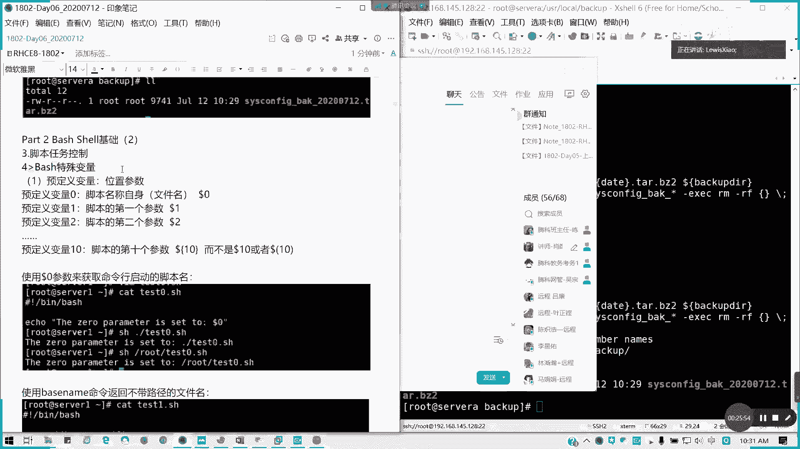

# Redhat红帽 RHCE8.0认证体系课程 - P27：32_Video_Day06_Day05课程回顾 - 好好好二狗 - BV1M3411k77W

好，我们来看这三道练习啊，这三道练习现在开始录屏看一下啊。我们这么写的啊，我是这么写的，用SCQ的命SCQ命令可以输等差的数列是吧？等差数列。所以的话我按照这里SCQ，然后起始位是2。

并固定式最末是50。🎼对不对？然后 do echo出来就行了。那我这样子的话，我把脚本开出来。SH。对吧我这种方法也是能达到效果的。然后大家的其他两种方法都对啊。你这个这个不叫脚本啊。

这个这这也是一个命令好吗？叶正柯，你的说法跟我想法跟我是一样的。只如果我要把我说要写那个炫要脚本，那我就这样这么打印也可以，对吧，对吧？其实这种方法是最简便的。然后大家的用for啊，用well啊都可以。

对不对？如果果这我就用命令直接达成，那就是第一个。我们第一个题目答案就这样啊。

这个应很简单啊，这这个音很简单，都知道怎么做了吧。这是我这是其中的一套方法，其中的方法，然后还有for外这些方法都可以啊。我看看大家贴出来脚本，我就知道了。对补卡，我再进行截图啊。

这个村政府的好像不对呃。不对A等于I加4对没错啊。啊。运行只要能达到结果都没有太大问题。对吧只要能同一个结果都可以。不是说像这种Y哦也可以，对吧？反正只要能达到目的就行了，懂我意思吗？只要能到目的。

什么方法都可以。所以第一我们一个脚本不止说一种写法的。

这是只是参考的啊。

我SCQ是最快的。然后第二种呢很多人不会啊。第二个第二个题目。用需要脚本列出与科诺有关的安装包的安装日期格式类似于这样子。类似类似这样子，那我们来看一看具体怎么写。这样这里另一个for循环。同样并办事。

然后呢。这里我写一个凤循环来。我这里定一个package的一个变量啊，定一个package变量，然后因什么呢？我们要获取一个命令的结果。RP呃RPM。然后呢，杠QA是吧。查询嘛。Rpe。

我们是不是在找可l这个关键字啊？对不对？找蝌这关键字，然后做一个循环do。做什么呢？Eical。然后我把这个软件包多了拍开。Was in store。嗯，什么呢？这里又是嵌套一个变量是吧？

欠到一个变量取值。对特。更低。然后我这里参考取值是at多了啊，参考取值at多了，然后呢再切上一层。我们整从哪里取？一단 Q。F对不对？QF，然后。我们这里呢怎么引用呢？百分号。

他有一个变量叫做instore。大括号in so time。那一个换行。不对不行啊。这是这里不是新啊，这是一个引号，双引号insstore time，然后一个换行。那后到 the package。

🎼主持人这样应该就可以了。我看的。哎，有问题啊，我写少了一个东西。等一下d这里。packackage was installed onday这里有两个括号，这个是没有错的。

inststore time哦，这里写错了啊。还是有问题啊。第五行第七行。哦。有时候老是漏啊。嗯。对我想想啊。这也应该不用加。我想想。这个脚本是有点问题的。这是D，我要取它这个值。

This operated is。

你看一下，我自己看一下这个文档啊。

我照这文档我再写一遍啊，instled on dollar是吧？d杠低。然后面有一个。太多了RPM杠Q杠QF。Inst time。是吧杠N。到后 package。

emvarid date那date命令我想想要怎么写啊。

你们第二题有写法吗？我可以看到群长里面的写法。

也是可以的啊，这个也是可以的。

这第一题。

第二题，我看你们写法啊。

可以这么写的，没问题。不是只有一个啊。不是只有一个，它是有循环的。

对的。

我记记错了，我写法啊，用AW用奥来写。这一个写的是没有问题啊。那咱用QI来弄。G干按区分大突呃忽略大忽略大小险。奥克。杠F与。冒号作为台。以冒号作为分割符，然后输出第二项。

这种写法是没有问题的。

弄A口就行了。喂。我看一下哪里出问题，获取不了啊。哦。我知道了。命令我还没隐完。

这就对了。不过后面。是22010啊。十是什么意思？多了啊。breakrick an install date，然后A walk干F用冒号哦。分隔幅应该是这样。

这样才是对的，有带空格的，不然你刚才风空那个缝格符是有问题的。这种做法。可以啊，参考而已，然后还有各种各样的。猫咪是有个空格的，他用猫空格搭分折符。像这个也是OK，直接取第五行啊，第五行也是同样的做法。

都是OK的。对叶正科跟董华社的做法都是没有问题的啊。这个是第二题，明白了吗？这道题明白怎么做了吗？现场的两位。用RPM杠QI来取值。来来取那个install date这一个。这个选项。

然后去出第二项就行了。就第二个第二个位，然后冒号有空格。所以其实我们看一下这个就知道了。对吧那一说对这里是有个空格的，刚才我没留意啊。然后最后面是多了2嘛，懂吗？够了啊，也就是我们的第二个参数。

所以的话这个就没太大问题了。第三题有谁做的，请贴一下答案啊。第三题，关于我们打包压缩的这一块。其实这些都可以用在我们这这些实力啊都可以用在我们的那个。自动化巡检上面懂我意思吗？可在自动化巡检上面。

比如说一些软件包什么时候安装的，这些的话，我们都可以查出信息来。第三题，有做的同学可以贴一下代码。

我看懂朵画是做了啊。我们来看一下第三题啊，第三题我们的做法，这个左边是懂华师的做法，我这边我的方法来做VIM我叫back up点SH。被告的SH首先节机器。Being best。然后呢。

我这第一个日期日期是当前日期，对吧？我们有个要求就是我们的命名规则是吧？当前日期怎么取当前日期呢？date参数date等于我们用命令是吧？date，然后后面加也就是我们自定义格式。多了啊。

百分号Y百分号M百分号D。Y是大写，就是它的全输出是全整了，就是2020年2020对吧？然后。M是那个。M是月啊，第一是日期，是日，我们可以看一下，我们新建1个SSH，我们来验证一下这些命令啊，对吧？

我们是不需要这样子，我们的日期对不对？那么定完变量之后呢，我们的工作目录我们也可以定义，就是我们的。

我们叫做us色local backup，对不对？我说 back up第啊。我们是备份哪个目录，ETCs config对不对？这里我其实我可以打个引号下来。然后呢，我们的。

我们dest station destination是不是我们可以备份那个。ETC six confi对不对？对吧，这是优色logo back。USRlocal备卡。对不对？我们的工众目录。

跟我们备一份目录啊。这一下加个斜杠，然后呢，我这里把高量调掉。然后呢，我们要干嘛？我们要那个执行我们的被分辨令。他。我们就用BZ twoBG two啊BG two的格式。那我们说CJ是吧？CCF。

然后呢，我这里的话，我要先指定我们的目标，那我们就dDR。对吧。到斜杠。不用斜杠了啊。这里建议还是这里还是括起来好了，因为这里不然会发生歧义啊。用起用我们把括号括起来。This configure。

back然后日期是用date变量。前面多了啊。对。点TR点ZZ不点TR点BZ two啊BZ two。然后呢，这里我们变量是用那个。我们的back up there啊。对不对？那我们还要找7天以上的。

我们要删掉。范一的。到了。Dest there啊。然后我们这里是要那个。修改日期我们用修改日期不一定要C time嘛，我们用M time。也是可以，对不对？因为他文他的那个最后的文件修改时间，对不对？

然后7天以前的加期，然后呢杠name我可以指定一个名字。然后呢，后面。ss confi back新对不对？然后后面杠ECC。M杠F括号。

这样就可以了，我看一下能不能执行。我这里为了保险啊，因为这个目录不存在，它可能被封为失败了啊。对吧。能可点R。我取这个叫dd的值。那么让我们去看一看啊。是不是备份成功了，对不对？

但当前因为没有7没有7个，所以的话他就没有删除的意思了。

就不会删除了，但这个脚本已经完成。

可以理解吗？整个过程。

第三题，整个过程啊，对以上三道练习啊。像整体套这个也是可以的，都没有问题啊。

都没问题。其实这些的话，脚我建议大家啊脚本要多写，虽以我们现在只讲了一半啊，讲了一半多一点。脚本平时要多写，要分析好需求的话就简单了。像要成写到这个也是可以作为范本的。

都没问题啊，看大家都相对比较厉害。然后如果以上三个练习都理解的，请扣Y。如果不理解的，请提问。现场的ok的话，请举手。知道啊，第一个知道了。OK都知道了。其实给大家布置练习的目的。

也就是让大家多想想脚本怎么写，对吧？为了我们其实的那个生产环境呢，很多时候要我们写脚本的，对吧？实现一些简单或者是一些重复性高的。我们的一些运维运维的事项。所以说话如果有脚本。

可以省去我们很多的一个时间。对不对？省先很多时间，那接下来给10分钟时，15分钟时间给大家练一遍。把这些题目练一遍，然后呢，我们10点45分我们开始讲接下来的。

第二部分的基础会首先我们接昨天的那个脚本任务控制，我们也讲到一个特殊变量啊。

