# Redhat红帽 RHCE8.0认证体系课程 - P28：26_Video_Day05_Day04课程回顾 - 好好好二狗 - BV1M3411k77W

好，各位同学们，大家早上好。我们今天7月11号啊，然后呢。9点50分，我们现在开始来。复习一遍我们7月4号上周六我们讲的内容，刚才也给让大家看了一些看了是呃笔记的。那我们这里回顾一下啊。

第一个我们讲了日志管理啊，日志管理第十1章啊，十1章讲的什么呢？sstem第一杠genenalD是不是所有的。我们开机以后，我们所有的日志是不是保存在我们内存中啊，对不对？然内存中。

然后由stem低 journalD去负责这个负责输出整理，对吧？作为输出整理。然后呢，通常它是保存内存内，它是以二进制的方式，那保存在run log里面jonal里面的一些叉叉是什么，知道吧？就是那个。

进程的1个IDID址后面啊，它是一个随金数很长的一串。专元导对位。诶。现在是没有啊，因为因为现在这一个的话，我们是没有把它配置的写入啊。刚才我们之前的话是有一台机是配置的写入的。

所以的话它就会保存就把那个。persistent storage对吧？我们那个jonal第那一个改成yes的话，它就写在这里。如果没有的话，那是空的啊，对吧？然后呢，查看方式我们有几种像joCTL。

杠F是不是显示就是说显示末尾日志，然后一直往下去，对不对？这是显示系统日志的啊，系统系统日志。而且他也帮我们整理过了啊，然后呢还有那杠N的话就显示多少行，对不对？写多少行。

然后sin and呢就是我们开始到结束的时间。懂我意思吧？开始到结束时间。然后呢，我们也可以如果要查看单个服务。对吧。单一的服务我们可以用sstem controll，然后tatus后面加上服务名称。

对吧。可以这样服务名称，如果有启，如果有那个有启动的话，他会有日志的。我看一下啊呃，比如说我的一些服务想讲有什么来着？对吧比如说我们的SSSD或SSHD它都会附带显示最后五行的日志啊，你估计要把窗拉完。

然后我才才能看到啊。这应该明白怎么查吧啊，所有日志包括我们的那个。え。🎼VIR log message这些的话我们都要会看啊。VR log message的话主要是。主要是一些除了系统启动外的对吧？

除了系统启动外的日志权在这里。然后还有就是比如说DMESG。就从引导开始引导开始到系统对吧？到加载系统完毕，这个日志全在这儿就是从你这个新是我们的虚拟机开机开始开机，然后挂它linkux接手之后呢。

日志全在这，还有我们的seecure是验证的，对不对？bo点loggo就是我们一开始那个引导的屏幕显示什么OK啊，是吧？就这这一列的话，它都列在这里。然后呢，还有一个secure。

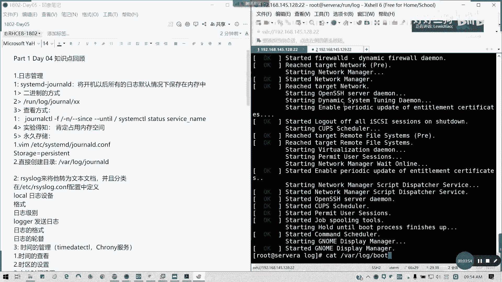

CQ就主要是。

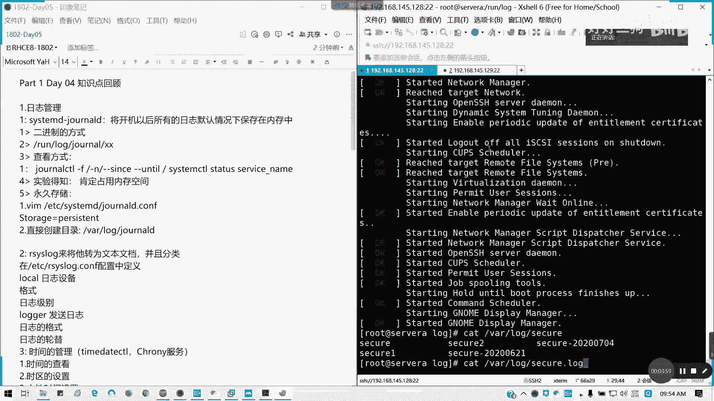

验证的就是你那个哪个用户登录成功或者是运用了什么规则。对不对？他这个是我们通过实验得知那个日支是可用占用内存空间的。因为它在那个run目录下面run的话，不在那个对吧？不在那个磁盘。

不占用磁盘空间的对吧？像我们丢起一个pro跟run都都不都是的内存上直接读取的，只是只不过映射到一个挂在点上面而已。然后呢，我们永久存储，就是刚才说的啊。🎼永久存储ETCsstem D是吧？

我们要编辑这个这个文件jonal d等于comf，然后这里的story today persist，对不对？在这里之后呢，重启我们的genenalD服务。但记得啊，它默认的一个存储路径在这里VRlog。

然后dD。Jurnal啊不是D啊，我这里然后journal。然后后面是。一个。随机数啊。一后面是一个随机数啊随机数，然后后面它是有。有东西啦。对吧有一个stem的 journal，对不对？在这里的话。

我们不能直接这么读，对吧？我们要这，我们通常用调用专D来，就通常调用我们的专CTO来读才可以。🎼它这里是内存里面数据，你根本读不了的啊，读不了的。你通过jonalCTL才能读才能读取我们的东西啊。哎。

怎么解稍等一下。好，我们继续我们呃这个我们在随机数里面，我们这个日文档呢。这个文档不能直接。cat要用。这种CT我来看。啊，这个刚才我们说了啊，这文档不能直接ca。好。

这个问这这部分我还有一个就是我们的RClog，对不对？IRClog的话，也就是将我们的sstem，我们将gene里面产生日志。转化为文档文文本文档，并且分类，对不对？所以我们的定义文件呢在哪里呢？

我们的那个s点com是有定义我们的那个。日制了那个分类转储的，对不对？我们看一下。对吧我们的那个各方面我们日志级别对不对？日志级别，然后我们输算了一个文件。那我们的loal，我们的日志设备对吧？

像这里我们定义locgo7，然后它启动的日志会输出VR log boot点log。然后呢，包括我们的日级别，就是我们有78个级别，对不对？0到7。如果是零的话，你系统已经崩溃了，critical。

对不对？零的话是不是 critical就是已经致命的了。然后还有一的话是emergence emergencyerency，对不对？已经紧急了。然后还有我们的那一个。

就citical emergency，还有一个叫做。呃，我只有ever是吧。wararning warningning这几个都经 warningning其实不重要了，已经不重要了。

warning以下什么notice are in four，对不对？这些已经是不重要了。这都不重要。所以的话那个。我们最关注的是应该是前三部分啊。然后还有就是我们日志的一些。

Mlog发动机是这个我们就没没多讲了，主要是看这些级别，然后怎然后怎么定义过去啊，怎么定义，然后存在哪里？就在我们这个我们上次不是在讲课的时候已经有定义过了，对不对？就secure这里。

像我们第第第八级别存到secure一，然后在er级别存到seccur2，懂吗？

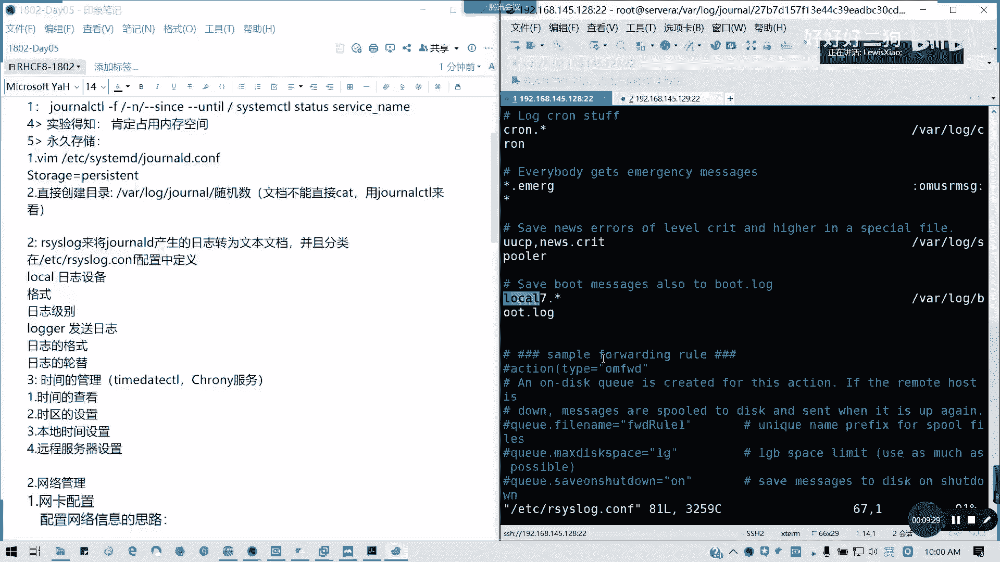

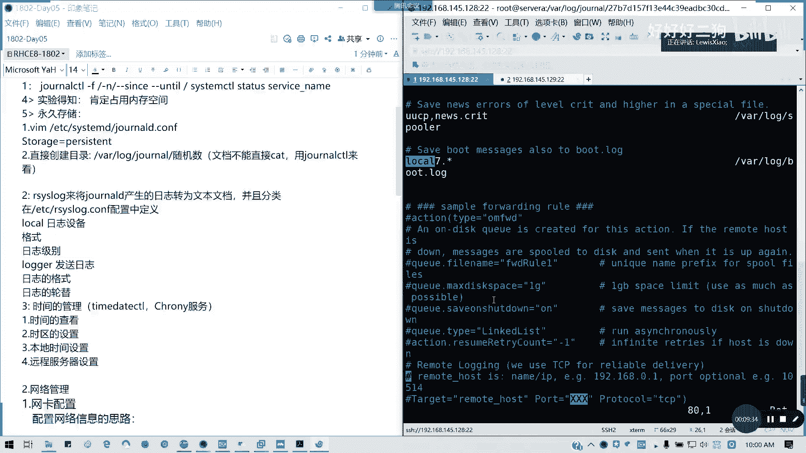

考试虽然不考这些啊，考试考试基本上你会看日志就可以了。考试主要是你要让看日志会分析问题。特别是最最近的话考切人就是说听说有有比较多的坑。因为它那个系统就它的否定水定变成8了，然里面还是7啊。

但是里面的话像我们配网卡地址的话，会配就说配的之话就很有坑出来的。但是但是此时就真的你如果有时间就排日志，没时间就重置吧。考试都是这样的啊，没时没时间的话，第一时间如果说比如说你的网络不通啊什么的。

直接重置再再来过，还好过，你是钻牛角尖，这个给大家做一个温馨提醒啊。然后呢，我们看一下啊认识的格式，我刚才在我们看一下VIlog message应该知道了啊。我切回这工作目录，因为这个目录太长了。

然后呢，我们来看一下日志格式啊。tell我们tailll用默号看起来。这是格式前面。日期对不对？日志发生的时间啊，日志产生的时间。日产生时间，然后后面是我们的日志产生的一个主机名，简短的主机名。

这里是简写的stem A啊，对吧？ser Aserv A。然后呢，后面是我们的相关的服务，还有我们的ID号。懂吗？这里啊I他的那个比如说stemD然后面跟着他PID。对吧然后后面是你的冒号。

后面是你的日志的具体内容，懂我意思吗？日志内容这个格式我们就讲，我们就附加这轮替log rotateate知道吧？我轮T它这里有个默认规则是吧？每周进行对吧？每周进行是轮替，然后呢，轮替的个数。为4啊。

也就是我这个日志我只保留一个月4周，懂我意思吗？然后呢，如何去创建新的。去创建新的，就是那个通过如何去建，就是说那个轮替玩的话，如何创如如何创建新的，我们用创建的方式，然后那个前它的后缀。

透它是加了一个dataET，就是那个我在轮转完这次，我看一下啊。

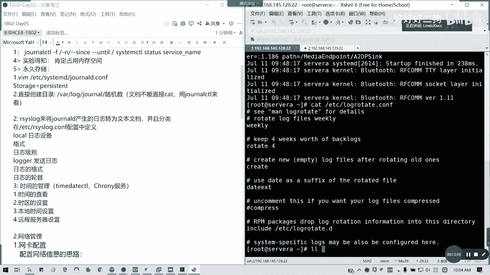

VIRlog我可以看一下，知道了。这这里的话好像有点，我就用L吧。因为LL的话，你看。

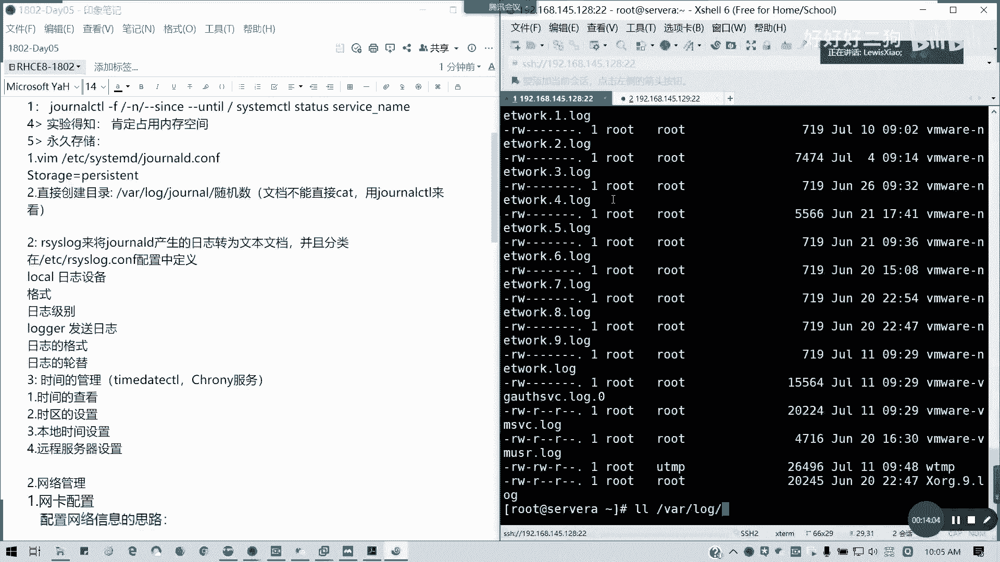

我轮转完是不是后面加了都加了日期，对不对？就旧的文件都全部加了日期。这样日期，然后新的话，它就会它其实也就是也就是说他把它到点之后把它改名重启服务，然后再生成一个新的。懂我意思吗？然后呢。

我们看一下那个人T完啊，人T看完我们就讲了一个时间，对吧？时间管理这时间如何查看我们time date。CTL对不对？我们可以看时间，然后我们也可以进行一个时区。我们可以看时区是吧，set。摊重对吧？

我们可以设置时区，对不对？像我们这里我们上节课已经设置了一个上海了，对不对？亚洲上海，然后我们也可以设本地时间，但设本地时间的前提下，你要把NTP关掉。对不对？AP的话是自动同步我们的网络时间。

这怎么关吧。对吧下将TP force啊，关掉之后，你才能设本地时间。格式的话就是。这么才算啊。这么长串的格式。然后呢，我们远程服务器如何同步啊，时间时间同步的远程服务器设置呢，我们这我们在6以前。

是那个。叫NTPD对不对？NDPD但期以后呢，我们换成了clorony服务，对吧？chrony其实差不多啊，只是名字改了。那我们看一看啊。我们看看那个ATC。cony点com对不对？改这一行。

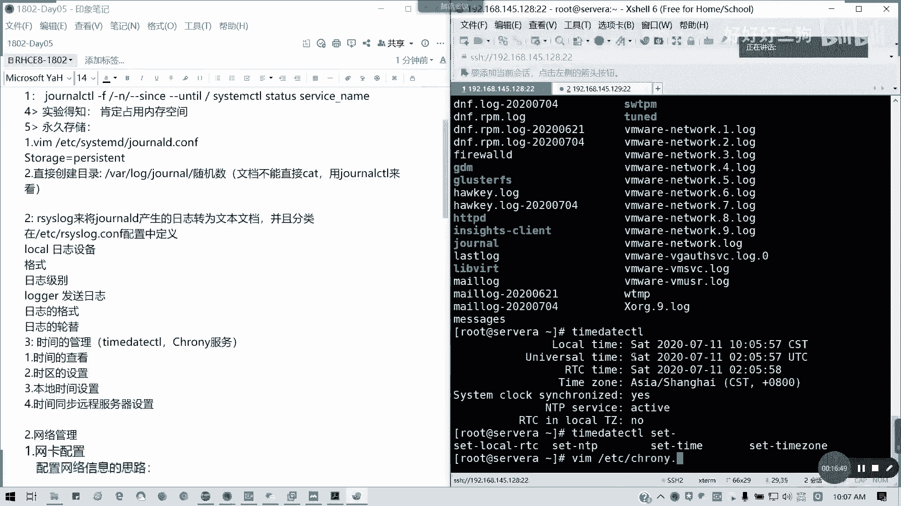

对吧他默认他是有一个就是默认的他是有一个同步我们的那个。re的那个时时间时，我们的时同步时间池的服务器。那我们这里如果比如说我在考试里面，我要有一个什么class点账点com，那我们就在这里加。

然后后面加一个时间脉冲，也就是8秒钟，它会自动同步一次。然后我这里写井号的部分呢。我这里写井号的部分就是我们要写的一个内容。如果我们有新的期些时钟同步园。对不对？有一些时钟同步员的话。我们就这么写啊。

那我们弄完之后呢，我们要记得重启服务啊配置。配置文件我们修改之后。是不是要把con d给服位重启一下？🎼因为因为这是配置文件，它是一个首务进程来的后台进程。然后呢，如何获取同步的同步的效果啊。

ron C source杠V我们看一下。对不对？我们当前是同步的互联网时间，所以它有4个4个时钟原啊，4个时钟原。然后上面它是有那个同它有一些格式，它已经有它格式的说明。

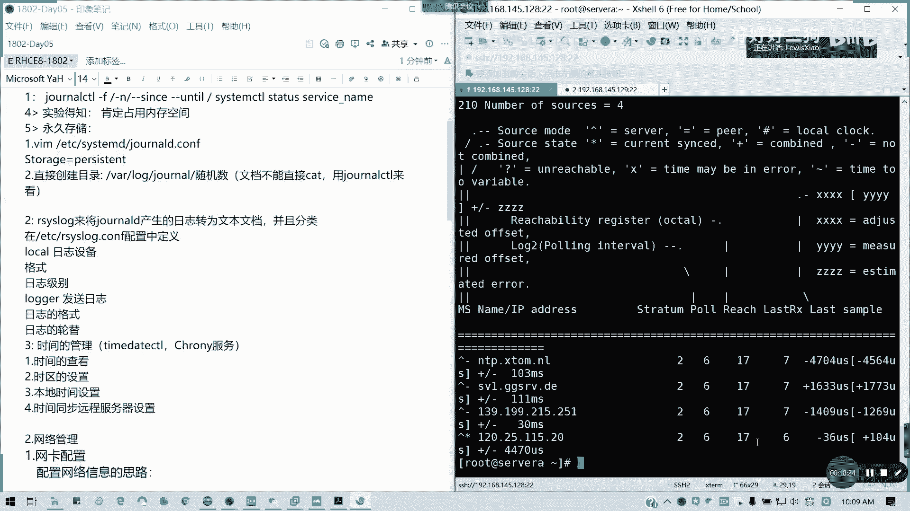

这个懂吗？考试里面8。0无论8。07。0。都有一道题来设NTP时间同步。有有这道题目的。然后11章我们就复习到这里。如果有问题请提问，没问题，可以打11告诉我。到群里面。

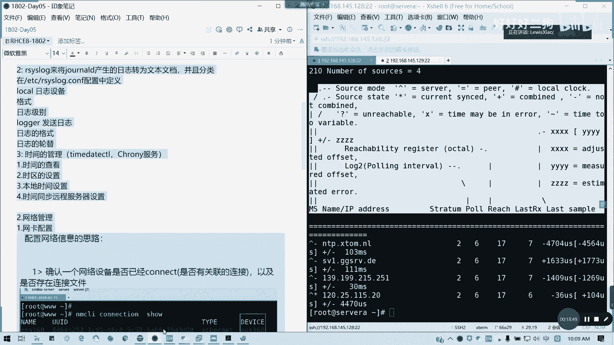

我看一下QQ群的情况。然后呢，我们接下来我们来复习一下网络管理。网络管理的话，主要第一个网卡配置，对不对？网卡配置。

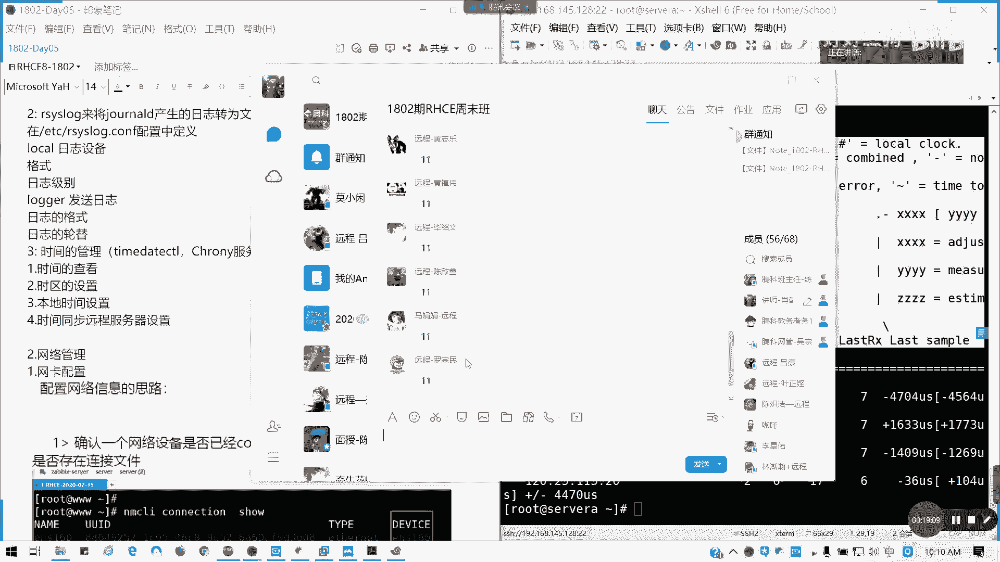

一开始我们要确认啊，就是说我们加了网卡之后，我们要确认这个网卡是否已经连接。懂吧？确认一个网卡是否连接，以及它是否存在一个连接文件，也就是我们的一个配置文件。所谓的连接文件就是一个配置文件。然后呢。

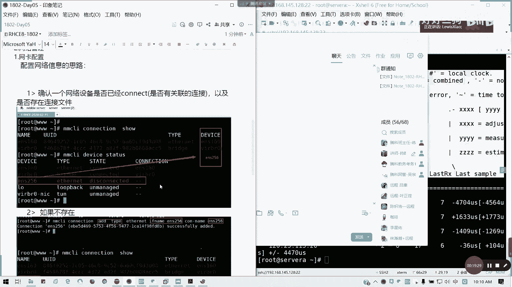

如果没有，我们可以用两条命两种命令啊，一种。

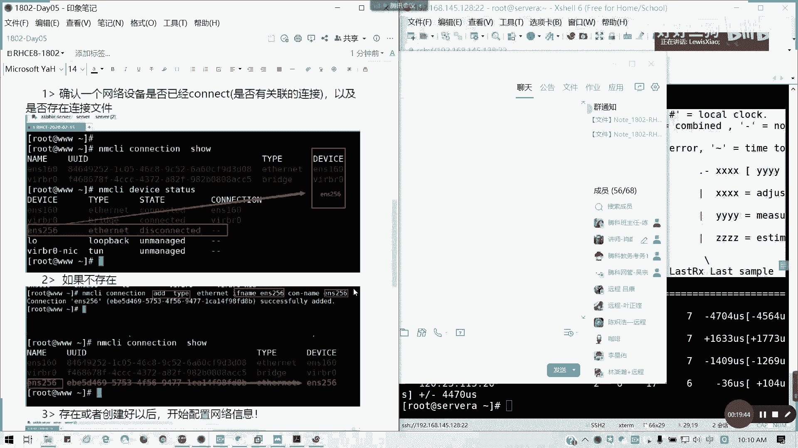

是我们用那个。长串就是我们直接添加对吧？艾呃 networkwork manager。client connection type。

然后我们是以太网if name像这里我们ES256能看到很清看清楚图吗？我们的ES256是断态的状态，那我们就加这个连接是吧？我们连接名跟我们端口名全部指定好，对不对？新加链接的话。

也就是相相当于是在我们系统里面激活这个网卡，而且生成一个同名的配置文件。

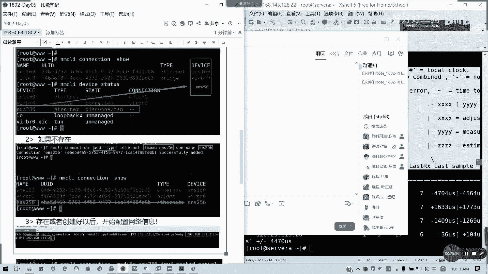

对吧还有一种做法就是我们的。

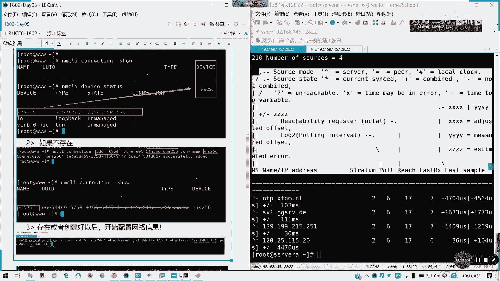

嗯呃，我清一下屏啊。还有一种做法啊，我们先看一下tatus，当时我们当前是我们已经加了好多块网卡。如果假设我193啊，193这个网161或193这个网卡我是没启用的情况下，我们两种做法，一种是。

never manager deviceevice connect对不对？自动生成，按照默认选项对吧？按照默认选项自动生成。但是有个问题，有些部分同学呢生成之后的话，他会就是他的那个。

设备名跟连接名是不一致的。就是连接名是叫做什么那个Y肯定选一，对不对？但是我们的设会名又是我们的烟我们的端口名。那这时候怎么改呢？如果按照我们。讲义上的这个步骤，就是完整的这个添加的步骤。

就指定链接名跟我们端口名的话，我们是不需要去改这个了。如果你遇到之后呢，因为遇到之遇到这个问题会导导致什么结果呢？你网卡是没什么影响，可能你链接文件发现不到，这是第一个。第二个，你的重启怎么办？对吧？

我重启网卡服务。重顶网卡服务是不是我们要那个connection要re露是吧？re露re露的是re露连接名，而不是设备名。所以如果旅肉的话就变成一个叫Y。

就默认的wire connectionne一就是有线连接。对吧。但是如果遇到这种问题怎么处理呢？教教大家一个方法啊，conmissionition network manager。

 current commission。modify修改我们的链，我这里是写我们的链接名。然后呢，我修改什么空I空点ID，也就是把我们的链接名修改成跟设备名一模一样。就可以了。比如说我ES161。

我这个我建了一个叫Y connection一的，它这个设备名跟那个连接不一致。懂吧。所那那我们就是这样修改，然后我们把那个网卡重置再启停就可以了。技术我们在8。0的时候，我们是没有这个默认。

没有这个服务的。不要傻傻的，跟7点一样，内个服务他没有装的，而且他接下来的版本就要淘汰了。啊，就下一个大版本是要淘汰了，所以它8。0默认没有这个没有这服务。

还有我们的namemo manager是不能被关掉的。所以当我们的重启方法。重启网卡方法，network condition是吧？n managerMNCI connectionreload。

如果你要全部重加载的话。从全部重新加载的话，你注意啊，如果你的那个网卡。你连网卡你再用的话，你要特别小心，我又怕到时你修改错号，重新起不来。所以我我们建议是对单一网卡进行reload的。懂吧？

然后我们再把它给。🎼大花屏下把链接给断开重连。就可以了。如果是动到我们的那个。

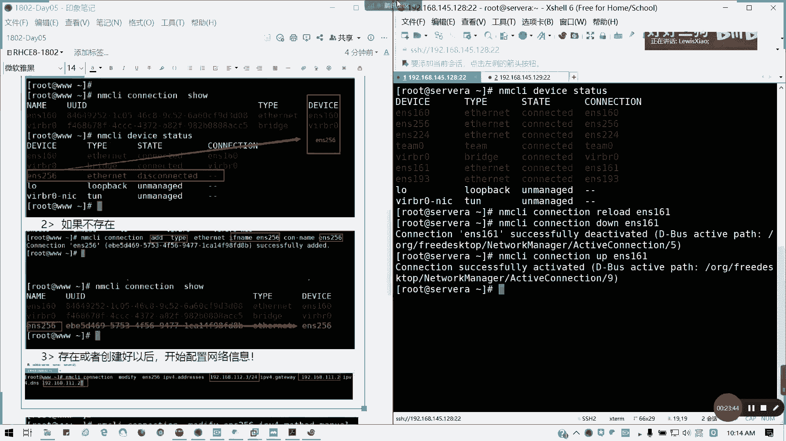

如果是动到我们的那个跟我们产生实实质性通信连接的。比如说我们跟叉税友是不是用我们用我们的那个有我们用我们的那个ES160，对不对？它默认状的话是ES160。那如果160的话，建议你们在VM中间里面操作。

在这里的话，如果你万一你的配置文件写错。很容易就挂掉的对吧？就网络链接断了，像我们我还教教大家啊，如何配置网络信息，对不对？创建连接存在或创建好之后，我们开始配置链接，两种方法，一种是用NMCI啊。

用直接一条命令配置完所有。另外一种最然后配置完启用，对不对？配置完启用。然后呢，我们修改IP地址的时候，记得我们修改完之后，记得把IPV4的mes。就它的获取方式，它的网络地址获取方式改为menu。

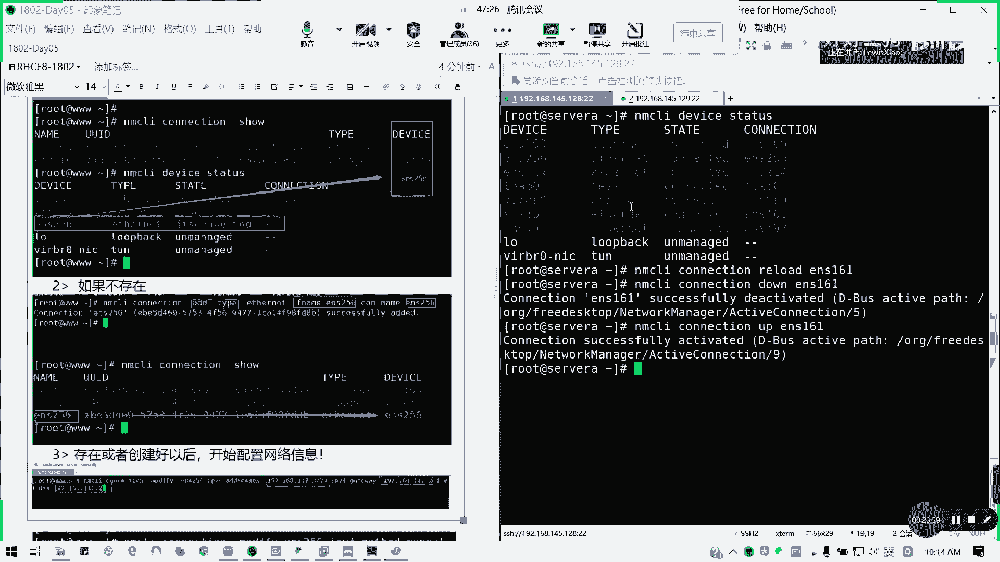

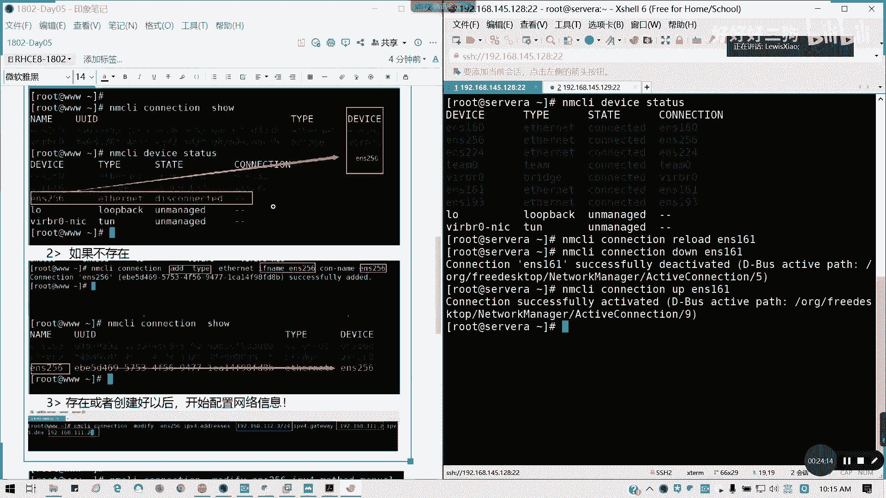

MANUL手动懂我意思吗？然后手动配置完，我们就启启用这服务，对吧？以上呢是我们的。

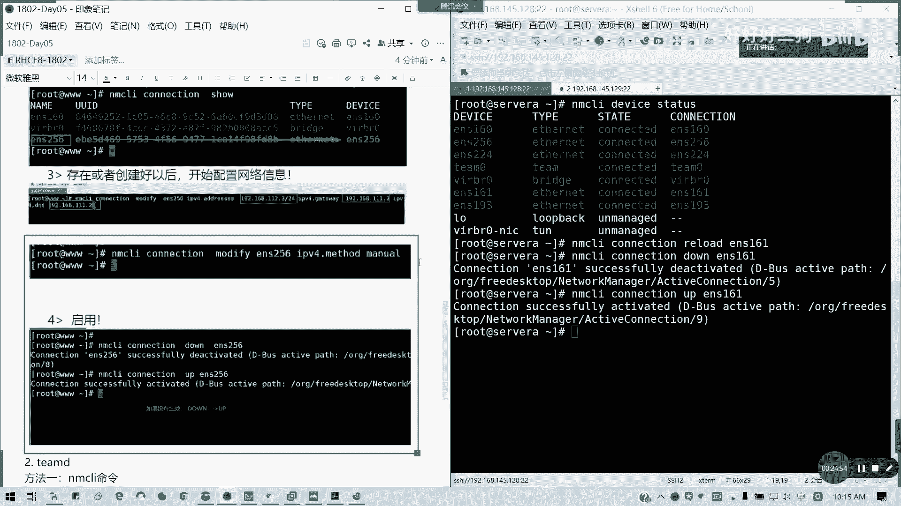

他这个思路呢。这是我们的命令法。

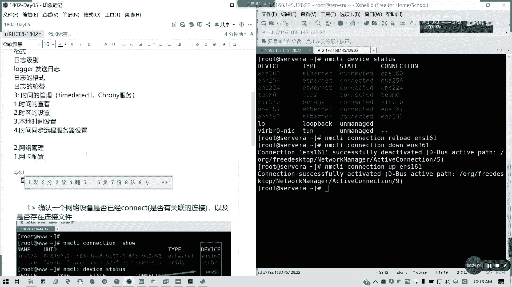

以上是命令法啊以上是我们的命令法。然后我们教大家最快的是什么方法呢？直接修改配置文件。对吧。考试我也是建议大家直接修改配置文件。

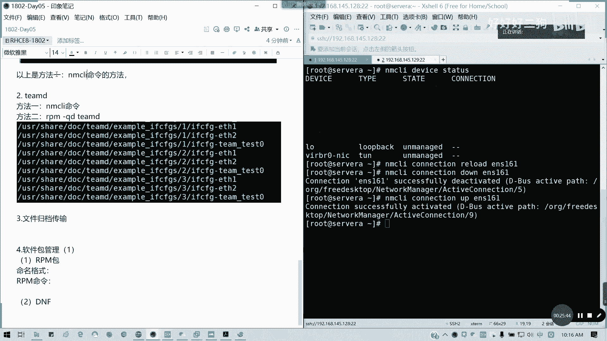

以上是那个方法一方法2。直接修改网卡配置文网络接口配置文件，也不能说是网卡，通网卡是我们通俗的叫法啊。配置文件在哪呢？ETC sit configurefi that was creep。

然 IFCFG。

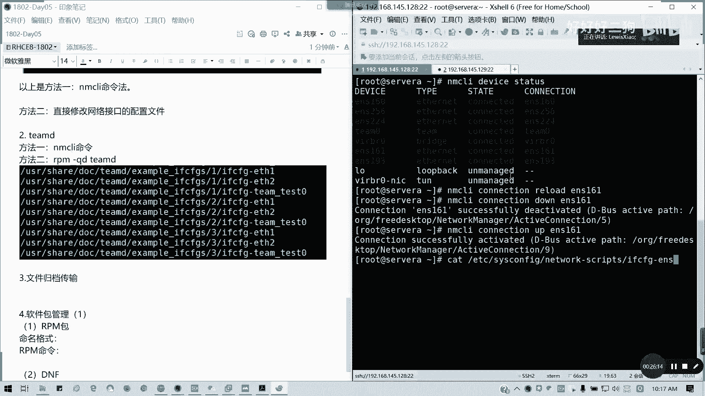

对应的网络设备，对不对？No。我们在第一天讲我们的那个linux安装那初始化配置的时候，就不是就讲到这里。有吧。考试的时候，无论如何看清楚题目要求，他会在。考试说明页会告诉你。IP野马就你的在哪个域。

网关如果不告诉你可以去拼一下它的域。在f在我们的那个在我们外面这台机器啊，就物理机上面拼它的域就出来网关了，对吧？然后记得我们的pro设置为n或者是 static都可以静态啊。

然后还有on boot这一个一开始都是为no，对不对。配做yes。然后DNS写在这里啊，我把我框扩大一点啊，我们注意的是这几项，第一个是这里，第二个是这里。第3个是下面这大块。如果涉及到IPV6。

还是写IPV6啊，这是第一个第二个第3个。特别注意。很多人老喜欢手残。知道什么意思吗？写错字呗。英语不我们呢最近不是高考高考刚过吗？是不是有人英语水平都不过关？特别手我们提醒啊。

手残党请注意手残党请注意啊。皮不要拼错。好。哎，有人没关麦，是不是？

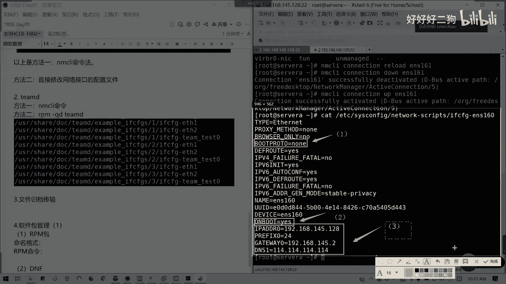

手残党请注意啊。

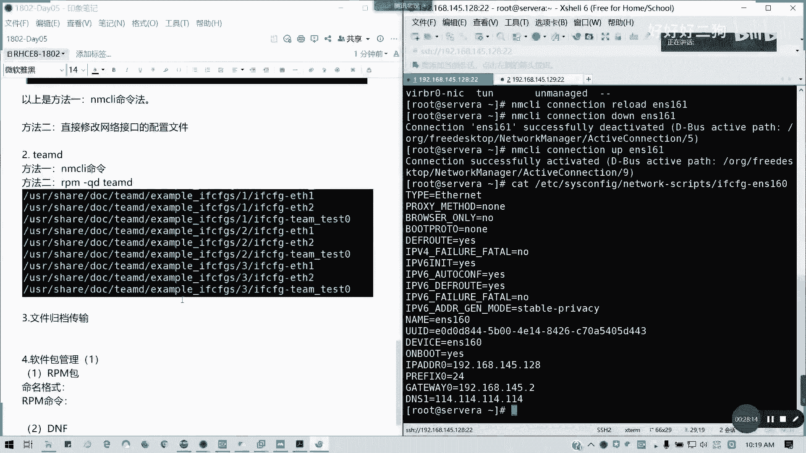

因为真的有人手残的，我看一下是不是有人没关麦，哎，退出了。

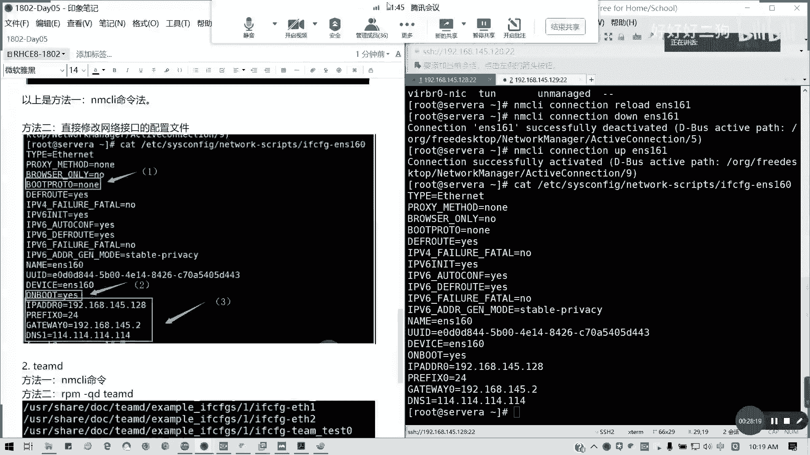

这些单词请不要拼错。是吧IPAD调，如果你网关前面全由带零就全部带零。

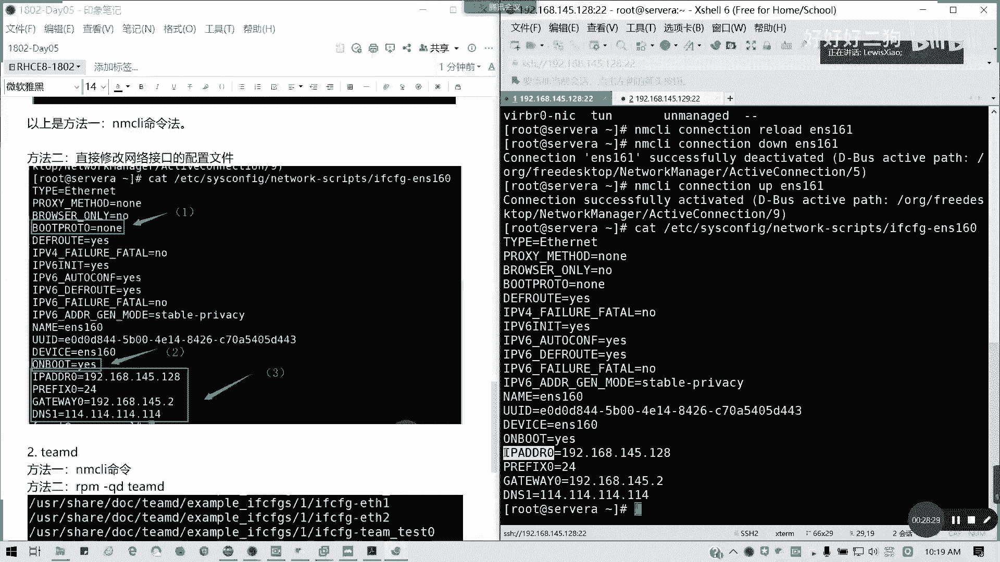

因为如我会怎么代理呢？我我为了方便配置多个IP地址。一个网卡，我们一个网络接口是允许有多个IP的。如果你不你后面不写零的话，你就只能配一一套啊，就一组我们的1个IP地址，懂吧？

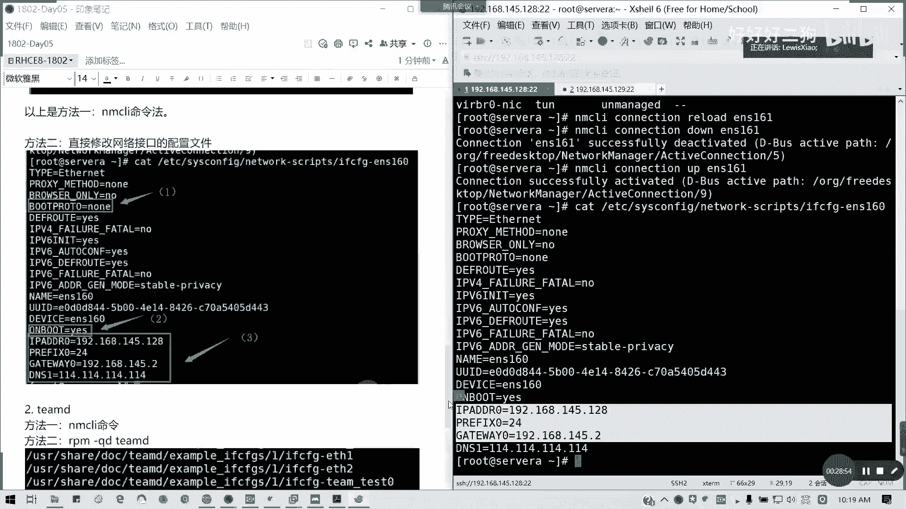

然后呢，好多人写错了，像preface，不知道怎么写的，或者是n nameax写错了啊，这行跟nameax nameax就是我们的子网源码，这行等价。然后这里get位，人家是GETE的。

就上次人家配到死都不通的那个我们班有学员在群上问我的对吧？在私聊问我的就哎，老师就说师兄啊，你为什么那个老网络老是不通，结果我检查了一遍，发现他手残了。懂我意思吗？要不就是前面有零get位这里漏的零。

要不呢就是这里单词拼错了，所以特别检查一下啊。如果我一拼一旦拼错，你的网络是不通的。到时候不要怪我了啊。😡，No。网卡机子我们配多个，从零开始DNS我们可以写到这儿。但是这里是从一开始。

DS一定是从一开始，而且最多最多貌似我们通约定俗成最多不超过2个。

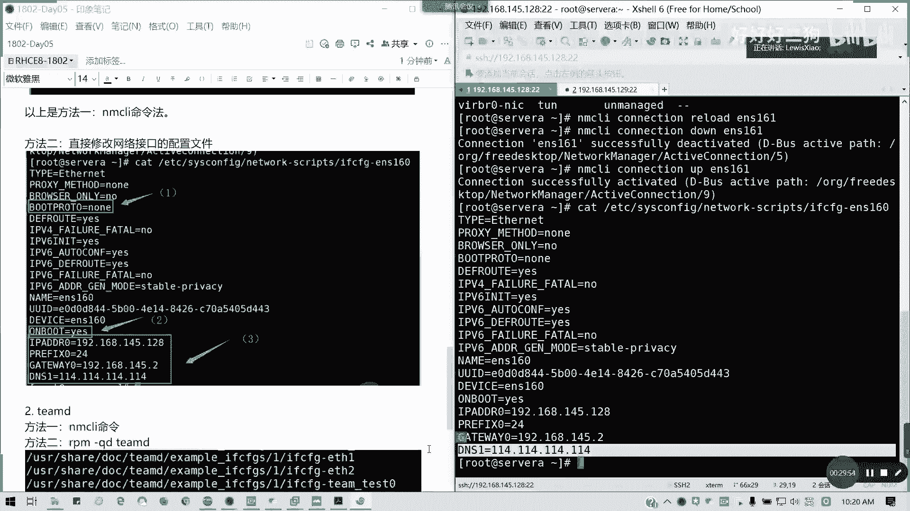

主辅吧，主辅DS还有一种方法呢。还有一种DNS的方法，我们是要编辑编辑一个这个文件总全局的DNS在serv点com里面。

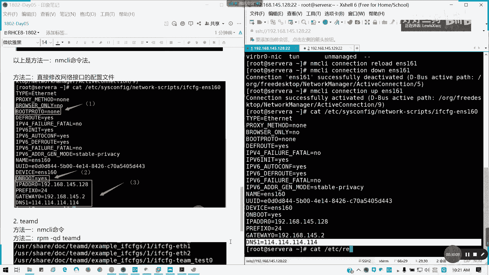

这是全局的DNS。

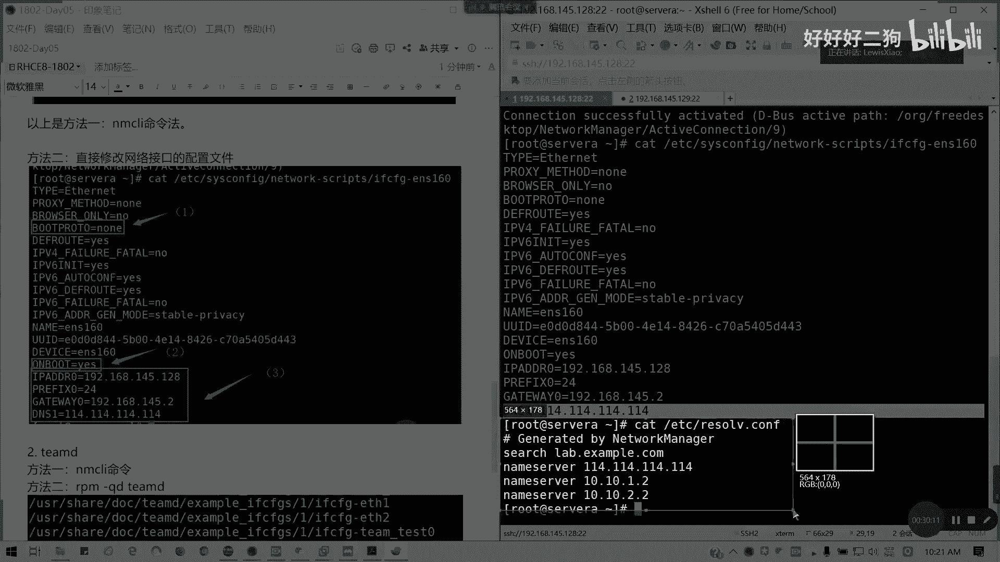

对吧全局DS可以在这里name server开头后面跟你的地址，对吧？跟你DS解释地址DS如果不配什么结果会出现什么结果呢？你的域名解析不通，解析不了你的IP对吧？你拼一下百度点控试一试，对不对？

如果你如果你这个域名你没有配对DNS的话，你的域名是你只能拼通IP你的域名是解析不了的。然后配置完的话，还剩那句话重启服务。然后我们可以然后然后倒一下，比如说我们指定的。怎么。我先捋录一下，然后呢。

我倒一下，比如说我的161，然后我再按别下。

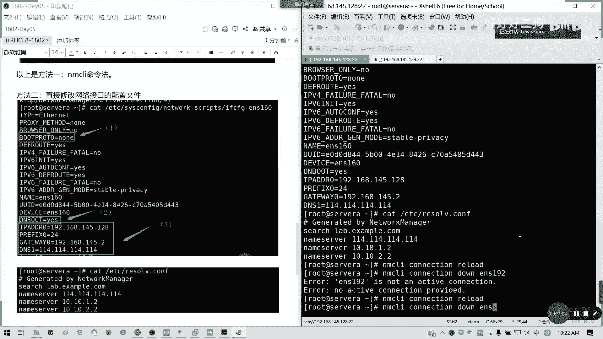

就是说我们重启网卡的步骤是这样子啊。

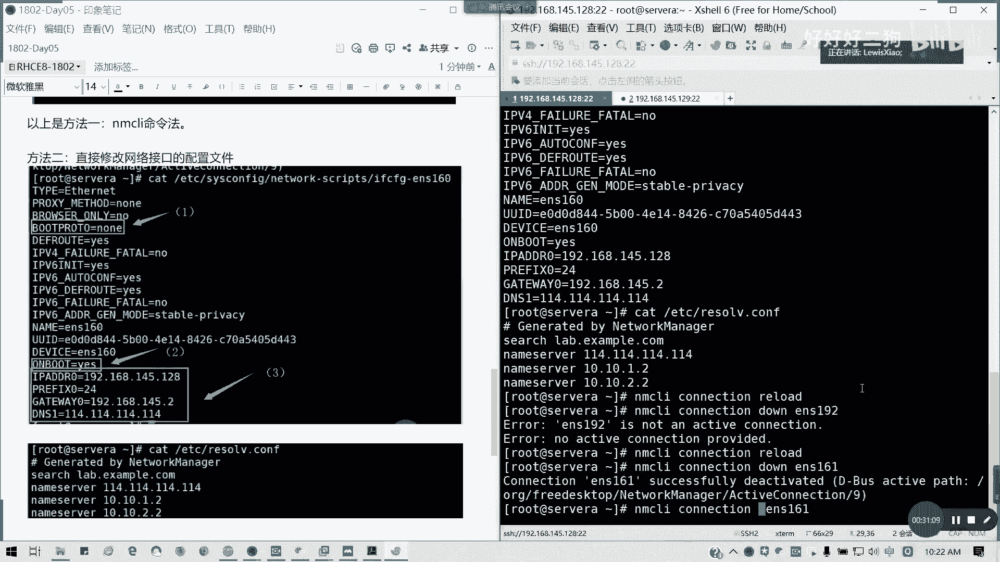

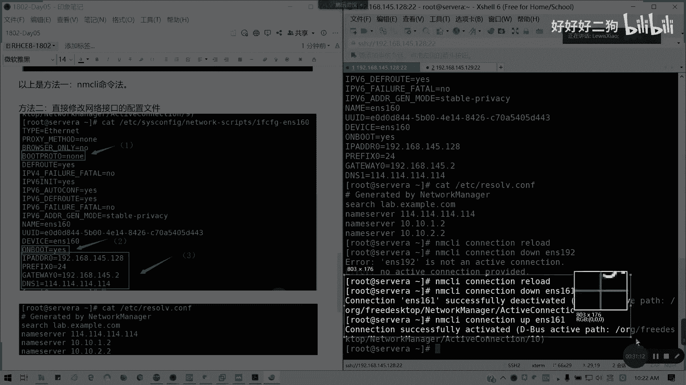

这块应该有没有问题，现场的有没有问题？

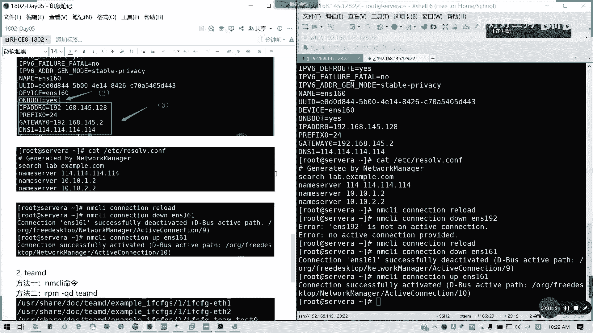

考试很多真的犯错了啊，上下午的像如果下午不是在78。0就不存在这个问题了。在7。0的话，下午考服务的话，他说自动配置IP那你可以不用管，你可以不管，你可以手动配，但手动配很都能配错。

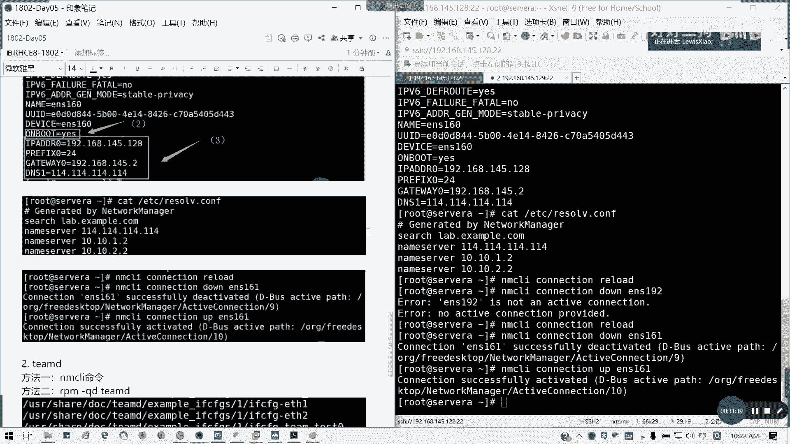

在8。0我们是不存在这个情况，因为8。0下午是调bo的。可能不存在这情况，因为8。0今年还没开考啊，今年还没开考，我可能是7月20号是第一批开考的。

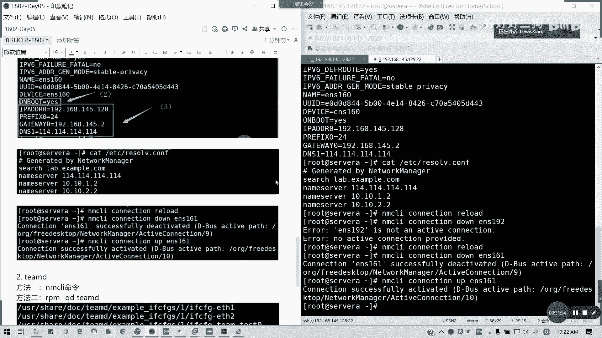

然后我们还补充了1个7。0里面的一个知识点，叫TD，对不对？teamD我们的链路聚合，我这里就简单提两点是吧？我们的MMCI怎么去配1个teamD。列入聚合知道什么意思吗？两个网卡绑一块对吧？

绑一块实现负载均负载均衡，或者是主备，或者是轮学。三三种，然后如果是bo的话，还有更多，但两者是有细微的区别的。我们这里是讲team为主。对吧这个虽然考试不考，但7。0是必有一题，但8。0是不考这个。

但是8。0，但是在企业里面太重要了。为什么你玩你企业里面你生产完这个网卡，你的服务器网卡肯定不是一条出去的。对吧肯定不只有一个接口，至少有两个或两个以上。

所以的话这个做链链路绑定就相当于我们的一个本来就是一个链路安全层面，对吧？我们做我们我们把链路做两条出去之后，万一真的当了一条，对吧？我们的我们的网线或者是出现什么故障的话，你的网络不至于会中断。

懂我意思吗？然后我这里的话方法我教大家一个方法。2，就是我们直接我们装了team d four，是是不是我们在linux是不是有天然的帮助啊，对吧？天然帮助的话。

我们是有视例文件在的看屏幕啊user那个un软件是目USR里面的share dock有个teamD。然后有 example这么多，对不对？直接复制过来改一下名字，改一下名。

改一下文件名跟里面的参数不就得了吗？对吧这个方法屡试不爽啊，上上节课你们实验过应该都知道。对吧直接改配置文件，基本上不用记。那这个问题啊，网络网络这一块我们就复习到这里，没有问题请打12，有问题请提问。

各位会议ID变了哈。😊，每天我们是一个远程的同学，请注意，每天我们是一个会议的啊，每天我们每每每每节课我们都课前发发布一个会议链接。都会议不变的话，那他主要是腾讯会议，它是不支持跨天的啊。

不支持跨天的会议。所以没办法，不像其他的可以支持说多天。因为这也毕竟是免费版本，对不对？然后我们讲文件归档第十3章归档传输，我们讲的什么呢？三种压缩格式。第一个。

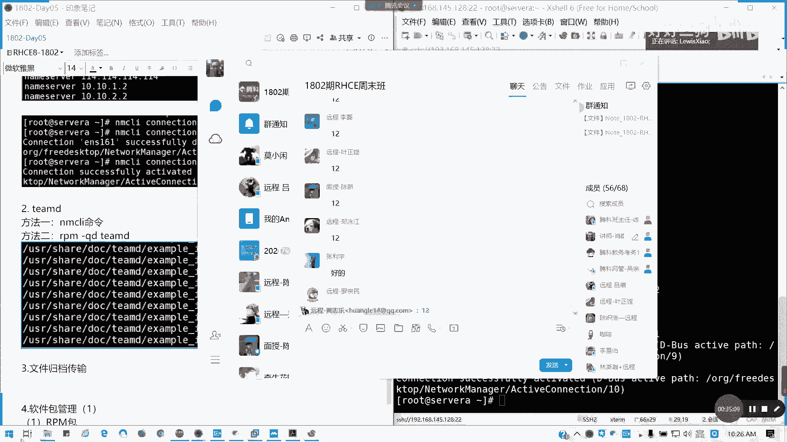

当能回答我是什么呢？三种。三种压缩格式大家可以回答我吗？不是不是不是踏啊，三种压制我们默认自带的三种。还有呢。还没。呃，叉Z吧。叉Z的压缩率是最大的。但是其实三者加起。

如果你文件你比较散的话是不太明显啊。叉Z的压缩率是最大的。然后然后B因为他的那个对，没错啊，罗宗明说的没错啊。然后呢，叉Z的压缩力最大。但是你其实你家你那个文件一少比较少的话，你要你体现出来不太明显啊。

通常我们用的最多的是JZ。

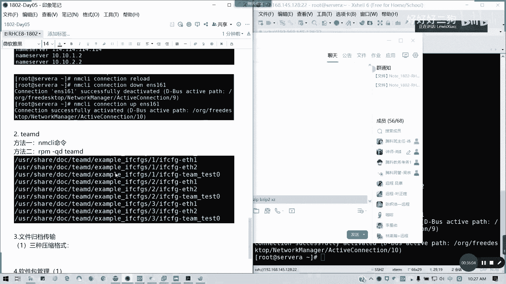

因为我最多是追击，其次是BZ two。让后我们踏命令。对吧归档。归档这块。是吧我们的那个。C压缩对不对？差是解压。T是。不测试。其实也就列出内容，你证明这个东西完不完整啊。T只能测试啊。不是展开啊。

展开是差，也就是我们解压，对吧？然后还有的哎呀就V不V无所谓啊，因为V只是列列出来屏幕里面看而已，对吧？那后我们的格式呢我们格式就在里面啊，我们格式呢对应来说就是那个。Z是吧，是JZ。小勾。

是 busy tool。大钩是叉J啊，看这这这一块的话，我们看那个。考试的要求，他要求那么好格式，记住啊。就是他的中间一个选项，对吧？解压到指定位置。记得后面加大C，后面加一个目标。

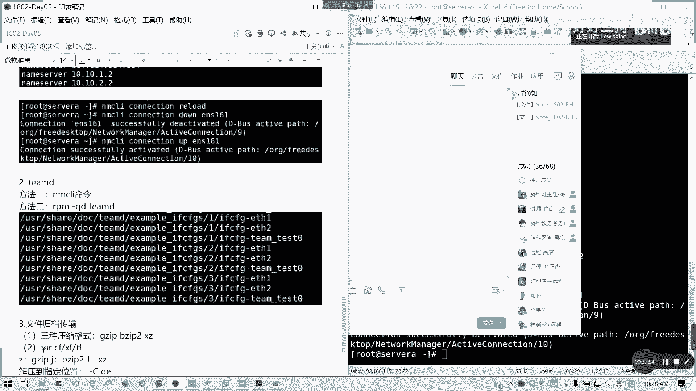

懂我意思吧？然后呢，第三个我们讲了一个。传输。SCP对吧？通过炫ll的进行传输SFTB我们没没怎么讲，其实差不多。还有一个就是阿think。增量啊增量传说。就主要是这一这这一些东西啊，这些东西基本上。

要清楚我们在日常生活用的太多了啊，嗯比较多。然后这块如果没问题，请打13，有问题请提问线上的同学。

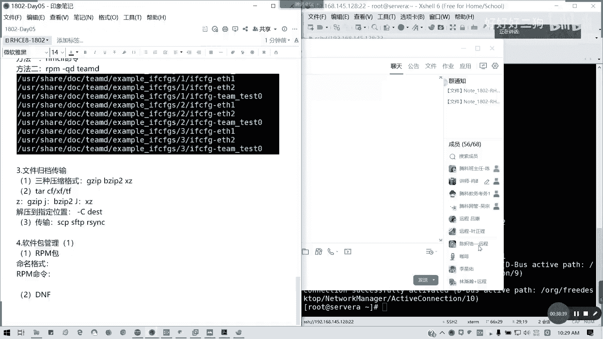

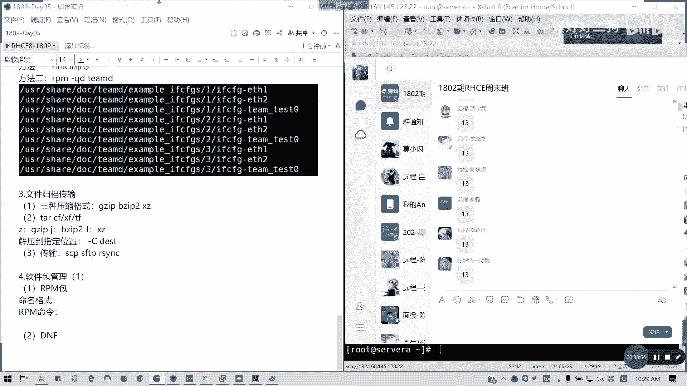

好。我们接下来回顾一下14章的上半部分内容。

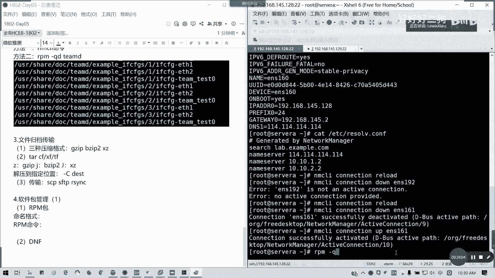

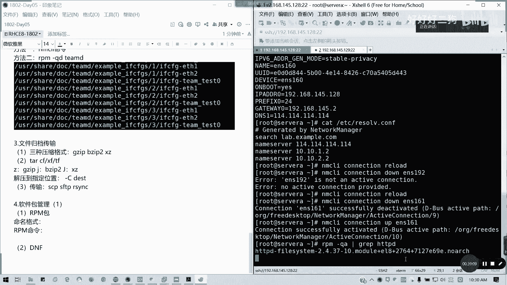

我回顾上半分内容啊。我们想到了RPM包对吧？P包命名格式。这样都懂吧，就讲这是一个那个我们常规的一个名字的1个RPN包。懂吧？二天包我们讲了什么呢？你命名格式像这里是包名。版本号修订版啊吧。

然后我们的试试用的系统将128的是用红帽8。然后呢，叉86-64都是它的架构。现在基本上除了IA64跟叉8664，或者是那个ar架构之外的，它现在没有32的版本啊，然后后面是RRPM文件名结尾。

然后RRPM命令呢。那就多了，通常我们很少啊我们很少拿它来安装，就说有关有有依赖关系的。单个包我是可以的。对不对？这是安装RPM杠IVH是安装UVH是更新，对不对？走吧，但是这个通常他解决不了依赖关系。

但是我们更多的用它来查询。杠QA。是吧。列出我们当年所有的包。杠Q杠QC啊吧，查看配置文件。杠QD。查看文档啊。杠QF后面跟文件名。

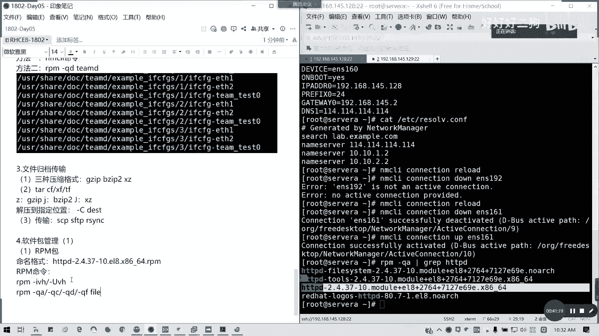

查一看他是哪个安装的，对不对？杠QI跟报名查看安装包信息。对吧。杠Q后面杠杠Scra。查看这个包这个包安装的是用什么脚本。对吧。是不是我们讲了这么多啊，我看看我看一看我归纳一下我之前我在另外一个班。

我也有讲到的。稍等一下，我看我看一下啊，杠Q。在这里。キ性キュティ是吧。

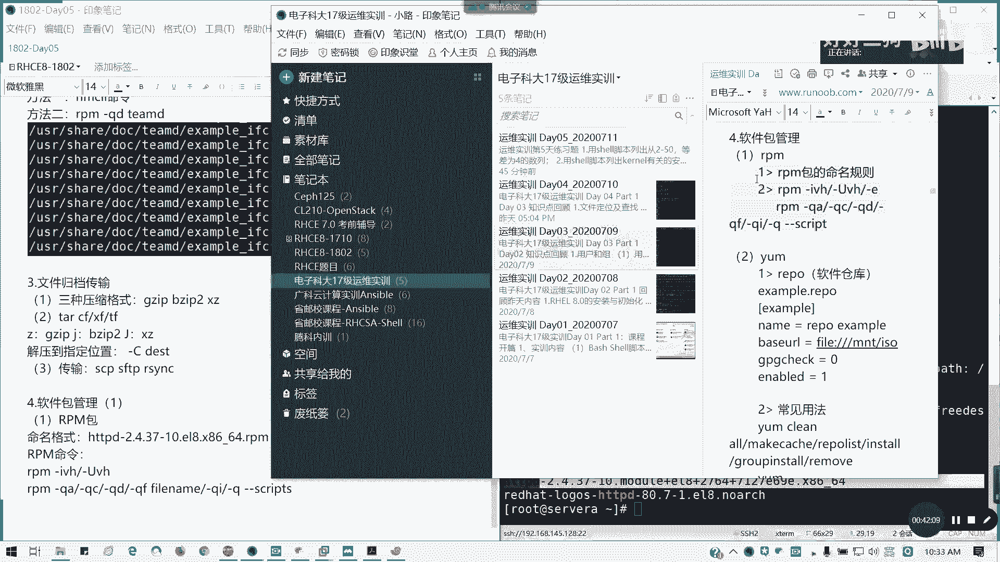

这懂吧？我们的常见命令。都在这儿。

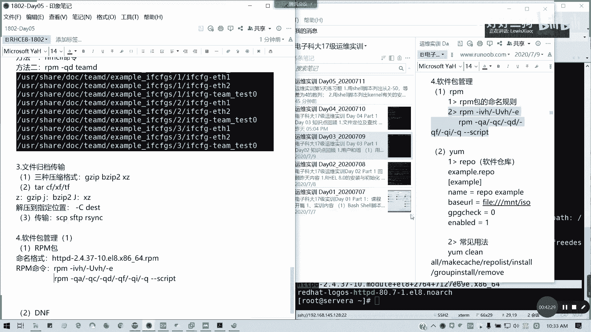

然后我们还讲了我们的。

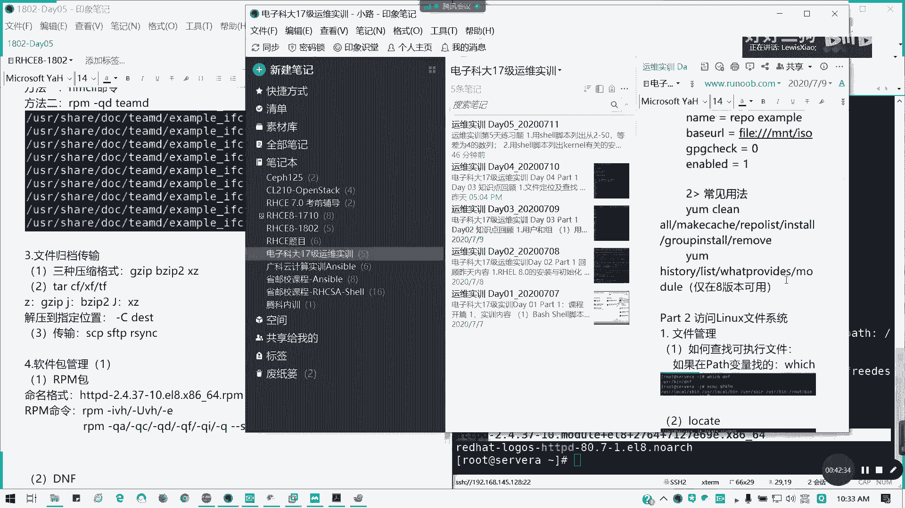

DNF对吧？DNF也就是我们的样啊，我们以前叫样，现在叫DNF不叫呃。不叫毒奶粉啊，也不叫地下城永生的DNF对吧？这个软件包管理器，我们可以简称为一药。那我们软我们首先讲我们的软件仓库，对不对？

软件仓库软件仓库我们是以本地源作为配置方法。本店做的配置方法，记得我们那个对于就是对于我们一般的软件仓库，对不对？一般的软件仓库是这么配的。上市又有很多人所残。这里。是吧。baseUIL写错了。

Enableable收率都啲啦。都有啊。然后如果是本地挂载记得fi这里有个冒号。懂我意思吧？像网络挂的就HTTP嘛，对吧？FTP也行。但是不要直接这么写，不要前面不要啊，不不要前面去掉。

因为他要支持有种协议的。所以的话我们这里啊像fire尔的话，记得为什么要三三个斜杠，知道吗？因为第三个斜杠是根挂的点，对吧？前面两个斜杠是说明它是fire尔协议，它是一个协议来的。

然后这里千万不要手残了，上次就有很多人就这样。很多的考试这样，结果就结果启用不了，对不对？然后这里也有人写的这样子的。对吧。所以手手残党英文不好的同学请注意啊，请注意不要写错不要写错。

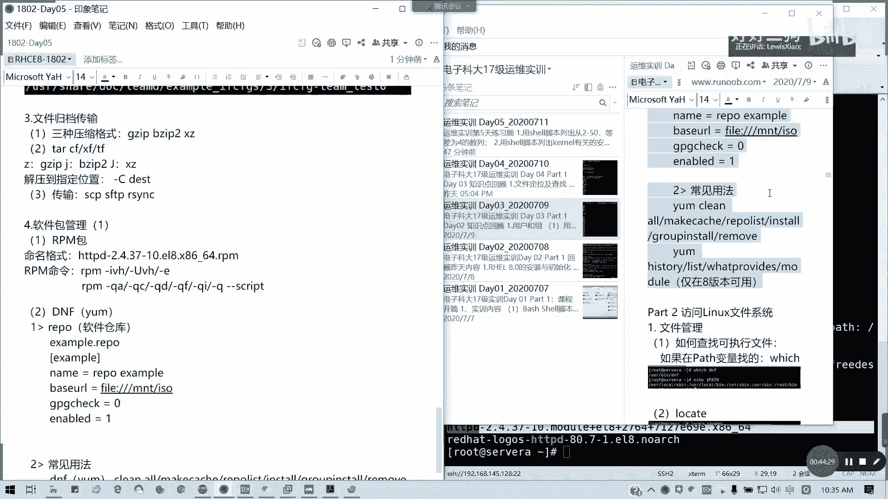

然后呢。在我们红外八里面是要写两个啊。我们写个tips啊，我们这一个一个温馨提示啊，在H18或stoS8里面。是不是我们已经把原来的一个大包分成两部分呢？注后一个叫baseOS啊，我们的系统系统的对吧？

基本系统软件包以及我们的应用流。对吧所以的话我们要一在一个report文件里面。在我们一个report文件里面。要写两个配置段。懂我意思吗？有个人就只写一个，有些人就只写一个7的话是写一个没有问题。

但是八的话，麻烦记得把两节都写上，好吧，把两节都写上就没有问题了。然后我们还讲了DNF或者是yM的话，在8依然可用。因为它是一个软链接啊，全部指指向了DNF杠3这个命令。所以我们DNF跟yM都可用。

是吧第一部分就是一个清我们的原数据缓存，建立原数据缓存，列出我们的那那个report的。清单安装、子安装，还有移除，对不对？这是第一种用法。第二个的话就是我们查历史，查列表，查是谁提供的。

然后还还有我们讲准备讲的。模块化安装。也就是跟应用流有关点，是简单来说就是一个版本控制。7。0我试过没这个功能，model模块都不存都不存在啊，8。0开始有这个啊开始有这个那。模块化安装是什么呢？

然后它是怎么实现版本控制的，我们休息15分钟再讲，10点50分我们回来。

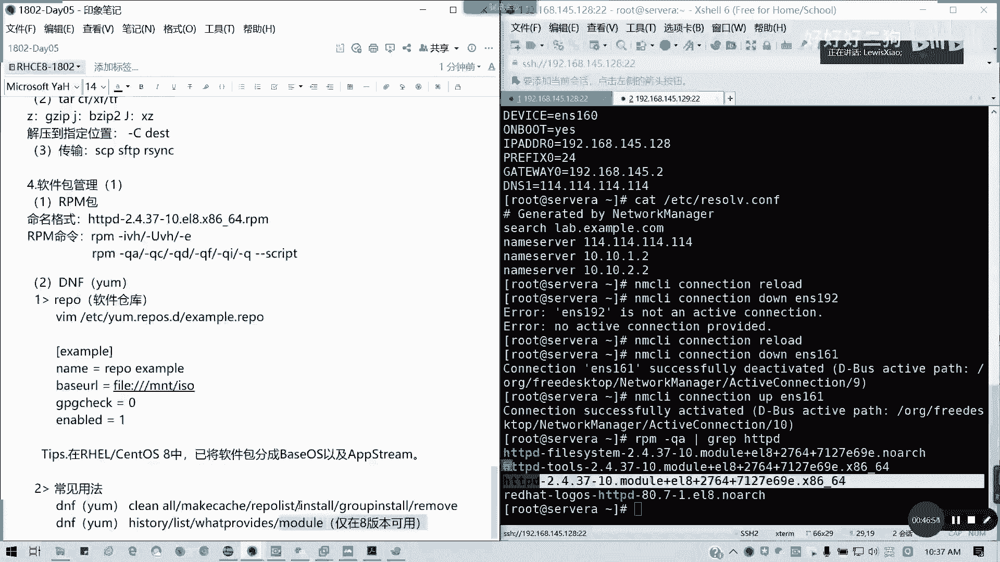