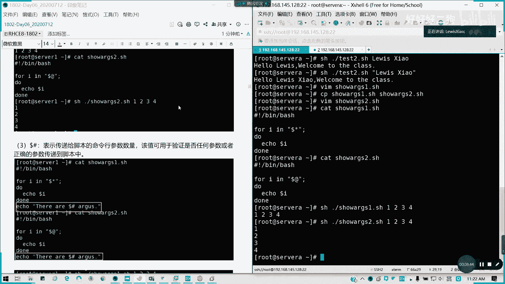
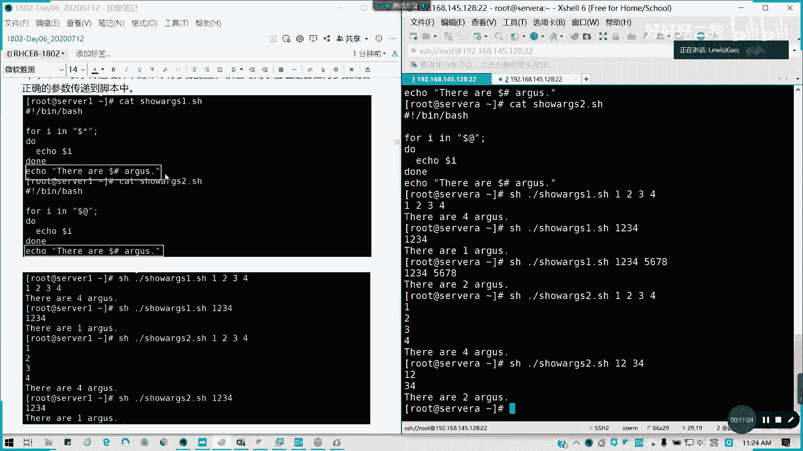
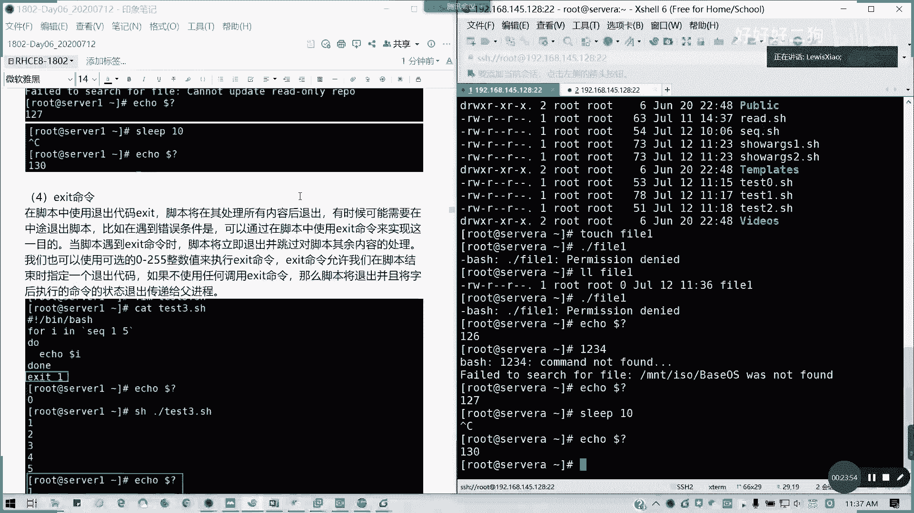

# Redhat红帽 RHCE8.0认证体系课程 - P30：33_Video_Day06_RH134_Ch01_Shell基础04 - 好好好二狗 - BV1M3411k77W

我们来看第二部分的基础任，我们任务控制里面我们讲到一个特殊变量啊，我这里就清一下屏啊，特殊变量，特殊变量呢这里有一个叫做预定义变量，就刚才我们涉及到一些什么多了零，到多了一多了二，对不对。

这些是叫我们有一个预定义变量，叫位置参数啊，位置参数我们要知道几个东西，第一个多了零多了零是我们的脚本名称的，自自自身，对不对，就是自己嘛，我们讲简单说就是一个我们脚本的一个文件名，对吧。

在bs里面叫多了零，对不对对吧，然后第一个参数多了一，第二个参数多了二，再次到第十个参数就是它的位置，参数超过两位数的时候，麻烦大家用大括号括起来，而不是这样多了十或者是这样子都不对。

如果写dollar 10的话，它就会变成把dollar一是吧，dollar一的那个取值取出来，后面加个零，懂我意思吧，所以要取多的十的话，请用大括号括起来啊。

请用大括号括起来证明它是一个整体，这也是为了消除歧义，对不对，那我们看看多的零，我们来写一个脚本，bbs是吧，echo，zero就是第零个节第一个节啊，parameter is set to。

to多了零，我就写一句话，对吧，我的脚本就这么写，那我们运行一下，是不是他把那个后面的我们的脚本的名称，已经输出来，然后如果我就把它完整名称写了，他是不是输出了一个完整完整的路径啊。

对不对，但我们也可以用base name这个命令啊，base steam这个命令呢我们可以加进去，我们获得一个仅仅是文件名，不带任何路径，np等于我们用命令传输结果啊，base name dollar。

零，同样我们echo这句话，记住这里不要单引号，单引单引号的话，你绝对引用的的zero parameter is set to，对吧，啧啧。

能理解啊。

它只输出我们的文件名了，他没有带任何的路径，能理解啊，然后接下来如果有空格的字符串。

哪有空格字符串，那我们我们是不是要用，是不是我们要用引号括起来，我的脚本，我来写一个test 2点s h，每次写基本上我们解析器，然后呢我们直接就一口一句话，hello，dollar，一。

因为我们文件名是多了零嘛，那么第一个参数是不是写多了一，对不对，可以大家跟我一起写啊，都没问题啊，welcome to the class，就这样写，那我们看一下看一下那个test 2对吧。

我们去我们脚本是这样，然后呢我现在我做的带空格啊，比如写我的英文名族意点消啊，就是这样，那这样的话它如果空格的话，它是不会识别成两个参数啊，对不对，如果我们不带任何引号，然后我我这个名字。

我这个dota 1，我本来的一个名称是带空带空格的，它是不会识别成两个参数，那如何要如何解决这个问题，单引号双引号括起来对吧。

这个就是我要想表达的一个东西。

能理解啊。

这三个东西能理解，不能理解的话，请打个a小a啊。

其实这些在原本八点我们都不讲的，原本八点我们不讲这些东西，这是原本七点的东西，但是在七点里面我们就造假吧，按照七点来讲，哎从此都飞过，有文字都飞过来了啊，然后呢。

我们来看一下dollar星跟dollar a的区别，刚才我们是不是讲到一个，它可以含括所有的变量，我们看一下另一个例子，但略有差别啊，我们这里先讲，在多了新的时候呢，所有参数就被视为一个单词啊。

就把它横向输出，但是如果是dota的话，每个单每个参数都是一个单独的，也是纵向输出啊，我们来看一下例子，呼呼，i引用最容双引号啊，多了新，就是读取一个文件列表的，对不对，读取一个列表了。

do do里面的echo follow i循环体结束，那我再写我再复制，我再我再复制一下啊，我这输出一个so a r g f2 。

我们这里把dollar星换成dollar at，多了c跟do了嘛，他说都是韩国所有的未知参数，对不对，那我们看一下，我们看一下。

对吧，两个区别仅仅在我们的列表里面，采用多了c和dota，那我们现在分别执行两个脚本，我这里就1234，它是不是横排输出，相当于我们把它视为一个对吧，一个单词懂我意思吗，1234这样排过来。

然后如果是二的话，dota每个参数是单独的，所以它是纵向输出来对吧，一列一个吧，1234这样列出来。

懂我意思吧。

然后还有一个就是dollar井，它是传传传输给脚本命行参数数量。

又一个验证任何参数传值是不是传到脚本里面。

对不对。

我们来看一下啊，我们在后面加一句，下一句话，我们在分别在两个脚本的后面加一句话，他这些预制变量我们不用去单独定义的，诶我写错字啊，e c h o啊，如果写错的话，它不会变色的。

好我们现在把这两个脚本我们再给他看一遍，多了解嘛，多了仅是传递变量位置个数，那我们现在执行一遍脚本对吧，1234它有四个，对不对，我们传出四个变量，对不对，如果把这里堆起来，是不是一个啊。

这是不是两个啊对吧，他就是个参数的个数会传，就是这个是一个预定义的一个变量，然后像我们的，如果是我们就是设一个单词情况下，它也是识别四个变量，主要是纵向输出而已对吧，像这样是不是两个啊懂吧。

所以说单词识别上，就是它到底是一个还是还是一个还是一个整体，就是这样一个区别而已，没了懂我意思吗，有问题吗。

好接下来我们来接下来啊。

我们啊这个这块如果有问题没有问题，请打一个小b，然后接下来我们要讲一个dollar括号，大括号花括号的一个一键用法。

最后没问题，请打个小b。

然后我们要讲多了发货的简单用法，这个其实很好玩啊，也就一个通一一里面一个通配符了，通配符，然后呢来获取一些不同结果。

比如说我们来看一下do的画画，我们一个预定一个变量叫做fire，截取嘛，这个其实虽然用的可能不多，我的一个完整的文件名对啊，截取嘛。

因为截取用像fire我们定义的这个文件名，我就跟例子写一模一样，这样的话大家可以容易理解啊，然后我用前面变量名，后面的话就井心杠是吧，然后a口一下，我直接在这a口，我就不再写命令了，不在写脚本了。

fire锦星斜杠，就是把第一个斜杠及其前面的都去掉了，对不对，所以他是不是少了一个斜杠，就变成tm p后面的一个东西对吧，警心脏仅仅心脏把锁把最后一个斜杠集齐，左边的字符串拿掉了。

那是不是只是一个文件名对吧，行一个前面一个啊，单个符号，这是最小操作，两个符号是最大操作啊，最大操作，然后呢井心点把斜杠换成点的话，他这其实第三位就是我们的一个识别的，一个符号啊，就第三个。

第二个是代表是任意第一个井是吧，井是左边，对不对，这里然后第三个呢是你的识别符，就是你的那个你这个字符啊，这个识别字符，然后比如减轻点的话，他会拿到第一个点，其实左边这不算是不点，就变成他点距离这样的。

对不对对吧，然后如果是仅仅新点。

最后一个拿掉了所有点是吧，就所有点拿掉之后，是不是剩下一个g1 z了，懂我意思吧，还有就是百分号警示，左边百分号是右边啊，百分号，斜杠新啊，那就是拿掉我们的最后一条。

以及右边右边的字符串，那是不是tm p test，对不对，后面的斜杠后面内容被拿掉了对吧，两个百分号空空白，所有的斜就第一个斜杠gg右边的全拿掉，是不是整个整个变成空白了，空行对吧，能理解吗。

好然后接下来，百分号点心拿掉最后一个，点击右边的字符串，两个百分号。

那是不是到paw d了，对不对，简单记忆法，井号是去掉左边，因为键盘上面井号在dota在dola的左边对吧，百分号是拿在右边，也就是我们百分号是不是数字五上面的，那个在doa的右边，对不对。

单一符号是最小匹配，两个符号是最大匹配，这样好记吧对吧，这样比较好记哈，然后呢。

还有一个就是提取字节跟变量替换来看一下，比如说我这里fire多了a口啊，这张a口一下dollar fire冒号零冒号五，那就提取最左边的五个字节杠，tm p杠是不是杠五个对吧，提取最左边的五个。

那我可以这里改把起始位置改成五，那是不是提我们从第五个字节，前面右边的连续五个字节，对不对，就变是不是就从t一开始，从第五个啊，01234他从零开始的对吧。

第五个是不是刚好是test这个t t e s t斜杠，对不对，然后呢变量词替换呢，比如说我要把第一个小斜杠啊，变成了一个大s，是不是，我这里有个第一个s是t t s t这个s对不对，小写换大写。

然后如果两个斜杠最大，把所有s全换了，能懂吧，这12个东西，这12个其实都是我们的t，就是用那个花滑的一个替换，换两个啊，怎么换两个这对，第一个第二个我想想啊，你你你可以自己想一想怎么弄。

你想想只有两个符的，最大一个是最小，那怎么换呢，你想想，也可以啊，你要换两个，比如说唉，就换，但是你要你要是要知道是不是连续的嘛，这个是连续的才行，我要去哪，我就帮你盖死的，那个好像对啊。

这个要自己考虑一下啊。

如果这块明白了，请打一个c哈，如果换两个怎么办，你们想想啊，这个的话告诉大家也在八点里面没有了。

然后我们再讲两个内容，我们休息一下啊，再讲两个内容。

一个叫错退出啊，我们叫退出代码或者叫状态返回码。

也就一个东西叫return code，对不对，我们每个命令，我们执行之后都会返回一个退出状态啊，通常在我们linux里面对吧，每个命令执行之后都会返回一个退出状态，通常也叫做撞返回状态码。

或者是叫状态返回码都可以，或者是叫一个叫退出代码，所以这两个名称都是同一个东西，一个叫return code，一个叫essay code啊，然后呢如果命令执行成功呢，它的一个退出代码为零，对不对。

如果不成功，它就是非零菲林，有很多种情况啊，命令退出，这个代码呢将由我们的负相传在附近程，并存储在我们的问号变量，然后我们调调用呢以执行命令的退出代码呢，有没有多的问号，对不对。

用do的问号的值来检索他这个退出代码呢，或者我们叫状，我们叫返回状态码，它是一个0~25这个整数值，在命令结束运行的时候，有命令传递给shell，对于需要解锁命令的话，必须马上啊。

在运行完毕之后立刻查看啊，或者是使用多多的问号变量，因为它的值呢会不断的被迭代替换，它只保存最后一，就我们最近一条执行命令的一个退出，返回一个返回码状态。

懂我意思吗，那我们来看一下例，看一下它的状态返回码，我这里return code是吧，零代表成功执行，一代表一一般性未知错误，比如说我们参数不存在对吧，像第二个的话就是不适合的shell命令。

不适合sl命令，比如说我们的那个文件目录找不到，懂我意思吧，这不适合的126是命令不能执行127命令，没找到，128无效的退出参数，幺八加一个x呢是一个信号的严重错误，我们是不是命令执行完一半。

执行到一半，就break掉了。

二五是正常退出以外的状态吗，那我们再来看一下以下例子。

我们这是一个正常的命令，然后我们马上echo dollar，问号它的状态码是不是零啊对吧，然后我输入一个不存在参数。

它是不是提示一个叫envy day的多2%，t对不对，那我们此时的退出代码，对吧，它就是它一的话就是一般性的未知错误，也就是我这个代码，我我这个参数我不存在对吧，所以他的那个退出状态是一，然后呢。

我这个目录我不存在，我的退出代码是二。

也就是他说不适合这个命令，不适合啊，也就是我这个这个代码没找到，它不适合的shell命令嘛，对不对，然后接下来。

我新建一个方案一，没权限是吧，它因为它默认的那个权限是不可执行，对不对，然后我在直播间发一，然后他退出，代码是126，对吧，我这个没有权限执行命令，不可执行吧，一六。

然后command not found的这种情况，代码是127，就我这个命令没找到了，他的退出代码是127，然后比如说我延迟十秒是吧。

它的状态代码是130。

但是产生在c中断退出的是吧。

130啊，然后我们讲一个exit退出啊。

退出代码啊，退出一个命令啊，在脚本里面使用退出。

这么xx他这个脚本呢将会处理所有之后退出。

所以所有内容之后退出，有时候呢可能需要在中途退出脚本的话。

比如说遇到错误条件的时候，可以在脚本里面使用s命令来实现这个目的，也就是我们可以自定义我们的返回码是吧，自定义返回码，当脚本遇到s命令的时候呢，脚本将立即退出，并且跳过对脚本剩余内容的一个处理。

我们也可以使用刚才说的啊，0~25这个整数值在执行s命令，它允许的话，指定一个退出代码，如果不任何，如果不使用任何调用的s命令呢，他脚本要退出，并且将，最后执行命令的一个退出状态码，传递给附近城啊。

状态状态退出退出码啊，状状态退出代码，如果我们不指定x值，我们它就会以最后一条命令执行为准。

懂我意思吧，比如说我们这里我们可以举个例子啊，我们就看一下test 3，我for i，我这里就写一个sq，我们生成1~5之间的一个等差数列，do echo，多了啊，我后面加了一个x ex等于1x1 。

我当前因为执行了我们的那个vi命令，我们成功执行了是吧，所以的话它的退出状态码为零。

然后我们执行脚本之前呢，我们就我们在验证一下是不是退出状态码为零，对不对，那我们在执行这个退出状态码就变成一了。

能理解不，为什么变为一呢，因为是它起的作用。

对吧，是我们指定的退出代码起的作用，懂我意思吗，都懂我意思吧，对啊不是是我们这个命令本来是正常执行的，但是我们review另外指定了一个退出代码，就指定指定为一般性未知数嘛。

有时候呢我们程序里面要用不同的退出代码，来判断我们的一个条件对吧。

也是不同一个出口，所以的话这个的话也是在实际中是有用途的。

然后讲到这里，我们先稍微歇一会儿。

15分钟之后，我们来讲如何去测试脚本书，也就是我们的一个他的比较判断啊，这一块的话，我们会接下来会讲，大家可以留下这个做一个做一个练习，然后把如果可以的话，其实练习五的话。

它就有涉及到这个退出代码的东西，我们刚才发的练习第五题。

