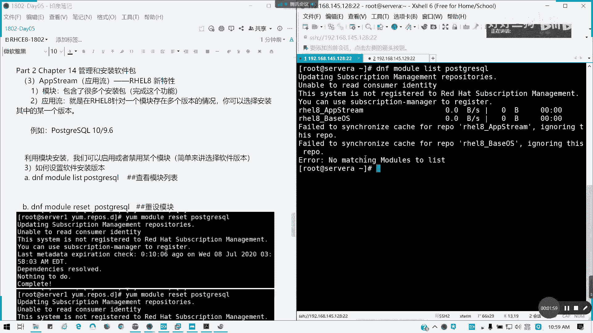

# Redhat红帽 RHCE8.0认证体系课程 - P31：27_Video_Day05_RH124_Ch14a_软件包管理2_模块化安装 - 好好好二狗 - BV1M3411k77W

来看看啊，14章我们是不是都作为一个部分没讲，就是一个应用流，应用流，也就是简单说就是我们的一个模块化安装，这块的话是八点版本输出之后啊，我我们的rap更新之后的一个特性啊，在七点是不支持这个特性的啊。

懂我意思吧，然后呢我们通常呢我们是应用流，是通过模块就安装模块的话，它模块里面包含了很多的安装包，那应流什么意思呢，我们这里红帽八是有个叫应用流的一个概念，那应用流呢就是在我们的红帽八里面。

针对一个模块存在多个版本的情况。

针对承认存在多个版本的情况。

我们是可以选择安装其中的某一个版本啊，特别是我们考虑到一些像应用的兼容性，版本的兼容性问题，是不是，有时候我们默认它可能会安装一些高版本，对不对，安不安装高版本，然后有时候我们需要低版本情况下怎么办呢。

在我们的那个module啊，我们引入了我们dnf的module模块之后呢，model我们的应用流呢模块安装应用流的话，我们就可以解决这个问题了，比如说我们的postscript啊。

我们可以用要用dnf啊，model model list，然后post script，比如说我们的那个pose quare circuit，我们用这个例子，诶框死gray。

等下，b o s t g r e。

我这个好像那个哦，我这个rap好像有问题，我等一下cv 30，这个牌好像没挂上。

有了刚才我是那个盘没挂上啊，这里的话就只能说这个问题，像我们的postgrade circle呢，我们这里会看到，它有两个版本，一个是十对吧，一个是十点，一个是9。6，然后它有对应的配置文件。

然后后面带d是默认安装的一个版本，它的前面是软件名，然后后面是留留的，意思就是一个版本控，版本号对吧，版本控制，然后是否是默认安装的一个选项，对吧，十人9。6，那我们的话可以通过启用。

或就某个模块来进行一个应用流的控制，简单来说就是选择软件版本，我们简单理解啊，这model模块其实它的引出的话，就是为了方便我们选择版本用的，那如何设置我的版本呢，首先刚刚才我们列出一个。

我们需要设置应用流的一个软件包，后面是跟具体的，我们这里用postgresql做例子，因为他刚好有两个版本，一个是一个9。6好吧，然后呢，接下来我要进行一个模块的重设，就把它原来设置重新设。

重新设置一遍，然后我们才能选择版本，要啊dnf啊，要么样本可以dnf model reset，然后面whole gra sql跟软件名跟人报名，那么这里的话已经重设完毕了，如果你改过版本。

它会帮你重设默认的值，现在nothing to do哈，就是说我们这里已经是原来的默认设置，我们就不需要了，然后呢，接下来我们要设置应用流啊，就我们要把那个df model enable。

我们要启用完的另外一个流e n a b l e，我看看是应该是先禁用再启用，我试一试啊，我看一下disable，杠y，怎么写呢，后面怎么写呢，冒号后面给我们留，也就是我们的版本，我先看先进用一下十。

我看有没有用啊，然后呢我们再启用一下9。6，我们首先啊先禁用啊，禁用当前的默认值，the post square circute，十的应用流，这是第c步啊，颠颠的f，module disable。

杠y post script circle，十冒号啊，记得我们反应流后面是跟冒号的，我这里截一下图，翻过来，然后我们再启用我们的那个9。6的版本，在这下面啊。

你看这个version 9。6已经是起来了，对不对。

就是它是进入整个啊，它进入整个，然后我们把它进入9。6，然后我们再list第一遍。

你再练习一遍，看看现在的情况，我默认没有设。

但是我们现在已经启用了一个9。6啊，这里变成了一个一对吧，一一代表什么，一for enable啊对吧。

第一是default。

我们再次查看啊，再次查看我们的一个模块列表，验证新，指定的应用流，有没有启用啊，然后我看一下有一个module，我看一下default这个选项有没有，我看一下怎么去set def哈。

对我们的一个如何设置disable enable，这个有了default，这个好像是没办，我看下好像是没有那个，好像是没有这个选项的啊，那没关系，那没关系没关系，我们现在已经设置完了。

那我们就进行一个模块安装，模块安装的话，我们就现在我们用模块安装的话，模块安装，那就可以等一下我这里的话我要重新截一下图，刚才那个图好像不见了，再次验证，我们已经启用了一个9。6啊，9。6的一个应用流。

就低版本的低版本的啊，然后呢我们来试一下，我们用那个模块安装，那我们如果是进行模块化安装啊，模块安装，我们看一下模块安装怎么装呢，我们就不能普通用，就不能普通，直接颠就颠f insl了。

我们就用module install啊，module前面加用模块化安装，然后杠y，postgrade，circle，那我们安装了看看是什么版本啊，9。6的，对不对，看到没有，我们的应用流是不是切到9。

6了，那这样的话，就是相当于我们可以选择我们的版本啊，我这里截个图，就这里就很清楚了，我们的postgra啊，postgre这个版本已经前成功的切换到了9。6，它就不会按照我们十点的版本就安装了。

对我们的server，包括我们的server啊，对不对，postgresql server，还有我们的我们的依赖关系，对不对，依赖关系这一块的话，它就不会按照我们的默认的十版本就安装了，它按照我们9。

6去安装了，懂我意思吗，那我们其实副总小结来说，小结一下就是我们的一个步骤啊，模块化安装步骤也就是下面这四四步啊，所以大家可以现在有时间的话，找一下我们的一，列，出一下。

我我们的一些可以选应用流的一些软件包，试一下，进行模块安装，所以的话我们14章的话，就加这么一个新特性的内容，在七版本以下是没有这个的对吧，没有这个八点才有选择吧，我们简单来说就是我们选择需要的版本。

需要的软件版本啊，因为特别是在企业环境里面，有些新版本可能不被支持，对不对，有有有些那个我还是用姜还是老的辣，特有些配上那个环境啊等等，这些我们不用太轻的客户端和服务端，那有时候我们怎么选选择版本呢。

module我们的应用，我们的模块化安装，我们的应用流可以帮到我们，那这一块讲完，如果没问题，请打14，然后呢大家做一下这个用流千万个练习，给大家十分钟时间，然后待会我们讲15章。

