# Redhat红帽 RHCE8.0认证体系课程：P31：27_Video_Day05_RH124_Ch14a_软件包管理2_模块化安装 🧩

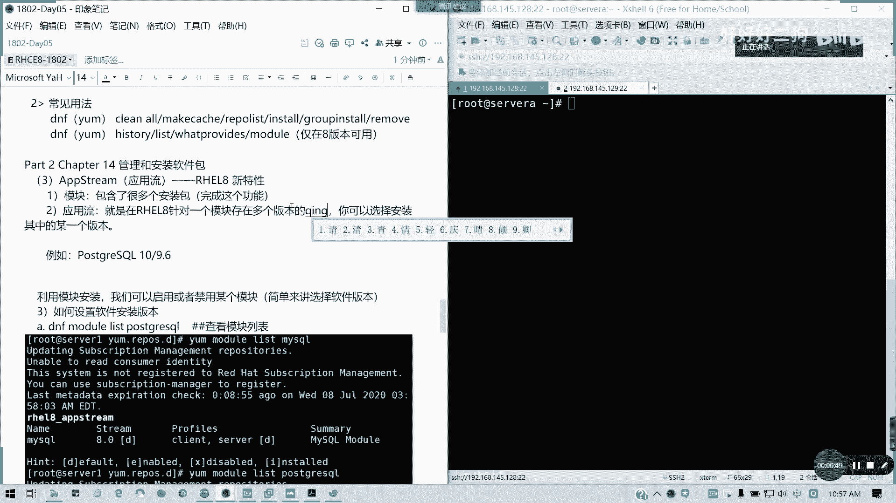

## 概述
在本节课中，我们将要学习红帽企业版 Linux 8 中引入的一个新特性：**模块化安装**，也称为**应用流**。这个特性允许我们为同一个软件包安装和管理多个版本，这在处理应用程序兼容性问题时非常有用。

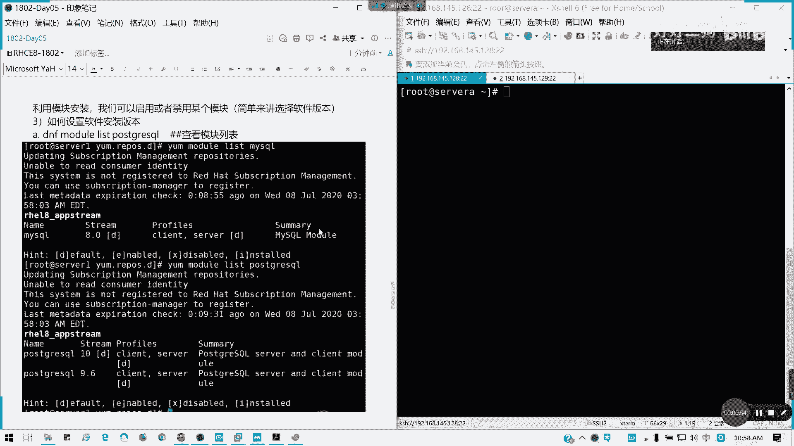

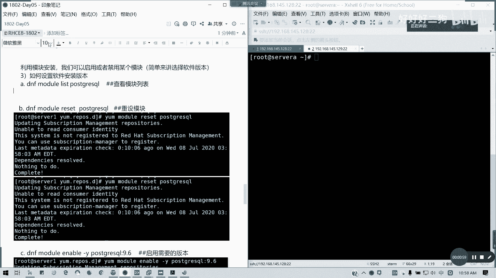

## 什么是应用流？🤔
上一节我们介绍了基础的软件包管理。本节中我们来看看模块化安装的核心概念。

在红帽8中，**应用流** 是针对一个软件模块存在多个可用版本的情况而设计的。这解决了在红帽7及更早版本中不支持的特性。简单来说，应用流就是通过模块来选择和管理软件的具体版本。

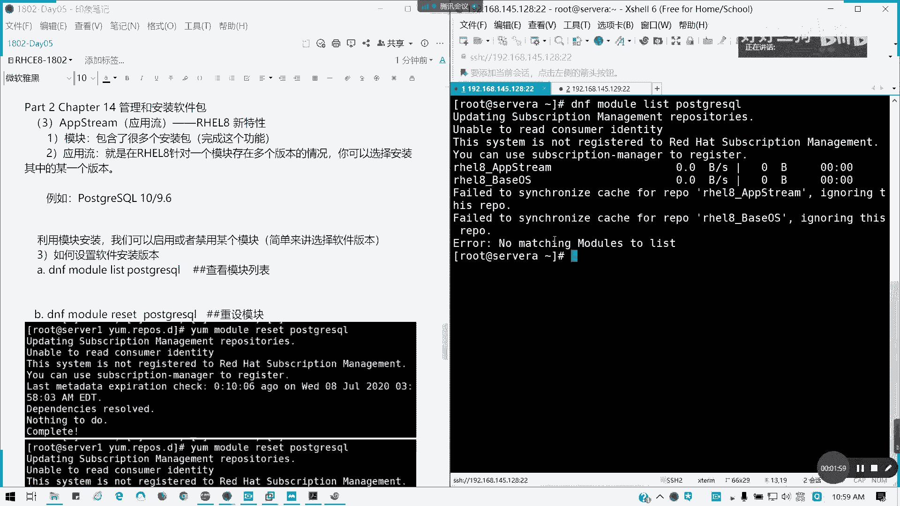

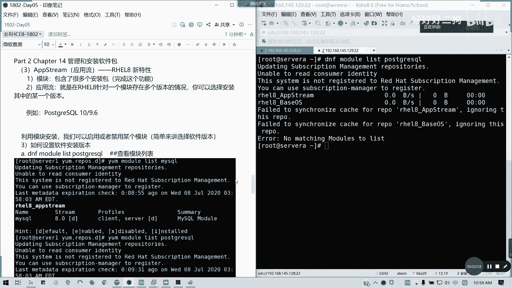

## 查看可用应用流
以下是查看软件包可用应用流（即版本）的步骤。

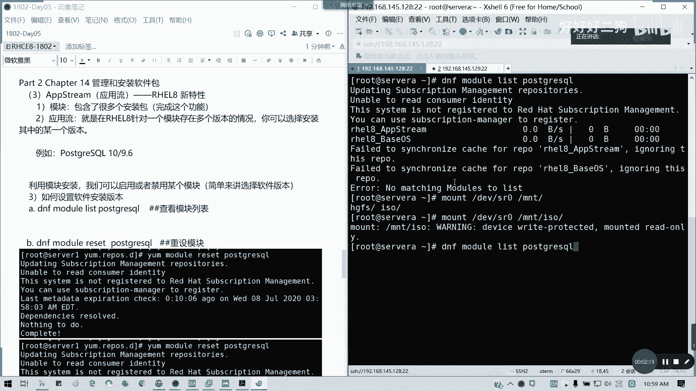

首先，使用 `dnf module list` 命令来列出特定软件（例如 PostgreSQL）的可用模块和版本。

```bash
dnf module list postgresql
```

执行命令后，你可能会看到类似以下的输出，表明 `postgresql` 模块有两个可用的应用流（版本）：`10` 和 `9.6`。其中标记为 `[d]` 的表示默认安装的版本。

```
postgresql    9.6    [d]     common [d]     PostgreSQL server and client module
postgresql    10              common [d]     PostgreSQL server and client module
```

## 管理应用流版本
在了解了可用版本后，我们可以开始管理它们。这个过程通常涉及重置模块、禁用当前流，然后启用目标流。

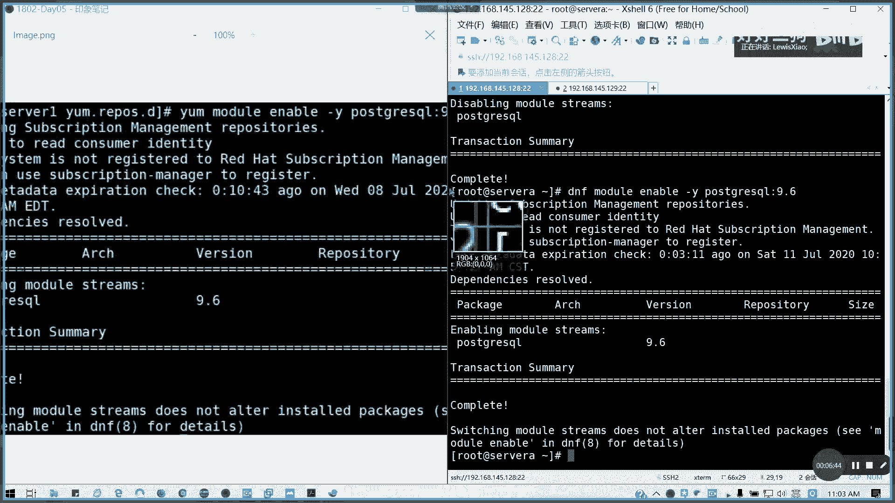

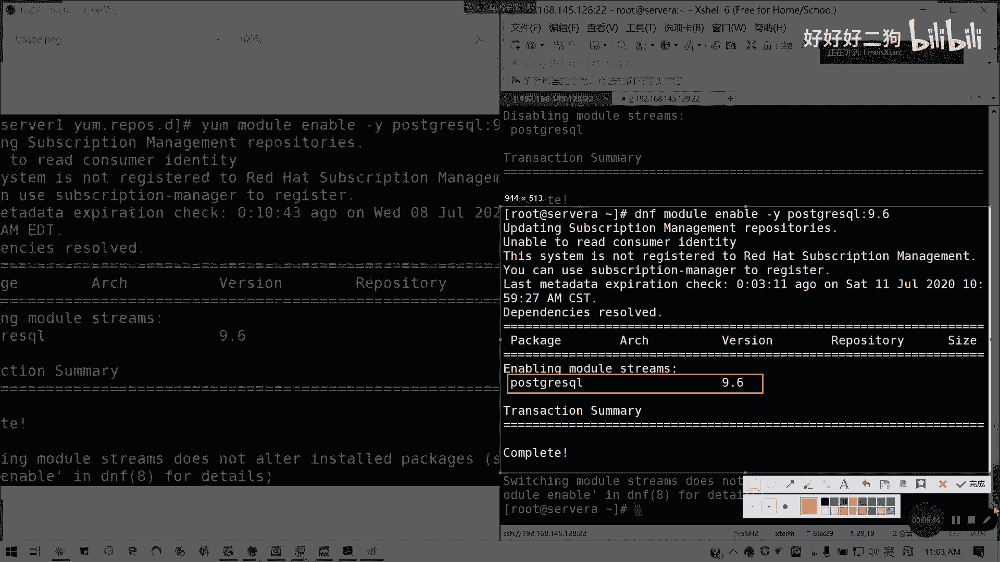

以下是管理应用流版本的具体步骤：

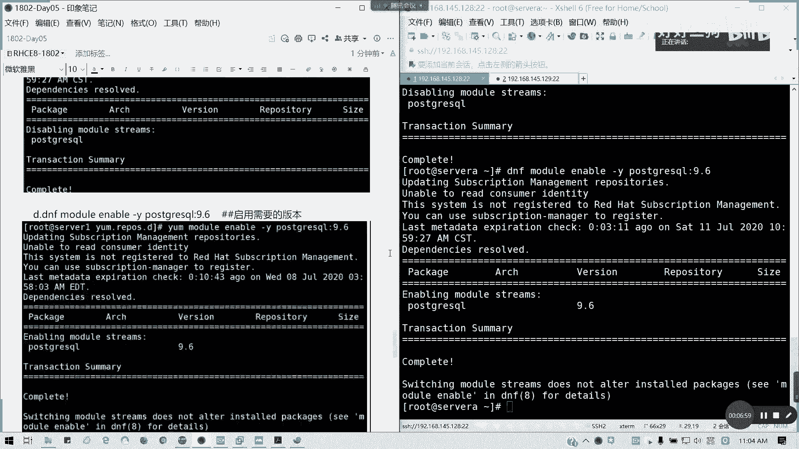

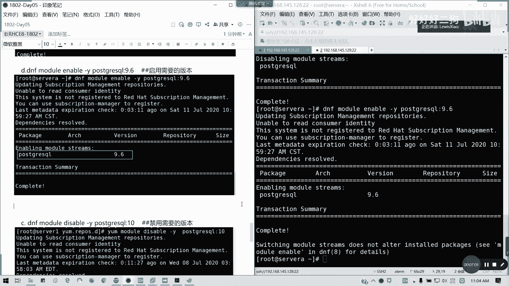

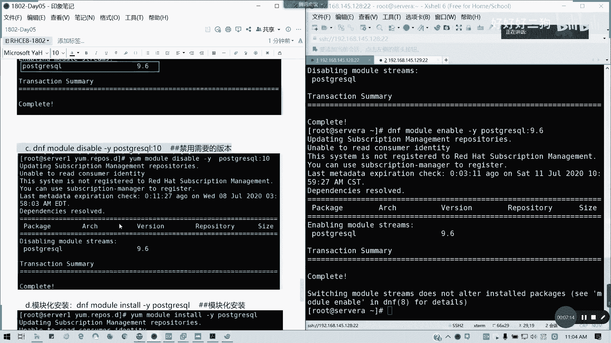

1.  **重置模块**：首先，重置目标模块到其原始状态。如果之前修改过版本，这个命令会将其恢复。
    ```bash
    dnf module reset postgresql -y
    ```

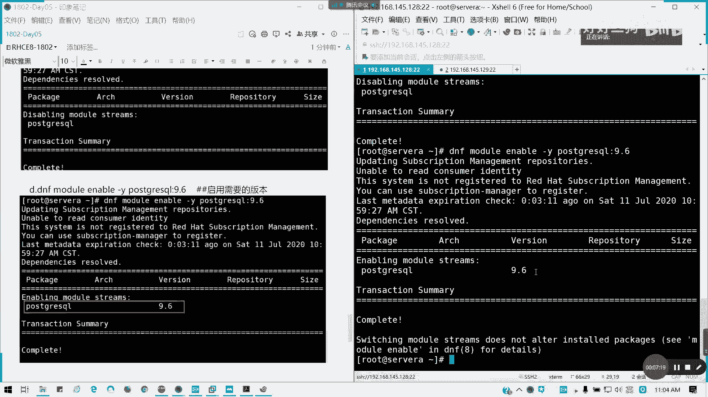

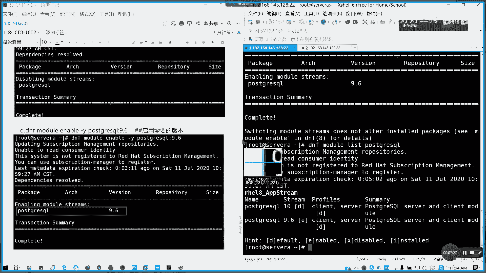

2.  **禁用当前应用流**：假设默认是版本10，我们先禁用它。
    ```bash
    dnf module disable postgresql:10 -y
    ```

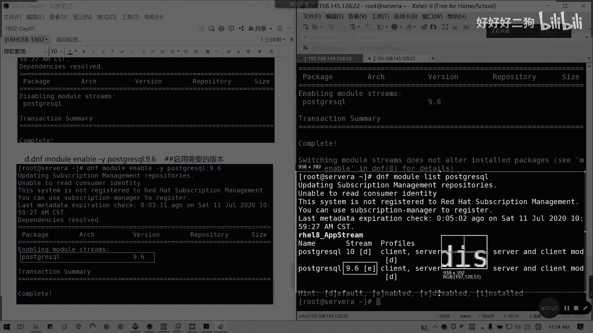

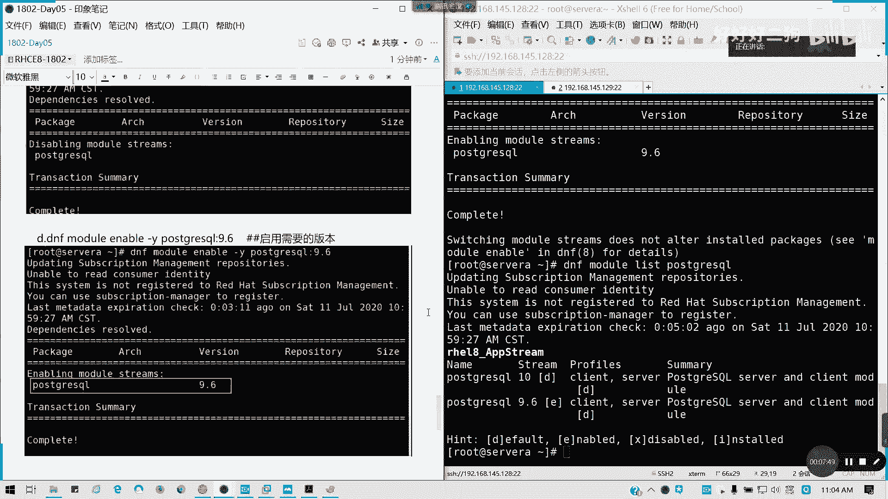

3.  **启用目标应用流**：然后，启用我们想要的版本，例如 9.6。
    ```bash
    dnf module enable postgresql:9.6 -y
    ```

4.  **验证更改**：再次列出模块，确认目标应用流已被启用（标记为 `[e]`）。
    ```bash
    dnf module list postgresql
    ```

## 进行模块化安装
设置好目标应用流后，就可以进行安装了。模块化安装需要使用特定的命令。

现在，使用模块安装命令来安装软件。这会根据我们启用的应用流（9.6）来安装对应版本的软件包及其依赖。

```bash
dnf module install postgresql -y
```

安装完成后，系统安装的将是 PostgreSQL 9.6 版本，而不是默认的 10 版本。这确保了软件版本符合我们的特定需求，例如为了兼容旧的应用程序或环境。

## 总结
本节课中我们一起学习了红帽8的模块化安装（应用流）特性。我们了解到，通过 `dnf module` 系列命令，可以列出软件的多个版本、重置模块状态、启用或禁用特定的应用流，并最终安装指定版本的软件。这个功能在企业环境中非常实用，能够帮助系统管理员灵活地管理软件版本以满足不同的兼容性要求。