# Redhat红帽 RHCE8.0认证体系课程：P33：文件归档及传输

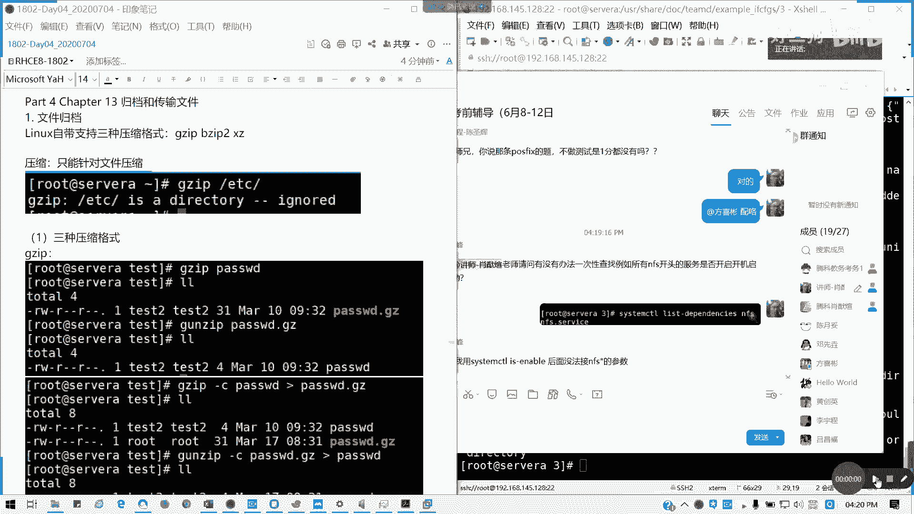

## 概述
在本节课中，我们将要学习Linux系统中的文件归档与传输。我们将首先了解如何使用`tar`命令结合不同压缩格式来打包和压缩文件及目录，然后学习如何使用`scp`和`rsync`命令在服务器之间安全、高效地传输文件。

---

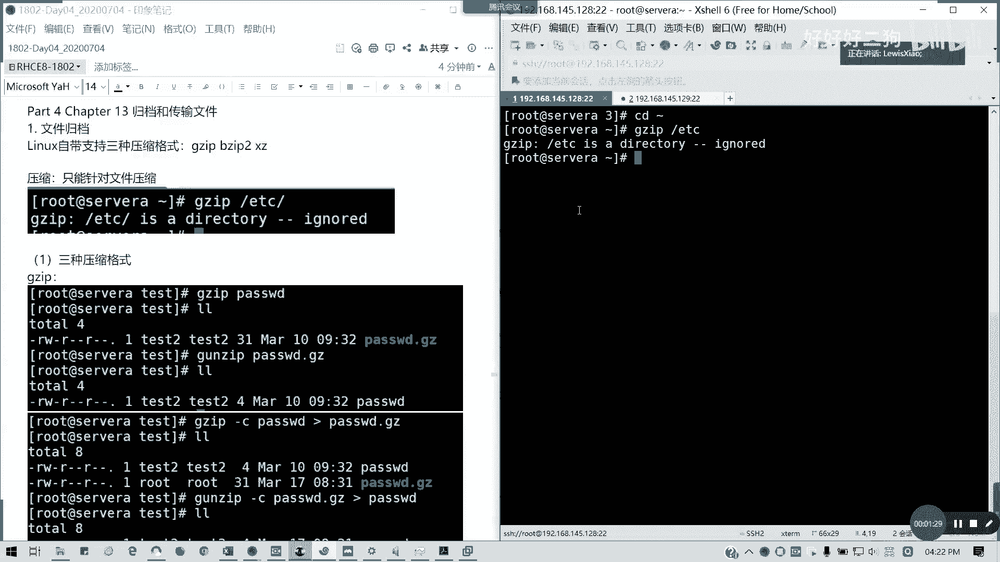

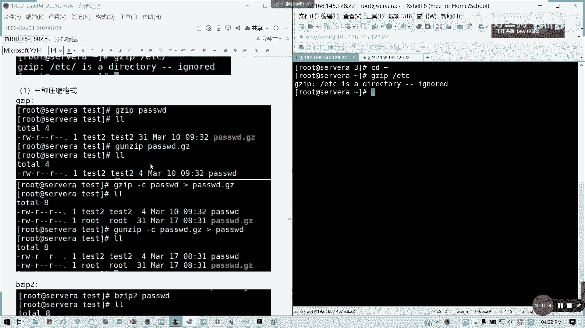

## 文件归档

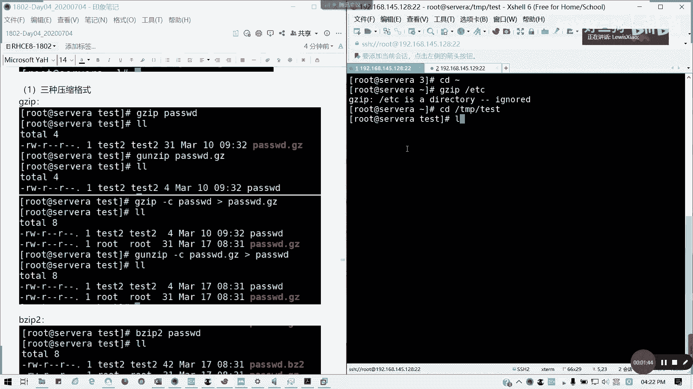

上一节我们介绍了网络聚合的几种模式，本节中我们来看看如何管理文件。Linux系统自带支持三种压缩格式：`gzip`、`bzip2`和`xz`。但这三种工具通常只能对单个文件进行压缩，无法直接压缩目录。

### 压缩工具的基本用法
以下是三种压缩工具的基本操作示例。

**1. gzip 压缩与解压**
`gzip`命令用于压缩文件，`gunzip`命令用于解压。
```bash
# 压缩文件，原文件会被替换为 .gz 文件
gzip passwd2

# 解压文件
gunzip passwd2.gz

# 压缩时保留原文件
gzip -c passwd > passwd.gz

# 解压到新文件，不覆盖原压缩文件
gunzip -c passwd2.gz > 23
```

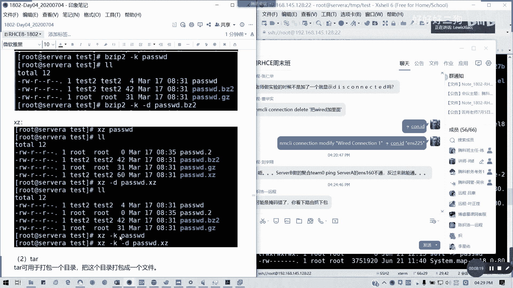

**2. bzip2 压缩与解压**
`bzip2`命令用法与`gzip`类似，压缩率通常更高。
```bash
# 压缩文件
bzip2 passwd2

# 解压文件
bunzip2 passwd2.bz2

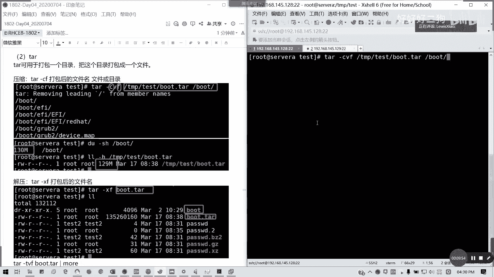

# 压缩时保留原文件
bzip2 -k passwd2

# 解压时保留原压缩文件
bunzip2 -k passwd2.bz2
```

**3. xz 压缩与解压**
`xz`命令提供最高的压缩率，但压缩速度较慢。
```bash
# 压缩文件
xz passwd2

# 解压文件
unxz passwd2.xz

# 压缩时保留原文件
xz -k passwd2
```

### 使用 tar 进行归档
`tar`命令可以将多个文件或目录打包成一个归档文件，并能结合上述压缩格式，是实际工作中最常用的工具。

**基本语法结构**
`tar`命令的基本选项包括：
*   `-c`：创建归档文件。
*   `-x`：解压归档文件。
*   ̀`-t`：列出归档文件的内容。
*   `-v`：显示详细过程。
*   `-f`：指定归档文件名（必须放在最后）。
*   `-z`：使用`gzip`格式压缩/解压。
*   `-j`：使用`bzip2`格式压缩/解压。
*   `-J`：使用`xz`格式压缩/解压。
*   `-C`：解压到指定目录。

**常用操作示例**
以下是`tar`命令的一些典型用法。

1.  **打包目录（不压缩）**
    ```bash
    tar -cf boot.tar /boot
    ```
    此命令将`/boot`目录打包成名为`boot.tar`的文件。

2.  **打包并压缩（使用gzip）**
    ```bash
    tar -czf boot.tar.gz /boot
    ```
    此命令将`/boot`目录打包并用`gzip`压缩。

3.  **查看归档文件内容**
    ```bash
    tar -tvf boot.tar.gz
    ```
    此命令列出`boot.tar.gz`文件内的所有文件和目录，而不实际解压。

4.  **解压归档文件**
    ```bash
    # 解压到当前目录
    tar -xzf boot.tar.gz

    # 解压到指定目录
    tar -xzf boot.tar.gz -C /usr/local
    ```

5.  **排除特定文件后打包**
    ```bash
    tar -czf boot2.tar.gz --exclude=config-4.18.0 /boot
    ```
    此命令打包`/boot`目录时，排除名为`config-4.18.0`的文件。

6.  **从归档中提取单个文件**
    ```bash
    tar -xzf boot.tar.gz --extract boot/grub2/grub.cfg
    ```
    此命令仅从`boot.tar.gz`中解压出`boot/grub2/grub.cfg`这一个文件。


---

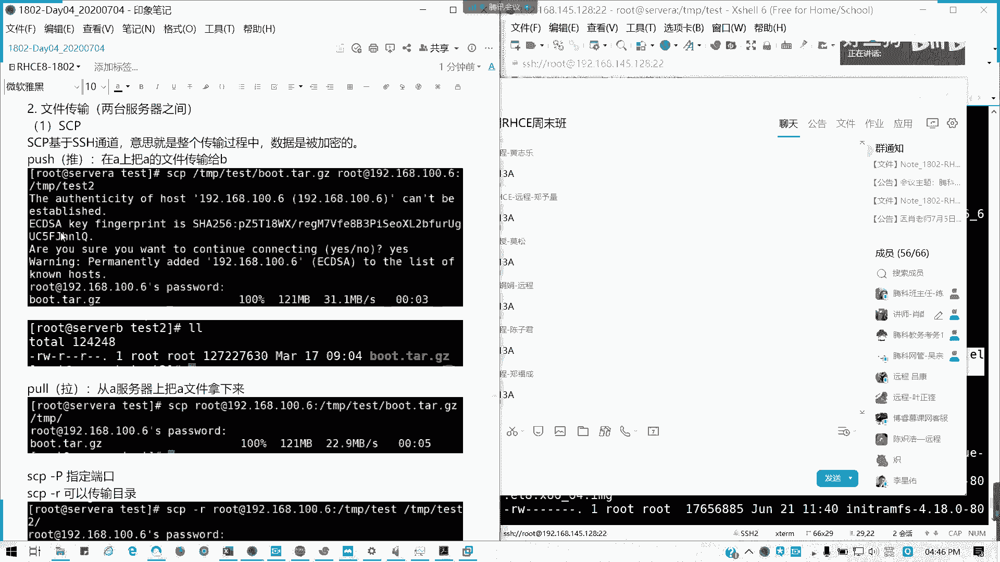

## 文件传输

掌握了文件归档后，我们常常需要在不同服务器间移动这些文件。本节介绍两种基于SSH的安全文件传输工具。

### 使用 scp 传输文件
`scp`（secure copy）通过SSH加密通道传输文件，支持推（上传）和拉（下载）两种模式。

**基本语法**
```bash
scp [选项] <源文件路径> <用户名>@<远程主机>:<目标路径>
scp [选项] <用户名>@<远程主机>:<源文件路径> <本地目标路径>
```

**常用操作示例**
以下是`scp`命令的典型用法。

1.  **将本地文件推送到远程服务器**
    ```bash
    scp /tmp/test/boot.tar.gz root@192.168.145.129:/tmp/test/
    ```
    此命令将本地的`boot.tar.gz`文件复制到远程服务器的`/tmp/test/`目录下。

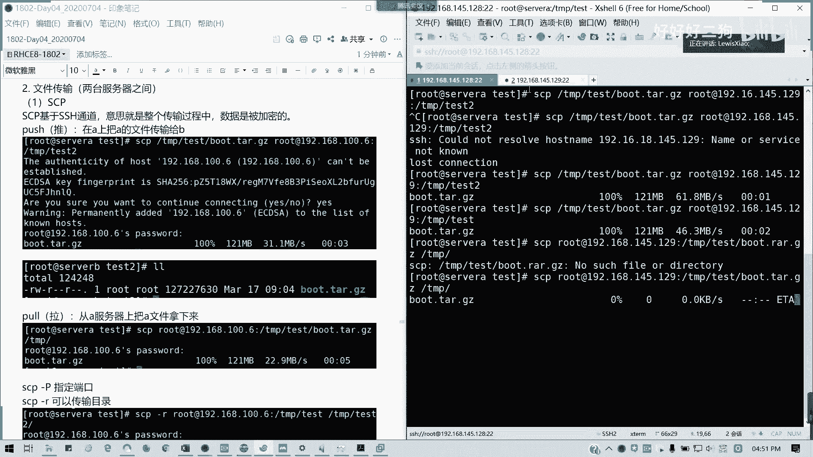

2.  **从远程服务器拉取文件到本地**
    ```bash
    scp root@192.168.145.129:/tmp/test/boot.tar.gz /tmp/
    ```
    此命令将远程服务器上的文件拉取到本地`/tmp/`目录。

3.  **递归传输整个目录**
    ```bash
    scp -r /tmp/test root@192.168.145.129:/tmp/test3
    ```
    使用`-r`选项可以递归复制整个目录。

4.  **指定SSH端口**
    ```bash
    scp -P 2222 /tmp/test/file root@192.168.145.129:/tmp/
    ```
    如果远程SSH服务不在默认的22端口，使用`-P`选项指定端口号。

### 使用 rsync 进行同步
`rsync`（remote synchronization）是一款强大的增量同步工具，它只传输发生变化的文件部分，效率极高，常用于备份和镜像。

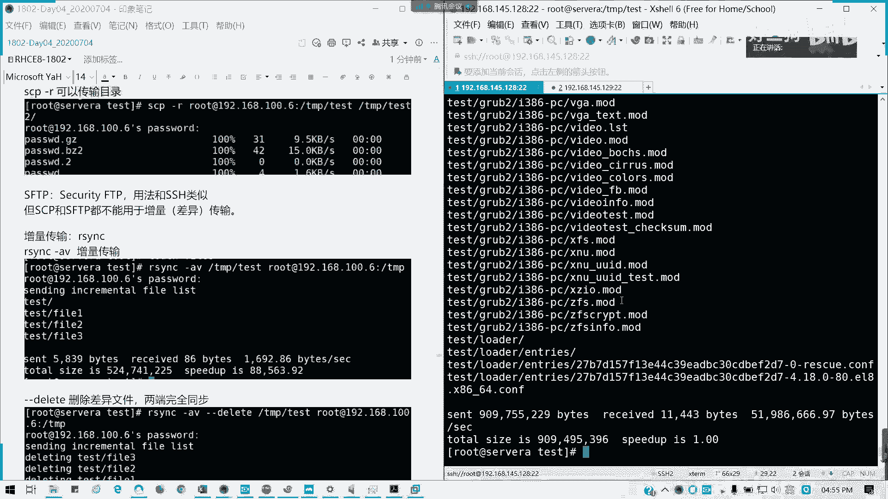

**基本语法**
```bash
rsync [选项] <源路径> <用户名>@<远程主机>:<目标路径>
rsync [选项] <用户名>@<远程主机>:<源路径> <本地目标路径>
```

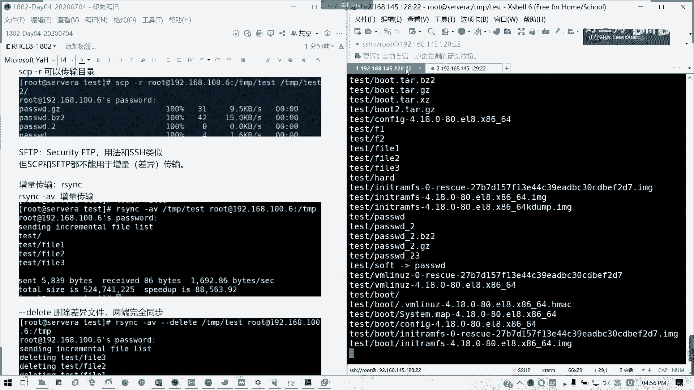

**常用操作示例**
以下是`rsync`命令的典型用法。

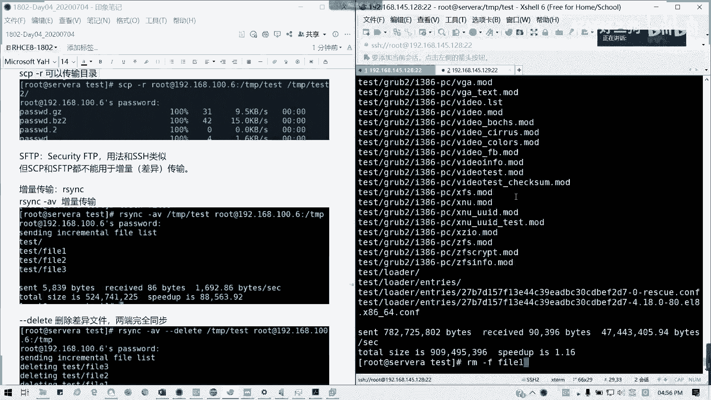

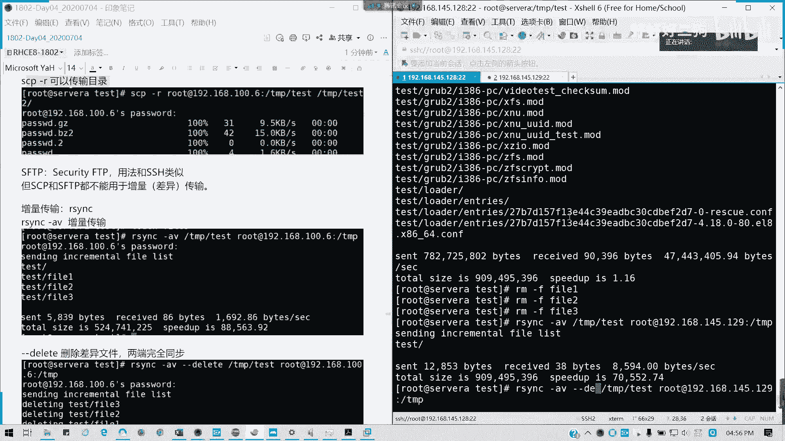

1.  **增量同步目录到远程服务器**
    ```bash
    rsync -av /tmp/test/ root@192.168.145.129:/tmp/test3/
    ```
    `-a`选项代表归档模式，保留所有文件属性；`-v`显示详细过程。此命令将本地`test`目录的变化同步到远程。

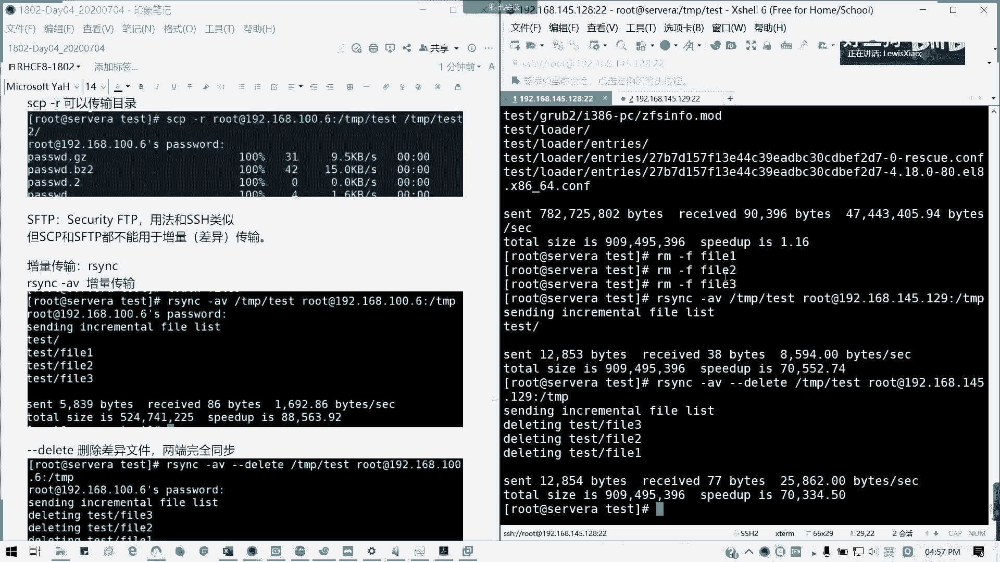

2.  **使目标与源完全一致（删除多余文件）**
    ```bash
    rsync -av --delete /tmp/test/ root@192.168.145.129:/tmp/test3/
    ```
    添加`--delete`选项后，`rsync`会使目标目录的内容与源目录完全一致，删除目标端存在而源端不存在的文件。

3.  **干跑测试**
    ```bash
    rsync -avn /tmp/test/ root@192.168.145.129:/tmp/test3/
    ```
    使用`-n`（`--dry-run`）选项可以模拟执行过程，显示将会同步哪些文件，而不进行实际传输。

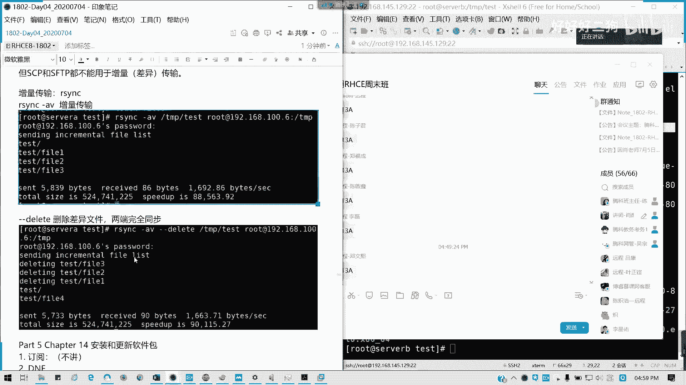

---

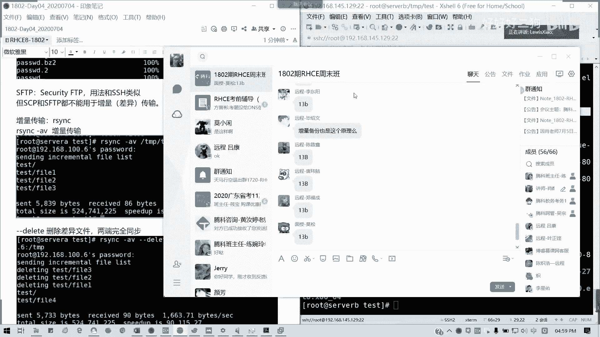

## 总结
本节课中我们一起学习了Linux下的文件归档与传输。
*   我们首先回顾了`gzip`、`bzip2`、`xz`这三种基础压缩工具，它们适用于单个文件。
*   然后重点掌握了`tar`命令，它能够将多个文件或目录打包，并灵活结合三种压缩格式，是管理归档文件的核心工具。
*   最后，我们学习了两种网络文件传输工具：`scp`用于简单的加密文件拷贝，而`rsync`则凭借其增量同步能力，在需要频繁备份或同步的场景下更为高效。
熟练掌握这些命令，对于系统管理、数据备份和迁移工作至关重要。