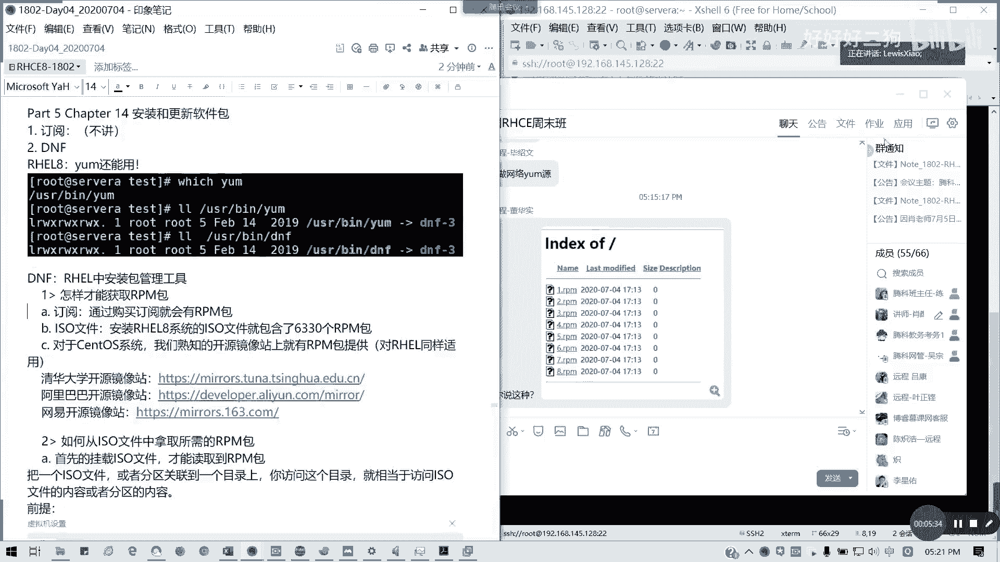
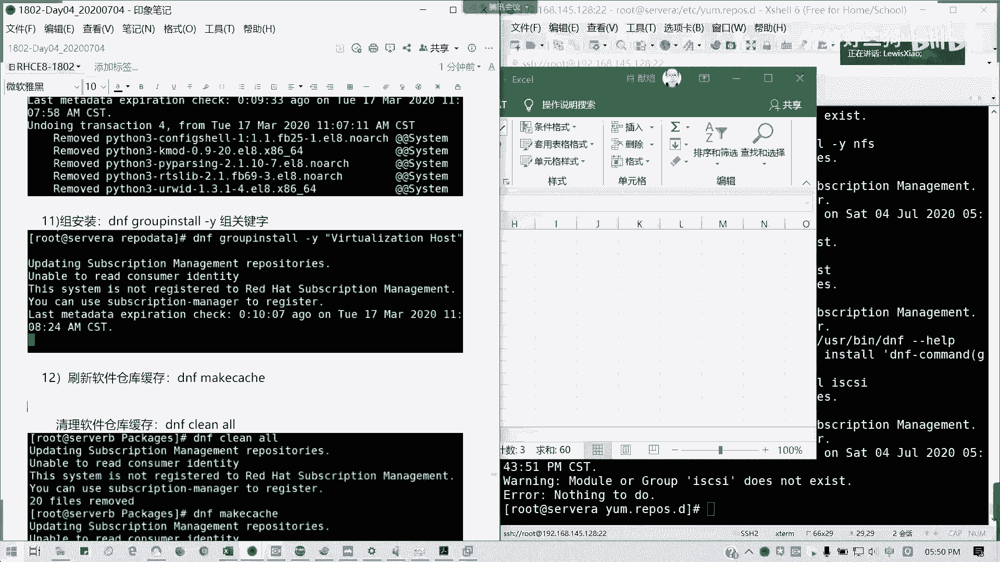

# Redhat红帽 RHCE8.0认证体系课程 - P34：25_Video_Day04_Ch14a_软件包管理1_RPM及DNF - 好好好二狗 - BV1M3411k77W

接下来我们讲14张软件包啊，软安装和更新软件包，这个的话这部分知识跟随着整个红帽的体系啊，无论如何，你这块的话，你考试的话肯定是要跟他打交道，他没有做专门去做一道题，最多就是软件仓库。

这样要求你做一个软件仓库而已，但是他不会说专门去考取这个东西，但是这是是正是伴随你的，所整个红帽的一个东西，因为你只有软件包的话，你才能装东西，对不对，首先订阅我不讲，因为订阅的话收钱的呀，对不对。

红帽订阅是收钱的，我们就教给大家一些免费的方法好吧，为这个我不讲，接下来我们简单提一下dnf，dnf不是地下城勇士的dnf啊，也不是毒奶粉啊，我是俗称，可能如果你们记得哈，要毒奶粉。

然后呢这里呢我们在红帽八里面，我们是不是以前我们是有一个样本的工具，对不对，要么圆，其实在八里面样还能用哈，这样的话user并让你为我们看一下什么什么鬼啊，它要是一个软链接，软链接指向dnf杠三对不对。

它是一个软链接，包括我们dnf也是一样，所以的话我们在红帽八里面要么工具，要么我们的小黄狗啊，全面升级为dnf软件包的一个部署，一体化的一个工具啊，我们红帽中的软件包管理工具，我们主要了解这几点。

第一个我们知道，我们要知道怎么样才能获取到我们的rpm，我们的软件包，当然了，第一个你花钱了对吧，通过购买订阅啊，通过购买订阅你可以啊，就会有啊，这个是花钱的做法，第二种我们的光盘对不对。

我们的iso文件是不是本身已经含有软件包了，对吧，我们说我们光盘里面已经有6000多个了，6000多个了，这个也是可以直接在用的，新的版本，好像8。2已经达到了8000多个8200吧对吧。

他软件因为它的光盘也大了8g2 ，8。2g我记得是，然后呢对三tos系统的话，我们熟知的开源镜像站里面，就有我们的rpm包啊，rpm包去提供，比如说像我们的清华大学是吧。

我们清华大学开源镜像站是吧，里面的这些开源的东西我们都可以拿来用，对不对，像我们熟知的像centre vs里面，它因为它是一个社区版，社区版的话，它基本上像八的话，我不知道他他会不会像内在最新的是8。

2，2004啊，像八的话，它里面就有一大堆啊，我们可以用熟悉软件包，可以使用到这里，好像很慢的样子，然后还有0。8里面，就像我们的那个base os跟dream就是两，其实他这里有个ref data。

对不对，我看下有没有ref data。

是不base里面就是有个report data的，我记得，x8664 os。

到这里的话，我看一下啊，他这里就是相当于我们有一个样源在啊，但是我这里看不到他的微博data文件，没事呃，还有呢就是那个阿里云开源镜像站对吧，我们都可以开发者社区，我们也可以拿来用。

那set tos镜像他教你一个方法了，就怎么去使用我们我们的r里面的样源，对不对，直接可以下载的，对不对，就刚才你那个不是啊，不是我不是说这种啊，他这个12345678，我的样源呢。

你说rpm包这里还有一个关联文件啊，就我rap文件，它的一个就他的一个依赖关系这个东西啊，所以的话我们要说的是这种啊，像阿里云他直接教你啊，像清华其实也有啊，像清华大学他的ta里面也有。

教你说怎么样去设置我们的一个亚目源啊，但这ctos他已经有告诉你是怎么做的，然后呢还有一个就是我经常去的网页，对啊，网易开始这样站，然后具体到我们自己具体去找它，它一个版本，对不对。

找他的一个什么样别的一个版本，主要是report data，下面瑞托beta跟那个package，上一期目录就可以做它的样源了，他的这是5号的完整，它的相对路径啊，我们要写它的完整路径，这三个是常用的。

但国外的话，这是三个是国内比较多。

用的多的一个开源镜像站，但是前提你是要网络支持的，懂我意思吧，那我们现在教大家如何从我们的iso文件里面拿，我们的rpm，相当于我们一个免费的方式，好来，我现在呢我这里啊。

我是虚拟机，我这边我挂一个镜像啊。

我这边挂一个镜像，然后呢我教大家如何去配啊，这里我心态其实已经挂了的，大家可以如果没有的话，可以挂一下。

我自己挂的是八点的好，那我现在的话我如何去获取，我现在我可以去创建一个，我这有个iso，对不对，我看一下mt so，这个我上次不是挂过了吗。

对啊，挂载我这里已经挂过了，所以如果没有的话，你们就自己创建一个挂，创建一个那个文件夹，然后把光盘挂载过去，挂载的命令就是我这里的md vs 20，然后挂载到mt的具体的一个目录，在这里的话。

我不是挂载了，对不对，它有个base os跟那个app dream是吧，那我们可以看到啊，iso里面的base，os里面package 1661个，就很多的包啊对吧，1600多个包。

然后f dream也是一样，你看都是吧，只不过八点呢，它是把系统底层用的软件包，以及我们的应用这一块软件包，它把它拆开了，原来七的话是合并在一块的对吧，所以八的话我们要做两做。

一个软件仓库里面有两个指向，像以前的我们七点镜像的话，是没有best os跟f g这两个目录的，知道吧，以前的话全部都在一个叫做package里面，现在有分，以前没有啊，对于我们的那个。

对于我们的这个红帽而言啊，它的一个包啊，我看一下背诵s，我给他讲解一下包的格式，package，我l l l一个叫做athlas这个包，我们可以讲解一下这个包它的这个包啊。

rpm就是一个可以红帽编译过的，一个可用于安装或更新的一个软件，包的一个的一个啊，还有一个文件，然后它名字是什么含义呢，会告诉大家，首先这一块它是一个包的名字，也就是我们软件的名字有疑问要问吗。

然后呢可以看到啊，这里3。一点点三，它是一个包的一个版本信息，报的一个版本信息，它的版本号是吧，3。10。3，好像后面杠六是它的修订版本修订版本，然后呢后面的1l8 是他的那个证明。

他是red hat enterprise linux，也是红帽企业版八用的包，明白我意思吗，后面的x86 下划线64呢，就证明是他的一个架构，64位，从红帽七开始，有没有发现红帽七开始。

他不再发行32位版本，不再发行32位版本，所以的话他所有的红帽相关的，他还有i a64 对安藤版，但是我们在x86 上面，通常就是x86 杠64，然后rpm呢就只表明它是一个软件包，打包好的了。

明白我意思吗，这个这个软件包的一个名字的解释可以明白不，那如何安装我们的rpm包啊，rpm包我们两种方式，第一种是用原生的一个叫rpm的工具，rpm啊，rpm呢有个问题。

就是他没办法解决包与包之间的依赖关系，因为它只一次只能装一个对吧，有时候我装b的时候，我a要先装，那我是不是要先装a然后再装b，就就a依赖于b嘛，你哦不错，我我应该这么讲，a依赖于b的话。

那a帮我安装之前是不是要把b帮我安装好，对不对，它包与包之间就是我的环境之间，它有是有依赖我和关系的，如果你缺少哪个包都缺少了，比如说我a跟b有液态关系，我b没安装a是不是装不了，对不对。

所以呢他这种安装包工具的话，它不提供依赖解决的方案，所以的话你必须一个一个手工来，比如说哎我示范一下就知道了啊，rpm gui v h，这是安装的一个命令，然后直接三把4。9是吧。

它会提示你说fail the dependences，我下面的这些包我都没装对吧，当我下面的那个是有四个包没有装，那我这个300是不是装不了，对吧，然后我要一个个把它装完，明白我意思吧，我一个把它装完。

我才能装，比如说唉，那我不要说a b f a t t r，这个包好像没，貌似没有啊，他应该是在那个seer common tools里面，summon tools，你也装不了，因为他少了一个lab。

你开个lib库，对不对，sample lisa，知道怎么用的吗，它是用来共享的，就是c i f s文件系统，相当windows的那个文件共享这种功能，我要先装这个samber life。

再装samber tools，然后最后再把samber给装上，所以你用rpm会很麻烦，对不对，会有麻烦，它会提示你一层层的他a b c3 个环相扣，先装c再装b，后面再装a。

但是其实虽然他这个工具啊只装一个包，而且不能解决我们依赖关系，但是他在查询或单包安装设备，还是有一定的优势的啊，比如说我要查询已经安装的包，那我们rpm有个命令啊，rpm杠qa，然后grape截取啊。

我们这个命令会在15章讲到grape，然后我们的猫的关键字，比如说h t t p d，是不是我可以把所有http d，我已经安装的包列了出来，杠q query，杠a是o懂我意思吗。

query查询q u e r y懂吗，or是a是o嘛，他把呃或者是available也是可以的，或者是显示available也是可以，就是我已经安装完的，我的跟他有关的包全列出来，阿p管q a。

然后呢我们要查询这个包的安装的目录，我们可以用ql list列出来啊，列出来他的那个，然后后面这里不用不用break了，q a啊，我们查询所有的，然后q d的话，q l的话我们可以这样可以列出所在包。

它的安装目录，安装包的概念，其实就是把一个包，各式各文件的目录结合了安装，就是把它解压嘛，走吧是吧，他这里是不是列出他这个http包地包里面，我解压到哪里，对不对，他这个文件会怎么生成，懂我意思吗。

嗯可以明白吗，就相当于我们windows setb一样，它不是不是我们setup的目的，目的是不是其中一大部分是复制文件了对吧，我们在它们的安装某个软件，就是绝大部分负复制。

然后我们再进行一些初始化配置，那就先这样用软件安装成功了，初始化配置包括像windows的话，像启动项，注册表文件类型等等，linux也是差不多，主要他注册表所有注册表啊，它是写在那个什么环境变量啊。

或者等等这些或者是一些关联的对吧，好q l就讲到这儿，还有呢我要查看配置文件，qc c for configuration啊，consecutify也可以对吧，这个其实拿来查。

你如果不不晓得你安装那个安装包，我装的包软件不是不知道怎么用，那是不是我们r p m一查就出来了，这样我要查http这个相关配置文件，它全部列出来了，对不对，qc啊，还有文档说明，大家帮助啊。

q d是不是user share usr，share doc里面是不是有http d的所有的一个安装，第一所有的说明，对不对，那是不是有时候我们不知道命令怎么用的话，我用rpm杠q d出来。

dod for document，懂吗，就可以列出来所有的文档，那我们就可以可以去看针对的兴趣，看它的用法，假如你拿到一个陌生的包，明白意思吗，d for docuo。

doo doo documentation啊，document也行，还有，安装信息installation或者叫inf，它会列出来这个安装包的信息，安装信息，比如说它的它的安装后的信息啊。

名字版本发行版架构装装日期是吧，就装后安装后的，就相当于列出一个你当前你所安装包的，他的信息全部在哪里，懂吗，这个i fin f，还有一个提供者，就他的那个安装包的具体文件，我可以查安装包的提供者。

就是说我这个文件到底是谁装的，r p m杠q f foundation，它的是哪一个啊，比如说我f s t a b，哦这具体文件啊对吧，我这个fs tab，我们这个挂永久挂载的这个文件呢。

它是由set up这个包提供的，明白我意思吗，然后还有安装包的脚本啊，就是它到底会执行什么操作，rpm杠q cury，然后杠杠script，这也不是杠qs的哈，杠杠secret，然后透明登报名。

就是它会列出来我在装包的，这个装这个软件包的过程中，我到底执行了什么，哪些东西对吧，哪些命令全列出来，还有就是一个导入公钥的一个问题啊，导入公钥的一个问题，这个可以导入红帽公钥。

我们可以进行一个完整性验证，就是杠杠import，然后e t c p p k i，就是我们如果我们要进行那个红帽样，我们的软件仓库的一个完整性验证，我们这里可以导入我们的一个，公钥啊，导致红帽的公钥。

那么在装包的时候我们就可以，它就不会提示了，不会提示说你的公钥不存在又怎么样，然后安装跟更新我讲过了吧，i v h是安装u大u vs是更新，然后呢删除rpm杠一，以raise删除擦除，对吧。

看一下看一下看一下，只删除它的主的，没有删除它相关的一些依赖啊，你试试喽，来error报错了，我，报错了我，还是在啊你要加具体的，所以这个就很麻烦，对不对，我们的rpm在多包安装或删除是很麻烦的。

所以下面我们就讲到一个毒奶粉是吧，dnf也就是我们以前的样，dnf呢会解决我们包与包之间的依赖关系，像我们的rpm里面，是不是它里面我们在b sos里面，我们看一下，它有一个叫rap data目录。

rap data目录，它这个目录里面的内容，他就会帮很多的xml是吧，很多xml文件，它是用来解解决我们的这个包与包之间的，依赖关系的啊，这文件到底怎么写，先不用深究，我们现在要知道怎么用。

那么如取如何读取到这个依赖关系，我们要新建软件仓库，接下来我教大家如何建立本地软件仓库啊，今天的比较重要内容来呃，本地软件仓库之间在哪etc样点records。d，这个是放我们软件仓库的一个目录。

现在有两个，一个叫red headed rap，一个叫hl 8点rap，我们之前应该是建立了一个叫做h e l，八点rapper的一个文件，我再拿出来看一看。

我就不再见了啊，大家如果没有的话啊，如果没有的话，大家可以看一看我们格式怎么写，首先我们用方括号这块，它是一个配置区块，配置区块的话分别代表不同的软件仓库配置项。

他的所有他的一个rapper可以包含多层软件仓库，没有关系啊，然后呢这也代表一个配，就方括号开头的代表一个配置块，然后呢首先我们写什么，第一个我们的软件仓库名，对不对，反正仓库名要写好。

但这只是一个注释，然后呢文昌公民在这里啊，然后这里的话通常我们写个上面一样，然后呢，它的基本url也就是它的软件仓库的读取地址，读取地址呢。

它是一个在package dress跟rapper data的上一层目录，也就是它的它不是要解决你的依赖关系吗，那是他，那我们就是指向下一层，上一层目录就行了，下一层目录不要指到package里面。

到上一层目录就可以了，比如说到就我这里写的，我这里为什么要加fire，因为我用到它的协议，对不对，fia协议是文件协议，读本地的，为什么有三个横杠，因为这里是根懂吗，前面这个是叫文件协议。

然后后面这里从根目录开始写，对不对，写到report data跟package的上一层就连接地址，我必须要同时能够找到这两个目录，懂吗，然后呢，下面的enable等于一证明你的软件仓库是启用的。

记得啊很多人以内部没有d了，很多人在这里露个d，然后结果软件仓库不生效，懂我意思吗，所以这里enable，是吧，已启用等于，但你连着写，像我左边连着写没问题，但是我为了格式美观，我们方便检查。

就是前面的参数空格等于值嘛，那我就这么写会更好，对不对，更加清晰美观，懂我意思吗，然后后面完整性检查，我这边我因为我刚才我导入密钥了，其实你如果导入密钥的话，我可以写完整性的一个就检查了一个地址。

如果没有，请显灵啊。

跳过完整性检查。

然后呢，通常来说我们在红帽八里面还有一个，除了基本系统之外，还有一个应用流，我们照写就可以了，明白我意思吧，记得这个文件名一定要点rap结尾，而且是放在etc re样，点rap，点击这个目录。

懂我意思吗。

我这个我是我自己写的，所以刚才要解决一个本地样品问题，然后如果是远程样源的话，你就把它改成网络地址就可以了，就把这个basil我们改成网络的地址就行了，明白我意思吗，一定要记得啊，要找到package。

report data这两层的目录啊。

如何应用，我们先清理原数据缓存，我这里已经写好了，你们就你们可以自己写啊，这是挂本地光盘的一种形式，如果是像考试环境里面，你挂一个网址，你要会知道怎么知道怎么变啊，就会这http是吧，他给你哪个地址。

你就套哪个地址就行了，然后如果你怕说那个到时会挂得不到，那你就看点进去看，然后一直找到他是不是在里面有rap data，还有package两个目录，懂我意思吗，对如果没有，你切到上一层看看。

然后把这个地址ok的话，把地址，然后把这个地址复制下来，然后贴到我们这个rapper文件里面，然后如何生效，我们这里全部改用dh先等等，我先清理掉我们原来的东西先对吧，切到元数据缓存线，然后重建缓存。

因为他原来的right here，let rapper呢，它是要订阅的，懂吗，他这个是要订阅的，所以它留空嘛，所以一直会提示这句话。

但是我这里我不管他了，因为我们自己有个样本，你看到是不是键已经已经有了，对不对，我本地挂的，然后dnf其实你用样品也没问题，y u m也没问题，因为它是一个软链接对吧。

dnf rap re是不是里面4672+61658，总共有6000多个软件包，是不是，然后如何安装呢，dnf install杠y，比如说我装一个s的，他给cli，我装这个装这个target的这个端。

他就会帮你解决，像python啊，target restore等等这些包全部装上了，他给cl是做什么用，它是一个i scuss，也就是我们远程存储块对吧，我们存储要绑。

就相当于我们服务器我搭一个远程存储快，然后我别的服务器我可以访问你的远程存储快，然后共享你的磁盘资源懂吗，就类似于存储的访问方式，通过ip 3的协议，然后如何删除remo，他会把你依赖的东西全删掉啊。

这就解决了我们刚才这个问题，是不是我们可以把sam把这个东西给选删掉啊，对吧，我们可以把先把东西全删掉对吧，就刚才我们r p m杠一不能解决问题，是不是已经解决了，然后列出来我们的所有软件包。

仓库里面所有软件包dnf dnf list，然后我们可以默出来看看，一堆啊一堆啊对吧，ok然后查看微软安装包信息，比如说关键是跟我们刚才的rpm杠qi，差不多懂吧，可以理解吗，有点困了哈。

然后还有就是我搜索，没有搜索内核的安装包的关键词信息对吧，查找我的安装包关键字，它会把所有的包括注释它也列出来，然后查找对应的安装包提供者叫what's provide，what provides啊。

谁提供，就刚才的rp杠q f等于，懂吗，查看安装的历史记录，dnf history，我们刚才做了哪些操作，对不对，可以可以明白吗，我们刚才做哪些操作，装山全部都有，然后根据历史记录，我们可以撤销是吧。

回滚呢，dnf history，undo 4杠y我五啊，我都把sam这个又装回来，我删万一删除的包，这只能解决你删除的问题，就是你的包的安装和删除的问题，解决不了你明面配置问题了，因为你删掉的话。

你就相当于还原默认了，对不对，懂我意思吗，我这又把我刚才删的，把我装回去了，就对所做进行逆操作，还有一个组安装组安装这一个图好像不见了啊，组安装图不见了，那我们来讲一讲，比如说。

我装一个maria db数据库，我就把他所有东西全部装上，看一下看一下，我想想啊，mary db，我看哪里有主安装的组安装，比如说那个叫做组关键字，我看看哪个组fs有没有也没有，没有啊。

我看一下dping store，我想想group in store的话，我想想有没有哪一个包可以装组的，module group，这个的话，我这个图丢了，我看一下啊，弄不出来，回到原我为我没原图啊。

我刚才当时转完之后怎么装的。

啊这里有，我这里是装一个叫做虚拟化，我去装一个虚拟化的一个包，叫mei chen host，这个组安装呢，就是在我类似于我们在那个装我们的那个，在我们一开始安装什么server与joy啊。

mini o啊，这一块把它定义了一个软件包组里面。

它可以啊，我们这里可以就进行一个组安装活，这里很久，mac catch应该就知道啊，就我们清除缓存装包的话，应该都应该都知道啊，懂吧，它主安装group store，我可以把全部相关软件包都装了。

组的话一定是要里面定义好的，每个名字对吧，那这里的话哇，你看，这就是装一个虚拟化的对吧，我已经装完了，real jackson host，这个是一个，然后my catch跟clean all，知道吧。

知道吧，这两个刚才我们在建record文件的时候已经讲了，啊对吧，那好因为时间关系51分的，我们剩余的应用流我教给应用流，就说我们的模块化应用流安装，包括15 16章，我们留到下周六，因为明天不讲课。

每部讲课就要给大家复习，今天讲的11 12 13 14章的一大半，一半一半多一点，然后练习呢，其实我觉得大家练习的东西多了，对不对，包括我们的网络文日志的一个，比如说你日志轮转，你怎么用是吧。

我说网络怎么配对吧，包括聚聚合，还有呢就是一个文件的归档增量传输，以及我们的样本，我们rpm的使用已经够大家练习了，如果说需要题目，我可以在下周一给到大家，下周一下周二给大家做一个练习，那今天笔记的话。

我这里先更新一下，我就把剩余内容一一并给到吧，好吧，我顺序内容一并给到，然后呢这块希望大家能够啊就先预习下来。

下周我们的内容呢会看从应用流开始，一路讲到脚本，同样11号12号都是六点下课啊，暂定11号我我看见暂定啊，没有没有事情的话，然后呢明天我要忙自己的事情去啊，但如果希望大家能够好好练习。

这一块都是基础来的，我先把笔记重新丢一下，视频的话我可能看看今晚我时间怎么样。

如果我最快我今晚传上去，可以吧，我把这个笔记我把它删了，然后重新传一个新的，那好我们今天先到这儿吧，先到这儿，然后呢希望大家能够好好复习啊。

这一周时间，虽然我们隔了隔了一周就讲那么434章内容，但希望啊当然好好复习，然后再接下来我们看一看啊，我们进度其实差不多了，我们第五天的话，我们要讲shell脚本了。

所以的话接下来请大家身为在难度开始加大，难度开始加大，所以的话希望大家好好复习，如果收到明理解明白我讲的信息的话，请打y，所有都有啊，收到小小心请打歪，那我们今天就提前五分钟放学啊，提前五分钟放学。

那我们今天到这里。